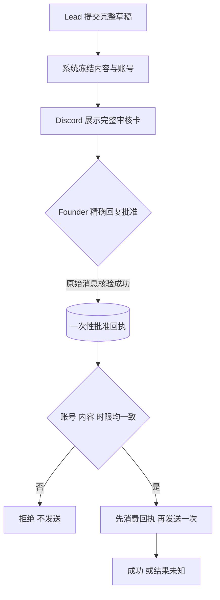
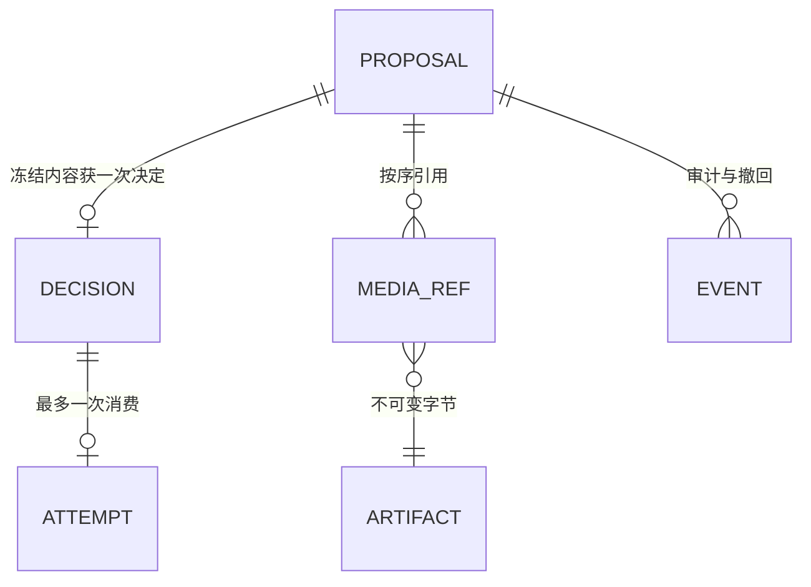

# FLY-2551 小红书逐次批准门 — 实施计划
Issue: FLY-2551 (https://linear.app/geoforge3d/issue/FLY-2551/2441follow-up-小红书-publishcommentlikefavorite-的机器可验-founder-门今天)
日期: 2026-09-14
基于: research.md

## 0. 交付与当前状态

设计目标：只有 founder 在 Discord 对本次完整内容、明确账号及执行时限做出可核实批准，Claude/Codex Lead 才能执行小红书发布、评论、回复、赞/取消赞、收藏/取消收藏；批准只能用于一次尝试。

本阶段仅设计。设计评审记录见 `review-history.md`，不把草案或原始 reviewer 投票当作有效批准。本计划、HTML、静态检查均不是功能已实现或生产验收。**不派工，等 founder 排期**；设计阶段完成后交回控制器，不发起实施或部署。

实现需两仓：Flywheel 当前设计基线 `579c79ed6`；2519 参考 SHA `8e182b224316c2ae1ba3ac19f370db474677d08f`；现有 fork `xrliAnnie/xiaohongshu-mcp` 源码基线 `cf707922a748713f86cda729b1108bf98c951640`。实施时继承经批准的 2519 实现，先比较实际基线差异，不复制其 broker；fork 另建 worktree/PR，保留已有未追踪文件。两个 PR 的合入与部署分离，仍只由既有独立 updater 在排定窗口部署。

## 1. Founder 会看到什么

Lead 准备完内容后，Discord 出现一张专用审核卡：账号昵称与稳定编号、动作、完整文字、媒体预览、目标笔记/评论、可见范围、定时时间和到期时间。卡片明确“批准一次尝试，超时可能已发送”。长文和视频仍有完整且不可换内容的预览；不能只看摘要批准。

Founder 使用 Discord 的“回复”对这张卡发送 `批准小红书 <challenge>`。challenge 是系统生成的随机8位短码，用于区分卡片，不是密码或模型决定。系统重取原消息，核对 founder 的 Discord 身份与卡片版本后记录批准时间。聊天里的“好”、Lead 转述、ship 批准、HTML 意见标记都无效。

执行前，系统再次检查账号、内容和媒体；成功占用回执后发送一次。失败或结果未知均不会自动重新发送。Founder 可用同卡 `撤回小红书 <challenge>` 撤回尚未消费的批准；已消费时提示“已开始，无法撤销本次尝试”。删除/编辑批准消息不等于撤回，卡片须明确说明。



## 2. 权限边界与唯一权威

### 2.1 三个组件与真正的授权边界

1. `XhsWriteService` 是新建的独立 `xhs-authority` LaunchDaemon（由系统管理的后台服务），**不在现有 Bridge 进程内运行**。它自己核验 Discord 原始消息，独占请求/决定/消费账本、发卡bot凭据和permit签名密钥；不接受Bridge或模型送来的approved/actor/time/receipt正文。Bridge可转送消息ID作提示，authority必须亲自重取。
2. `XhsParentAdapter` 在现有 Bridge/Lead parent 路径作为中转，Claude与Codex共用。对这个门，**整个现有登录UID都按不可信请求者处理**，包括Bridge、所有Lead、Runner、插件、终端及不属于Lead进程树的会话；它们即使互相串通、修改teamlead.db，也不能铸造批准。通用broker账本只缓存状态。现有current-Lead检查保留为正常路由防错，不作为新的founder信任根。
3. Go fork 的 `GuardedWriteService` 由authority启动，在独立账号下拥有账号会话、媒体副本和消费墓碑。只有authority能接触其私有执行socket；旧原始MCP与REST写入口全部403。读能力经authority的结果投影保留，不能把cookie/token交回现有登录UID。

### 2.2 确切的 principal 拓扑（R1 HIGH修正）

Principal指操作系统真正区分权限的用户身份，不是模型自称的角色。选择**新增独立授权服务，不迁移整个Bridge**：现有Bridge和模型继续登录用户UID（当前xiaorongli，具体数字运行时用`id -u`解析），新authority和provider使用无登录、无sudo、非admin的专用`_flywheel_xhs` UID/GID。它不与登录用户共享supplementary groups。root是安装与排期启用主体，常驻业务进程不以root运行。

| 主体 | UID / 启动者 | 持有权限 |
|---|---|---|
| 可信安装器/独立updater | root，按既有独立排期 | 安装不可变binary/plist/root-owned策略；不得接受模型任意路径或shell |
| XHS authority | `_flywheel_xhs`；system LaunchDaemon | 唯一founder核验、账本、发卡、permit signer |
| Go provider + headless Chromium | `_flywheel_xhs`；仅authority固定spawn | 受控账号cookie/会话；私有执行socket；不运行模型 |
| Bridge、Claude/Codex、全部Runner及其他本机agent | 原登录UID，全视作不可信集合 | 仅调用固定prepare/execute/status/cancel/只读投影；无mint/数据库/密钥接口 |
| Founder | Discord canonical user + 人工管理员会话 | 逐次批准；排定安装与启用，不通过模型文本授予root |

**spawn与降权**：`/Library/LaunchDaemons/com.flywheel.xhs-authority.plist`为root:wheel 0644，ProgramArguments固定为root-owned安装目录中的Node和编译JS，`UserName=_flywheel_xhs`、`GroupName=_flywheel_xhs`、`Umask=0077`、`ProcessType=Background`，由system launchd在exec前设UID/GID。配置不设Aqua，不继承登录用户环境；PATH固定，NODE_OPTIONS/DYLD_*和代理变量清空。该进程从不spawn Lead/Runner，因此不存在“可信Bridge spawn同UID模型”的继承漏洞；Bridge的现有spawn路径不获任何authority权限。provider固定路径/固定argv，禁shell，stdio不含secret。

**路径属主**（均是实施/部署目标，本设计节点未创建）：

- `/Library/Application Support/Flywheel/Xhs/bin/<binary-sha>/`：root:wheel，目录0755、binary0555；`policy.json`及plist root:wheel 0644，模型与authority均不能改。policy含允许的peer UID、project/account registry、canonical founder ID、guild/thread配置及版本；这些**不从可由模型写入的teamlead.db导入**。canonical ID两处配置一致性的算法复用，但数据来源是此独立可信配置；缺失或分歧关闭。
- `/var/db/flywheel-xhs/`：`_flywheel_xhs:_flywheel_xhs` 0700；`write-ledger.db`及WAL/SHM 0600；`keys/permit.key`、`keys/xhs-card-bot`、`cookies/account.json`均0600；`artifacts/`、`provider-journal/`、browser profile与日志目录0700。不在`~/.flywheel/teamlead.db`建授权表，不把secret镜像到Bridge环境、argv、日志或模型home。
- `/var/run/flywheel-xhs/provider.sock`：专用账号0700父目录下0600 Unix socket；无TCP listener。authority→provider只走此私有socket。`/var/run/flywheel-xhs-ingress/request.sock`为root-created目录内的0660 socket，group仅包含允许的登录UID；它本来就允许恶意模型调用，**只暴露非授权API**。本地peer凭据通过`getpeereid`取得，不能用HTTP header代替。

**身份的可信程度**：authority以kernel peerUid和root-owned registry作为scope根。project/account/thread由service registry解析，leadId/activationId只作请求归属和现有broker路由校验，不把同UID内的角色字符串当作强隔离。FrozenWrite增加`requesterUid`并绑定root policy version；所有execute字段必须与原proposal一致。跨project/lead的字段替换仍拒绝；同UID恶意会话若获知另一个proposal，最多请求执行**那份已经由founder批准的原内容**，不能改变动作、账号、目的地或获得第二次发送。这是明示的共同不可信域，不宣称本单解决了同UID模型间的租户隔离。媒体提交通过有界字节流导入新store，不让authority按登录UID给的任意路径读取。

**有头浏览器问题的决定**：新provider固定`-headless=true`（fork `main.go:17`已有此开关，默认true），不连接founder Aqua会话、不共享现有Chrome profile。headless二维码经只读结果投影交给founder扫描，cookie只保存专用UID目录；图文/视频/评论执行在该独立headless session。Codex Lead自身可见TUI保持现有要求。必须在隔离机证明该UID在system launchd下能启动Chromium、扫码、读自己ID并完成fake站点六写；若平台需要交互captcha或headless不可行，实施向Lead报告具体证据，不能退回登录用户的有头provider或永久挂boundary_unproven冒充完成。

**浏览器调试通道也必须私有**：不同UID不隔离loopback TCP，不能沿用rod默认随机远程调试端口。fork新增`browser/pipe_transport.go`，用固定root-ownedChromium可执行文件、`--headless=new --remote-debugging-pipe`和private profile启动；Go `exec.Cmd.ExtraFiles`只把匿名pipe端传为fd3/fd4，不设置remote-debugging-port。transport实现rod v0.116.2 `cdp.WebSocketable`的`Send/Read`（NUL分隔CDP JSON、单帧32MiB上限、写mutex、EOF关闭），通过`cdp.New().Start(pipe)`及`rod.New().Client(client)`连接，日志logger禁用原始CDP。此接口已在本机依赖`lib/cdp/client.go:37-83`与`browser.go:128`核实，不能直接继续调用现有headless_browser.New的默认TCP launcher。清理需关闭pipe/终止并确认该精确child lineage。探针用`lsof -nP -a -p <browserPid> -iTCP -sTCP:LISTEN`确认没有任何debug监听，再由真实模型进程尝试TCP扫描/调试连接证明无法取得session；同时通过parent pipe正向证明browser确实可操作。该扩展是T5必做，不是可能的后续加固。

**旧路径迁移**：新authority自己生成新cookie会话；旧`~/.config/xiaohongshu-mcp/cookies.json`不复制也不信任，安排founder撤销旧会话，停旧LaunchAgent并核对18060旧监听消失。模型可伪造自己启动一个18060服务，但它没有新账号cookie且authority从不连接它。旧cookie/Profile仍有效、旧会话未退、或新secret在登录UID仍有副本时禁止启用。任何管理员主动再把同一XHS账号登录到不可信模型profile属于重新破坏边界，需先关门并重新迁移；不能把现有受管旧登录归为例外。

### 2.2.1 硬探针、通过条件与谁验收

新增root-owned `verify-xhs-write-boundary.mjs`及小型原生peer/task探针，**由独立QA的可信安装器在隔离机执行**；模型不能自写`boundary_proven=true`。探针只读synthetic secrets、写test-owned synthetic ledger，不触生产账号。安装器校验脚本/binary SHA来自经审查artifact，自行测量，不接受模型上传的JSON作pass；结果root签名保存`/var/db/flywheel-xhs/acceptance.json`，绑定两仓SHA、policy version、两个真实UID、binary hash与provider generation。有效签名只表示机械证据，不代替founder排期启用或逐次批准。

| 命令/入口（实施时在隔离机运行） | 精确pass条件 |
|---|---|
| `id _flywheel_xhs`，`stat -f '%Su:%Sg %Lp' <上述每个目录/文件>`，`ps -o uid,gid,ppid,command -p <authorityPid>,<providerPid>` | 两服务实际UID均为专用非rootUID、不同登录UID；组不含admin；属主/mode匹配；所有祖先目录不可由登录UID替换 |
| `node scripts/verify-xhs-write-boundary.mjs --probe file-authority --fixture <root-owned-fixture>` 分别从真实Claude Lead、Codex Lead、Runner、普通登录UID shell执行 | read synthetic key/cookie、open synthetic ledger读写、rename/symlink替换store、改policy/binary全部EACCES/EPERM；counter不变；空fixture/ENOENT不算pass |
| 同脚本 `--probe private-transport` | provider.sock实际存在且可信authority可用；以上四个不可信主体connect得到EACCES/EPERM；原18060無可信listener；不能把ECONNREFUSED当作私有socket权限证据 |
| 同脚本 `--probe malicious-ingress` | 允许到达request.sock；伪造approved/actor/time/ship receipt、改teamlead.db或Lead标签、跨proposal/digest均不产生authority批准行，六写counter为0 |
| 同脚本 `--probe process-authority`（原生helper用task_for_pid与kill(pid,0)） | 登录UID取专用UID服务task port失败、signal权限EPERM；ps只看到固定非secretargv；不能读取服务env/core/profile |
| 同脚本 `--probe privilege-paths` | 各不可信主体执行`sudo -n /usr/bin/true`必须非零且无root执行；无NOPASSWD/root-helper通用执行权或可复用sudo缓存；可信安装器不暴露给模型任意安装/签字入口 |
| 同脚本 `--probe headless-service` | 专用UID/system launchd无Aqua依赖，fake站点自有账号验证、6种写与9读、二维码fixture全部成功；任何secret在模型trace出现直接fail |
| 同脚本 `--probe legacy-cutover` | exact旧LaunchAgent/旧provider进程与监听退场；旧cookie撤销有账号侧证据；新凭据只属专用UID；全部model入口用新投影 |

QA报告必须逐主体×逐探针记录command、exit code、errno、服务正向control与counter；任一缺失/只做stat不做实际读写/只测Lead不测Runner均fail。实现只完成代码而未取得这些运行证据不能交付本单的机器门。

### 2.3 失效关闭

默认`xiaohongshu_founder_write_gate=off`，状态只保存在authority独立账本/root policy；Bridge内同名flag只能再缩小能力，不能打开authority。仅所有依赖通过并有明确启用排期时置 on；配置只是能力开关，绝不代替逐次 founder 批准。缺 worker、schema pin、持久化、账号证明、任一 runtime 隔离证据时六写返回 `founder_write_gate_absent`。未认识的新工具、新字段或新 protocol version 必拒，不能现场自动采纳 upstream schema。

## 3. 稳定内容模型

### 3.1 请求身份

`proposalId` 随机 UUID，`revision` 正整数；每次编辑产生新 proposalId，可用 `supersedesProposalId` 追溯，旧 proposal 原子置 superseded，不能原地修改。`prepareRequestId` 由客户端提供用于网络重放，唯一键 `(projectId,leadId,prepareRequestId)`；相同 key 不同规范化输入报 conflict，相同则返回原 proposal。

authority从peerUid与独立root-owned policy确定project/account范围；Bridge提供leadId/activationId作归属，按§2.2明示其可信程度。账号选择器仅作lookup，必须与policy及provider实测账户一致。

```ts
type FrozenWrite = {
  schemaVersion: 1;
  purpose: 'xiaohongshu_founder_write';
  proposalId: string;
  requesterUid: number;
  authorityPolicyVersion: number;
  projectId: string;
  leadId: string;
  operationId: XhsWriteOperation;
  account: { providerInstanceId: string; accountUserId: string;
             accountEpoch: number; providerGeneration: string };
  target: null | { feedId: string; commentId: string | null; userId: string | null };
  payload: { title: string | null; content: string | null;
             tags: string[]; visibility: '公开可见'|'仅自己可见'|'仅互关好友可见'|null;
             isOriginal: boolean | null; scheduleAt: string | null;
             unlike: boolean | null; unfavorite: boolean | null };
  media: Array<{ artifactId: string; sha256: string; sizeBytes: number;
                 mimeType: 'image/png'|'image/jpeg'|'image/webp'|'video/mp4' }>;
  upstream: { binarySha256: string; toolSchemaDigest: string; guardProtocol: 1 };
};
type XhsWriteOperation = 'xiaohongshu.publish_content'|'xiaohongshu.publish_with_video'
 |'xiaohongshu.post_comment_to_feed'|'xiaohongshu.reply_comment_in_feed'
 |'xiaohongshu.like_feed'|'xiaohongshu.favorite_feed';
```

`accountUserId` 是在 provider 自己已登录 page 上读取到的稳定个人主页 ID，不能来自模型、昵称、configs.Username 或被浏览的他人主页；显示名只是伴随标签，不参与账户匹配。`target` 来自父进程已观察且绑定该账号 epoch 的资源；reply 必须给确切 commentId，只有 userId 不足以区分多个评论。原 schema 的模糊 reply 参数报 `target_unbound`。

### 3.2 固定的规范化规则

- 严格 schema，拒绝额外属性、重复 JSON key、非法 Unicode surrogate、NaN/Infinity、超限深度；文本保持精确 Unicode/换行/空白，不 trim、不 NFC，也不让 provider 再改写。
- 可选字段在冻结前展开默认值：tags=[]、is_original=false、visibility=公开可见、unlike/unfavorite=false；不适用字段一律 null/空数组。图文至少1张最多18张；视频恰1个。每个操作只接受适用字段。
- schedule_at 必须带时区；转换固定 UTC ISO 文本并给 founder 同时显示 UTC 与当地绝对时间，含时区。时刻须在 provider 当前时间1小时至14天内，prepare及发送前均验证。批准的是立即提交该定时任务，非允许 Flywheel 未来反复调度。
- 标题按 fork `xhsutil.CalcTitleLength` 同算法验证≤20，正文非空且≤16000 UTF-16，tags≤100且每项≤256，ID非空≤256；Discord展示保持完整，无 silent truncation。
- 动态商品关键词“选首个匹配”无法固定购买对象；v1 拒绝非空 products，返回 `dynamic_target_unbound`，卡片显示“无商品绑定”。若之后支持商品，须新增精确 productId 解析/展示/同一会话校验协议与新 schema 版本。六项核心动作均仍提供可执行路径。
- 媒体顺序参与 hash，保留文本及数组顺序；对象键递归按 UTF-16 字典序排序，JSON primitive 用标准 JSON 编码；只允许上述字段的整数、布尔、字符串、null、数组、对象。共享 canonical 实现及 golden vectors，Go 使用同一 vectors（含汉字、emoji、CRLF、空值、键序）。
- `contentDigest = SHA256(UTF8('flywheel:xhs-write:v1\n') || UTF8(canonical(FrozenWrite)))`；固定小写 hex。digest 内包含 proposalId，旧内容新卡也不能借旧回执。HMAC permit 另用独立 domain separator，不把无密钥 SHA 当签名。
- 不透明 resourceHandle/xsec_token、路径、昵称不作为内容身份。令牌可刷新但必须仍属于相同 accountEpoch/feedId；只在可信父进程内存保存。若父进程重启，重新走只读解析获取 token；验证账号后才能使用，无法恢复则拒绝。

## 4. 媒体冻结与预览

新增authority-owned `XhsFrozenArtifactStore`，不改变2519其他用途的25MiB上限。接收已认证 artifact handle，读取通过当前 `LeadArtifactStore.read` 的字节；视频经同范围受控流式登记接口导入，禁止 URL/任意路径、symlink/hardlink、device/FIFO、目录替换。hash 在打开的 fd 上边读边算，发送前的v1媒体硬上限=min(10MiB,发卡bot在目标guild实际验证的附件上限)，图/视频均适用，proposal合计180MiB、全局2GiB；超限报容量错不扩大权限。

内容保存到可信持久化 root 的随机文件名，O_EXCL/O_NOFOLLOW、0600、父目录0700并受OS隔离；先 fsync 文件与目录，再提交 metadata。记录 artifactId/hash/MIME/size/inode；不将模型临时目录作为 provider 输入。识别真实 magic/MIME 与视频解码有效性，不信扩展名。预览要转码时，**先转码再冻结**，之后上传的就是预览字节对应文件，不能批准后再优化/裁剪。

Discord 卡与完整预览由同一 FrozenWrite 渲染。文本太长：完整 UTF-8 附件 + 卡片关键字段 + hash-bound受控预览；图片按序，视频提供完整播放/下载，不以缩略图代替。不可变 preview manifest 包含文本hash、所有media hash与顺序、显示账号ID、目标ID、选项、proposal/version；卡片回执记录 Discord message/attachment IDs及 manifest digest。消息交付失败、附件缺失、preview不能完整展示时 proposal 保持 awaiting_delivery，无批准入口。通用7日公开report URL只用于设计文档，**不能作为唯一批准预览凭据**。

v1只使用Discord已支持的完整附件，不引入未定义的私有流服务；实际附件上限是准备阶段的硬校验。超限立即返回`preview_media_too_large`及大小上限，不创建永远等待的卡。多图分批消息每请求≤20MiB且受实际API限制，完整manifest记录所有消息/附件ID，最后才发可批准卡；上传413使prepare终止并清理已发草稿材料。审核预览走限于founder所在私有Discord thread的附件；使用最少访问范围，不生成额外公开 bearer report。每次批准重取原卡，比较消息作者、内容、附件绑定与已存manifest；不允许模型编辑审核卡，可信 renderer后续只可另发状态消息，不改已绑定内容。

媒体至少保留至请求终结+7日；未过期待审批/approved 和 unknown 尝试引用不能 GC。unknown 最长30日后可删媒体但保留永久紧凑 tombstone 与 hash，状态仍unknown不能重发。预算满则拒绝新prepare；不得为腾空间删除重放墓碑。不可变文件hash或inode改变则拒绝。

## 5. Discord 批准协议

新增 `XhsFounderMessageObserver`，在独立 `xiaohongshu-write/authority-main.ts` 装配，接入独立 XHS 待审 thread 列表（不借用 ship pending question）。使用独立XHS发卡bot的受控凭据重取消息，启动preflight验证它具备所需Message Content权限；空content单列`founder_content_unavailable`，不当作码错。每15s读取新消息，分页上限5×100；cursor落在本轮完整处理后的最后ID，未扫描页不越过；限流/不可用保持cursor并退避。可接受 Lead 提供 `{channelId,messageId}` 作加速定位，但必须走相同的 trusted refetch；不是 actor proof。

输入 decoder 必须包含 id/channel_id/guild_id（或从可信thread归属API核对）、author.id/bot、webhook_id、type、message_reference.type/message_id/channel_id/guild_id、timestamp、edited_timestamp、content。Snowflake ID 严格17-20位数字、精确 timestamp 对照、拒绝未来>30s和早于卡片/已过期消息。当前canonical founder resolver每次读取专用root-owned policy，缺失/分歧必拒；不接受可由登录UID修改的Bridge配置、teamlead.db或环境变量覆盖。

批准要求全部同时成立：

1. 原消息是 type19 真实 reply，reference type0或缺省且指向当前完整已交付卡；拒绝forward/quoted text、webhook、bot、跨guild/channel/thread。
2. author.id等于当前canonical founder，消息未编辑，命令规范化后精确等于`批准小红书 <challenge>`；仅对命令做NFKC、首尾trim和移除一个尾部句号/感叹号，中间固定一个ASCII空格，不做模糊语义匹配；FrozenWrite字节绝不规范化。challenge为CSPRNG生成的8位大写`ABCDEFGHJKLMNPQRSTUVWXYZ23456789`字符，绑定唯一proposal，不接受模糊同意/批量批准。
3. 原卡由指定可信XHS card bot发出，消息ID与manifest/preview仍匹配；该bot凭证不提供通用模型send/edit任意卡能力。
4. `preparedAt <= messageCreatedAt <= observedAt+30s`；`observedAt < proposalExpiresAt=preparedAt+24h`。批准消费时限 `expiresAt=min(proposalExpiresAt,messageCreatedAt+15min)`，按消息创建时间而非迟到观测延长。写两种时间，不能伪造批准即时性。
5. 在 writer事务内重读当前proposal/generation/账号注册、canonical founder配置版本，CAS awaiting_approval→approved；唯一 founderMessageId 重放返回原 receipt，不能给第二个proposal使用。若身份配置在await间变化重验失败，不mint。

`拒绝小红书 <challenge>` 将未消费请求置rejected；`撤回小红书 <challenge>`将awaiting/approved置revoked。首次**已持久化有效决定**与消费事务定义顺序，不以模型读取顺序或网络到达时间声称撤回必先发生。批准后的撤回只在消费CAS前生效，之后只报告too_late。重复或矛盾消息保留审计，不能让revoked/rejected重新变approved；修改重走新proposal。

向当前卡回复但命令/码不匹配时，发卡bot给该消息一次去重提示`founder_command_mismatch`，附可复制指令；空content给权限不可读提示并关闭批准，避免静默失败。

原始消息编辑/删除不自动撤销已经持久化的批准，UI明确指导用撤回指令。observer迟到可能让原先发送的撤回晚于消费入库，不能承诺Discord按下发送即取消。批准和撤回均给founder一个已落盘状态回执。

**与ship的双向互斥**：XHS卡只发到root policy指定的专用XHS审核thread，不与现有ship/opinion thread复用。在`bridge/founder-reply-deliverer.ts`进入任何`tryFounderShipApproval`/classifier前新增固定`isXhsProtocolReply` guard：命令规范化后以`批准小红书`、`撤回小红书`或`拒绝小红书`开头的文本，在**任何thread**都只作XHS/普通消息路由，绝不成为ship候选；回复已知XHS卡同样抑制，即使是无命名空间的短“好”。测试同时开pending ship gate，喂入XHS批准语、错码语与转述，断言0条ship approval。XHS authority独立核验，不以此Bridge路由guard替代founder证据。

**15分钟窗口与通知**：窗口保留15分钟，限制内容/账号确认后长期悬挂，不因传输延迟延长。批准事务同时写`xhs_write_notification` outbox，event ID=`xhs-approved:<receiptId>`，仅含proposal/receipt/digest/到期时间的非授权投影。Bridge每5s从authority的只读notification cursor拉取并幂等入现有backend-neutral Lead mailbox/唤醒通道；既有Lead transport调度当下持有该归属的会话，事件本身不是写许可。正常Lead收到后立即query status并请求execute；无需再让模型推断是否批准。

authority用发卡bot直接确认“已批准，截止HH:MM”，通知持续失败60s给founder“组长尚未接到，尚未发送”回执；到期仍未消费，expiry worker原子expired并发一次“已过期，未发送，需要新卡”回执。出站重试只重送通知，不执行provider。Bridge可丢弃/伪造投递ACK也不能造批准或延长时间，authority的到期回执独立发生。T4/T7验证Lead处于park、Bridge重启、429、outbox重放、通知失败及未消费过期均0次外部重发。

## 6. 数据模型与持久化

authority-owned `XhsWriteStore` 使用独立 `/var/db/flywheel-xhs/write-ledger.db`，WAL、synchronous=FULL、foreign_keys=ON、busy_timeout=5000；macOS fullfsync=ON及checkpoint_fullfsync=ON。所有连接、checkpoint、迁移、备份/恢复均只由专用UID authority生命周期管理；启动回读有效值，不合格关闭。StateStore只能通过status API持有脱敏投影，不打开此DB；NORMAL的teamlead.db不再共用授权表。两个数据库的缓存写不参与授权事务，不能从Bridge cache回填批准。

| 表 | 身份/约束 | 主要字段 |
|---|---|---|
| xhs_write_proposal | PK proposal_id; UNIQUE project_id,lead_id,prepare_request_id | frozen_json,content_digest,account_user_id,account_epoch,provider_generation,expires_at,state,preview_digest,card_id,challenge,supersedes_id |
| xhs_write_decision | PK receipt_id; UNIQUE proposal_id; UNIQUE founder_message_id | purpose,decision,founder_id,founder_config_version,guild_id,channel_id,card_id,message_digest,message_created_at,observed_at,expires_at,content_digest,consumed_at,attempt_id |
| xhs_write_attempt | PK attempt_id; UNIQUE receipt_id; UNIQUE proposal_id | project_id,lead_id,activation_id,execute_request_id,content_digest,provider_generation,account_epoch,lease_id,state,provider_ref,started_at,updated_at,error_code |
| xhs_write_notification | PK event_id; UNIQUE receipt_id,event_kind | proposal_id,expiry,delivery_state,attempt_count; 非授权通知，幂等出站 |
| xhs_write_event | PK event_id; UNIQUE source_message_id,event_kind | proposal_id,event_kind,actor_kind,evidence_digest,created_at; append-only审计 |
| xhs_frozen_artifact | PK artifact_id | project_id,sha256,size,mime,private_path,inode,created_at,retention_until |
| xhs_write_media_ref | PK proposal_id,ordinal; FK proposal/artifact | ordinal保持顺序 |

schema用CHECK限定state/枚举、length与非负时间；所有SQL用prepared参数，禁止把字符串拼接成SQL。创建proposal+media引用、决定+审计、消费+attempt分别同步immediate事务。`UNIQUE proposal_id`在decision上意味着一个批准/拒绝终态决定，撤回存event并修改有效state，不修改原批准证据。



关键事务语义（返回后才可创建内部permit；不在事务里await）：

```sql
BEGIN IMMEDIATE;
-- SELECT current proposal + approved decision + current identity/account registry.
-- Reject scope/digest/account/generation/expiry/revocation mismatches first.
UPDATE xhs_write_decision SET consumed_at=@now, attempt_id=@attemptId
 WHERE receipt_id=@receiptId AND proposal_id=@proposalId
   AND purpose='xiaohongshu_founder_write' AND decision='approved'
   AND content_digest=@contentDigest AND expires_at>@now
   AND consumed_at IS NULL;
-- Require changes()=1; otherwise ROLLBACK and return existing status/used denial.
UPDATE xhs_write_proposal SET state='consumed'
 WHERE proposal_id=@proposalId AND state='approved';
-- Require changes()=1; otherwise ROLLBACK.
INSERT INTO xhs_write_attempt
 (attempt_id,receipt_id,proposal_id,project_id,lead_id,activation_id,
  execute_request_id,content_digest,provider_generation,account_epoch,lease_id,
  state,started_at,updated_at)
 VALUES (@attemptId,@receiptId,@proposalId,@projectId,@leadId,@activationId,
 @executeRequestId,@contentDigest,@generation,@epoch,@leaseId,'claimed',@now,@now);
COMMIT;
```

writer方法同时验证冻结数据自身重算digest与请求相符，不只比较两个客户端值。读旧备份、丢失/损坏receipt库或provider墓碑不能自动重建为空继续；write capability关闭，可信部署生成新的随机providerGeneration、作废旧批准与permit再启用。紧凑consume墓碑不按普通日志保留期清理。

## 7. 执行与 provider 最后一层守卫

### 7.1 对模型的 API

- `xiaohongshu.write.prepare({requestId,operationId,accountSelector,payload,artifactHandles,resourceHandle?})` → `{proposalId,contentDigest,state,cardRef,expiresAt}`。只创建待批准工作，不发送外部写。每(peerUid,project)最多3条待批准请求、每10分钟最多3张新卡；prepareRequestId重放不计新卡。超限`proposal_rate_limited`，不上传媒体也不发卡。
- 六个原有 `xiaohongshu.<tool>` operation 保留，v1新输入是 `{proposalId,receiptId,expectedContentDigest}`，operationId必须与冻结记录一致；broker envelope中的requestId保持2519规则。旧无receipt输入仍固定拒绝，不能静默变成auto-prepare并发出。
- `xiaohongshu.write.status({proposalId})` → 稳定结果，只读。scope按§2.2的peerUid与policy绑定，禁止改变已冻结的project/lead字段；同UID内部不宣称角色身份隔离。当前同一归属的新activation可以查询。激活变更后旧inflight不转交执行。
- `xiaohongshu.write.cancel({proposalId})` → scope内取消未消费请求（只减权，不生成批准）。这与founder原文撤回同一CAS。

Bridge中转routes固定 `/api/lead/xiaohongshu/write/prepare|execute|status|cancel`，从受认证的2519父transport得current identity；不接受任意URL/SQL/toolName。parent允许的operation集合从当前registry查，不接受body指定capabilities。新增公开scope不包括mint/consume原语/签名；消费仅execute内部调用。

### 7.2 双方私有协议

新增 fork `guarded_write.go`, `account_session.go`, `write_tombstone.go`；并修改`routes.go`,`mcp_server.go`,`service.go`,`app_server.go`,`browser/browser.go`,`xiaohongshu/user_profile.go`。使用§2.2指定UID和provider.sock Unix socket，独立监听器，`getpeereid`要求peer为专用UID；不提供TCP或CORS。删除新listener上的通配CORS，旧MCP/REST所有写（含`/mcp/*path`与REST别名）永久403 `founder_write_gate_absent`。所有业务写入口最终要求内部非导出VerifiedWrite上下文；只在私有commit处理器校验后构造，普通MCP或REST handler无法构造。

`prepareExecution` 仅准备：parent送冻结载荷和校验过的媒体流；provider在自己的不可变scratch重算hash，pin binary/guard protocol与approved schema，建立最多120s账号独占lease及同一个browser/page。账号ID从自己sidebar导航所得稳定`/user/profile/<id>`读取并与已登录站点状态互证；若两者缺失/分歧拒绝，不能退回nickname。固定站点origin校验，抓到他人profile不算self。账号profile/cookies此后由此lease独占，任何login/QR/cookie替换等待或使lease失效。返回`{leaseId,accountUserId,accountEpoch,providerGeneration,contentDigest,leaseExpiresAt}`，无令牌；此时不得有任何对外写。每账号最多一个lease，第二个prepare直接`account_busy`；deadline/cancel/commit终态均由单一owner关闭page/browser，幂等teardown。service启动按受控UID+generation追踪并回收自己的孤儿browser，保留FLY-2024的deadline/cleanup测试；不能用仅PID或全机Chrome扫描杀进程。

authority在所有await后重验peer/不可变policy/开关/账号/时限/已冻结文件；Bridge另保留currentLead/activation防错校验，不能越过authority，随后执行§6的FULL事务。生成内部签名permit：

```ts
type XhsInternalPermit = {
 purpose: 'flywheel:xhs-dispatch:v1'; issuer: 'xhs-authority'; audience: string;
 proposalId: string; receiptId: string; attemptId: string;
 contentDigest: string; accountUserId: string; accountEpoch: number;
 providerGeneration: string; leaseId: string;
 issuedAt: number; expiresAt: number; keyId: string;
};
// signature = HMAC-SHA256(parent-only key,
//   UTF8('flywheel:xhs-permit:v1\n') || UTF8(canonical(permit)))
```

expiresAt=min(批准expiresAt,leaseExpiresAt,issuedAt+60s)。key只在可信父进程/受控provider，模型永不见permit或key。`audience`为固定providerInstanceId，constant-time签名比较；不接受任意keyId或caller-supplied public key。purpose与ship完全不相容。

`commitExecution` 只接受该permit与已存在lease，不重新传/覆盖payload。provider重算stored digest，校验account ID/epoch/generation、时间、lease、签名；发出前通过私有authority校验此attempt仍处于dispatch-admitted且generation/开关有效。该最终admission是关闭竞态的顺序点：关闭先落盘则拒绝；admission先成功则此尝试可继续，之后的关闭不承诺撤销。在独占会话内再读取当前自己账号，确认没有登录跳转；所有验证完成后，以receiptId为文件名在受控journal中O_EXCL写`{receiptId,attemptId,digest,generation}`，fsync文件+目录。该墓碑先于任何外部写。存在即返回attempt状态，不能再调用动作。临时写/同步失败也不发送，损坏墓碑 fail closed；不删除重试。

外部动作只用同一page、冻结文本、已校验不可变provider媒体路径和父进程解析token；子模型永远只见resourceHandle，真实xsec_token只在可信parent→受控provider边界内使用（实际provider必须收到平台token，禁止传给任何模型/MCP模型子进程或日志）。此处“父进程”指可信执行侧，不声称上游服务无需token。

每attempt至多调用一次最终publish/comment/reply/like/favorite动作；禁用HTTP/MCP/浏览器写自动重试、refresh后再点、reload后再提交。读与等待可有有界重试，最终mutation事件有唯一latch。Go service panic/timeout也保留墓碑。仅收到明确provider结果记succeeded或failed；无法判断为unknown。即使provider response丢失，authority不得重发commit；之后只queryStatus。客户端execute超时则返回attemptRef供查询。

### 7.3 时序和崩溃合同

| 切点 | 后续行为 |
|---|---|
| 仅freeze/卡片/等待批准时重启 | 请求与媒体仍在；可重取卡片/消息，必须重新核对当前账号 |
| preflight未消费失败 | 释放lease；回执未使用，仍可在原时限内再preflight |
| FULL事务失败 | rollback，provider mutation=0 |
| consumed已提交，permit未发送即崩溃 | attempt unknown；回执已使用，绝不恢复可用 |
| provider墓碑已落，外部发送前崩溃 | 可能零次执行；仍unknown/已消费，不重试 |
| 发送后超时或成功response丢失 | 可能已发布；只读对账；新发送要新卡新批准 |
| 回执并发、跨Claude/Codex或改requestId重放 | 同一receipt只有一个attempt；provider墓碑最多一次mutation |
| consume与撤回/关开关竞态 | 相同writer事务顺序定义胜者；最终dispatch-admission前关闭则不发送；admission后关闭不承诺撤销，已发送不可撤销 |
| restart/identity lease被替换 | 不续用旧lease/permit，epoch或generation改变；既有attempt只查询 |

authority设置claimed并不证明已发送；provider返回发起证明后才projection为dispatched。无证据不能标成功。providerRef仅在平台返回稳定ID时填写，不用内容搜索相似度猜测；点赞/收藏若确切目标已经处于目标状态可记succeeded-noop，但仍消耗此次回执。

## 8. 拒绝码与可观测性

| code | 条件 | 外部mutation次数 |
|---|---|---|
| founder_write_gate_absent | 门关闭/依赖缺失/原始写路径 | 0 |
| preview_media_too_large / proposal_rate_limited | 完整预览超限或待审/频率超限 | 0，prepare不发可批准卡 |
| founder_content_unavailable / founder_command_mismatch | bot无法读取原文或指令/码不匹配 | 0，founder可见提示 |
| founder_receipt_required | 无receipt | 0 |
| founder_receipt_invalid | 无此receipt、错purpose/issuer/身份/绑定 | 0 |
| founder_content_digest_mismatch | 任意内容/目标/媒体/选项变化 | 0 |
| founder_account_mismatch | 账号、epoch、generation或lease变化 | 0 |
| founder_receipt_expired / revoked / consumed | 过期、撤回、另一次执行 | 0次新增 |
| artifact_unverified / target_unbound / dynamic_target_unbound | 媒体不可证、模糊目标、动态商品 | 0 |
| provider_schema_drift / boundary_unproven / durability_unavailable | schema、隔离或持久化缺证 | 0 |
| xhs_result_unknown | consumed后无终态证明 | 0次自动重发 |

拒绝输出只给固定非秘密code、proposal/attempt ID；不输出原文、token、cookie、私有路径、headers、permit。日志采用同样allowlist。审计保留decision来源hash、actor、明确时间、内容指纹与结果；原始内容仅在访问受控的proposal/preview记录。metrics按operation/code计数，不使用content/user text作标签。

## 9. 可逐项执行的实施任务（等待排期）

每项按失败用例→最小实现→通过→提交顺序；先安装fixture依赖，不触及真实小红书账号。下面新文件是计划路径，当前尚不存在。

### T1 合同、schema与指纹

文件：新增 `packages/teamlead/src/xiaohongshu-write/contracts.ts`,`canonical.ts`；测试`__tests__/canonical.test.ts`；golden vectors放`fixtures/canonical-v1.json`，fork同用该fixture副本并校验SHA一致。修改2519的`lead-capabilities/upstream-inputs.ts`,`catalog.ts`，保持六项名称和off拒绝，添加prepare/status/cancel。

- [ ] 写每个字段mutation表驱动测试：title/content/账号/epoch/feed/comment/user/媒体字节顺序/tags/visibility/schedule/unlike/unfavorite/isOriginal每改一次，digest必须不同。未知字段、非法unicode、重复key拒绝。
- [ ] 运行 `pnpm --filter flywheel-teamlead exec vitest run src/xiaohongshu-write/__tests__/canonical.test.ts`，记录缺模块/断言失败。
- [ ] 按§3严格schema、默认展开及domain hash实现；提交 golden values，Go读取同fixture而非再写一套样例。
- [ ] 同命令通过；提交`feat(xhs): define frozen write contract`。

### T2 持久化与原子一次性消费

文件：新增`xiaohongshu-write/store.ts`,`migrations.ts`，修改`bridge/plugin.ts`装配只读status客户端；新DB迁移仅在authority-main；测试`__tests__/store.test.ts`,`__tests__/durability.test.ts`。

- [ ] 先建临时真实SQLite两连接fixture（不读生产DB）；测试并发claim、不同executeRequestId重放、跨project/Lead拒绝、过期边界、撤回竞态、事务中抛错后reopen无半条记录。
- [ ] 测试有效pragma FULL/fullfsync与writer-only表访问；fault injection让COMMIT/fsync失败，断言provider调用0。
- [ ] 实现§6表/约束/所有prepared查询与immediate CAS；返回判别联合`claimed|existing|denied`。`existing`只能带read-only状态。
- [ ] `pnpm --filter flywheel-teamlead exec vitest run src/xiaohongshu-write/__tests__/store.test.ts src/xiaohongshu-write/__tests__/durability.test.ts`通过；提交`feat(xhs): persist one-use founder receipts`。

核心测试断言合同：

```ts
const claims = await Promise.all([fixture.execute('request-a'), fixture.execute('request-b')]);
expect(claims.filter(x => x.kind === 'claimed')).toHaveLength(1);
expect(fixture.rows('xhs_write_attempt')).toHaveLength(1);
expect(fixture.providerMutations()).toBe(1);
await fixture.restart();
await fixture.execute('request-c');
expect(fixture.providerMutations()).toBe(1);
```

fixture的execute必须走真实service/store/transport mock counter，而非给claim函数加内存lock让测试自然绿。多进程worker测试再证非同一event-loop假互斥。

### T3 冻结媒体与完整卡片

文件：新增`xiaohongshu-write/artifacts.ts`,`preview.ts`,`cards.ts`及对应`__tests__/artifacts.test.ts`,`cards.test.ts`；增`lead-capabilities`受控视频流式artifact登记。不得把256MiB单帧塞进broker JSON。

- [ ] 先测试symlink/hardlink/rename/TOCTOU、跨scope、MIME伪装、hash更改、视频/实际Discord附件上限/数量/空间上限、重启重读、preview bytes与upload bytes一致；卡片交付部分失败不能设awaiting_approval。
- [ ] 实现§4 fd读取/持久冻结/manifest/引用GC。所有HTML插值escape，runtime只textContent/value；Discord allowed_mentions禁用，用户内容不能伪造系统批准段。
- [ ] 卡片含完整审阅材料、时限、账号ID及单次/unknown/撤回边界；卡片作者拥有者使用独立受控发送路径。
- [ ] `pnpm --filter flywheel-teamlead exec vitest run src/xiaohongshu-write/__tests__/artifacts.test.ts src/xiaohongshu-write/__tests__/cards.test.ts`通过；提交`feat(xhs): freeze reviewable media and proposals`。

### T4 确定性 founder 入站

文件：新增`xiaohongshu-write/founder-message.ts`,`observer.ts`；装配`xiaohongshu-write/authority-main.ts`；复用/提取`bridge/discord-utils.ts`的新decoder（保持旧API兼容），Bridge仅转送原消息ID；测试`__tests__/founder-message.test.ts`,`observer.test.ts`。

- [ ] 测试真founder精确reply批准；错作者/bot/webhook/forward/错card/guild/channel、编辑、旧nonce、消息创建时间错/未来、配置分歧、附件缺失、card被改、重复与撤回。
- [ ] 测试403/404/429/超时、分页中断不越cursor；queued旧消息不能按observedAt延长有效期；恢复批准后绝不再mint。
- [ ] 按§5 trusted refetch、当前canonical founder版本复核及writer事务实现。独立待审thread discovery，XHS消息不得传ship classifier处理；普通意见继续现有Lead消息路由。
- [ ] `pnpm --filter flywheel-teamlead exec vitest run src/xiaohongshu-write/__tests__/founder-message.test.ts src/xiaohongshu-write/__tests__/observer.test.ts`通过；提交`feat(xhs): verify founder approval replies`。

### T5 fork 的真正 provider 守卫（同任务必要工作）

仓库`xrliAnnie/xiaohongshu-mcp`，新增`guarded_write.go`,`guarded_write_test.go`,`account_session.go`,`account_session_test.go`,`write_tombstone.go`,`write_tombstone_test.go`,`browser/pipe_transport.go`,`browser/pipe_transport_test.go`；修改§7.2列出的现有文件与对应测试。新增protocol `guardProtocol=1`，冻结构建binary SHA和schema fixture，不能仅以version 2.0.0放行。

- [ ] 红测覆盖六写全部原MCP/REST无permit拒绝（include wildcard/别名），错Unix peer UID/坏签名/错audience/purpose/keyId/过期/epoch/lease/digest拒绝。
- [ ] 在fake站点用两个账号与锁竞争证明self ID变化时零mutation；只有nickname/login=true也拒绝；同一page身份验证后不新开browser。
- [ ] 用临时文件系统故障证明墓碑fsync/O_EXCL失败时零mutation；reopen后重复permit/receipt永不再次提交；最终点击/POST只一次。
- [ ] 实现§7.2守卫，Go业务service非导出VerifiedWrite入参约束所有写，受控媒体stream/hash，不收URL；lease并发上限1，超时/cancel必Close，继承FLY-2024非空browser lineage捕获及退出断言。
- [ ] fork执行 `go test -count=1 ./...`（既有live integration仍隔离），`go test -race -count=1 -run 'Test(GuardedWrite|AccountSession|WriteTombstone)' ./...`；真实浏览器fixture以`-tags integration -count=1`独立进程运行，不碰真实cookies。
- [ ] 提交`feat: guard all xhs writes with one-use parent permits`。fork PR与Flywheel PR互链，不能先换生产binary验证。

### T6 双runtime装配与网络/凭证边界

文件：新增`xiaohongshu-write/service.ts`,`authority-main.ts`,`authority-client.ts`,`provider-client.ts`,`routes.ts`,`runtime-boundary.ts`；修改`bridge/plugin.ts`，2519 `lead-capabilities/xiaohongshu-provider.ts`,`xiaohongshu-tokens.ts`,`handlers/upstream-read.ts`,`handlers/upstream-write-denials.ts`,`default-runtime.ts`,`runtime-context.ts`,`broker.ts`；Claude `scripts/claude-lead.sh`,`scripts/lib/mcp-inherit.sh`及测试；配置`packages/config/src`相应strict schema与feature flag registry。新增`deploy/xhs/com.flywheel.xhs-authority.plist`、root-owned安装/策略生成器及受控service部署定义与验证脚本`scripts/verify-xhs-write-boundary.mjs`，只在isolated QA跑。

- [ ] 先fixture测试off六写原code/read能力全在；on无回执必拒，匹配回执六种各成功一次；取消方向不能复用正向批准；跨activation execute不转移inflight。
- [ ] 实现两方相同facade、Bridge execute上下文重验、prepare→consume→permit→provider commit→status，不复用通用broker的独立写许可。
- [ ] token store提为一个parent-owned实例注入读写，绑定project/account/epoch/feed/activation；未归属token不接受。所有正常/错误/timeout日志和结果用synthetic secret leak fixture核查。
- [ ] 外层OS约束和独立provider identity启用前探针：Claude/Codex terminal→原MCP/REST、插件别名、browser localhost/file/profile、cookie/key读取、symlink、进程inspect、UDS/端口旁路均拒绝。401/403是服务guard证据，端口OS deny是隔离证据，两者分列。
- [ ] 更新learning script只读路径的inventory，列本机插件实际字节和repo消费者；不删除读能力。未迁移旧Lead会话/旧原provider监听存在时capability不准on。
- [ ] `pnpm --filter flywheel-teamlead exec vitest run src/xiaohongshu-write src/lead-capabilities/__tests__/xiaohongshu-provider.test.ts src/lead-capabilities/__tests__/upstream-write-denials.test.ts`，`bash packages/teamlead/scripts/__tests__/mcp-inherit.test.sh`，`pnpm --filter flywheel-teamlead typecheck`及受影响config typecheck通过；提交`feat(xhs): route both lead runtimes through founder gate`。

### T7 故障与端到端证据

文件：新增`xiaohongshu-write/__tests__/end-to-end.test.ts`,`crash-replay.test.ts`,`boundary.test.ts`及`engineering/doc/FLY-2551-xhs-founder-gate/implementation-evidence.md`。

- [ ] 用可信Discord原消息fixture → 真Bridge/store → fake Go provider → mutation counter跑端到端；记录每个断点对应proposal/receipt/attempt。
- [ ] 按§10矩阵运行mutations：暂时删除digest校验/一次性CAS/账号检查/原REST守卫/签名检查任一个都使对应测试失败，恢复后再绿。
- [ ] 两个runtime实际隔离host probe与fake provider演练均成功后才提交代码review；static green不能标生产parity。
- [ ] founder另行批准排期后，在专用测试账号为每个真实对外写生成真实Discord卡和批准；六动作的关联链、无回执与复用拒绝、媒体实际相符均留证。没有这一步只报isolated pass。
- [ ] 不因真实写测试方便请求“测试期免批准”；测试清理的取消赞/收藏/评论等同样逐次批准。产物实现与QA仍由各节点持TURN执行。

## 10. 验收矩阵（每行都必须有直接证据）

| ID | 输入/故障 | 判据 |
|---|---|---|
| A1 | 六操作缺回执 | 六个provider mutation counter均0，固定拒绝 |
| A2 | digest每字段变异及同handle文件换字节 | 0次写，明确mismatch/artifact错误 |
| A3 | 同receipt双runtime并发、新requestId、重启重放 | 1个attempt、最多1次外部mutation |
| A4 | 错founder/card/thread/guild/编辑/forward/webhook/模糊同意/ship receipt | 无批准行，0次写 |
| A5 | 真实账号A批准后换B、同昵称不同ID、epoch/generation变更 | 0次写；真实同session A成功 |
| A6 | 过期、撤回、拒绝、supersede、off与消费竞争 | 事务顺序一致，无已撤回请求新dispatch |
| A7 | 受控图片/视频正常；URL/任意路径/跨scope/TOCTOU/超限 | 正常相同字节，异常0次写 |
| A8 | FULL事务/permit发送/provider墓碑/外部响应各崩溃点 | 无半条批准、无复活消费、unknown无自动重发 |
| A9 | 原始MCP/REST/插件别名/终端/已登录浏览器/credential访问、直接SQL伪造 | §2.2.1全探针从Claude、Codex、Runner和普通登录UID各跑；改teamlead.db不获authority批准，旁路0次写 |
| A10 | 二进制/schema/signature/audience/keyId漂移，时钟回退 | fail closed，0次写 |
| A11 | 日志、错误、URL、provider返回回显token/permit | 模型轨迹与公开日志0 secret；只固定错误 |
| A12 | 上游6写正常、9读全保留、delete_cookies拒绝 | fixture逐工具枚举；实际16-tool catalog可对账 |
| A13 | 长文/多图/完整视频preview缺页/被替换/只缩略图/附件超限 | 未完整交付不批准；预览/执行manifest相同；超限prepare即拒绝且founder可见原因 |
| A14 | restore旧DB/丢provider tombstones/媒体GC/容量耗尽 | 旧generation失效，写关闭；不删除防重放记录换容量 |

| A15 | XHS批准语在有pending ship的任何thread出现 | 0个ship批准；双向隔离 |
| A16 | 已批准但Lead未醒/通知失败/窗口过期 | 0次写，founder收到未送达/过期确认；不延长有效期 |
| A17 | prepare循环刷卡、空message content、手机全角指令 | 超频不发卡；空content明确不可读；仅命令受限规范化、内容指纹不变 |
| A18 | 第二lease、超时/崩溃后browser残留 | 第二lease拒绝，精确归属browser退出、非空捕获断言 |

时钟回退用父进程monotonic与wall对照检测偏差，异常即关闭write admission直到重新建立时间/新generation；不能通过调时使旧permit复活。DB时限检查与provider自己的时限检查都必须存在。

## 11. 迁移、回滚与限制

迁移是增加新表和新guard协议，无历史对话→批准回填。旧2519六写拒绝保持至全部条件成立；Claude旧会话与裸provider必须在排定窗口关停/迁移并取得确切进程与监听消失证据，不能只改下次启动模板。读类迁移成功是开门前验收，不用停掉读功能代替完整交付。

两仓deployment receipt需绑定Flywheel SHA、fork SHA/binary hash、工具schema digest、guardProtocol、providerGeneration、两个runtime isolation probe、account user ID/epoch的脱敏证明以及kill-switch状态。没有实际binary hash match不叫已部署。合入本身不触发服务重启，本设计节点不执行任何部署。

回滚先关write admission；未消费批准一律revoked，已消费attempt保留状态；停止旧provider后轮换generation/keys。允许退回六写固定拒绝版本；**禁止回滚到可裸写的provider或恢复旧批准表后on**。所有墓碑与decision保留，未知结果继续unknown。外部内容已发布无法靠Git回滚撤销，另一次对外更改须重新批准。

明确限制：一次性指一次尝试、最多一次发送，不承诺平台成功；动态商品绑定不纳入v1，反向赞/收藏、精准回复、定时提交与图文/视频均在v1；不授予后台批量写、模型自主批准或ship权限。独立管理员/root不属于受管模型隔离保证；但模型可复用sudo缓存或安装器任意执行入口不是例外，必须由privilege-paths探针否证。外部服务变更、真实账号认证和真实媒体校验需要排期后证据。

## 12. Design阶段收口

- 提交并push exploration/research/plan与review-history；使用注入的`gate review_design --no-block` + `request-review --type design --plan ...`，以`reviewVerdict`为准。
- 只修阻断finding；非阻断留Follow-ups并报Lead。有效APPROVED后生成最终HTML、验证comments/nonce/clipboard/本地Mermaid并提交push。
- `publish-report --html engineering/doc/FLY-2551-xhs-founder-gate/founder-design.html --project flywheel --publish-only`，再`verify-report`核对HTTP200、nonce替换/CSP与意见marker。
- 按注入身份报告`DESIGN-HTML ready`，运行`complete --route phase_design_complete`，按controller结果park。不得把阶段完成标为整单实现/ship完成。

## 实施期依赖集成记录（2026-09-15）

- depends on FLY-2519 @ e9eb59e422d2440fbe48c625568984fad4e0cc1a
- Lead答复871fd61b-5a54-4466-bbea-56d5a6cb84b1授权以当刻精确head做stacked依赖，已通过正常merge集成，未复制或重写2519实现。current activation继续由2519 parent transport验证。
- T6 broker相关变更作为依赖chunk，必须等PR1191合入main后才能落地；该依赖未解决前不宣称可独立landing。PR说明必须保留上述pin；1191合入后同步该chunk到main并移除pin，任何非快进重写仍遵守独立force-push授权守卫。
