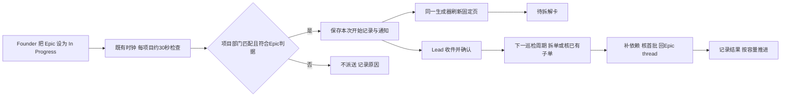

# FLY-2557 Epic 自动入口 — 实施计划
Issue: FLY-2557 (https://linear.app/geoforge3d/issue/FLY-2557/epic-流程intake-epic-进-in-progress-自动触发拆解bridge-监听-linear-epic无)
日期: 2026-09-14
基于: research.md

设计状态: APPROVED（R2；effective reviewVerdict=APPROVED，2026-09-14）
设计基线: f31b75af9；节点 eng_design；execution 6e76e8b9-4193-44c2-b3c0-4f385968403c。

## 一、Founder 会看到什么
把符合项目标签的 Epic 设为 In Progress 后，Bridge 在既有时钟上发现它，可靠通知该项目 Lead，并在固定页显示「待拆解（intake 于 时间）」。Lead 收到通知后，最迟下一巡检周期读全文、拆子单或核已有子单、补依赖关系、回 Epic thread，再按容量拉活。

Epic 是包含一组工作的父单。intake 是把这个父单正式交给 Lead 的收件记录。ACK 是 Lead 确认已处理本次收件消息；它不等于拆解工作已经做完。依赖账本记录哪些工作必须先完成。



范围保持：Bridge不自动替Lead拆单；ready.v1对子单的判定、dependency语义、Epic外founder approve、ship授权和独立updater部署均不变。设计节点只交付本文及评审/HTML；以下代码工作由实施节点执行。

## 二、已裁定选择
采用 research.md 中问题 `e817bcdf-a903-4427-acea-c51da93abbcd` 的Lead裁定：

1. Bridge没有生产webhook绑定，不跨接EdgeWorker。复用GatePoller 3s时钟，每项目约30s检查，位置在Lead suppression之前；其余60分钟巡检gate不变。
2. `startedAt`定义为stateHistory中连续started类型段的起点；stable UID恰为 `epic_intake:<issueUuid>:<startedAt>`。
3. 首次启用当前started每Epic一条，`backfill=true`。Lead只核依赖账本并回一句thread，不重新拆。历史Done/Canceled不补通知。
4. 后续真实重新进入started正常收件。状态在started类别内改名/换子状态不算重入。
5. R1 HIGH处理采用Lead问题`cde17197-6e08-4136-9aa0-03058c2e5b98`及其后续修订 `[lead-instruction da084518-89ac-4ddc-a8ba-231d67cad46e]`：Epic必须同时满足无parent、department label、started，并且 **有至少一张子单，或在本项目无Flywheel dispatch记录（StateStore sessions和workflow_run都无该issue记录）**。有子单的真Epic即使跑过Runner仍纳入；零子单且已派过Runner的普通单排除。不新增Epic标签，不更改founder设置In Progress的入口。后续新增dispatch记录只令仍为零子单的根失效；有子单的根仍符合。

拒绝：本机观察时间做UID；只看相邻快照；用issue.updatedAt；用不同的issue.startedAt与span.startedAt混合去重；新timer；让runner `/events` 的token提交intake；默认首位Lead兜底；只移除children过滤而保留页面/巡检抑制；ACK即业务完成。

## 三、状态身份、查询与路由

### 3.1 查询合同
扩展 `bridge/linear-epic-query.ts` 的同一采集器，保留一个项目边界解析器及一个生成器，不复制查询到独立intake服务。新增只读采集阶段 `collectEpicScope`，由原 `fetchLinearActiveScopeSnapshot` 门面使用；所有manual/event/scan调用共用它。

- 活跃根查询：team、可选Linear project、可选binding.label、parent=null、state.type=started；移除必须已有子单和必须存在「日常」根的全局前置条件。增加`children(first:1, includeArchived:true){nodes{id} pageInfo{hasNextPage}}`只读判据（任一真实子单即满足，包括终态/归档子单，不按子单department过滤），并按§3.4与本项目dispatch账本合成最终Epic集合；不能直接把全部parent=null结果当Epic。
- intake候选：相同项目边界，parent=null，`updatedAt >= lastSuccessfulScanStartedAt - 120s`，不加started过滤；并按UUID重查所有pending episode根。这样扫描之间 started→backlog→started 或 started→backlog不会因为最终状态被过滤而漏掉。
- 冷启动/首次启用尚无watermark时完整分页当前started根；持久化bootstrapStartedAt后开始采集。首次快照内早于bootstrapStartedAt的当前段为backfill；晚于它的段按正常事件处理，避免启动期间新需求被降为backfill。
- 针对候选读取 `stateHistory(first:50, after:$cursor)`，分页到完整覆盖watermark以前的相邻段；第一次读取该issue需完整历史。根、label、历史和子单分页均验证pageInfo、重复cursor、上限和GraphQL errors。
- root必须保留 `{id,identifier,title,url,parent,team,project,labels,state,updatedAt,stateHistory,hasChildIssues}`；metadata和所有时间字段边界验证；stateHistory.state为空、非法日期、重叠矛盾段或分页不完整：该issue `intake_history_unavailable`，不编造时间、不提交其扫描进度。
- 原子发布watermark仅发生在这一项目候选页完整且所有候选成功处理后；某个候选失败可提交其它候选的幂等episode，但保留旧watermark重试。watermark使用扫描开始时间，避免网络await期间发生的变化落在窗口之外。
- 查询窗口是发现优化，episode UID永久去重。对已知根保留最新state span id，每轮检查pending根，定期完整根扫描仍沿用原巡检调用。归档/删除根不抹历史收据。
- 如果当前为Done/Canceled，不从它的历史追加intake。当前backlog但启动后有新started段，记录该段并标记inactive，保留「进过started」事实但Lead不得据此启动工作。直接Done/Canceled且无started段从来无事件。

SDK60没有stateHistory类型时，用现有raw GraphQL request +显式DTO校验，不升级SDK。query variables参数化；不得拼接用户输入到GraphQL文本。

### 3.2 连续段算法
按 `(startedAt,id)`排序并校验完整、不相互矛盾的状态跨度。相邻段的 `previous.endedAt === next.startedAt` 且两者state.type均为started时合并；段起点取第一个span.startedAt。相同state span重复合并前按id去重，冲突版本使该issue不可读。每个非started→started区间对应一个UID；不得对started→started创建第二个。将时间统一为UTC毫秒ISO；使用源span时间，不使用本地时钟。

```ts
type EpicEpisode = {
  eventUid: string; issueUuid: string; identifier: string;
  startedAt: string; sourceSpanIds: string[]; intakeAt: string;
  projectName: string; leadId: string; bindingDigest: string;
  backfill: boolean; active: boolean;
};
// key = `epic_intake:${issueUuid}:${startedAt}`
// intakeAt = 首次事务接受此段的时间；重扫不改。
// active = 此段仍是当前started段且当前项目/department/root/§3.4 Epic判据仍成立。
```

为防混淆，保存输入span id和上游观察时间供审核；issue顶层startedAt可作为诊断，但绝不参与UID。一个真实例子见research.md（29ms差异）。快速往返、首次创建3分钟内转换必须在隔离Linear项目验证；只读样例不能替代此验证。

### 3.3 严格路由与失效
对一个候选先判所有已绑定project边界，再用 `DepartmentRegistry.classifyIssue/resolveCanonicalLead`；只有唯一project及one department结果才收件。Flywheel来自配置 `{team:FLY,project:Flywheel,label:Flywheel}`和对应lead.match.labels，不硬编码Lead人名或首位索引。

无binding、无department label、多department、多project匹配、parent非空、禁用/非dispatch Lead：不收件，产生有界可观察原因。缺runtime则已确定owner的journal留待现有队列重驱，不能换给其它Lead。intake UID首次记录后owner冻结；改label/项目导致旧episode失效，不把同UID重新投另一Lead。新project/new owner只在新的started段重新收件。当前元数据决定本次扫描的路由；过去已失效的段不授权当前派工。

同一采样中当前不在范围（包括零子单根新增本项目dispatch记录）的pending根标inactive；页面不继续宣称在做，Lead结束旧episode时记 `superseded`。重新进入started以新UID处理；Lead再次fresh读状态后才有业务动作。

### 3.4 Epic判据与dispatch记录边界（R1 HIGH修复）
单一函数 `isIntakeEpic({hasParent,departmentMatches,stateType,hasChildIssues,hasProjectDispatch})` 由候选准入、页面根过滤及pending失效检查共用：

```ts
return !hasParent && departmentMatches && stateType === 'started'
  && (hasChildIssues || !hasProjectDispatch);
```

`hasProjectDispatch`只读StateStore两类记录，按Linear UUID及其已核实identifier/已有`workflow_run_issue_alias`解析；不以标题、状态变化时间或消息内容猜身份。`sessions.project_name`和`workflow_run.project_name`必须等于当前项目。sessions命中`issue_id`或`issue_identifier`；workflow_run命中`issue_id`或该run的已保存issue_alias。二者任一存在即true；不按running状态过滤，pending、失败或终态记录也算dispatch；其它项目同显示号不算。SQL参数绑定，使用现有alias resolver，身份冲突/账本不可读为unknown并拒绝本轮零子单准入，不能把查询失败当无记录。

新增 `StateStore.hasEpicDispatchRecord(projectName, issueUuid, identifier)`，原始列证据：StateStore.ts sessions建表在6124，workflow_run在26571，alias表在26591。同步给原共用snapshot采集器注入该只读依赖；根集合过滤后再生成页面/receipt/ready范围，不能只在event投递处过滤而让普通单照样出现待拆解卡。

事务提交`recordEpicIntake`前再次检查本项目dispatch记录，避免Linear采集await期间新runner启动仍准入零子单根。写入后已有pending根每次扫描都重查本地dispatch：若新增记录且仍无子单，置inactive、page_dirty=1并停止该episode的待拆解/pending投影；已经入队的旧消息由Leadfresh检查后只收件确认并按superseded收口，不继续拆单。有子单时dispatch历史不令其失效。所有准入和失效使用同一布尔规则。

这一判据是Lead明确选择的产品范围，不声称sessions空能证明状态修改actor。零子单、从未派发的root仍按此规则视为Epic，即使标题不像Epic；不再添加标题前缀或新的标签要求。

| 子单存在 | 本项目session或workflow_run存在 | 其余三项成立时 |
|---|---|---|
| 是 | 是或否 | 收件；已有子单只补账本和回帖 |
| 否 | 否 | 收件；首次为backfill、正常新段由Lead判断拆解 |
| 否 | 是 | 不收件、不显示待拆解、不生成founder问题 |
| 未知 | 任意 | 本轮不可判定，不伪装零子单 |

## 四、持久化、通知与业务结果

### 4.1 StateStore新增表（additive migration）
```sql
CREATE TABLE IF NOT EXISTS epic_intake_scan (
  project_name TEXT PRIMARY KEY,
  bootstrap_started_at TEXT NOT NULL,
  bootstrap_completed INTEGER NOT NULL DEFAULT 0,
  last_successful_scan_started_at TEXT
);
CREATE TABLE IF NOT EXISTS epic_intakes (
  event_uid TEXT PRIMARY KEY,
  issue_uuid TEXT NOT NULL,
  started_at TEXT NOT NULL,
  project_name TEXT NOT NULL,
  lead_id TEXT NOT NULL,
  binding_digest TEXT NOT NULL,
  identifier TEXT NOT NULL,
  intake_at TEXT NOT NULL,
  observed_at TEXT NOT NULL,
  source_span_ids TEXT NOT NULL,
  backfill INTEGER NOT NULL CHECK(backfill IN (0,1)),
  active INTEGER NOT NULL CHECK(active IN (0,1)),
  work_state TEXT NOT NULL CHECK(work_state IN ('pending','complete','needs_founder','superseded')),
  lead_event_seq INTEGER NOT NULL,
  result_json TEXT,
  page_dirty INTEGER NOT NULL DEFAULT 1,
  UNIQUE(issue_uuid, started_at)
);
CREATE INDEX IF NOT EXISTS epic_intakes_pending
  ON epic_intakes(project_name, lead_id, work_state);
```
不在新表保存认证凭据；`source_span_ids/result_json`长度受限且严格JSON验证。全局UID唯一性补足lead_events只按(lead_id,event_id)去重的边界。保留episode/tombstone去重索引跨lead_event归档；不纳入普通消息保留期删除。

`StateStore.recordEpicIntake(input)`在一个better-sqlite3事务中检查全局UID：存在则返回原seq和原owner，不更新原payload；不存在则在同一短事务重查§3.4本项目dispatch谓词，仍符合才appendLeadEvent并insert episode，失败整体回滚。这一批成功时再更新scan cursor。所有SQL用bound parameters。

通知payload包含 `event_type:'epic_intake', project_name, issue_id:<identifier>, execution_id:'system:epic_intake:<issueUuid>', epic_intake:<上述DTO>`；sessionKey固定为 `system:epic_intake:<projectName>:<issueUuid>`，不注册伪runner session。正文包含Epic链接、段起点、intake时间、是否backfill、下一巡检期处理承诺以及既有batch ACK提示。

### 4.2 既有队列与崩溃恢复
提交后从原journal row用 `leadEventEnvelopeFromJournalRow`重建，再 `RuntimeRegistry.enqueueLeadEvent`。保留显式eventId，因此deliveryId=`lead_event:<leadId>:<eventUid>`；不使用扫描时的新标题拼消息。

必须同步修改：
- `StateStore.listUndeliveredLeadInboxEvents` active allowlist加epic_intake。
- `legacy-lead-event-reconciler.ts`/`lead-inbox-runtime.ts`针对新payload的验证与毒消息隔离：只隔离确定性无效数据，保留可审计原因；SQLITE_BUSY/IO/owner fence错误继续重试。
- `hook-payload.ts`新增 `formatEpicIntake`，`mailbox-lead-runtime.ts`和`commdb-lead-runtime.ts`分支都调用；Claude/Codex使用同一内容。
- 新事件保持 `ack_required=0`，不启用legacy token ACK。真正收件证据为CommDB mailbox ACKED/acked_at，delivered_at仅适配器投递。

崩溃矩阵：事务前/事务内=无部分事件；提交后入队前=allowlist重驱；入队后回写前=canonical delivery ID去重；ACK后业务前=pending表继续进巡检；业务结果后重投=读取result只ACK、不重复拆/回帖；页面生成/上传失败=page_dirty留存，在同一时钟重试。

### 4.3 Lead业务完成记录
新增极小Lead-only命令 `flywheel-comm epic-intake show|resolve`，共用现有Bridge Lead认证中间件，Runner/anonymous/错项目/错Lead全部拒绝；不暴露producer命令或producer HTTP接口。

```
node "$FLYWHEEL_COMM_CLI" epic-intake show --project "$PROJECT_NAME"
node "$FLYWHEEL_COMM_CLI" epic-intake resolve --project "$PROJECT_NAME" \
  --event-uid '<exact uid>' --evidence-file <local-json-file>
```
新增 `packages/flywheel-comm/src/commands/epic-intake.ts`，`index.ts`注册；Bridge `bridge/epic-intake-route.ts`提供GET `/api/epic-intake`及POST `/api/epic-intake/resolve`。事件UID作为JSON字段，绝不从URI路径猜身份。

证据JSON固定字段：`outcome:complete|needs_founder|superseded`, `childIssueIds:string[]`, `firstBatchIssueIds:string[]`, `ledgerObservedAt:ISO`, `threadId:string`, `messageId:string`, `founderQuestion:string|null`。这是Lead完成判断的持久化声明，不是机器证明所有依赖语义正确。

服务端：验证调用身份与冻结owner/project；限制文件<=16KB、数组<=500、首批为子单子集、去重ID；重新检查当前root/segment与child parent关系；完成时核对对应Epic canonical threadId，消息ID必须存在于该thread且属于该Lead（复用chat-thread读取helper，以配置bot凭据读取，不信调用方正文）。requires future valid ledger time <=当前且不超过当前项目巡检周期；若不可读返回可重试错误，不能伪记录complete。`needs_founder`必须有非空question及已发thread消息；仍在后续patrol出现为待回答，不能假装拆解完成。`superseded`必须有当前scope/segment已失效的服务端证据；不要求仍在当前子单集合。

先做外部读取，再在短事务内重新比较episode active/segment、owner、work_state；若期间已变更返回409。重复同一结果返回原记录；不同结果不静默覆盖，needs_founder→complete允许原owner带新证据推进。无此记录则业务pending保持。resolving本身不发送Discord、不启动Runner、不写Linear。

### 4.4 Lead规则§0.11（实施时写入的内容）
收到epic_intake后：核本项目/本Lead及当前started段，读到pending持久化记录后即视为收件处理完成，按现有batch纪律ACK本批（包括处理完同批其它消息）；ACK不可删除pending工作。下一巡检周期内完成以下顺序，也可当轮立即处理：

1. 读Epic全文和完整children列表，不能只读tick标题；确认仍无parent、仍在本次started段及匹配项目/department，并重新核对§3.4：有子单或无本项目dispatch记录。零子单根后来被派发则不再拆，按superseded处理旧通知。
2. `backfill=true`：只核依赖账本和已有子单、回一行thread；不因补收事件自动拆解。符合§3.4且零子单时回一行「待拆解」并由Lead决定下一动作，不自动生成needs_founder问题。只有真实需要founder判断时才用needs_founder；Lead尚未决定/未完成核账回帖则保留pending。backfill的处理完成只表示该次核验与Lead决定已回帖，不表示子单已创建；零子单卡继续如实显示待拆解。
3. 正常episode：已有任何子单则不再批量拆；仅补依赖、核已有未完成拆解清单并回帖。无子单才由Lead判断创建，继承正确parent/project/team/department labels。拆单前持久化子单草案及每张创建返回UUID；重试先查parent下的已创建UUID，不凭同名再创建。若某次create响应丢失，先核Linear children，无法唯一识别则停该张并thread说明，不盲重发。
4. 每条先后关系用 `dependency add`；执行 `dependency show` 核首批，取消的旧边按§7减法纪律处理。没有依赖也是核验结果，不能略过show。
5. 只在对应 `[EPIC-ID]` thread 回「拆成 N 张，第一批 M 张，缺什么要 founder 拍」，含子单链接；首次回帖带该eventUid作可检索标记。重试先读该thread已有同UID回帖/持久化消息ID，复用或编辑，不能重发同一结论。
6. `epic-intake resolve`持久化结果和thread收据，再按§0.9容量拉活第一批；无位保留ready，不需要再次口头派。Epic外issue仍走原founder approve，所有ship门禁不变。

更新同源runner-patrol-rules.md和lead-rules-base/README.md，验证Claude/Codex两种dept bundle实际组装；不拷贝第二套规则、不重启生产Lead。

## 五、时钟、页面与巡检读数

### 5.1 时钟和负载
新增 `bridge/epic-intake.ts`作为producer/扫描协调器，在GatePoller配置加 `onEpicIntakeTick`。每个3s tick（且在per-Lead suppression之前）fire-and-catch一次cheap due检查，per-project nextDueAt约30s、single-flight；不得await完整Linear请求阻塞原gate处理，不设setInterval。

每个project共享同一个采集器与 `runEpicPageRefreshAttempt` project serializer。采集分两段：先取得根/历史，事务接受事件并立即enqueue；只有root/episode变化、page_dirty、既有patrol/event/manual请求时才拉完整children并渲染。原materialize调用接收同一次完整snapshot，不能为同一次刷新再次向Linear拉第二份。无变化intake检查不重复生成/上传整页，也不把旧children时间伪装本轮新读数。

每项目采集deadline<=20s，允许不同project并发且each single-flight；总体并发有界（默认4），轮转顺序不让一个限流project饿死其它project。排队延迟也计入60s指标。健康隔离项目目标：最坏约30s due +3s tick抖动 +20s采集 +余量用于队列/ACK。实际Lead忙或限流时承认超时并保留pending/age；不能降低验收标准。live验收必须实测event及ACK均<=60s。

不要改变原patrolEveryNTicks/60分钟grid/已有settlement规则；`onLeadPatrolTick`仍按原节奏。原patrol共用最近一次完整采集仅当属于这次patrol采样且时间真实一致，否则走同一采集器另一次采样。没有独立timer或第二Epic页生成器。

### 5.2 页面模型与来源
保持EpicPage schema_version=2，添加兼容的scope规则 `scope.v3`：同一scope_definition形状中 `root_state_type:'started', daily_title_contains:null, item_state_filter:'none'`；旧scope.v2读兼容并保留原强校验。新生成器只输出scope.v3，其来源明确parent=null、project/department绑定、§3.4有子单或无本项目dispatch记录，不声称仍要求日常。

根可选新增 `intake: Cell<{event_uid,started_at,intake_at,backfill,work_state}>`；同时新生成的root保存`has_child_issues:boolean`（来自同次Linear根查询，包含归档/终态子单），model exact-key将其列为兼容可选字段并严格校验boolean。旧页缺此字段不能被推断为无子单。源为StateStore epic_intakes行，采用现有bridge Cell provenance格式；只有本次当前root对应的active segment才能注入。无记录不伪造intake时间；不可读用missing/unavailable，不把未知当零。

同步修改model exact-key规则、generate/materialize读接口、freshness/source aggregation、receipt roots嵌套intake遍历及digest、audit sidecar/optional budget。旧文档无intake正常读取；旧scope.v2快照不被新生成器篡改。所有消费者同一提交发布，新字段不能单边写到仍运行旧validator的服务。

`founder-view.ts`让通过§3.4判据且有当前active intake的started根可见（含空根和子单全终态的本次待核根），zero counts真实保持；不增加hiddenDoneEpics。无本次intake的有子单根保留旧逻辑。HTML在现有Epic `<details>` summary里，仅当`root.has_child_issues===false`时显示「待拆解（intake 于 <ISO/本地显示时间>）」；不要以counts.total=0代替这个判据，因为仅有归档子单也仍是有子单Epic。已有子单而work_state=pending显示「待核依赖」；needs_founder显示已回帖待回答。Markdown同义显示。

固定页入场：事务page_dirty=1 →请求现有refresher，reason加入集中REFRESH_REASONS的epic_intake。发布成功后只清本次生成所覆盖的episode dirty标记（比较observed_at/结果版本），避免上传途中新变更被旧成功清除；失败保留旧URL+dirty及失败原因。重启后的onEpicIntakeTick读取dirty重新请求。生成和发布同一固定token；首次QA测试registry独立。

FLY-2553正在修改renderer：本功能只增加卡态与来源，不恢复其删除的旧四段，不改tick旧三行文案、不重排首屏。实施前检查2553是否已合main，必要时技术同步；保持最终≤80KB既有capacity fixture预算。

### 5.3 Patrol事实
`EpicResidualAvailable`增加optional `pendingIntakeForLead`数组（最多5个摘要）及 `pendingIntakeForLeadTotal`；元素 `{eventUid,identifier,intakeAt,backfill,workState}`，默认旧payload缺字段=空且总数0。总数与截断摘要分开，不用数组长度当总数；排序intakeAt再identifier。验证时间、UID、identifier、安全整数及去重。

来源为当前符合§3.4、active且work_state=pending/needs_founder的本Lead事件；不受child remaining=0影响。`hook-payload`在还剩什么块增「待拆解/待核依赖 Epic：…（intake于…）」及遗漏数量；不塞进「现在可以开始且归你」。ready.v1的remaining=ready+running+blocked原守恒与dependency descendantIds完全不变。

当原巡检grid到期、roster为空、remainingForLead=0而pendingIntakeForLeadTotal>0时，原空scope suppression不再拦截该Lead tick。仍保留原delivery settlement与容量规则，不创造额外patrol或向错误Lead派送。

## 六、实施拆分与逐项测试
所有步骤采用failing test→最小实现→相关测试通过→commit；不在设计阶段执行这些代码步骤。

| 步 | 文件和具体工作 | RED与GREEN判据 |
|---|---|---|
| T1 身份与采集 | 修改bridge/linear-epic-query.ts；新增bridge/epic-intake.ts DTO/连续段纯函数；测试bridge/__tests__/epic-intake.test.ts及linear-epic-query.test.ts | RED当前缺stateHistory/空根；GREEN t1 started/t1重复/t2 backlog/t3 started恰2UID；startedA→startedB一UID；非法/截断/乱序矛盾不进游标；创建3min内fixture |
| T2 路由与事务 | StateStore.ts additive表/recordEpisode；新增__tests__/StateStore.epic-intake.test.ts；DepartmentRegistry调用 | RED无新表/事务；GREEN两project/多label/无label/parent负例、owner冻结、首次backfill/boot中转换；§3.4矩阵、项目隔离、任一session/workflow_run足以排除零子单普通单、已有子单且有runner历史保留、事务前新增dispatch排除；事务内注入故障0部分row；重复/归档后同seq |
| T3 队列与ACK | StateStore allowlist、lead-inbox-runtime、legacy-lead-event-reconciler、hook-payload、mailbox/commdb runtime | RED append后崩溃重启无队列；GREEN恢复一个canonical ID，ACKED真实收据；错Lead ACK拒绝；delivered但未ACK不算完成；坏payload隔离、DB错误重试 |
| T4 时钟接线 | gate-poller.ts、plugin.ts、epic-residual-scan.ts、epic-page-refresher.ts | RED默认60分钟gate隐藏新根；fake clock每3s驱动，30s due执行；busy Lead/empty roster不挡intake；single-flight、并发公平、没有新增timer；原patrol频率不变 |
| T5 scope与页面 | epic-page/{model,generate,materialize,receipt,founder-view,render-html,render-markdown,freshness}.ts及对应tests | RED空Epic/无日常消失；GREENscope.v3+旧v2兼容、普通已派发零子单根不入页、真Epic有子单且有runner历史仍可见、zero counts、摘要待拆解时间、receipt包含intake来源；未知不可读不写0；恶意标题转义；dirty失败/重启恢复 |
| T6 pending业务 | 新bridge/epic-intake-route.ts、comm commands/epic-intake.ts、两边index/plugin wiring；对应route/CLI tests | RED ACK后pending丢失；GREEN owner认证、bounds、错thread、伪造message拒绝、inactive期间409、重复结果、needs_founder持续待办；resolve无派工副作用 |
| T7 Patrol/规则 | residual.ts、hook-payload.ts、patrol-tick.ts、runner-patrol-rules.md、README；新增fly2557-epic-intake-rule.test.ts | RED只有空根无tick；GREENpending Lead下一原grid收到，ready=0守恒；Claude/Codex真实bundle含§0.11，CoS不含dept规则；backfill不重拆 |
| T8 集成与QA证据 | 新__tests__/epic-intake.e2e.test.ts；隔离runbook/evidence文档 | RED现有无入口；GREEN实际组件StateStore→CommDB→ACK→pending→thread→固定页；fixture零真频道/真Epic；隔离实机步骤见下 |

建议精确命令（在本worktree，安装依赖沿用项目lock）：
```
pnpm --filter flywheel-teamlead exec vitest run src/bridge/__tests__/epic-intake.test.ts src/bridge/__tests__/linear-epic-query.test.ts src/__tests__/StateStore.epic-intake.test.ts src/bridge/__tests__/lead-event-queue.test.ts src/bridge/__tests__/lead-inbox-runtime.test.ts
pnpm --filter flywheel-teamlead exec vitest run src/epic-page/__tests__ src/__tests__/patrol-tick.test.ts src/__tests__/patrol-tick-render.test.ts src/__tests__/gate-poller-patrol-tick.test.ts src/bridge/__tests__/epic-page-refresher.test.ts src/bridge/__tests__/epic-residual-scan.test.ts src/bridge/__tests__/dependency-route.test.ts
pnpm --filter flywheel-teamlead exec vitest run src/bridge/__tests__/epic-intake-route.test.ts src/__tests__/fly2557-epic-intake-rule.test.ts src/__tests__/lead-rules-bundle.test.ts src/__tests__/epic-intake.e2e.test.ts
pnpm --filter flywheel-comm exec vitest run src/commands/__tests__/epic-intake.test.ts src/commands/__tests__/dependency.test.ts
pnpm --filter flywheel-teamlead typecheck
pnpm --filter flywheel-comm typecheck
```
每个新测试首次应失败于对应缺失能力，完成后均通过；不跑会触发其它Terminal.app用例的monorepo root全量测试。若FLY-2553已同步，加跑clarity/预算既有测试；其未合不编造该文件已在本分支。

## 七、隔离实机验收和完成证据
仅测试项目、测试department Lead、测试频道、测试Epic；独立Bridge端口、StateStore/CommDB、项目配置、固定页registry/token。只使用授予该测试项目的Linear凭据和测试bot；不借生产频道、真实Epic或生产数据库写验证。设计期不创建/操作这些环境。

1. 先记录clean event/mailbox计数、bootstrap完成；准备无parent且正确label的新测试Epic。记录Linear span起点t0，设In Progress，循环只读采集event与mailbox直到ACK，记录t_event、t_ack，均-t0<=60000ms且UID全局恰1；取得原seq、deliveryId、ACK batch身份和acked_at。delivered_at不替代ACK。
2. 连续再次设置相同started：计数仍1。started内换状态仍1。Backlog后重新started：第二段UID不同、恰2。两次转换都发生在一次30s扫描间也必须各段准确，不使用人工睡眠制造容易通过的用例；另验创建后3分钟内转换。
3. 无label、有parent、多department、不同project、不带binding、直接Done/Canceled：目标Lead收到0；正确另项目只到自己的Lead。另测：真实Runner起跑的无parent零子单普通单（有sessions或workflow_run）收到0、无待拆解卡、无needs_founder问题；有子单且有runner历史的真Epic正常收1条；无dispatch零子单根仍收1条；仅其它项目有记录不排除此项目；pending零子单根后来被dispatch则失效、不继续拆。测试root无日常前置。
4. 生产者提交后入队前/队列后ACK前分别kill隔离进程并恢复：最终UID和deliveryId都不重建，ACK可达。ACK后业务尚未完成：下一巡检仍显示pending。
5. 测试Lead按规则创建子单/账本并回指定thread；已有子单样例不多建；backfill样例只核账回帖。记录子UUID、ledger show输出、首批列表、threadId/messageId、resolve结果；一巡检周期内完成或明确needs_founder，不把静默放弃算完成。
6. 固定页：首次无子单即出现带准确intakeAt的待拆解卡，fixture渲染与隔离实机都留截图/HTML；完成拆解后同token更新为有子单卡，ready读数正确；返回Backlog/Done后不冒充在做。
7. 验证托管HTTP200、CSP脚本nonce匹配、无外部资源、移动宽度可读、FLY-2553段落/体积预算不退化。这些实机/视觉证据由QA补；当前设计只承诺验收方法。

验收交付文件建议 `implementation-evidence.md`与`qa-evidence.md`，每条带head、配置隔离标识、原始receipt和时间，敏感凭据不入仓。缺任何一项即未达到功能验收。

## 八、迁移与回滚
只新增表、可选字段、规则版本，保留旧scope.v2/旧residual输入。首次启用按持久bootstrap处理，重启不可重新backfill。缺Linear绑定明确不可用，不能给其它项目套Flywheel配置。新增项目独立初始化自己的bootstrap。

技术回滚停止新producer注册（由代码版本控制），不删journal/episode/游标，不回滚外部Linear子单/依赖/thread，也不清ACK历史。下次重新启用从既有游标/UID继续；不得把回滚当重新首次启用。新版页面记录由新版renderer消费，回滚旧renderer应保留最后已发布页而不是解析失败后覆盖；旧scope.v2快照仍能读取。合并与部署分离，由独立updater窗口部署，本节点不部署/重启。

## 九、设计交付门
完成exploration/research/plan → commit/push →显式review_design gate+request-review →effective reviewVerdict=APPROVED。仅修blocking findings，advisories进入Follow-ups并报告Lead。随后完成diagram-first founder-design.html及逐卡评论/nonce/本地Mermaid校验，commit/push，publish-only，验证托管页并发DESIGN-HTML ready正式receipt，最后phase_design_complete并park。本阶段没有实现、派后继或shipping动作。

## Follow-ups
R1有效reviewVerdict=CHANGES_REQUESTED；唯一HIGH `no-epic-discriminator-runner-issues-become-intakes` 已按Lead后续修订 `[lead-instruction da084518-89ac-4ddc-a8ba-231d67cad46e]`在§2/3.4/4.4/5/6/7修复，R2 effective reviewVerdict=APPROVED，request=`71633106-0ead-40f4-84b2-20360d276493`。本表全部是非阻塞advisory，已报告Lead（receipt `51c19d29-6697-4656-a248-8345f4eb6b95`），不声称已修复：

| findingKey | 等级 | 后续事项 |
|---|---|---|
| resolve-authz-no-per-lead-identity | MEDIUM | 共享master token只挡Runner/anonymous，不能证明per-Lead；需消息作者绑定或独立身份方案，并处理superseded授权 |
| epic-thread-may-not-exist | MEDIUM | 新Epic没有runner thread；补Lead使用owner chatChannel创建/恢复并注册canonical thread的具体路径 |
| linear-request-budget-unquantified | MEDIUM | 量化每项目/共享用户请求和complexity预算、429退避与实际60s延迟边界 |
| poison-candidate-wedges-watermark | MEDIUM | 单个历史不可读候选可长期卡project watermark；需per-issue失败隔离/恢复设计 |
| pending-intake-hidden-when-scan-unavailable | MEDIUM | pending读取应独立于Linear available，避免空名册在上游失败时仍被抑制 |
| retention-registry-not-updated | MEDIUM | 新表需加入FLY-2006 retention分类并同步schema计数测试 |
| product-dept-epics-unreachable-with-current-binding | LOW | 当前Flywheel binding只覆盖eng；Flywheel-Product单label不在范围，双label会冲突 |
| payload-issue-id-uses-identifier | LOW | HookPayload惯例issue_id=UUID、issue_identifier=显示号，需要对齐 |
| ledger-time-clause-ambiguous | LOW | 明确合法时间区间；调用方ledgerObservedAt仅Lead声明，不是dependency show机器收据 |

真实Linear限流、很多项目下的60s延迟与首次3分钟快速重入仍须隔离QA实证。

R2通过并新增两条非阻塞建议，已向Lead报告（receipt `b3d669be-ea6c-4a77-9895-eeee1caba6cb`）；按Lead指令只记录，不扩修、不重开设计：

| findingKey | 等级 | 后续事项 |
|---|---|---|
| never-dispatched-stale-roots-backfill-cards | MEDIUM | 评审只读观察首次候选仍含9个生产库无派发记录的陈旧/沙箱根；按已裁定范围会补收且零子单卡常驻。Lead可另选启用前候选清点/清理或后续收起机制，本设计不擅改Linear或新增outcome |
| snapshot-dispatch-reader-wiring-dependency-route | LOW | 共用snapshot新增dispatch reader时需顾及dependency-route当前无store注入，避免缺依赖导致其读写回归；由实施/Lead纳入后续处置 |

正式评审：question `39d046bb-7439-4ead-adb1-6cf043a9f2bf`；R2 reviewerVerdict与reviewVerdict均APPROVED。上述建议不是已修复或已获额外实施授权的声明。
