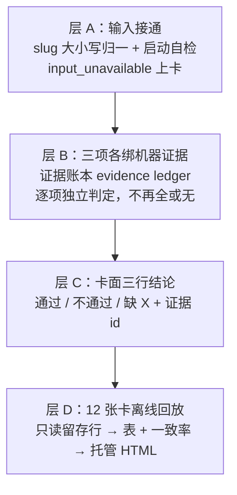

# FLY-2560 机器试判三项全待补证 — 探索
Issue: FLY-2560 (https://linear.app/geoforge3d/issue/FLY-2560/自动合并试判-机器试判首次真跑三项全待补证判定器输入为空卡面写0-仓在飞-pr-未取全-输入必须拿到-pr-diff-设计文档-qa)
日期: 2026-09-14
基于: 无（上游为 FLY-2399 的 engineering/doc/FLY-2399-auto-approve-learning/plan.md）

## 1. 问题一句话

FLY-2399 上线后的机器试判（dry_run）在生产的三张真卡（FLY-2556 / FLY-2553 / FLY-2555）上全部输出「不可判定 · 三项待补证 · 0 仓」，
但这三张卡的设计评审、代码评审、QA 判决、PR diff 都已经在机器里。founder 2026-09-14 20:20Z 裁定：
「永远待补证 = 这条线路失败」。本单要把试判的输入接通、把三项判定各自绑到机器证据、把卡面改成三行各自明确的结论、并用今天已按的 12 张卡做离线回放。

## 2. 现场取证（生产库只读，2026-09-14 20:30Z 前后）

### 2.1 三张真卡的 opinion 记录

`~/.flywheel/teamlead.db` 表 `ship_judgment_opinion`（只追加，共 3 行）：

| opinion_id | issue | reason | mechanical.checkedRepos | created_at |
|---|---|---|---|---|
| b9fcd04b… | FLY-2556 | `project_sources_unavailable` | 0 | 2026-09-14T19:03:57Z |
| e4dc52c3… | FLY-2553 | `project_sources_unavailable` | 0 | 2026-09-14T20:19:49Z |
| b42ddf78… | FLY-2555 | `project_sources_unavailable` | 0 | 2026-09-14T20:28:37Z |

三张卡同一个 reason。`ship_judgment_input` / `ship_judgment_evaluation` / `ship_judgment_job` 三表均为 0 行：
**判定器从未走到「冻结输入」这一步**，更没有起过模型评估。

### 2.2 「0 仓」根因：仓库 slug 大小写不一致

`packages/teamlead/src/bridge/ship-judgment-runtime.ts:306-318`（`collect`）：

```ts
const slug = repositorySlugSchema.safeParse(project.projectRepo);
const repositories = slug.success ? deps.store.readShipJudgmentRepositories(slug.data) : undefined;
if (!repositories || !deps.linearApiKey) { remember(questionId, unknown("project_sources_unavailable")); ... }
```

`packages/teamlead/src/StateStore.ts:5368-5388` `readShipJudgmentRepositories(primarySlug)`：
先把 `{"__main__": primarySlug}` 放进 map，再把 `workflow_node_pr_binding` / `workflow_declared_pr` 里
活跃 flywheel run 的 `(repo_identity, probe_repo_slug)` 合并进去；**同一 repo_identity 若出现两个不同字符串的 slug 就整体返回 `undefined`**。

- 生产 `~/.flywheel/projects.json` 里 flywheel 的 `projectRepo` = **`xrliAnnie/flywheel`**（大写 A）。
- 绑定行里的 `probe_repo_slug` 全部是 **`xrliannie/flywheel`**（小写；`workflow_node_pr_binding` 550 行、`workflow_ship_target_binding` 528 行，无一例外）。
  小写化发生在 `packages/teamlead/src/bridge/repository-authority.ts:34`（`${owner.toLowerCase()}/${repo.toLowerCase()}`）。
- 用 python 按同一 SQL 复现：`CONFLICT -> undefined: __main__ 'xrliAnnie/flywheel' vs 'xrliannie/flywheel'`。

GitHub 的 owner/repo 本身大小写不敏感，这两个字符串指向同一个仓库；判定器却把它们当成「同一 identity 绑了两个仓」而放弃。
其它三个入口条件都是满足的：
- `linearApiKey`：Bridge 由 `scripts/flywheel-bridge-wrapper.sh` 用 `set -a; source ~/.flywheel/.env` 启动，该文件含 `LINEAR_API_KEY`。
- manifest 完整性：`workflow_pr_manifest` 对活跃 flywheel run 无未封口行（表为空）。
- 仓库数 ≤ 200。

FLY-2399 的 529 台架实测（`volume-live.json`）用的也是 `xrliAnnie/flywheel`，但台架里没有生产这些小写绑定行，所以没撞上。

### 2.3 卡面为什么写「0 仓，在飞 PR 未取全」

`ship-judgment-runtime.ts:94-104` 的 `unknown(reason)` 兜底把 `checkedRepos: 0, openPrCount: null` 塞进 mechanical；
`packages/teamlead/src/ship-judgment/render.ts:46` 固定渲染为「`${checkedRepos} 仓，在飞 PR ${openPrCount ?? "未取全"}`」。
真正的 reason（`project_sources_unavailable`）只进了库，**卡面不显示**，founder 只能看到一个像「没取到 GitHub」的误导句。

### 2.4 修掉「0 仓」之后仍会全待补证：三项证据的接线现状

按现有代码，把大小写修好后 collect 会继续往下走，但三项判定仍会在下面几处倒下：

| 判定项 | 现在的证据来源（代码） | 生产库现状 | 结论 |
|---|---|---|---|
| ① PRD/设计对齐 | plan = `readShipJudgmentPlanReference(runId, repoIdentity)`（StateStore.ts:5407）：只查 **当前 run** 的 `codex_review_job review_type='design' status='done' verdict='APPROVED'`；issue = Linear API；模型（claude 订阅进程）读 issue+plan+prd+diff 做语义判定 | 12 张回放卡中 FLY-2360 / 2467 / 2399 / 2496 在当前 run 下**没有** design job（2467/2399 的 design APPROVED 记在别的 run/execution 上，2360 是 `general` 节点的通用 run，根本没有设计与 QA 节点） | 按 run_id 查会把跨 run 的设计批准漏掉 → `plan_missing` → 全包失败 |
| ② 合并与在飞文件 | `production-collect.ts`：`git merge-tree` main/target-base × head + 同项目 open 非 draft PR 文件集求交（GitHub API，120 次/小时预算） | 代码路径完整，只是被 2.2 卡在门口 | 修好 slug 即可工作；注意 39 PR 一次全量采集实测 109 次调用，离 120 只剩 11 次余量（FLY-2399 `volume-sweep.json`） |
| ③ QA 用例覆盖 | `qa-source.ts` `readHostedQaSource` 只读 **`strength_two_evidence_record`**（`record_url_kind='hosted_report' AND record_status='satisfied'`） | 该表全库仅 **12 行**，14 张卡（12 张回放 + 2553/2555）**一行都没有**；真正的 QA 判决在 **`workflow_claims`**（`decision_kind='qa_verdict'`，近 30 天 `qa_passed` 405 行 / `qa_failed` 190 行），FLY-2553 是 claim 1148，evidence 是 `{summary: "QA PASS ... https://fw-reports-624a39.vercel.app/r/12a253b4…/ ..."}` | ③ 接到了一个几乎空的表 → `qa_missing` → 全包失败 |
| 全包 | `collect.ts` 全或无：issue/plan/qa/diff 任一缺失即 `CollectionFailure`，整包 undetermined | — | 任一项缺证据 = 三项一起待补证，正是 founder 反感的形态 |

### 2.5 founder 决定与「一致率」现状

`ship_judgment_outcome` 110 行：`founder_verified approved` 92、`founder_verified rework` 4、`lead_proxy rework` 14。
issue 点名的 12 张卡（2544/2549/2543/2360/2542/2541/2467/2548/2546/2399/2496/2556）今天都有 `founder_verified approved` 记录，
但它们的 run 已 `completed`（除 2399 仍 active），`readShipJudgmentBinding` 要求 run active + holder awaiting_review，
**在线判定器对这 12 张卡已经不可能再跑**；离线回放必须从留存行（`workflow_ship_target_binding.frozen_head_sha`、
`codex_review_job`、`workflow_claims`、`ship_judgment_outcome`）重建，而不是走 `collect`。

现有 `scripts/replay-ship-judgment.mjs` 只重放「一个已冻结的语义 packet 对模型的一次调用」，
生产 `ship_judgment_input` 为 0 行，没有可回放的 packet。

「旧窄口三闸/样本统计：三闸 0/0/0；旧样本 65，一致 0」来自 `auto_narrow_opinion_snapshot`（FLY-2288 旧窄口），
与本次语义得分无关，本单不动它。

## 3. 目标与验收（照 issue 原文）

1. 查清「0 仓」并修好；加启动自检：输入为空必须记 `input_unavailable:<原因>`，不能静默 0。
2. 三项判定各绑机器证据，只有证据真缺才「待补证」并写明缺哪样：
   ① 对齐 = 设计文档 + reviewer verdict + PR diff 范围；② 冲突 = land 预检 / 同项目在飞 PR 文件交集；③ QA = workflow_claims qa_verdict + QA 报告链接。
3. 试判文案：把「不可判定」换成三行各自的 通过 / 不通过 / 缺 X。
4. 回放：用 2026-09-14 已按的 12 张卡做离线回放，输出「若开自动批会批几张、错几张」。

验收 C1–C3 与两条红线（不改 approve_to_ship 权限、不改 auto 模式开关；精确头 CI 绿）原样承接。

## 4. 方案取向（brainstorm）

### 4.1 三层分解



### 4.2 关键设计选择

**选择 1：证据判定（确定性）为主，模型语义评估降为「否决层」。**
FLY-2399 把 ①③ 交给模型语义评估，② 交给机械检查。本单把三项都先绑到**确定性的机器证据**：
- ① = 设计评审 APPROVED（按 issue 找最新 design 批准，且 plan 路径在 head 树上存在）∧ 代码评审 APPROVED（`codex_review_job review_type='code'`，`frozen_head_sha` = 精确 head）∧ PR diff 已取到（非空、无二进制截断）。
- ② = merge-tree 干净 ∧ 在飞 PR 文件集无交集（沿用 FLY-2399 机械检查，补齐证据 id：snapshot digest、探针结果、overlap 列表）。
- ③ = `workflow_claims qa_verdict`（`subject_digest` = 精确 head，取最新 server_seq）为 `qa_passed` ∧ summary 里的托管报告 token 能在本机 `~/.flywheel/reports/files/<token>.html` 读到。

模型语义评估保留（FLY-2399 全部投资不丢），但角色改为：证据齐全时照跑，结果只能**否决**（把某项从通过降为不通过，附引文），
跑不出来、预算用尽或未跑时**不阻塞**该项的证据结论。理由：founder 今天按卡依据的就是这些回执；
模型缺席不该让「回执齐全」显示成「待补证」。

**选择 2：逐项独立，取消全或无。** 每项自己的证据缺失只把自己标为「缺 X」，其它两项照判（验收 C2）。
总判定：三项全通过 → 「可自动批（若开自动批）」；任一不通过 → 「不可自动批：<项>」；任一缺证据 → 「缺证据：<项+缺什么>」。
总判定对应 `aggregateJudgment` 语义不变（can / cannot / recommend_reject / undetermined），只是 undetermined 必须带「缺哪样」。

**选择 3：设计批准按 issue 找，不按 run 找。** 生产里 design 与 implement 常分属不同 run/execution（2467、2399、2496 实证），
按 run_id join 会系统性漏掉。改为按 `issue_id`（含别名）找最新 `design` 批准，再校验 plan 路径在精确 head 树上存在且 blob 未被后续 CHANGES_REQUESTED 覆盖。

**选择 4：QA 源改接 `workflow_claims` + 报告注册表。** `strength_two_evidence_record` 是可选的「强度二」证据，
生产 QA 节点几乎不产（12 行）；`qa_verdict` claim 才是 DAG 真正的 QA 判决通道（可被 ship-eligibility 消费）。
托管报告用 URL 里的 token 从 `ReportRegistry.readReportHtml(token)` 本机读字节，不走网络。

**选择 5：启动自检 + reason 上卡。** Bridge 起 ship-judgment runtime 时做一次输入预检（slug 归一后 `readShipJudgmentRepositories`、
`linearApiKey`、`gh auth token`），失败写一条 `ship_judgment_input_unavailable:<reason>` 审计事件；
卡面「检查范围」行在 reason ≠ ready 时改写为「输入不可得：<reason>」，永远不再出现「0 仓」的误导句。

**选择 6：回放脚本只读留存行。** 新增 `scripts/replay-ship-judgment-cards.mjs`：输入 issue 列表 + `teamlead.db` 只读副本，
对每张卡从 `workflow_ship_target_binding`（frozen head）/ `codex_review_job` / `workflow_claims` / `ship_judgment_outcome` 重建 ①③ 证据判定；
② 在回放里**当时的在飞集合已不可得**，用事后事实（PR 已合入 main）标注为「事后：已合入」，并在表里明确这是事后对照而非当时试判。
输出 JSON + 托管 HTML 表（PRD / 无冲突 / QA 三列 + 机器总判 + founder 决定 + 一致率 + 「若开自动批会批 N 张、错 M 张」）。

### 4.3 明确不做

- 不改 `approve_to_ship` 权限、founder gate、auto 模式开关；dry_run 仍只发试判文本。
- 不重写 FLY-2399 的语义评估 / 学习统计 / 旧窄口统计。
- 不做「land 预检」的独立记录：生产没有一张「同文件在飞 PR 预检」表，② 仍以机械检查（merge-tree + 在飞文件交集）为准；边界如实写。
- 不把 `projects.json` 改成小写来「修」问题：比较必须两侧归一，配置大小写不该成为判定器的隐性前提。

## 5. 待 Lead 裁的点（非阻塞，先按默认做）

1. **模型语义评估的角色**：默认按 4.2 选择 1（否决层）。若 Lead 要求保持 FLY-2399「①③ 只由模型定」，则本单只能做到「证据齐全 + 模型跑完」才给结论，12 张回放全部只能是「缺模型评估」——与 founder 诉求冲突，需要明确。
2. **回放 ② 的口径**：默认用「事后已合入」对照并标注；若 Lead 要求回放也跑 merge-tree，需要 12 个 head 的 git fetch（可做，但不是当时的在飞集合）。
