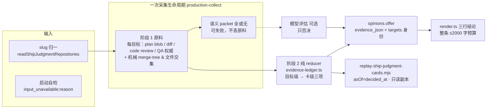

# FLY-2560 机器试判三项全待补证 — 实施计划
Issue: FLY-2560 (https://linear.app/geoforge3d/issue/FLY-2560/自动合并试判-机器试判首次真跑三项全待补证判定器输入为空卡面写0-仓在飞-pr-未取全-输入必须拿到-pr-diff-设计文档-qa)
日期: 2026-09-14
基于: research.md（historical snapshot；与本文冲突处以本文为准）

**Version**: v1.57.0
**Status**: reviewed — Codex R1（7 条）/ R2（6 条）全部吸收；R3 因 Codex 账号池全部撞额度未跑（personal 至 9/19、school 至 9/21、business token 失效）；Gemini R1 **APPROVED**（API-key 通道、隔离 HOME，3 条 LOW 已吸收进 §4.6）；工程 Lead leadAcceptance（question 49a83a3c，2026-09-14），交接实现。实现 PR 的代码评审须重新对照本计划。

## 0. 一句话

把机器试判从「输入为空 → 三项一起待补证」改成「输入自检 + 三项各绑确定性机器证据（按目标逐个判、按卡聚合）、卡面三行各写 通过/不通过/缺 X」，
模型语义评估固定为**否决层**；并用今天已按的 12 张卡做只读离线回放，托管一张「若开自动批会批几张、错几张」的表给 founder。

## 1. 已决策的前提（门，不是默认值）

1. **判定权威（Lead 裁定 e3397bce，2026-09-14）**：①③ 由确定性机器证据先判；模型语义评估完成且判 `fail` 才把该项降为不通过；
   模型未跑 / 预算用尽 **不阻塞**，卡面如实显示语义层状态。② 仍是机械检查。唯一语义，不提供切换。
2. **回放 ②（同一裁定）**：用耐久的事后合入记录对照并标注为事后证据，不做 merge-tree 回放。
3. 仓库 slug 规范形是小写；`projects.json` 不改。
4. 不改 `approve_to_ship` 权限、founder gate、land、auto 模式开关；dry_run 仍只发文本。

## 2. 架构



## 3. 数据模型

### 3.1 证据账本（新 `ship-judgment/evidence-ledger.ts`，zod 固定 schema，四层预算可证明）

上游硬边界：`workflow_pr_manifest.expected_count ≤ 50`，故 **targets ≤ 50**（不是 200）。

```ts
export const EVIDENCE_POLICY_VERSION = "ship-judgment-evidence-v1";
const evidenceKind = z.enum(["design_review","code_review","diff","qa_claim","qa_report","merge_probe","snapshot"]);
const missingKind  = z.enum(["design_review","code_review_at_head","pr_diff","plan_at_head","qa_claim","mechanical_snapshot","merge_probe","input"]);
const reasonCode   = z.enum(["evidence_complete","design_changes_requested","design_superseded","code_changes_requested","diff_binary",
  "qa_failed","qa_claim_revoked","qa_claim_inconsistent","qa_claim_stale_attempt","qa_claim_wrong_issuer","overlapping_files","merge_conflict","evidence_missing"]);
const evidenceRef  = z.object({ kind: evidenceKind, id: z.string().min(1).max(64), label: z.string().min(1).max(40),
  observedAt: z.string().datetime() }).strict();                       // 账本级去重池，≤ 64 条
const point = z.object({ verdict: verdictSchema, reason: reasonCode,
  missing: z.array(missingKind).max(8), refs: z.array(z.number().int().nonnegative().max(63)).max(4) }).strict();  // refs 指向 evidence 池下标
const target = z.object({ r: id /*repo_identity ≤200*/, p: z.number().int().positive(), h: sha40, b: sha40.nullable(),
  a: point, c: point }).strict();                                       // a=alignment, c=coverage
export const evidenceLedgerSchema = z.object({
  version: z.literal(1), policyVersion: z.literal(EVIDENCE_POLICY_VERSION),
  evidence: z.array(evidenceRef).max(64),
  targets: z.array(target).min(1).max(50),
  targetsDigest: digest, manifestRevision: z.number().int().nonnegative(),
  alignment: point, conflict: point, coverage: point,                   // 卡级聚合
  semantic: z.object({ status: z.enum(["not_run","undetermined","evaluated"]), evaluationId: id.nullable(),
    modelSnapshotDigest: digest.nullable(), alignmentVeto: z.boolean(), coverageVeto: z.boolean() }).strict()
    .refine(s => (s.status==="not_run") === (s.evaluationId===null && s.modelSnapshotDigest===null))
    .refine(s => s.status==="evaluated" || (!s.alignmentVeto && !s.coverageVeto)),
  input: z.object({ status: z.enum(["ready","unavailable"]), reason: z.string().min(1).max(64) }).strict(),
  computedAt: z.string().datetime(),
}).strict().refine(v => Buffer.byteLength(JSON.stringify(v)) <= 49_152, "ledger_budget");
```

- 预算边界（Lead ruling question b5b6d27b-7eea-4d2b-b7b5-6aeb82ac4993）：上面的结构最大值只是 schema 字段上限，不保证同时取满能装入账本；ASCII 反例为 **50,359 B > 49,152 B**，Unicode 还可能更大。保留 schema 和 49,152 B 硬上限；Chunk E 证明实际 reducer 最大输出能容纳，并验证超限对象拒绝。超限明确记录 evidence_budget_exceeded，不产生判决，不截断身份；候选 98,304 B 与 render 整条预算仍独立执行。
- **目标级判定**：每目标独立判 ①③；② 只有卡级。**卡级聚合**：全 pass → pass；任一 fail → fail；否则 undetermined，`missing` 取并集去重（≤8）。
- `b`（diff base）为 `null` 的目标 ① `missing:[pr_diff]`。
- semantic 四态显示：`not_run` → 「语义复核：未跑」；`undetermined` → 「语义复核：已跑，未形成否决」；`evaluated` 无 veto → 「语义复核：通过」；有 veto → 「语义复核：不通过·依据…」。**`undetermined` 永不显示为通过**。
- digest = `canonicalDigest(ledger 去掉 computedAt 与各 observedAt)`；`presentation_digest` 纳入该 digest。

### 3.2 持久化：evidence-only 意见的身份、表重建、消费者契约

**身份**：evidence-only 行 `input_id/evaluation_id` 为 NULL；身份 = `evidence_json.targetsDigest`（`targetSetDigest(targets, manifestRevision)`，与 `ship_judgment_input.targets_digest` 同算法）；run 与卡来自 `mechanical_json.binding.runId / cardMessageId`（opinion 插入时已随 mechanical 一起持久化）；policy = `evidence_json.policyVersion`；model = `evidence_json.semantic.modelSnapshotDigest`（可为 NULL）。

**表重建迁移**（`EVIDENCE_LEDGER_MIGRATION = "fly-2560-evidence-ledger-v1"`，同 `DELIVERY_ERROR_AUDIT_MIGRATION` 的标记模式）：
1. 事务外：按 StateStore.ts:4410-4412 既有信封保存 `PRAGMA foreign_keys` 并置 OFF（`ship_judgment_clarification.opinion_id` 引用本表，FK ON 时 `DROP TABLE` 父表会失败——已用同形内存库复现）。
2. 事务内：`DROP TRIGGER` ×3 → `CREATE TABLE ship_judgment_opinion_new(原列…, evidence_json TEXT NULL CHECK(evidence_json IS NULL OR (json_valid(evidence_json) AND length(CAST(evidence_json AS BLOB))<=49152)), CHECK((input_id IS NOT NULL AND evaluation_id IS NOT NULL) OR evidence_json IS NOT NULL OR overall='undetermined'), UNIQUE(question_id,ordinal))` → `INSERT … SELECT *,NULL` → `DROP TABLE ship_judgment_opinion` → `ALTER TABLE … RENAME TO ship_judgment_opinion`（SQLite ≥3.26 会同步改写子表 FK 引用）→ 重建索引 `ship_judgment_opinion_question` + 3 触发器（原文照抄）→ `PRAGMA foreign_key_check` 必须为空 → 写迁移标记 → COMMIT。
3. finally：恢复 `foreign_keys`。
- 迁移测试：空库；含 3 行旧 opinion 的库；**含 clarification 子行**的旧库；二次启动幂等；迁移后 `foreign_key_list` / `foreign_key_check` / 3 触发器（仍拒 UPDATE、DELETE；history_dirty 仍触发）/ 索引核对；旧行 `evidence_json` NULL 且 `overall='undetermined'` 通过 CHECK。

**消费者契约**（各加测试）：
- `delivery.view`：SELECT 增 `o.evidence_json`；`DeliveryView.evidence?: EvidenceLedger`（NULL → undefined，旧渲染路径）。
- `outcomes.frozenTargetContext`：优先 `input`；无则用最新可见 opinion 的 `evidence_json.targets/targetsDigest`（不再 unresolved）。
- `learning.pair` **evidence-only 分支的完整 SQL**（与现有 input 分支并列，二选一，不从 nullable input 连接事件）：
  ```sql
  SELECT o.opinion_id,o.overall,o.created_at,NULL AS evaluated_at,
         json_extract(o.evidence_json,'$.policyVersion') AS policy_version,
         json_extract(o.evidence_json,'$.semantic.modelSnapshotDigest') AS model_snapshot_digest,
         json_extract(e.payload,'$.receipt_time') AS visible_at
  FROM ship_judgment_opinion o
  JOIN workflow_run_event e ON e.run_id=? /*outcome.run_id*/ AND e.kind=? /*JUDGMENT_VISIBLE_EVENT*/
       AND json_extract(e.payload,'$.opinion_id')=o.opinion_id AND json_extract(e.payload,'$.question_id')=o.question_id
  WHERE o.question_id=? AND o.input_id IS NULL AND o.evidence_json IS NOT NULL
    AND json_extract(o.mechanical_json,'$.binding.runId')=? AND json_extract(o.mechanical_json,'$.binding.cardMessageId')=?
    AND json_extract(o.evidence_json,'$.targetsDigest')=?
    AND json_extract(e.payload,'$.receipt_time')<=? /*decided_at*/
    AND julianday(o.created_at)<=julianday(?) AND julianday(COALESCE(json_extract(e.payload,'$.observed_at'),e.at))<=julianday(?)
  ORDER BY visible_at DESC,o.created_at DESC,o.ordinal DESC LIMIT 1
  ```
  两分支各取一条，按 `visible_at` 最新者胜。`Pairing.modelSnapshotDigest: string | null`；`statistics` 分组键 `(policyVersion, modelSnapshotDigest ?? "none")`，filter `--model-snapshot-digest` 只匹配非空。evidence-only 意见**参加学习**（它就是 founder 看到的意见）。
- `epic-facts` / `history-*`：只读增加三行标签与 missing，不显示证据 id 明细。
- 测试：「无 input/evaluation、已可见、founder 后续决定」端到端配对；未跑模型与已评估模型的统计分组各一。

### 3.3 StateStore 新读方法（只读、参数化、绑定 repo identity、可传 asOf）

- **设计批准** `readShipJudgmentDesignApproval(issueId, aliases[], repoIdentity, asOf?)`：`codex_review_job review_type='design' AND target_repo_identity=? AND project_name='flywheel' AND status='done' AND verdict='APPROVED' AND issue_id IN (?…) [AND responded_at<=asOf]`，最新一条；同 issue/repo 更晚 design 行（非 APPROVED 或未 done）→ `superseded`。返回 `{requestId, executionId, path, round, respondedAt, expectedBlobSha?}`；`expectedBlobSha` 由 **`design_review_manifest.execution_id = job.execution_id`**（与 `readShipJudgmentPlanReference` 同关系，非 request_id）取 `is_current` 且 `expected_plan_path=path` 的行。
  - 按此正确键复核：近 30 天 **164 条设计批准，manifest 命中 0 条**（12 张回放卡与 2553/2555 皆 0）。因此政策：有 `expectedBlobSha` 必校验（不等 → ① `missing:[plan_at_head]`）；无则 ① 通过并将证据条目 `label:"blob_unverified"` 上卡显示「设计评审 APPROVED（blob 未核）」；plan 后改的风险由「代码评审 APPROVED@精确 head」承接。
- **代码评审** `readShipJudgmentCodeReviewAtHead(issueId, aliases[], repoIdentity, headSha, asOf?)`：`review_type='code' AND status='done' AND target_repo_identity=? AND lower(frozen_head_sha)=lower(?) [AND responded_at<=asOf]`，最新一条 `{requestId, round, verdict, respondedAt}`。
- **QA 权威**（新包装 `readShipJudgmentQaAuthority(runId, repoIdentity, headSha, asOf)`，两步）：
  1. 解析 as-of 的当前 QA attempt 与 issuer：`workflow_run_node WHERE run_id=? AND node_id='qa' AND started_at<=asOf ORDER BY attempt DESC LIMIT 1` → `{attempt, executionId}`；无 → ③ `missing:[qa_claim]`（reason `evidence_missing`）。
  2. 受测查询（不直接用通用 resolver 的宽口径）：`workflow_claims WHERE workflow_run_id=? AND node_id='qa' AND decision_kind='qa_verdict' AND subject_kind='git_head' AND lower(subject_digest)=lower(?) AND issued_at<=asOf`，全部候选按 `attempt DESC, server_seq DESC`；规则同 `resolveWorkflowDecisionClaim`（最高 attempt 必须 = 步骤 1 的 attempt，否则 `qa_claim_stale_attempt`；`issuer_execution_id` 必须 = 步骤 1 的 execution，否则 `qa_claim_wrong_issuer`；未过期 / 未撤销（`workflow_claim_revocation`）/ 同 attempt predicate 一致，否则 `qa_claim_revoked` / `qa_claim_inconsistent`）。**无论有效与否**都返回候选元数据 `{claimId, serverSeq, predicate, issuedAt, revoked}` 供卡面与审计。`qa_passed` → 通过；`qa_failed` → 不通过（保留 id/时间）。多目标每 head 各解析一次；在线 `asOf=now`。
  - 测试：决策后签发的 permanent PASS 不倒灌；旧 attempt PASS + 当前 attempt 无 claim → stale；错误 issuer 同 head PASS → wrong_issuer；`qa_failed` 保留 id/时间。
- `readShipJudgmentRepositories`：primary 与行 slug 皆 `toLowerCase()` 后进 map，返回小写；非法 slug 仍 undefined。
- `readShipJudgmentPlanReference` 保留为首选；找不到时 fallback `readShipJudgmentDesignApproval`。

## 4. 分块（按序落地，每块可独立 review）

### Chunk A — 输入接通
- `readShipJudgmentRepositories` 小写归一；单测：`Owner/Repo` vs `owner/repo` → 单仓；`a/x` vs `b/x` 同 identity → undefined；非法 slug → undefined。
- `bridge/ship-judgment-runtime.ts`：启动自检 `preflightShipJudgmentInputs`（异步只读：slug+repositories、`linearApiKey`、`readShipJudgmentGithubToken` 20s）；失败 `onError("input_unavailable:<reason>")`，结果进 `latestInput`；`unknown(reason)` 改为带 `input:{status:"unavailable",reason}` 的 ledger 兜底。
- `render.ts`：`ledger.input.status==='unavailable'` 或旧行 `mechanical.reason` 属输入类集合 → 「输入不可得：<reason>；三项按已得证据判」；「0 仓」句在该路径不再出现（测试断言）。

### Chunk B — 两阶段采集 + 证据账本
- **阶段 1**（在 `collectProductionJudgment` 现有生命周期内、prepared git dispose 之前）：每目标收集原料 `{planBlob?, diff?, codeReview?, qaAuthority?, designApproval?}` + 已有 mechanical；语义 packet 照旧全或无，失败只影响 `collection`，**不丢原料**。返回 `{collection, mechanical, materials}`；不新增第二次 Git/GitHub 采集。
- **阶段 2**（纯函数 `buildEvidenceLedger(materials, binding, semantic?)`）：目标级 ①③ + 卡级聚合 + semantic 四态；在线与回放共用。
- `collect`：无论 packet 成败都 `remember(question, mechanical, ledger)`；候选带 `evidence`（`opinionCandidateSchema` 可选字段，旧候选仍解析）。
- `opinions.offer`：`alignment = ledger.alignment.verdict`，若 `evaluation.alignment==='fail'` → `fail` + `alignmentVeto`；`coverage` 同理；`conflict = mechanical.verdict`；写 `evidence_json`。
- 语义层 qa 适配器：`readClaimQaSource`（claim summary 中托管 URL → `classifyRecordUrl` → `readReportHtml` → digest 校验）优先，`readHostedQaSource` 次选；报告不可读只影响语义层。
- 负向单测：无 QA claim → 只 ③ `missing:[qa_claim]`；无设计评审 → 只 ① `missing:[design_review]`；design 最新 CHANGES_REQUESTED → ① fail；撤销 / 不一致 / stale attempt / wrong issuer 四态；模型 fail 覆盖 pass；模型 undetermined 不改 pass 且显示「已跑，未形成否决」；head 大写命中；两仓卡一仓缺 QA → 卡级 ③ undetermined 且 ①② 照判；两仓卡一仓 code CHANGES_REQUESTED → ① fail。

### Chunk C — 文案
- 三行 `<标签> · <证据 id 串>`；第五行「缺证据：无 / ① 设计评审、③ QA 判决」；第六行语义四态；总判定 `can`→「可自动批（若开自动批）」，`cannot`/`recommend_reject`→「不可自动批：<项>」，`undetermined`→「缺证据：<项>」。
- **整条预算**：先渲染骨架，再按优先级追加证据串（① → ③ → ② overlaps → 语义引文），每追加前检查总长 ≤1900，放不下的省略并加「（+N 条省略）」；`judgment_message_budget_exceeded` 只作最后防线断言。
- 测试：五种快照（可批 / 不可批② / 缺证据③ / 输入不可得 / 语义否决）；最大 50 目标 + 64 refs + 长 Unicode 仍 ≤2000；「不可判定」「待补证」不出现在新行渲染。

### Chunk D — 离线回放
- `scripts/replay-ship-judgment-cards.mjs --db <snapshot.db> --repo <repoIdentity>=<path>（可重复） --issues … --out <dir>`。
  - **副本**：按当前 runner 合同运行 `node scripts/flywheel-snapshot-control.mjs runner --source <prod> --kind teamlead`（托管 WAL-safe 快照，执行目录 2GB 上限）；脚本 `readonly + fileMustExist` 打开，`realpath` 后拒绝 `~/.flywheel/` 下路径或与生产库同 inode；记录副本 sha256、快照时间、每仓 remote 与观测 SHA。Lead 在 question edd38a5c-5532-4e63-b041-055f2c43fdbf 明确交付的 0444 patrol-repairs 托管快照，可经显式 --managed-snapshot 入口读取；仍拒绝生产同 inode。WAL 头且无边文件的封存副本用 SQLite mode=ro&immutable=1，不产生 WAL/SHM，不迁移或写库。
  - **ground truth**：复用 `learning.ts` canonical outcome 规则（重复 / post-decision override / timing_ambiguous 全部按原逻辑排除），只取 `founder_verified`。
  - **目标集（as-of）**：首选决策前可见 opinion 冻结的 `mechanical_json.binding.targets`（12 张回放卡无 opinion 行，走次选）；次选 `workflow_ship_target_binding`（primary）+ `workflow_declared_pr WHERE run_id=? AND revision=(SELECT MAX(revision) FROM workflow_declared_pr WHERE run_id=? AND declared_at<=decided_at)`；不读今天的 manifest current revision；缺任一 target 的本地 checkout（`--repo` 未给该 identity）→ 该卡弃权「目标集不完整」。
  - **asOf**：①③ 全部传 `asOf=decided_at`，每条证据带 `observedAt`；`observedAt>decided_at` 一律不采。
  - **②（事后）**：primary → `land_operation WHERE run_id=? AND pr_number=? AND approved_head=?` 的 `merge_confirmed_at`；declared 目标 → `workflow_declared_pr.state/merged_at`（带 repo identity）；都无 → 该仓 GitHub `mergedAt` 且 `headRefOid==frozen head`；仍无 → 「事后：未证」。不用 ancestry。
  - 输出 `replay.json` + `replay.html`（Apple-light、零外链、评论层同 founder HTML 规范），列：卡 / 目标 / ① / ②(事后) / ③ / 机器总判 / founder 决定 / 关系；汇总「若开自动批：会批 N / 错 M / 弃权 K / 一致率」。
  - 单测夹具：齐全；缺 QA；缺设计；决策后证据（asOf 排除）；同 question 重复 outcome；squash merge（只看 land_operation）；WAL 快照；决策后 manifest revision；两仓分别在不同 checkout；相同 PR number 的两个 repo。
- 真跑 12 张 + FLY-2553，`publish-report --publish-only` 托管，URL 与副本 sha256 写进 `implementation.md`（C3）。

### Chunk E — 迁移、预算证明、文档、CI
- 3.2 迁移 + 全部迁移测试；3.1 四层预算生成测试。
- `implementation.md` 记 C1（FLY-2553：head 5ce2ca41、claim 1148、design req 3fa2ae34、code r5 9b6f01bf；三项结论 + 证据 id）。
- 精确头 CI 绿；`pnpm --filter flywheel-teamlead test` 看 Tests 条数。

### 4.6 实施须知（吸收 Gemini R1 三条 LOW，原文见 `gemini-review-round1.md`）
- 表重建时三个触发器 `ship_judgment_opinion_no_update` / `_no_delete` / `_history_dirty` 与索引 `ship_judgment_opinion_question` 的定义**原文照抄** StateStore.ts 现有 CREATE 语句，迁移测试逐个核名字与 `sqlite_master.sql`。
- 渲染时每个动态字符串（`repo_identity`、路径、证据 id/label、引文）先过 `text(value, limit)` 单独截断，再进整条预算；单条超长不得触发 `judgment_message_budget_exceeded`。
- 回放的 QA 查询必须与 §3.3 两步权威解析**同一函数**（不另写 SQL）：先取 `asOf` 前最新 attempt，再在该 attempt 内取最高 `server_seq`。

## 5. 回滚边界
- 改动限于 `packages/teamlead/src/ship-judgment/*`、`bridge/ship-judgment-runtime.ts`、`StateStore.ts`（1 次表重建迁移 + 3 个只读方法 + 1 个归一）、`scripts/replay-ship-judgment-cards.mjs`；`flywheel-comm` 不动。
- 回滚 = revert PR；放宽后的 CHECK 与 `evidence_json` 列对旧代码无害。
- dry_run 之外模式行为不变；auto 仍不发文本。

## 6. 验收映射

| 验收 | 证明方式 |
|---|---|
| C1 FLY-2553 同一输入三项明确 + 证据 id | Chunk E 夹具重放 + 真库快照 `--issues FLY-2553` |
| C2 缺 QA / 缺设计 只标该项 | Chunk B 负向单测（含两仓反例） |
| C3 12 张卡回放表托管 200 | Chunk D 真跑 + publish-report URL + 副本 sha256 |
| 不改权限/开关；精确头 CI 绿 | diff 不触碰 founder gate/land/flag；CI 结论入 implementation.md |

## 7. 风险与已知限制
- GitHub 预算 120/h：39 PR 全量 109 次；预算不足时 ② `missing:[mechanical_snapshot]`，不扩预算。
- 托管报告只认当前 `vercelProjectName`；旧项目报告不可读只影响语义层。
- `general` 节点 run（FLY-2360 类）没有设计/QA 节点：只能「缺证据」。
- **残差 1（Lead 已接受为诚实边界，question 49a83a3c）**：design blob 身份在生产 0/164 可得（按 execution_id 关联）；「blob 未核」是诚实边界，不是免检。
- **残差 2（同上接受）**：机械 `overlaps` >200 条时候选可能超 98,304（既有边界，落既有 `candidate_budget_exceeded` 路径，本单不改）。
- 设计评审收口方式：Codex R3 未跑，由 Gemini API-key 通道 R1 APPROVED + Lead leadAcceptance 收口；实现 PR 的 Codex 代码评审须重新对照本计划（实现节点常规执行）。

### 真回放暴露的临时 diff 读取边界

FLY-2399 的完整 diff 为 1,287,593 B，FLY-2496 为 604,193 B，旧 FrozenGitReader 的 262,144 B 上限使原料读取失败。
按「拿到 PR diff，语义 packet 失败不丢确定性原料」的既定设计，将临时原始 diff 读取上限定为 2 MiB；
单个 plan blob 的 256 KiB、语义/候选 packet、49,152 B 账本上限均保持不变。
超过临时上限仍 fail closed 并记录 diff_budget_exceeded；读取失败不得清掉已读到的 plan 或其它两项证据。

## C1 证据范围补充（Lead question 018a8aec-c5f1-4620-8bd7-5333e075e68e）
Lead 确认 PR1194 不存在历史精确头预检回执，授权仅对 C1 冻结 head 5ce2ca41 做一次新的只读机械检查；必须写明观察时间、当时 main 与在飞 PR 集合。此项是新观察，不称为历史回放，不改变 12 张卡的事后合入证据策略，也不改变权限或 auto 开关。

## QA 返工范围（2026-09-15，Lead 26ec0fa1-978e-4382-8576-920fc177cbeb）

QA claim1159 对53426fc31 FAIL，TURN交还implement epoch6/attempt2。真实GitHub42张非draft卡在120请求预算内无法刷新（136请求需求），失败丢弃本轮缓存且刷新失败先于Git原料准备返回。
本轮严格处理：①diff/plan原料独立于库存刷新成功；files分页100并消除或缓存逐PR身份复读；刷新失败保留部分缓存或做预算感知；42+PR/含370文件的大规模集成测试证明≤120请求且三项输入完成；已知①fail优先显示不可自动批、失效机械快照明确input unavailable不显示0仓。保持权限/auto开关；不跑host全包；一批push（里程碑最后）、新精确头review/CI后needs_review PR1202。
QA证据目录：`/tmp/fly-2560-qa/`（qa-report.md、prod-e2e-1202-r2.json、c1c2.json、harness）。先前回放、独立C1/C2与15项CI绿成立，但不足以证明真实规模在线采集可用；本轮补该缺口。

返工实现选择：metadata先发布以启动Git；files100分页；保留新头身份核验，同头复用已验证文件及身份；失败部分缓存持久化但不标fresh。42PR/370和289文件集成首次93请求、次轮4请求，不提高120/h预算。最终机械判断仍核验完整快照、身份与有效期，缺库存只影响②。
