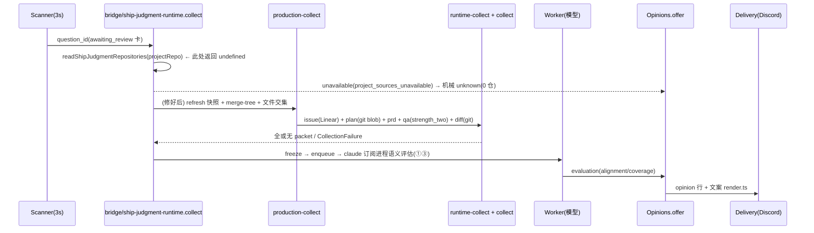

# FLY-2560 机器试判三项全待补证 — 调研
Issue: FLY-2560 (https://linear.app/geoforge3d/issue/FLY-2560/自动合并试判-机器试判首次真跑三项全待补证判定器输入为空卡面写0-仓在飞-pr-未取全-输入必须拿到-pr-diff-设计文档-qa)
日期: 2026-09-14
基于: exploration.md

> **Historical snapshot（2026-09-14 Codex R2 后标注）**：本文是写 plan 前的调研快照。以下几处已被 plan.md 推翻，实施以 plan.md 为准：QA 判决改为按 as-of 的当前 QA attempt + issuer 解析（§3.3 「不绑 attempt/execution」作废）；回放 ② 用 `land_operation.merge_confirmed_at` 等耐久记录，不用 ancestry；语义层未跑时卡面显示「语义复核：未跑」（§4 「不加任何字」作废）；设计 blob 身份按 `design_review_manifest.execution_id` 关联。

## 1. 现有判定链路（代码级）



### 1.1 各模块职责与本单触点

| 文件 | 职责 | 本单要动 |
|---|---|---|
| `bridge/ship-judgment-runtime.ts` | 组装 deps；`collect` 入口；`unknown(reason)` 兜底；`offer` 组 opinion 候选 | 入口改用归一 slug；新增证据账本计算；`unavailable` 时也带账本 |
| `StateStore.ts:5368` `readShipJudgmentRepositories` | 合并 primary slug 与绑定行 slug | 两侧小写归一后比较 |
| `StateStore.ts:5407` `readShipJudgmentPlanReference` | 当前 run 的 design APPROVED job | 新增按 issue 的读法（见 §3） |
| `ship-judgment/qa-source.ts` | 只读 `strength_two_evidence_record` | 新增 claim 源；旧源保留为次选 |
| `ship-judgment/collect.ts` | 全或无冻结 packet | 不改语义；packet 仍全或无，仅供模型层 |
| `ship-judgment/opinions.ts` | 组 opinion（三项 + overall）并写 `ship_judgment_opinion` | 新增 `evidence_json` 列；三项取「证据判定 ∧ 模型否决」 |
| `ship-judgment/render.ts` | Discord 文案（≤2000 字） | 三行各自「通过/不通过/缺 X + 证据 id」；输入不可得改文案 |
| `ship-judgment/contract.ts` | schema/标签/aggregate | 新增 evidence ledger schema；标签「不可判定」→「缺证据」 |
| `scripts/replay-ship-judgment.mjs` | 单 packet 模型重放 | 不动；新增 `replay-ship-judgment-cards.mjs` |

## 2. 层 A：输入接通

### 2.1 slug 归一
- GitHub `owner/repo` 大小写不敏感；仓内已有先例：`bridge/beta-release-github.ts:161`、`bridge/run-ship-relevance.ts:237` 都用 `toLowerCase()` 比较；`repository-authority.ts:34` 写入时就小写化。
- 判定器内部三处都拿 slug 做**字面**比较：`readShipJudgmentRepositories`（map 去重）、`production-collect.ts` `repository_not_configured` 检查（`repo.repo_slug===target.repo_slug`）、`prepare-git.ts` `deps.repositories.includes(value.repoSlug)`、`github-api.ts` `this.repositories.has(repo)`。
- 结论：**规范形 = 小写**。`readShipJudgmentRepositories` 返回的 `repo_slug` 一律小写（primary 也小写），绑定行本来就是小写，于是下游四处字面比较全部自洽，不需要逐处改。`repositorySlugSchema` 正则不动（它本来就允许大小写）。
- 反例守卫：单测「`projectRepo` 为 `Owner/Repo`、绑定行为 `owner/repo` → 返回单仓 `owner/repo`」；「同 identity 真的绑了两个不同仓 `a/x` vs `b/x` → 仍返回 undefined」。

### 2.2 启动自检与 reason 上卡
- Bridge 起 runtime：`bridge/plugin.ts:11120` `createShipJudgmentBridgeRuntime({... linearApiKey, token: readShipJudgmentGithubToken, modelBin: () => "claude", onError: console.warn })`。
- 自检位置：`createShipJudgmentBridgeRuntime` 内、返回 runtime 前，做一次**只读**预检：`repositorySlugSchema` + `readShipJudgmentRepositories`、`linearApiKey` 是否有、`gh auth token` 是否可得（复用 `readShipJudgmentGithubToken`，20s 超时，异步、不阻塞启动）。任一失败：`onError("input_unavailable:<reason>")`（进 Bridge 日志 `[ship-judgment] input_unavailable:…`）。
- 卡面：`render.ts` 当 `mechanical.reason` 属于输入类原因（`project_sources_unavailable` / `repository_not_configured` / `github_auth_unavailable` / `refresh_*` / `github_*`）时，「检查范围」行改写为「输入不可得：<reason>；本卡三项按已得证据判」，不再出现「0 仓，在飞 PR 未取全」。
- 审计：opinion 行 `reason` 已持久化；不新增事件表。

## 3. 层 B：三项证据来源（生产库实证）

### 3.1 ① 对齐 = 设计文档 + reviewer verdict + PR diff

| 证据 | 表 / 查询 | 实证 |
|---|---|---|
| 设计评审批准 | `codex_review_job`：`review_type='design' AND status='done' AND verdict='APPROVED' AND project_name='flywheel' AND (issue_id = run.issue_id OR issue_id IN aliases)`，取 `created_at DESC, round DESC` 第一条；其后若有同 issue 更晚的 design `CHANGES_REQUESTED`/`pending` 则视为被覆盖 | FLY-2553：request 未记 run 但 issue 命中（design r1 APPROVED 17:56）；FLY-2467/2399/2496 的 design 批准都在别的 execution 上，按 issue 才找得到；FLY-2360（`general` 节点 run）真无设计评审 |
| plan 文档在 head 树上 | `FrozenGitReader.readText(head, target_path)`（在线）；离线回放用 `git cat-file -e <head>:<path>`（本地仓已有对象） | 12 张卡 plan 路径都是 `engineering/doc/FLY-xxxx-*/plan.md` |
| reviewer verdict@精确 head | `codex_review_job`：`review_type='code' AND status='done' AND lower(frozen_head_sha)=lower(head) AND issue 匹配`，取最新；`codex_review_record` 同 head `status='approved'` 可作交叉 | FLY-2553 head 5ce2ca41 = code r5 APPROVED（question 9b6f01bf）；每张回放卡的 frozen head 都有对应 code APPROVED |
| PR diff 范围 | 在线：`prepare-git` + `FrozenGitReader.diff(diffBase, head)`（已有）；离线：本地仓 `git diff --name-status <merge-base> <head>` | — |

判定规则（确定性）：三样齐 → 通过；design 最新为 CHANGES_REQUESTED、或 code 最新为 CHANGES_REQUESTED、或 diff 二进制截断 → 不通过；缺哪样 → 「缺 X」（X ∈ 设计评审 / 代码评审@head / PR diff / plan 文档不在 head）。

### 3.2 ② 冲突 = merge-tree + 在飞文件交集（沿用）
- `production-collect.ts` 已实现；证据 id = `snapshot.configurationDigest` + merge probe `{mainSha, headSha, targetBaseSha, verdict}` + `overlaps[]`；`openPrCount` 是真实数字。
- 预算：`ProjectRefreshStore.reserveApi` 每滚动 60 分钟 ≤120 次 GitHub 调用；39 PR 全量 109 次（FLY-2399 实测）。缓存复用：head 未变的 PR 不再取 files。风险如实写进边界，不在本单扩预算。
- 「land 预检」：生产没有独立的「同文件在飞 PR 预检」记录表（`land-executor.ts` 只有 `land_external_effect_inflight` 一类状态），② 不引用它。

### 3.3 ③ QA = workflow_claims qa_verdict + 报告链接
- 表 `workflow_claims`：`decision_kind='qa_verdict'`，`predicate ∈ {qa_passed, qa_failed}`，`subject_kind='git_head'`，`subject_digest` = 40 位 head，`evidence` = `{"summary": "..."}`（`workflow-decision-routes.ts:813/938` 只写 summary），`permanent=1`。撤销表 `workflow_claim_revocation(claim_id)`。
- 精确头查询范式已在 `flywheel-comm/src/ship-eligibility.ts:128-150`（`lower(c.subject_digest)=?`，`ORDER BY server_seq DESC`，同 head 多条 predicate 不一致 → fail-closed）。本单复用同样口径：run_id + head；不绑 attempt/execution（回放跨 attempt）。
- 报告链接：summary 文本里的 `https://<vercelProject>.vercel.app/r/<token>/`；`classifyRecordUrl(url, hosting)` 已能把它判成 `hosted_report` + token；`ReportRegistry.readReportHtml(token)` 从 `~/.flywheel/reports/files/<token>.html` 读本机留存字节（FLY-2553 的 `12a253b4…html` 实际存在）。**不发网络请求**。
- 判定规则：最新 claim `qa_passed` 且未撤销 → 通过（附 claim id + 报告 token）；`qa_failed` → 不通过；无 claim → 「缺 QA 判决」；有 claim 但 summary 无可读托管报告 → 通过但标「报告未留存」（报告是语义层输入，不是 ③ 证据判定的必要条件——founder 要的是「QA 判决」）。
- 旧源 `strength_two_evidence_record`：保留为语义层次选输入（有则用），不再作为 ③ 的必要条件。

### 3.4 模型语义评估的改造点
- `collect.ts` 全或无逻辑不动；`runtime-collect.ts` 的 qa 适配器改为「claim 报告优先，strength-two 次选」。
- 语义结果进 `ship_judgment_evaluation` 不变；`opinions.offer` 组三项时：`point = evidence.verdict`，若 `evaluation.<point>==='fail'` 则降为 `fail`（引文照旧渲染）；`evaluation` 缺席或 undetermined 不改变 evidence 结论。
- `aggregateJudgment` 不动；`undetermined` 时必须能列出「缺哪样」（来自 ledger.missing）。

## 4. 层 C：文案

`render.ts` 目标形态（≤2000 字，沿用 `text()` 转义）：

```
**机器试判：可自动批（若开自动批）** · dry_run
① PRD / 设计对齐：通过 · 设计评审 APPROVED r1(req 8d20f6e6) · 代码评审 APPROVED@5ce2ca41 r5 · diff 12 文件
② 合并与在飞文件：通过 · main 可合 · 在飞 38 PR 无同文件
③ QA 用例覆盖：通过 · qa_passed claim#1148 · 报告 12a253b4
缺证据：无
截至 … 的试判；后续检查可能待更新，仍由你批准。
旧窄口三闸/样本统计（非本次语义得分）：…
`marker opinion:…`
```

总判定标签：`can` → 「可自动批（若开自动批）」；`cannot` → 「不可自动批：② 冲突」；`recommend_reject` → 「不可自动批：① / ③ 不通过」；`undetermined` → 「缺证据：③ QA 判决」（列全）。「不可判定」四个字从卡面消失。
语义否决时该行附「语义复核：不通过 · 依据：…」；语义未跑不加任何字（避免再造「待补证」）。

## 5. 层 D：离线回放

- 输入：`teamlead.db` 只读副本路径 + issue 列表（默认 issue 点名的 12 张）+ 本地仓路径（读 head 的 plan blob 与 diff）。
- 每张卡：`ship_judgment_outcome`（founder_verified 决定、question_id、run_id）→ `workflow_ship_target_binding.frozen_head_sha` → ① ③ 按 §3 规则判 → ② 标「事后：PR 已合入 main（merge commit）」（`git branch --contains` / `gh pr view --json mergedAt`，标注事后）。
- 输出：`replay.json` + `replay.html`（托管），列：卡 / head / ① / ② / ③ / 机器总判 / founder 决定 / 一致（aligned|divergent|abstained，沿用 `learning.ts decisionRelation`）；汇总「若开自动批：会批 N 张（机器 can）、错 M 张（can 但 founder rework/canceled）、弃权 K 张（缺证据）」。
- 预期（按现有库预判，实施时以脚本输出为准）：12 张全部 approved；FLY-2360 无设计评审也无 QA claim → 缺证据（弃权）；其余 11 张 ①③ 证据齐 → can → 一致。

## 6. 迁移与兼容
- `ship_judgment_opinion` 是 immutable（触发器禁 UPDATE/DELETE），只能 `ALTER TABLE ADD COLUMN evidence_json TEXT NULL`（StateStore.ts:5598-5605 已有同类 `PRAGMA table_info` 守卫模式）。历史 3 行 `evidence_json` 为 NULL，渲染按旧路径。
- `presentation_digest` 加入 ledger（否则同卡证据变化不会触发重发）。
- `opinionCandidateSchema` 新增可选 `evidence`；旧候选 JSON（`latest_candidate_json`）无该字段仍能解析。
- 回滚边界：全部改动在 `ship-judgment/*`、`bridge/ship-judgment-runtime.ts`、StateStore 两个读方法 + 一列，不触碰 founder gate / land / approve_to_ship。

## 7. 测试基线
- 现有 `packages/teamlead/src/ship-judgment/__tests__/` 52 个文件 + `bridge/__tests__/ship-judgment-runtime.test.ts`、`StateStore.ship-judgment.test.ts`；`bindingFixture()` 可造绑定行。
- 运行：`pnpm --filter flywheel-teamlead test -- src/ship-judgment src/bridge/__tests__/ship-judgment-runtime.test.ts src/__tests__/StateStore.ship-judgment.test.ts`（真名 `flywheel-teamlead`，判成功看 Tests 条数）。
- 排除 `**/tmux-viewer.macos.test.ts`。
- CI：`.github/workflows/ci.yml`；精确头绿为验收。
