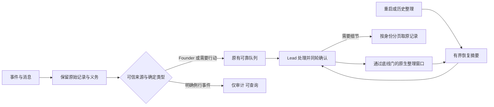

# FLY-2567 Lead token 节省 — 实施计划
Issue: FLY-2567 (https://linear.app/geoforge3d/issue/FLY-2567/leadtoken-常驻-lead-一天烧-40-亿缓存读-token从lead-为什么这么耗的目标出发做设计找出并砍掉主要浪费源lead)
日期: 2026-09-14
基于: research.md

## Part 1 — Founder 总览

**一句话：先停止把大量单向报告当成待答问题反复灌入，再让 Lead 用经底线验证的原生整理窗口工作，同时减少例行通知和单独 ACK 往返。**

设计状态：等待正式 design review；有效 verdict 单独记录在 review-receipt.json。设计交付不代表改动已上线。

### 真实基线

原账本 39.75 亿包含同一次请求的重复 usage 块。校正账本为 UTC 9/14 的 **2,662 次非合成模型请求（另有1条零usage合成记录） / 15.53 亿缓存读 / 平均 58.70 万输入**。统计去重计实际节省为零；后续始终同时给原始口径与唯一请求口径。

### 改什么、预计省多少

金额未估算；下列单位为**缓存读 token / 同等一天工作量**。估计是实验假设，基线来自真实数据；不可把各行相加，多个修法会影响同一个请求。

| 顺序 / ROI | 修法 | 基线 / 暴露成本 | 规划节省与假设 | before/after 证明 |
|---|---|---|---|---|
| 0，必须先做 | 用现有 requestId 去重账本 | 39.75 亿 raw vs 15.53 亿 unique | **0 实际 token**；仅纠正夸大 | raw 对齐、unique 逐行可查、UTC固定 |
| 1，高；压缩前置 | Bootstrap 报告/问题分开、全局 12,000 字符摘要+分页 | 5 份共 345,808 字符；876 条 ASK 展示，当前可查唯一 ID 中397/399为 report | 5份相同次数降至≤60,000字符，至少减82.65%恢复正文；token试算：若全日平均少10k输入则省2,662万；规划0–8,000万，待usage实测 | 相同快照渲染字数/条目、遗漏义务=0、压缩后usage和重新取数成本 |
| 2，规则先于窗口 | 先规则瘦身，再实测上下文底线 | 6次压缩后首个请求169,201–184,617输入token，不是14k摘要大小 | 本身节省见规则行；为窗口试验的安全前置 | 固定binary/model/rules/Bootstrap组合，测首个真实请求与恢复后输入底线F |
| 2b，条件灰度 | 使用满足底线与工作余量的原生窗口；首候选400k | 非合成2,662请求，cache_read15.53亿；200k离底线太近 | 若同请求量下实测平均缓存读300–400k，理想省4.883–7.545亿；扣额外压缩/恢复/回查，规划2–5亿，未过安全门则收益0 | F与配置匹配；每次compact间请求数/时长、四usage字段、额外请求、义务恢复、founder延迟均通过才上线 |
| 3，高、小改动 | 明确例行 stage 与监控恢复仅进审计 | stage 单源169请求/9,945万；总423 stage +18恢复 | 单源成本是上界，含被保留stage；预期3,000–8,000万（按可抑制子集30–80%情景），混合不计 | 按事件seq核对audit-only无模型交付；stage副作用一致；余下队列重驱动不复活 |
| 4，中、可删规则 | 同轮批量 ACK，不额外思考/总结“收到”；增量 FOLLOWUPS；合并已有定时职责 | ACK-only412请求/2.413亿；FOLLOWUPS452请求/2.827亿；自调度53请求/2,931万 | 删除100–200个无额外职责的ACK往返≈5,834–11,669万；FOLLOWUPS/定时另计0–2,000万，须排除重叠和有用工作 | unique请求工具组、按source类型归一化；ACK延迟/租约不恶化；跟进义务不丢 |
| 2a，窗口前置，低风险净删除 | 规则包重复与低频配方移到按需runbook | 18源、234,795bytes；patrol79,335bytes | 假设缩短8–15k真实token/请求，省2,130–3,995万；无token实测前收益下界0 | 同模型相同提示对照usage；bundle源hash、常驻条款映射、调用runbook额外成本 |
| 6，正确性修补；不冒充主收益 | ACK先消费，租约事务识别已持久的有效ACK | 代码存在expiry抢先清batch的竞争；本日未证实事故规模 | **规划计0**，实测重复delivery_id消失后再计账 | ACK落库→expiry边界故障注入；每个delivery_id/attempt与effect receipt |

### 顺序与是否扩范围

先提交0/1和规则瘦身2a，再测底线；通过硬门才试2b，3/4/6可独立推进。至少2b或3须在独立 updater 真正部署后的七天内形成同账本下降证据。Cass具体身份已取得（research §6）：九份正文同一个输入、ACK持久但延迟消费，不能按九次调用估算。不加入新的跨重启dedupe表、不改变retry总数。仅同恢复重复 bootstrap 有 exact causeId 后再补独立修复；当前通过有界恢复消除放大效应。

### 核心流程



### 不牺牲什么

Founder 到达率、优先级、附件和回复路由不变；其输入以及含 founder 的混合输入都不参与静默策略。没有持久 response 的真正问题不因旧、ACK过、runner退出而删除。审批、失败、unknown、治理裁决继续投递。报告仍可读且保留未消费义务；“从Bootstrap摘要移出正文”不等于自动结清。

## Part 2 — 工程合同

### 0. 量测与身份

- 复用 `packages/token-usage/src/scanner.ts`；本单分析器是只读研究产物，不另造生产token数据库。逐requestId与usage四字段保存到报告附件；所有日期显式UTC。工作量分母包括真实founder输入、runner ask/gate、完成工作量；不能用断流/休假实现下降。
- 固定记录 deployed SHA、Claude version/model、Lead stable ID、实际session IDs、配置hash、规则bundle hash、窗口起止。采集所有属于该 Lead 的会话并全局 requestId 去重；切号/重启前后不能只选低成本那一段；subagent用量单列后算总净效益，防把开销移走。
- 身份不能互换：`requestId`=模型请求；`questionId`=待履行义务；`delivery_id`=逻辑交付；`batch_id`+retry ordinal=投递尝试；`seq`=事件审计序号；Discord `messageId`=founder原始输入。显示标签/正文不能作去重或授权依据。

### 1. 有界 Bootstrap，保留问题权威

触点：`bootstrap-generator.ts`、`lead-runtime.ts`、两个 runtime formatter、`plugin.ts`、`flywheel-comm/src/db.ts`。不要复制一个新的“未答”定义。

- 沿用 `getPendingQuestions` 的 response/terminal_disposed 规则及 generator 现有 Lead、project、gate presentation 过滤。抽取同一有界 query 构造供摘要和分页使用；参数化 SQL，不拼接传入的ID/cursor。
- 分为 `gate`、真正 `ask`、结构化 `kind=report` 三栏。仅持久 kind 判报告，不按正文 `DONE`/`APPROVED`/问号分类；unknown kind 仍当问题。所有报告保留报告身份与消费状态，绝不要求 founder 答复每份报告。
- 每次发送 **总正文≤12,000 Unicode code points**（用现有 truncateCodePoints），包括会话、近期事件、memory recall、指令和分页指针。门禁/ASK优先，各预览最多10条、每条正文≤160字符；报告只给计数和最多3条标题+ID。超限整条撤去预览以保留完整ID/游标，不截断标识符；每栏都写 omittedCount 和读取方法。不能只截断字符串后让读者误以为清单完整。
- `GET /api/bootstrap/:leadId/questions?kind=gate|ask|report&limit=1..50&cursor=...` 是只读详情页：复用 bootstrap 当前认证与项目/Lead存在检查，并按请求路径确定 `to_agent`；请求者若受限到某Lead须沿用认证principal作用域检查，不能由body自行声明。cursor只含 `(created_at,id)`，服务端按Lead+kind重新过滤；非法limit/cursor→400，不触发投递/消费。完整正文和ref内容沿用现有授权读取；返回具体item及nextCursor，不能照抄project级attention结果。
- 分页排序稳定、cursor用最后一条原始候选（含被过滤行）推进，避免全页被过滤后卡死；跨页插入/回答可以使结果变化，必要时从起点重读以捕获新义务。counts声明快照时刻，不伪装持久事务横跨两个DB。
- 继续允许每次 startup/PostCompact 恢复，只减少体积；不得按内容hash去重不同真正恢复。当前两formatter仍共享一个预算/模型合同，允许薄渲染适配，避免无必要新框架。
- 不改变 reports 的实时投递或自动处置；单向报告若承载人工/Lead待执行动作仍按现有消费合同处理。恢复分页必须让这些动作找得到。

**负例验证：** 已答问题不返回；ACKED但无response的问题仍在；completed runner未答ASK仍在；普通report不显示ASK；trusted runner-stop不复活；当前Lead看不到其他Lead；ref/emoji/巨型标题仍满足总预算；50条全被gate过滤仍可翻页；所有省略义务可取回。

### 2. 原生整理窗口：先测底线，再允许启用

**R1 HIGH修正：不能直接配200k，也删除150k情景。** `evidence/context-floor.json` 独立复核：9/14六次压缩后首个真实请求输入分别169201/183257/184617/181912/177710/177028；压缩本身耗时103.5–168秒。摘要的postTokens只有9–16k，不包含系统提示、工具等重载底座；不能把摘要大小当窗口底线。

**启用前的硬门（QA隔离环境，不能先在线尝试再回滚）：**

1. 先完成有界Bootstrap与规则瘦身。在相同Claude二进制版本、模型、工具配置、规则body SHA、Bootstrap策略版本下，至少测3次新会话/压缩后首个真实请求及恢复完成后的总输入（input+cache_read+cache_write）。取最大的恢复后数为F；首请求数也记录，不能用summary_tokens替代。候选中任何额外大工具返回都计入代表性工作trace。
2. 首候选W=400000；只有 `W >= max(2*F, F+200000)` 才可试验。F超过200k则按50k步长调高W满足公式；不自动向下试。如果所需W>1000000或测量缺失，保持原生默认窗口并记canary_not_applied，继续其他节省项。200k/150k不属于本轮候选。
3. 同一registry Lead entry增 `autoCompactWindowTokens` 和可选 `autoCompactBaseline`（inputFloorTokens、claudeVersion、model、rulesBodySha、toolsConfigSha、bootstrapPolicyVersion）。这是本次优化的测量证据，不是权限/模型身份receipt。沿用注册表验证与冻结 `LeadModelLaunchDecision`，不建新DB或后台管理器。仅Claude接受，数字整型且有界，absent保持absent。
4. `claude-lead.sh` 得到实际binary、组装规则及工具配置后，核对baseline字段与实际所用值完全匹配，检查公式。缺baseline/任一hash或版本漂移/非法窗口/高优先级环境覆盖冲突均**只放弃优化参数，不阻止Lead启动**。记录原因，不以旧F为新配置担保。基于同一次冻结注册表读取，不能前后读两个配置版本。
5. 用当前binary执行不计费参数探测 `claude --autocompact W --version`（限制超时，失败/不支持则canary_not_applied）；成功后只追加一个原生参数。last-good模型receipt不含该baseline时同样省略窗口。保留当前model authority receipt schema，不写全局settings或第二配置镜像。Codex modelContextWindow语义不变。
6. QA用代表性输入trace完成至少3次压缩：每次正常压缩之间≥50个非合成请求、没有“压缩→Bootstrap→立即再压缩”、无context-limit错误；一次恢复后的下一条代表性输入不得跨过有效阈值。记录CLI实际预留空间后的触发点，公式并不代替此运行测试。额外cache_write/output、压缩模型usage（若可见）与耗时单列；若频率/开销/响应门不满足，调高窗口后重测，未达标不向生产投影。

只有上述门通过，部署工序才允许对flywheel-eng-lead灰度（design不应用）。部署前后24h与D7各录完整总账，目标是**实测净下降**，不是强制达到某个窗口数字。压缩期间founder probe到达/回复需符合C；如果延迟退化就不接受压缩项，不能用token下降抵消。仍保留生产回滚到原窗口作为额外保护。

配置触点：`ProjectConfig.ts`、`lead-model-launch.ts`、`scripts/claude-lead.sh`；来源优先级 `FLYWHEEL_PROJECTS` → `FLYWHEEL_PROJECTS_FILE` → `~/.flywheel/projects.json`。rulesBodySha用已有稳定bundle正文hash，不用含每次launch动态nonce的文件hash；工具指纹仅hash已选择的非秘密结构，不把凭证写入baseline。工具或身份选择无法确定时不应用优化。

压缩后的未答questionId、待review/ship精确head、下一行动和授权引用从持久源恢复；摘要从不授权。不要用模型1M状态栏百分比判定W生效。

### 3. 事件仅审计，原业务副作用照常

触点：`EventFilter.ts`、`StateStore.ts` lead_events schema/append/getters、`runtime-registry.ts`、`lead-inbox-runtime.ts`、相关dispatcher入口。

新增一个持久投递选择字段 `delivery_disposition`，只允许 `model`（默认）/`audit_only`。使用现有 additive schema migration 和索引习惯；老行按model读。不给“已交付”字段冒填时间来模拟忽略。记录策略版本/原因可放现有payload metadata，不建平行事件总线。

第一版审计allowlist：可信Bridge生成的 `session_monitoring_reestablished`；`stage_changed` 仅当 payload 的stage明确属于 `onboard, brainstorm, research, plan, implement, test` 且无失败/blocked/review/ship/需要动作字段。其余包括缺stage、未知stage、completed、approve、design_review、code_review、ship一律model。决策必须读取已校验的结构化payload，不能从渲染标题/正文推断。founder chat/外部输入不能伪造该来源或类型。

在保留所有stage领域副作用之后作共同append/dispatch决策；StateStore重驱动查询排除audit_only。测试直接入口、Heartbeat、DirectEventSink、原始dispatch与重驱动一致。不改变session状态机、review启动、可见进度页和事件查询。

过渡期只给新事件赋新disposition；已经QUEUED/LEASED的不批量删改，允许在途耗尽。回滚停止赋audit_only，原审计行不自动回放到Lead，避免洪峰；必要单项补送需显式动作。旧程序忽略新增列时必须禁止无条件重放这些行：回滚部署至少保留支持disposition读取的兼容commit，否则不允许降到旧reader。

### 4. Lead自己少跑空轮；规则净删除

触点：`scripts/inbox-ack-rule.md`、`lead-rules-base/runner-messaging-rules.md`、`department-lead-rules.md`、`runner-patrol-rules.md`、`summary-inflow.md`；规则消费者 `lead-rules-bundle.sh` 的Claude和Codex assembly。

- 一次模型响应可并列调用本次已处理批次的多个ACK，不为每个ACK再起一个思考/文字“收到”。ACK仍在Lead确认处理后进行，工具queued只表示受理，不变成业务完成/ship证明。不得在transport写入时自动替Lead ACK；不删可靠重投。
- 删除规则里“未ACK占三个inflight槽中的一个”“租约后一定同batch_id”等与现代码不一致陈述；高优先级founder不得等收齐一批才处理。
- FOLLOWUPS 只读相关区段并局部更新；一次turn只在有事实变化时写当前cursor，历史不回灌。先按原义务清单去掉“自建2小时提醒+cron backstop+Bridge summary”重复职责，复用一个有持久due/完成记录的现有调度源；没有同一义务被现有源覆盖的证据时保留原定时器，不按墙钟永久压掉。
- Reply路由一个常驻规范，删历史重复案例；把低频SQL手册放版本化按需runbook，常驻保留最小入口与安全约束（只读/权限/精确receipt）。不移动founder-only-authority核心、不使授权规则仅在低频文件里可见。
- 常驻规则的删改目标为bundle字符减少≥25%，先以source/dest映射证明每个必需条款仍存在，不能为了字数删真实约束。实际token收益由同模型同最小输入usage测出，包含按需读取成本。

### 5. ACK / expiry 原子边界

触点：`lead-inbox-loop.ts`、`protocol-ingress.ts`、`mailbox-queue.ts`；保持inbox-mcp写protocol的公共API与queued返回。

在已验证owner admission后，ACK protocol消费提前到耗时的opts.admit维护与lease回收之前；再在队列expiry的同一写事务中检查当前batch是否有**尚未消费且有效**的ACK：msg_class=protocol、type=ack_batch、to_agent=bridge、content经现有parseBatchAck校验且batch_id匹配、recipient_kind=bridge、carrier=inbox、state为QUEUED或LEASED、from_agent匹配全部成员、未terminal、未处理。在既有flywheel-comm队列模块复用/导出小型parser与验证（不反向import Bridge、不加ref_id镜像）；malformed/wrong-recipient候选不崩溃或延缓expiry。使用与 `ackBatchByRecipient` 相同验证/更新路径先settle并消费ACK，再决定是否requeue。重复ACK为无害duplicate，wrong-recipient无效不得阻止expiry；ACK仅占用同库事务，不进行网络await。

若ACK在expiry事务commit以后才到，保持原ack_late_noop与可靠重投，不能用旧batch扩权确认新的成员。若事务前存在ACK但仍requeue即回归失败。不扩租约、不降低retry次数、不新增“ACK成功即处理完成”语义。该修补收益必须通过delivery_id重复和请求账本实测才能记入。

### 6. TDD任务与文件级验收

每个代码任务按 failing regression → 最小改动 → 绿 → refactor/commit。禁止为本设计文档写镜像测试；实现阶段的新测试必须能复现真实负例。

| 任务 | 先红的测试位置 | 最小实现触点 | 通过条件 |
|---|---|---|---|
| T1 Bootstrap预算/类型/分页 | `teamlead/src/__tests__/bootstrap-generator.test.ts`, `mailbox-lead-runtime.test.ts`, `commdb-delivery.integration.test.ts` | §1列出的文件；route鉴权集成测试 | 200+报告不变ASK；边界/分页/双renderer一致；义务100%可检索 |
| T2 原生窗口与作用域 | `ProjectConfig.test.ts`、`lead-model-launch.test.ts`、`scripts/__tests__/fly241-lead-model-override.test.sh`及其Vitest wrapper | §2选择唯一原生配置路径 | F/版本/hash/余量门与真实CLI参数探测通过才附加W；旧或缺baseline保持可用且无优化；其他Lead/runner不变 |
| T3 审计而不叫醒 | `event-route.test.ts`, `EventFilter.test.ts`, `lead-inbox-loop.test.ts` 与StateStore journal tests | §3字段+共享选择 | 新旧schema；fresh/redrive；founder混合、unknown、失败全保留；stage副作用不变 |
| T4 ACK边界 | `flywheel-comm/src/__tests__/mailbox-queue.test.ts`, `bridge/__tests__/protocol-ingress.test.ts`, `lead-inbox-loop.test.ts`, `inbox-mcp/src/__tests__/ack-semantics.test.ts` | §5 | ACK前/中/后事务、重启、wrong recipient、重复ACK、DB异常均收敛 |
| T5 规则与Lead行为 | bundle消费者对照及人工场景trace | §4 | 规则字数、核心条款覆盖；多消息同轮确认；不提前ACK/不丢待办 |

已核对的定向命令（实现后执行）：

```sh
pnpm --filter flywheel-teamlead test src/__tests__/ProjectConfig.test.ts src/__tests__/lead-model-launch.test.ts
pnpm --filter flywheel-teamlead build
pnpm --filter flywheel-teamlead test src/__tests__/fly247-bash-suites.test.ts -t 'fly241 per-Lead model-override'
pnpm --filter flywheel-teamlead test src/__tests__/bootstrap-generator.test.ts src/__tests__/mailbox-lead-runtime.test.ts src/__tests__/commdb-delivery.integration.test.ts
pnpm --filter flywheel-teamlead test src/__tests__/EventFilter.test.ts src/__tests__/event-route.test.ts src/__tests__/lead-events.test.ts src/bridge/__tests__/lead-inbox-loop.test.ts src/bridge/__tests__/protocol-ingress.test.ts
pnpm --filter flywheel-comm test src/__tests__/mailbox-queue.test.ts
pnpm --filter flywheel-inbox-mcp test src/__tests__/ack-semantics.test.ts
pnpm --filter flywheel-teamlead typecheck
pnpm --filter flywheel-comm typecheck
pnpm --filter flywheel-inbox-mcp typecheck
```

launcher shell suite在dist缺失时会成功退出并SKIP，所以必须先build且核对无SKIP。不跑会拉起无关Terminal.app的根测试。精确头CI须所有必需job匹配最终head，不用旧绿代替。宿主并发红保留log+同head单独重跑证据，不能无证据当作争用忽略。

## QA与上线后七天合同

| 判据 | 证据与判定 | 当前状态 |
|---|---|---|
| A 真实分解 | 固定prefix SHA、raw/unique对账、来源完整加总、逐request ledger | 设计证据已取得 |
| B 同口径复测 | D0部署SHA；D1与D7相同UTC窗口，所有Lead会话并集+subagents；四usage字段、请求量、source归一化、真实工作量 | 待实现/部署，不能提前PASS |
| C Founder不掉/不慢 | 真实Discord founder author ID消息，原messageId→chatDeliveryId→durable row→transport→transcript→首个有意义回复；至少普通消息、带附件/回复和同一ID重试场景。实现/QA协调founder发真实probe，不冒充founder | 待独立QA |
| D exact-head CI | 必需checks绑定PR head SHA；并发争用单独重跑归因附log | 待实现PR |

C应先采部署前基线，再在正常/拥堵批次/压缩期间各测；所有唯一founder消息到达率100%、无重复业务副作用。以ingest→transcript/首答的p50/p95及最大延迟对比同类基线；若任何消息丢失立即失败；若p95增加超过10%或单条增加超过5秒先标失败并排查（不可因样本少宣称整体SLA证明）。一个真消息只证明该样本路径，持续七天从全部可连接的founder receipt统计覆盖率；缺时间戳/身份连接记UNKNOWN。

D1是首个可测下降：T3的被选中事件模型投递为0且审计完整，或T2同来源每请求输入下降≥30%，并记录总日用量。D7完成至少一项真实净下降（unique cache_read/同类工作量），总token不因写cache/额外压缩/子代理迁移而反增；预期平均缓存读落300–400k仅为测量情景；不得低于实际底线、不保证实现，也不作为已验证事实。若业务量/模型/版本变化，按来源分层并用部署前权重标准化，raw总量也完整报告，不挑低量一天。

复测报告写入同folder `measurement-after.md`，含before/after表、分母、查询/脚本版本、UTC窗口、配置/部署SHA、founder probe IDs、失败与归因。负责执行的是持有对应TURN的Implement/QA，部署后由Lead跟踪D1/D7收据；设计runner不留生产cron、不代行上线。设计完成只交接该义务，不声称B/C/D通过。

## 风险、回滚与不做的方案

### 2026-09-15 Founder kill-switch rework — Lead ruling, awaiting design review

Authority: `rework:4b621ededef6ed81cbea648350e5ac72385f39fd094afd79897f54748e173410`, implement attempt 2, base `7c33f205abd25ff19c3ec203cc20a697b3dc0810`. The previous completion/QA does not accept this rework. Founder verbatim: 「这个东西我觉得比较危险 需要加个feature flag 情况不对就关掉 主要我也不想因为想省token 把你真正该做的事情skip了」. The no-release/no-restart framing was the Lead’s initial restatement, refined by the explicit ruling below. This rework contract supersedes all earlier rollback guidance in this document, including §2/§3 and the trailing historical bullets.

**Current authoritative ruling:** question `fd187a87-6c43-4ec5-adc2-4179ccba0433` answered by Lead, explicitly also covering report `1ed03a39-8193-4efe-b7f7-b487af11c0c7`: retain static rules slimming; do not build runtime prompt replacement. One default-ON `lead_token_savings` flag controls the saving set with two effect times. Bootstrap and stage/reestablished delivery read it at call time. Resident rules and native compaction read it at Lead launch and restore only on the next relaunch (scheduled shuttle, or founder-authorized emergency restart). ACK atomicity stays unconditional as a correctness repair. This ruling supersedes the initial no-restart interpretation for launch-bound components; no automatic restart is added.

**Founder operation and limitations:** OFF immediately restores subsequent recovery payloads and ordinary event delivery. The current Lead still holds its launch-time rules and window until its next relaunch. Never report full rollback merely because the SQLite toggle succeeded. ON keeps shorter recovery previews, fewer routine event wakeups and resident rules with on-demand patrol instructions; that can hide progress detail or require extra reads. Unhandled obligations, missing expected stage updates, repeated missing-detail lookups or degraded founder response are reasons to switch OFF and inspect delivery receipts. If the rules/window are implicated, request an explicitly authorized emergency restart or wait for the scheduled relaunch; this implementation never restarts services itself.

**Implementation contract (R1 review corrections included):**

1. Register `lead_token_savings` in the existing project boolean store, default true, conversational toggle, call-time reads. Project row wins over `*`, then default; no process-global cached boolean or new config file. Read failures must restore ordinary delivery rather than suppress work. Commands: `feature-flags set --name lead_token_savings --to off --project flywheel --reason "restore full Lead behavior"`, and the same with `--to on` to re-enable.
2. Bootstrap generation and transport rendering must select one consistent mode per recovery. OFF restores the original query ordering, report/checkpoint classification, full collection, old field shape, truncation behavior and both transport renderers. Simply removing the 12k budget or combining reports into ASK is insufficient. Tests seed real CommDB/StateStore, freeze time, exercise large/mixed/Unicode/ref-backed obligations and compare complete generated snapshots and payload bytes against independently captured pre-saving behavior. Current upstream baseline is `f022a0a7ee5a4cf42f590cbd0c90b12b84e2c854`, preserving unrelated integration changes; immutable source hashes are in `evidence/rework-legacy-sources.json`.
3. Event flag reads belong at trusted producer append/dispatch decisions in both event-route and Heartbeat. OFF must restore complete old stage envelopes, including absence of newly added fields, and prior delivery decisions. Existing audit-only history remains explicitly classified, with no fabricated delivery timestamps or uncontrolled historical flood. Test ON→OFF→ON in the same live objects, scoped project isolation, ordinary/unknown/action/founder events, direct delivery and redrive. Changing a stored flag must not require constructing new runtimes.
4. Rules acceptance compares actual ordered bundle body bytes and source selection against the upstream oracle for Claude and Codex. Dynamic timestamp/path wrapper fields are frozen in the fixture; do not normalize away substantive differences. A source selector unit test does not prove that the running model receives a changed system prompt. This is intentionally launch-bound under the ruling; test the next-launch inputs, not an unsupported live replacement.
5. ON currently trades full recovery text for previews plus on-demand pages, suppresses routine stage/reestablished wakeups while retaining audit records, and makes patrol detail require a runbook read. Missing stage-thread updates, unhandled obligations, repeated missing-detail lookups, or founder delivery/response degradation are reasons to turn savings OFF and inspect receipts. No production savings or duty preservation claim follows from character counts alone.
6. Preserve existing evidence with its original SHA and scope. Obtain red→green regressions, lint/build/full package gate, effective code review, final milestone commit, push and exact-head CI. Handoff via `complete --route needs_review --pr 1204`; controller owns final-head QA, founder gate and shipping. Do not label old QA as final-head QA.

### Rework execution tasks

- R1 registry/control: add named `storeLeadTokenSavingsEnabled` wrapper in `bridge/flag-store-runtime.ts` and project bool registry entry. Test default, project override, wildcard inheritance and ON→OFF→ON on the same StateStore. Launch reader in `lead-token-savings.ts` opens canonical `TEAMLEAD_DB_PATH` (otherwise home teamlead.db) read-only, supplies a minimal `getFlagValueRow` adapter to the same named wrapper, closes its handle, and emits a single boolean. It must not duplicate scope precedence or codec parsing, and must never call `StateStore.create` or migrate the production DB. Both business call sites and launch reader declare delegated sites using that wrapper. Registry supports only call_time for store flags; this describes the wrapper read, not end-user activation timing. The note and rendered badge must state that limitation correctly. No new env flag; launcher-local frozen value is only a read receipt. Missing/corrupt store falls back to full behavior with a diagnostic, never to suppression.
- R2 Bootstrap: preserve legacy collection path and add a mode to the generated snapshot so the formatter follows the same recovery decision. Restore old collection ordering and report/checkpoint classification when OFF. Add `bootstrap-format-legacy.ts` with the historical renderer; compare exact bytes to the committed independent oracle, then test generator/transport with real stores and toggles.
- R3 event routing: gate audit selection in event-route and Heartbeat at each append. Preserve old OFF payload fields (do not append the new stage field on OFF) and domain side effects. Existing audit rows stay audit rows. Test same-object toggles and direct/redrive negative guards.
- R4 launch policy: preserve original four changed rule files under versioned `lead-rules-base/legacy-token-savings/` using the recorded upstream bytes, including merged patrol changes. Shared rules resolver selects the appropriate content at launch for Claude and Codex. Preserve source order and labels; compare materialized body bytes, with wrapper provenance accurately reflecting chosen files. Native compaction is omitted when OFF, using the same frozen launch read. ON retains current behavior. Test both backend assembly paths, ordinary and missing-store launch, missing legacy assets, OFF→ON across launches and unchanged governance. No service activation.
- R5 verification/handoff: run registry/store guards, focused red→green cases, existing rule budget and launcher suites, lint, recursive build, aggregate package tests and required script gates. Refresh effective design/code reviews and exact-head CI, preserve earlier QA evidence scope and request controller-owned final-head QA via the mandated completion route.

### R1 review correction: guard against stale rollback copies

Blocking finding `legacy-snapshot-drift-unguarded` is accepted. Historical hashes alone are not a future compatibility guard.

1. **Final-head upstream check:** after fetching `origin/main`, compute the actual merge-base with final HEAD. For each of the nine paths in `evidence/rework-legacy-sources.json`, compare its blob bytes at that merge-base to the recorded legacy revision. A difference fails acceptance until the affected legacy sources and independent oracles are re-derived from the new merge-base, preserving unrelated upstream behavior, and the resulting code is reviewed again. Record both revisions and per-path hashes. Do this again after any technical sync and immediately before final handoff; old green does not cover a newer merge base.
2. **Ongoing paired drift guard:** ship a manifest with SHA256 for each ON file and its OFF counterpart. Include the four changed rule sources, `runbooks/patrol-v1.md` paired with legacy patrol rules, `bootstrap-generator.ts` (both branches in one source), `bootstrap-format.ts` paired with `bootstrap-format-legacy.ts`, and both runtime formatter consumers. A required Vitest test recomputes each individual digest and fails on any mismatch, including an ON-only or runbook-only mutation. Pair identity includes the unchanged counterpart hash so changing one cannot mask another. The author must review whether an edit affects shared duties, update both sides and their byte oracles when needed, and record a per-pair rationale for an intentional mode-only change. A bare hash refresh is not a valid disposition. Manifest changes remain code-reviewable; this is a change-detection gate, not a claim of semantic equivalence. Add independent mutation tests that alter one side at a time and demonstrate the guard rejects it. Never exempt the new files from the normal rule contract checks.
3. **Retirement:** the retained copies are temporary. Set a 2026-10-15 review horizon (30 days): Lead must either authorize a reviewed removal of the flag and frozen copies after D7 duty/savings evidence, or explicitly extend the horizon with an owner, reason and fresh paired compatibility evidence. The horizon is surfaced through registry retirement metadata and Lead follow-up; tests validate its declaration with fixed fixtures, not the real wall clock. Production does not auto-delete copies or toggle behavior at the date boundary. Report this obligation to Lead at handoff. Deletion/extension is future scoped work, not authorized shipping in this phase.

### R1 review correction: explicit founder projection and mixed modes

Registry `whenOn`: 「恢复时先给摘要与分页入口，例行进度保留审计但不唤醒 Lead；常驻规则精简，巡检细节按需读取。」
Registry `note`: 「关闭后，后续 Bootstrap 与事件投递立即恢复；常驻规则与压缩窗口要到下次 Lead 重启才恢复（定时班车或 founder 授权紧急重启）。若待办漏处理、进度更新缺失或回复变慢，关闭并查收据；已审计的历史事件不会自动补投。开启同样分为即时与下次 Lead 启动两种生效时间。」
Description includes the single `feature-flags set --name lead_token_savings --to off --project <project> --reason ...` command and the registry read-timing limitation. `feature-flag-render.ts` and report projection must show this flag’s mixed effect timing and must not show the generic 「新 run 生效」 label/description. Add founder-visible HTML assertions for both surfaces.

| Launch mode | Current flag | Required behavior |
|---|---|---|
| ON | ON | Slim resident rules; admitted window; bounded self-describing Bootstrap and audit selection |
| ON | OFF | Slim rules/window persist until relaunch; full historical recovery payload and subsequent model delivery immediately |
| OFF | ON | Full old rules/default native window persist; bounded payload must include counts, omitted counts, authenticated retrieval instructions and complete page pointers without relying on ON rules; new routine events audit-only |
| OFF | OFF | Full old rules/default native window, old recovery bytes and subsequent ordinary delivery |

Launch store/helper unavailable selects OFF with a diagnostic; Bridge may still read ON, so the OFF-launch/ON-current row can persist until relaunch. Missing/unreadable required legacy assets abort the new launch with a clear error and existing launcher failure reporting; never silently use slim rules while claiming OFF. This is a packaging failure, covered by both installed-asset and source fixture tests before rollout. Do not stop/restart an already running Lead to exercise it.

**Compaction coexistence:** before canary admission, record `inputFloorOffTokens` in the baseline in addition to the ON floor, measured with full OFF Bootstrap under the launched ON rules. Use `F=max(inputFloorTokens,inputFloorOffTokens)` in the existing window formula. Missing/invalid OFF floor omits the optimization, preserving native default launch. QA tests ON-launch→OFF-current recovery and forbids immediate re-compaction/context-limit errors in this mixed state. No automatic restart is introduced; the native window still only changes on relaunch.

**Historical event inspection after OFF:** events marked audit-only during ON remain undelivered. Record both the ON interval start and OFF toggle timestamp from the flag changelog; page `GET /api/bootstrap/:leadId/audit-events?limit=50` using returned nextCursor and inspect the affected interval, stopping when rows predate its start. There is no time-filter query parameter today; filter page results by timestamps. Begin with one page and continue explicitly as needed, recording the cursor so review can resume. Use the usual authorized workflow for any action found; no automatic replay or invented resend command.

**Independent generator oracle:** before adding the OFF generator branch, extract the exact generator module from the recorded upstream commit into an isolated fixture module with original dependency imports resolved to the corresponding unchanged query implementations. Verify those dependency source hashes too; if any relevant query differs, use the upstream module for that dependency or run an isolated baseline checkout. Execute that untouched generator against the same real, seeded StateStore/CommDB used for the new generator, with frozen time and stable fixture paths. Cover report-with-checkpoint, ASK/report ordering across two projects and equal timestamps, completed-session asks, orphan source, trusted runner-stop, answered/disposed questions, scoped gates and ref-backed content. Compare complete JSON snapshots before transport and final payload bytes; the existing hand-authored renderer oracle remains renderer-only evidence. Capture the baseline module/source hashes, fixture inputs and output independently of the OFF implementation; no expected snapshot may be produced by the new branch.

Effective R2 verdict: APPROVED, request `23d7ddbc-e62f-46db-8e9e-b39195a3b65f`. Receipt: `evidence/rework-design-review-r2.json`. Implementation may proceed.

R2 nonblocking clarifications: retirement is recorded in registry `retiring` and Lead-owned follow-up (reported to Lead), using existing retirement scanning rather than a wall-clock assertion that breaks unrelated CI. Final upstream byte re-derivation applies to copy-backed rules/generator/formatter sources; event-route and Heartbeat changes require fresh OFF behavioral regressions rather than nonexistent frozen copies. `flywheel-comm/src/db.ts` is the one known-changed generator dependency exception: the optional paged query was added, while unpaged SQL, ORDER BY q.created_at ASC and the single leadId binding remain unchanged. Preserve the original dependency rule for other differences; do not assume equivalence silently.

- 首先限制Bootstrap才能避免更频繁compact放大重新灌入。若经过门检的窗口仍引发反复查资料/丢义务，恢复原窗口并保留清单瘦身。
- 审计字段新增可兼容写入，reader兼容commit是回滚底线；不删历史事件与未答问题。
- 不用message标题、raw ACK queued、模型总结作为授权，不改ship链。
- 不扩大到换模型、改Discord订阅、用AI给事件分级、自动删除报告历史、取消ACK、全舰通用预算引擎。
- 非阻断跟进：Cass同attempt放大根因、bootstrap同恢复调用身份、#core确切来源占比。没有证明前各项节省算0。

## R1非阻断跟进（交由Lead安排，未扩为本轮HIGH返工）

- `audit-only-delivered-at-consumers`：正确表名lead_events已勘误；实现必须对listUndeliveredLeadEvents/getUndeliveredLeadEventsForReconcile/getDeliveryStats/terminal-row-archive的NULL delivered_at判据做消费者sweep，审计事件也能归档，不伪填交付时间。
- `ack-reorder-protocol-failure-starves-expiry`：protocol失败不能跳过expiry；ACK事务不能盗用另一个活跃claim。实现需保持claimed_by/claim_expires_at fence，错误recipient不得回滚整个回收。作为代码评审/QA必查风险，未以此宣称设计消除了所有ACK故障。
- `bootstrap-budget-nonquestion-sections`：所有被省略的active session/pending decision/recent failure都须有可查询入口；规则明确用有界入口，避免旧pending CLI一次打印全部报告。
- `questions-route-auth-principal-nonexistent`：现有tokenAuth不提供Lead principal；新增完整内容读取面需显式master-token门并排除Gemini/external/companion路径，不能依赖不存在的principal。无token配置不得返回正文。
- `followups-no-instruction-source`：FOLLOWUPS是Lead形成的习惯，尚无现有源规则；通过明确新增的“只读当前段/局部更新”规则入口生效，不宣称旧规则已有该行为。文件目前约1.28MB，真实全文读/写需进一步分开统计。
- `rule-misquote-inflight`：引用已修正为“占三个槽中的一个”；这仍与当前只计未交付transport batch的cap存在语义差异，按实际代码校准，不能删错规则。
- `autocompact-cli-capability-probe`：与HIGH同属安全启用门，已纳入§2的不计费真实CLI探测。
- 新事故：复现ClaudeMailboxCodec分段pending-write/finalize与receiver取走并发；若复现，只改既有锁/重查顺序。当前一个finalized sidecar、九份同输入不足以证明九次物理写；其节省仍计0。
