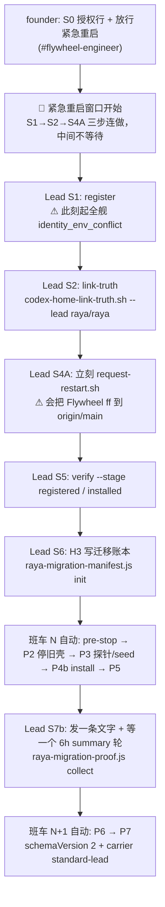

# FLY-2589 生产 Raya 仍是旧壳 0f77e977 — 实施计划

Issue: FLY-2589 (https://linear.app/geoforge3d/issue/FLY-2589/raya热修-生产-raya-仍是旧壳-0f77e9770000-班车判-raya-rayaconfig)
日期: 2026-09-15
基于: research.md

---

## 1. 最小修复的裁定

issue 给了三个候选（manifest 修正 / ledger 补录 / updater 判定修正）。逐条裁定：

| 候选 | 裁定 | 理由（research.md 章节） |
|---|---|---|
| **manifest 修正** | ❌ 不做 | `manifests/raya-raya.json` 字段全对，还能过班车自己的 canonical 校验。它唯一的问题是**孤儿**——注册表里没有对应行。修 manifest 修不掉这个。§1.5 |
| **ledger 补录** | ⚠️ 必做，但**排第二** | H3 `init` 在 `raya-migration-init.ts:201-216` 硬要求 `projects.json` 恰一行 raya。注册表不补回来，H3 必然 `registry-identity-invalid`。§5.1 |
| **updater 判定修正** | ❌ 不做 | 两条判定都在正确地 fail-closed：一条拒绝给"身份不唯一"的 Lead 重启授权，一条拒绝在没有授权账本时动旧壳。**放宽任何一条都是把守卫拆掉换收敛。** §7 |

⇒ **真正的最小修复是第 0 步：把注册表那一行补回来。**
方式不是手改 `projects.json`，而是**按 FLY-2559 修正后的顺序重跑 FLY-2496 §4 的
H1 余项 + H2 + H3 + H4**。注册表与 summary receipt 必须一起动（两者在 9-14 被一起回滚），
只有 `flywheel-lead.sh register` 的事务能保证这一点。

**本单不需要代码改动**就能让割接跑完。代码侧只留一个不阻塞的加固 follow-up（§5）。

---

## 2. 修复流程总览



### 🔴 0. 绑定约束：register 必须在紧急重启窗口内做（Lead 裁定，2026-09-14 实测舰队事实）

> **Lead ruling `584107d1`（已核实的舰队事实）**：
> `flywheel-lead.sh register` 会重写 `~/.flywheel/projects.json`，
> **此后每一个正在运行的 Claude / Codex Lead 立即 `identity_env_conflict`，
> send / respond 全部失败，直到整个舰队重启才恢复。Bridge 单独 reload 清不掉。**

推论，全部是硬约束：

1. **S1 register 与 S2 link-truth 必须排进 founder 授权的紧急重启窗口里、紧贴重启工单之前执行**，
   **绝不可以**当成"白天随手做一步、晚点再重启"的独立步骤。
2. **§3 S4 的 B 路（等一次自然发生的 Flywheel deploy）因此不可用**：
   register 到下一次真实部署之间可能是几小时到几天，这期间**整个 Lead 舰队是哑的**。
   B 路只在 founder 明确接受"舰队从 register 到那次部署之间全程不可用"时才成立 ——
   正常情况下**只走 A 路**。
3. 窗口内的执行顺序是：`register` → `link-truth --inspect == already` →
   **立刻** `request-restart.sh` → 重启完成后 `verify`。三步之间不要插入任何等待。
4. **2026-09-14 的事故就是这一条**：13:15 register 之后舰队进入 `identity_env_conflict`，
   操作者在 17:26–17:43 之间把 `projects.json` + `migration-receipt.json` 保时间戳还原回注册前
   以恢复舰队 —— 但 `manifests/raya-raya.json` 没被一起清掉，于是留下孤儿 manifest，
   从此每次跑 Lead 重启波的部署都 `config-drift failed:1`。见 research.md §3.2。

---

**另外三条关键修正（Codex R1 #1/#2 指出，我已逐条复核源码确认）**

1. **班车 N+1 不会自己产生 proof。** `scripts/lib/updater-raya-deploy.sh:1192-1203`：
   P5 之后调 `raya_standard_collect_proof`，`proof.json` 不存在就固定返回
   `awaiting_proof / p5-awaiting-real-p6-evidence`，**永远不会推进到 P6/P7**。
   proof 必须由 Lead 手动跑 H4（见 S7b）。
2. **"等下一班车"不等于"Bridge 会重启"。**
   `scripts/update-flywheel.sh:639-643`：定时班车发现 `deployed-sha == origin/main`
   就直接 `scheduled_current` 返回，**不部署、不重启、不跑 Lead 波**。
   只有 `:644-653` 的落后分支才 `default_deploy` → `restart-services.sh`。
3. **紧急重启不是"只重启 Bridge"。** `scripts/update-flywheel.sh:144-183` 的 `default_deploy`
   会 `git fetch` + `merge --ff-only origin/main` + 全量 `restart-services.sh`。
   走 A 路 = **同时把 Flywheel 部署到当时的 `origin/main`**。
   `request-restart.sh` 也**不读、不校验** S0 那条 Discord 消息 —— S0 是给 H3 工具用的授权凭证，
   不是紧急重启的机器门。而且现有链路**不 pin 最终部署的 sha**（详见 §3 S4 A 路），
   founder 能批准的只能是"部署执行时最新的 `origin/main`"。

**时间预期**：在 quiet-window（#raya 15 分钟安静）、P3 无 unresolved、summary 轮按时
delivered、H4 proof 一次通过、且期间 Flywheel 不再发布触发 rebind 的**理想情况下**，
最快是「S1–S6 当晚 → 次日 00:00 班车 N → S7b → 12:00 班车 N+1 出 v2 回执」。
任一 gate 不满足就顺延一班。**不承诺具体日历时间。**

> 本单是只读调查节点：**下面所有步骤都不由本 Runner 执行**。
> S1/S2/S5/S6/S7b 是 Lead 在宿主执行；S0 与 S4A 是 founder 门。

---

## 3. Operator Runbook

### 共用变量

```bash
export FW_TARGET_RAYA_SHA=9d63a2b2e6736bcdd5e699945b3bf8655c06c5e9
export FW_RAYA_CHANNEL=1542079099928059987      # 出处见下
export FW_RAYA_BOT_ID=1542068543645024257       # 出处见下
export FW_PROBE_BOT_ENV=FLYWHEEL_ALERT_DISPATCH_BOT_TOKEN
```

`FW_RAYA_CHANNEL` / `FW_RAYA_BOT_ID` 不需要重新去 Discord 找 —— 9-14 那次注册成功后的
镜像被完整保留在 `~/.flywheel/projects.json.bak-raya-registered-20260914T202713Z`
（research.md §3.2 第 2 点），可直接核对：

```bash
jq -c '[.[]|select(.projectName=="raya")|.generalChannel,
        ((.leads//[])[]|select(.agentId=="raya")|.botUserId)]' \
  ~/.flywheel/projects.json.bak-raya-registered-20260914T202713Z
# 期望 ["1542079099928059987","1542068543645024257"]
```

该备份**只作为取值参考**，**不要**用它去覆盖 `projects.json` —— 绕过事务就没有锁、
没有 planned digest，summary receipt 也不会跟着走。

---

### S0（founder）授权行

**前置**：`cutover=` 必须等于 `FW_TARGET_RAYA_SHA` 前 8 位。今日实测
`git -C ~/.flywheel/raya/code rev-parse origin/main` = `9d63a2b2…`，所以 `9d63a2b2` 有效。

**动作**：founder 在 **#flywheel-engineer** 发一条消息，正文中**单独占一行**（前后可有其它文字）：

```
FLY-2496 AUTHORIZE register cutover=9d63a2b2 urgent-restart baseline=quiet15m
```

**期望**：记下该消息的 `message id` 与 `channel id`（S6 要用）。

**验证**：机器侧**只在 S6 的 `init` 里校验**（`raya-migration-manifest.ts:39-61`
`verifyMigrationAuthorization`：作者必须是 `resolveFounderId` 解出的 founder、非 bot、
该行 `trim()` 后**逐字符相等**）。S1 的 register 与 S4A 的 `request-restart.sh`
**都不读这条消息**；它们的授权是 founder 当次的人工放行。
所以这里只需人眼确认没有多余空格 / 全角字符 / 换行断句。

**回滚**：无副作用；写错就重发一条，S6 用新 id。

> 如果 2026-09-14 已经发过同样一行且 `cutover=9d63a2b2`，可直接复用那条的 id，不必重发。

---

### S1（Lead）重跑 register —— **必须在紧急重启窗口内**

> 🔴 **开跑前先确认窗口已开**：founder 已放行本次紧急重启，且你能在 S1 之后
> **几分钟内**连做 S2 与 S4A。
> 一旦 `register` 返回，**全舰 Lead 立即 `identity_env_conflict`，send/respond 全挂，
> 只有整舰重启能恢复**（§2 绑定约束 0）。
> 窗口没准备好就**不要**跑这一步 —— 这正是 2026-09-14 的事故起点。

**前置条件（逐条可独立验证）**

```bash
# 1) 注册表里确实没有 raya（否则本步跳过）
jq -e '[.[]|select(.projectName=="raya")]|length==0' ~/.flywheel/projects.json

# 2) 没有悬挂的 registry 事务 intent
! ls ~/.flywheel/state/summary-registry/migration-receipt.json.lead-registry-intent.json 2>/dev/null

# 3) 现存 manifest 与将要写入的身份一致（materializer 不覆盖已存在文件，
#    见 scripts/materialize-lead-manifests.sh:72-75）
jq -e '.projectName=="raya" and .leadId=="raya"
       and .projectDir=="'"$HOME"'/Dev/raya-lead-workspace"
       and .projectsFile=="'"$HOME"'/.flywheel/projects.json"
       and .leadBackend.backendId=="codex-app-server"' ~/.flywheel/manifests/raya-raya.json
```

**动作**（与 FLY-2496 §4 H2 的 `REG` 数组逐字段相同）

```bash
REG=( --project-name raya --project-root "$HOME/Dev/raya-lead-workspace"
  --project-repo xrliAnnie/raya --general-channel "$FW_RAYA_CHANNEL"
  --lead-id raya --chat-channel "$FW_RAYA_CHANNEL"
  --bot-token-env RAYA_BOT_TOKEN --bot-user-id "$FW_RAYA_BOT_ID"
  --harness codex --model gpt-6-astra --effort xhigh
  --model-context-window 1050000 --summary-role recipient
  --can-spawn-runners false
  --alert-channel "$FW_RAYA_CHANNEL" --alert-bot-token-env RAYA_BOT_TOKEN
  --alert-fallback-to-core false )

"$HOME/.flywheel/bin/flywheel-lead.sh" register "${REG[@]}" --dry-run
"$HOME/.flywheel/bin/flywheel-lead.sh" register "${REG[@]}"
```

**期望输出**

- `--dry-run` 打印 `"dryRun": true`。它是 **"零持久 registry / receipt / manifest 变更"**，
  不是"零写"：wrapper 仍会取 `projects.json.cfglock`，`lead-registry.ts:563-586`
  也会创建并删除一个 validation 临时文件。
- 正式 run 打印 `{"ok":true,"leadKey":"raya-raya",…,"effectiveAt":"next-bridge-restart"}`。
- materializer 打印 `materialize: keeping existing …/raya-raya.json`（已存在且内容正确，
  **这是预期**，不是错误）。

**独立验证**

```bash
jq -e '[.[]|select(.projectName=="raya")|(.leads//[])[]|select(.agentId=="raya")]|length==1' \
  ~/.flywheel/projects.json
cd ~/Dev/flywheel && bash -c 'source scripts/lib/lead-restart-lifecycle.sh;
  lead_restart_project_backend "$HOME/.flywheel/projects.json" raya raya'
# 期望打印 codex-app-server，rc=0
```

**失败与回滚**

- 若报 `manifest identity differs from projects.json; remove <manifest> and rerun register`
  （`scripts/flywheel-lead.sh:607`）：说明前置 3 没过；`mv` 走那份 manifest 再重跑 register
  （materializer 会重建一份正确的）。
- 若事务**中途崩溃**（留下 `…migration-receipt.json.lead-registry-intent.json`）：
  跑 `"$HOME/.flywheel/bin/flywheel-lead.sh" recover` 收敛该 intent。
- ⚠️ **register 一旦成功提交，`recover` 不是回滚手段。** 成功路径在
  `lead-registry.ts:698-712` 已删除 intent；没有 intent 时 `recover` 只返回
  `{"ok":true,"state":"none"}`（`lead-registry.ts:1114-1118`）。
  仓库里**没有** `unregister` 子命令（`scripts/flywheel-lead.sh:19-31` 的 usage 可查）。
  真要退回未注册态，必须由 Lead 按 FLY-2444 的人工注销路径走
  （`engineering/doc/FLY-2444-flywheel-lead-launcher/lead-in-any-repo.md:177-206`）。

  ⚠️ **本单所处的 `pending-install` 状态要走另一条分支**：FLY-2444 的注销第一步是
  `flywheel-lead.sh stop`，而 `scripts/flywheel-lead.sh:797-804` 的 `stop_lead` 会先要求
  现存 plist 通过 `plist_matches_lifecycle_target`，**plist 不存在直接 `fail … 78`，不是 no-op**。
  在班车 P4b 之前根本没有 `com.flywheel.lead.raya-raya.plist`，所以这一步必然卡住。

  正确顺序：

  先跑这段**fail-closed** 的只读判定（任何非"确定缺席"的结果都不许继续）：

  matcher 直接照抄仓库里已有的三态实现
  （`scripts/cutover/FLY-2264/lib/launchd-window.sh:44-58`，**错误正文必须绑定到 label**）：

  ```bash
  LABEL=com.flywheel.lead.raya-raya
  P="$HOME/Library/LaunchAgents/${LABEL}.plist"

  # a) plist / symlink 任一存在 → 立刻停
  if [ -e "$P" ] || [ -L "$P" ]; then
    echo "STOP: plist 存在 —— 不是 pending-install"; exit 1
  fi

  # b) launchd 三态：loaded / confirmed absent / unknown，unknown 也停
  out=""; rc=0
  out="$(launchctl print "gui/$(id -u)/${LABEL}" 2>&1)" || rc=$?
  if [ "$rc" -eq 0 ]; then
    echo "STOP: job 已加载 —— 不是 pending-install"; exit 1
  fi
  case "$out" in
    *"Could not find service \"${LABEL}\""*|*"No such process: ${LABEL}"*)
      echo "confirmed absent" ;;
    *)
      printf 'STOP: launchctl 状态未知（rc=%s）：\n%s\n' "$rc" "$out"; exit 1 ;;
  esac
  ```

  - 只有打印 `confirmed absent` 才**跳过 `stop`**，直接做 FLY-2444 的受锁部分
    （`engineering/doc/FLY-2444-flywheel-lead-launcher/lead-in-any-repo.md:177-194`）：
    持 `projects.json.cfglock` 更新 registry → `migrate-summary-registry.sh` 重铸 receipt →
    `flywheel-comm summary-registry verify-activation` 为 `ok:true` →
    `rm -f ~/.flywheel/manifests/raya-raya.json` → 等/获批一次 Bridge 重启。
  - 打印任何 `STOP:` → **停下升级 Lead / founder**。
    权限错误、launchd 通信失败、没绑定到本 label 的"找不到"**一律按"可能存在"处理**，
    不要把 `stop` 当 no-op、也不要手删 plist。

  **不要**再用保时间戳的拷贝覆盖 `projects.json` —— research.md §3.2 的证据指向的正是
  这类操作，且它会留下孤儿 manifest。

---

### S2（Lead）link-truth（FLY-2559 修正后的位置：register 之后）

**前置**：S1 的独立验证已过（未注册的 Lead 没有 pre-install authority）。

```bash
bash "$HOME/Dev/flywheel/scripts/codex-home-link-truth.sh" --lead raya/raya "$HOME/.codex-raya"
bash "$HOME/Dev/flywheel/scripts/codex-home-link-truth.sh" --inspect --lead raya/raya "$HOME/.codex-raya" \
  | jq -e '.state=="already"'
```

**期望 / 验收**：以 `--inspect` 的 `state == "already"` 为**唯一主判据**。

`already` 的定义是 `~/.codex-raya/auth.json` 是**指向 canonical truth 的精确 symlink**，
所以**不要**用 `ls -l … 0600` 去验 —— symlink 自身的 mode 没有意义。要补验就验形状与目标：

```bash
test -L "$HOME/.codex-raya/auth.json" && readlink "$HOME/.codex-raya/auth.json"
stat -f '%N mode=%Lp' "$(readlink "$HOME/.codex-raya/auth.json")"   # 跟随 symlink 验真身 0600
```

（今日实测是 `{"state":"requires-migration","profile":"personal"}`，且 `auth.json` 不存在
—— 这一步 9-14 从未成功过。）

**失败语义（重要）**：link-truth **不是**"失败就什么都没改"。link 可能已经原子替换成功，
只是目录 fsync 报 `uncertain`、或事后写 report 失败导致命令非零退出。
所以**非零退出后第一件事是重新 `--inspect`**：

- 已经 `already` → **不要**重复迁移、**不要**删 link，按 report / uncertain 单独处理；
- 仍是 `requires-migration` → 可按同样命令重试；
- 其它状态 → 停，报 Lead。

若 `--inspect` 拿不到 `already`，**停在这里**，不要往下走。

---

### S3 / S4 让 Bridge 重载 projects.json

两条硬约束叠在一起：

1. `register` 的 `effectiveAt: "next-bridge-restart"` —— S6 的 `init` 会
   `POST /api/lead-inbox/nudge` 并要求 **202**（`raya-migration-init.ts:252-254`
   `bridge-nudge-failed`），Bridge 没重载就拿不到 202；
2. 🔴 §2 绑定约束 0 —— register 之后**全舰 Lead 在重启前都是哑的**，
   所以这一步不是"什么时候做都行"，而是**必须紧贴 S2 之后立刻做**。

⇒ **默认且唯一推荐的是 A 路。** B 路见本节末尾，只在 founder 明确接受舰队停摆时才成立。

#### A 路（默认）：founder 批准一次 **Flywheel deploy + 全量重启**

```bash
bash "$HOME/Dev/flywheel/scripts/request-restart.sh"
```

**这不是"只重启 Bridge"。** `request-restart.sh` 为当时的 Flywheel `origin/main` 发
urgent token，`scripts/update-flywheel.sh:144-183` 的 `default_deploy` 会
`git fetch` → `merge --ff-only origin/main` → 全量 `restart-services.sh`。

**授权语义（诚实版，Codex R2 #2 更正）**：现有链路**不 pin 最终部署的 Flywheel sha**。

- `scripts/request-restart.sh:114-120` 在调用时重新 `ls-remote` 取 main，可能已不同于你展示给
  founder 的本地 ref；
- updater 消费时在 `scripts/update-flywheel.sh:519-557` 再 fetch 一次，token 只需是当时
  `origin/main` 的 **ancestor**（`:418-428` `merge-base --is-ancestor`）即算 valid；
- valid token 最终调用的是**不带 target 参数**的 `default_deploy`（`:597-611`），
  它 merge 的是**执行那一刻**的 `origin/main`（`:144-178`）。

⇒ 所以 A 路的授权只能表述为「**founder 批准部署执行时最新的 `origin/main`**」，
**不能**对 founder 声称"你批准的就是下面这个 sha"。
S0 那条 Discord 行里的 `urgent-restart` 是给 H3 账本记账用的 scope，
`request-restart.sh` 本身**不读也不校验它**。**Runner / Lead 不得自行发起。**

**若确实需要 exact-sha 授权**，当前脚本做不到；那要么另开一张 pinned-deploy 的代码单，
要么直接走 B 路（B 路是不需要本单改任何代码的正常发布路径）。

**动作前展示给 founder 的四行**（只读，作为"此刻的 main 长这样"的参考，不是合同）：

```bash
git -C "$HOME/Dev/flywheel" status --porcelain            # 必须为空（dirty 会被 default_deploy 拒绝）
sed -n 1p ~/.flywheel/deployed-sha                        # 当前部署
git -C "$HOME/Dev/flywheel" rev-parse origin/main         # 此刻的 main（执行时可能已前移）
git -C "$HOME/Dev/flywheel" log --oneline \
  "$(sed -n 1p ~/.flywheel/deployed-sha)..origin/main"    # 此刻会顺带带上去的 commit
```

**配套纪律（二选一，必须做其中一条）**：

- 从展示证据到 updater 完成之间**冻结 main 的合并**（不落任何新 PR），或
- 事后立刻核对**实际**部署结果并回报 founder：
  ```bash
  sed -n 1p ~/.flywheel/deployed-sha    # 实际部署到的 sha
  curl -s localhost:9876/health | jq -r .buildSha
  ```

**期望**：重启日志里 raya-raya 记为 `pending-install`（`scripts/restart-services.sh:2791`）、
该波 `failed:0`；其余席位正常。

**回滚**：无独立回滚；这是既有的受控 deploy 动作。

#### B 路（**默认不用**）：等一次**真实的 Flywheel deploy**

> 🔴 **先读这段再考虑 B 路**：因为 register 之后全舰 Lead 会一直
> `identity_env_conflict` 到重启为止（§2 绑定约束 0），走 B 路意味着
> **从 S1 到那次部署之间，整个 Lead 舰队不能收发消息**，可能是几小时到几天。
> 这只在 founder 明确接受停摆、或你能确知某次部署即将发生（此时它其实等价于 A 路的时序）
> 的情况下才成立。**正常情况请走 A 路。**
>
> 下面关于 `scheduled_current` 的事实仍然有用 —— 它解释了为什么"等下一班车"可能等不到重启。

**注意：不是"等下一次时钟唤醒"。** `scripts/update-flywheel.sh:639-643`：

```bash
if [[ "$(deployed_sha)" == "$remote" ]]; then
  log "scheduled shuttle: deployed-sha already matches origin/main (${remote:0:7})"
  UPDATER_CYCLE_RESULT=scheduled_current
  return 0
fi
```

`scheduled_current` 这一班**不部署、不重启、不跑 Lead 波**，Bridge 不会重载。

走 B 路前必须先确认确实有待部署差异：

```bash
git -C "$HOME/Dev/flywheel" status --porcelain            # 空
test "$(sed -n 1p ~/.flywheel/deployed-sha)" != "$(git -C "$HOME/Dev/flywheel" rev-parse origin/main)" \
  && echo "有待部署差异，下一班会 deploy+restart" \
  || echo "已 current —— 等时钟没用，要等一次真实发布"
```

**判据**：以 `/tmp/flywheel-updater.log` 里出现
`scheduled shuttle: deployed-sha is behind`（而不是 `already matches`）
以及随后的 restart 波为准；最终以 S5 的 nudge 202 为准。

该班的 raya pass 仍会打印 `raya shuttle: not_configured migration-ledger-absent`（预期，
因为 H3 还没跑）。

---

### S5（Lead）验证 registered / installed

```bash
"$HOME/.flywheel/bin/flywheel-lead.sh" verify --stage registered "$HOME/.flywheel/manifests/raya-raya.json"
"$HOME/.flywheel/bin/flywheel-lead.sh" verify --stage installed  "$HOME/.flywheel/manifests/raya-raya.json"
```

**期望**：两条都 rc=0。

`--stage installed` **不要求 plist 存在**（`scripts/flywheel-lead.sh:869,907` 分阶段提前返回），
它验的是 注册表 → summary 激活 → preflight → Bridge `/health.buildSha` → nudge 202。
真正的 `launchctl` 安装在班车 P4b（`scripts/lib/updater-raya-deploy.sh:399`）。

**副作用说明**：这条**不是纯只读** —— 它会 `POST /api/lead-inbox/nudge`
（`scripts/flywheel-lead.sh:895-906`）。它不写本地配置。

**失败分流（按 verify 打出的 FAIL 编号，不要一律归因 Bridge）**

| FAIL | 含义 | 处置 |
|---|---|---|
| 1 registry recovery intent | 有悬挂 intent | 回 S1 跑 `recover` |
| 2 Lead identity | registry 里没有 raya / backend 不符 | 回 S1 |
| 3 summary registry activation | receipt 与 registry 不一致 | 回 S1（register 事务会同时重铸两者） |
| 4 preflight | carrier / Codex home / 凭据链 | 回 S2 |
| 5 Bridge health | Bridge 没起 / `buildSha` 缺失 / URL 非 http(s) | 查 Bridge，不是 raya 的问题 |
| 6 nudge **404** | 原文：`registration succeeded; Bridge has not restarted, so the Lead inbox pump is absent` | **只有这条才是"Bridge 没重载"**，回 S3/S4 |
| 6 nudge 其它 HTTP / token 缺失 | 授权头 / 网络 | 按提示单独处理 |

---

### S6（Lead）H3 写迁移账本

**前置条件**

```bash
# 1) 账本目录状态（raya-migration-init.ts:164-184）
#    - 不存在              → 干净 init（今日就是这个状态）
#    - 只含 precheck.intent → 合法恢复形状，直接重跑 init（工具按 nonce 回找，不重发探针）
#    - 已有 manifest.json   → migration-already-initialized（只有 checkpoint=P2 且
#                             legacy_owner 全无 stop 时间戳时，才能 --resume-from-failed）
#    - 含其它杂项           → migration-directory-exists
ls -la ~/.flywheel/raya/migrations/FLY-2445-standard-lead 2>&1

# 2) 三把 token 在 ~/.flywheel/.env（只查键名，不打印值）
#    Bridge token 接受 FLYWHEEL_API_TOKEN 或 TEAMLEAD_API_TOKEN（raya-migration-init.ts:228-234）
grep -qE '^RAYA_BOT_TOKEN='      ~/.flywheel/.env && echo "RAYA_BOT_TOKEN ok"
grep -qE "^${FW_PROBE_BOT_ENV}=" ~/.flywheel/.env && echo "probe token ok"
grep -qE '^(FLYWHEEL_API_TOKEN|TEAMLEAD_API_TOKEN)=' ~/.flywheel/.env && echo "bridge token ok"
# 2026-09-15 实测：RAYA_BOT_TOKEN ✅、FLYWHEEL_ALERT_DISPATCH_BOT_TOKEN ✅、
#                  FLYWHEEL_API_TOKEN ❌ 但 TEAMLEAD_API_TOKEN ✅ → 满足

# 3) inbound-cursor 必须不存在（raya-migration-init.ts:281-308）
CUR="$(bash "$HOME/Dev/flywheel/packages/teamlead/scripts/codex-lead.sh" --print-state-dir raya raya)/inbound-cursor.json"
! test -e "$CUR" && echo "cursor clean: $CUR"

# 4) S5 两条 verify 都是 rc=0
```

**动作**

```bash
node "$HOME/Dev/flywheel/packages/teamlead/dist/bin/raya-migration-manifest.js" init \
  --target-raya-sha "$FW_TARGET_RAYA_SHA" \
  --authorization-message-id <S0 消息 id> --authorization-channel-id <S0 频道 id> \
  --probe-bot-token-env "$FW_PROBE_BOT_ENV" --dry-run

node "$HOME/Dev/flywheel/packages/teamlead/dist/bin/raya-migration-manifest.js" init \
  --target-raya-sha "$FW_TARGET_RAYA_SHA" \
  --authorization-message-id <S0 消息 id> --authorization-channel-id <S0 频道 id> \
  --probe-bot-token-env "$FW_PROBE_BOT_ENV"
```

**`--dry-run` 的真实语义**：它在 `raya-migration-init.ts:312` 才返回
`{"status":"dry-run","probe_send":"not-run"}`，在那之前**已经**跑完了全部只读校验
**并且 POST 过 Bridge nudge**（`:237-254`）。它不写 migration 文件、不发 Discord 探针，
但**不是无网络副作用的纯读**。

**期望**：正式 run 后 #raya 里出现一条
`[FLY-2496 pre-check <nonce>] 激活前发信能力检查，可忽略。`（设计中的探针，
FLY-2496 plan `:125` H3 第 5 条），账本落盘。

**独立验证（只读，与班车用的是同一个谓词）**

```bash
cd ~/Dev/flywheel && bash -c '
set +e
source scripts/lib/updater-raya-deploy.sh 2>/dev/null
raya_configure_runtime_paths
raya_manifest_base_valid; echo "manifest_base_valid rc=$?   # 期望 0"
jq -r "\"checkpoint=\" + .checkpoint + \" migration_id=\" + .migration_id" "$RAYA_MIGRATION_MANIFEST"
'
stat -f '%N mode=%Lp' ~/.flywheel/raya/migrations/FLY-2445-standard-lead/manifest.json  # 期望 600
```

**失败对照表**（工具只打失败项名称，不打值）

| 报错 | 含义 | 处置 |
|---|---|---|
| `registry-identity-invalid` | `projects.json` 没有唯一 raya 行 / `projectRoot` 不符 / botUserId、channel 不合法 | 回 S1 |
| `bridge-nudge-failed` | **覆盖一切非 202**：Bridge 未重载、不可达、超时、fetch 异常、鉴权失败 | 若 S5 刚刚拿到 202，优先怀疑 Bridge 当下不可达/超时；确认 S5 的 nudge 现在还是 404 才回 S3/S4 |
| `token-unavailable` | `.env` 缺 raya / probe / bridge 三者之一 | 补 `.env` 后重跑 |
| `authorization-*` | S0 那一行不匹配（作者 / 五个 token / `cutover=`） | 回 S0 重发 |
| `migration-already-initialized` | 账本 `manifest.json` 已在且不满足 resume 条件 | **停**，报 Lead；不要删 |
| `migration-directory-exists` | 目录里有 `precheck.intent` 之外的杂项 | **停**，报 Lead |
| `probe-delivery-ambiguous` | 探针 POST 结果不确定，`precheck.intent` 已落盘 | **保留 intent**，直接重跑 init（工具按 nonce 回找，绝不重发）。**禁止删 intent 后重发** |
| `legacy-plist-invalid` / `legacy-pid-invalid` | 两份旧壳 plist / PID 核验失败 | 停，查 `com.xrli.raya.{brain,voice}` |

**"init 失败不写文件"这句不成立**：正式 init 在 `raya-migration-init.ts:313-364`
**先建目录**，再由 `ensureDiscordProbe` 写 `precheck.intent`、POST Discord、回填 message id，
**最后**才写 `manifest.json`。`raya-migration-io.ts:305-324` 明确允许 POST 不确定时留下 intent
并返回 `probe-delivery-ambiguous`。这是 exactly-once 恢复机制，不是 bug。

**回滚（严格限定窗口）**

删除 `~/.flywheel/raya/migrations/FLY-2445-standard-lead/` **只在班车 N 尚未开始时**成立
（FLY-2496 plan `:224`；`:227` 明确 P2 停旧壳后**没有自动旧脑回退**）。删之前必须三条同时满足：

```bash
# a) 班车没在持锁
! test -d ~/.flywheel/raya/deploy.lock.d
# b) checkpoint 仍是 init 写下的初始 P2
jq -r .checkpoint ~/.flywheel/raya/migrations/FLY-2445-standard-lead/manifest.json   # 期望 P2
# c) 没有任何 legacy owner 被动过
jq -e '(.legacy_owner // []) | all(.stop_started_at_ms == null and .stopped_at_ms == null)' \
  ~/.flywheel/raya/migrations/FLY-2445-standard-lead/manifest.json
```

**任一不满足（尤其是 b/c 显示 P2 已经开始停旧壳）→ 禁止删除**：账本是唯一的
crash-resume 依据，删掉就没法续。停下升级给 Lead / founder。
已发出的 pre-check 探针消息无法撤回，但它自带"可忽略"字样。

---

### S7a 班车 N（自动，无人手）

pre-stop（fetch / `origin/main == target` / scratch build / **#raya 安静 15 分钟**）
→ P2 停旧壳 → P3 探针 + 停机窗口 + seed → **P4b install**（`updater-raya-deploy.sh:399`）→ P5。

**回执 `refused / p5-awaiting-real-p6-evidence` 是正常中间态**，不是失败。

**中途停住的合法态**（FLY-2496 plan §4/§7）：

| 状态 | 含义 | 处置 |
|---|---|---|
| `prestop-failed channel-active` | #raya 15 分钟内有人说话 | 旧壳零变更，等下一班 |
| `p3-unresolved-window` | 停机窗内有人类消息 / 探针投递不明 | Lead 人工 `resolve --as …` 后续跑；**不要重发探针** |
| `awaiting_rebind` / `awaiting_rebind_proof` | Flywheel 在 N 之后又发布了 | 班车自动 rebind；**activation 不变**，Lead 只需重跑 S7b 的 proof collect |

**回滚界线**：P2 停旧壳之后**没有自动旧脑回退**（FLY-2445 plan §6.5）。
失败态是"新通路 maintenance + 持久收件"，账本逐 job 可续。

---

### S7b（Lead）H4 取证与 proof —— **不做这步，割接永远停在 P5**

**前置**：班车 N 已到 P5（回执 `refused / p5-awaiting-real-p6-evidence`，
账本 `checkpoint == P5` 且有 `activated_at`）。

**动作**（FLY-2496 plan `:137-142`，其中第 1 步按 Codex R2 #1 订正）

1. 🔴 **必须由 founder 或另一个明确的人类账号**在 activation 之后向 **#raya** 发一条普通文字，
   记下 `messageId`；等 Raya 回复。

   **不能用 `FW_PROBE_BOT_ENV` 的 bot 发这条。** `collectMigrationProof`
   （`packages/teamlead/src/bin/raya-migration-proof.ts:241-244`）走的是普通 text evidence 分支
   （不传 `windowProbeAuthorId`），而该分支在
   `packages/teamlead/src/bin/raya-migration-proof-evidence.ts:236-248` 明确要求
   `original.author.bot !== true` 且 `snowflakeTime(messageId) >= activated_at`，
   bot 发的消息必定报 `inbound-identity-mismatch`。
   FLY-2496 plan `:139` 那句"用 `FW_PROBE_BOT_ENV`（或 founder…）"是**过时文案**，以本节为准。
   （S7a 里那条允许 bot 发的追问是 P3 的 **cutover-window probe**，走
   `windowProbeAuthorId` 分支，与这里的 `--text-message-id` 不是同一条消息。）

2. 等到下一个 6h 边界 —— `summary_absorption_round` delivered 是 **P6 门**的一项。
3. 采集 proof：

```bash
node "$HOME/Dev/flywheel/packages/teamlead/dist/bin/raya-migration-proof.js" collect \
  --text-message-id <第 1 步那条人类消息的 messageId>
```

> 真实 CLI 只接受 `collect --text-message-id <id>`
> （`packages/teamlead/src/bin/raya-migration-proof.ts:453-470`，`options` 里只有
> `text-message-id`）。**没有 `--dry-run`** —— FLY-2496 plan `:141` 里的 `[--dry-run]` 是过时文案。

**期望**：写出 `~/.flywheel/raya/migrations/FLY-2445-standard-lead/proof.json`（0600）。

**⚠️ 这条命令不是"只读取证"，它有真实副作用**（Codex R2 #4，已复核）：

- 取 Raya deploy lock（与班车同一 `deploy.lock.d` 协议）；
- **两次**跑 `flywheel-lead.sh verify --stage live`
  （`raya-migration-proof.ts:146-154` 与 `:404-411`），每次都会
  `POST /api/lead-inbox/nudge`（`scripts/flywheel-lead.sh:895-906`）；
- **发一条真实告警**：`raya-migration-proof-evidence.ts:36-53` 用固定 argv 调
  `scripts/lead-alert.sh --project raya --lead raya --kind activation_probe --severity info
  --title "Raya activation probe" --body <migration_id>
  --signature raya-activation-probe-<migration_id> --strict-delivery`，
  它会写 claim / delivery 状态并直接 POST Discord 或落 alert queue。

**这些副作用在后续 pane / process / binding 校验失败时不会回滚。**
好消息是 signature 固定，所以正常重试会复用同一个 alert episode ——
**不要**人工删 claims、**不要**手动重发告警。

**验证**

```bash
stat -f '%N mode=%Lp' ~/.flywheel/raya/migrations/FLY-2445-standard-lead/proof.json   # 期望 600
```

**失败分流（CLI 只打一个小写 token，不打提示语**
`raya-migration-proof.ts:453-478`**）**

⚠️ **同一个 token 会被多种原因复用 —— 先做只读诊断，再决定 wait / repost / escalate**
（Codex R2 #4、R3 #3 指出，已复核源码）。

| token | 源码 | 先做的只读诊断 | 才能决定的动作 |
|---|---|---|---|
| `proof-binding-drift` | `raya-migration-proof.ts:64-77` 的 `verifyBindings()` —— 账本 / canonical manifest / `projects.json` / summary receipt **任一字节或 digest 变了**，或 `deployed-sha` ≠ 账本 `flywheel_deployed_sha`，**统一抛这一个 token** | 逐项比对四个 digest 与 `deployed-sha`：<br>`jq -r '.canonical_manifest_digest,.registry_digest,.summary_receipt_digest,.flywheel_deployed_sha' <账本>` 与 `shasum -a 256` / `sed -n 1p ~/.flywheel/deployed-sha` 对照 | **只有**"三个 digest 全一致、仅 `deployed-sha` 变了" → 等下一班自动 rebind（班车只在 `updater-raya-deploy.sh:1162-1170` 这个 SHA 条件下进 rebind），rebind 后重跑 collect。<br>**任何 manifest / registry / receipt 漂移 → 停，升级 Lead**（那是身份漂移，不是 rebind 能修的） |
| `deploy-lock-held` | `raya-migration-io.ts:100` —— 除"班车正持锁"外，**lock 目录 malformed / 探不动 / owner start 不可确认 / 检查期间 lock 变了**也都归到这一个 token | `ls -la ~/.flywheel/raya/deploy.lock.d`；读 `pid`/`start`；`ps -o lstart= -p <pid>` 核对 | owner 是**活着的**班车进程 → 等它放锁后重跑。<br>其余（目录残缺、pid 不存在、start 对不上）→ **停，升级 Lead**，不要手删锁 |
| `inbound-identity-mismatch` | `raya-migration-proof-evidence.ts:236-248`；⚠️ 与 `outbound-*` 同理，**两条 `readChatEvidence` 调用共用**（`raya-migration-proof.ts:241-244` H4 人类消息、`:250-255` P3 window probe） | 先定位失败域，分别查两条：<br>① H4 域 → `chat:raya:<--text-message-id>` 及其原始 Discord 消息（是不是 bot 发的？`snowflakeTime(id)` ≥ 账本 `activated_at`？channel/author 对不对？）<br>② window 域 → `chat:raya:<账本 .cutover_probe.message_id>`（author 是不是 `.window_probe.bot_user_id`？`bot===true`？nonce 与正文是否逐字符匹配？） | **只有 H4 域失败**才由人类在 activation 之后重发一条、用**新 id** 重跑。<br>**window 域失败 → 停，升级 Lead**：那是 P3 的授权证据，**不能**用一条新的人类消息替代 |
| `summary-evidence-missing` | `raya-migration-proof-evidence.ts:339` | 看上一个 6h 边界有没有 delivered 的 `summary_absorption_round` | 等下一个 6h 边界 |
| `outbound-evidence-invalid` / `outbound-identity-mismatch` | `raya-migration-proof-evidence.ts:273,287`；⚠️ `raya-migration-proof.ts:241-255` 对 **H4 人类消息**与 **P3 window probe** 复用同一个 `readChatEvidence`，两条路径吐同样的 token | 先定位失败域：出问题的 `chat:raya:<message-id>` 对应的是**第 1 步那条人类消息**，还是 P3 的 **cutover window probe**？ | 人类消息侧 → 让人类发一条新的 post-activation 消息、用新 id 重跑（**bot 追问修不了这个**）。<br>window probe 侧 → 才走 FLY-2496 §9 的 window-probe follow-up：12h 无回复就用 `FW_PROBE_BOT_ENV` 发一条**引用原探针的追问**（窗口消息 id 不变）；仍无 → 报 founder，**不伪造** |
| `alert-delivery-unproven` / `alert-delivery-ambiguous` | `raya-migration-proof-evidence.ts:61,65,93,105,108,110` | 查 `lead-alert.sh` 的 claim / delivery 记录 | 停，查投递链；**不要**重发告警（signature 固定，重跑会复用同一 episode） |
| `proof-pane-drift` / `proof-process-drift` | `raya-migration-proof.ts:424,432` —— 采证期间 TUI pane 或 Lead 进程/thread-id/`.env` 变了 | 记录当前 pane / pid / start | 停，升级 Lead（有别的东西在动 Raya 进程） |
| `tui-thread-invalid` / `tui-pane-invalid` / `tui-thread-binding-invalid` / `tui-process-binding-invalid` / `proof-identity-invalid` / `proof-checkpoint-invalid` / `proof-token-unavailable` / `proof-bot-mismatch` / `window-probe-identity-invalid` | `raya-migration-proof-evidence.ts:122,157,168,178,183`；`raya-migration-proof.ts:57,90,99,110,115,121,144,249` | — | 停，报 Lead |
| `proof-operation-failed` | `raya-migration-proof.ts:473-477` 的兜底（**只**在异常信息不匹配 `^[a-z][a-z0-9-]+$` 时打这个） | 抓 stderr | 停，报 Lead，附完整 stderr |
| 🔴 **以上未列出的任何小写 token** —— 例如 `chat-evidence-input-invalid`、`mailbox-evidence-invalid`、`proof-state-path-invalid`、`proof-owner-invalid`、`legacy-owner-*`、`seed-evidence-invalid`、`alert-identity-invalid`、`text-message-id-invalid`、`proof-command-invalid`、`private-file-invalid`、`discord-request-failed` | 实现里合法 token 远多于本表；它们**符合正则，所以原样打印**，既不命中本表也不会变成 `proof-operation-failed` | 只记录，不动现场 | **一律停、保留现场、升级 Lead。**<br>**不得**猜测重试、**不得**删 claim / lock / proof、**不得**重发消息。<br>（`mailbox-evidence-invalid` 也被两条 chat evidence 调用共用，若要找可恢复路径，必须先像 `inbound-*` 那样区分 H4 与 window 两个 delivery id。） |

**回滚**：失败**不提交最终 `proof.json`**（但上面列的 nudge / alert / claim / queue 可能已发生，
不回滚）。已写成的 proof 在下一次 rebind 时由班车自动 `rename` 成 `proof.stale-<ts>.json`
（FLY-2496 plan `:145`），不需要人手删。

---

### S7c 班车 N+1（自动）

- 有 Flywheel 漂移 → 自动 rebind，回 S7b 重跑 proof collect（activation 不变）。
- 无漂移 → P6 → P7。

**最终验收**

```bash
jq -c '{schemaVersion, outcome, carrier, deployed_sha, flywheel_deployed_sha}' \
  ~/.flywheel/raya/deploy-receipt.json
# 期望 {"schemaVersion":2,"outcome":"deployed","carrier":"standard-lead",
#       "deployed_sha":"9d63a2b2e6736bcdd5e699945b3bf8655c06c5e9", …}
git -C ~/.flywheel/raya/code rev-parse HEAD     # 期望 9d63a2b2…
launchctl list | grep com.flywheel.lead.raya-raya
```

---

## 4. 本单交付边界

- 本 Runner 只交付 exploration / research / plan 三份文档 + 上面的 runbook。
- **不改宿主状态、不跑 install/launchctl、不动 `~/.flywheel/raya/code`、不发起重启。**
- S0 与 S4A 是 founder 门；S1/S2/S5/S6/S7b 由 Lead 在宿主执行。

---

## 5. 代码 follow-up（不阻塞本次割接，建议另开 simple_code 单）

**问题**：`~/.flywheel/manifests/` 的孤儿 manifest 无人回收。

- `scripts/materialize-lead-manifests.sh` 全文 103 行，**只写不剪**
  （`:72-75` 甚至对已存在文件默认跳过），注册表里删掉一个 Lead 不会带走它的 manifest。
  仓库也没有 `unregister` 子命令（`scripts/flywheel-lead.sh:19-31` usage）。

> **被排除的一条 scope**：一度怀疑 FLY-2444 注销 runbook
> （`lead-in-any-repo.md:177-206`）的"re-mint 失败就恢复"分支也有同一缺口。查证后**不成立**：
> 它 `:181-182` 存的 before image 仍含该 Lead，`:194` 的 `rm -f "$FW_MANIFEST"` 排在 verify 成功之后，
> 恢复分支还原出的是"registry 有 Lead + manifest 在"的一致状态。
> **那条 runbook 不需要改**，follow-up 只覆盖下面两条。
- 结果：注册表被回滚 / Lead 被注销之后，`lead_restart_collect_candidates`
  （`scripts/lib/lead-restart-lifecycle.sh:768-779`）仍会从 manifest 造出候选，
  判 `config-drift`，`scripts/restart-services.sh:2806-2811` 记 `failed+1`
  → **每一次真正跑 Lead 重启波的部署都会 `degraded`**。
  （**不是**每一班车：`scheduled_current` 的班次根本不跑重启波，见 §2 修正 2。）

**为什么这不是低优先级**：Lead ruling `584107d1` 确认 register 会让全舰 Lead
立刻 `identity_env_conflict`，所以"注册后被迫回滚"是一条**会重复发生**的路径
（2026-09-14 就是一次）。只要回滚不带走 manifest，每次都会留下一个孤儿。

**建议范围（择一，均需 TDD + 独立评审）**

1. **回收路径（优先）**：给 `flywheel-lead.sh` 补一条**显式、operator 触发**的
   `unregister` / `reconcile-manifests`，把"注册表里没有的 manifest"归档到
   `~/.flywheel/manifests/orphans/`。
   **不要**让普通 `register` / `recover` 静默 prune 别的身份投影 —— manifest 是身份投影，
   静默删除的爆炸半径比孤儿本身大。
2. **可观测**：`config-drift` 且 `sources` 只含 `manifest` 时（即"只有 manifest、注册表查不到"），
   把告警文案从泛化的"无法得到唯一一致身份"收敛为
   "manifest 存在但 projects.json 无此 Lead —— 孤儿 manifest，请回收或补注册"。

两条都**不是**放宽判定：分类继续 fail-closed，只是让故障可读、可由人快速处置。

**一个未证实、需要单独查的关联**：本次故障静默了 24h+，巡检每小时报
`raya checkout overdue` 却始终没有生成工程单。是否由 `lead-restart-config-drift-<key>`
的告警去重导致，**目前没有证据** —— patrol 走的是另一套 evidence/token，且
`packages/teamlead/lead-rules-base/runbooks/patrol-v1.md:194-203` 规定连续两个 tick 后
要搜索并重建工单。要把这条因果写实，需要 patrol reports + 去重查询 + Linear 搜索的
可复跑证据；否则应拆成一张独立的 observability 调查单，不要并进上面两条。

---

## 6. 验收判据（QA 读）

| # | 判据 | 验证方式 |
|---|---|---|
| 1 | research.md 每个结论带 file:line | 通读 research.md §1–§5 |
| 2 | 两条 updater 错误各有一条可复跑只读命令 | research.md §1.4（config-drift）、§2.3（migration-ledger-absent），两段都附 2026-09-15 实测输出 |
| 3 | runbook 每步有前置 / 命令 / 期望输出 / 回滚 | 本文 §3 S0–S7c 逐节 |
| 4 | 未改宿主状态 | 本单全部命令为 `ls/stat/jq/git rev-parse/shasum` 与只读函数调用；唯一的写操作是 scratchpad 里的 `cp -p` 时间戳实验（research.md §3.2 第 3 点），不在 `~/.flywheel` 下 |
| 5 | 最小修复被明确裁定，并区分 operator / 代码 | 本文 §1（裁定）、§4（边界）、§5（代码 follow-up） |
| 6 | 副作用声明与真实 CLI 一致 | 本文 S1（dry-run 非零写）、S5（会 nudge）、S6（dry-run 会 POST nudge；init 非原子）、S7b（proof 无 `--dry-run`） |

---

## 7. 附：本次被排除的两个错误结论

1. ~~"raya-raya manifest 某个字段漂了"~~ —— manifest 字段全对，且能过 canonical 校验。
   漂的是它与 `projects.json` 的关系。
2. ~~"班车判错了，应该放宽 config-drift 或 ledger 判定"~~ —— 两条判定都在保护旧壳，
   放宽等于允许在没有 founder 授权账本的情况下停掉正在服务的 Raya。

---

## 7b. Review residuals（未闭合 / 未复审）

按 Lead ruling `584107d1` 的停止规则：R4 仍是 CHANGES REQUESTED，**不再跑 R5**，
把残留逐字列在这里交给 Lead 裁决。

### 7b.1 Codex R4 的四条 —— 我已全部改完，但**没有任何一轮评审复核过这些改动**

原文（`/tmp/codex-rescue-design-feedback-flywheel-FLY-2589-plan-round4.md`）逐字摘录：

> **1. HIGH — `inbound-identity-mismatch` 仍然按错误的唯一来源分流**
> `plan.md:581` 只检查 `--text-message-id` 对应的人类消息，并要求人类用新 id 重发。但真实调用链是：
> - `raya-migration-proof.ts:241-244` 对 H4 人类消息调用 `readChatEvidence`；
> - `raya-migration-proof.ts:250-255` 对 P3 cutover window probe 再调用同一个 helper；
> - `raya-migration-proof-evidence.ts:236-248` 在两个分支的 author/channel/message/status 校验失败时都抛同一个 `inbound-identity-mismatch`。
> 因此该 token 也可能表示 P3 bot probe 的 author、nonce、正文或 mailbox author binding 不符。此时重发 H4 人类消息不会改变 window evidence，collect 会永久报同一错误。

> **2. MEDIUM — failure table 缺少安全兜底；真实 token 不会自动变成 `proof-operation-failed`**
> CLI 在 `raya-migration-proof.ts:473-477` 只把"不符合 lowercase-token 正则"的异常改写为 `proof-operation-failed`。实现里大量合法 token 没出现在当前表格，例如 `chat-evidence-input-invalid`、`mailbox-evidence-invalid`、`window-probe-identity-invalid`、`proof-state-path-invalid`、`proof-owner-invalid`、`legacy-owner-*`、`seed-evidence-invalid`、`alert-identity-invalid`、`text-message-id-invalid`、`proof-command-invalid`，以及底层 `private-file-invalid` / `discord-request-failed` 等。这些字符串本身符合正则，所以会原样打印，既不会命中表格，也不会命中 `proof-operation-failed`。

> **3. MEDIUM — S1 声称只接受 canonical absence，但 matcher 仍未绑定目标 label**
> `plan.md:213-220` 接受任何包含 `Could not find service` 或 `No such process` 的失败输出。方向已经 fail-closed，但这不是文案所称的"canonical"精确判据；它没有验证错误正文指向 `com.flywheel.lead.raya-raya`。

> **4. LOW — proof 表格中的两个文件名是不存在的缩写**
> `plan.md:586` 引用 `proof-evidence.ts` 与 `proof.ts`，仓库实际文件是 `raya-migration-proof-evidence.ts` 与 `raya-migration-proof.ts`。

四条我都已改（落地位置见 §8 的 R4 表）。**残留风险：这四处改动本身没有经过评审复核。**

### 7b.2 Lead 绑定约束（§2 约束 0）从未进入任何评审轮

Lead ruling `584107d1` 的 `identity_env_conflict` 约束是在 R4 跑完**之后**才收到并写入的。
它实质改变了 runbook 的时序（S1/S2 必须进紧急重启窗口、B 路降级为不推荐），
**Codex 从没看过这一版**。建议 Lead 重点看 §2 约束 0、§3 S1 的窗口前置、§3 S4 的 A/B 取舍。

### 7b.3 我自己知道的两个未取证项

1. §5 末尾那条 alert dedupe 是否挡住了 patrol 建单 —— **没有证据**，需独立取证（见 §5）。
2. 9-14 回滚的**具体命令与执行者**仍是推断（research.md §3.2 第 5 点）；
   **动机**已由 Lead 的舰队事实确定（research.md §3.2b）。

---

## 8. 评审记录

**Codex design review R1（2026-09-15，xhigh）**：CHANGES REQUESTED。
反馈原文 `/tmp/codex-rescue-design-feedback-flywheel-FLY-2589-plan-round1.md`。
九条我都自己回源码复核过，全部采纳并落地：

| # | 反馈 | 落地位置 |
|---|---|---|
| 1 | BLOCKER：S7 漏 H4 proof，N+1 不可能进 P6/P7 | 新增 §3 S7b；§2 修正 1 |
| 2 | BLOCKER：`scheduled_current` 不重启；urgent 会部署 Flywheel `origin/main` | §2 修正 2/3；§3 S3/S4 A 路 B 路重写 |
| 3 | BLOCKER：`recover` 撤不了已提交的 register；账本删除窗口未限 | §3 S1「失败与回滚」；§3 S6「回滚（严格限定窗口）」 |
| 4 | HIGH：link-truth 验收与失败语义写反 | §3 S2 重写 |
| 5 | HIGH：init 目录 / 失败 / resume 语义不准 | §3 S6 前置 1、失败对照表、"init 失败不写文件不成立"段 |
| 6 | MEDIUM：dry-run / verify 的"零写 / 只读"声明不实 | §3 S1 期望输出、S5 副作用与失败分流表、S6 dry-run 语义 |
| 7 | MEDIUM：`cp -p` 被写成唯一事实 | research.md §3.2 第 3–5 点与 §7 降级为 `[推断]` |
| 8 | LOW：file:line 订正 | research.md `:45`、`init.ts:164-184`、`init.ts:281-308`；本文 `:125`、`manifest.ts:39-61` |
| 9 | LOW：§5 "每一班车" 与 dedupe 因果无证据 | §5 收窄为"每次真正跑重启波的部署"；dedupe 因果拆为需独立取证 |

**Codex design review R2（2026-09-15，xhigh）**：CHANGES REQUESTED。
反馈原文 `/tmp/codex-rescue-design-feedback-flywheel-FLY-2589-plan-round2.md`。
六条同样逐条回源码复核后全部采纳：

| # | 反馈 | 落地位置 |
|---|---|---|
| 1 | BLOCKER：H4 的 `--text-message-id` 必须是**人类**消息，bot 发的必报 `inbound-identity-mismatch` | §3 S7b 动作第 1 步重写（引 `raya-migration-proof.ts:241-244` / `proof-evidence.ts:236-248`），并标注 FLY-2496 plan `:139` 为过时文案 |
| 2 | HIGH：urgent 链路不 pin sha，A 路不能声称 exact-sha 授权 | §3 S4 A 路「授权语义（诚实版）」+ 二选一配套纪律；§2 修正 3 同步 |
| 3 | HIGH：`pending-install` 下 FLY-2444 注销第一步 `stop` 会 `fail 78` | §3 S1 新增 pending-install 分支（先只读确认无 plist 无 job → 跳过 `stop`），并直引 `lead-in-any-repo.md:177-206` |
| 4 | HIGH：proof collect 有 nudge×2 + activation alert 等不可回滚副作用，且 CLI 只吐 token | §3 S7b 新增「⚠️ 不是只读取证」段 + 按真实 token 的失败分流表 |
| 5 | MEDIUM：research 的推断降级没贯穿全文 | research.md §3.2 第 5 点改为"直接证据只给出上界"、时间线表逐格标 `[推断]`、§7 同步 |
| 6 | LOW：引用与谓词表述收尾 | `lead-registry.ts:1114-1118`、`lead-restart-lifecycle.sh:750-842`、`:447-460` 谓词改写、`init.ts:228-234`、S6 `bridge-nudge-failed` 覆盖面 |

**Codex design review R3（2026-09-15，xhigh）**：CHANGES REQUESTED。
反馈原文 `/tmp/codex-rescue-design-feedback-flywheel-FLY-2589-plan-round3.md`。
五条全部采纳 —— 其中 #1 是我在 R2 里自己引入的**错误结论**，已删除：

| # | 反馈 | 落地位置 |
|---|---|---|
| 1 | BLOCKER：我 R2 新增的"FLY-2444 恢复分支留下孤儿 manifest"与源码顺序**相反**（`:181-182` 存的 before image 仍含 Lead，`:194` 的 `rm -f $FW_MANIFEST` 在 verify 成功之后，恢复分支还原的是一致状态） | **删除**该论断：research.md §3.2 第 5 点改为"被排除的一个猜测"、原第 6 点整段删掉、§7 结论 5 去掉该依赖；plan §5 的对应段落改为"被排除的一条 scope" |
| 2 | HIGH：S1 的 pending-install 判定 fail-open（plist 存在不阻断；`launchctl print` 把权限/通信错误也当"无 job"） | §3 S1 改为 fail-closed 脚本：plist/symlink 任一存在即 `exit 1`；保留 `launchctl print` 原始输出，只接受 canonical `Could not find service` / `No such process`，其余一律停 |
| 3 | HIGH：S7b 失败表把复用 token 的多种成因导向同一动作 | §3 S7b 失败表重做成"token → 源码 → 只读诊断 → 才能决定的动作"四列；`proof-binding-drift` 拆出 digest 漂移 vs 仅 deployed-sha 漂移；`deploy-lock-held` 拆出非活 owner；`outbound-*` 拆出 H4 人类消息域 vs P3 window probe 域；补 `proof-pane-drift` / `proof-process-drift` |
| 4 | MEDIUM：research 结论段把"人手"和 17:26 下界重新升级为事实 | research.md「诚实边界」改为"执行者是不是人、用的哪条命令都是推断"；§7 结论 1 明写直接证据窗口只有"register 成功后 → 17:43:34 前" |
| 5 | LOW：`lead-restart-lifecycle.sh` plist 循环是 `:792-836`；FLY-2444 删 manifest 在 `:194` 不是 `:196` | research.md §1.2 与 plan §3 S1 均已订正 |

**Codex design review R4（2026-09-15，xhigh）**：CHANGES REQUESTED（四条，全部采纳并已落地）。
反馈原文 `/tmp/codex-rescue-design-feedback-flywheel-FLY-2589-plan-round4.md`。

| # | 反馈 | 落地位置 |
|---|---|---|
| 1 | HIGH：`inbound-identity-mismatch` 也可能来自 P3 window probe（`raya-migration-proof.ts:241-244` 与 `:250-255` 共用 `readChatEvidence`），重发 H4 人类消息修不了 | §3 S7b 该行改为与 `outbound-*` 同样的两域诊断；window 域失败明确为"停并升级，不能用新人类消息替代 P3 授权证据" |
| 2 | MEDIUM：表格缺 fail-closed 兜底，合法 token 远多于表内且不会变成 `proof-operation-failed` | §3 S7b 新增 🔴 catch-all 行：未列出的任何小写 token 一律停、保留现场、升级，禁止猜测重试 / 删 claim·lock·proof / 重发 |
| 3 | MEDIUM：S1 的 absence matcher 没绑定 label | §3 S1 改为照抄 `scripts/cutover/FLY-2264/lib/launchd-window.sh:44-58` 的 label-bound 三态判据 |
| 4 | LOW：`proof-evidence.ts` / `proof.ts` 是不存在的缩写 | 全部写全 `raya-migration-proof-evidence.ts` / `raya-migration-proof.ts` |

**评审轮次说明**：本单在 R3 触发了 `/codex-design-review` 的三轮安全阀。
我已按规则向 Lead 报备（`flywheel-comm ask` id `584107d1-bee5-46ad-b3de-180111ad7a17`），
并说明理由：本单是纯文档交付、R1–R4 共 24 条反馈全部回源码复核后采纳、零拒绝，
Codex 自 R3 起的结语都是"主方案没有被推翻 / 接近可批准"。未做任何 auto-approve。
