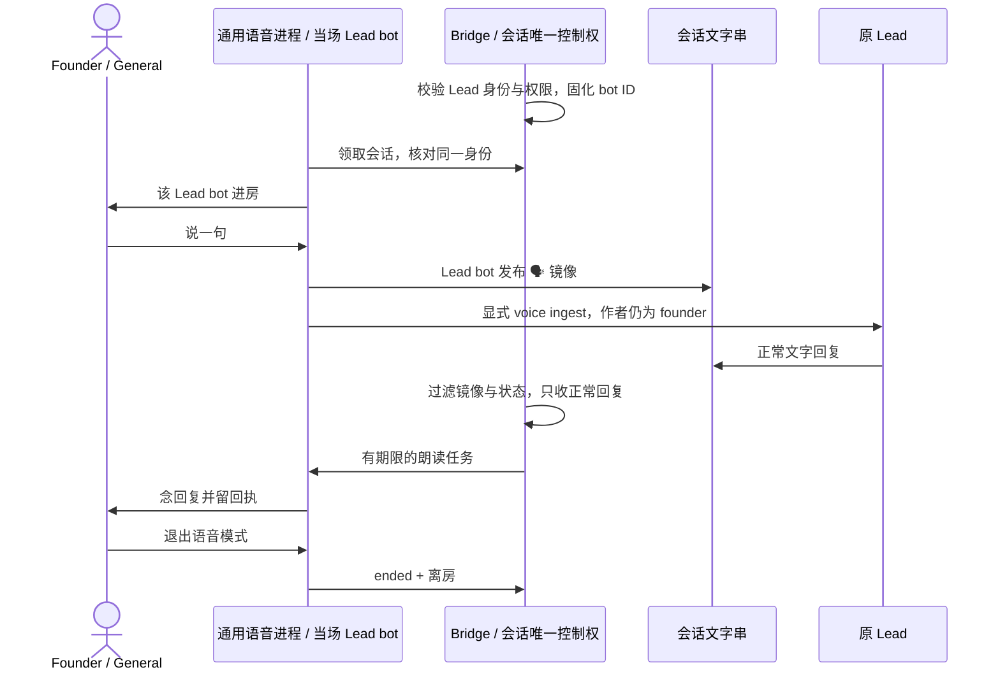

# FLY-2598 每个 Lead 自己进房的语音激活 — 实施计划
Issue: FLY-2598 (https://linear.app/geoforge3d/issue/FLY-2598/语音激活-主机激活-2446-通用语音进程会议模式-随身模式注册表-huddle-块-lead-voicemodes-voice)
日期: 2026-09-15
基于: research.md, design-correction.md

状态：R2 effective reviewVerdict=APPROVED（request f609c547-10e0-4bd8-868c-62a4d41c934f，gate 5ebee204-02f9-47e9-9c64-af1c92e1e9d1）。非阻断建议见 review-disposition.md 的 Follow-ups；没有扩大已审阅方案。实现节点必须遵循本计划与 design-correction.md；本 design 节点没有实现或激活权限。测试矩阵为待执行要求，不是通过声明。

## 1. Founder 可见的结果
在 General 房间里，叫 Engineering Lead 时看到、听到的都是它自己的 bot；切到另一 Lead 时上一场先结束，再由另一 bot 进房。你说的话在会话文字串留一行，交给原 Lead 思考，Lead 的文字回复再念出来。随身模式先给 Raya，单独实测。
先完成必要代码与测试，合入与部署分别走既有流程；独立 updater 部署后由 Lead 执行 host-runbook.md。你负责 General 里 Lead bot 角色的 Connect/Speak 和首场说一句；平台余额不足只记实际 API 失败，不再等 Codex 订阅额度。



## 2. 范围与选择
以 `[lead-instruction 5f6ece94-97b1-4223-9d30-3c755f407596]` 为新权威；2446 中编排 bot 与订阅额度前提废除。
选择 `project.voiceRoom`，仅两个房间 ID；旧 `huddle` 保留给旧消费者但本主机不配。拒绝用假的 ears env/同 token 填旧 schema，拒绝复用 alerts-dispatcher，拒绝每 Lead 常驻或多房并发。选择理由：不触动四个 legacy huddle selector，避免部署误启旧 voice-bridge；一处 room 配置服务新流程，不跨字段回退或镜像。
保留 2446 的 lease/占位事务/状态机/nonce/journal/mailbox/朗读回执/前台 v2 协议/单场唯一约束。不开新产品权限体系，不改 FLY-546 旧四路由，不重做 OS 隔离，不删 legacy voice 包。不重启生产 Lead 来跑测试。

## 3. 数据与身份合同
| 对象 | 目标形状 | 权威与校验 |
|---|---|---|
| ProjectEntry.voiceRoom | `{guildId:string, voiceChannelId:string}` 可选 | strict object，仅这两键，17–20 位 snowflake；null/absent 关闭；未知字段/非字符串拒绝 |
| Lead | `voiceModes:{meeting:true,rg:false}`，Raya rg=true；`realtimeVoice` | 现有严格布尔与十音色常量；主机对现有全部 17 Lead 显式写入，保留已有合法音色，否则 marin；不改原 edge-tts voice |
| Discord 身份 | `lead.botUserId` + `lead.botTokenEnv` | botUserId 是稳定身份；env 名只定位凭据；GET /users/@me 核实际 ID；绝不从 token 或显示名推身份 |
| VoiceSessionReservation | 新增必填 `voiceBotUserId:string` | start body 不可提供；preflight 成功后的目标 Lead ID 写入 |
| voice_sessions | 新增 `voice_bot_user_id TEXT NULL` | 新创建必填；历史终态 null 保留；历史活动 null 拒绝继续并收尾失败 |
| VoiceSessionRow / projection | `voiceBotUserId:string|null` / 新 claim 必为 string | projection 的 guild/channel/bot 均来自持久行；终态 status 可返回旧 null，不需 registry 存在 |
| SavedVoiceSession | projection 含 bot ID | 保存/重读/恢复严格核身份；无 bot ID 不准恢复发送 |
| voice-host.json | `{"schemaVersion":1}`，0600 | QA 用户/房间默认空，evidenceRoots 继承 loader 默认；不复制房间、bot、key |
| voice home | `~/.flywheel/voice/codex-home` 0700 | 空专用 home，只准备受控 API 配置，不复用订阅 auth；API key 本次进程显式登录 |

新 `voiceRoom` 与非空 legacy huddle 同时存在：通用 start 在写行之前返回 503 `voice_unavailable/legacy_voice_conflict`，不能悄悄选一个。ProjectConfig 只校验各项目字段形状；跨项目同房政策在 voice start resolver 校验，失配返回 503 `voice_unavailable/voice_room_conflict`，不拖垮普通 Lead 启动。配置工具仍只生成全部同房的候选。部署时同时检查旧 Flywheel/Raya voice 未占 General；本单不擅停 Raya 旧服务。
物化 voice-host.json 是本 issue 明确要求的主机交接对象，功能上与缺席默认值相同；保留它的代价是 mode 漂移可使 Bridge 装配失败。每次配置载入前检查普通文件/0600，不把这个文件存在当启用语音的信号。

稳定 tuple 为 `(sessionId,projectName,leadId,guildId,voiceChannelId,voiceBotUserId)`；同一 Lead 更换 token 但 /users/@me 仍同 ID 可继续，bot ID 改变则旧会话不得重绑。registry 是每个进程启动快照，修改后需要受管部署加载；不声称热更新。daemon 从 claim 起到正常发送与恢复，共用精确解析；配置快照不同导致拒绝并终结，不能使用其他 Lead token。

## 4. 身份在所有路径贯通
### 4.1 开场与权限
`voice-session-start.ts` 替换 huddleCredentials 为 `resolveLeadVoiceBinding(project,lead,env)`：要求 voiceRoom、无 legacy conflict、botUserId、botTokenEnv 及 resolved token；不读 orchestrator/ears。`preflightVoiceSession` 只用该 token 发一次 /users/@me，严格相等目标 botUserId，然后同一 member 的权限：
- General：VIEW_CHANNEL + CONNECT + SPEAK。
- Lead chatChannel：VIEW_CHANNEL + READ_MESSAGE_HISTORY + SEND_MESSAGES + CREATE_PUBLIC_THREADS + SEND_MESSAGES_IN_THREADS。
Discord GET 有有界超时、HTTP/JSON/缺字段明确拒绝；继承 `computeChannelPermissions` 覆盖 @everyone→roles→member。General GET 403 映射 `voice_permissions`，文字频道 GET 403 映射 `lead_text_permissions`，保留 stage/httpStatus，尚未算出的权限为 null（未知），不得伪造 false；member/roles GET 失败保留自己的 stage。新 room/mode/identity 失败均在 reserve/provision 之前，零根卡/会话行。编排 bot 忽略检查替换为 §4.4 运行中自身作者过滤证明；不编辑 access.json。
错误词：`self_filter_unverified`、`voice_room_conflict`、`voice_room_missing`、`legacy_voice_conflict`、`bot_env_unset`、`lead_bot_identity_mismatch`、`voice_permissions`、`lead_text_permissions`；状态一律 503 voice_unavailable，保留原 401/403/400/404 阶梯及返回结构。

### 4.2 Bridge 与持久化
StateStore 的接口、DDL、向前 migration、INSERT/select mapper、fixture 都补 voiceBotUserId；使用现有 parameterized SQL，不字符串拼接。保留单房 partial UNIQUE 与所有 lease CAS。
service resolver 核持久 tuple 对当前 project/lead/voiceRoom/botId，不相等报 `voice_session_registry_drift`。provision、claim projection、poll、状态发送均使用同一 resolver，poll 的作者固定 session botId。claim 应在写 claimed 之前验证能投影，防止失败后残留 claimed 行。status 路由返回持久行，历史终态不会因为 registry 已删而变 500。
Bridge 冷启巡检对活动行 botId=null：按现有 failure/终态清理事务置 `failed(identity_binding_missing)`，queued→dropped、claimed→ambiguous，保留所有原证据，零 Discord/ingest。不得按当前 registry 回填。非终态有 ID 但失配同样 `failed(voice_session_registry_drift)`，不发到新 bot。原迁移前先核无活动会话；这些守卫仍要测试。

### 4.3 daemon 与恢复
`VoiceSessionProjection`、SessionStateStore、cli.tokenFor 改为精确 tuple；新 `resolveLeadVoiceToken(projection,projects,env)` 仅返回目标 token，0 或多匹配、缺字段、room/ID 漂移一律失败。新 helper `verifyLeadVoiceTokenIdentity` 对 /users/@me 有界请求核 pinned ID；普通启动和 journal 恢复首次外部发送前都调用。
DiscordVoiceRoom option 增 expectedBotUserId；`registry.start` ready 后再核 `client.user.id`，失败 stop/destroy，零 join、镜像、ingest。仍用单一 BotRegistry 连接收发，Lead 文本 carrier 不加入语音连接。
恢复：先按原规则 renew 旧 lease；有效且 pinned 身份验证通过才能折叠 captured/mirrored journal；缺身份/漂移/identity GET 失败时写本地 abandoned，尝试有权限的 failed 报告，保留 evidence 并隔离 saved active record，处理后继续下一记录/idle，不能无限启动失败。失效 lease 路径仍零外部副作用。无法与 Bridge 通讯时本地不发送；待该精确行到期巡检，不代铸新 session。

### 4.4 同作者防回环
保留两个不同守卫：取信器拒收自己发出的消息；voice poller 排除 root 与 `🗣️/📻/🤖`。前者不再仅依赖已安装源码中的一行判断，必须满足 [self-filter-contract.md](self-filter-contract.md) 的运行中只读探测合同。Codex 在现有认证 inbox socket 增探测；Claude fork 配套小补丁固定已验证自身 ID、在未 ready/重连时拒收，并增加同等本地探测。不能直接改缓存；该补丁及受管载入是实现/激活依赖，缺席返回 503 `voice_unavailable/self_filter_unverified`。探测没有 Discord 发帖、模拟入房或 mailbox 写入。
显式 chat-ingest 仍写 authorId=founder、source_kind=voice、deliveryId=chat:<lead>:<镜像id>，重放逐字段核对。所有 session 产生的镜像/状态必须经现有 labels helper；普通 Lead 正常回复被朗读一次。保留前缀导致真实回复以这些符号开头不朗读的现有限制，写进运行手册，不做新分类协议。
删除 `codex-lead.sh` 从 huddle 注入编排忽略 ID；通用 ignoredAuthorIds 可选机制、self-id 过滤及其他调用方不删除，避免 CLI/能力不必要破坏。

### 4.5 同 token 的两条 Discord 连接
voice BotRegistry 是第二个完整 Gateway client；它不注册文字到 mailbox 的入口，文字入站仍只有原 carrier，voice 只收音频并显式投递口述。Discord 的 session_start_limit/并发 IDENTIFY 限制按 bot 共享，不能从 token 合法推断第二连接无影响。保留现有库的 reconnect/backoff，不增加循环 login；GET /gateway/bot 只读记录剩余额度，0/不可核时不开新的 voice 连接并给 bounded reason。首次上线先分开启动 carrier 与 voice，避免同时 IDENTIFY。
隔离测试模拟 carrier 重连/voice 重连/重复事件，验证没有第二条文字 ingest、没有重复口述/朗读；主机观察 carrier 仍 online、Gateway close code、voice ready/离房和 session_start_limit。真实同 token 共存仍为首场验收项，未执行不能宣称兼容；若 carrier 被断开/被踢，结束本场并保留证据，不静默改回另一 bot 或不断重连。

## 5. 平台认证合同
保留 Codex 0.153.2 realtime v2（gpt-realtime-1.5），只补 API 认证，不替换前台实现。
- daemon config loader 要求其 wrapper source 后的 OPENAI_API_KEY 非空；保存在父进程私有 realtimeApiKey 字段。`voiceCodexEnv` 保持现有正向白名单，**不增加 API key**；`spawnCodexAppServer` 保持默认 washSecrets，实际 child env 不含任何 API/Discord/Bridge/Linear/Lead 凭据。不打印 env 或 RPC payload。
- RealtimeFrontend options 增 apiKey；**account/login/start 是唯一认证通道**，通过 app-server 私有 stdin 的 JSON-RPC 传递。进程 initialize 后、任何 thread/start 前执行：
```typescript
await request('account/login/start', { type: 'apiKey', apiKey });
const receipt = await request('account/read', { refreshToken: false });
// 两次 error 均失败；receipt.result.account.type 必须 === 'apiKey'。
// 只记录认证种类与成功布尔，不保留 receipt 原文/请求体。
```
- voice home `config.toml` 固定 `forced_login_method="api"`、`cli_auth_credentials_store="ephemeral"`，不含 provider/endpoint override、MCP/订阅登录；config 来源是 Lead 本次准备的私有普通文件。每次 launch 都重新使用 env key 登录。schema 已由当前 `codex app-server generate-json-schema` 离线核对 type/apiKey/account/read 字段；实现要测试真实二进制本地 RPC 与 mock server 返回，不能以 env 存在替代认证回执。
- 若当前 binary 不支持 ephemeral/API login，明确失败并 report，不降级到订阅、不升级 Codex 来绕过门。认证失败被归类为 session failed(realtime_api_auth)，runtime 不自切账号。缺 key 启动 exit0 fail-loud，运行认证/network/余额失败留下 bounded reason；不可转存 raw error 里可能的 key。
- 平台余额/模型可用性仅真实连接能证；用无生产音频、无 Discord 的有界 Realtime 握手可在 QA/Lead 授权范围执行，或首场一起验。余额未知不阻塞设计/代码审核，不标记可用。

## 6. 安装与主机变更工具
### 6.1 首装入口（需要实现）
新增 `scripts/install-voice-launchd.sh [--check]`，遵循 install-bridge-launchd 的 shell 入口风格，但不使用会生成错误 KeepAlive 的 generic renderer。source `scripts/lib/converge-nonlead-daemons.sh`（source-only）复用 `_cnd_copy_plist_preflight` / `_cnd_install_plist`，以及 supervisor probes。只认生产 repo 的 `scripts/launchd/com.flywheel.voice.plist`。
检查顺序：Darwin/UID501 的实际 user domain；source 普通文件、Label、wrapper exact path/executable、RunAtLoad=true、SuccessfulExit=false、ThrottleInterval=30；host/env/built CLI/voice home 的本地配置检查；旧服务冲突与显式 disabled override。`--check` 零写/零 bootstrap，不做 Discord/API 计费调用。
目标为 `~/Library/LaunchAgents/com.flywheel.voice.plist`：不存在才原子 create-if-absent；存在完全相同则复用，异内容或 symlink 拒绝，不覆盖。`launchctl bootstrap gui/501 <published-plist>` 只发生在本显式安装命令；已加载时只核 keepalive/已加载程序与预期一致，不 restart。disabled 时 fail，不自动 enable。bootstrap 后 `supervisor_assert_keepalive voice on-failure` + 有界观察 print 的 running/PID；wrapper exit0 拒绝必须返回失败并给日志位置，不能假成功。
失败恢复只处理本次新建且 hash/inode 仍匹配的 plist；若本次 bootstrap 成功再验证失败，先 bootout 此次 job，确认停住再条件移除本次 plist；原有同字节 plist保留。安装过程/目标受单独有界文件锁保护，避免两个调用互相 bootout。对 pid/path 无法确认的 loaded job fail 而不动它。不在此脚本安装 Bridge/Lead，不修改 manifest hold，不启动旧 voice-bridge。
回滚已有 `source scripts/lib/supervisor.sh; supervisor_stop voice service`，但先经 session stop 并等终态/离房；详见 runbook。更新器仍只重启已装 voice。
hold 同时跳过 plist 漂移检测与 bootout 后自愈。Engineering Lead 负责每次激活/部署后及既有主机巡检时运行 --check + source/installed cmp + launchctl print；漂移只报告，由 Lead 在既有授权窗口处理，不增加自动修复服务。

### 6.2 只读预检入口（需要实现）
新增 `scripts/qa/fly2598-voice-preflight.mjs --project <p> --lead <l> --out <json>`：加载生产 registry/voice-host/env，精确解析指定 Lead，调用同一 `preflightVoiceSession`；只做 Discord GET、本地校验与已认证只读 self-filter probe，无合法 session POST、进房、注册、配置写入。输出白名单 public IDs/检查 boolean或null/HTTP status/stage/reason/时间与代码sha，以及 self-filter 的 runtimeId、botId、contractVersion、结果布尔；不含token或raw response。可逐Lead调用生成完整矩阵；默认不得扩大qaAllowUserIds。mock fetch断言HTTP仅GET，缺token/错ID/权限覆盖/GET403/timeout及探测缺席逐例验证。

### 6.3 配置工具（需要实现）
新增 `scripts/voice-host-configure.mjs`，只准备/应用/恢复本次固定 voice 字段，支持 `prepare --out <private-dir>`、`apply --receipt <private-dir/receipt.json>`、`restore --receipt ...`。prepare 写候选和私有 receipt，不碰生产配置；apply/restore 必须被现有 `config_write_locked ~/.flywheel/projects.json.cfglock 10 ...` 包裹，工具核共享锁环境（依现有 lock helper 能提供的实际合同）或内部通过该 helper 重入执行，不能仅信一个 caller 字符串声称持锁。最终选内部重入：外层 Node 调 bash source lock helper，锁住的子进程以私有继承 fd/内部子命令完成同一事务；不暴露无锁 apply API。
固定 scope：所有现有项目新增 voiceRoom=General；所有现有 Lead meeting=true，仅 exact raya/raya 的 rg=true，其余 rg=false；现有合法 realtimeVoice 保留，缺席设 marin；任何 legacy huddle 非空先拒绝；voice-host 创建 `schemaVersion:1`，若已存在只验证并保留原合法字段；不创造/删除 Lead。
prepare 在锁中读取 projects、summary receipt、voice-host 前像并备份（含 mode/absent/hash），生成候选、调用 `node packages/teamlead/dist/bin/validate-projects.js <candidate>` 以及 `summary-registry verify-activation --projects-file <candidate> --receipt-file <existing-receipt>`。receipt 不含 token，备份不提交 Git，目录0700/文件0600。
apply 重新持锁比对每个前像哈希，校验无登记恢复 intent、候选 hash 与校验通过，再同目录 fsync+rename 发布 projects / voice-host，保持 summary receipt byte-identical。每步写 before/after receipt；进程中断时下次仅能在各文件为前像/本次后像的组合恢复或完成，第三方改动一律 conflict，禁止无条件回滚。失败恢复前像后再次 summary verify；restore 同一规则，receipt 不匹配也 conflict，不重铸 summary authority。config apply 不启动任何服务。

## 7. 实现顺序与测试（TDD）
依赖安装使用既有 pnpm workspace 流程；本设计工作树没有 node_modules，不声称运行代码测试。所有代码批先添加表中的行为测试→运行指定文件确认失败原因对应新合同→最小实现→同组回归通过→单独 commit。无需复制当前实现写同形测试。

| 批次 | 文件与精确修改 | 必须证明的行为 |
|---|---|---|
| A room schema | ProjectConfig.ts；`src/__tests__/voice-session-config.test.ts`、huddle-config.test.ts | voiceRoom strict IDs/unknown fields；跨项目异房只阻断 start；旧 huddle fixtures 兼容；mixed 冲突不启用 generic；缺席默认不变 |
| B 持久身份 | StateStore.ts、`bridge/voice-session-start.ts`、services/routes/runtime；现有 `src/__tests__/StateStore.voice-session.test.ts`、`StateStore.voice-session-schema.test.ts`、start/services/routes/runtime 测试 | 新行 bot pin/read roundtrip；老 DB 加列幂等；终态 null 可读；活动 null/漂移收尾且无发送；claim 前验证；单房并发仍一胜一409 |
| C preflight/回环 | preflight.ts、poller.ts、`packages/teamlead/scripts/codex-lead.sh`；preflight/poller tests、CodexDiscordGateway/CodexLeadInboxSocket tests；配套 fork self-filter 测试 | 运行 probe 同身份/同 guard，缺席/旧版本/重连未知拒绝且零 reserve；两个不同 Lead 的 token 各自核 /me；wrong token/role/overwrites零 reserve；同作者混页只收正常回复，全过滤页游标前进；显式 voice ingest 不重复 |
| D daemon | voice-codex config.ts、cli.ts、bridge-client.ts、discord-room.ts、session-state.ts、daemon.ts；config/discord-room/session-state/daemon tests | project+lead双重唯一；wrong ready ID零 join；恢复 REST错 ID零发送；saved旧/坏/漂移记录不会重绑或卡启动；lease过期零副作用；同 token 双 client 重连/重复事件不产生第二条文字 ingest |
| E API认证 | voice-codex config.ts/realtime.ts/cli.ts；config/realtime-speech tests；wrapper及其现有 shell tests | 实际 spawn child env 无 API key且默认 wash 不关闭；父进程持 key，经唯一 login RPC 传入；先 API login/read 再 thread；chatgpt/null/error拒绝且不启动音频；假密钥不可见于 stdout/stderr/journal；已有 no-tool/read-only/clientManagedHandoffs 保持 |
| F 首装与配置 | 新两个 scripts；`scripts/__tests__/install-voice-launchd.test.sh`、`voice-host-configure.test.mjs`；现有 wrapper/manifest tests | --check零写；新装/重复/disabled/异plist/symlink/并发/拒绝退出0/验证失败条件恢复；双文件receipt不变、hash冲突、每步崩溃恢复、summary verify失败不发新配置 |
| G QA/手册消费者 | `scripts/qa/fly2446-two-lead-run.mjs`、新增 `scripts/qa/fly2598-voice-preflight.mjs`；本目录 host-runbook.md；对应 QA contract tests | QA driver 不再读 orch/ears，读 per-session Lead；保留与2446两 harness+adapter测试的区别；证据包含 botId |

文件名以 checkout 的既有测试为准：若表中描述名无现有文件，创建上述命名的 focused test，不重命名整个测试族。实施提交前 `rg` sweep `orchestratorBot|earsBot|voiceMirrorIgnoredAuthorIds|HUDDLE_ORCHESTRATOR` 覆盖新/旧生产消费者、scripts 与测试；保留项逐条标“legacy-only/通用能力”，不能只修改主 happy path。

必要命令（实际 package name 已从 package.json 核对，测试文件按批精确传入）：
```sh
pnpm --filter flywheel-teamlead exec vitest run src/__tests__/huddle-config.test.ts src/__tests__/voice-session-config.test.ts src/bridge/__tests__/voice-session-start.test.ts src/bridge/__tests__/voice-session-preflight.test.ts src/bridge/__tests__/voice-session-poller.test.ts
pnpm --filter flywheel-voice-codex test
pnpm --filter flywheel-teamlead exec vitest run src/lead-backends/codex/__tests__/CodexDiscordGateway.test.ts src/lead-backends/codex/__tests__/CodexLeadInboxSocket.test.ts
pnpm --filter flywheel-comm exec vitest run src/commands/__tests__/voice-session.test.ts
bash scripts/__tests__/flywheel-voice-wrapper.test.sh
bash scripts/__tests__/install-voice-launchd.test.sh
node --test scripts/__tests__/voice-host-configure.test.mjs
bash scripts/__tests__/launchd-units-manifest.test.sh
pnpm --filter flywheel-teamlead build
pnpm --filter flywheel-voice-codex build
pnpm --filter flywheel-comm build
node scripts/fly-2006-retention-consumer-gate.mjs
pnpm lint
```
新增一列不改变两表 classification/count；若本分支 retention guard 有观察 schema 固定字段的 fixture，精确补该列，不改 retention policy。

## 8. 负向门与现网验证区别
| 条件 | 期望 | 哪里证明 |
|---|---|---|
| master unset / 无或错 token | 503(master_token_unset) / 401 | unset只隔离测试；无错token现网可GET |
| ingest访问daemon-only | 403 daemon_credential_required | fixture必测；现网有合法ingest凭据才测，不临时改服务env |
| 坏请求 / 不存在Lead / 禁止mode | 400 / 404 / 403 | fixture全测；现网坏请求/未知Lead无副作用 |
| room缺/legacy冲突/token错/权限缺 | 503 voice_unavailable，reason明确 | fixture逐格；生产只采真实阻断，不造错 |
| 同房第二场 | 409 session_active，零第二根卡 | isolated + 首场期间只在已授权测试中验证 |
| bot漂移/旧会话缺pin/旧lease | 失败或409，零发送/进房 | restart/recovery fixtures |
| launchd running / CLI accepted | 只证明进程/受理 | 不等价真听到回复 |
| API auth成功 / env有key | 只证明认证/配置 | 不等价余额或实际语音成功 |

## 9. 验收与回滚
完整 host 命令/收据在 host-runbook.md。每一步记录 `{step, time, codeSha, configHash, result, evidenceRef}`，result 仅 executed-pass / executed-fail / unexecuted；不把未执行作 N/A 通过。
首场必须对齐：General 中只有本场 Lead bot；session tuple；founder说话镜像 messageId；voice mailbox deliveryId/authorId/source/消费回执；Lead回复messageId/authorId；outbound attempt+phase；founder听到与截图/房内录音证据；结束终态+bot离房。confirmed 只说明朗读文本匹配，ACKED 只说明传输回执，均不能单独证明 founder 听见。
RG 单独证据，不由会议首场代替。未执行注明缺什么、由谁完成；原2446完整两 harness 经Raya adapter验收仍单列，不拿本单运维入口冒充。
回滚先停当前 session 并等终态和离房，再停 voice unit，再条件恢复本次配置前像/plist；保留 DB行/journal/evidence。软件回滚先移除新配置并验证旧schema兼容，再交独立 updater；不能自动回到编排 bot 或旧 Raya driver。不用配置文件备份恢复整个 live DB。

## 10. 交付门
跨仓 self-filter 依赖与部署收据合同见 self-filter-contract.md，已由 Lead aa87aab0 确认。
设计 artifact commit+push → stage design_review → gate review_design（带消息）→ request-review(type design,plan) → effective reviewVerdict APPROVED → HTML（Mermaid 本地渲染、评论层）commit+push → publish-only → 托管 HTTP/CSP/内容验证 → ask --report hosted URL → 角色学习 closeout → complete --route phase_design_complete → park。该完成是设计阶段边界，goal仍由 issue终态控制。
