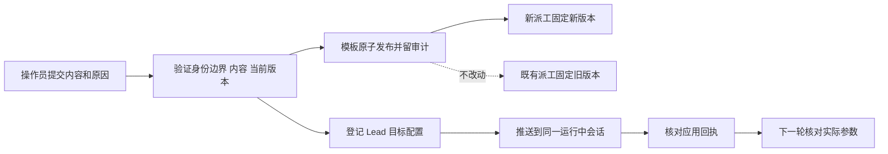
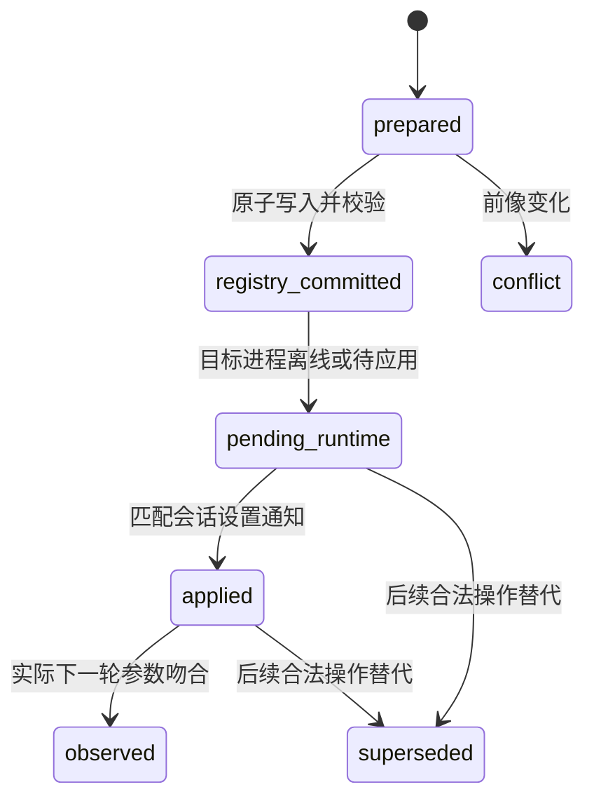

# FLY-2606 模板与 Lead 参数热生效 — 实施计划
Issue: FLY-2606 (https://linear.app/geoforge3d/issue/FLY-2606/热生效-founder-2026-09-16-0038z改模板effort-要等重启才生效本来就有问题-工作流模板从仓库种子发布到)
日期: 2026-09-15
基于: research.md

## 1. Founder 视角

修改模板后，成功发布的版本立即用于新派工；修改 Lead 的模型和思考力度后，运行中的会话直接应用，后续一轮采用新值。当前正在执行的一轮保持原参数。每次操作留下谁通过哪个管理入口、何时、为什么改、前后内容以及实际应用结果。

版本是不可修改的历史记录；回滚就是把旧内容再次发布为新版本。CAS 是写入前比较当前版本，防止两个人互相覆盖。应用回执是运行中的进程确认新设置已进入会话；下一轮证据是该轮真实模型请求或 rollout 的参数记录。



### 成功标准

- template GET 立即显示新版；新 simple_code run 快照和实际 implement 参数为新版；发布前 run 的后续 implement 保持旧版。
- 同一 Raya 隔离副本 PID、carrier、thread 不变，配置成功应用后的下一 router、手动 TUI、自动 `/goal` turn 都使用新值。
- 两类写入都有持久审计；Bridge 重启不会用种子撤销人工发布。Lead 配置在正常恢复后继续来自 registry。
- CLI 和 operator.md 可直接完成发布、状态查询与回滚；不要求重启作为生效步骤。

### 范围与前提

FLY-2602 做一次性值调整；本单不再调整 Astra/Sol 分配策略、不做 Raya 当前 high 生产写入。question `85b26eff-69c9-4986-966b-12148f4381dc` 已获 Lead 边界确认。Codex 原生 `thread/settings/update` 为本机 0.153.2 已暴露的实验能力；隔离验收必须覆盖实际安装二进制。Lead 通过 question `4fbfd625-1300-4984-aa4b-33911d0502e0` 裁定本单强制覆盖 Codex 常驻 Lead（含 Raya）；Claude 热入口明确 unsupported，由 Lead 另开跟进；历史 unpinned active-run guard 同获接受，本设计不提供绕过参数。

## 2. 模板管理合同

### 2.1 CLI 与 API

新增 `packages/flywheel-comm/src/commands/workflow-template.ts`，在 `src/index.ts` 注册：

```text
workflow-template publish --template ID --from seed --reason TEXT [--operation-id UUID]
workflow-template publish --template ID --from file --file PATH --reason TEXT [--operation-id UUID]
workflow-template rollback --template ID --revision N --reason TEXT [--operation-id UUID]
workflow-template status --operation-id UUID
```

`--expected-revision N --expected-digest HEX` 可选，但必须同时提供；否则 CLI 在 stage 时读取并冻结。CLI 在发送 apply 前输出 operationId 和 requestDigest，供网络丢响应后精确恢复；重试不能自动换基线。`--from file` 只接受 UTF-8 JSON 的完整 WorkflowManifest，最大 512KiB，CLI 读文件字节、POST 内容；服务端不读客户端路径。未知字段、空 reason、控制字符、过长 reason（>1000字符）、不合法 ID、超大 body 返回 400/413；不存在/退休模板返回 404/409，不创建新模板、不改 binding。seed 从部署中的 `loadWorkflowMenuSeeds(modelSnapshot)` 按请求构造，记录 build SHA 与 model-registry revision；不是从任意开发 checkout 读取，未部署种子可显式用 file。

在现有 `workflow-template-routes.ts` 中扩展 `POST /api/workflow/templates/:id/publish/stage`、`.../apply`、`GET /api/workflow/publications/:operationId`。单一服务 `workflow-template-publication.ts` 处理 stage/commit/rollback。现有管理台 DAG edit 继续单节点编辑，但接入同一 publication primitive 以共享 CAS、旧 run 守卫与审计；不能复制另一套 SQL writer。rollback stage 读取已存 revision 的 manifest，后面走相同发布路径。

保留所有 `/api/workflow/...` GET；在 plugin 额外挂 `/api/workflow-templates/:id` 及 revisions 只读 alias，直接复用 read handler。不得 302 到外部 origin，不形成两个 catalog。

### 2.2 管理入口与归属

复用 feature-flags 的 loopback/same-origin + 一次内容绑定 token（`ConfirmTokenStore`）模式。此模式的安全边界是已受信任的本机操作员，不能防住同 UID 恶意进程，也不识别 founder 本人。本单不扩展权限边界、不以 runner exec/env/`--actor` 文本证明授权。actor 由服务器固定为 `bridge-local-operator`，管理台保留自己的服务器 actor；客户端 actor 一律拒绝。审计的 who 指这个真实入口 principal，而非臆造自然人身份。生产操作仍由已获 founder 放行的 Lead 执行。

stage 冻结候选与 SHA-256 digest（对规范化结构内容取摘要）、当前 revision/digest、reason、source、operationId、actor、modelSnapshot revision，回传一次 token 与有效期。apply 必须携带完全相同的冻结请求，并核 model-registry revision 仍等于stage；配置代际变化则409要求重新stage，不在旧token下换内容。origin/auth 检查在任何 receipt 查询前执行；已成功的同 operationId+requestDigest 返回原结果，不再要求已消费 token。不同内容复用 ID 返回409。尚未成功的操作必须使用新 stage token；不能免 token 再执行。

### 2.3 同一持久事务

扩展 `StateStore.createAndPublishWorkflowTemplateRevision` 的可选 authoring metadata，保留调用者兼容；公共管理路径统一供应 metadata。`loadWorkflowMenuSeeds`、`loadWorkflowMenuLibrary/menuFromGraph`、`compileWorkflowMenuSeed`、所有 `resolveAlias` 调用均显式贯穿同一modelSnapshot，禁止内部回落ambient代际；stage编译冻结一次，apply只验证冻结manifest不重编译seed。固定一次 modelSnapshot，严格验证全部新 manifest 的结构、角色、图、vendor/model/effort；不向 CLI 暴露 `allowUnsupportedModels`。既有管理台的单节点历史修复保留其有限例外，但共用发布事务和目标 active-run guard。

事务序列必须无 await：

1. 查 durable operation receipt；相同已提交请求返回原 revision，无重复 audit。
2. 查目标 current revision、对应 digest、retired 状态并与冻结前像比较。双字段均吻合才继续。
3. 查目标所有可恢复的非终局 run，SQL 固定为 `WHERE template_id = ? AND status IN ('active','held')`（两种状态都可能继续启动节点）：若 snapshot 无法验证，或任一可执行节点缺 `dispatchPinned:true`，409 `active_run_not_pinned`，列 bounded run IDs；零写入。不迁移历史 snapshot，不修改其兼容语义。
4. 插入 max(revision)+1 的不可变 revision 与 publication；CAS 切 current pointer；任何人工发布包括 from seed 都保留/转为 seed_owner=founder，不清 seed provenance。
5. 插入既有 create/publish audit，并插入 durable receipt，提交后再返回成功。

任何校验、CAS、audit/receipt 写入失败都必须整体回滚，不能留下 orphan revision。SQL 均参数化。发布和 materialize 同一 StateStore 写序列内线性化；保留 `expectedSelection` 二次检查，竞争派工重读候选再试，已有 idempotency reservation 仍恢复原 run。

### 2.4 数据增量

新增单一 `workflow_template_publish_receipt`（注册 retention 分类；新增 `scripts/lib/fly-2006-retention-tables/teamlead/workflow_template_publish_receipt.json`，classification=`protectedCurrentOrReference`，与现有publication/audit同类）。字段：

```text
operation_id TEXT PRIMARY KEY
request_digest TEXT NOT NULL
actor TEXT NOT NULL
reason TEXT NOT NULL
source_kind TEXT NOT NULL CHECK IN ('seed','file','rollback','management')
source_digest TEXT NOT NULL
registry_revision TEXT NOT NULL
runtime_build_sha TEXT NOT NULL
expected_revision INTEGER NULL
before_digest TEXT NULL
template_id TEXT NOT NULL
published_revision INTEGER NOT NULL
after_digest TEXT NOT NULL
committed_at TEXT NOT NULL
```

外键绑定 template+published_revision；receipt append-only。`workflow_template_audit.detail` 带 operationId、reason、source、before/after digest/revision，时间由 DB/服务端写。requestDigest 覆盖全部业务字段和 actor，不覆盖 token/传输重试时间。同值新 operation 可返回 `unchanged`，不建无意义 revision，但需把该 operation 的结果持久绑定当前 revision，便于精确重放；同值也必须将 system-owned行变为founder-owned并记录保护状态，不能因unchanged分支丢失人工发布的重启保护。

### 2.5 启动与回滚

沿用 FLY-2121 preserved contract：人工版的 current pointer 不受旧或新 seed 覆盖；本单仅保证已有preserved规则不覆盖，**不新增每次重启都报告内容差异的承诺**；seed_content_hash相同的快捷分支可能不提示，operator以GET/receipt核对当前发布。补充差异提示列Follow-up，不阻塞热发布。不能按digest大小判断“新旧”。测试 seed hash 相同、不同、更早构建、重启重复四种情况。与 2602 迁移衔接：实现前同步其最终 head；2602 一次性成功 marker 必须阻止重新套用。如果操作发生在 2602 marker 尚未终结而会改同目标时，发布返回 `catalog_migration_pending`，先解决迁移，不让人工操作被晚执行的迁移覆盖。检查顺序在事务/启动 admission 边界明确，不能只依赖 actor 文本。

rollback 从指定历史 revision 取内容、按当前 schema/model 能力验证，再发布新 revision；旧内容失效则拒绝并给原因，不能直接改 pointer 或恢复 DB。旧 active run 不动；后续 run 使用回滚后的新 revision。

## 3. Lead 热配置合同

### 3.1 单一数据源与受管编辑

projects.json 的 `projectName + agentId` 是选择身份；canonical `leadKey`、identityDigest、backend、carrier/ownerEpoch、threadId 是运行身份。displayName 仅显示，不可用于寻址。Raya 为 `project=raya, agentId=raya, key=raya-raya`（实现须实时重核）。配置只变 model/effort，身份、凭据、cwd、sandbox、approval、serviceTier、后端、contextWindow 均不可通过此入口写。

新增 `lead-config set --project P --lead ID [--model ID] [--effort VALUE] --reason TEXT [--operation-id UUID]`；至少一字段，省略保持原值。新增 `lead-config status --operation-id UUID` 与 `lead-config rollback --operation-id OLD --reason TEXT`。model 必须在 registry 对该 backend 的 lead surface 可用，effort 必须被该模型支持；用一次固定 modelSnapshot 验证整对。跨 vendor 返回 `backend_change_not_hot`；不默默替换模型或丢 effort。公开 set 不接受 null/reset；rollback 可恢复字段的旧 absent 状态，但必须解析出该 backend 的明确默认模型/effort后方能发送，缺可靠默认即拒绝。

CLI stage/apply 走同一 local management auth；Bridge 新建 `lead-config-routes.ts` 和 `lead-config-service.ts`。复用 `scripts/flywheel-config-lock.sh` 的 `projects.json.cfglock`、候选 schema 校验、原子写入；不能走 fleet restart engine（目前 Codex 本就被该 engine 拒绝）。复用 `packages/teamlead/src/bin/backend-migration-config-lock.ts` 的 Node 持锁握手，增加向后兼容的显式lockPath参数；复用/小范围提取 `packages/flywheel-comm/src/commands/lead-registry.ts` 的 no-follow、writeAtomic、fsyncDirectory 原语到 `lead-registry-file-io.ts`（新增导出入口），由Bridge同步事务调用。不要再建 `scripts/lead-config-write.mjs`，不要复制第三套持锁/持久化纪律。Bridge 按自身部署 state root 选文件，隔离副本必须自己的 root。

写入前后均 `verifySummaryRegistryActivation`，assert identityDigest、summaryAssignmentDigest 不变，且目标之外 JSON 结构完全相同。projects 全文件 SHA 只承担 CAS/并发防覆盖，与 summary receipt 身份验证分开。receipt 文件原字节不变；不调用 summary migration，不重建收据。修改路径与 2602 runbook 的锁、备份、验证合同对齐，不依赖2602不存在的 update 命令。

### 3.2 文件和 DB 之间的恢复

新增 `lead_config_operation` 为持久意图/结果账本；不要假装 SQLite 与 JSON rename 是同一事务。保存 operationId/requestDigest/actor/reason、exact lead identity、pre/post projects SHA、目标字段 preimage/postimage、configDigest/modelRegistryRevision、每个lead单调递增configGeneration、status、timestamps；只允许状态机转换，审计事件追加到 `lead_config_audit`。表及索引注册 retention：新增 `scripts/lib/fly-2006-retention-tables/teamlead/lead_config_operation.json` 与 `lead_config_audit.json`，classification均为 `protectedCurrentOrReference`，不引入新分类词。



顺序：先 DB prepared（含候选 digest）→持同一 cfglock 检查无未结本目标意图/全文件 CAS→原子写 candidate→核 post SHA/结构/收据→DB registry_committed 和 outbox/audit 同事务。持锁过程只做本地有界操作，不等待 runtime/network。rename 后 DB 失败保留 prepared，不能盲目全文件回滚。

恢复先持锁重读文件：等于 pre SHA=未写，可继续或取消；等于 post SHA=完成验证并补 registry_committed；若全文件有第三方变化但目标仍精确 postimage、身份和 summary仍相同，可记录 rebased evidence 后提交该字段变更；其他值=conflict，停止本操作推送并告警。不得覆盖第三方字节。对同 target 的下一操作先恢复/裁定旧意图；操作串行与 operationId 唯一约束防止双写。Bridge 重启只恢复未结操作/重送当前 generation，不倒退目标配置。

### 3.3 从 Bridge 推送到 owning sidecar

新增 `LeadRuntimeConfigCoordinator.ts`（Codex backend目录）。在现有 `CodexLeadInboxSocket` 增加能力 `lead_runtime_config_v1` 和方法 `applyRuntimeConfig`/`readRuntimeConfig`。复用现有 HMAC 验证，再绑定 projectName、leadKey、identityDigest、socketOwnerId/ownerEpoch；服务端只接收属于当前 carrier 的请求，socket路径由已验证身份发现，不听客户端路径。请求体限制16KiB，只包含 operationId/configDigest/configGeneration、modelRegistryRevision、明确 model+effort；有意删除字段应已解析为显式默认值。

Bridge 发出的是目标设置，sidecar 在应用前重核当前身份、当前 registry generation与model能力；旧 generation、旧 carrier、错 thread、错 HMAC 均拒绝。当前 registry 文件或 summary无效时，不应用、不退回启动 env，不改变已运行一轮；status=unavailable，保留最后已应用值并显式告警，不能称为新配置成功。

一次只允许一个 in-flight settings update。listener 在发送前注册，直接订阅 raw process `notification`，在 TurnDemux 之前处理 `thread/settings/updated`（该通知没有 turnId，原 demux 会丢弃）。保持原 turn demux 的隔离规则，不把设置通知交给 Discord 输出。

`CodexLeadProcess` 增加 typed `updateThreadSettings({threadId,model,effort})`；启用该协议所需 experimentalApi，不扩大 filesystem/tools/approval。返回空 RPC result 只记 queued；应用必须在RPC无错误且等到匹配当前 threadId、threadSettings.model、threadSettings.effort 的 settings/updated。旧通知、错 thread、部分字段、不匹配值全部忽略/诊断。无变化重试可用当前同 carrier/thread 的已保存应用 receipt 和 fresh thread/read 的 model/reasoningEffort 读回证据（仅配合已持久的同代际应用receipt；没有receipt时读回不独立证明应用）完成，不永远等待不会重复产生的 notification。

### 3.4 下一 turn 与自主 goal

一次设置更新作用于会话的后续 turn，因此自主 `/goal` 和手动 TUI 都包含在内，不需要伪造 prompt 或重启。router/bootstrap startTurn 也在 facade 统一调用 coordinator.ensureCurrent；没有§3.7的external_session_settings漂移时附显式已验证 model/effort，漂移时只记录实际设置而不覆盖；不能用被冻结的启动值覆盖刚更新的会话。

边界以 settings applied notification 为准：已经创建的 turn 继续用旧值；“下一轮新值”指应用通知之后新创建的 turn。CLI 只有收到匹配应用证据才返回 applied；file commit、queued、超时均不得返回 success=hot。用户在 apply 完成之前启动的一轮可仍旧，状态输出须显示这个事实。默认等10秒，未匹配返回 `pending_runtime` + operationId，CLI exit=2，后台持久重试；`status` 可继续查，不重复编辑文件。

Bridge 收到 registry 管理提交立即推送；5秒有界 reconcile 仅补丢失推送/直接编辑。每次 sidecar router turn 前和每次 raw turn/started观察后重新校验 current registry digest；后者是检测漂移，不能把已启动的一轮谎报新值。直接手工改文件无法给出严格同步完成点，operator必须使用受管命令并等 applied；发现外部合法修改时记 actor=`external_registry_change`、who 未验证，并推动相同应用流程。不把 reconcile 的5秒等同于逐轮保证。

每轮应用观测记录 `{operationId,configDigest,leadKey,carrierId,threadId,turnId,model,effort,source,observedAt}`。`source=registry_hot` 仅当实际 turn参数证据吻合，不以设置 notification 代替。原生自主 turn须从真实 rollout turn_context 或运行时等价 typed字段读取 model/effort；若未暴露则 status只能 applied，acceptance不能 observed。隔离 QA以同一二进制真实请求参数或 rollout为判据，不能只 stub RPC。

### 3.5 重连、竞争和失败

- 运行中更新不 interrupt 当前 turn、不新建 thread、不 fork/resume 做刷新、不暂停/重建 goal、不触碰 process supervisor。
- 同 lead 更新串行；并发 set 用文件 CAS拒绝。后续已提交配置出现时，旧 in-flight 通知只能完成自己的审计，不能把当前 displayed config倒退。新配置必须随后应用；目标最终已 superseded 时 status明确显示新 operation。
- carrier/ownerEpoch/thread rotation 每次 await 前后重核；旧 receipt不得复用新 thread。重连按§3.6在start/resume请求本身携带fresh registry pair，再验证会话设置后恢复router admission；绝不能先用旧pair resume再异步重放。goal原生运行保持原协议，QA核恢复后的首轮。
- 无协议/不支持backend：stage 409 `runtime_hot_config_unsupported`，文件零写；断线已知支持：可持久提交但只返回 pending，不触发重启。
- 新模型上下文容量必须在同 generation验证：若低于当前窗口/已用token且无法保证原生安全切换，拒绝 model更新并返回 `context_window_incompatible`，effort可单独更新。不改 contextWindow作为绕过。
- 不自动按 receipt旧字段覆盖后来变更。rollback建立新operation，仅目标字段 CAS恢复且重新验证模型能力；运行中旧/新turn边界同正向。
- Fleet展示 desired/applied/observed，Codex新入口写能力标为 next-turn；启动 manifest/env当前确实是asserted输入；必须先完成下述§3.6的Codex可变参数去绑定，才能把其历史model/effort显示为启动快照。保留 Claude旧路径的 restart标签，禁止误报Codex旧env为漂移后自动重启。consumer sweep覆盖 fleet-data、fleet-capabilities、management-topology-source、management-existing-writers及命令渲染。

### 3.6 R1修正：未来启动与重连的一致性

采用**registry作为可变model/effort的唯一authority**，不做JSON+manifest+plist三文件伪原子写入，也不以非空carrier为理由拒绝本应支持的model热改。当前代码确实把旧carrier作为严格assert输入；以下变更是启用hot capability的前置必需项：

- `packages/teamlead/scripts/lib/canonical-lead-identity.sh` 仅移除 `FLYWHEEL_LEAD_MODEL`、`FLYWHEEL_LEAD_EFFORT` 两项 inherited-value equality assertion；在canonical identity解析/验证成功后，始终用registry model/effort覆盖导出，registry字段absent时unset旧carrier。可记录无秘密的 `legacy_tuning_carrier_ignored`；不允许直接采用继承值。
- 其余全部身份、backend、能力、credential selector、summary、bot、stateDir断言不变，特别是 `FLYWHEEL_LEAD_MODEL_CONTEXT_WINDOW` 仍严格校验；本修改不是放松身份验证。registry无效时继续fail-closed，不能回退manifest/env。
- `scripts/flywheel-daemon.sh` 的plist generator在经过canonical registry selector确认target backend为Codex时，不再从manifest.model/effort或其launchEnvironment生成两个tuning env键，并移除这两个旧键；Claude分支保持现合同。旧manifest可原样留存为启动历史，不能作为Codex model/effort authority。`scripts/flywheel-fleet.sh` 对Codex继续拒绝重启式apply；审计它的生成调用不能再把两个旧键带回Codex。
- **已加载launchd环境也是旧值**，只改磁盘plist不能解决它；因此上一条canonical launcher覆盖旧env的规则不可省略。不bootout/bootstrap、不kickstart、不改生产plist，这些是代码路径变更，功能安装在正常部署窗口完成。
- 冷启动、监督器重连、thread rotation均在各自 `ensureThread` 内新读已验证registry，按这一个generation构建model+effort。移走TUI runtime约905行与headless约1661行的共享冻结 `threadParams` 模型字段；start/resume每次调用都用fresh模型设置+原immutable权限/persona参数，决不能先传旧env再等后台reconcile修正。
- start/resume的 `params.model` 和 `params.config.model_reasoning_effort` 必须等于hot update的typed model/effort；保留contextWindow原合同。先注册raw settings listener，再用fresh pair start/resume，等回显/应用验证后才向router/socket capability/TUI ready发布新generation。恢复后第一轮native goal在resume内部可能先创建，但resume携带的也是fresh pair，QA必须核首轮，无需等异步Bridge重推才能正确。
- stage必须验证当前carrier能力包含这套bootstrap contract版本 `registry_tuning_v1`，并核部署artifact build identity（包括canonical launcher+generator属于同一payload）；旧bundle只读、`runtime_hot_config_unsupported`零写。能力不能由用户提供字符串自证。

回滚**配置**仍用同一source→hot path；回退**代码**到旧assert语义另受部署前兼容门约束：先按current registry协调持久carrier，并用隔离launch环境检验旧代码能启动，否则拒绝该代码回退。不能把恢复旧软件当成恢复旧参数或自动停Lead。

必测：old manifest model=M0、old磁盘plist model=M0、模拟已加载env model=M0/effort=E0，registry热改M1/E1；保持运行中PID不变先验证hot，然后在隔离harness正常冷启动、从旧manifest重新生成plist后冷启动、仅app-server重连三条路径，全部采用M1/E1且无identity_env_conflict。对身份/backend/contextWindow注入冲突仍必须失败。覆盖通用codex-lead.sh、Mufasa TUI/fullaccess两套共享helper调用以及flywheel-lead.sh选择器的fresh全文件CAS（该CAS保留，不借此删掉）。

T3/T4的必改文件（与下表任务清单合并生效）：`scripts/flywheel-daemon.sh`、`packages/teamlead/scripts/lib/canonical-lead-identity.sh`、两个Codex runtime；新增/扩展 `packages/teamlead/scripts/__tests__/canonical-lead-identity.test.sh`、`scripts/__tests__/flywheel-lead.test.sh`、daemon plist生成测试和runtime reconnect测试。T5只在上述语义改完后改变Fleet标签。

### 3.7 R1接口澄清（不扩展功能范围）

- 写锁位置固定为经no-follow确认的目标registry规范路径加 `.cfglock`；hot service只允许 `FLEET_CONFIG_LOCK_FILE`、`FLYWHEEL_CONFIG_LOCK_FILE` 两个override都未设置，或已设置值全等于这个规范路径，任一不同在stage返回 `config_lock_path_conflict`、零写。给现成Node helper显式传相同路径，保留旧migration caller默认；shell fleet同进程环境解析得到的路径必须相等。测试包含slot root、任一override冲突、双override冲突和与真实fleet临界区互斥。环境统一是在受管部署入口完成，不能声称独立不合作的手工writer自动服从锁。
- `canonicalRequest()` 为 applyRuntimeConfig/readRuntimeConfig各加显式完整分支，覆盖version/method/project/lead/leadKey/identityDigest/socketOwnerId/ownerEpoch/runtimeGeneration/threadId/operationId/configGeneration/configDigest/modelRegistryRevision/model/effort及出现的全部字段。未知method/字段拒绝，不能落到submitBatch default；改变任一值尤其model/effort必须HMAC失败，旧签名不能迁移到新method。
- `thread/settings/updated` 无可靠操作者来源：不能因到达TUI就标成founder。原始listener持续观察全部同thread通知，并把当前真实pair与desired比较；不匹配时立刻撤销“当前已应用”的展示，记录 `external_session_settings` / effectiveStatus=drifted，旧operation的历史applied/observed证据保留且带时间。`readRuntimeConfig`在status请求、router preflight和5秒reconcile时读current pair，与source一起校验；不能仅看registry digest。
- 检测到外部会话修改后不自动覆盖可能来自人的新选择、不冒称它已写入registry；本目标暂停自动settings重推并公开drift。后续新显式set（即使desired内容相同也生成新configGeneration）才能清drift并应用。router可继续依native实际设置工作，标source=`external_session_settings`，不得附旧registry pair把人的选择盖回；独立的source变更冲突/无效仍按原fail-closed。这项边界不冒充“谁改的”，需operator显式把选择写回registry。
- T4测试“hot high已observed→TUI改low→registry不变→status drifted，下一轮观测low→显式set high→新generation applied”，另测同值无来源通知只证明值吻合，不归因操作者。此为已有status承诺的正确性澄清，不引入第二份配置authority。

## 4. 顺序实现与测试

每个任务先加能证明缺口的 failing test，记录 FAIL→最小改动→PASS；只改列明链路。schema迁移/retention先于route启用，不能借本单重构整个 StateStore。

| 任务 | 精确文件 | 测试与完成证据 |
|---|---|---|
| T1 模板发布服务 | 新 `packages/teamlead/src/workflow-template-publication.ts`；改 `StateStore.ts`、`bridge/management-dag-writer.ts`、`bridge/management-existing-writers.ts` | 改 `workflow-menu.ts` 传入单个modelSnapshot；新 `src/__tests__/workflow-template-publication.test.ts`：atomic、CAS、reason/digests、same ID replay、conflicting ID、audit故障零写、retired、active及held unpinned guard、rollback validation、seed代际漂移拒绝 |
| T2 模板CLI和路由 | 新 comm `commands/workflow-template.ts`；改 comm `index.ts`、teamlead `bridge/workflow-template-routes.ts`、`bridge/plugin.ts` | comm新 `workflow-template-cli.test.ts`；扩展 `workflow-template-routes.test.ts`：local auth、forged actor、expired token、file bounds、seed call-time、GET alias等价、丢响应重放 |
| T3 Registry受管写入 | 改 `packages/teamlead/src/bin/backend-migration-config-lock.ts`；新 comm `lead-registry-file-io.ts` 并改其package导出；新 teamlead `bridge/lead-config-service.ts`、`bridge/lead-config-routes.ts`、comm `commands/lead-config.ts`；改两侧注册点及StateStore | 新 `lead-config-service.test.ts`、comm `lead-config-cli.test.ts`、teamlead `src/__tests__/lead-config-write.test.ts`：同锁竞争、wrong key、immutable identity、receipt不变、rename每个crash seam、partial postimage、rollback覆盖保护 |
| T4 同进程应用 | 新 Codex目录 `LeadRuntimeConfigCoordinator.ts`；改 `CodexLeadProcess.ts`、`CodexLeadInboxSocket.ts`、`codex-lead-tui-runtime.ts`、`codex-lead-runtime.ts` | 新 coordinator tests；扩展三个已有测试：ACK≠applied、notification-before-response、duplicate/no-op、missed notification、stale carrier、rotated thread、supersede、invalid source、unsupported binary、无restart |
| T5 消费者与恢复 | 改 `bridge/fleet-data.ts`、`fleet-capabilities.ts`、`management-topology-source.ts`、`management-existing-writers.ts`、`fleet-apply-command.ts`；startup reconcile接plugin | 相应fleet tests；新 runtime状态显示与命令生成parity；确认所有新表retention分类；旧GET/旧caller保持兼容 |
| T6 运行验收和文档 | 新 `scripts/qa-fly2606-hot-config.mjs`及其隔离fixture；本目录 `operator.md`、后续 `verification.md` | 同进程router/TUI/goal、模板新旧run、正反向更新各一次、Bridge重启保留，证据绑定exact head |

精确测试入口（新增文件由上述任务提供）：

```bash
pnpm --filter flywheel-teamlead exec vitest run src/__tests__/workflow-template-publication.test.ts src/__tests__/workflow-template-routes.test.ts src/__tests__/workflow-dispatch-resolution.test.ts src/__tests__/workflow-catalog-migration.test.ts
pnpm --filter flywheel-teamlead exec vitest run src/bridge/__tests__/lead-config-service.test.ts src/lead-backends/codex/__tests__/LeadRuntimeConfigCoordinator.test.ts src/lead-backends/codex/__tests__/CodexLeadProcess.test.ts src/lead-backends/codex/__tests__/CodexLeadInboxSocket.test.ts src/lead-backends/codex/__tests__/codex-lead-tui-runtime.test.ts
pnpm --filter flywheel-comm exec vitest run src/__tests__/workflow-template-cli.test.ts src/__tests__/lead-config-cli.test.ts src/__tests__/summary-registry-migration.test.ts
pnpm --filter flywheel-teamlead exec vitest run src/__tests__/lead-config-write.test.ts
pnpm lint
pnpm -r build
```

实现后按仓库要求跑 package suite/受影响shell检查和精确PR head CI；排除会打开真实 Terminal 的 `tmux-viewer.macos.test.ts`。核实测试数量，零匹配不是PASS。设计阶段不跑无关全套代码测试。

## 5. 隔离验收矩阵

固定 commit、二进制版本/摘要、slot state root、Bridge PID、Lead carrier/PID/thread、原配置摘要。新建隔离副本；需要生产DB快照时只用受管 snapshot工具，不能cp活库。脚本开头拒绝生产root、生产port、生产catalog写权限；不得生产模板实验。

| ID | 操作 | 必须保留的证据 |
|---|---|---|
| A1 | old run停在design，publish tpl_simple_code implement effort新值 | API revision/digest，audit/receipt，old/new run snapshots与实际implement admission dispatch；old不变、new改变 |
| A2 | 同operation重试、注入丢响应、Bridge重启后重试 | 仅一个revision/publication；返回相同receipt；不同请求同ID409 |
| A3 | rollback一次，再用早期seed启动Bridge | 新revision内容等于旧版本；人工owner和current pointer保留；两次操作审计完整 |
| A4 | 分别构造active与held legacy unpinned run（held后续恢复），退休模板、staleCAS、audit故障 | 所有相关表增量为0，structured refusal；不改legacy快照 |
| B1 | Raya隔离副本active turn时set effort，等applied后下一router turn | 前一轮old、后一轮new；PID/carrier/thread恒定；未调用restart/interrupt；actual effort source |
| B2 | 同样条件下自动goal continuation，随后手动TUI turn | 两种真实turn都新值，不只是router mock；goal identity/status未重建；实际请求或rollout参数 |
| B3 | 同backend另一个支持模型，随后rollback model+effort | 模型和effort成对实际应用；context安全检查；恢复前像；审计、receipt不变证明 |
| B4 | offline、错误HMAC、旧owner、notification丢失、重复apply、进程重连、Bridge重启 | desired/applied/observed分离；无伪成功、无旧receipt跨thread、无静默restart；重试有界 |
| B5 | 两个配置作者+半提交崩溃+后续合法外部变更 | 全文件CAS/同锁/恢复结果，保留他人字段；summary和identity receipts保持有效 |
| B6 | 旧manifest、磁盘plist和加载env与当前registry不一致；冷启动、再生plist后启动、app-server重连 | 三条恢复路径第一轮均用当前pair；原热改期间PID未变；身份/backend/contextWindow冲突仍fail-closed |
| B7 | 已observed后在TUI改effort，registry保持原值 | 当前状态drifted、真实轮次用TUI值且无自动覆盖；显式set新代际才能恢复registry_hot |

A1-B7均为实现/QA阶段待完成，不是本设计的已验事实。环境限制导致任一强制项未跑，不能给热生效PASS。

## 6. 交付、回滚、决策记录

首次安装新能力仍走正常合并与独立updater窗口；能力部署后每次参数变更不重启。若hot runtime adapter失败，operator看到pending/unavailable并保留原运行状态，不自动降级到restart。代码回退必须先满足§3.6的旧启动carrier兼容门，之后才可回退；数据历史保留，上线前演练兼容旧schema读和人工owner保留。

设计产物：exploration、research、plan、operator、progress、Mermaid图源与founder-report.html；经有效设计APPROVED后静默发布HTML、核对托管CSP/nonce/内容、报告Lead，再 complete --route phase_design_complete 和 park。实现/QA由DAG控制器推进。

已决策：`4fbfd625-1300-4984-aa4b-33911d0502e0` 接受Codex常驻Lead强制范围与legacy active-run拒绝发布。Claude热配置列非本单Follow-up，owner=Engineering Lead，启动条件=审计出原生model/effort成对热更新能力；本单返回unsupported，不以物理launch读取充当热生效。

设计 review 状态以独立 review-receipt 文件中的有效 reviewVerdict 为准；本文不自批。

## 7. 已批准后的交接附记（不更改上述评审方案）

Lead在question `790a5784-0cdc-4dee-97a2-16c260ce53b2` 明确裁定：R2以下5项advisories全部保留为Follow-ups，不阻塞implement。原始评审见design-review-r2.json，详细处置目标与owner见review-receipt.md；本附记不把建议冒称已修复，也不重新开启设计。

1. drift-flag-vs-fresh-pair-resume-precedence：会话漂移与重连优先级、重新一致后的状态。
2. readruntimeconfig-failure-on-router-preflight-unspecified：运行时读取的时限与失败处置。
3. t3-refactor-not-covered-by-its-own-suites：提取写入原语时覆盖现有六套lead-registry回归。
4. workflow-menu-file-in-evidence-column：实现文件清单显式纳入workflow-menu.ts。
5. same-payload-gate-spans-two-distribution-paths：核实实际bin副本与repo启动文件来源。

同一答复记录报告存储暂停（Lead独立核得blob PUT 403 store_suspended，并亲自publish同一HTML也收到502），要求停止重试。Lead授权以已提交HTML `engineering/doc/FLY-2606-live-config/founder-report.html`（内容提交1f01ed3e5）和DESIGN-HTML publish-failed报告完成设计阶段，由Lead在托管恢复后交付founder。本节点没有托管成功或线上验证证据，不把该例外包装为已发布。原始答复见lead-publish-disposition.txt。
