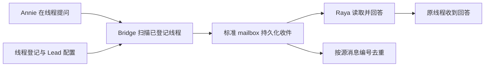

# FLY-2608 Raya 线程双向对话 — 实施计划
Issue: FLY-2608 (https://linear.app/geoforge3d/issue/FLY-2608/raya工程修复-discord-thread-中的-founder-提问必须送达-raya并在原线程回复)
日期: 2026-09-15
基于: research.md

状态: 待设计评审。设计节点不实现、不部署、不恢复线上消息。

## 给 founder 的说明
让已登记的 Raya 讨论线程进入现有 Bridge 收件扫描，并把回答的目的地固定为问题所在的线程。无需 @，也不用重述问题。修复复用标准收件队列；完成与否以真实提问、收件凭证和同线程回答三段证据判断。

目前已确认代码覆盖缺口与缺少回帖字段；两条旧提问的原始 message id 已由 Lead 定位（见证据补记）；精确归档收件仍待核对，因此不声称已恢复。完成设计不等于完成生产修复。



## 1. 范围及固定决策
- 复用 `GatePoller.founderReplyDeliverPass`、`emitFounderReplyDeliveryForThread`、现有 cursorStore 和 mailbox；不新加收件服务/数据库/依赖/feature flag。
- 补 `chat_threads` 与 `phase_chat_threads` 中活跃、可解析唯一 owner 的普通 issue thread。现有 session/审批历史路径保留，按 threadId 合并一次扫描。
- Owner 用注册行的 `lead_id` 与父频道 `channel_id` 对应的当前项目 Lead 配置确定。issue 的项目、标题、显示名称均不能改变收件人。Raya 例子为 `raya / raya / 1542079099928059987`。
- 仅新增覆盖使用 `ingestOnly`（只收原文）路径，成功入队后跳过全部 `processFounderMessage`。空 questions 不是隔离措施。旧有已授权 gate 路径按原规则执行。
- 所有现有 Bridge issue-thread ingest 明确写 `replyChannelId=ctx.threadId`；沿既有 v2 mailbox 路由回原线程。保留 `replyTo` 引用，但不以它替代目的地。不伪装成 roundtable。
- 本单不改 issue parent、不承担 summary 业务、不过问 roundtable 主动参与预算；不因注册表项目展示不一致重命名或迁移收件身份。

## 2. 数据与不变量
| 数据 | 真值来源 | 用途 |
|---|---|---|
| thread_id / channel_id / lead_id | StateStore 两张现有线程表 | 线程和所有者候选 |
| projectName / leadId / botToken | 当前唯一匹配的 ProjectEntry.leads | 凭据和标准 comm.db 选择；不得 fallback 到全局 bot |
| issue_id / session.project_name | 原有 issue/session | 上下文与显示，不用于覆盖通信 owner |
| cursor(threadId) | 现有 cursorStore | 最后可安全跨过的消息 |
| messageId / authorId / channel_id | Discord 原消息 | 真正输入身份、founder身份和源线程 |
| deliveryId | `chat:<leadId>:<messageId>` | 已有全程去重键，不造新 id 绕过去重 |
| replyChannelId | 经验证的 source threadId | mailbox 分批、journal、sender 目的地 |

入站验证：雪花 id 格式、对象/数组形状、响应消息 channel_id（若提供必须匹配）、authorId 为配置 founder 且非 bot；正文/附件延续现有 envelope 验证，外部输入绝不参与动态 SQL。保留参数化查询。HTML/报告中的外部文本使用转义，运行时只写 textContent/value。

Owner 决议：在所有 project.leads 中先找 `chatChannel===row.channel_id`，有 lead_id 时还要求 agentId 相等；恰好一个才纳入。lead_id 缺失可接受唯一父频道配置；零个或多个均跳过并记录 threadId+原因，禁止按 issue project 猜。重复 threadId 若 owner 冲突整条暂停，不能 first-wins。session/历史路径若同 id 的 owner 与注册行不一致也暂停并报告，禁止双 Lead 入队。每轮读取当前配置/注册表；入队前确认此轮绑定仍是当前绑定，配置变化不能让旧任务继续投递。

## 3. 实施任务（TDD：先失败用例，再最小实现）

### T1 注册表补覆盖
修改 `packages/teamlead/src/bridge/gate-poller.ts`，直接组合 StateStore 已有 `getUnarchivedIssueChatThreads()` 与 `getUnarchivedPhaseChatThreads()`。不修改现有其他消费者的查询语义。

建立去重/owner 校验后，把原来不在 session/historical 集合中的登记线程加到同一 tasks，`questions=[]`、`ingestOnly=true`。使用 owner 项目的标准 comm 路径及 owner 自身 token，不借用另一个 Lead 或全局凭据。保留 questioned 优先与现有 scanBudget、轮转游标；不能为每个线程新开 timer。

测试：`bridge/__tests__/gate-poller-founder-reply.test.ts` 增加 raya thread + flywheel session 的反例，以及无 session、phase 表、空 lead_id 唯一父频道、冲突 owner、archived/missing、相同 thread 重复出现。断言只调用一次 scanner 且目标 raya/raya。主频道 Codex polling 不改。

### T2 首次扫描与失败行为
修改 `bridge/founder-reply-deliverer.ts` 的上下文增加可选 `ingestOnly`。只对此模式，无持久化 cursor 时以 threadId 为 after 下界，直接读取第一页面；不取 HEAD 后返回。既有非 ingestOnly 初始化保持兼容，存量游标不后退。第一次没有消息也可保存 threadId，下轮继续。

每轮最多现有 GET_LIMIT 一页，消息按数值 id 升序处理；每条成功持久化或已有同 id 收件后才能跨过。写入失败停在前一条；cursor 写失败下轮重读，由 deliveryId 去重。全页则后续 tick 继续；启动追赶与实时扫描使用同一游标。超时/429/5xx不推进，401/403/404记录明确 read_failed，不自动换token或将输入当作已处置。读取异常不影响其他线程轮转。

`ingestOnly` 在入队成功后直接进入安全游标推进，不访问 pending gate/旧卡/审批/决策/自动回复处理；测试用 spies 断言所有这些回调零次，即使内容为“通过”且携带真实形状 reply reference。

测试：`bridge/__tests__/founder-reply-deliverer.test.ts` 覆盖首次发现前已有消息、空线程后提问、>100 条多页、重启、429、enqueue失败、cursor保存失败、重复投递、附件-only、非founder、自己bot、错channel响应、无效id。不得凭 mock 自造分页语义通过；用受控 Discord API 只读分页证据核对。

### T3 保留返回地址
同一 `founder-reply-deliverer.ts` 的 thread ingress 均设置 `replyChannelId: ctx.threadId`，包括既有路径，避免该 producer 先写入无目的地载荷。保持 msgKind=guild。

验证既有 `packages/flywheel-comm/src/discord-chat-ingest.ts` 的 immutable first writer、route partition 和 `parseDiscordChatRoute`；`bridge/lead-inbox-loop.ts`、`bridge/lead-delivery-adapter.ts`、`lead-backends/codex/CodexLeadInboxSocket.ts`、`LeadInputRouter.ts` 的 v2 batch/journal/sender 全链。通常只需新增跨模块测试，无需重写这些消费者。不同线程不能合批，重投不会二次唤醒/回答，发送失败按现有 journal/outbox retry 原目的地，不能 fallback 主频道。

同一 message 若已被其他 producer 写入缺路由载荷，补投不能修正 immutable envelope，必须单独处置。禁止改 deliveryId、删 dedup 或原地改 ACK 历史。

### T4 两条旧线程取证与按需恢复
在具备标准读取权限的 Lead/QA 身份下读 Discord 历史，分页覆盖线程创建至本次报告时间；找到每条 founder 提问的真实 id、时间、source thread、引用/附件及必要正文摘要。同时读取 by-thread 与当前注册 owner，分别查 owner 项目和可疑误路由项目的 live/archive mailbox，`message-status`、batch、journal、outbox、Discord 实际回帖。

每条分类必须为：尚未入队／已入队待消费／已消费未回复／已回复但错位／同线程已回复／原消息不可读（明确权限或删除证据）。缺失证据不得写“丢失已确认”。两条线程各建 evidence 表，不用用户主频道追问 id 代替。

恢复操作按真实状态：
- 确认从未入队：通过现有标准 `chat-ingest`/Bridge scanner，使用原始 id、owner、原始正文与 replyChannelId，同一去重键；非设计节点执行。
- 已入队待消费：让标准队列恢复，保留原 id，不重复创建新输入。
- 已消费缺回复、目的地错误或旧载荷缺路由：由 Lead 经标准通信交给 Raya 核对消费/回帖状态并补原线程回答，记录原 deliveryId 与补答 messageId；不可伪造重入队成功。若无受支持恢复动作，升级 Lead 明确处置，QA不得通过。
- 已同线程正确回复：标已处理，禁止补答。

不回退全局 cursor，不扫全部历史后自动重放，不要求 Annie 复制问题。新覆盖从创建下界追赶时，先完成这两条审计，确认旧已回答输入在标准去重记录中；若历史由旧系统处理而无标准记录，须先由 Lead 对范围做处置，不可盲目制造重复回答。恢复窗口与逐条状态留在 evidence。

### T5 验证和交接
相关命令（在安装好锁文件依赖的 checkout 中）：
```
pnpm --filter flywheel-teamlead exec vitest run src/bridge/__tests__/gate-poller-founder-reply.test.ts src/bridge/__tests__/founder-reply-deliverer.test.ts src/lead-backends/codex/__tests__/CodexDiscordMailboxStrategy.test.ts
pnpm --filter flywheel-comm exec vitest run src/__tests__/discord-chat-ingest.test.ts
pnpm --filter flywheel-teamlead typecheck
```
按实际测试位置增加 mailbox→sender 集成用例，并运行既有相关 v2 socket/delivery/router 套件。设计阶段不以这些未来命令冒充已测试。

## 4. QA 硬验收矩阵
| 验收 | 所需证据 |
|---|---|
| 新线程首问无需@ | 新 Raya issue thread；founder 立即提问；source messageId、threadId、owner绑定；从首次发现前输入也成功 |
| 标准收件与模型实际消费 | `chat:raya:<sourceId>` live/archive、batch id、接收/消费记录；transport ACK与模型消费分开写 |
| 原线程真实回答 | Raya botId、Discord reply messageId/URL、channel_id 与源thread相等，内容实际回应问题；不以发送API调用或typing代替 |
| 无串线无重复 | 第二线程并行提问；其他Lead无对应收件；重扫/重启后无第二次答复；按sourceId统计并观察至少两轮扫描/重试 |
| 主频道回归 | 1542079099928059987 新提问同样闭环，原主频道poll不受影响 |
| 历史两线程 | 两张逐条源消息与最终处置表；所有待恢复输入有标准恢复及实际答复，或有明确不可恢复证据与Lead处置 |
| 错误与隔离 | 429/权限故障不跨过输入；新增 ingestOnly 内容不触发任何批准/旧卡指导/门状态变化 |

记录扫描周期、当前候选数/预算和实测端到端延迟；若预算造成无法完成可接受实时对话，必须调整既有预算/调度并重新评审，不能报成功。受控测试需真实 founder 输入或明确授权验证身份，bot合成输入只作集成证据。设计/实现无预授权生产重启、终止、merge，独立 updater 部署窗口与 ship 权限另行办理。

## 5. 迁移、回滚与风险
零 schema migration；无需改身份/credential/注册项目。存量 cursor 不重置，新增覆盖默认创建下界追赶，历史重复风险按T4审计处置。正常追加轮询持续拾取新注册线程，无需为每个线程重启 Raya。

回滚代码停止新增覆盖；保留已入队载荷、游标、去重身份及回帖记录，不删除证据。继续处理已入队数据，不能假称撤回已发消息。owner变更时暂停并由Lead检查旧队列（deliveryId含leadId，换owner会改变去重空间），不自动迁移/重放。

限制：本修复覆盖已登记活跃 issue thread，不扩到DM/任意未登记频道；归档线程按现有登记恢复流程重新纳入。若受控验证发现Discord自动解档而本地仍 archived，须在现有thread生命周期内修复该具体反例并补测试，不能另建接收系统。本阶段源消息下落仍未验证，后续不能免掉T4。

## 6. 设计交付
探索/调研/计划、review有效APPROVED、diagram-first HTML、每节自动保存评论与汇总复制、提交并推送、静默发布和托管CSP验证、向工程Lead报告、exact `complete --route phase_design_complete`，随后 park。不创建实现或QA successor。


## 2026-09-15 20:22 PDT 证据补记（Lead 提供）
问题 f65445d7-a479-4cd5-8a6c-5ae6c79a54ad 已回答。Lead 在约03:2xZ读取的证据如下；Runner无直接Lead读取权限，没有借用token。

| 线程 | founder 原消息 | 时间（UTC 2026-09-16） | 正文 | Lead 查询结论 |
|---|---|---|---|---|
| 1549573426547658793 / FLY-2131 | 1549573491060244602 | 00:11:49 | 这是什么东西呀？ | Raya mailbox未见；后续机器人帖无对应回答 |
| 1549573438937767977 / FLY-2382 | 1549573499914297409 | 00:11:52 | 这是什么东西呀？ | Raya mailbox未见；后续机器人帖无对应回答 |

Lead 的 by-thread 读取确认 issue session 项目为 flywheel；lead_events 没有引用这两个id的任一Lead记录。Raya mailbox该分钟只有主频道投递，正文检索也未命中。Lead将此判为入站未送达；本设计把它作为Lead提供的事故证据，精确live/archive计数与登记owner仍请求补充。原先“原消息id未知”仅是早期取证状态，现在已定位；实施必须用上述真实id核对、恢复并补实际同线程回答。不可把后续机器人普通消息当作回答。


### 登记行补证与查询边界（Lead，约03:3xZ）
问题 ee3d76ac-8f88-40d9-aaf7-858808009f2c 返回：两条 chat_threads 的 channel_id 都为1542079099928059987、lead_id=raya、archived_at=NULL、discord_missing_at=NULL；created_at 分别为2026-09-16 00:11:34/00:11:37。满足本方案按父频道与lead确定通信owner的前提。

Lead 的 content LIKE 源id计数：raya.mailbox各0，flywheel.mailbox各2；但调查ask/report本身含源id，不能把substring命中当实际discord_chat投递。mailbox_log.content查询失败（no such column），不能判archive为空；实际表列表还含mailbox_terminal_archive、mailbox_identity，flywheel另有mailbox_archive。已请求问题22c03203-c166-475d-9f94-ccf720a63c36按精确deliveryId/source kind查询。上述失败与不确定性保留，不声称误送另一个Lead。
