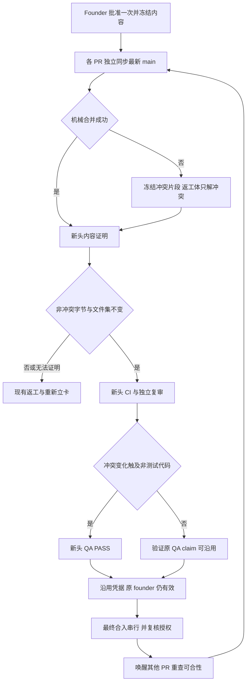

# FLY-2632 批准绑内容 — 实施计划
Issue: FLY-2632 (https://linear.app/geoforge3d/issue/FLY-2632/land批准绑内容-founder-按卡后引擎自动-rebase-到最新-mainci复审通过且非冲突-hunk-逐字不变即沿用原批准直接)
日期: 2026-09-16
基于: research.md
## 1. Founder 可见结果
按一次 ship 卡后，引擎为每张 PR 独立同步最新主线、跑新头 CI（自动检查）、独立复审，必要时重跑 QA（验收）。普通文本冲突只允许修改机械确认的冲突片段。全部条件满足时，沿用她原来的批准直接合入；只有证据不成立才重新立卡。多个 PR 准备并行，最终写 main 串行。
不拆 plugin.ts；不扩大首次批准权限；合并与独立 updater 部署仍分离。本设计不是实现或上线证据。



## 2. 确定的边界与术语
- A：原批准 head；M：批准时唯一 merge-base；B：本轮观察到的 main；P：本轮开始 PR head；C：候选新 head。所有身份使用完整 OID，显示才缩写。
- 内容指纹是文件结构与修改字节的确定性摘要；不证明语义等价。冲突解决是 founder 本次指示明确允许的变化，靠新头独立复审与必要 QA 管质量。
- 使用受控 merge B 到分支，而非重写历史；用户任务允许 rebase/merge。远端分支仅 fast-forward + expected-old-head 比较交换（CAS：只有旧值仍相等才写入），无需 force push。
- 每轮准备从原 A/M 与本轮 B 验证；P 必须是 A 或已有有效沿用链的末端。新头不能混入其它提交。遇未知证据失败关闭到旧流程，不接受“review 看起来没问题”替代逐字证明。
- 原 founder gate 始终不可变；内部 successor holder 不是新的 founder 卡，沿用 receipt 不是 founder response。

## 3. 存储模型与唯一权威源
在 StateStore 现有 workflow carryover/land 表族扩展，参数化 SQL；不建立另一套 approval boolean。新表名为实施命名合同：

| 记录 | 键与必须冻结的字段 |
|---|---|
| workflow_approved_content | root_gate_id UNIQUE；schema_version=1；repo identity、PR、issue、run；founder claim/response ID 与 actor；A、M、tree OIDs；ordered file entries、hunk payload digests、root digest；created_at |
| workflow_land_preparation | (run_id,root_gate_id,cycle) UNIQUE；P、B、candidate C；operation ID/generation；lease owner/epoch；state、next_probe_at；Git config/tool version、conflict proof digest、review ID、CI evidence IDs、QA disposition；reason |
| workflow_content_proof | proof_id immutable；root digest、A/M/B/P/C、full candidate tree、protected-span mapping、conflict slots、file set、verifier version、raw artifact digests、result；不得由 Runner 提交 result=true |
| workflow_head_carryover_receipt_v2 | immutable；predecessor/root/current holder、root_gate_id、C、proof_id、review claim C、CI C、QA original/fresh claim ID、issue/run/repo/PR、cycle、source input cutoff；audit labels approval_carried_from:<gate> / qa_carried_from:<claim> |
| land_merge_ticket | ticket_id；operation/preparation/generation、root gate、C、observed base、repo/PR；authorized/consumed/reconciled/invalidated；workflow run ID；source cutoff；delivery identity；merge result |

保留 v1 receipts 原值、CHECK 与审计触发器；新增 v2 表和 resolver 分支，避免重建旧表破坏历史。新旧 receipts 共用 root/lineage resolver 与同一 cycle 预算，不串出另一条无限链。旧 v1 三段上限保留历史解释；v2 一个 root 共最多 3 次自动同步，含 clean 和 conflict 轮次，计数持久化，重启/operation 替换不重置；重复观察同 P/B 只重试原 cycle。
现有旧 gate 没有冻结指纹：允许从服务器已有的不可变 A/M/原 founder 记录确定性补建，记录 legacy-derived 时间，不声称批准时已采集。必须能取回原对象、确认原主体和根尚有效；任何缺失不补猜，走旧流程。首次卡的新路径在卡内容冻结时预计算，点击事务核对卡 head/digest 未变再绑定该指纹；点击后远端改头不偷换 A。

## 4. 逐字内容与冲突证明算法
### 4.1 可信输入和规范化
沿用 land-head-refresh-proof.ts 的一次性 bare clone、白名单环境和 Git 配置隔离。服务器 fetch 原始 A、M、B、P、C；复核远端 PR/repo/issue 绑定与实际 head。禁止本地 Runner diff、注释、文件名白名单成为 authority。禁止 external diff/textconv/merge drivers、global/system attributes、replace refs/grafts；固定 Git 版本与 diff/merge 算法、renormalize=false。使用 argv execFile，不拼 shell，不输出凭据。
相对 M..A 构造 zero-context、固定算法的有序 edit atoms；每 atom = path 原始字节、文件状态/模式、同文件序号、按顺序带正负号的原始增删字节及 EOF 标志。SHA-256 编码使用长度前缀，避免拼接歧义。哈希不含行号与上下文内容，但保留空白、CRLF、重复次数和顺序。文件集含 old/new path、type/mode；排序采用原始字节，不依赖 locale。既保存规范内容摘要，也保存用于唯一映射的原始位置证据。
比较新 B..C 文件集必须与 M..A 完全一致；已被 main 吸收导致文件消失也不是自动放行。上下文导致 hunk 合并/拆分，以 edit atoms 和受保护树区域映射比较，不能直接比较 diff 输出的 hunk 数。

### 4.2 冲突许可面必须在返工前产生
先验证 `merge-base(A,B)` 唯一且等于冻结 M；不相等返回 `content_proof_merge_base_changed`（属于 content_proof_unavailable），不要把 Git 自动取的新 merge-base 偷换成原 M。随后从固定 A、M、B 的受控三方合并生成机械结果 T 与冲突槽 K。无冲突时 C tree 必须等于 T，且指纹/文件集满足要求。普通文本冲突：读取 base/ours/theirs blob，通过固定 diff3 合并取得每个真正冲突槽的原始区间、三方内容摘要与槽间的不可修改保护片段。机器生成的区间是 authority；文件名冲突列表只用于定位。
文本 blob 已含冲突标记形状时拒绝自动解析，防止将原内容当 marker；解析器验证自身三方对象、标记结构及重构完整 T。建议将 merge-file diff3 的确定性输出解析为 literal protected spans + conflict slots，不把工作区 marker 当输入。
候选冲突文件必须能唯一表示为 `protected0 + replacement0 + protected1 ...`；每个 protected span 原始字节、出现顺序及边界一一相等，候选中映射存在多解则失败。不得把邻接非冲突原 atom 吞入 slot，不准“同一文件有冲突就整文件允许”。不受冲突影响的原 atoms 逐字、逐次数相等。树上所有其它文件/模式必须等于 T，故不能篡改 main 带来的无关文件。
rename/delete、binary、submodule、symlink/type/mode conflict、多个 merge-base、结构性冲突、资源上限（建议每 diff 10 MiB/10,000 atoms，配置冻结进 proof）、未知编码/无法唯一定位等均 `content_proof_unavailable` 回旧流程。普通 plugin.ts 文本冲突必须走可支持路径，不能用 blanket unsupported 完成本单。
多轮每次用原 A/M 与新 B 重新冻结 K，绝不依据 worker 的修改扩大 K；之前解决内容若在新一轮不再能证明合法，回现有重新立卡。每轮旧、新 tree 与所有许可槽有完整 lineage，不能通过连续小改绕过根指纹。

### 4.3 Worker 与分支隔离
自动 clean merge 不启动 Runner；服务器先 CAS 领取单 PR 准备 lease，写 intent 后远端更新，丢响应查询同 P/B 的结果再决定，禁止盲重做。需人工智能解冲突时由引擎现有 rework delivery 派冲突限定 attempt，交付 frozen K 和 expected P/B，只允许候选 tree 产出；该 Runner 无批准/receipt 写入口。
尊重共享 worktree TURN：冲突 attempt 通过现有 delivery 取得 implement TURN；proof/自动合并用独立临时 clone，不碰其他节点工作区。结果提交前核 lease、TURN、P/B、实际 remote head；branch moved 则废弃候选并重查。正常 fast-forward push，绝不 force-push 或变 hooks。每 PR 独立临时目录和日志，关闭句柄后清理。

## 5. 复审、QA 与沿用事务
### 5.1 所有条件一起成立
- 原 gate/claim 的 issuer 为 founder_challenge，原 actor 为真实 founder、同 issue/run/repo/PR；未撤回、未过期、无更晚 rejection/correction。不得把 auto_narrow_gate / Lead / engine 的自动批准当作本功能的 founder 根。
- C 的 required CI 全绿：零 checks、pending、skipped required check、unknown 不算 PASS。
- 新的独立 code review 在 C 为 effective APPROVED；核 `codex_review_record` 的 (execution_id,target_repo_identity,target_pr_head_sha=C)、status=approved、request_id、author_family/reviewer_family 与对应 request 的有效 verdict。status=skipped 不算独立复审，不能重标 A 的旧 review。此表没有 claim 撤销/过期列，不虚构字段；prepared obligation 因后续失败/换头/取消失效时使该准备记录不可消费。
- **v2 强制负向守卫**：任一权威 session/run 配置携带 `codex_skip`（源自 `codex-skip` 标签），均不进入 v2 auto-carry，clean 与 conflict 轮一视同仁，返回 `content_carryover_review_skipped`，走既有需新 founder 卡的路径。不得把 `isCodexGateSatisfied()` 的 true 当作真实复审记录；该函数在 codex_skip 时 head-independent 返回 true，v2 必须先拒绝 skip，再直查 request-bound approved 记录。准备入口、receipt 事务与最终 consume 都复核，防标签在中途变化。保持 legacy sanctioned skip 原语义，不在本单全局删除它。
- §4 proof passed 且 candidate head 仍 C。
- QA disposition 可证明：无冲突变化或变化全部命中批准时冻结的可信 test-only 分类时，原 QA PASS 必须未撤回/未过期、属于原 A/同 run、没有更新 FAIL；产生 `qa_carried_from` 关系。`.github`、脚本、配置、生产 fixture、未知路径均当非测试；不能仅看文件名含 test。
- 任何冲突解决变化触及非测试代码：独立 QA harness/QA attempt 在 C 实跑 PASS，并绑定 harness/version/report digest；此时记录 fresh QA claim，不伪造 qa_carried_from。新头 CI/review/QA 的失败进入既有修复+重新立卡，pending 只等待。

### 5.1a 新头复审产出者与预算
复用 `review-request-coordinator.ts` 的 ReviewRequestCoordinator → `codex-review-ingest.ts` → `StateStore.recordCodexReviewApproved()` → `codex_review_record`，消费者是 `codex-gate.ts`、`review-hold.ts` 与 verify-approval 镜像查询。v2 strict predicate 独立于 legacy skip 分支，显式 status=approved 且跨族身份满足；不能用 `isCodexCodeReviewApproved` 可能接受 skipped 的宽谓词替代。
每个 preparation cycle 在 C 被远端确认后，由 Bridge 准备协调器提交一次幂等 request（key=preparation_id,C），绑定原 author execution/repo 与 explicit target head C。reviewer 在只读隔离 clone checkout C，禁止从共享 worktree 猜头。扩展 coordinator 的 typed engine target 输入，服务器核它对应持久化 preparation/remote PR；Runner 不能自报 C 获权。clean 更新不要求 author worktree 存在。
existing `tryDeriveHead()/deriveWorktreeHead()` 只供 legacy lane；v2 head-moved 不走 generic `MAX_CODEX_REVIEW_HEAD_MOVE_REQUEUES=2` 自动重排，返回 preparation_superseded，由准备协调器在同一 land 三轮预算内决定新 cycle，再发新的 explicit-C request。重复消息重用同 request；同 C 网络失败使用既有 bounded retry，不能把 retry当新轮或清零预算。第三轮 C 仍能获得真实复审；第四轮被 land cycle limit 拦住。不修改 legacy 两次换头预算。

### 5.2 继承和替换不是一回事
StateStore.resolveEngineWorkflowShipClaims 的 v2 分支：founder 取根，review/CI 取 C，QA 取携带关系或 C 的新 claim。禁止 current code 把所有前置条件一起退回 root。
原 founder 权威校验不再要求 root QA/review 仍为当前 attempt；它们是原卡内容历史证据。对于 v2 必须独立校验对应历史记录真实且根未撤销，然后校验新 review/QA obligations。旧 QA 被新 attempt supersede 可以由新 C PASS 替代；explicit revocation/failure 不能被“历史有效”吞掉。只有明确与 proof 绑定的新 QA PASS 才能消解旧 QA 失败，founder rejection 永远需要新 founder 批准。
成功事务：重读 lease/generation、当前 holder/claim、proof、C evidence、source cutoff，插入 v2 receipt + internal successor holder + next operation + 激活状态，CAS supersede predecessor；复用既有出发前 mailbox cutoff/activation 路径。receipt label 只是审计展示，API 文本不得变权限。
失败事务：记录稳定 reason，将准备终态化并调用既有冲突/返工失效逻辑，去重新立卡；不既沿用又立卡。网络/取证暂时 unknown 先 bounded retry，超过既有可用性 horizon 发 Lead 告警，不凭空认定内容变更。

## 6. 并发与最终合入
### 6.1 并行准备
拆 claimLandOperation 为 per-operation lease 与 final repo admission；现有 live claims迁移期间保持旧语义直到排空。准备调度沿用 plugin Promise.all，增加独立有界 worker pool（默认至少 3，不能全局 1），长 CI/review wait 落 durable state 释放 worker slot。同一 run/PR 一次仅一条准备链，多个不同 PR 同时推进。
engine_land_rework_already_open 保留同 run 防重；新 conflict-only preparation 不被其它 run 的 verification path 阻塞。实现需测试没有隐藏的项目级 rework capacity=1；有容量限制时允许同仓三条冲突准备，保持每执行者 credential/activation 身份。

### 6.2 合入 ticket 与 GitHub 实际写点
仅缩短 Bridge 锁不足：当前 :cool: body 不含 expected head，workflow 启动会重新抓 head；H1 获授权后可能把 H2 合掉。必须同步改 `.github/workflows/ship-on-comment.yml`。
**Lead 修订（[lead-instruction 01b6929f-5372-4e68-8f26-d5635dff3539]）**：实现第一步先核实是否已有对外可达、已部署的 Bridge HTTPS ingress，并在 progress.md 写实际 URL 或「不存在」。不得把新建 ingress 作为本单前置依赖；不存在时 ticket 留 Bridge 内部，Bridge consume 后 workflow 仅收 expected head，禁止 OIDC→Bridge 调用。已有 ingress 才可启用该路径。本设计选无需反向网络的 Bridge 内部 consume 作为默认实现。
Workflow 分准备与最终 merge 两段：CI 等待、review/QA evidence 集齐不持 repo lock；最后 merge job 设置 repo-wide concurrency（cancel-in-progress=false），只做短前置复核与一次 merge API，不在锁里跑 CI/QA/review。只将已 ready 的任务送入此 job，任务排队不替代持久化调度顺序。
Bridge 在全部准备完成后 fresh inspect C/base 并单事务 consume ticket、取得 repo admission，重核 root/epoch/有效 claim、CI/review/QA 精确 C 与 founder input cutoff。之后由 Bridge 身份触发 ship workflow，传不可改写的 expected head C。选择结构化 :cool: 评论携带 expected head 与签名的票据封套；同步修改 workflow trigger/parser、land merge driver、prepared-attempt reconcile 的原 exact-body 假设，不把字符串本身当批准。
封套字段固定为 version、ticket ID、repo ID、PR、root gate reference、C、operation generation、nonce、issued/expiry；Bridge 内部消费后用专用服务签名 key 签发，workflow 用受保护主线配置的公钥验证（不得用 PR 中的公钥/脚本）。这是消费结果的传输证明，不是新增 founder 批准。key 仅 Bridge 服务持有，不下发 Runner；workflow 验签并核 expected head/仓库/PR/可信 Bridge 评论者，修改任何字段或从另一评论复制都不能变更目标或产生第二次合入。nonce/ticket 在 Bridge 唯一，Github per-PR + repo merge job 串行及已 merged 状态检查防重复 effect。已签票过期仅失败，不自扩期；恢复须 Bridge 再核授权。
实际评论格式采用首行 :cool: + 单个 machine-readable envelope；旧 bare :cool: 只留给原 legacy path；engine-managed issue 无有效封套不得自动降级。workflow 获取 PR 后核 head==C，不得重抓新头赋给票；merge API 必须 sha=C。同步更新现有 comment/reconciliation parser 以绑定 ticket、comment ID、C。发布结果不确定时沿用 durable prepared attempt 查已发评论与 workflow receipts，不重签/盲重发。
清晰线性化：Bridge consume 前已记录的 founder 撤回必须拦住；consume 后动作已进入合并提交区，后来的撤回不能承诺回滚已执行动作，记录时间并通知 Lead。source cutoff 必须经过 CommDB 已收待处理 founder 输入的 drain，不能只查最终 claim 行。
GitHub concurrency 负责所有参与 ship workflow 的最终写入串行；Bridge admission/ticket 负责权限与恢复。旧 legacy ship path 仍保留 founder/head 验证，但也进入同一 repo merge job；不能保留另一段绕过串行的 merge API。耗时 CI 先完成再消费 Bridge admission，workflow 只重核现成结果，不在最终 job 中等待 25 分钟。
消费后从触发请求到 merge 已确认/明确失败是串行提交区。失联/超时为 outcome_unknown：查询 GitHub run/PR 精确结果；不因 lease 到期就允许另一个仍在执行的旧 worker 与新 worker同时合入。GitHub job 终止且结果明确后才恢复；crash recovery 保留 durable ticket/attempt，而不是只看 PID。签名 key 轮换保留在途票的验证，kill-switch 停发新票并先对账，不让旧二进制忽略 v2 授权。

### 6.3 main 又前进
每次获得最终准入时 fresh inspect PR/base。若 B 变但 C 仍可合且 required checks/current authorization 全满足，可以继续同 C（不凭空失效）；若 DIRTY/BEHIND 或 branch protection 要新 base，则释放准入回准备，新 C 必须全套新证据。main 在最终探测后又变，由 GitHub branch protection/sha guard 拒绝则重新准备，不盲重试旧 ticket。
每次 merge 确认的同事务写 durable repo-base-advanced outbox；唤醒其它待 land PR，即刻重查 mergeability，保留 30s sweep 作为丢唤醒恢复。无 head 变化不增加 cycle；真的创建新对齐轮才消费预算。merge 后报告/清理/Linear closeout 不占仓库 admission。

## 7. 上限、错误与审计
| 形状 | 处置 |
|---|---|
| 原 founder 缺失/身份不符/撤回、文件集或非冲突内容变 | 持久 reason + 既有重新立卡；不重用 proof |
| codex_skip / codex-skip 或 skipped review record | content_carryover_review_skipped；拒 v2，回现有新卡路径；不是 pending |
| CI/review/QA pending | durable wait + next_probe_at；不新开 founder 卡 |
| CI/review/必要 QA 已 FAIL | 既有修复/重新立卡；不以 carry 掩盖 FAIL |
| 网络/对象暂不可取 | bounded retry，horizon 后 Lead escalation；不将 unknown 变 pass |
| 重复 delivery / 过期 worker / branch moved | 幂等 replay 或 CAS 拒绝，不能覆盖新 generation |
| 第 4 次准备企图 | engine_land_rework_cycle_limit；同事务写 Lead alert outbox + held |
| 外部 merge 已发生 | existing external-merge reconcile 查精确事实；不补铸批准 |

告警包含 issue、PR、root gate、cycle=3/3、A/P/B/C、上轮失败原因、未完成阶段、既有人工恢复入口；outbox unique key(root,cycle,reason)，失败重投且有 delivery receipt。held 不能代替告警。取消 issue、founder 打回等使准备/ticket 失效，记录因果；不偷偷重置预算。

## 8. 实施任务与消费者清单（每组先红后绿）
1. **冻结内容与证明器**：新增 `bridge/land-content-proof.ts` / `__tests__/land-content-proof.test.ts`，复用 `land-head-refresh-proof.ts` 的 Git 隔离；真实 bare repo fixture 验 hunk、结构、恶意合并。
2. **Schema 与 resolver**：`StateStore.ts` 表迁移、类型、root content、v2 proof/receipt/preparation/ticket CAS；`StateStore.land-carryover.test.ts` 覆盖根/新头义务分拆、migration、replay、revocation。v1 行不可重解释成 v2。
3. **准备状态机**：新增 `bridge/land-preparation.ts` / tests；连接 `land-executor.ts` 的 base refresh/conflict 分支；复用 `workflow-rework-coordinator.ts` 等实际 delivery 入口，新增 conflict-only mode 而非扩大通用 implement 权限；source cutoff、TURN 和 actor 身份保持。
4. **并行与上限**：`plugin.ts` 仅 wiring，`StateStore.claimLandOperation` 拆锁，保持现有 tick；`land-executor.test.ts`、`StateStore.land-lifecycle.test.ts`、`land-recovery.test.ts` 检验三 PR overlap 与上限告警。
5. **最终写点**：新增 `bridge/land-merge-ticket.ts` 与受鉴权路由/tests；`ship-on-comment.yml` 分 CI 准备/最终串行 job；`scripts/ship-await-ci.sh` 保持 exact head；补 workflow 集成测试证明 comment/head/签名/ticket 绑定和恢复。实现先记录 ingress 存在与否，默认无需新增网络入口。
6. **逐消费者闭合**：`workflow-engine-dispatcher.ts:2224`、`plugin.ts:8633`、`approval-signal/gate-authority-view.ts:87`、`workflow-decision-routes.ts:638`、`merge-ship-gate.ts:175`、`external-merge-reconcile.ts:637` 均用共享 v2 resolver；StateStore `62853/62985/69632/70798` finalization 不得回旧根义务。`founder-review-authority.ts:102` 独立 HTML 审核边界不放宽。新增 review producer/consumer sweep：`review-request-coordinator.ts`、`codex-review-ingest.ts`、`StateStore.recordCodexReviewApproved` / `codex_review_record`、`codex-gate.ts`、`review-hold.ts` 与 verify-approval 镜像，测试 author worktree 缺失仍能审 C、skip 标签中途变化、第三轮 C 可审、第四轮受限。
7. **Legacy 与协议**：`packages/flywheel-comm/src/commands/verify-approval.ts` 保持现有 SHA-bound，明确拒绝 arbitrary carry labels；若引擎流程调用它，必须经共享服务 proof resolver，不能添加 string shortcut。`comm/src/db.ts:2673` cutoff 与 `StateStore.ts:72244` departure 顺序回归。`founder-only-authority.md` 添加内容连续性说明，R1 issuer/issue/head freshness 语义不变。
8. **可观测与回滚**：v2 feature flag，off 只作 kill-switch。启用前迁移、签名票与真实 workflow 联调、七组绿及三 PR replay。关闭后停止新 v2 准备，已消费 merge ticket 先对账，未消费的失效并回旧路径；历史 receipts 留存，旧 binary 不解释新 v2 授权。不能降级删除证据。

**Lead 修订（§8.8，[lead-instruction 01b6929f-5372-4e68-8f26-d5635dff3539]）**：Flywheel 项目随本单交付 default-enable policy。七组绿 + 三 PR 隔离重放通过后，同一 PR 的上线步骤将 flag 置 on；不得交付“默认 off、以后再开”。设计节点不自行激活；下游实际启用记录必须与上线版本绑定，off 仅应急。

## 9. 七组红→绿与 QA 交付
| ID | 红形状与绿色证据 |
|---|---|
| R1 单 PR 一次批准 | A 先获 founder approve，B 前进造成普通文本冲突；只解冻结槽，新 C CI+review+必要 QA PASS，gate delivery 总数不增加，原 actor 不变，approval_carried_from 指向原 gate，最终 land |
| R2 内容与文件集反例 | 修改冲突文件内另一个非冲突 hunk、空白/EOF、重复 hunk 顺序、新文件/模式；均拒 carry，进入重新立卡。纯行号/上下文位移保持相同应通过；防文件级例外 |
| R3 Authority 反例 | Lead/engine 伪造标签、缺原 gate、另 issue/repo/PR、auto narrow root、revoked/expired founder、晚到 rejection 在 consume 前；全部拒绝；内部 successor 不产生 founder click |
| R4 CI/复审新头 | A 绿不能覆盖 C pending/红；review 在 A、非独立 issuer、status=skipped 拒绝；codex_skip=true 且无 C review 的 clean/conflict 两例均不得 carry，已有 A 绿/QA PASS 也不例外，入口后再加 skip 也拒绝；C approved + CI 绿才可沿用；C→D race 在 push、receipt、comment、workflow capture、consume 各处都拒旧票 |
| R5 QA 分流 | test-only conflict 原 PASS有效才记 qa_carried_from；生产冲突必须 C fresh PASS，FAIL/缺失拒绝；过期/撤销 QA、更新 FAIL、旧 attempt 改动回归；新 QA 不误撤 founder 根 |
| R6 三 PR 并发与恢复 | 同时准备 2519/2606/2616 形状，三条准备区间重叠，最终 merge 区间互不重叠，每次合入其它 PR 即刻重查；重复 tick/worker 崩溃/丢回执不重复 effect，无跨 run already_open |
| R7 上限/升级/发布 | 窗口内第 4 次 main 前进若仍可合则只重查不耗轮，若需第 4 次实际同步则被拒且 alert receipt 可查；第三轮新 C 真实复审可成功，不被 legacy 两次 head-move 重排限制提前卡住；v1/无 fingerprint 迁移、回滚、未知结构冲突回旧流程；ship report publish-only URL HTTP200/CSP/内容验证，未发送频道消息 |

执行命令（implementation/QA 在新代码上运行，不把本设计当绿证据）：
```sh
pnpm --filter flywheel-teamlead exec vitest run src/bridge/__tests__/land-content-proof.test.ts src/bridge/__tests__/land-preparation.test.ts src/bridge/__tests__/land-head-refresh-proof.test.ts src/bridge/__tests__/land-executor.test.ts src/bridge/__tests__/land-merge-driver.test.ts
pnpm --filter flywheel-teamlead exec vitest run src/__tests__/StateStore.land-carryover.test.ts src/__tests__/StateStore.land-lifecycle.test.ts src/__tests__/StateStore.land-recovery.test.ts
pnpm --filter flywheel-teamlead typecheck
pnpm --filter flywheel-comm test
```
成功必须确认输出的实际 Tests 条数与预期测试文件，零测试/No test files found 不算通过；分批命令只降低运行歧义，不声称已复现 reviewer 提及的批量过滤器问题。
另新增 `land-merge-ticket` 路由/真实 workflow 集成套件并运行，不能用 happy-path mock 代替签名、consumer、复制票/变头拒绝测试。按 repo CI 执行 required checks，对最终远端精确头留 run URLs。

QA 隔离重放：创建三个真实 Git PR 形状与隔离 DB/远端 harness；若用生产 DB 作样本仅 runner snapshot-control，不复制活库。fixture 固定 plugin.ts 邻近/交错冲突，原 founder gate 每 issue 恰一次，初始批准后任意合入改变其它两个 base。记录 `t_ready / t_prepare_start / t_review / t_qa / t_merge_start / t_merge_end`、原始 event/claim/receipt IDs、每次文件 diff、red output 和 green output。用相同等待/返工耗时的单 PR 对照，验 `T_three < 3*T_single`；另断言实际准备重叠与 merge 不重叠，避免只靠墙钟偶然过线。此为事故形状重放，若没有原事故 commits，必须标注不是原始事故逐字回放。
成功标准：三张均 land、founder 零重按、冲突夹带反例拒绝、issuer 伪造拒绝、新头 CI 绿、ship report 可访问。不可把单测全绿或流程图视作此验收通过。

## 10. 本节点交付与实施前检查
探索/调研/本计划、Mermaid 源与 founder HTML 均 commit+push；effective design review APPROVED 后静默 publish-only，核托管 HTTP200、nonce/CSP、零外部资源与评论层。给 Lead 报 URL，运行 phase_design_complete，再 park。下游不得从本节点的设计审核推断生产已启用。


## 11. 独立复审逐项处置（round 2）
有效 verdict=CHANGES_REQUESTED，唯一 HIGH 为 codex-skip-bypasses-review-at-c；不能用 Lead 文字 APPROVED 或本段自述替代新一轮有效 verdict。

| findingKey | 处置与验收归属 |
|---|---|
| codex-skip-bypasses-review-at-c | 本轮修复 §5.1/§7/R4：拒所有 skip run 的 v2 carry，三处复核，clean/conflict 两反例；legacy skip 不扩权 |
| review-at-c-has-no-producer | 本轮补 §5.1a 的实际 producer/record/consumer、explicit remote C 隔离复审、每 preparation 一次 request；原 reviewer HIGH 已由本轮纠正为 MEDIUM |
| wrong-resolver-and-table-names | 改为 resolveEngineWorkflowShipClaims 与 workflow_head_carryover_receipt_v2 |
| fixed-merge-base-vs-git-computed | 增唯一 merge-base 等于 M 前置条件与独立 reason |
| vitest-positional-batch-too-large | 验收命令拆 5+3 批并检查 Tests 条数；历史故障未在本设计环境重现，不当作已验证事实 |
| cycle-budget-three-too-small | 保留用户指定 engine_land_rework_cycle_limit 的三轮上限，不自行给 clean 无限重试。v2 不调用 legacy 两次换头重排，故无第二计数器提前终止；第四次 main 前进形状补 R7。无限主线 churn 下不承诺零重按，达到上限告警；三 PR 标准隔离场景仍须零重按通过 |
| merge-envelope-is-replayable-bearer | 非阻断 Follow-up，归 §8.5/R3/R6：实现必须补精确 trigger comment ID 绑定、分钟级有效期和 GitHub 侧可信 started receipt 防重放；不得将当前仅有签名+nonce 当作完整一次性保证。失败后 founder 打回再重放原票必须拒绝，否则不能上线 |
| engine-managed-detection-needs-callback | 非阻断 Follow-up，归 §8.5/R3：实现必须提供 GitHub 侧由受保护服务维护的 engine ownership 判据，覆盖 head 变化、标记缺失/删除/伪造，不能靠 PR 正文或未鉴权 label 推断；无可靠判据 fail-closed，禁止静默 legacy fallback。此为待完成实现证据，不声称现有 workflow 已具备 |
| repo-concurrency-queue-depth-one | 非阻断 Follow-up，归 §8.4/§8.5/R6：GitHub concurrency 只作为互斥，不能当持久 FIFO；legacy 三次触发 + engine 混合场景必须覆盖 pending run 被取消。增加 cancelled receipt 分支，Bridge 通过 workflow API reconciliation 为未启动而无法写 receipt 的 cancelled run 补记结果并重新核授权再调度，不丢请求、不要求 founder 再按。持久排队真相留 Bridge，不留 GitHub pending slot |

这些 Follow-up 是同一实施范围的验收事项；不扩大本设计节点到实现、不删除七组回归，不把未闭合实现证据写成生产已安全。§6.2 的防重放与不得降级表述是必须完成的目标合同，并非仅凭签名已经得到的属性。若实施发现需要偏离 Lead 的无反向入口裁定或用户的三轮上限，应先报具体反例，不自行扩权。
