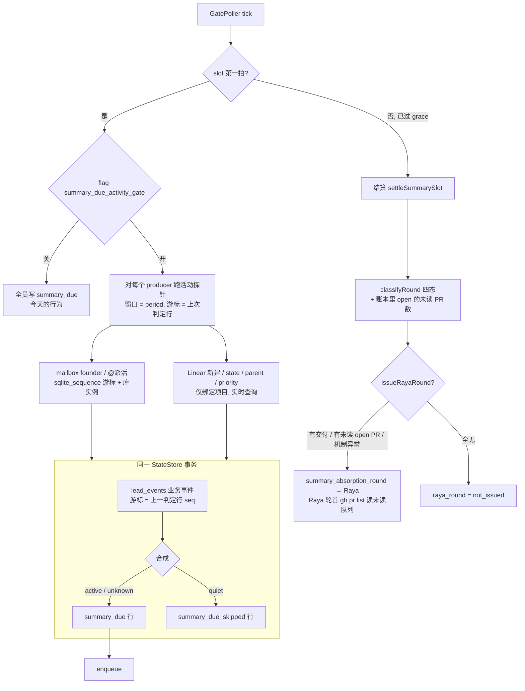

# FLY-2634 summary 写侧省量 — 实施计划
Issue: FLY-2634 (https://linear.app/geoforge3d/issue/FLY-2634/summary写侧省量-无实质变化不生成周期摘要避免唤醒-lead-只为交空报告)
日期: 2026-09-16
基于: research.md

状态：v5（吸收 Codex R1–R4 全部项 + Lead 裁定 ca00b87c / 5007b6bb，见 §7）。R4 核验轮判 R3 #1/#2/#4/#5/#6 RESOLVED，#3/#7 在本版吸收；按 Lead 裁定 5007b6bb 以 leadAcceptance 收口。本文是实施合同，也是三份文档里的最终规范（research / exploration 与本文冲突时以本文为准）；未实现、未上线。

## 0. 最小交付与验收

**交付**：Bridge 在每个 summary slot 的第一拍，对每个 producer 先用三个 collector（四类信号）判断「自上次判断以来、截至本 slot 边界，有没有观测到候选变化」；只有全部来源可读、可证明观测完整、且全为零（`quiet`）才不投 `summary_due`（写一行 `summary_due_skipped` 留证），其余（`active` / `unknown`）照旧投递。结算把「无变化跳过」单列为第四态，不进未交、不告警。Raya 轮只在「有东西可读」时建：有本轮交付、或 Raya 仓里还有任何 **open（=未读）** 的 summary PR、或机制异常；否则记 `not_issued`。一个 `bridge_global` kill-switch 关掉即回到今天的行为。

**门的定位（Codex R1 #1 / R2 #3；Lead 裁定 ca00b87c）**：Bridge 没有 LLM，判断不了「实质」；它能证明的是「这个 period 里有没有任何可能让 Lead 学到新东西的信号」。门是**方向安全的预过滤**：保证「什么都没发生的项目」一定不被叫醒（founder 要求 1）；「实质增量 vs 复述旧状态」的判断留在 Lead 侧规则（§2.7，founder 要求 2）。不读 `sessions` 表；Runner 的心跳、活动、终态列一律不是信号。四类信号、三个 collector：

| collector | 计入（候选变化） | 不计入 |
|---|---|---|
| A `lead_events` | 业务事件（Runner 提问、门问题、founder 回复、阶段变化、工作流升级、epic 收件、会话派出 / 完成 / 失败、阻塞检测…）**逐条计**——包括同一阻塞被再次检测（未解决的死 Runner 是活的阻塞，Lead 该处理；宁多勿少） | 钟、巡逻、投递机制、配额确认、摘要机制自身、**按类型就是周期提醒 / 汇总**的行（park nudge、zombie backlog、监控断连重连） |
| C `mailbox` | founder 本人在该 Lead 频道说话；**其它已配置 Lead bot 在共享频道 `<@该 Lead>` 的消息**（派活，当 slot 就算，Lead 裁定） | summary 收件人（Raya）的任何消息（审阅追问 = 摘要机制自身）；未 @该 Lead 的 bot 闲聊；非 Lead bot / 普通 Discord 用户；`bridge` / runner UUID 发的行 |
| D Linear | 该项目绑定 team 内 issue 的**新建、state / parent / priority 变化**（founder 直接改 Linear = 重要决定 / 阶段变化，Lead 裁定）⇒ `active`。**零命中不算证据**：Linear 没有可读审计流，删除 / 移出 team / 可见性延迟都证明不了「没发生」，所以绑定项目的零结果记 `unavailable: linear_zero_unprovable`，该项目永远不会 quiet（R4 #1；今天只有本来就活跃的 flywheel 绑定，静默项目不受影响） | 评论、描述、label、排序等其它 `updatedAt` 抖动；未绑定 Linear 的项目记 `not_bound`（可 quiet） |
| — | 分类表之外的**未知事件类型**默认计入 | git 直接 push（L1，Lead 裁定本版继续排除） |

**验收（除 A9 外全部可在只读快照上重放；逐格 SQL 见 `evidence.sql`，§6）**：

| # | 场景 | 判据 |
|---|---|---|
| A1 | 静默项目连续 ≥3 个 slot（growth / joycon / personal-assistant 现状） | 每 slot 该 Lead 有 `summary_due_skipped` 行、无 `summary_due` 行、该项目 comm.db 无该 slot 的 `summary_due` 投递、无 summary PR、无 founder 提醒；`summary_slot_settled.skipped` 含其名；`skipped ∩ producers[disposition=due] = ∅`。**连续 12 个 slot（72h，跨 mailbox 归档）不出现周期性 unknown**（A5 反例之外） |
| A2 | 活跃项目（flywheel 现状） | `summary_due` 照旧投递，payload 带 `activity.verdict="active"` 与逐源计数；该 Lead 的交付样本逐 slot 列出 |
| A3 | 非代码类重要变化：founder 在某静默 Lead 的频道说一句话 | 下一 slot 该 Lead 的 due 行存在，`activity.sources.mailbox.count ≥ 1`。**样本必须由 founder 本人发出**；QA 不得冒用 founder 身份，没有自然样本时用单测 G5 + 非生产夹具证明，并写明「生产无自然样本」 |
| A4 | 静默转活跃：某静默项目派出一个 Runner 会话 | 下一 slot 该项目负责该会话的 Lead 的 due 行存在，`lead_events.count ≥ 1`（`session_started` / `stage_changed`）；再下一 slot 若无新事回到 skipped。这是**唤醒**样本；Lead 写什么仍按 §2.7 只写增量 |
| A5 | collector 不可用：某项目 comm.db 打不开 / `lead_events` 查询抛错 / 无上一游标 / 库实例变更 / 高水位回退 / Lead 或收件人 bot id 缺失 / Linear 超时或翻不完 | 该 Lead 记 `unknown` ⇒ 照旧投递，payload 中该源 `status:"unavailable"` 带 reason；**绝不**写 skipped |
| A6 | 应交未交：due 已投递（ACKED）、账本正常、无 PR | 仍记 `absent`（与今天相同），不与 skipped 混淆 |
| A7 | 一次性基线（FLY-2633 形态） | `flywheel-comm summary` 自定义 period 交付不受影响（`git diff` 零改动）；不产生周期义务 |
| A8 | 空轮不叫 Raya | 冻结结果 `delivered_count=0 ∧ skipped_delivered_count=0 ∧ open_unread_count=0 ∧ undelivered=[] ∧ delivery_unknown=[] ∧ round_ledger=ok` ⇒ 无 `summary_absorption_round` 行，`raya_round="not_issued"`；反之照旧 |
| A9 | kill-switch | 管理台把 flag 置 false（**一次操作，不是只读重放**）⇒ 下一 slot 无探针调用、无 skipped 行、payload 无 `activity` 字段；渲染文本与部署前快照逐字一致 |
| A10 | 证据分开 | PR 合入 SHA、部署回执、生效后首个完整 slot 的快照三者分开列出，并写明 StateStore / 各项目 CommDB / GitHub 三份快照各自的取样时刻 |
| A11 | 周期提醒不唤醒 | 某项目一个 `ship_parked` 会话跨多个 slot 只有心跳与 `checkpoint_park_nudge`、无 founder 消息、无新事件 ⇒ 连续 skipped；该会话若新落一条 `session_zombie_detected` 行 ⇒ 当 slot active（每条新持久化的检测行唤醒一次；同一 execution 的 `zombie-<execution_id>` event_id 被 `appendLeadEvent` 去重，不会每 slot 重复，见 L5） |
| A12 | 晚交不丢：due 已 ACK 且冻结为 `absent`（或 skipped）后才建的 summary PR | 下一次冻结时账本里该 PR 为 OPEN ⇒ `open_unread_count ≥ 1` ⇒ `raya_round="issued"`；Raya 轮首 `gh pr list` 未读队列含它（FLY-2131 §2.4 既有消费链）；Raya merge 后再无 open ⇒ 后续空 slot 回到 `not_issued` |
| A13 | 派活消息 | Aunt Cass / Tadashi 在共享频道 `<@该 Lead botUserId>` 的消息 ⇒ 当 slot `mailbox.count ≥ 1`；Raya 的 `<@该 Lead>` 追问不计；普通用户 / 未配置 bot 的 `<@该 Lead>` 不计 |
| A14 | Linear 直接改动（flywheel 现状可测） | 在绑定 team 内改一张 issue 的 state（哪怕之后又加了评论）⇒ 当 slot `linear.count ≥ 1`、verdict `active`；只改评论 ⇒ 该源 `unavailable: linear_zero_unprovable`（绑定项目不 quiet）；未绑定项目 `linear.status="not_bound"` |

QA 的量化基线（2026-09-09→16，27 slot）：每 slot `lead_wakes` 10–11、交付 3–5；Raya 轮自 2026-09-15 Raya 激活起每个已结算 slot 一轮（5/6）。目标：静默 Lead `lead_wakes` 为 0、`skipped` 7–8/slot、活跃 Lead 交付样本不变、无可读内容的 slot 的 Raya 轮为 0。token 数在 Bridge 里不可得，唤醒次数是其直接驱动量，以它为准。

## 1. 架构



一句话：门放在第一拍，证据来自 Bridge 已持有的两张表加一次 Linear 实时查询；`lead_events` 的计数与判定行写入在同一事务、游标就是判定行自身，`mailbox` 用 AUTOINCREMENT 分配序号与库实例标识做游标；结算学会认第四态，Raya 轮的判据回到 founder 定的「open PR = 未读」。

## 2. 设计细节

### 2.1 活动探针（新文件 `packages/teamlead/src/bridge/summary-activity-probe.ts`）

**事件类型分类表（常量，测试钉死；依据 2026-09-16 只读快照 30 天内出现的 26 种类型 + `terminal-row-archive.ts` `LEAD_EVENT_TYPES`（19 种）+ `lead-runtime.ts` `GUARDRAIL_EVENT_TYPES`（11 种））**

| 分类 | 类型 | 理由 |
|---|---|---|
| 噪音（永不计） | `summary_due` `summary_due_skipped` `summary_slot_settled` `summary_absorption_round` | 摘要机制自身 |
| 噪音 | `patrol_tick` `flag_scan_no_clock` `receipt_foundation_off` `quota_switch_confirmation` `usage_limit` | 钟 / 配额 / 巡逻 |
| 噪音 | `session_monitoring_lost` `session_monitoring_reestablished` `inbox_loop_stalled` `mailbox_dead_letter` `delivery_dead_letter` | 投递与监控机制的周期性状态；Lead 不可达由既有告警通道负责（mufasa-lead 30 天 234 条 `inbox_loop_stalled` 即此类） |
| 噪音 | `checkpoint_park_nudge` `zombie_session_backlog` | 按类型就是对既有状态的周期提醒 / 汇总（30 天 lead_events 里两者都为 0 行；`zombie_session_backlog` 由 `fleet-sensors.ts` 周期聚合） |
| 业务（每条计入） | `runner_question` `gate_question` `founder_reply` `stage_changed` `workflow_engine_escalation` `epic_intake` `session_started` `session_completed` `session_failed` `workflow_claim_recorded` `workflow_replacement_eligibility` `action_executed` `review_job_failed` | Runner / 工作流 / founder 产生的新事实。`session_started` 保留为业务：它是「issue 进入执行」的阶段变化，且一会话恰一条；不是心跳 |
| 业务（每条新持久化的行计入，fail-open） | `session_zombie_detected` `session_stuck` `session_orphaned` `session_stale_completed` `auto_qa_stuck` `pane_hash_stuck` `runner_idle_detected` `runner_park_notice` `runner_stuck_escalation` `runner_lead_pending_escalation` `detection_escalation` `detection_suspicious` `detection_page_undeliverable` `rate_limit` `bridge_abnormal_exit` `gate_timed_out` `scheduled_run_blocked` | 阻塞 / 失败事实。**v4 取消 episode 去重**（R3 #2）：`session_key` 是 issue 级（`buildSessionKey` = `flywheel:<issue>`），首条证明又会随 7 天归档消失，任何「首条 / 重复」判断都不可证明 ⇒ 每条新持久化的行算活动。`HeartbeatService.prepareZombieNotification` 用 `zombie-<execution_id>` 做 event_id、`appendLeadEvent` 按 (lead_id, event_id) 去重，所以同一 execution 通常只有一条新行、只唤醒一次；若机制再落新行，就再唤醒一次（R4 follow-up LOW 的准确合同） |
| 未知（计入） | 表外一切类型 | 宁多勿少 |

G2 的闭合断言：`LEAD_EVENT_TYPES` 与 `GUARDRAIL_EVENT_TYPES` 里的每个类型都恰在噪音 / 业务之一。为此 `terminal-row-archive.ts` 把 `LEAD_EVENT_TYPES` 改为 `export const`（只加 `export`，内容不动），测试直接 import，归档白名单将来新增类型会让 G2 失败而不是静默漂移（R3 #6）。

```ts
export const SUMMARY_ACTIVITY_NOISE_EVENT_TYPES = [/* 噪音四行 */] as const;
export const SUMMARY_ACTIVITY_BUSINESS_EVENT_TYPES = [/* 业务两行；仅供 G2 闭合断言 */] as const;
export const SUMMARY_ACTIVITY_PROBE_VERSION = 4;

export interface LeadEventsCursor { decision_seq: number }                                   // 上一判定行（due/skipped）自身的 seq
export interface MailboxCursor { allocated_seq: number; instance: { schema_generation: string; completed_at: string } }
export type SourceResult =
  | { status: "ok"; count: number }
  | { status: "unavailable"; reason: string }
  | { status: "not_bound"; count: 0 };                                                        // 仅 Linear
export interface ActivityWindow { fromMs: number; toMs: number }                             // [from, to)
export interface PreviousDecision {
  decisionAtMs: number; decisionSeq: number;
  window: { fromMs: number; toMs: number };
  mailboxCursor: MailboxCursor | null;                                                        // null = 上次该源没读到（回溯规则见下）
}
export interface ActivityProbeResult {
  verdict: "active" | "quiet" | "unknown";
  window: { from: string; to: string };
  probe_version: number;
  previous_decision_at: string | null;
  sources: { lead_events: SourceResult; mailbox: SourceResult; linear: SourceResult };
  cursors: { mailbox: MailboxCursor | null };                                                 // 本行携带的、供下一轮使用的游标；lead_events 的游标就是本行 seq
}
```

**游标生命周期（R2 #1 / R3 #1）**

- **A `lead_events`**：游标 = 上一判定行（该 producer 最近一行 `summary_due` / `summary_due_skipped`）自身的 `seq`。这两类行永不归档（不在 `LEAD_EVENT_TYPES`），永远可由 `listLatestSummaryDecisionRow(leadId)` 找到；本轮的计数与本轮判定行的插入放在**同一个 StateStore 写事务**里（StateStore 是 Bridge 进程内唯一写连接，`db.transaction` 同步执行，其间不可能有别的 `lead_events` 插入），所以「seq > 上一判定行」恰好等于「上次判定之后到达的行」，不需要额外锚；库被整体替换 / 回退时判定行与 seq 空间一起被替换，自洽。空表 / 无上一行 ⇒ `unavailable: no_previous_decision`，本轮判定行照常写入 ⇒ 下一 slot 正常（首拍就在事务里写行，不依赖投递）。
- **C `mailbox`**：游标 = `{ allocated_seq, instance }`。`allocated_seq` 读 `sqlite_sequence` 里 `mailbox` 的值（AUTOINCREMENT 分配序号，**热行被 72h 归档删除后不回退**，实测删最后一行后 `max(seq)=0` 而 `sqlite_sequence` 仍为 1）；`instance` 读 `mailbox_migration_meta` 的 `(schema_generation, completed_at)`（每个库文件建 schema 时写入一次的时间戳，同版本替换 / 恢复的库带着它自己的值）。空表：`sqlite_sequence` 无该行 ⇒ `allocated_seq = 0`，仍是合法游标。校验：`instance` 不等 ⇒ `unavailable: instance_changed`；当前 `allocated_seq < cursor.allocated_seq` ⇒ `unavailable: sequence_regression`；两者都重设基线。上一判定行没有 mailbox 游标（该源上次不可用）⇒ 沿用更早的一行里的游标，向前最多找 8 行，**但只穿过带 `activity` 字段的行**：遇到没有 `activity` 的行（flag 曾关闭时写的 due 行）就停止 ⇒ `unavailable: no_previous_cursor` 并写出基线。这样 flag 关→开的首 slot 必为 unknown（G8 / §2.9），不会复用关闭前的旧游标（R4 follow-up MEDIUM）。
- **D Linear**：无游标，实时源；只产生 `active` / `unavailable` / `not_bound`，从不产生 `ok, 0`；见 §2.2。
- `previous` 的字段非法（非安全整数、负数、缺 instance）⇒ 对应源 `unavailable: corrupt_cursor` 并重设基线。
- **窗口连续性（R2 #2）**：`contiguous := previous.window.toMs === window.fromMs`。不连续（cadence 热改、slot 跳过）⇒ A、C 只用「`key > cursor`」子句并判 `unavailable: window_discontinuous`（一轮 unknown），游标照常前进。

**计数谓词**（`key` 为该表单调键，`ts` 为该表时间列，`cur` 为游标，连续窗口时）：

```
(key > cur AND (ts_ms IS NULL OR ts_ms < to))         -- 自上次判断以来新到的行，含时间戳早于窗口的晚到行；时间戳缺失/不可解析按活动计
OR (key <= cur AND ts_ms >= from AND ts_ms < to)      -- 上次判断时已存在、但时间戳属于本窗口（= 上次的 [to, ∞)）的行
```

四类行各只计一次：窗口内先到的行（第二子句，下一轮 `ts < from`）、晚到的旧行（第一子句，下一轮 `key ≤ cur`）、探针后到的窗口内行（下一轮第一子句）、时间戳属于下一窗口但已先到的行（本轮不计，下一轮第二子句）。

**保留期完整性（R1 #3）**：不读任何归档表。quiet 前提：`now − previous.decisionAtMs ≤ retention − 2h` 且 `now − from ≤ retention − 2h`（`lead_events` 7d = `TERMINAL_ROW_RETENTION_MS`；`mailbox` 72h = `MAILBOX_RETENTION_MS`，且 `terminal_at ≥ created_at`）。不满足 ⇒ 该源 `unavailable: retention_window_exceeded`。默认 6h cadence 永远满足；mailbox 游标不再指向具体热行，所以热行归档**不会**触发 unknown（A1 的 72h 连续静默判据）。

- 每源 try/catch；抛错 ⇒ `unavailable`，reason 为 `error.message` 经控制字符清洗、截断 200 字，游标沿用。
- 合成：任一 `ok ∧ count>0` ⇒ `active`；A、C 皆 `ok ∧ count=0` 且 D 为 `not_bound` ⇒ `quiet`；否则 `unknown`。（绑定 Linear 的项目因 D 永不为 `ok, 0` 而永不 quiet，R4 #1。）
- 崩溃稳定性：C、D 的读取在事务外先做，A 的计数与写行在事务内；探针→事务前崩 ⇒ 下一 pass 重探，两张表在保留期内只增不减、Linear 用 `updatedAt ≥ from` 无上界（见 §2.2），重探只可能 quiet→active。事务后→enqueue 前崩 ⇒ 既有 `absent_identity` 补投。

### 2.2 三个 collector

**时间戳归一（R1 #5）**：`CAST(strftime('%s', col) AS INTEGER) * 1000 + CAST(substr(strftime('%f', col), 4, 3) AS INTEGER)`，整数毫秒；sqlite3 实测三种生产格式与 `.500` 边界正确，NULL / 垃圾 ⇒ NULL。封装为私有常量 `SQL_TS_TO_EPOCH_MS(col)`。

**A · StateStore（`packages/teamlead/src/StateStore.ts`，紧邻 `listSummaryDueRows`）**

```ts
countLeadEventActivity(leadId, fromMs, toMs, decisionSeq, contiguous): number
// SELECT count(*) FROM lead_events e WHERE e.lead_id = ? AND e.event_type NOT IN (<噪音>) AND (<谓词, key = seq>)
// 只在 appendSummaryDecisionRows 的事务回调内调用（见 §2.3）
appendSummaryDecisionRows(build: (countA: typeof countLeadEventActivity) => Array<{leadId, eventId, eventType, payload}>): void
// db.transaction(() => { const rows = build(countA); for (row of rows) appendLeadEvent(...) })
listLatestSummaryDecisionRows(leadId, limit = 8): LeadEventRow[]
// WHERE lead_id = ? AND event_type IN ('summary_due','summary_due_skipped') ORDER BY seq DESC LIMIT ?
listSummaryDueSkippedRows(slotStart): LeadEventRow[]     // listSummaryDueRows 同款，LIKE 'summary\_due\_skipped:%'
```

- 噪音清单非空断言；全部参数化。索引 `idx_lead_events_patrol (lead_id, event_type, session_key, seq)` 前缀 `lead_id` 可用。

**C · CommDB（`packages/flywheel-comm/src/db.ts`）**

```ts
readMailboxActivity(input: { leadId; leadBotUserId; recipientBotUserId; senderBotUserIds: string[]; fromIso; toIso; allocatedSeq | null; contiguous }): { count; allocatedSeq; instance }
// 单条语句：
// SELECT (SELECT count(*) FROM mailbox WHERE to_agent = ? AND recipient_kind = 'lead' AND type = 'discord_chat'
//           AND ( from_agent = 'founder'
//                 OR (from_agent IN ('discord:' || ?, …)                       -- senderBotUserIds：已配置 Lead bot 白名单（不含收件人）
//                     AND instr(content, '<@' || ? || '>') > 0) )               -- leadBotUserId
//           AND (<谓词, key = seq, ts = created_at 字符串比较>)) AS count,
//        (SELECT COALESCE((SELECT seq FROM sqlite_sequence WHERE name = 'mailbox'), 0)) AS allocated_seq,
//        (SELECT schema_generation || '|' || completed_at FROM mailbox_migration_meta WHERE singleton = 1) AS instance
```

- 单条语句 = 单个隐式读事务，count 与游标同一快照（R2 #5）。
- **身份（R3 #4）**：rider 在 pass 开始时从 `projects` 解析：本 producer 的 `leadBotUserId`（`LeadConfig.botUserId?`）、唯一 `summaryRole === "recipient"` 的 Lead 的 `botUserId`、全部已配置 Lead 的 `botUserId` 集合。`leadBotUserId` 缺失 ⇒ 该源 `unavailable: producer_bot_id_missing`（不能证明看得见派活）；recipient 缺失或不唯一、或其 `botUserId` 缺失 ⇒ `unavailable: recipient_bot_id_missing`；白名单空 ⇒ 只计 founder 是不够的，同样 `unavailable`。发信人限定在白名单内 ⇒ 普通 Discord 用户与未配置 bot 不计。`content` 是 `[discord-chat-delivery v1] {json}\n<author>: <text>`，Discord 原文的 `<@botUserId>` 原样保留。
- `mailbox.created_at` 是 Discord 原始 `ts`（ISO `Z`），同格式字符串比较安全；晚 ingest 的旧时间戳消息由 `seq > cur` 子句兜住。
- `no such table`、打开失败、generation 不符、`mailbox_migration_meta` 无行都向上抛（探针记 `unavailable`）。rider 侧：`CommDB.openReadonly(commDbPathForProject(projectName))` → 调用 → `finally close()`，照抄 `plugin.ts:11269`。

**D · Linear（新文件 `packages/teamlead/src/bridge/summary-linear-activity.ts`；Lead 裁定加入）**

- `linear-epic-query.ts` 把 file-local 的 `createEpicRequest` 导出为 `createLinearRequest`（同一函数、只改可见性与名字，原调用点同步改名；R3 #5），新文件与 `ProjectEntry.linear` 绑定、`plugin.ts` 现有 Linear API key 解析一起复用。**为什么不搭既有扫描的便车**：`scanEpicIntakes` / `fetchLinearActiveScopeSnapshot` 只拉 `parent: null` 的 epic 根及其子树，且按需触发；founder 改一张非 epic 子 issue 的 state 不在其视野。
- 每 slot 每**绑定项目**一次（同项目多 producer 共享）：

```graphql
query SummaryLinearActivity($filter: IssueFilter!, $after: String) {
  issues(filter: $filter, first: 50, after: $after, includeArchived: true) {
    nodes { id createdAt updatedAt
      history(first: 25) { nodes { createdAt fromStateId toStateId fromParentId toParentId fromPriority toPriority } pageInfo { hasNextPage } } }
    pageInfo { hasNextPage endCursor } } }
# filter = { team: { key: { eq: <binding.team> } }, updatedAt: { gte: <from> } }     -- 只用 team、只用下界（R3 #3）
```

- 判定：任一 node `createdAt ∈ [from,to)`（新建），或任一 history 条目 `createdAt ∈ [from,to)` 且 `toStateId ≠ null` / `toParentId ≠ fromParentId` / `toPriority ≠ null` ⇒ `ok, count = 命中数`（⇒ active）。**零命中 ⇒ `unavailable: linear_zero_unprovable`**（R4 #1）：删除、移出 team、API 可见性延迟都不在 live 快照里，且 history 时间戳落在旧窗口后下一 slot 也不会再命中，所以零结果不能作为「没发生」的证据；绑定项目因此不参与 quiet。外层**不加 `updatedAt < to` 上界**：issue 在 `to − 1ms` 改 state、`to + 1ms` 加评论后 `updatedAt ≥ to`，仍被 `gte: from` 选中，由 history 判定；`includeArchived: true` 覆盖窗口内变更后被归档的 issue；只用 `team` 不用 `project` / `label` 过滤：在 team 内换 project 的 issue 仍在视野（超集 ⇒ 只多叫，且 flywheel 本来每 slot 都叫）。`updatedAt` 只增不减、history 不删 ⇒ 重探单调。
- 完整性：`issues.pageInfo.hasNextPage` 且尚无命中 ⇒ 继续翻页，最多 4 页（200 张）；仍未翻完 ⇒ `unavailable: too_many_updates`。某 issue `history.pageInfo.hasNextPage` 且该 issue 无命中 ⇒ `unavailable: history_truncated`。超时（20s）/ HTTP / zod 失败 ⇒ `unavailable`。无 `linear` 绑定 ⇒ `not_bound`。
- 不可证明的三类（L7）：issue 被**删除**、被移出绑定 team、API 可见性延迟 —— 当前 live 快照看不到；Linear 没有可读的审计流。这就是零命中记 `unavailable` 而不是 `ok, 0` 的原因。
- 字段名以 C4 前置的一次 `__type(name:"IssueHistory") { fields { name } }` 内省为准，写进实施记录后再编码；zod 校验失败 ⇒ `unavailable`，绝不静默判零。本机绑定现状：只有 flywheel 有 `linear` 绑定，其余六个项目 `not_bound`；给静默项目绑 Linear 是 projects.json 配置动作，不在本单。

**C4 实施内省（2026-09-16）**：对生产 Linear GraphQL schema 只读执行 `__type(name:"IssueHistory")`，确认 `createdAt: DateTime!`、`fromStateId/toStateId: String`、`fromParentId/toParentId: String`、`fromPriority/toPriority: Float` 均存在；本实现只读取这七个已核字段，不依赖 `changes: JSONObject`。

### 2.3 第一拍（`summary-absorption-rider.ts` `runSummaryDueFirstBeat`）

1. `dueRows = listSummaryDueRows(slot)`，`skippedRows = listSummaryDueSkippedRows(slot)`；两者皆空才进入写入分支（幂等判据）。
2. 取名册；名册不可得 ⇒ 与今天相同（warn，本 pass 不写）。解析 bot 身份（§2.2 C）。
3. `gateOn = deps.activityGateEnabled()`（call-time 读 flag，与 `cadenceMs()` 同款）。
4. `gateOn` 时，对每个 producer 在事务外先做：`previous = parsePrevious(listLatestSummaryDecisionRows(leadId, 8))`，`await deps.readMailbox(...)`，`await deps.readLinear(projectName, window)`（按项目缓存）。任一步抛错 ⇒ 该源 `unavailable`。
5. flag 开时在事务前**预取一次** `listSummaryPulls()`（快照①，due 行的 `last_delivered` 在事务内需要它；G13）。
6. 一次 `appendSummaryDecisionRows(countA => …)`：回调内对每个 producer 调 `countA(leadId, from, to, previous?.decisionSeq, contiguous)` 完成 A 源与合成，组装 due / skipped 两组行并返回；事务提交后两类行都带完整 `activity`（含 `cursors.mailbox`）。`gateOn=false` ⇒ 全员视为 `active` 且 payload **不带** `activity` 字段（A9 逐字节一致）。
   - due 行 payload：现有字段 + `summary_due.activity`。
   - skipped 行 payload：`{ event_type:"summary_due_skipped", execution_id:eventId, issue_id:"FLY-2634", project_name, status:"skipped", generated_at, summary_due_skipped:{ slot_start, cadence_ms, period, activity } }`。
7. （v4 起步骤 5 已固定为事务前预取一次，本条并入 5。）
8. 重新读 due 行，逐行 `inspectDeliveryState` / `enqueueLeadEvent`（不变）。skipped 行永不 enqueue。

### 2.4 结算（`settleSummarySlot` + `summary-round-classify.ts`）

**计数不变量与类型闭合（R1 #7 / R2 #7）**：`producer_count` / `delivered_count` 保持「仅 due 行」的旧语义与成对关系。

```ts
export type ProducerDisposition = "due" | "skipped_no_activity" | "skipped_but_delivered";
export type DueDelivery = "delivered" | "undelivered" | "unknown" | "not_issued";
export interface SummaryRoundProducer { project; lead; period: string; disposition: ProducerDisposition; delivered: boolean | "unknown"; due_delivery: DueDelivery; delivered_pr? }
// 组合表（穷举，测试钉死）：
//   due                  × due_delivery ∈ {delivered, undelivered, unknown} × delivered ∈ {true,false,"unknown"}   （今天的 9 格）
//   skipped_no_activity  × due_delivery = not_issued × delivered = false | "unknown"（账本不可得）
//   skipped_but_delivered× due_delivery = not_issued × delivered = true（必带 delivered_pr）
SummaryRoundResult += { roster_count?, skipped_count?, skipped_delivered_count?, open_unread_count?, skipped: string[] }
HookPayload.producers[] 同步加入 period / disposition，due_delivery 扩到 "not_issued"
```

- `classifyRound(dueRows, skippedRows, ledger, settlements)`：
  - skipped 的 producer 进 `producers[]`，`disposition:"skipped_no_activity"`，`due_delivery:"not_issued"`，不进 `absent/undelivered/delivery_unknown`，不进 `producer_count`。账本里有它本 period 的非 CLOSED PR ⇒ `disposition:"skipped_but_delivered"`，`skipped_delivered_count += 1`，附 `delivered_pr`（**不动 `delivered_count`**）。
  - due 的 producer `disposition:"due"`，其余逻辑逐字不变。
  - `open_unread_count = ledger.pulls.filter(p => p.state === "OPEN").length`（账本已只含 `summary/<project>/<author>/<digest>` 分支；任何 period、任何 producer）；账本不可得时省略。
  - `report_line` 追加 ` 无变化跳过:<names>`，有未读时追加 ` 未读 open PR:<n>`。
- **晚交（R1 #4 / R2 #4 / R2 #6 的统一解）**：不再有收养扫描、回执。founder 定的读模型是「open PR = Raya 未读，merge = 读回执」（`summary-inflow.md` 首段），Raya 轮首自己 `gh pr list` 取未读队列（FLY-2131 §2.4）。只要账本快照里还有任何 OPEN 的 summary PR 就建轮；Raya merge 后队列清空，空 slot 自然 `not_issued`。冻结后晚到的 PR 最晚在下一次冻结（≤ cadence + grace）被看见；未 merge 的 PR 每 slot 都会再建轮 —— 与今天「每 slot 一轮」一致，正是「未读就提醒」的语义。
- `settleSummarySlot`：`due=[] ∧ skipped=[]` ⇒ `return null`；否则冻结。冻结 payload 新增 `skipped / skipped_count / skipped_delivered_count / open_unread_count / roster_count / raya_round: "issued"|"not_issued" / not_issued_reason?: "nothing_to_read"`。
- `frozenRoundFromRow`：`skipped` 缺失 ⇒ `[]`；`raya_round` 缺失 ⇒ `"issued"`；各 count 缺失 ⇒ `0`；legacy `producers[]` 缺 `disposition` ⇒ 填 `"due"`，缺 `period` ⇒ 保留 undefined。
- `issueRayaRound(result)`（纯函数，同文件导出）：`round_ledger==="unavailable" || delivered_count>0 || skipped_delivered_count>0 || open_unread_count>0 || undelivered.length>0 || delivery_unknown.length>0`。为假 ⇒ 不 `buildRayaRound`、不 `appendSummaryPresentationRounds`，冻结行记 `not_issued`。判定只在首次冻结写入；重放读冻结行（`appendLeadEvent` 对重复 event_id 返回既有 seq、`admitRound` 是 `ON CONFLICT DO NOTHING`，已核）。
- `undelivered` 告警与 `degradedSlots` 逻辑不变。

### 2.5 Lead 侧呈现（`hook-payload.ts`、两 runtime 不改）

- `HookPayload.summary_due.activity?` 类型 = `ActivityProbeResult`。
- `formatSummaryDue` 在 `上次交付:` 后加一行：`本窗口观测: 业务事件 <n|不可得> · founder/派活消息 <n|不可得> · Linear 变动 <n|不可得|未绑定>`；`n` 必须 `Number.isSafeInteger ∧ ≥0` 否则 `?`；无 `activity` 字段时不渲染此行（flag 关时逐字节旧文本）。
- 第 3 条改为：`3. 没有新事实与判断可写时可以不交；已有的暂停/阻塞状态若无变化不要复述。后台仍会逐轮对账，但不会向 founder 展示缺交名单；不要为凑数制造内容。`
- `formatSummaryAbsorptionRound` 不改。

### 2.6 flag（`packages/config/src/feature-flags/registry.ts`、`store-policy.ts`、`bridge/flag-store-runtime.ts`）

- 注册 `summary_due_activity_gate`（kill_switch / env / bridge_global / `FLYWHEEL_SUMMARY_DUE_ACTIVITY_GATE` / default_on / bool / onMeans enables / default true）；`description`：`FLY-2634: skip the summary_due wake for a producer whose period shows no founder or dispatch message, business event or Linear change`；`whenOn`：`每个 summary 节奏点先看该项目本 period 有没有 founder 或派活消息、业务事件、Linear 变动；都没有且观测完整就不叫醒该 Lead`。
- `readSites: [flagStoreSite("packages/teamlead/src/bridge/plugin.ts","startBridge","storeSummaryDueActivityGateEnabled")]`，`toggleable:"direct"`，`directToggleProof` 指向 flag-store-runtime 新用例。
- `store-policy.ts` `defaultOnCodec` 名单加入；`storeSummaryDueActivityGateEnabled = readBoolean(runtime,"summary_due_activity_gate")`。
- `plugin.ts` 接线：`activityGateEnabled: () => storeSummaryDueActivityGateEnabled(flagStore)`。

### 2.7 规则文本（`lead-rules-base/summary-inflow.md`）

在 "The due signal (FLY-2382)" 段末追加：

```
- FLY-2634: Bridge 只在本 period 观测到 founder 消息、@你的派活消息、业务事件或 Linear 变动时才发 `[summary_due]`。
  没收到不是投递故障，也不是职责被取消；下一 period 只要有事就会再叫。
- 收到时只写增量：没变的暂停/阻塞不复述；摘要 PR 本身、Raya 对摘要的审阅提问、本机制的对账不算本 period 的事实。
  「有 Runner 跑过」「有 commit」本身也不是增量，增量是它们带来的新成果、新决定、新阻塞或阻塞解除。
- 一次性请求（例如项目全景基线）由发起方的消息触发并用它给的 period，与节奏无关，也不产生周期义务。
```

`lead-rules-bundle.test.ts` 现有字面断言全部保留，另加 `toContain("FLY-2634")` 与 `toContain("只写增量")`。

### 2.8 负向守卫（实现必带的测试）

| # | 守卫 | 位置 |
|---|---|---|
| G1 | A、C 皆 ok 且 0 且 D not_bound ⇒ quiet；D `unavailable`（含零命中）⇒ unknown；任一 >0 ⇒ active；任一 unavailable 且无 >0 ⇒ unknown；collector 抛错 ⇒ unavailable 而非整体抛且游标沿用；无上一判定行 ⇒ A `no_previous_decision`、C `no_previous_cursor` ⇒ unknown 且本轮行带出游标 ⇒ 第二 slot 可 quiet | probe + rider 单测 |
| G2 | 分类表闭合：`LEAD_EVENT_TYPES`（import）∪ `GUARDRAIL_EVENT_TYPES`（import）∪ 快照 26 种 每种恰在噪音 / 业务之一；`brand_new_event` 计入活动 | probe 单测 |
| G3 | 时间戳：19 位空格、23 位、24 位 `T…Z` 各一行，`.001/.500/.999` 边界，`[from,to)` 左闭右开，非整秒 cadence，NULL / 不可解析行在 `key > cur` 子句下计入 | StateStore 单测 |
| G4 | 游标四象限（A、C 各一套）：窗口内先到 / 晚到旧行 / 探针后到的窗口内行 / 属于下一窗口但先到的行 —— 每行恰好被计一次；A 的计数与判定行同事务（事务内插入的判定行 seq > 所有被计行）；C：空表 `allocated_seq=0` 合法、热行全部归档后 `allocated_seq` 不回退且不 unknown、`instance` 变 ⇒ unavailable + 重设基线、`allocated_seq` 回退 ⇒ unavailable；损坏游标 ⇒ unavailable；窗口不连续 ⇒ unavailable 一轮后恢复；连续 12 个 6h slot 静默 ⇒ 全为 quiet（跨 72h 归档） | StateStore + CommDB + probe 单测 |
| G5 | mailbox：`founder` 计；白名单内 Lead bot 含 `<@leadBotUserId>` 计、不含不计；recipient bot 含 `<@lead>` 不计；白名单外 bot / 普通用户含 `<@lead>` 不计；`bridge` / runner UUID 不计；producer bot id 缺失 ⇒ unavailable；recipient 缺失或不唯一 ⇒ unavailable；旧时间戳晚 ingest 的行经 `seq > cur` 计入；不读 `mailbox_terminal_archive`；两连接并发插入时 count 与游标同快照 | CommDB + rider 单测 |
| G6 | 保留期：`now − previous.decisionAt` 或 `now − from` 超过 72h−2h（mailbox）/ 7d−2h（lead_events）⇒ 该源 `retention_window_exceeded`；6h cadence 永不触发 | probe 单测 |
| G7 | 第一拍：due 与 skipped 同事务；一行失败全回滚；已有任一类行 ⇒ 不再写；skipped 行永不 enqueue | StateStore + rider 单测 |
| G8 | flag 关：无探针调用、无 skipped 行、payload 无 `activity`、渲染文本与旧快照逐字相同；flag 重开首 slot unknown（游标回溯遇到无 `activity` 的行即止）、第二 slot 可 quiet | rider + render 单测 |
| G9 | 结算：skipped 不进 absent/undelivered/unknown，不触发 `alertFailure`；`producer_count/delivered_count` 只数 due；「0 due + 1 skipped 主动交付」⇒ `producer_count=0, delivered_count=0, skipped_delivered_count=1`，`issueRayaRound=true`；组合表穷举 | classify + rider 单测 |
| G10 | `issueRayaRound` 六条真值表（含 `open_unread_count>0`）；不出轮时无 `summary_absorption_round` 行、无 `admitRound`；账本不可得照旧出轮；冻结为 absent 后出现的 OPEN PR ⇒ 下一次冻结出轮；merge 后回到不出轮 | classify + rider 单测 |
| G11 | 旧冻结行（无 `skipped`/`raya_round`/新 count/`disposition`）可重放；`raya_round` 判定只在首次冻结写入 | rider 单测 |
| G12 | Linear：新建 / state / parent / priority 各一正例 ⇒ active；「state@to−1ms + 评论@to+1ms」计入；窗口内变更后归档的 issue 计入；仅评论 ⇒ `unavailable: linear_zero_unprovable`（绑定项目不 quiet）；空结果 ⇒ 同上；`hasNextPage` 无命中翻到上限 ⇒ unavailable；history 截断无命中 ⇒ unavailable；超时 / zod 失败 ⇒ unavailable；无绑定 ⇒ not_bound；同项目两 producer 只查一次；命中后重探（模拟 crash）仍命中 | linear 单测（fetch 注入） |
| G13 | flag 开时每 slot 恰调一次 `listSummaryPulls`；关时与今天相同 | rider 单测 |
| G14 | 渲染：`activity` 计数非安全整数渲染 `?`；unavailable 渲染 `不可得`；not_bound 渲染 `未绑定`；Mailbox/CommDB runtime parity | render 单测 |
| G15 | flag 注册：registry/drift/store-policy/flag-routes 现有套件全绿；direct toggle proof 用例存在 | config + bridge 单测 |

### 2.9 迁移 / 回滚 / 兼容

- 无 schema migration：新行复用 `lead_events`；新 flag 行由 registry 默认播种；`mailbox_migration_meta` / `sqlite_sequence` 只读。
- 回滚 = revert 本 PR。已写的 `summary_due_skipped` / 带 `activity` 的行是惰性数据，旧代码 `listSummaryDueRows` 的 LIKE 与 `event_type` 过滤看不到它们，`frozenRoundFromRow` 忽略未知字段。`createEpicRequest → createLinearRequest` 的改名随 revert 一起回退。
- 热关：管理台把 `summary_due_activity_gate` 置 false ⇒ 下一 slot 起全员照旧叫醒；不需重启。重新打开 ⇒ 首 slot 全员 unknown（无游标）⇒ 照旧叫醒一次并写出游标，之后正常。
- 部署遵循自托管规则：合入 ≠ 部署；只有独立 updater 在窗口内部署；生效证据 = 部署回执 SHA + 生效后首个完整 slot 的快照。

## 3. 文件清单

| 文件 | 改动 |
|---|---|
| `packages/teamlead/src/bridge/summary-activity-probe.ts` | 新：分类表、探针纯函数、游标 / 连续性 / 保留期规则、类型 |
| `packages/teamlead/src/bridge/summary-linear-activity.ts` | 新：Linear 变动查询（`createLinearRequest` + 绑定），zod 校验，翻页上限 |
| `packages/teamlead/src/bridge/linear-epic-query.ts` | 导出 `createLinearRequest`（原 file-local `createEpicRequest`），原调用点改名 |
| `packages/teamlead/src/terminal-row-archive.ts` | `LEAD_EVENT_TYPES` 加 `export`（内容不动） |
| `packages/teamlead/src/StateStore.ts` | `countLeadEventActivity`、`appendSummaryDecisionRows`（含事务内回调）、`listLatestSummaryDecisionRows`、`listSummaryDueSkippedRows`、`SQL_TS_TO_EPOCH_MS` |
| `packages/flywheel-comm/src/db.ts` | `readMailboxActivity` |
| `packages/teamlead/src/bridge/summary-absorption-rider.ts` | 第一拍门、bot 身份解析、结算四态、`issueRayaRound`、deps |
| `packages/teamlead/src/bridge/summary-round-classify.ts` | skipped 输入输出、闭合的 disposition / due_delivery 联合、`open_unread_count`、`issueRayaRound` |
| `packages/teamlead/src/bridge/hook-payload.ts` | 类型 + 渲染行 + 第 3 条文案 |
| `packages/teamlead/src/bridge/plugin.ts` | 接线 collector（只读 CommDB、Linear key）与 `activityGateEnabled` |
| `packages/config/src/feature-flags/registry.ts`、`store-policy.ts` | flag 注册 + bool codec |
| `packages/teamlead/src/bridge/flag-store-runtime.ts` | `storeSummaryDueActivityGateEnabled` |
| `packages/teamlead/lead-rules-base/summary-inflow.md` | 规则文本 |
| `engineering/doc/FLY-2634-summary-write-side-skip/evidence.sql` | 逐验收格的只读取证 SQL |
| 测试：`bridge/__tests__/summary-activity-probe.test.ts`、`summary-linear-activity.test.ts`（新）、`linear-epic-query.test.ts`（改名跟随）、`summary-absorption-rider.test.ts`、`summary-round-classify.test.ts`、`__tests__/StateStore.summary-due.test.ts`、`summary-due-render.test.ts`、`lead-rules-bundle.test.ts`、`flag-store-runtime.test.ts`、`flywheel-comm` db 测试 | 见 §2.8 |

## 4. 实施顺序（TDD；每块 `pnpm lint` + `pnpm -r build` + 聚焦 vitest 全绿；**排除 `**/tmux-viewer.macos.test.ts`**）

1. **C1 探针纯函数 + 分类表导出**：G1、G2（含 `terminal-row-archive.ts` 的 `export`）、G6。
2. **C2 StateStore：计数、事务内回调、最近判定行、skipped 行**：G3、G4（A 部分）、G7。
3. **C3 CommDB collector**：G4（C 部分）、G5。
4. **C4 Linear collector**：前置一次 `IssueHistory` 内省并把字段名写进本节；导出 `createLinearRequest`；G12。
5. **C5 classify + issueRayaRound**：G9、G10 真值表。
6. **C6 rider 第一拍（含 bot 身份解析）与结算**：G7–G11、G13；现有 16 个 rider 用例全绿（默认探针返回 `active`、`activityGateEnabled` 返回 true）。
7. **C7 渲染 + 规则文本**：G14、bundle 断言。
8. **C8 flag 注册与接线**：G15；`plugin.ts` collector 真实实现。
9. **C9 证据脚本**：`evidence.sql`，每个验收格一段独立查询与预期基数（§6）。

## 5. 已知限制（本版有意不做）与风险

| 编号 | 内容 | 为什么本版不做 |
|---|---|---|
| L1 | founder 直接 push 项目仓、不经 Discord / Linear / Runner 的变化不触发唤醒 | Lead 裁定本版继续排除；探针 deps 是来源列表，加 git collector 不改结算 |
| L2 | 未 @该 Lead 的 bot 间对话不算活动；Raya 的任何消息不算 | 否则 Raya 审摘要就会再次自激（Lead 裁定） |
| L3 | 被叫醒但沉默的 Lead 仍记 `absent`（与今天相同），没有 Lead 侧「无更新」回执 | FLY-2382 L6 理由不变：回执仍要唤醒，省不了 writer |
| L4 | 不回填历史 slot；已交付的空摘要 PR 不动 | 只改未来行为 |
| L5 | 不读 `sessions` 表；阻塞类事件每条新持久化的行算活动（同一 execution 的 zombie 通常只一行、只叫一次） | `sessions` 三列可后写、`rowid` 非持久键（R2 #2）；episode 身份不可证明（R3 #2）；未处理的死 Runner 是 Lead 该处理的活阻塞 |
| L6 | 新行不进 terminal-row archive 白名单 | 与 FLY-2382 L7 同量级（≤11 行/slot） |
| L7 | Linear 源只覆盖有 `linear` 绑定的项目（今天只有 flywheel）、只看新建 / state / parent / priority；零命中记 `unavailable`，所以**绑定了 Linear 的项目在本版永远不会 quiet**（只多叫，不少叫） | 给项目绑 Linear 是配置动作；评论级变化不在 Lead 裁定的范围内；Linear 无可读审计流，删除 / 移出 team / 延迟可见性证明不了「没发生」。要让绑定项目也能 quiet，需要持久化的 Linear 观测 feed（后续单） |
| L8 | 一张一直 open 的 summary PR 会让每个 slot 都建 Raya 轮 | 这就是「open = 未读」；与今天每 slot 一轮相同，Raya merge 即止 |
| L9 | `mailbox` 库实例标识用 `mailbox_migration_meta.completed_at`，同一实例的备份恢复只能靠 `sqlite_sequence` 回退识别 | 不改 CommDB schema；备份只可能落后于游标，回退检查足够 |

| 风险 | 应对 |
|---|---|
| 分类表漏了一个高频周期类型 ⇒ 某 Lead 永远 active | 方向安全（只多叫）；payload 里带逐源计数，QA 一眼看出；升 `probe_version` 修 |
| 某项目 comm.db generation 校验失败 / bot id 未配置 ⇒ 该项目全体永远 unknown | 方向安全（照旧叫）；rider log 每 slot 一行，可见；本机 11 位 producer 与 Raya 的 `botUserId` 都已配置 |
| Linear 零命中 / API 抖动 ⇒ flywheel 两位 Lead unknown | 它们今天本来每 slot 都叫；无退化 |
| `IssueHistory` 字段名与预期不符 | C4 内省先行；zod 失败 = unavailable，不会误判零 |
| Raya 依赖每 slot 一轮来推进什么 | 已核：presentation store 的 stale 判定只看 group 进度与 migration，不要求 slot 连续 |
| 529 房测不到 summary duty | 单测 + 部署后只读快照读证据；QA 不得用 529 房「零事件」冒充通过 |

## 6. 验收剧本与证据口径

- 单测：§2.8 全部 + 现有 summary 族套件全绿；`pnpm lint`、`pnpm -r build`。
- 快照：`sqlite3 ~/.flywheel/teamlead.db "VACUUM INTO '<tmp>'"`；各项目 `~/.flywheel/comm/<project>/comm.db` 同法；GitHub 用 `gh pr list --state all --limit 500`（与 ledger 同一命令）。三份快照各记取样时刻，报告里以最早的一份为共同水位，之后的行不计。
- `evidence.sql` 每格一段，写明预期基数（示例）：
  - A1：`SELECT lead_id, count(*) FROM lead_events WHERE event_type='summary_due_skipped' AND created_at >= <effective> GROUP BY 1` 对每个静默 Lead 期望 ≥3（72h 判据 ≥12）；同 Lead 同 slot `summary_due` 行期望 0；comm.db `SELECT count(*) FROM mailbox WHERE to_agent=<lead> AND delivery_id LIKE '%summary_due:%' AND created_at >= <effective>` 期望 0；`json_extract(payload,'$.summary_due_skipped.activity.sources.mailbox.status')` 全为 `ok`。
  - A2：逐 slot 列出 flywheel 两位 Lead 的 due 行 `json_extract(payload,'$.summary_due.activity.verdict')` 与三源计数、账本中的 PR 号。
  - A5：`json_extract(payload,'$.summary_due.activity.sources.mailbox.status')='unavailable'` 的 due 行存在且同 Lead 同 slot 无 skipped 行。
  - A6：冻结行 `absent` 含名且 `skipped` 不含名。
  - A8：冻结行 `raya_round='not_issued'` 的 slot 无 `summary_absorption_round` 行；`raya_round='issued'` 的 slot 恰一行。
  - A11：某 `ship_parked` 会话跨越的连续 slot，该 Lead 全为 skipped。
  - A12：冻结行 `open_unread_count ≥ 1 ∧ raya_round='issued'` 且该 slot 有轮；GitHub 快照该 PR 当时为 OPEN。
  - A13 / A14：due 行 `activity.sources.mailbox.count` / `activity.sources.linear.count` 与操作时间对照。
- A3 / A4 / A12 / A13 / A14 若自然数据没有样本：A4 由 Lead 在一个静默项目派一个最小 Runner；A3 只能由 founder 本人在该 Lead 频道说一句话，QA 不得代发；A12 由 Lead 在冻结后用 `flywheel-comm summary` 补交一份；A13 由 Aunt Cass 或 Tadashi 在圆桌 @一个静默 Lead；A14 由 Lead 改一张 flywheel issue 的 state。都写明操作时间与操作者。
- A7：对照 FLY-2633 已交付的六张基线 PR（#160–#165）路径未被触碰；`flywheel-comm summary` 命令零改动（git diff 证明）。
- A9：管理台切 flag 是一次操作；对比切换前后各一个完整 slot 的快照。

## 7. Codex design review 处理记录

### R1（2026-09-16，CHANGES REQUESTED：4 BLOCKER / 2 HIGH / 1 MEDIUM）→ v2

| # | 严重度 | 处置 | 落点 |
|---|---|---|---|
| 1 | BLOCKER 活动判据 = 「有 Runner 就叫」 | 部分接受（v2）；v3 起不再读 `sessions`，Runner 只以一次性业务事件感知；心跳永不计 | §0、§2.1 |
| 2 | BLOCKER 无 observation fence | 接受：单调键游标 + 两子句谓词；v3 加连续性；v4 A 源改为事务内计数 + 判定行自身 seq | §2.1 |
| 3 | BLOCKER 保留期 / 归档模型错 | 接受，选 (a)：窗口与上次判断都落在热表保留期内，否则 unavailable；不读归档表 | §2.1、G6 |
| 4 | BLOCKER 冻结后晚到 PR 永久丢失 | v2 收养回执；v3 起改为「账本里有 OPEN 的 summary PR ⇒ 建轮」 | §2.4 |
| 5 | HIGH 时间 SQL 丢毫秒 | 接受：`strftime('%s')*1000 + %f` 整数毫秒 | §2.2、G3 |
| 6 | HIGH 证据 SQL 证不了验收 | 接受：`evidence.sql` 逐格 + 预期基数；A9 是操作；A3 只能 founder 本人 | §6 |
| 7 | MEDIUM 计数不变量 / 类型未闭合 | 接受：due-only 计数不变，新增 skipped 系计数；联合闭合 | §2.4、G9 |

### R2（2026-09-16，CHANGES REQUESTED：4 BLOCKER / 2 HIGH / 1 MEDIUM）→ v3

| # | 严重度 | 处置 | 落点 |
|---|---|---|---|
| 1 | BLOCKER 游标无法 bootstrap / 一次不可用永久 unknown | 接受：判定与游标分离，无上一行只 unknown 一轮；v4 进一步以判定行自身为 A 源游标 | §2.1 |
| 2 | BLOCKER `started_at` 非 set-once、`rowid` 非持久键、cadence 热改 | 接受：去掉 `sessions` 来源（L5）；窗口不连续 ⇒ unavailable 一轮 | §2.1、L5 |
| 3 | BLOCKER 「有 Runner 就叫」+ 首次 zombie 被吞 | 部分接受：v3 episode 语义；v4 按 R3 #2 改为逐条 fail-open；`session_started` 保留为业务事件（Lead 裁定确认三本账 + Linear，未要求剔除派出事件） | §2.1、A11、L5 |
| 4 | BLOCKER 晚交 freeze→receipt→round 非 exactly-once | 接受，换方案：`open_unread_count > 0` 建轮，Raya 轮首 `gh pr list` 是既有消费链 | §2.4、A12、G10 |
| 5 | HIGH CommDB 无一致快照 / 实例回退不可识别 | 接受：单条语句；v4 游标改为 `sqlite_sequence` + `mailbox_migration_meta` 实例 | §2.2 |
| 6 | HIGH Raya 看不到 `late_delivered` | 随 #4 消解 | §2.4 |
| 7 | MEDIUM 联合类型未闭合 / legacy 冻结行 | 接受：组合表穷举；legacy producer 填 `disposition:"due"` | §2.4 |

### R3（2026-09-16，CHANGES REQUESTED：4 BLOCKER / 1 HIGH / 2 MEDIUM）→ v4

| # | 严重度 | 处置 | 落点 |
|---|---|---|---|
| 1 | BLOCKER 空表无合法游标、热行锚被 72h 归档删除 ⇒ 周期性 unknown、collector 签名拿不到锚 | **接受**。A 源游标 = 上一判定行自身 seq（永不归档，且计数与写行同事务）；C 源游标 = `sqlite_sequence` 分配序号（归档不回退，空表 = 0）+ `mailbox_migration_meta.(schema_generation, completed_at)` 库实例；无上一行 ⇒ unknown 一轮但本轮行带出游标；A1 加「连续 12 个 slot 无周期 unknown」；G4 加空表 / 归档 / 实例变更 / 回退用例 | §2.1、§2.2、A1、G4 |
| 2 | BLOCKER episode 键是 issue 级、首条随归档消失 | **接受**。取消 episode 去重：阻塞类事件逐条算活动（fail-open，L5）；按类型就是周期提醒 / 汇总的 `checkpoint_park_nudge`、`zombie_session_backlog` 归噪音；A11 改为「park nudge 不叫、zombie 每次检测都叫」 | §2.1、A11、L5 |
| 3 | BLOCKER Linear 外层 `updatedAt < to` 漏窗口内变更、破坏单调 | **接受**。外层只用 `updatedAt >= from`、`includeArchived: true`、只按 team 过滤；按 history / node 的 `createdAt ∈ [from,to)` 判；删除 / 移出 team 列为 L7；G12 加「state@to−1 + 评论@to+1」「变更后归档」「命中后重探」 | §2.2 D、L7、G12 |
| 4 | BLOCKER bot 身份缺失被当零、发信人边界过宽 | **接受**。producer bot id 缺失 / recipient 缺失或不唯一 / 白名单空 ⇒ `unavailable`；发信人限定在已配置 Lead bot 白名单（参数化 IN），排除收件人；G5 四个负测 | §2.2 C、A13、G5 |
| 5 | HIGH `createEpicRequest` 未导出、清单漏 seam、内省放错步骤 | **接受**。`linear-epic-query.ts` 导出 `createLinearRequest`（改名 + 调用点跟随）入清单；内省移到 C4 前置并要求写进本节 | §2.2 D、§3、§4 |
| 6 | MEDIUM 两个 guardrail 类型未分类、`LEAD_EVENT_TYPES` 私有无法防漂移 | **接受**。`runner_lead_pending_escalation`、`detection_suspicious` 归业务；`LEAD_EVENT_TYPES` 加 `export`，G2 直接 import 两个清单做闭合断言；文件入清单 | §2.1、G2、§3 |
| 7 | MEDIUM research / exploration 残留与 v3 相反 | **接受**。research §3.2 / §4 / §10、exploration §3.5 改为 v4 口径；本文首段声明 plan 为最终规范 | 上游文档 |

### Lead 裁定（ask ca00b87c，2026-09-16）

- 三本账接受，加第四本 Linear：以「上一 slot 以来本项目 issue 的 state / parent / priority 变化或新建」为来源 ⇒ §2.2 D。实核后说明：既有 epic 扫描只覆盖 `parent: null` 的根 issue，故 D 用一次 team 范围内的 `issues(updatedAt ≥ from)` + `history` 查询，复用既有请求器与绑定；本机只有 flywheel 绑定。
- git 直接 push 本版继续排除 ⇒ L1。
- bot 间对话排除，但 `<@该 Lead>` 的派活消息当 slot 就算 ⇒ §2.2 C、A13；Raya（summary 收件人）的 @ 不算（自激防线）。

### 轮次上限（ask 5007b6bb，待 Lead）

已请 Lead 按 FLY-2443 惯例批一轮 R4 核验轮：只核 R3 七项，新 LOW / MEDIUM 进 follow-up 节，新 BLOCKER 停下上报；R4 若仍有残留则请 Lead `leadAcceptance`。

### R4（2026-09-16，核验轮，CHANGES REQUESTED：R3 #1/#2/#4/#5/#6 RESOLVED，#3/#7 NOT RESOLVED；1 BLOCKER / 1 MEDIUM + 2 条 follow-up）→ v5

| # | 严重度 | 处置 | 落点 |
|---|---|---|---|
| 1 | BLOCKER（R3 #3 残留）Linear 零命中仍可参与 quiet | **接受**（Codex 给的最小修法）：绑定项目只把正命中返回 `active`，零命中返回 `unavailable: linear_zero_unprovable`，从不产生 `ok, 0`；合成规则改为「D 为 `not_bound` 才可 quiet」。今天只有本来就活跃的 flywheel 绑定，静默项目收益不变；L7 明确「绑定项目本版永不 quiet」 | §0 表、§2.1 合成、§2.2 D、A14、L7、G1、G12 |
| 2 | MEDIUM（R3 #7 残留）上游文档仍有旧合同 | **接受**。research §1（gh 每 slot 一次）、§2.4（只用 team + 下界、`createLinearRequest`、零命中 unavailable）、§3.2（union 含 `skipped_but_delivered`）、§7 规则文本；exploration §3.1（payload 示例）、§3.5（Linear 已加入） | 上游文档 |
| F1 | follow-up MEDIUM 游标回溯与 flag 关→开冲突 | **接受，顺手吸收**：回溯只穿过带 `activity` 的行，遇 flag-off 行即止 ⇒ 重开首 slot 必 unknown | §2.1 游标生命周期、G8 |
| F2 | follow-up LOW zombie「每 slot 都叫」措辞与 event_id 去重不符 | **接受，顺手吸收**：改为「每条新持久化的检测行唤醒一次」 | §2.1、A11、L5 |

### Lead 裁定（ask 5007b6bb，2026-09-16）

「写 v4 吸收 R3 全部七项 → 请 R4 核验轮，范围只核 R3 七项；R4 新 LOW/MED 进 follow-up 节不再返工，新 BLOCKER 停下报我；R4 若仍有残留就走 leadAcceptance（我批）。」R4 的 BLOCKER 是 R3 #3 的残留而非新攻击面，且 Codex 自己给出的最小修法已在 v5 落地；两条 follow-up 也已吸收。据此以 leadAcceptance 收口，`design-review.json` 记 `codexFinalVerdict: "CHANGES_REQUESTED@R4 (R3 #3/#7 residue absorbed in v5)"`。
