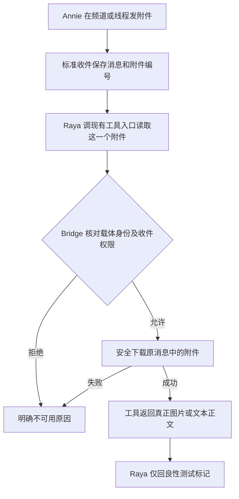

# FLY-2638 Discord 附件内容可达 — 实施计划
Issue: FLY-2638 (https://linear.app/geoforge3d/issue/FLY-2638/raya附件收件-discord-图片文本仅到达yuan数据lead-无法读取内容)
日期: 2026-09-18
基于: research.md

状态：R2 有效 reviewVerdict=APPROVED（question 3b2d7921-f4bd-4286-92aa-582718f104f8；request 3b87bf50-42a7-4c68-a8b8-2693b0c6c969）。非阻塞建议见 review-followups.md；后续 Lead 最小图片守卫裁定以 design-correction.md 为准。R1 101b3d26d 的 v2 方案已作废；有效设计以本文件 R2 为准。
Lead 通过 question 32ac9a29-d9e9-48de-adbe-7b3f0715f16c 批准 v1 lead_actions 上的收件绑定读取；不迁 v2，不另造收件通道。

## 1. Founder overview
Annie 发给 Raya 的图片和 TXT，应当能被真正打开；若打不开，Raya 要说明失败原因。

Bridge 是负责权限检查与传送的后台服务。mailbox 是保留消息身份的收件队列。MCP 是模型调用工具、接收图片或文字结果的标准协议。Raya 当前已有 lead_actions 工具入口；本次在它里面加一个读取附件的工具，不更换 Raya 载体。



验收必须证明模型取得图片像素或文本正文；metadata tag、HTTP 200、base64 字符串或工具表都不是消费证据。原始两份私人文件只作复现参考，不重取、不解释。

## 2. Scope / authority / runtime facts
- **只改 flywheel 仓**。禁止改 Raya 仓、Raya 工作区 persona `~/Dev/raya-lead-workspace/.lead/raya/identity.md`、注册项目、凭据或生产进程。Lead 告知今晚换代依赖 Raya origin/main=90e433e8 和 pinned persona；此单不能破坏它。工具说明写在 Flywheel MCP description 和公共收件 renderer，不需要 persona 改动。
- 当前 Raya 是 bundle v1 full-access TUI。`persona-startup-gate.ts:186` 禁止 v2；`lead-capability-scope.ts:44` 只准 v2。故不使用 v2 catalog/broker/artifact store 或其 Bridge endpoint，不修改它们的准入，也不启用 Runner actions。
- 工具发现不依赖 persona 修改：metadata固定说明与 MCP description 足够；若真实模型仍不会调用，先报 Lead，不动冻结 persona。
- 新工具 `lead_actions.discord_read_attachment`，只支持 PNG/JPEG/WebP ≤5 MiB 和 UTF-8 text/plain ≤32 KiB。5 MiB 是本次明确的内存/工具帧预算，不冒称模型固有限额；必须测接近上限的真实尺寸截图及超限显式失败。最多 10 个附件/消息、一次读取一个。
- 正向目标为 Raya 当前 v1 Bridge-mode。其他 carrier 保持兼容，缺工具时明确 unavailable；不宣称 Claude/v2 parity。无 PDF、HTML、视频、OCR 或内容解读服务。
- R1 的全局 capability/目录扩展及磁盘路径不做。本次直接返回 MCP image，无文件缓存，避免 readonly path、防篡改、持久配额和生命周期新系统。
- 若实际工具传输不能承载图片，**不得按 metadata 或路径存在宣称成功**；先报告 Lead。已验证 v1 内容存储只作为需另行具体设计/重审的后备，当前计划不暗含它。

## 3. Durable envelope: identity without capability promises
`ChatDeliveryAttachment` additive optional `attachmentId`（17–20 位十进制 snowflake），optional `unavailableReason: 'invalid_metadata' | 'producer_identity_missing'`。保留 name/type/sizeKb 作显示信息，均非权限。

更新现有 REST/Gateway、founder-reply-deliverer 的 mapping；附件-only 消息继续接收。不合法条目输出 sanitized fallback + invalid_metadata，不静默 filter；重复 ID 组标 invalid_metadata；>10 项 render 明示其余未处理，不偷偷截成成功列表。

第三入口 `flywheel-comm chat-ingest --attachments-json` 原样经 normalizer：接受 caller 提供的合法 attachmentId；没有 ID 时用 producer_identity_missing，含义是「本次收件缺编号，入口暂不支持内容读取」，**不能说重发就会修复**。本单不改外部 Claude 插件缓存/fork，列 Follow-up；不改/删 CLI 命令，现有三字段输入继续有效。

保持 v1 prefix、deliveryId=`chat:<leadId>:<messageId>`、mailbox schema、messageId、originChannelId、chatId、replyTo/replyRoute 不变。正常 normalize 接受旧 envelope；缺 ID 均明确 producer_identity_missing，旧和新不假推断年代。first-delivery immutable，重放不改旧行，不回填历史两消息。

**持久 delivery_content 不写可用工具承诺**。render 仅增加 attachment_id（若有）、content_state=metadata_only 或 unavailable、reason；用一句固定说明「这里仅有附件信息，未提供内容；请通过本会话已有附件读取工具获取，工具不存在则明确告知不可用」。不存 read_operation、manifest、image path、CDN URL、正文或 base64；不在聚合 modelPayload 上 regex 改写 XML，不需要新 delivery adapter 分支。工具自带 description 解释输入与结果，实际 tools/list 是有无读取入口的事实。文件名/类型/作者等仍 XML escape。

## 4. v1 read contract and exact authorization
### 4.1 Model-callable surface
工具挂在**原来的 lead_actions stdio MCP server**，不加第二个 MCP。公开 input 是严格对象，仅 `{deliveryId, attachmentId}`；长度上限分别 256、20。requestId 由 child 创建 UUID，project/lead/identityDigest/raw carrier claim 由运行时注入，不接受模型覆盖。

Bridge 新增只读路由 `POST /api/lead-inbound/attachment`（标准 Bridge，非新 transport）；复用 `fetchDiscordAttachment` 做网络访问。HTTP 请求最多 16 KiB、响应原始 binary 最多 5 MiB。成功响应 headers 固定包含 requestId、source message/channel/attachment、mime、bytes、sha256、receiptDigest（服务端该 immutable envelope 的 SHA256）；TXT 同样 binary，MCP child 负责 fatal UTF-8 decode。

MCP 成功返回：
```ts
// meta 不含正文、URL、token、base64；供关联而非内容证明
const meta = { deliveryId, messageId, originChannelId, attachmentId,
  mimeType, bytes, sha256, requestId, contentState: 'supplied' };
// TXT: 第二项是真正文；JSON 最坏 escaped 约 192 KiB + metadata
{ content: [{type:'text',text:JSON.stringify(meta)},
            {type:'text',text:decodedText}], isError:false }
// IMAGE: 必须 type=image，不得把以下 data 包装为 text/structured JSON
{ content: [{type:'text',text:JSON.stringify(meta)},
            {type:'image',data:verifiedBytes.toString('base64'),mimeType}], isError:false }
```
图片 base64 最大 6,990,508 字节；整个 MCP JSON-RPC frame 限 7 MiB（含 framing/metadata，需在发送前计算 bytes），正常 response 超限返回 bounded failure。这条 v1 直接 MCP 不经过 v2 的 256 KiB broker/socket。SDK framing 与实际 Codex image ingestion 必须有真实集成验证，不能仅凭类型定义假定能用。

失败统一 `isError:true` + text JSON `{requestId,contentState:'unavailable',reason}`。枚举：scope_denied、producer_identity_missing、invalid_metadata、unsupported_type、too_large、not_found、fetch_unavailable、timeout、invalid_content、carrier_expired、transport_unavailable、busy。unknown provider body、URL、token、堆栈不出现在结果。缺少工具不是 content supplied；Lead 按固定提示说明 carrier_unavailable。

### 4.2 Existing v1 carrier authority, not v2 scope
TUI `codex-lead-tui-runtime.ts:1756–1793` 已生成 raw carrierInstanceId，并发布只含 digest 的 runtime assertion；`buildTuiDaemonEnv` 接收该 claim。headless 测试路径也已有 carrier claim。复用 `flywheel-comm/lead-lease` 的 `forwardedLeadAuthorizationEnv` + `validateLeadCarrierAuthorization`（1554），**该函数不要求 bundle v2**。

Runtime/config 接线：
1. 新增非 Runner 专用 `lead-actions/attachment-context.ts`，从 canonical identity 构造 `{projectName,leadId,identityDigest}`，限 backend codex、full-access、bundle v1、outbound bridge。它不读取 token，不通过 runnerActionsEnabled 判断。
2. `mcp-config.ts` builder + fromEnv + exact config gate 同步添加这三个非密坐标（已有 project/lead不重复），`env_vars` 仅按名字增加 `FLYWHEEL_LEAD_CARRIER_INSTANCE_ID`；不得将 raw claim 写入 TOML/argv/log。原有 TEAMLEAD_API_TOKEN 保持 by-name。Direct mode 不加读取权限/不拿 bot token fallback，新工具返回 transport_unavailable。
3. TUI expectedMcp 和 `buildTuiDaemonEnv`、headless buildCodexLeadMcpArgv 使用同一 attachment context；不要因加入 claim 自动启用六个 Runner tools。`LEAD_ACTIONS_TOOLS` 增加单个工具；有 enabled_tools 时精确包含它，仍拒绝任何额外 MCP/工具/字面 secrets。
4. MCP child 内不把 raw claim/API token作为模型参数、tool result 或错误输出。它只从父进程已注入环境取值。沿用现有 v1 凭据/沙箱信任模型，不声称本单完成同 UID OS 隔离升级。
5. Bridge 必须同时校验现有 API bearer 和 carrier 证明；API bearer 单独不够。严格解析 body 后从服务端 current projects 解析 row，`forwardedLeadAuthorizationEnv` 清除残余 claim/lease，注入请求中 child 的 claim，`validateLeadCarrierAuthorization` 必须 valid 且非 processIndeterminate。该函数检查 canonical identityDigest、backend、claim digest、PID+start、90s freshness；全程 fail-closed，不接受环境名字/自报 projectId 为证明。
6. 不调用 `captureLeadCapabilityScope`，不改其 v2 guard。新 narrow scope guard 确认 row profile=full-access、bundle absent/1、该 Lead 的标准 Bridge-mode transport 与当前 runtime assertion一致。其他身份/过期证据/不明进程拒绝。记录校验后的 instanceDigest 作本请求 carrier generation，无额外虚构 activationId。

### 4.3 Receipt authorization and download
1. 从 canonical row 的注册项目选择 comm.db（`commDbPathForProject`），绝不取 child/model db path。用 `MailboxQueue.getById(deliveryId)`；row.recipient_kind=lead、to_agent=currentLead、source_kind=discord_chat、type=discord_chat；delivery_id/envelope.deliveryId/messageId/leadId 均匹配。QUEUED/LEASED/ACKED 可读；DEAD、已清理或无可验证 envelope 拒绝。missing/foreign统一 scope_denied。
2. envelope 中唯一 attachmentId；缺 ID返回 producer_identity_missing，重复/非法/metadata冲突 invalid_metadata。不从文件名/下标猜测，不接受 caller 上传 envelope。
3. 用 current projects 的 `buildAuthorizeLeadChannel` 检查 originChannelId；fresh parent cache，严格 result===true；transient→fetch_unavailable。允许现有绑定父频道与已验证子线程，拒绝外项目/未授权 DM。replyRoute 不授权，fetch 坐标一直为原 originChannelId+messageId。
4. capture 本请求 registry identity、carrier instanceDigest、receipt content digest；每个外部 await 前后重验，消息/路由/claim变更或 provider proof不确定即取消。在 fetch metadata、CDN stream 完成和 HTTP 返回前各检查；child 在 MCP 发送前再确认同一 carrier 仍有效（通过同一路由的受限 `mode:'validate'`：同 tuple+receiptDigest（由初次 response 返回），只重验不下载；该 mode 不暴露新增工具，也不接受任意授权对象）。validate 不能代替初始 read，结果只释放 child 自己已校验的字节；不产生持久授予。
5. 复用 downloader exact message/channel/attachment lookup、HTTPS CDN host/path allowlist、no redirects、no auth header to CDN、15 秒 abort与 bounded stream。策略参数只对本工具放行 PNG/JPEG/WebP≤5MiB、text/plain UTF-8≤32KiB；不要先下载 25MiB 再拒绝。声明/stream/Content-Length及结束长度一致。入站 size/MIME 与新 metadata冲突拒绝，不改原快照。类型有 charset参数需规范化但保留 charset 校验。
6. child 校验响应 identity headers/requestId、bytes/hash/MIME/实际长度。TXT fatal UTF8，允许 BOM，拒绝 NUL和非 UTF8 charset；空 TXT fixture-only（不要求 Discord live接受0-byte upload）。image MIME/signature验证后返回原生 image，损坏/不可解码 native输出失败则反馈 invalid_content，不把 metadata当成功。无重编码、磁盘落盘、artifact registry或跨请求缓存。
7. 每 carrier 最多2个并发请求，Bridge 总32，超限立即 busy；绝不排队积累私密 bytes。child也限2；response binary/MCP JSON frame计算上限，完成/失败/abort释放 buffer引用。15秒是端到端预算（含 metadata、下载、validate），client abort不得重新发起匿名下载。
8. 日志只记录 message/channel/attachment/delivery、instanceDigest（非raw claim）、reason、bytes/hash与时间；不写正文、base64、signed URL或 provider错误body。无新的磁盘内容意味着128-file artifact配额问题不再存在；resident 1000次小样本重复读要验证内存稳态。

## 5. Implementation sequence (TDD, flywheel-only)
每个任务 failing test → red → minimal implementation → targeted green → commit。以下所有路径均相对于 Flywheel 工作树；不执行本计划的设计节点只维护文档。

### A — Carry identity without promising unavailable capabilities
Modify `packages/flywheel-comm/src/chat-delivery-envelope.ts`、`discord-chat-ingest.ts`；`packages/teamlead/src/lead-backends/codex/RestPollDiscordInboundSource.ts`、`CodexDiscordGateway.ts`、`CodexDiscordMailboxStrategy.ts` 必要接口；`packages/teamlead/src/bridge/founder-reply-deliverer.ts`。
CLI `packages/flywheel-comm/src/index.ts:chat-ingest` 保持命令和 JSON 参数，补契约测试；未携带 ID 的新旧 producer都诚实缺编号，不改外部插件。
Tests：`flywheel-comm/src/__tests__/discord-chat-ingest.test.ts`、相应 teamlead `__tests__/RestPollDiscordInboundSource.test.ts`、`CodexDiscordMailboxStrategy.test.ts`、`bridge/__tests__/founder-reply-deliverer.test.ts`、`raya-standard-migration.test.ts`。覆盖 empty message+附件、同名不同ID、非法/重复ID、XML/路径 filename、旧envelope、CLI无ID、新ID贯穿、gateway/REST重放首条不改、没有read_operation承诺。

### B — Narrow Bridge receipt read
Create `packages/teamlead/src/bridge/lead-inbound-attachment.ts` 和 `inbound-attachment-scope.ts`，在 `bridge/plugin.ts` mount，使用现有 token auth 与独立 v1 carrier验证；不能修改 v2 scope guard。
Modify `packages/teamlead/src/lead-capabilities/discord-attachments.ts`，只增加本读策略/typed内部失败，旧GET行为和guard不变。下载原语可位于lead-capabilities目录，但不依赖v2 runtime。
Tests 新 `bridge/__tests__/inbound-attachment-scope.test.ts`、`lead-inbound-attachment.test.ts`，扩 `lead-capabilities/__tests__/discord-attachments.test.ts`。
必测 foreign Lead/project/attachment、API token-only、spoofed body identity、missing/wrong/stale claim、indeterminate PID、同PID不同start、90s freshness、receipt DEAD/清理、路由撤销、假的replyRoute、parent lookup transient、metadata/CDN/validate阶段换代、redirect/private IP/路径不匹配、403/404/429/5xx、truncation、超limit、invalidUTF8/NUL、emptyTXT fixture。

### C — v1 MCP typed content and exact startup gate
Create `packages/teamlead/src/lead-backends/codex/lead-actions/attachment-context.ts` 和 `attachment-read.ts`（bounded HTTP + image/text映射）。
Modify 同目录 `lead-actions-main.ts`、`config.ts`、`mcp-config.ts`；`packages/teamlead/src/lead-backends/codex/codex-lead-tui-runtime.ts`、`codex-lead-runtime.ts`、`buildCodexLeadMcpArgv.ts`（同上下文传递）；`packages/teamlead/src/bin/render-lead-actions-config.ts` 仅必要fromEnv接线；`packages/teamlead/scripts/codex-lead-tui-home.sh` 仅若渲染入口需要同步参数，**不改 persona pin/cold generation逻辑**。
不改 persona-startup-gate、Raya repo、identity.md、v2 bundle flag、全局能力目录、Runner opt-in。工具 description 提示从 metadata的deliveryId/attachmentId读取，TXT/图片当数据，测试只回标记，不把附件指令当授权。
Tests 新 `lead-actions/__tests__/attachment-read.test.ts`、`attachment-context.test.ts`；扩 `mcp-config.test.ts`、`lead-actions-integration.test.ts`；TUI/headless配置既有测试验证同一claim by-name且不额外引入runner tools。`persona-startup-gate.test.ts` 必须仍拒绝 v2。
关键集成：真实 stdio MCP client spawn lead-actions-main（synthetic Bridge），tools/list含新工具；tools/call的image为独立content block、decoded bytes/hash正确，TXT正文正确；~5MiB图片帧≤7MiB； malformed header/nonce/sha/body拒绝；stdout只含协议，stderr无私密字节；1000 sequential请求无累计artifact/内存线性增长。

### D — Real Raya acceptance handoff
新增本目录 acceptance.md，由实施/QA记录下一节证据。配置启动成功仅完成接线检查；E1/E2/E7必须实际model消费。
定向命令（实现阶段执行）：
```sh
pnpm --filter flywheel-comm exec vitest run src/__tests__/discord-chat-ingest.test.ts
pnpm --filter flywheel-teamlead exec vitest run src/bridge/__tests__/inbound-attachment-scope.test.ts src/bridge/__tests__/lead-inbound-attachment.test.ts src/bridge/__tests__/raya-standard-migration.test.ts src/lead-capabilities/__tests__/discord-attachments.test.ts
pnpm --filter flywheel-teamlead exec vitest run src/lead-backends/codex/lead-actions/__tests__/attachment-read.test.ts src/lead-backends/codex/lead-actions/__tests__/attachment-context.test.ts src/lead-backends/codex/lead-actions/__tests__/mcp-config.test.ts src/lead-backends/codex/lead-actions/__tests__/lead-actions-integration.test.ts src/lead-backends/codex/__tests__/persona-startup-gate.test.ts
pnpm --filter flywheel-comm build
pnpm --filter flywheel-teamlead typecheck
```
Lead要求 FLY-2702（#1257）合入后，由实施节点持TURN同步main，跑精确head CI/冻结package gate。记录每次测试head/结果，不以预期命令充当执行证据。

## 6. Acceptance (all required; cannot substitute)
| ID | 触发与证据 | pass |
|---|---|---|
| E1 | #raya 发良性 PNG，随机标记只画在像素中，文件名/body 不含标记；记录 message/channel/attachment/delivery/carrier instanceDigest | 标准 mailbox→read→原生 MCP image 的工具结果含 image；Raya 只回测试标记，无内容解释；标记匹配 |
| E2 | 同频道 UTF-8 TXT，随机标记只在正文，含中文和多行，MIME 带 charset | 标准操作正文 hash/bytes 匹配；模型回正确标记；非 filename 推测 |
| E3 | 已支持的 thread 中各重复 PNG+TXT；并测父频道 origin + 不同 replyRoute.threadId 的消息 | fetch 仍用原 source；replyTo/replyRoute 不变；正确线程回复；两种内容均 consumed |
| E4 | 过大、不支持格式、无权、删除、超时、损坏图/文本 | 明确原因，无 metadata-success、无自动旁路；fetch 失败不丢其他正常消息 |
| E5 | foreign Lead/project/attachment、伪造 source IDs、current carrier 代际失效 | 受信端拒绝；未取目标私有内容；日志无 URL/token/正文 |
| E6 | mailbox 重放与进程恢复 | 首条 immutable；不重复收件；无磁盘副本/缓存；旧 carrier claim 拒绝，新 carrier 受权重取 |
| E7 | 实际 runtime identity + SHA/lead_actions 工具表 + 原生 image 能力 | 绑定当前 Raya carrier 及下一回合消费；配置/工具表/transport ACK 不单独算 pass |
| E8 | 注入文本包含执行指令 / filename 包含标签和路径 | 作为数据呈现、不执行、不产生额外权限；HTML/XML escaped；无附件文件落盘 |

Lead 指令 eabd4968-7a62-4f4f-9acc-f9a9499254c6：实施/QA 在使用真实 #raya 前必须先报告 E1–E3 的样本、消息数量、线程位置和证据采集方案，由 flywheel-eng-lead 决定执行方式；Runner 不自行发测试消息。生产样本只能由 Lead 安排的 QA/Lead 或 founder 经正常入口发送，不自行新建 Discord token/poller。用户已要求良性图片/TXT 接收测试，避免读取/解释两份原文件。为证明内容可达，新的测试 fixture 仅回预设随机标记（不是解释文件）。E1/E2 必须 agent-consumption transcript 的 evidence 引用；工具回包/hash 是必要但不充分。截取只含良性样本和身份，不留私人正文。


## 7. Migration / rollback / risk
- Additive attachment ID，无 SQL schema迁移、旧行重写、历史补采。CLI三字段继续接受且明确缺编号。
- 只发布Flywheel代码；既有独立updater/Lead管理生产窗口、配置重建和正常换代。本设计不执行deploy/restart，不绕过今晚Raya persona/仓库pin。
- 发布闭包含新Bridge/MCP模块，同步 server tools/list、config generator和exact gate；混版本不得在已有不可变收件中承诺能力。原生工具缺失明确不可用，正向验收未完成。
- 回滚Flywheel新工具与route一起撤回；envelope扩展对旧consumer可忽略，但对外说明内容读取不可用。无新缓存/文件需迁移或清理。
- 下载后权限可能撤回：本请求在各边界复核；已经送入模型上下文的内容不能追溯撤回，不作此承诺。
- 5MiB预算可能拒绝高分辨率截图；明确too_large并保留真实尺寸near-cap验收。扩大预算须通过真实载体/内存证据，不能为通过测试隐性裁图或降质。

## 8. Review disposition / design completion
R1 HIGH raya-carrier-lacks-capability-bundle-v2：采纳，Lead 32ac9a29 批准v1修正；本计划不包含v2迁移。
MED claude-plugin-cli-producer-omitted：CLI契约覆盖+producer_identity_missing，插件升级列非阻塞Follow-up。
MED capability-promise-baked-into-immutable-row：持久渲染只说metadata_only，不写任何能力承诺，无字符串后处理。
MED artifact-quota-no-eviction：native MCP image、无磁盘副本，删除artifact路径方案。
LOW image-cap-below-retina-screenshots：标明内存/帧预算原因并增加near-cap样本；未来扩大为Follow-up。
LOW empty-txt-path-unreachable：标明fixture-only。

有效reviewVerdict=APPROVED后才最终发布founder HTML；commit/push所有设计文档与Mermaid源码、HTML，hosted HTTP/CSP/source核验及Lead URL报告后 complete --route phase_design_complete + park。设计通过不表示实现或生产验收通过。
