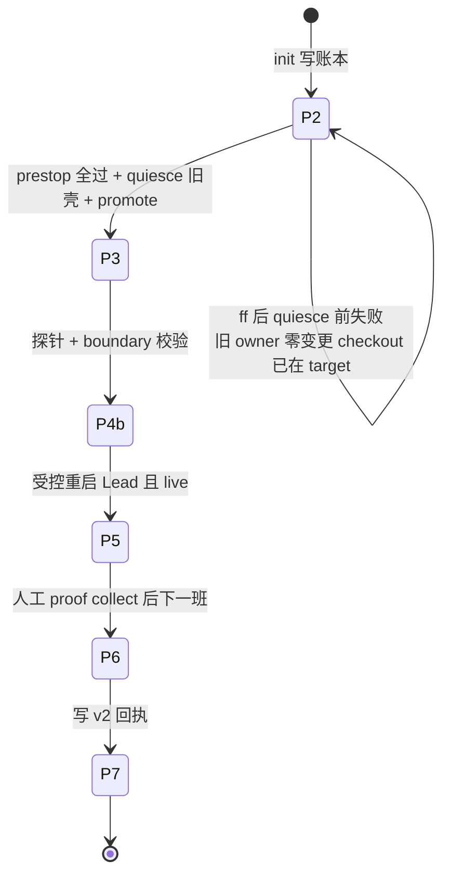

# FLY-2653 Raya 割接工具缺口 — 调研
Issue: FLY-2653 (https://linear.app/geoforge3d/issue/FLY-2653/raya割接工具缺口-旧壳-brain-在-p3-之前自己死了-标准-lead-已在线-班车-prestop-永远-validation)
日期: 2026-09-18
基于: exploration.md

所有 file:line 对应 `origin/main = bd2fc7dfe`（= 生产已部署 SHA）。生产读数均为只读采集，2026-09-18 13:20–13:40 PT。

## 1. 割接状态机与「谁能推进它」

- 唯一推进者是 `updater_raya_pass`（`scripts/lib/updater-raya-deploy.sh:1350-1442`），它只在 `UPDATER_WAKE_KIND=scheduled` 时被调用（`scripts/update-flywheel.sh:1008-1019`）。
- `UPDATER_WAKE_KIND` 由 urgent token 快照是否为空决定（`update-flywheel.sh:772-776`）。`scripts/request-restart.sh:76-91,135` 只会发 urgent token ⇒ 紧急重启**永远**走 `urgent) log "raya shuttle: skipped wake=urgent"`。这就是 FLY-2433。
- 「定时器触发」不等于 scheduled：班车取快照时 `self-ship-urgent.d` 里有任意条目（含 `request-restart.sh:135-140` nudge 失败后遗留的 token）⇒ 这一轮按 urgent 处理、不跑 raya 段。
- 定时点：`~/Library/LaunchAgents/com.flywheel.updater.plist` `StartCalendarInterval` 00:00 / 12:00 本机时区。
- 手动唤起 updater 被 FLY-913 部署护栏硬拦（连在命令文本里提到都会被拦），不是可用路径。
- P5→P6 不是自动的：`raya_standard_collect_proof:648-668` 在 `proof.json` 不存在时返回 2（`awaiting_proof / p5-awaiting-real-p6-evidence`）。`proof.json` 由 Lead 手动跑 `raya-migration-proof.js collect --text-message-id <id>` 产出，且 `summary_absorption_round` delivered 是 P6 门的一项（FLY-2496 `plan.md:136-141`）⇒ 中间夹一个 6h summary 轮。

结论：init 之后，**founder 用上新 Raya（P5）最早 = 下一趟 scheduled 班车；v2 回执（P7）最早 = 再下一趟**。

## 2. `init --resume-from-failed` 的完整守卫表

| 顺序 | 守卫 | 位置 | 生产读数 |
|---|---|---|---|
| 1 | 参数形状：40-hex target、两个 snowflake、探针 env 名 ≠ `RAYA_BOT_TOKEN` | `raya-migration-init.ts:156-163` | — |
| 2 | 旧账本可 resume：P2、无 `old_stopped_at`、owner 无 stop 键 | `:177-188` | 满足 |
| 3 | canonical manifest / registry 身份自洽 | `:192-234` | 三文件 0600 在位 |
| 4 | `.env` 三类 token 存在 | `:235-241` | 键名在 |
| 5 | Bridge nudge 返回 202（**dry-run 也会发**） | `:244-261` | Bridge `/health` ok |
| 6 | Raya bot 身份 == registry | `:262-264` | — |
| 7 | 授权消息：id/channel/author==founder/非 bot/某行 trim 后逐字 == canonical 行；`content_sha256 = sha256(message.content)` 由工具算 | `raya-migration-manifest.ts:33-74` | 未读正文（runner 不碰 token） |
| 8 | 探针 bot 是 bot，且 ≠ Raya bot、≠ founder | `:276-286` | 旧账本同 bot 已通过过一次 |
| 9 | legacy census：service-missing ⇒ `pid:null,loaded:false`；loaded 且首个 `state = not running` 无 pid ⇒ `pid:null,loaded:true`；其余零 pid 形状拒 | `:62-138` | brain 前者、voice 后者 |
| 10 | cursor 存在 ⇒ 必须 resume + 可解析 + `verify --stage live` PASS ⇒ `preexisting` | `:309-333` | 8/8 PASS，pid 64886 |
| 11 | dry-run 到此返回；真跑取 deploy lock、发/复用 precheck 探针、冻结三文件字节、CAS 写账本（沿用 `migration_id`） | `:337-396` | — |

init **不检查** persona 占位，也不 fetch Raya 仓。`origin/main == target` 的唯一权威检查是 prestop 里 bounded fetch 之后的严格相等（`updater-raya-deploy.sh:1040-1047`）。这两条只在班车 prestop 才暴露。

## 3. prestop 的子检查与「单一 detail」问题

`raya_prestop_prepare`（`updater-raya-deploy.sh:1033-1103`）按序：授权行自洽 → legacy owners → remote URL 白名单 → fetch → `origin/main == target` → 祖先关系 → scratch worktree → install/build → 产物形状 → **persona == 工作区占位** → 导出候选 + fsync → digest → prestop-probe → quiet-check → 写 prepared_candidate → ff → HEAD/clean 复验 → candidate 复验 → legacy owners 复验 → quiet-check 复验。

任何一步失败，调用方统一写 `RAYA_DEPLOY_STATE=prestop-failed` / `RAYA_DEPLOY_DETAIL=prestop-validation-failed`（`:1150-1153`）。2026-09-16 两次、2026-09-18 12:06 一次，三次失败在日志里长得完全一样，但真实原因至少有三种可能同时存在（legacy owner、target 漂移、persona 过期）。FLY-2669 已经把「每个 unit 的失败」浮出来了，但粒度停在 detail 字符串，所以这里仍然不可分辨。

## 4. persona 占位的生命周期

- 写入者有**三个**：persona projector（FLY-2696，`scripts/flywheel-lead.sh:243-254` → `flywheel-comm persona-project`，Raya 每次启动前运行；生产上无 contract、无 marker ⇒ `skipped/not_enrolled` 不写文件，见 runbook §1 #15）；激活包人工步骤（FLY-2496 `plan.md:77`，`git show <target>:.lead/raya/identity.md > 工作区`），以及班车 `raya_materialize_business:923-964`（P2 之后，从候选物化，且要求旧值 == 新 persona 或 == 上一份回执的 persona）。
- prestop 把它当「占位必须已经等于 target」来校验（`:1064-1066`），不会自己写。
- 所以**每换一次 target，人工步骤要重做一次**；工具不提醒。执行前快照里工作区是 `9d63a2b` 版（`4e982448…`），与新旧 target 都不等；Lead 13:37 PT 重投影后已等于 target（`ca1240f1…`）。

## 5. target 易碎性

`origin/main == target` 是严格相等。Raya 仓在 2026-09-18 13:40 PT 读数时有 10+ 个 open summary PR；main 自 2026-09-16 12:56 PT 未动。首趟班车 ff 前任何合入都会让授权行作废。ff 之后不再受影响：非 P2 checkpoint 走账本里的 `raya_sha` + `raya_verify_frozen_source`（`:1136-1141`）。

## 6. 调研结论

1. FLY-2653 的两条期望 = FLY-2657 的交付，代码与生产 dist 均已确认。
2. 截至执行前快照，割接卡住的原因是三件运维事实（前两件 Lead 已处理，只剩等班车）：账本授权/target 过期、persona 占位过期、紧急重启不跑 raya 段。runbook 逐条覆盖。
3. 真正残留的工具缺口是可观测性（§3）与 init 缺 persona 预检、缺 target 早期诊断（§2 末；后者只能是本地快照诊断，不能替代 prestop 的远端权威闸）。二者都不放宽任何安全闸，适合单独立单。
