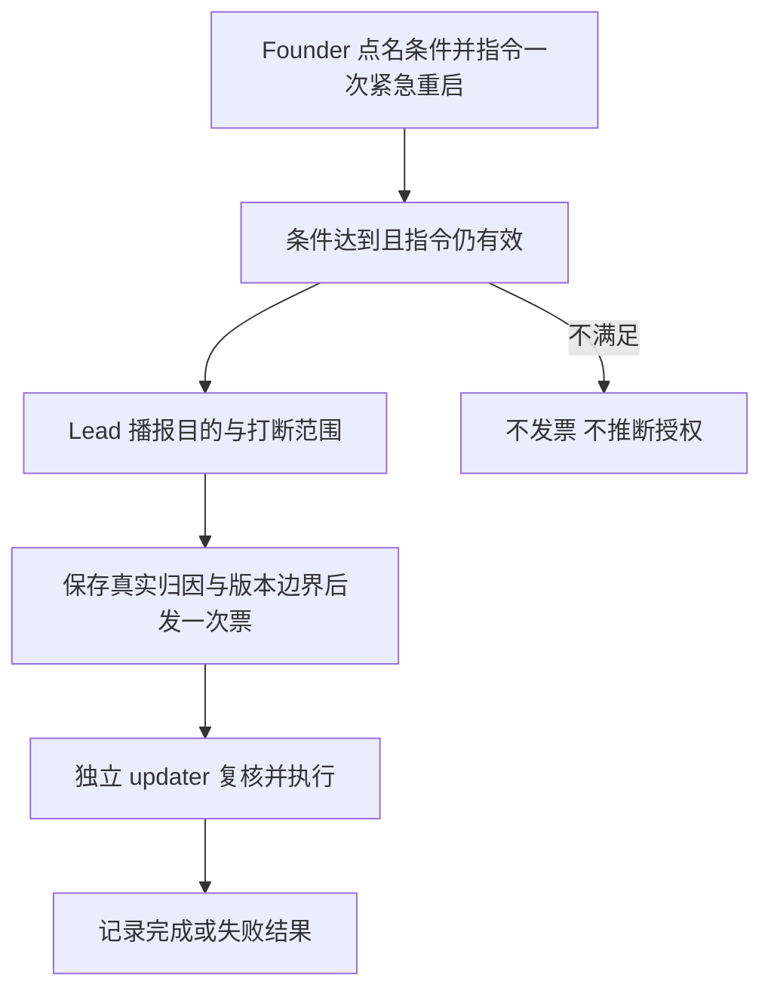
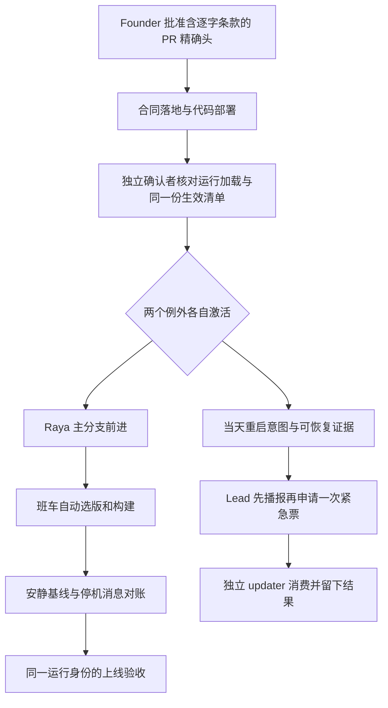
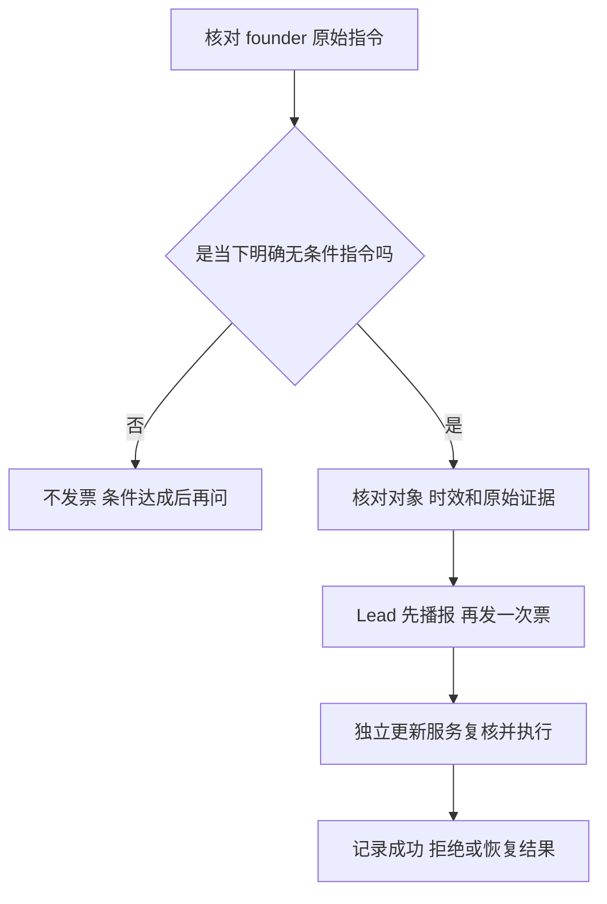

# FLY-2654 被后续裁定替代的设计 — 历史记录
Issue: FLY-2654 (https://linear.app/geoforge3d/issue/FLY-2654/规则放权-founder-2026-09-16-2249z以后怎么样可以避免我来授权你就自己做决定把raya)
日期: 2026-09-20
基于: plan.md

以下完整保留 758823879 上的计划。它不是当前实施或授权规范；当前规范只读 plan.md。

`````text
# FLY-2654 条件重启指令与待定放权 — 实施计划
Issue: FLY-2654 (https://linear.app/geoforge3d/issue/FLY-2654/规则放权-founder-2026-09-16-2249z以后怎么样可以避免我来授权你就自己做决定把raya)
日期: 2026-09-17
基于: research.md

状态：按 Lead 最新 A/B 裁定重排，待一次有界设计复审。

## 当前有效范围与决策来源
Lead 问题回复 `3262d907-45d1-446c-9fcf-7edc13d3073b`：founder 正在决定是否把 Raya packages/cos 搬入 Flywheel，暂停 Raya 半边；只复审 Part A 和 Part B 的隔离，不实施 Part B。随后回复 `4c50f935-1aec-489b-868f-ee050a68ceab` 进一步裁定：Part A **不做 standing carve-out，不要 activation manifest**；只澄清 founder 点名触发条件的重启指令属于 AUTH-CANON(A)，并加强真实归因和审计。原收尾三条件 standing 方案一并进入 Part B。

本次实现清单只有 Part A。Part B 是保留的历史设计，不是候选启用代码、不是授权、也不是 Part A 的隐式依赖。原始整单目标没有被宣称完成。最新 Lead 指令 `[lead-instruction ec106d4d-6c4b-4507-a164-73bcef60a2e3]` 明确：founder 2026-09-17 20:29Z 已拍板 Raya 总管逻辑迁入 Flywheel（Epic FLY-2679），Part B 已关闭，由该 Epic 拆除旧机制取代；下方档案保持历史原文。

# Part A — 本次交付：一次条件式 founder 重启指令

## A1. Founder 能看到的变化
当 founder 已经明确说“某单/某 PR 修好或合入后，马上重启，不等班车”，Lead 在条件真的达到时直接执行那一次指令，无需让她再发一遍同样的授权。每张票同时记录“谁下的指令、谁发的票、触发哪件事、从哪个版本到哪个版本”。

这不是 Lead 因为工作看起来收尾了就自决重启。没有具体的 founder 指令，或对象、动作、时效不清晰，仍走原有授权路径。R1 merge/ship、R2、R3、R5 和 AUTH-CANON(A/B) 定义全部不变。



## A2. R4 逐字 reading guide 候选文本
仅在 `packages/teamlead/lead-rules-base/founder-only-authority.md` 的 R4 增加下段识别指引，并把旧命令示例更新为携带已核验请求证据的调用。不得把它列入 AUTH-CANON(B)，不得改成第三个运输来源。

> **识别预先指定触发条件的逐实例授权。** Founder 事先明确说“<某单/某 PR> 修好/合入后马上重启，不要等班车”，可构成 AUTH-CANON(A) 的一项 per-instance 授权：对象是她点名的那个触发条件，动作是该条件满足后提交一次紧急重启票，运输仍仅限 request-restart.sh → 独立 updater。Lead 必须引用认证的原始消息、固定对象、核实触发证据并检查后续撤回/改意。指令带有自然语言时间框时，时效首先服从该时间框（例如“不要等到今天晚上 12 点”就是今晚午夜之前）；能确定精确时刻则取该时刻，无法确定更精确时刻的当日/今晚时间框按 founder 当地当日结束截断。完全无时间框才默认自原始指令时间起最多 24 小时。不能把“马上/今天/今晚/不要等到”漏识别后静默降为 24 小时，也不能用模糊长期方向延长。更换单/PR、扩大条件范围、撤回或过期都会使这项条件授权失效。每项指令只允许一次实际波次，不因换票号或跨日重置。发票前，Lead 必须在工程频道播报目的、会打断哪些对象及恢复预期，取得消息回执；票和审计保留真实 Lead 发起人、founder 指令引用、触发对象及证据、fromDeployedSha 与 targetSha。缺证据不发票；这段只是识别指引，不是新的授权来源。

例子：Lead 提供的 founder 2026-09-17 19:42Z 指令“2655 修好了我们可以马上重启，不要等到今天晚上 12 点”，出处为工程频道 `1516209714097291335`、消息 `1550230431658541137`。这是设计样板；运行时必须重新取原始认证消息，不能拿本文转述当授权。该样板属于条件式 `issue_fix_landed`：说的是“2655 修好了〔之后〕马上重启”，并未断言它现在已经修好。其时间框是 founder 当地该消息所属日期的午夜之前，不是原消息后 24h；若 2655 到第二天上午才满足，必须拒绝这条过期指令。没有执行这张真实票。

与原有“fresh per-instance”一致：fresh 表示当前仍有效且未使用的那项精确指令，不要求条件达到后再复制一遍消息。只说“收尾后再说”“以后你自己决定”“重启电脑”但没有绑定本次 fleet 紧急票对象/范围的文本，不能被此 reading guide 自动升级为授权。原有直接、明确、当前的单次紧急重启授权继续有效。

## A3. 票据模型与认证来源
新增 `RestartRequestV2` / `UrgentTicketV2`（新字段的固定形状，不改变 AUTH-CANON）：

| 字段 | 含义 / 核验 |
|---|---|
| schemaVersion / kind / requestId | 2 / `authorized-urgent-restart` / 唯一 UUID；kind 不冒称 founder 是发票人 |
| authority.kind | 固定 `founder-per-instance`，拒绝 standing/Lead 自批模式 |
| authority.messageRef | 原 messageId、channelId、认证 founder authorId、原始 timestamp、contentDigest；Discord 回读 author 校验 |
| authority.expiresAt | 有自然语言时间框先取该窗口；当日/今晚无法取精确时刻时截于当地当日结束；完全无时间框才 timestamp+24h。记录原文片段、解析时区/结果与拒绝原因，不接受 caller 自填延长 |
| trigger | `issue_fix_landed` 或 `pr_merged`，固定 project/repo/issueId 或 PR number；保留原文与唯一对象解析关系 |
| trigger.evidence | 同一对象的实际修复/合入事件 id、merged commit、PR number/head 与当前适用 QA/复审结果引用；条件式路径从 GitHub 独立回读已合入 `main` 的 PR，判决绑定 PR head，PR 的 squash merge commit 必须等于 cited merged commit；不得把判决改标成 main SHA。直接 `immediate` 指令的 verdicts 为空；标签 Done 和模型声称修好不算 |
| requestedBy | 真实 LeadId、instanceId、播报消息 id；与 registry 身份和播报 bot author 独立核对 |
| announcement | 工程频道消息 id、digest、发送时间；明确 purpose、affected scope、recovery expectations；必须在发票前已发送 |
| fromDeployedSha | 发票时读取生产已部署版本；完整 SHA，不能用工作树 HEAD 冒充 |
| targetSha | fresh remote origin/main 的完整 SHA，必须包含点名修复/合入结果，已过既有 merge 门；不得是本地陈旧 ref |
| preMergeHead | updater 接受波次、改动 checkout 前的干净 HEAD；回滚前用它核对，不让 caller指定任意重置目标 |
| createdAt / requestDigest | 明确时间和固定序列化摘要，绑定所有上述字段 |

时态判别：包含“修好/合入后”“等 X 完成就”或以未完成事件为前件的“X 修好了马上…”时，归为条件式；只有 founder 明确断言条件已经达成（例如“2655 已经修好，现在立刻重启”）且要求现在执行，才可归 immediate，同时仍验证被引用的完成事实。不能只因出现“了”或“马上”就认定已完成；原消息与上下文无法判清则拒绝并澄清，不默认 immediate。

直接单次 founder 指令的兼容分支为 `trigger.kind=immediate`，仍要求原指令明确本次对象/目标波次、动作、运输与时效；不是缺 trigger 字段时的默认 fallback。reading guide 新增的条件式分支不能用 immediate 掩盖缺失条件。

认证的 founder 身份依既有 founder-attribution 配置解析并从 Discord 原消息核对；禁止相信 caller 自报 author、`approved:true`、环境中的 Lead 名字或本地 JSON 的签字。trigger 从原消息和绑定 thread/project 解析；只支持能唯一映射的具体 issue/PR，歧义、条件范围变更、later 撤回或无法读取后续上下文都拒绝。不给“任意修好就行”的自然语言分类器造授权。时间上限最终落成绝对 expiresAt，比较 now < expiresAt；解析“今天/今晚/午夜”使用 founder-local-time.md 与既有 resolver，在原消息时间对应的本地日期确定窗口，保留 timezone 和计算证据，不固定 LA、不凭 UTC 猜本地日。无法消歧的跨日/未来时间表达拒绝并请求澄清，不能回落 24h；当日窗口中的模糊精度按该日结束截断。只有完全没有时间框才采用 elapsed 24h 上限。指令的时区解释在签发前必须确认仍适用；时区变化使解释不确定则拒绝，不能为延长窗口重算到另一个更晚午夜。

requestedBy 通过 registry 中该 Lead 的 bot 身份，与独立回读播报的 `author.bot===true` / author.id 对上；播报绑定 requestId、founder messageRef、触发对象、targetSha 和打断范围，不能借用任意旧 bot 消息。请求只允许 `instanceId=current` 标记；核验器从当前私有 runtime manifest 和活进程（Codex 有新鲜公共 carrier evidence 时同时绑定该证据）解析公开 instance digest，票和日志只持久化 digest，不持久化原始 carrier claim。这里记录 Lead 执行 founder 指令，不把 Lead 的解释写入 founder-verbatim 字段。对所有 backend 使用同一来源认证；Part A 无 live-bundle activation 门，不依赖 Claude-only active.json，也不对 Codex 另造权限。

完整核验请求先落受管审计记录，再以原子 rename 发布票；票内嵌完整字段或携带同一完整记录的受管路径+digest，consumer 必须回读完整内容，不只验摘要。使用私有文件与 no-symlink 检查限制误读，但不把同 UID 文件权限当授权。外部字符串用参数化 execFile/SQL，禁止拼 shell/SQL；错误 reason 有界且不输出凭据。

## A4. CLI、消费者与旧票迁移
- `scripts/request-restart.sh` 保留 founder 当前直接指令的 bare 路径：从 remote（不可达时已验证的本地 `origin/main`）选目标，发布原 v1 `founder-urgent-restart` 票并沿既有 updater 运输，不要求或伪造复审/QA 判决。`--dry-run` 零写入。
- `scripts/request-restart.sh --request <absolute-json-path>` 用于新增的预先指定条件路径：只读核验原始来源、remote/main、deployed-sha 与使用账，发布 v2，并沿同一 updater 运输。缺失/相对/不完整的显式 `--request` 仍 fail closed；不得把坏 v2 请求降级成 bare 票。
- `scripts/update-flywheel.sh` 严格区分两种票：完整 shape 的 v1 founder-direct 票按既有 claim-once 路径执行；v2 条件票回读原来源与触发证据、进入单次使用索引后再 claim。v1 不冒充 Lead 发起或 verdict，v2 日志/告警报告真实 requestedBy 与 authority.messageRef。
- v2 审计/幂等索引放在既有 Flywheel 受管 state 下的新 `restart-request-index.json`，仅 request-restart/updater 两个入口使用同一原子目录锁与 CAS；key 只取 `(founder channelId,messageId)`，trigger object 是该指令的绑定字段而不是新 intent 的命名空间；一项条件式 founder 指令最多一个实际 wave，不能靠更换 trigger kind/object/repository 或 requestId/UUID 绕开。多个指令与同一作用范围重叠时串行消费，不能合并成范围更大的隐式授权。
- before publish 记录 prepared；首次重启副作用之前原子写 started（含 waveId、目标、消费时间）；完成后 succeeded/failed/unknown。明确零副作用的失败可由 Lead 重新核验后在同一 wave/request 的 revision 上重试；结果未知/已经 started 不重新造可执行票，按既有恢复路径处理。

消费者 sweep 是 I1 的门：`rg -n 'request-restart\.sh|founder-urgent-restart' scripts packages engineering doc .lead .claude`，逐个真实调用点/文档示例/测试列处置；特别核对 `doc/engineer/implementation/restart-guard.md`、`bridge-ship-discipline.md` 和 Lead identity。CLI 名称、bare founder-direct 与 `--request` 条件路线均保留；所有本次活动 runbook 同步区分二者，不把历史归档批量改成现行操作。项目外插件消费者需查 fork 源与本机缓存；不可读 root 明示未检查，不报零引用。

## A5. 波次绑定、最后复核与失败收敛
此处没有 activation 或 enforcementDeployedCommit。不要把旧/新代码版本比较变成一条新的站立权限。

1. request 绑定发票时 `fromDeployedSha` 和当时已验证的 `targetSha`。updater 持 singleton lock 时重新核对 deployed-sha、fresh main、条件和原指令有效/未用；任一变化拒绝本票并留 consumed-no-deploy，不能悄悄改票目标。Lead 可在同一未使用指令的剩余有效期内重验并修订请求；无需复制 founder 指令。
2. 在 source fast-forward 前记录 `preMergeHead`、干净状态、fromDeployedSha 和 audit revision；确认目标是正常快进、包含 trigger 修复且已批准合入。保持一个波次一个冻结目标。
3. 使用既有 `restart-services.sh deploy_and_verify` Step 0：先成功取得 `/api/admission/pause` owner lease（只限定正常部署路径）→ 重新枚举本票将打断的完整对象，复核公告范围、消息撤回/时效、trigger、票的 from/target 对象 → 才允许第一次 service stop。重新枚举不是只检查旧清单。临界时 source HEAD 可以已经等于 targetSha，而 deployed-sha 必须仍等于 fromDeployedSha；这两个值不同是合法过渡，不要求目标代码先有某张 activation 清单。
4. 比较 `git HEAD==targetSha`、`deployed-sha==fromDeployedSha`、原指令仍绑定那一个 trigger。新的 main 前进不能扩大波次；如果已导致源目标变化则拒绝。启动后继续沿既有波次完成，成功后才写 deployed-sha=targetSha；票的 founder authority 仅覆盖这一波次，不产生未来发票权。
5. 若 source 已快进但最终复核在任何 service stop 前失败：在仍持 singleton lock、HEAD 仍是本波次 target、工作树仍干净且审计证明本轮零服务副作用时，恢复本轮工具记录的 preMergeHead，核对 deployed-sha 仍为 fromDeployedSha，写 consumed-no-deploy。不得 reset 掉并发 dirty 文件、别人的新 head 或任何证据；任一前提无法证明则不 reset，记录 source/deployed divergence 并告警，让既有恢复责任接手。该恢复由 updater 执行，不让 Lead 手动部署/重启。
6. 一旦开始 service stop，不再使用“零副作用恢复 source”分支；沿既有 rollback_and_restart 恢复。其 pause 失败保持 WARNING + best-effort 继续恢复，不让授权预检或过期的发票时间破坏已开始波次的安全回滚。未来新票仍需一项新且有效的单次指令，不能借回滚扩大权限。

R4 不新增 shutdown/reboot 权限。没有 stand-alone scheduler、launchctl submit、直接 restart-services、强杀现有 Runner 或 R2 状态变更。Part A 的 urgent 波次 **不增加任何 Raya pass**，保持现有 Raya 调度/授权逻辑；这是被暂停的 Part B，不能从旧设计误抄。

## A6. 最小实施分块与验收
| 块 | 精确文件 | 实施与验证 |
|---|---|---|
| I1 | R4 authority 文件；必要的既有 request-restart 调用说明 | 只加 reading guide/带证据命令；AUTH-CANON、R1/R2/R3/R5 不改；先做消费者 sweep 和 resident 预算核对 |
| I2 | 新 `packages/teamlead/src/bin/restart-request.ts`、同名 `.test.ts` | 只做 A3/A4 的请求/来源/条件/单次证据验证；不创建 standing-authority/activation/continuity 模块。先写反例红，再最小实现转绿 |
| I3 | `scripts/request-restart.sh`、`scripts/__tests__/request-restart.test.sh` | 保留 bare founder-direct v1；新增 --request 条件 v2、真实 Lead 归因、只读 dry-run、坏显式请求零副作用 |
| I4 | `scripts/update-flywheel.sh`、`scripts/restart-services.sh`；`scripts/__tests__/update-flywheel-sources.test.sh`、新 `scripts/__tests__/conditional-restart.test.sh` | strict dual consumer、v2 one-use index、preMergeHead 收敛、主部署 final check 与 rollback 分开；不改 Raya 分支 |
| I5 | 本目录 implementation/qa 文档 | 记录真实红绿与边界，正常后继代码评审/QA/ship；设计节点不实现、不重启、不申请 ship |

必测反例：条件路径只有泛化方向/只有 merge 批准/换单或 PR/撤回/原指令过期/伪作者/缺字段/已用 intent/改 UUID/触发未达到/修复不在目标/错误 bot 播报/公告未送达/target 漂移/from 漂移/新打断对象/claim 回包丢失/producer 并发相同 intent；显式坏 v2 不得降级成 v1。

必测正例：bare founder-direct 命令继续发布一张无需 verdict 的 v1 票且 updater 执行一次；在原条件指令的有效时间框内，精确 issue 修复合入后按原指令发一次 v2 票，不再索取 founder 第二条同样消息。不同但明确的 founder 自定到期时间可验证。v2 requestedBy=实际 Lead，authority=原 founder 消息，票和最终结果可关联。完全无时间框的指令跨日但不足 24h 可按 elapsed 时间有效；带“今晚/不要等到午夜”的样板过了当地午夜即拒绝，即使不足 24h。测试“修好了马上”是条件式、“已经修好，现在重启”是事实断言后的 immediate、歧义不推断；本地日期按权威时区，不固定 LA。

失败收敛测试：source 已快进而 zero-stop 最终检查失败 → preMergeHead 恢复、deployed-sha 不变；dirty/新 head 时不得 reset；一旦已 stop → 只走旧 rollback，pause 失败不能使恢复停下。新工作在 final check 前进入 → 重新枚举发现公告范围不符，拒绝且无 stop。issuer backend 为 Claude/Codex 都只通过同一真实消息/registry归因，不借用 backend-specific live activation 回执。

测试命令（供实施节点执行，设计阶段没有声称已运行）：
```sh
pnpm --filter flywheel-teamlead test -- src/bin/restart-request.test.ts
bash scripts/__tests__/request-restart.test.sh
bash scripts/__tests__/update-flywheel-sources.test.sh
bash scripts/__tests__/conditional-restart.test.sh
bash scripts/__tests__/updater-trigger-policy.test.sh
pnpm --filter flywheel-teamlead test -- src/__tests__/fly2567-rule-budget.test.ts
pnpm --filter flywheel-teamlead typecheck
```

规则预算按当前 inventory 全量重算，新增 reading guide/命令示例也计入；超限只精简本次新增操作说明或按需 runbook，不改权限含义、不动其他规则、不降低预算门槛。

## A7. 完成判据与明确不交付项
本设计节点交付探索、调研、此计划、有效有界 APPROVED、已提交推送的 founder HTML、静默托管核验/Lead 报告、phase_design_complete 与 park。上线效力、实际条件式发票成功、重启完成由后继实施/QA/部署证明，本设计不冒认。

不交付 Raya 自动切换、urgent 带 Raya、三条件 Lead 一般自决、任何 activation manifest、依赖闭包/continuity 机制、AUTH-CANON(B) 新条目。它们全部保留在已关闭的 Part B 历史档案中，由 FLY-2679 取代，不再等待本单恢复。

# Part B — 历史归档（已关闭，由 FLY-2679 取代）

当前状态：founder 在 #flywheel-engineer (`1516209714097291335`) 于 2026-09-17 20:21:25Z 的消息 `1550240284800188529` 发起迁仓讨论，并于 20:29:14Z 的消息 `1550242249705660427` 明确“搬 … this should be in part of a epic”；Epic FLY-2679 接替。Lead 指令 ec106d4d-6c4b-4507-a164-73bcef60a2e3 据此关闭本部分。以下“暂停/待决定”措辞是当时的归档原文，不是当前状态；没有现行授权或实施效力。


## B1. 已关闭归档 — 暂停内容与三条 advisory
包括原 Raya standing carve-out、urgent wave 带 Raya pass、原收尾三条件 standing 自决与整套 activation/独立确认方案。它们需要 AUTH-CANON(B) 的完整激活，代价与收益在 founder 决定 Raya 是否迁仓后重估。不得从下方历史文本复制启用路径进 Part A。

第三轮 APPROVED 只代表下面历史版本的原评审结果，不覆盖新 Part A；三条 advisory 原文保留如下（原 JSON 同目录 review-round3.json）：

```json
[
  {
    "id": "enforcement-deploy-gate-blocks-every-shuttle",
    "severity": "MEDIUM",
    "file": "engineering/doc/FLY-2654-lead-standing-authority/plan.md",
    "line": 68,
    "title": "按部署 commit 设 confirmer 门 + Flywheel 每天两班车 ⇒ 两条 carve-out 大部分时间处于 awaiting-confirmation，可能达不到本单目的",
    "detail": "本轮把自动续签整段删掉是对的（第二轮那句不可兑现的「漏依赖则验证失败」已不存在）。但替代方案是「执行代码部署 commit 改变时，独立 confirmer 必须核对新部署…并在保留原批准链的 manifest 新 revision 上确认」，而 enforcementDeployedCommit 按 §3 表就是「实际执行 producer/consumer 的部署版本」，即当前部署 SHA。实测 origin/main 近 14 天 175 个提交、15 个自然日**每天都有**提交，定时班车（00:00/12:00，deployed-sha 落后即部署）因此几乎每天换两次部署版本。更要紧的是时序：update-flywheel.sh:711-726 的 `update_main` 在同一次调用里先 `updater_run_launchd_then_cycle` 完成部署，紧接着 scheduled 分支才跑 `updater_raya_pass`——于是凡是本轮部署了 Flywheel 的班车，Raya pass 一定落在一个刚刚产生、尚无 confirmer 的部署版本上，按 §3 必须记 `activation-awaiting-confirmation`。净效果是 Raya standing carve-out 基本不会自主触发，而 FLY-2654 的原始要求是「Raya 合入 main → 下一班车自动带上，不再有任何逐次授权步骤」。计划也没写这道门由谁触发、什么信号唤醒 confirmer、多久内完成，只说「独立确认完成后由既有下一班车继续，不增加新调度器」，等于默认延迟至少一个班车周期且无人负责。这不是安全问题（全部 fail-closed、且明确禁止谎报已上线），但很可能是功能不成立。建议二选一并写进计划：(a) 明确 confirmer 循环的触发信号、责任体与 SLA，并如实量化「Raya 更新平均延迟一到两个班车」，让 founder 在批卡时知道自己买的是什么；或 (b) 把这道门从「部署 commit 标签变了」收窄成「enforcement 产物内容变了」，但这次要给可机械推导且被测试钉住的范围（部署 dist 入口的传递 import 闭包 + 显式 bash 消费者清单 + lockfile digest，外加一条反例测试：运行时确实加载、但不在清单里的文件必须让验证 FAIL），不能回到第二轮那种靠断言的闭包。",
    "findingKey": "enforcement-deploy-gate-blocks-every-shuttle"
  },
  {
    "id": "closeout-wave-activation-binding-ambiguous",
    "severity": "MEDIUM",
    "file": "engineering/doc/FLY-2654-lead-standing-authority/plan.md",
    "line": 124,
    "title": "收尾票最终复核里的 activation 绑哪个部署 commit 没写，两种读法各有坏结果",
    "detail": "§5.3 规定最终复核「重新验证当前头/判决/时区/撤回/activation」，挂在 `restart-services.sh` pause 成功之后、任何 service stop 之前。实测这个位置的状态是：`update-flywheel.sh:172` 的 `updater_merge_remote` 已经把工作树快进到新 head，而 `deployed-sha` 要到 `restart-services.sh:3284`（Step 5，Bridge + Lead 波次都跑完之后）才写；也就是说在 :3053 pause 成功、:3061 `stop_bridge` 之前，工作树是新 head、`~/.flywheel/deployed-sha` 还是旧值。计划没说 activation 的 enforcementDeployedCommit 此刻比对哪一个。绑旧值：复核通过、波次照常执行，但重启完成后新代码的部署版本无人确认，按 §3 两条 carve-out 立即进入 awaiting-confirmation——Lead 刚用掉的这张票造出了一个自己失效的舰队，同波次的 Raya pass 也只能报 awaiting-confirmation。绑新 head：凡是携带代码前进的收尾票（正常情况都携带）都会在最终复核处失配退出，留下 source HEAD ≠ deployed-sha，直接踩 `restart-services.sh:824` 的「deploy did not converge」告警路径。§3 只为 Raya pass 写了 awaiting-confirmation 的表现，完全没覆盖收尾票本身。请明确选一种并写出波次的完整结果（包括失配退出后工作树/deployed-sha 的收敛责任），别把这个岔口留给实施者猜——猜「绑旧值」就是在一个与确认对象不同的部署版本上行权，正是本轮修法要堵的那种绑定漏洞。",
    "findingKey": "closeout-wave-activation-binding-ambiguous"
  },
  {
    "id": "livebundle-codex-lane-unavailable",
    "severity": "MEDIUM",
    "file": "engineering/doc/FLY-2654-lead-standing-authority/plan.md",
    "line": 70,
    "title": "点名的 liveBundleReceipt 来源只存在于 Claude lane，Codex-backed Engineering Lead 拿不到证据",
    "detail": "本轮点名 active.json + check-rules-truth 是准确的：`check-rules-truth.mjs` 实测确实按 `~/.flywheel/lead-rules-bundles/<project>-<lead>.active.json` 校验 role/mode/selectedSources/bundlePath/bundle 内容与 sha（:479-495），再核 pid、`ps -o lstart=` 对 supervisorStart（:504-530）、tmux pane 存活（:532-558）、进程树归属与 live `--append-system-prompt-file` argv（:560-598），并把 STATIC_ONLY/STALE/DEGRADED/AMBIGUOUS 与 PASS 分开——计划说「静态模式或未绑定活进程的结果不得用于 activation」与实现完全对得上。问题是这条链只在 Claude lane 存在：`RULES_BUNDLE_STATE_DIR` / `_rules_bundle_write_receipt` / `_rules_bundle_commit_once` 只在 `claude-lead.sh`(:3045-3048, :3419) 接通，`codex-lead.sh`(:196-198) 虽然 source 同一个库，但只用 `assemble_full_access_governance`，不写 active.json；live 判定本身也是 Claude 形状（isClaudeAgent、--append-system-prompt-file、tmux `flywheel:<project>-<lead>`）。而合同明确把 Codex Lead 也绑进来（founder-only-authority.md:506「also binds Leads with no hook layer, including Codex」、:531-532「Claude- or Codex-backed」）。结合计划自己的「若 live checker 无法验证则 fail closed」，Codex-backed 的 Engineering Lead 永远造不出 liveBundleReceipt，也就永远无法行使这两条 carve-out。这是安全的默认，但计划应当把它说破：要么把两条 entry 的 scope 显式限定为 Claude-backed Engineering Lead（§3 的 scope 字段本来就要求绑 Lead 权限类别），要么点名 Codex lane 的等价证据路径。生产 flywheel-eng-lead 目前是 Claude、active.json 齐备（mode=bundle, role=dept, files=18, sha 非空），所以这不挡当下落地，只是范围没写清。",
    "findingKey": "livebundle-codex-lane-unavailable"
  }
]
```

## B2. 已关闭归档 — 被暂停的最小修订思路（仅记录，未获实施授权）
作者在问题 `3262d907-45d1-446c-9fcf-7edc13d3073b` 提议的原文：

> activation 一次性绑定机制内容版本；机制内容证据需机械从实际 deployed dist 入口递归解析 import、固定所有 bash 执行消费者（包括 restart-services）、package manifests/lockfile，未声明动态加载一律拒绝，并用真实执行加载一个不在清单里的文件的反例锁定；全局部署 SHA 变化但机制字节相同不重新确认。同时明确急票使用哪个执行 artifact、拒绝后 checkout/deployed-sha 收敛责任。

Lead 已拒绝此轮扩展，理由为代价超过节约的一行授权，且 Raya 可能迁仓。没有把它实现、启用或当作 Part A 验收前提。

## B3. 已关闭归档 — 拆分前设计原文（完整冻结的历史记录，无现行规范效力）
以下保留拆分前 plan 全文，含旧共用段落与旧实施清单，方便后续恢复时审计；**活动规范只有上方 Part A**。本历史块中的“本次/必须/实施”不对当前派发生效。

````text
# [已关闭归档] FLY-2654 Lead 有条件自决 — 实施计划
Issue: FLY-2654 (https://linear.app/geoforge3d/issue/FLY-2654/规则放权-founder-2026-09-16-2249z以后怎么样可以避免我来授权你就自己做决定把raya)
日期: 2026-09-17
基于: research.md

状态：前两轮 CHANGES_REQUESTED 已修订，待第三轮设计评审。仅设计交付；本计划不代表任何新权限已生效。

## [已关闭归档] 1. Founder 可以期待什么
Raya 的代码按原有审批合入主分支后，下一班车自动选取新版本，不再要求 founder 重发版本授权行。收尾重启在“当天已有明确意图、工作可恢复、已经播报”都满足时由 Lead 自决。两条新例外必须先经过本次合同修订的正常 ship 批准和独立生效核验。

目标版本仍需具体到完整 commit SHA（不可变的代码版本编号），只是由工具选择和留账，免去 founder 手填；不会以浮动 main 名字作为验收证据。



## [已关闭归档] 2. 合同修订文本与边界
实施者修改 `packages/teamlead/lead-rules-base/founder-only-authority.md`，不得替换整个文件。

### [已关闭归档] 2.1 R1 Raya 段替换首次逐 SHA 授权条款
新增条目 `raya-carrier-follow-main/v1`，中文显示名“Raya 随班车自动切换”。逐字候选文本：

> 在 AUTH-CANON(B) 的 `raya-carrier-follow-main/v1` 生效后，Engineering Lead 可准备 Raya 工作区、Codex home，并通过公共 `flywheel-lead.sh register` 注册标准载体。Raya 代码仓仅限 `xrliAnnie/raya`，生产目标由既有 updater/迁移工具从正常审批合入后的 `origin/main` 自动解析并持久化完整 SHA；不再索取逐 SHA founder 授权行。`install` 和切换由 updater 既有迁移流程执行，人手不得提前 install，不新增 wrapper、调度器或触发源。quiet15m 基线继续允许更早历史不补录，停机窗口所有人类消息仍须逐条对账，未解决不前进。原位运行身份修复仍按原有单独授权条款办理。本例外不授权 merge、ship、任意停体或紧急重启；每次紧急票另遵 R4。未激活或超范围时保留原 per-instance 路径。

保留本段 v2 deploy receipt、当前 Raya/Flywheel 两个 SHA、standard Lead 可见 TUI 与同 activation 业务证据要求；`deployed-sha` 仍只是回滚 anchor。R1 其他内容逐字保持。

### [已关闭归档] 2.2 R4 增加收尾例外而不是放开所有重启
条目 `lead-closeout-restart/v1`，中文显示名“Lead 收尾重启”。候选文本：

> 在 AUTH-CANON(B) 的 `lead-closeout-restart/v1` 生效后，拥有本次收尾职责的 Engineering Lead 可以自行决定提交一张收尾类紧急重启票，且以下三项必须同时成立：(a) founder 在按 founder-local-time.md 权威时区确定的当日已明确表达“收尾后重启”或“重启电脑”的意图，能引用原始消息 id、作者、频道和时间，当前没有撤回或冲突指令；(b) 本次全舰重启会打断的全部在飞体，其当前头均已 push，适用的复审/QA 判决已持久化并绑定当前头，恢复位置和上下文证据可引用；或者 founder 当日明确接受这些在飞体的重铸损失，且引用对应消息与范围；(c) 发票前已在 #engineer 播报目的、打断对象和重铸预期，并取得消息 id。Lead 仅调用既有 `request-restart.sh` 发票，事前保存三项证据，事后将票号、三项证据及实际结果写进 FOLLOWUPS/巡检报告。该例外不授权直接重启服务、操作系统 reboot、终结 Runner、删身份或绕过复审/QA/ship。任何条件不成立即不走此例外；保留原 fresh per-instance founder 路径。

R4 第 2 个运输来源改称“经 AUTH-CANON(A) 或本节已激活例外授权的一张紧急票”。保留定时班车、所有运输红线；末段 blanket “Lead may not decide”改成“除本节已激活的收尾例外外”。merge approval/通知/上一张票仍不算紧急票授权。

### [已关闭归档] 2.3 AUTH-CANON(B) 与导语
- 必须替换 AUTH-CANON(B) 的规范原句 `Today that is **R3**, and only R3.`，将其改为 R3 以及本条列出的、满足全部激活条件的新条目；不能只改顶部弱副本。列举 R3 grandfathered + 两个候选条目；候选不等于 live。新条目逐一满足现有三条件；绝不继承 R3 对 clause 3 的豁免。
- 顶部“两项例外”改为明确区分既存例外和“完成激活才生效”的新条目，避免前后计数冲突。
- AUTH-CANON(A) 的逐实例路径与证据隔离不变；方向消息只授权修订合同。
- R2、R3、R5 registry/分类/授权原则正文不改。R5 中旧句“R3 remains the only live carve-out”按其 recovery-class 上下文解释，不借此扩大或重写 R5；如确有交叉描述矛盾，仅加外部说明本单不是 R5 recovery-class 入口。

## [已关闭归档] 3. 单一 activation manifest（生效清单）
生效清单把同一条权限的批准、代码、运行证据连成一个可复核对象。每个 entry 一个 manifest；不得拆成独立材料后临时拼接。实施期在本目录提交 `activation-manifest.schema.json` 与显式 `status: pending` 的 `activation-manifest.example.json`，真实清单由非作者的确认者在部署后出具，交接登记其 durable URI 与 digest。路径不是权威，文件 owner/mode/hash 不是签名。

| 字段 | 必需含义与拒绝条件 |
|---|---|
| schemaVersion / entryId / entryDigest | 1；仅允许以上两个 id；digest=逐字条款 UTF-8 字节 SHA-256，不含整文件无关段落；显示名不参与匹配 |
| mechanismVersion / scope | `v1`；绑定 repo、Lead 权限类别、动作与运输；不能用 `*` |
| status | pending / active / revoked；pending 示例不能通过验证 |
| founderApproval | 原始 gateId、messageId、channelId、认证 founder authorId、时间、批准 PR head、内容 digest；批准面必须含此逐字条款与该 confirmer 身份 |
| contractLandedCommit | 真实 main 中含该 entry 的提交；检查该提交抽取文本 digest 与批准头文本相同，不能只看 PR merged |
| enforcementDeployedCommit | 实际执行 producer/consumer 的部署版本；包含机制代码且验证报告绑定它，不拿工作树 HEAD 代替 |
| verificationReceipt | 同 entryDigest/version 的正反用例及归因核验结果、不可变证据引用和 digest |
| liveBundleReceipt | LeadId、运行实例/activation、实际加载 bundle digest、contract entryDigest、observedAt；单独磁盘文件/启动环境声明不算；使用下文 live checker 绑定真实进程的 active.json |
| independentConfirmation | confirmer 的稳定 Lead 身份、authenticated receipt/message 引用、confirmedAt、所确认 evidenceBodyDigest；不得等于 entry 作者、实现者或 Engineering Lead |
| revokedAt / revocationReceipt | 撤销时必需；不可重新解释旧批准为新版本许可 |

抽取规则 `entry-extraction/v1`：两段分别以独占行 `<!-- FLY-2654-ENTRY-BEGIN raya-carrier-follow-main/v1 -->` / `<!-- FLY-2654-ENTRY-END raya-carrier-follow-main/v1 -->` 及对应 `lead-closeout-restart/v1` 标记包围。每种 BEGIN/END 恰好各一个、顺序正确、不可嵌套；否则拒绝。输入必须 UTF-8、LF、无 BOM；标记行不计入，取 BEGIN 行结束的 LF 之后到 END 行第一个字节之前的原始字节，保留尾随空格与末尾 LF，不 trim、不 Unicode normalize、不解析 Markdown。schema 记录 extractionVersion 与 contractPath。批准头、落地提交、运行 bundle 中同一 entry 均用这一算法；fixture 覆盖空格/换行差异、重复标记和缺标记。

`evidenceBodyDigest` 对排除 independentConfirmation 本身后的规范化 JSON 做 SHA-256，消除循环 hash；entryDigest 则单独定义为条款原始字节，不混用。字段/schema 变动改变机制版本，需要重新确认，不要求 unrelated main commit 每次重批。本单不提供跨 `enforcementDeployedCommit` 的自动续签或依赖闭包推定。执行代码部署 commit 改变时，独立 confirmer 必须核对新部署、归因/执行验证与运行 bundle，并在保留原批准链的 manifest 新 revision 上确认；条款未变不重新要求 founder 按卡，不能由实现者的工具代签 confirmer。Raya 业务代码版本前进不改变 Flywheel enforcementDeployedCommit，因此正常 Raya main 更新和同版本进程重启不要求新的 founder 或 confirmer 确认。若 Flywheel 同时换了执行部署版本且确认尚未完成，Raya pass 必须可见记录 activation-awaiting-confirmation，不能谎报本轮已经带上；这是 AUTH-CANON 的部署版本门，不恢复逐 Raya SHA 授权行。独立确认完成后由既有下一班车继续，不增加新调度器。

liveBundleReceipt 的自动核验来源明确为 `packages/teamlead/scripts/lead-rules-bundle.sh` 写入的 `~/.flywheel/lead-rules-bundles/<project>-<lead>.active.json`，通过既有 `packages/teamlead/scripts/check-rules-truth.sh` 的 live 检查验证 pid、supervisorStart、当前进程 argv、role、selectedSources、bundlePath 与 sha 的加载链，并重新抽取 entryDigest。该磁盘回执结合真实活进程绑定才可使用；单独看到文件/启动环境声明仍不算。静态模式或未绑定活进程的结果不得用于 activation。rules bundle 只证明合同被加载，不证明 enforcement 代码；两份证据分开核对，均写入同一 manifest。无需每次让模型回显哨兵文本；若 live checker 无法验证则 fail closed。

可信验证顺序：取原始 founder ship gate/消息 → 验证批准精确 head 中条目 → 验证 main 落地内容 → 核对部署和运行加载回执 → 核对非作者 confirmer 对 evidenceBodyDigest 的认证确认 → 验证当前未撤销。原始证据来源按现有 Bridge 认证记录和 Discord 认证读取，不能信任 caller 提交的 `approved: true`、`actor=founder` 或 `independent=true`。取证不可用返回 `activation-unverified`，不变成通过。独立确认者只确认已经存在的批准与部署事实，不能自己创造权限。

**生效责任表**：设计节点交付形状与验收；实施节点交付候选条款/代码/fixture 验证；正常 ship 卡由 founder 批准精确内容与 confirmer；独立 updater 部署；提名 `flywheel-cos-lead`（Aunt Cass，最终以卡为准）核验生成真 manifest。本节点不填写假的落地/部署 SHA 或签名，不等后续部署才能完成设计。

## [已关闭归档] 4. Raya 自动选版与迁移
### [已关闭归档] 4.1 唯一授权分支
`MigrationAuthorization` 改为明确 discriminated union（用固定类型值区分两条证据路线）：旧 founder-per-instance 分支保持语义与 canonical line 校验；新 `standing-lead` 分支含 entryId、activation manifest digest/ref、decision actor、selected target、selection time。不得把 `granted_by` 填为 founder，历史 founder 消息只作为 activation 上游引用。

公共 CLI `raya-migration-manifest init` 增加互斥 `--standing-activation <ref>` 模式；旧 `--authorization-message-id`/`--authorization-channel-id` 不删不改。新模式不得要求 caller 提供目标 SHA；由工具限定 remote、fetch 后解析 main。混用两组参数拒绝。schema 保持原 manifest v1 外壳并新增可辨识 authorization.mode；所有 reader 显式接受/拒绝 mode，禁止宽松 fallback。

### [已关闭归档] 4.2 自动刷新事务
沿用 `withRayaDeployLock`、`raya_manifest_transform` 的 compare-and-swap（写入前确认读取版本没有被别处改动）与原子替换，不新建第二份目标真相。
1. 获得既有 deploy lock，验证 repo URL 是 `xrliAnnie/raya` 与 standing activation 有效。
2. fetch origin/main，解析完整 SHA，并确认 checkout/旧目标到新目标的正常祖先关系；非快进或无法查询时不采用本地 stale ref。
3. 仅在首次 migration 的 P2 且所有 legacy owner 的 stop_started_at_ms/stopped_at_ms/disabled_at_ms 为空、无 cutover intent、无新 carrier activation 时刷新。即使 checkpoint 仍是 P2，只要已经记录停体意图就不得刷新。
4. 原子追加 selection history（old/new SHA、时间、entry digest、选择者与原因），更新 target_raya_sha；清除只属于旧目标的 prepared_candidate、prestop/quiet 证据并重建，同时置 `prestop_retry=true`，让已有且已知 message_id 的 prestop intent 按现有分支归档后重建；未确认是否发送的 intent 仍须沿原有对账流程解决，不可删除当作未发送。不能清掉 stop 窗口、unresolved、人类消息 resolution、游标或旧 owner 身份。
5. scratch build、探针、quiet15m、owner 检查照旧。紧邻首个 stop intent 前再次确认 main 与选中目标一致；若前进，丢弃准备结果并下一轮重新选择，不停旧体，不索取新 founder 行。
6. 写入首个 stop intent 后目标冻结。main 继续前进不重绑本轮：在冻结的 SHA 和 activation 下完成或回滚，P7 后复用 `raya_begin_followup_transaction` 开下一轮追最新 main。
7. 已经 P3/P4b/P5/P6 的旧 founder 授权 migration 按旧授权和冻结 SHA 完成，不自动转 standing。旧授权且尚未停体的 P2 通过新增 `raya-migration-manifest adopt-standing --standing-activation <ref>` 原地迁移；班车检测到已激活的新条目后在安全边界调用，无需 founder 或 Lead 为每个 SHA 执行。该命令接收 `--lock-owner`，加入 `raya-migration-manifest.ts` 的 shuttle 式 dispatch 白名单；班车通过 `raya_shuttle_step` 带 `--lock-owner "$$"` 调用，按 `raya-migration-shuttle.ts:342–367` 同样校验 owner===process.ppid、deploy.lock.d 的 pid/start 与真实进程启动时间相同后继承调用者锁，不重复获取锁。不带 owner 的人工离线工具路径使用 withRayaDeployLock，无法获取即拒绝，绝不裸跑。两条路径在既有 deploy lock/CAS 下读全量旧对象，只允许替换 authorization 分支并 append `authorization_history`；old authorization 的完整字节/digest 和当前 manifest digest 留存。checkpoint、mode、target、legacy_owner、unresolved、resolutions、cursor、窗口/probe/intent/prepared_candidate 等其余字段逐字节保留，不在此步刷新版本；目标刷新是后续单独 §4.2 step 1–5 的事务。严禁用 `init` 或 `--resume-from-failed` 做 authorization mode 转换，因为它们重建 manifest 会清空 unresolved/cursor。任何 stop intent/disabled/stopped 迹象均拒绝 adopt；幂等重复只核对同 entry，不重复追加历史。测试须填入非空 unresolved、已有 cursor/probe/prepared_candidate，断言 adopt 后全部保留；并证 unresolved 未解决时仍不可 bootout。

### [已关闭归档] 4.3 已完成迁移与班车
P7 后 standard-update 已会从 main 选择新版本；继续复用它。定时 wake 即使 Flywheel 自身没有新提交也必须检查 Raya，不要求新 register/授权行。Raya 没更新无副作用；有更新但 quiet 或 proof 未通过诚实保持 pending/failed，不报已上线。

Lead 已在问题 `4e5d3043-2ab5-4cbc-9723-8e292eb98a93` 裁定：urgent wave 必须带上 Raya。将 update_main 的 urgent 静默 skipped 改为仅当 `UPDATER_CYCLE_RESULT=urgent_deployed` 且 Raya standing activation 有效、host capable 时调用既有 `updater_raya_pass`，复用同锁与同验收。invalid/consumed-no-deploy/failed/unknown 不运行 Raya；未激活、host 缺失、验证失败均产出可见的未执行原因，不能静默 skipped。沿 FLY-2669 的可见报告口径记录 fleetOutcome 与 rayaOutcome 分开，不能 fleet 成功就宣称 Raya 已上线。R4 发票门不变，不增加第三触发源。

### [已关闭归档] 4.4 回滚
prestop 失败旧体零变更；stop 后沿用既有 recovery、逐消息对账和 known-good 回滚，不能因撤销新权限删除已形成的证据。撤销阻止新的选择/新停体；已开始事务走既有安全恢复，不重新赐予一般停体权限。回退旧二进制前先禁用新分支并消耗/隔离新模式票；旧消费者不得误认新 JSON 为 founder 票。

## [已关闭归档] 5. 收尾重启决策与真实归因
### [已关闭归档] 5.1 三项证据的具体判据
当日遵守同 bundle 的 `founder-local-time.md`：调用 `packages/config/src/founder-timezone.ts` 的既有 `resolveFounderTimezone()`；操作核查使用 `node "$FLYWHEEL_COMM_CLI" founder-time --json`，不硬编码 LA。以当前解析的 IANA 时区分别格式化意图消息 UTC 时间与当前时间，比较日历日期；不是滚动 24h，也不推测历史旅行地点。decision 记录 resolvedTimezone、timezoneResolver=`resolveFounderTimezone`、authoritySource=`founder-local-time.md`、解析观察时间与两次本地日期；既有 resolver 仍掌管 env/host/Intl/fallback 顺序，不另造时区选择器。producer、最终消费均重新解析；时区变化使旧判定失效，重新计算同日条件，若不满足拒绝。测试覆盖覆盖时区、宿主旅行切换、UTC/LA 日期与 founder 本地日不同、午夜和 DST。founder 撤回、目标波次或受影响对象变更亦重新评估；不继承上一票。

枚举由本票全部效果覆盖的活动 Lead/Runner 执行身份，不能仅取本 issue。urgent 携带 Raya pass 时额外纳入 `com.xrli.raya.brain`、`com.xrli.raya.voice` 的旧 owner 身份、plist/pid/start、可能的 disable/bootout、迁移阶段、窗口消息保存与重放预期；已是 standard carrier 则记录该实际载体。播报必须明确“本波次还会切换/更新 Raya”，不能只报 fleet 重启。scopeSnapshot 在票生成时记录 Raya 候选版本和作用范围，pass 仍按 §4 的 pre-stop 规则自动选择；若最终选择改变打断对象/恢复风险则该 pass 拒绝并可见报告，不能使用遗漏旧壳的播报。每个 Runner 项包含 executionId/activationId、repo/branch、完整 head、远端 ref 及观察时间、当前阶段要求的持久化 review/QA verdict id 与 head、progress/transcript/worktree 保存引用。当前 head 有新改动但旧 verdict、未 push、活 worktree 未保存、unknown 状态均不满足。当前阶段尚未到 QA 时明确记录阶段适用性与实际已完成评审，不编造 QA PASS；仍未落下该阶段所需 verdict 则待收尾。FAIL/CHANGES 是可引用的真实判决，绝不改成通过，恢复后继续原未完成工作。

founder 明确接受重铸的替代证据只豁免 (b) 的损失准备条件，必须绑定同日意图和受影响范围；不能豁免 (a)/(c)、activation、R1/R2 或补造 QA。Lead 的“应该不在乎”不算。

播报在目标频道 `1516209714097291335`，必须取得已发送 message id 与内容 digest；pending/ACK/未发成功不满足。内容包括目的、所有受影响类别与数量、已保存内容、可能丢失内容、重铸后会继续的阶段。不把启动重铸承诺成完成。

### [已关闭归档] 5.2 决策收据与票
认证锚点：verify-closeout 独立从 Discord 回读上述播报，校验精确 message/channel、author.bot===true，且 author.id 等于现有 Lead registry 对 requestedBy 稳定 LeadId 解析出的 bot 身份；映射从可信注册记录读取，不接受 decision 自带 botId。播报内容须绑定 decisionId、scopeSnapshotDigest、intent messageId 与目标波次，防止拿该 bot 的任意旧消息替另一个决定背书；instanceId 再与 registry 当前运行实例回执核对。无法唯一映射时拒绝。共享 UID 的文件作者不能替代这条来源认证；本单不宣称能防住现有 bot 凭据本身被盗。

新增 `CloseoutDecisionV1`：decisionId、entryId/activationDigest、requestedBy 的真实 LeadId/instanceId、intent 引用、localDate/timezone、scopeSnapshotDigest 与完整 items、ready/waiver 证据、announcement 引用、目标 Flywheel SHA/波次、createdAt、status。在发布队列之前 durable 保存；不能等被重启杀掉后才留证。

`request-restart.sh --lead-closeout --decision <absolute-path>` 新模式：验证所有字段及来源 → fresh remote main → 绑定 decision 当前目标与清单 → 发布 `schemaVersion:2, kind:lead-closeout-restart` 票，附 decisionId/ref/digest、activationDigest、真实 requestedBy、targetSha、createdAt。旧无参 v1 founder 票保留；不把 Lead 输入静默降级成旧票。dry-run 跑同样只读验证但不写队列、不发频道消息、不 kickstart。

新增验证入口 `packages/teamlead/src/bin/standing-authority.ts`，仅提供 `verify-activation`、`verify-closeout`、`verify-raya` 三个只读子命令，统一严格 schema 和证据解析，shell 不复制第二套 policy。`request-restart.sh` 与 updater 都以 argv 调该入口；没有 dist/验证超时/证据无法查验均拒绝。输出 bounded JSON，错误只用 reason code，不输出凭据或原始私信。文件路径限定受管目录、拒绝 symlink；SQL 如需读取使用参数绑定；execFile 不拼 shell。

此 verifier 必须独立回读来源，不把本地文件、自报 actor、shell 环境或 hash 当认证。判决准备中的业务判断来自有权 Lead，但 founder 身份、原始消息、持久化 verdict 和独立确认从各自可信接口验证。现有工具无法提供某项真证据时，新模式保持不可用并向 Lead 交代缺口，不能把测试 fixture 当线上证明。

### [已关闭归档] 5.3 消费与竞争
updater 明确区分 v1 founder 与 v2 Lead 票，按 kind 输出真实归因；旧 parser 的 exact keys 测试保持，新 schema 单独定义。claim 前验证 activation、当日意图、播报、清单当前性与目标；claim 后、调用 deploy 前再验证。若 main/受影响执行集/head/verdict/撤回状态有变化，消费为 `revalidation-required` 并告警，不能悄悄部署更新一版目标或重用准备结论。

**最终顺序固定**：updater claim 成功 → 进入既有 restart-services 路径 → 先取得 admission owner lease（Lead 模式必须成功且无 lapse）→ 从权威运行列表重新枚举完整 scopeSnapshot（不是只检查旧 items）并与已播报范围对照、重新验证当前头/判决/时区/撤回/activation → 才允许第一次停止服务/进程。此前 updater 的复核只是预检查，不能当成最终复核。最终检查挂在 `restart-services.sh` pause 成功之后、任何 service stop 之前；失配退出并仅释放本波次拥有的 lease，留 consumed-no-deploy 收据，不自动重发。重启波次进入既有部署排他区后，必须保持准备事实在受影响进程实际停下前有效；复用 `scripts/restart-services.sh:345` 的 `pause_admission_best_effort` 与 `/api/admission/pause` owner lease，形成短暂 admission fence（暂停接收会改变清单的新工作）。Lead 模式中必需成功、无 lease lapse 的要求只适用于 `deploy_and_verify` 主部署 Step 0（当前 :3046–3053）及紧随其后的最终复核；不得改函数全局语义。`rollback_and_restart` 恢复路径（当前 :2922）的 pause 失败继续 WARNING + best-effort 恢复，不能让一次可恢复故障因为缺新的激活/暂停证据而留舰队停机。回滚不发新票、不创建新 wave，不重做准备授权；保持原已启动事务的恢复职责。普通旧模式语义保持。该 lease 只拦新 admission，不冻结现有 Runner 的编辑或 phase wake；因此 ready 路线仅接受可验证静止且无未处理 wake 的收尾体，在最终停止前复核保存状态。有活跃编辑或 wake 时返回 `closeout-not-quiescent`，等待它自己完成收尾或使用 founder 明确的重铸 waiver，不能强行 R2 停体。lease 失效、不能证明静止或最终状态改变则停止本次自动票，不能靠读两次清单宣称冻结成功。不把暂停 intake 实现为 R2 terminate/defer/shelve。

幂等有两层：decisionId 唯一；`(entryId, founder intent channelId, messageId)` 最多绑定一个实际执行的 wave。持久化 index 在票被 claim 清理后仍存在，并在首次副作用前原子标记 wave started；换 decisionId 不能重用已执行的 intent。若已失败但不能证明零副作用，保留占用并按原路径升级处理，不自动重试。若明确 consumed-no-deploy 且零副作用，Lead 可重新检查三项并对同一 wave 追加 decision revision，index CAS 迁移 prepared 版本，不能形成第二个 wave；不得因换日/更换时区删除计数。返回丢失查原 id，不重发。claim 后失败保持当前告警/不自动重试纪律。FOLLOWUPS/巡检记录包括失败与 consumed-no-deploy，不只成功。

## [已关闭归档] 6. 实施拆分（顺序执行，禁止用本设计跳过阶段）
| 步骤 | 精确文件 | 交付与红/绿验证 |
|---|---|---|
| I1 | authority 规则文件；本目录 activation schema/example；必要时 `packages/teamlead/lead-rules-base/runbooks/standing-authority-v1.md` | 先按 fly2567 测试公式计算 resident 字符预算；写两条带确定性 BEGIN/END 的逐字候选条款、明确 pending；单列 AUTH-CANON(B) 原句替换；对 R1 非 Raya/R2/R3/R5 做 diff 不变核对 |
| I2 | 新 `src/bin/standing-authority.ts`、`standing-authority.test.ts` | 先写 self-confirm、mixed digest、假 actor、stale bundle、revoked 反例失败，再写最小只读 verifier；不建通用授权平台 |
| I3 | `raya-migration-manifest.ts`、`raya-migration-init.ts` 及同名 tests | 新旧互斥 union 和受管初始化；原 founder 分支全数保留；自动目标选择与历史留账 |
| I4 | `scripts/lib/updater-raya-deploy.sh`；`raya-prestop.test.sh`、`updater-raya-deploy.test.sh` | P2 pre-stop 自动 refresh、冻结后拒绝 refresh、P7 后新事务；测试先红再改 |
| I5 | `scripts/request-restart.sh`、`scripts/update-flywheel.sh`、`scripts/restart-services.sh`；其现有 tests 及新增 `scripts/__tests__/closeout-restart.test.sh` | v2 Lead 票、真实归因、前置证据、幂等消费、admission fence 与所有拒绝路径；沿用独立 updater |
| I6 | `update-flywheel.sh` 对应调度测试；rule bundle tests | 依 §4.3 Lead 已定 urgent 裁定接入同一 Raya pass；确认定时无 Flywheel 更新也处理 Raya；所有既有运输红线仍过 |
| I7 | 本目录 implementation/qa/activation-evidence 文档 | 记录完整红绿命令和边界；正常评审/QA/ship；部署后独立确认者补真 manifest。只在真证据齐全时宣告激活 |

I1 预算基线在当前 checkout 按测试公式约余 2348 字符（实施时重算，不能信设计时快照）。预算必须包括四行 BEGIN/END 标记、AUTH-CANON(B) 新条目列举和导语改写，不能只数两段条款。如果超限，只把新增操作细节/示例放入上述 versioned runbook 并保留强制按需读取指针；两条权限正文、三项条件、AUTH-CANON 激活门必须 resident 且纳入 entry 摘要。禁止压缩/删除既有 R1/R2/R3/R5 来腾预算、禁止调低 25% 门槛。新增正文精简若改变语义先回设计评审，不能静默扩大。

不要为了过测先把 broad direction 当授权。每个新行为先有失败反例，再改最小代码并跑绿；规则文案仅审阅，无需镜像文字测试。

验证命令（实施者执行，本设计没有运行它们）：
```sh
pnpm --filter flywheel-teamlead test -- src/bin/standing-authority.test.ts src/bin/raya-migration-manifest.test.ts src/bin/raya-migration-init.test.ts src/bin/raya-migration-shuttle.test.ts
bash scripts/__tests__/raya-prestop.test.sh
bash scripts/__tests__/updater-raya-deploy.test.sh
bash scripts/__tests__/request-restart.test.sh
bash scripts/__tests__/update-flywheel-sources.test.sh
bash scripts/__tests__/updater-trigger-policy.test.sh
bash scripts/__tests__/closeout-restart.test.sh
pnpm --filter flywheel-teamlead test -- src/__tests__/lead-rules-bundle.test.ts src/__tests__/rules-bundle-truth.test.ts src/__tests__/fly2567-rule-budget.test.ts
pnpm --filter flywheel-teamlead typecheck
```

## [已关闭归档] 7. 验收矩阵
| 场景 | 必须观察到的证据 |
|---|---|
| Raya A 已入 main，B 再入 main，未停旧体 | 两次工具选版；B 自动成为目标；零新 founder 逐 SHA 消息；构建/quiet 证据绑定 B |
| B 构建后 C 入 main | prestop 失败/重选，不停旧体；不得带 B 构建切 C |
| stop intent 已写但 checkpoint 仍 P2 | 禁止刷新；原版本恢复流程与消息记录保留 |
| P3 到 P7 期间 main 前进 | 本轮冻结、同 activation 验收；下一轮自动追 main |
| 合法 urgent 成功 / 无效票 / fleet 失败 | 前者运行同一 Raya pass；后两者零 Raya 停体；所有拒绝可见，不静默 skipped |
| 仅 Raya 有更新，Flywheel main 不变 | 下一定时班车仍运行 Raya pass，无人为 register/授权步骤 |
| quiet15m 不满足 / 窗口有人类消息未对账 | 不跳过，不作假 baseline，不出 deployed 结论 |
| Lead 收尾三项齐、当天 | 票/审计真实 requestedBy=Lead；updater 一次消费；FOLLOWUPS 有三项与实际结果 |
| 不同 timezone / 旅行切换 / LA 与 founder 本地日期不同 | 采用 founder-timezone 权威解析；旧 timezone decision 不能直接消费 |
| 旧 P2 原地 adopt 且 unresolved/cursor/probe 非空 | 只改 authorization/history；原证据全保留；未对账仍拒绝 bootout |
| main-path pause 失败 / rollback pause 失败 | 主部署零 stop 并拒绝；恢复路径仍 WARNING 后继续原恢复，不能新增永久停机 |
| adopt-standing 从班车持锁调用 / 错 parent pid | 继承正确 owner 锁通过；错 owner/start 拒绝，无重取锁或裸写 |
| enforcement 部署 commit 变化 / 仅 Raya 业务更新 | 前者无独立 confirmer revision 则拒绝并可见；后者自动随 main，不索要逐 SHA 批准 |
| 换 decisionId 重用已执行 intent | index 拒绝第二个 wave；不能以当天未过期无限发票 |
| 跨午夜 / stale head / missing verdict / 漏一个体 / 播报失败 | 无可执行 Lead 票、无重启；精确失败 reason |
| founder 明确接受本范围重铸 | 只替代 b，仍验 a/c/activation，保留可能损失说明 |
| valid fixture JSON / self-confirmer / 非 founder 消息 / forged author | 验证原始来源失败；不是只测字段格式 |
| 不同 entry 的批准/部署回执混拼 | activation-unverified；同 UID 可写文件不能伪装签发者 |
| 新工作在验证与停机间进入 | admission fence 拒绝进入或重新判定，本轮不使用旧清单 |
| 票已写而 kickstart 回包丢失 / 重复 decision | 查既有 id；不产生第二张可执行票 |
| revoked / 旧二进制 / 无验证器 | 新 Lead 分支 fail closed；不降级为 founder |
| R1/R2/R5、一般紧急故障、手跑 restart-services | 原授权边界和运输拒绝保持 |

结构夹具证明机制；真实激活须用 landed+deployed+live bundle+独立确认闭环，不能拿 fixture 绿色代替生产证明。设计节点的页面和评审只证明设计交付完成。

## [已关闭归档] 8. 风险与拒绝方案
自动跟 main 容易混淆准备版本：以 pre-stop 刷新、stop intent 冻结解决。规则改了代码没跟：列全 producer/consumer 和 strict parser。新票冒称 founder：两种 kind 和归因严格分离。重启过程并发改变可恢复性：必须短暂冻结相关 intake，不靠采样推断。独立确认材料循环依赖：正常定时部署在先，激活在后，不能用未激活新例外重启来“让自己生效”。

拒绝：取消 quiet15m、把 merge 当 deploy、以 9-16 泛化语句直接激活、借用 R3 豁免、让实现者自己确认、改 R5 registry、发明第二个 updater、用暂停新活代替保存已有工作。

````

`````

## 2026-09-20 被新裁定替代的第一次同步

此稿曾把 9-19 收口解释为每次确认，已被 Lead 对问题 5ac555cf-0161-4373-a403-2d7a35238017 的新回复替代。不得执行。

`````text
# FLY-2654 当前明确重启指令 — 实施计划
Issue: FLY-2654 (https://linear.app/geoforge3d/issue/FLY-2654/规则放权-founder-2026-09-16-2249z以后怎么样可以避免我来授权你就自己做决定把raya)
日期: 2026-09-20
基于: research.md、design-correction.md

状态：继承实现；本轮仅同步设计与后续 Lead 裁定，等待本 execution 的有效设计复审。

## 1. 当前范围和来源

本单当前仅保留 Part A：真实 founder 当前明确指令的一次紧急重启运输、真实 Lead 归因及审计。未来条件指令不能在条件达成后自动成为授权；到时需取得 founder 的当下明确确认。原始“以后无需再授权”目标没有由本单实现，不能声称达成。

CommDB 独立回读的 Lead 回复 `ef6ea727-b86a-4525-9394-b8beea5c7e54`（2026-09-19 05:53:44Z，问题 `485cc07c-a00f-4ef0-8cd5-f768bb4d3aee`）与 `c1ef7561-42b8-4174-9d11-43f9383d9f2b`（06:05:54Z，问题 `e8151533-edc9-4761-ae44-53f701264e5e`）要求禁用未来条件接受路径，用完整正向语法证明当下无条件指令，并同步 R4 和 runbook。旧设计的 APPROVED 不替代本次复审。

Part B（Raya standing carve-out、一般收尾三条件自决及 activation manifest）已由 `ec106d4d-6c4b-4507-a164-73bcef60a2e3` 关闭，FLY-2679 取代。其原始批准形状与探索完整保留在 design-history.md 的历史块中，不是执行清单。R1 主体、R2、R3、R5、AUTH-CANON(A/B)、merge/ship 门和部署运输均不扩权。不会由 Runner 自证激活。

## 2. 使用者行为

- founder 当下明确要求“现在马上紧急重启”，由 Lead 执行一次既有直接路径。
- founder 同一消息明确断言具体 issue/PR 已完成，并无条件要求当前重启，才进入携带该对象证据的严格路径。
- “FLY-2655 修好了马上重启”属于未来条件，不发票。条件真的完成后向 founder 要当下确认；系统不得自行补出确认、自动升级旧消息或把拒绝降级成直接票。
- 否定、疑问保留决定权、等待同意、交给班车、条件/时间从句、额外对象、歧义或无法正向证明的文本都拒绝。已有明确 permission request 正例保持兼容。允许的 deadline 是当前命令的有效期边界，不是未来触发授权。



## 3. 结构与身份

| 结构 | 固定边界 |
|---|---|
| bare v1 | 当前直接 founder 指令沿既有 `founder-urgent-restart` 运输；不伪造 PR verdict。运输票本身不证明 founder 授权 |
| 显式 `--request` v2 | 保留既有 schemaVersion=2 / kind / CLI 名称；代码中的 conditional 名称只指证据丰富路径，不授予未来条件权限。坏 v2 不降级 v1 |
| authority.messageRef | 原频道/消息/作者/时间/摘要，经 Discord 原始消息核验；后来撤回/范围变化仍拒绝 |
| expiresAt / timeFrame | 明确时间窗优先；无时间框才最多 24h。按原消息的 founder 当地时区解释；不接受 caller 伪造 expression 把条件从句藏成时间框 |
| trigger.evidence | 固定 `xrliAnnie/flywheel` 的同一 merged PR，主分支目标绑定 merge commit；复审/QA 判决绑定 PR head，不移贴到 squash 后 SHA |
| requestedBy / announcement | 当前注册 Lead 实例，独立核对 bot 作者与实例；只存公开 instance digest。播报绑定请求、founder 消息、对象、版本、目的、打断范围、恢复预期 |
| fromDeployedSha / targetSha | 实际已部署版本与冻结目标分别记录，不能用工作树 HEAD 冒充部署。v1 保留祖先目标兼容、采用 fresh main；v2 严格目标冻结 |
| one-use index | 按 founder channelId/messageId 去重；更换 requestId、对象、trigger kind、repo 不刷新权限；原子锁与 CAS 保证单次消费 |
| audit / recovery | prepared → started → succeeded/failed/unknown；生产者、updater、停服务前均复核。发票、受理、测试绿均不等于真实重启完成 |

同 UID 文件、环境变量、摘要只能作输入或完整性证据，不能自证权限。外部调用用 execFile 参数数组，SQL 用参数化查询，输入边界验证并拒绝 symlink/坏形状；诊断不得泄漏凭据。HTML 插值先转义，运行时字符串仅用 textContent/value。

## 4. 保留的消费与恢复边界

消费者依次为 `scripts/request-restart.sh` → `packages/teamlead/src/bin/restart-request.ts` → `scripts/update-flywheel.sh` → `scripts/restart-services.sh` 的最终检查。规则来源是 `packages/teamlead/lead-rules-base/founder-only-authority.md`；操作指引包括 `.lead/flywheel-eng-lead/identity.md`、`doc/engineer/implementation/restart-guard.md`、`bridge-ship-discipline.md`。

只沿独立 updater：不直接启动 restart-services，不增加 launchctl/cron，不把 merge 当部署。v2 在 checkout 变动前保存冻结证据，取得 admission lease 后再次核对当前受影响对象、原消息及版本。尚未停服务且 HEAD/dirty/deployed-sha 全部证明仍属于本轮时，才可恢复本轮 preMergeHead；否则保留现场报告。开始服务副作用后由既有恢复流程处理，未知结果不得自动重铸可执行票。

无数据库 schema 迁移、无新增 standing 权限或 activation。v1/v2 保持双路径兼容；回退实现不自动重发已 started/unknown 的票，也不恢复历史条件授权。Part B 不得随回退被启用。

## 5. 继续现有实现，不重做

接手基线 `758823879d10c0339b0962248a5192e260a1c54c`，PR #1247；进度原为 implement 44/46。本轮仅文档，现有实现和六文件 WIP 血缘不改写。提交记录比重派叙述更新；先按实际树确认，不按陈旧叙述重做。

| 顺序 | 下一实施/QA 节点的任务 | 证据与完成条件 |
|---|---|---|
| I1 | 取得自己的 TURN，读取本计划、design-correction、implementation、validation 和原 QA FAIL | QA attempt 1 在 `1f07d020c` 是与 main 冲突的路由 FAIL；已有 merge 与定向验证记录不能冒称新头独立 QA |
| I2 | 保留现有当前无条件允许语法与 v1/v2 分离；只有新复审 HIGH 才做对应有界改动 | 精确反例先红、最小修复后绿；不得恢复未来条件接受或用自然语言 denylist 继续扩枚举 |
| I3 | 按确实变化的消费者跑定向验证 | verifier、producer、updater source、final guard、trigger policy；规则改动再跑 receipt/budget；不跑本地全量 |
| I4 | 冻结最终实现头，更新里程碑并取该头有效 code review 与 CI | 旧 R6/R7、旧 CI、本文设计门均不证明新头代码通过；按当时 Lead 计费/额度指令处理 |
| I5 | 按实现节点自己的注入身份完成结构化交接，由独立 QA 复核 | 本设计体不派发后继、不写 QA verdict、不请求 ship；实际生产重启仍未验收 |

### 定向验收矩阵

1. R3/R4 九条原样非授权反例全部拒绝；三条当前明确正例通过；正例前后拼接“等…后/以后/once…”均拒绝；timeFrame.expression 不能掩盖条件。
2. 同一 founder message 换 UUID/trigger/repo 不能重启两次；并行票串行 claim；started/unknown 不重发。
3. merged PR 的 squash commit 与 target 一致，review/QA 绑定真正 head；错误对象、repo、SHA、缺 verdict 拒绝。v1 不借此新增 verdict 门。
4. v2 任一阶段撤回、过期、main/部署/范围变化、消息不可读均拒绝；坏 v2 不回退 bare。
5. final-check rc82 在零服务副作用时恢复本轮干净 checkout；dirty/版本改变/副作用未知时不 reset；已有副作用进入既有恢复。
6. 文案与实现一致：原“2655 修好后马上重启”样板不得在 HTML、plan 或操作指引被表述为免重复确认；Part B 只作关闭档案。

定向命令沿 `implementation.md` 已记录入口，例如 `pnpm --filter flywheel-teamlead exec vitest run src/__tests__/restart-request.test.ts`，以及 `bash scripts/__tests__/{request-restart,update-flywheel-sources,conditional-restart,updater-trigger-policy}.test.sh`（逐个执行，避免全量并发）。本设计同步不改代码，不为继承的测试数字重新背书。

## 6. 取舍与未达成目标

选择完整正向语法、拒绝未来条件，是 Lead 对已复现授权误判的明确裁定；代价是 founder 条件达成后仍要确认，不能宣称“以后不用再授权”。逐句添加拒绝词已被多轮反例否定；把旧条件消息自动升级会违反该裁定；另建 standing 平台或恢复 Part B 超范围。若产品仍要恢复条件式免重复授权，须独立重新决定范围，本计划不给出隐式恢复路径。

当前应交付：exploration/research 的现行摘要、此计划、更正证据、通过的设计复审、与此语义一致的 founder HTML 和托管核验。实现复审、CI、独立 QA 与生产验证由后续阶段证明。

`````
