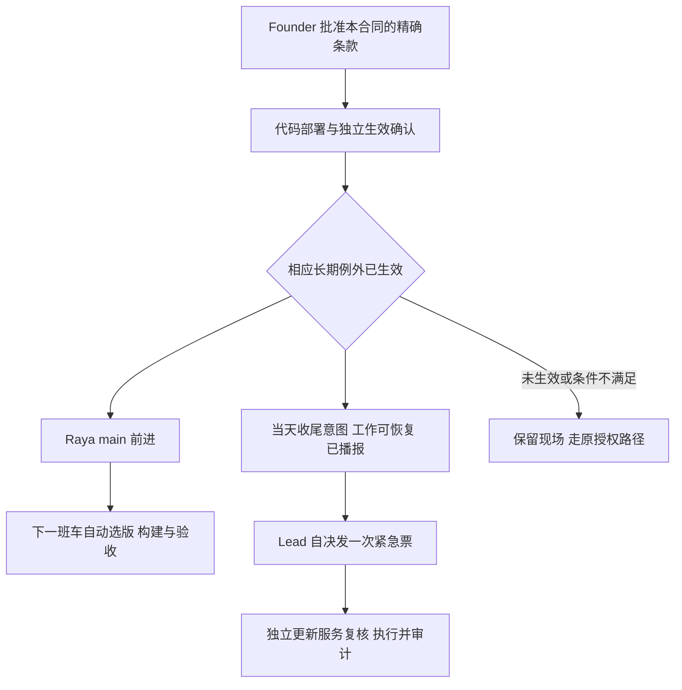

# FLY-2654 两项有前置条件的长期授权 — 实施计划
Issue: FLY-2654 (https://linear.app/geoforge3d/issue/FLY-2654/规则放权-founder-2026-09-16-2249z以后怎么样可以避免我来授权你就自己做决定把raya)
日期: 2026-09-20
基于: research.md、design-correction.md

状态：有效设计复审 APPROVED（round 3，request 99bc9f51-729e-4dd5-8a74-2d5eda7772e9，评审语义提交 6ed0e655d）。候选合同条款与实现计划，未激活、未实施；两条非阻塞建议见 review-standing-final.json。

## 1. 目标、裁定与历史隔离

目标不变：Raya 代码正常审批合入 main，下一班车自动带上；收尾类紧急重启符合前置条件后由 Lead 决定，不再逐次等 founder 授权。合入代码仍走原 founder ship 卡。

最新权威是 Lead 对问题 `5ac555cf-0161-4373-a403-2d7a35238017` 的回复：9-19 两条裁定禁止把条件/将来消息解析为授权；替代应是本合同新增 standing carve-out（长期例外：先一次批准并核实生效，再在明确边界内使用），而非每次再问。不满足条件才回到原授权路径。9-20 第一稿 39143d02d 与其复审请求 da775f5b-44ce-4004-88a3-8fdb32b88f32 因此被替代，其 verdict 不覆盖本计划。

旧 Part B 继续关闭、归档完整保留在 design-history.md，FLY-2679 的迁仓决定不撤销。本计划是这次新裁定下的当前合同修订，不恢复旧 Part B 的实施清单或其批准。保留继承实现 `758823879`、WIP `b554c478e` 血缘及全部 QA 记录；后继在现有实现上改，不从头重做。

AUTH-CANON(A) 不变。两个新条目走 AUTH-CANON(B) 全部激活门；R1 主体、R2、R3、R5 recovery registry 不改。设计批准不等于条目生效；Runner 不得自证激活。

## 2. 系统流程



授权来自已生效的合同条目；原始消息只证明当日意图或重铸容忍范围，不成为逐实例权限。彻底删除现有 future/conditional-accept 权限解释，不能将其改名后继续使用。直接明确的 founder 单次紧急指令仍保留原路径。

## 3. 待实施的精确合同条款

### R1 Raya 段：`raya-carrier-follow-main/v1`

> 在 AUTH-CANON(B) 的 raya-carrier-follow-main/v1 生效后，Engineering Lead 可沿公共 register 入口准备标准载体，独立 updater 沿既有定时班车完成 install、切换和后续更新。范围仅 xrliAnnie/raya 的正常审批合入 origin/main；目标由工具读取 fresh origin/main 并记录完整 SHA，不再要求 founder 逐 SHA 授权行，不解析消息取得切换权限。保留 quiet15m 基线和停机窗口全部人类消息逐条对账；更早历史不要求补录。目标或版本前进不得跳过构建、对账或同 activation 的 v2 上线证据。此条不授予 merge、ship、任意停体、额外身份修复或紧急重启权限。

替换 R1 现存 `FLY-2496 AUTHORIZE register cutover=…` 逐目标 gate，保留 standard Lead 可见终端、v2 receipt、两个项目部署 SHA、同 activation 的 text/summary/Bridge identity/alert/补录证据。`deployed-sha` 仅作已验证回滚锚点。一般 launchd identity repair 仍在原授权边界。

### R4 收尾段：`lead-closeout-restart/v1`

> 在 AUTH-CANON(B) 的 lead-closeout-restart/v1 生效后，承担本次收尾职责的 Engineering Lead 可直接决定提交一次收尾类紧急重启票，前提同时满足：(a) founder 在其权威本地当日明确表达收尾后重启或重启电脑的意图，原消息的频道、消息 id、认证作者和时间可引用，且无后续撤回/冲突；(b) 所有会被打断的在飞体当前头已 push、适用复审/QA 判决已落库且绑定当前头，保存位置和恢复上下文可核验；或 founder 已明确接受这些对象的重铸损失且范围可引用；(c) 发票前在工程频道播报目的、会打断什么与重铸预期并取得消息回执。票和事后 FOLLOWUPS/巡检必须记录三项证据、真实决策 Lead、一次波次及真实结果。任一前提缺失不得使用本例外，可回到原 founder 逐实例授权路径。

> 条件或将来时消息本身不是 AUTH-CANON(A) 授权；满足前提时，授权来源只记本条已激活的 standing carve-out。不需要 founder 再发一条当下无条件确认。此例外不授权操作系统 reboot、任意终结/删除 Runner、跳过复审/QA/ship，运输仍只用 request-restart.sh → 独立 updater；禁止 launchctl submit、手跑 restart-services、新调度器。

R4 的运输仍是定时班车或一张紧急票，紧急票授权可来自 A 或本节已激活的 B；不是第三个运输源。blanket “Lead may not decide”仅对本例外外的重启继续适用。merge/知会/旧票本身仍非授权。

### AUTH-CANON(B) 单一真源

将 `Today that is R3, and only R3` 改为 R3 和本节逐项列出的、完成全部激活门的上述两个条目。它们不享有 R3 grandfathering。顶部例外导语同步，不能出现互相冲突的例外计数。R5 的 recovery registry 保持空；其“R3 唯一”只指该 registry 所属恢复类，在 AUTH-CANON 清单处明确本次两项是 R1/R4 专门领域例外，不是 R5 的新机制。

每条使用唯一 BEGIN/END 标记包住完整规范文字，包含前置条件、范围和运输。提取规则 entry-extraction/v1：UTF-8、LF、无 BOM、每种边界各一次、不可嵌套，取 BEGIN 换行后至 END 首字节前原始字节，不 trim 或规范化。entryDigest 是该字节的 SHA-256；批准头、落地 commit 和实际规则加载证据用同一算法。

## 4. 生效清单、独立确认与版本变化

每个 entry 单独一份 canonical activation manifest（生效清单：把批准、实际执行版本与独立确认连在一起的记录），不能拼六张互不相干的截图或文件。以下为必需形状；schema 不接受额外字段、缺项或混 entry：

| 字段 | 必须绑定的事实 |
|---|---|
| schemaVersion / entryId / entryDigest / extractionVersion | 1、上述两个允许的 id 之一、精确规范字节摘要、entry-extraction/v1 |
| mechanismVersion / scope | 明确版本；固定 repo/project/Lead 权限类别/action/transport，无通配符 |
| revision / status | 单调 revision；pending/active/revoked。示例永远 pending，不能被验证为 active |
| founderApproval | 认证批准回执 id、channel/message/author/time/digest、批准 PR head、精确 entryDigest 与 confirmer 稳定身份 |
| contractLandedCommit | main 中实际落地 commit；提取条款必须与批准摘要一致 |
| enforcementDeployment | 实际已部署执行包的 commit、完整内容摘要、不可变执行根、deployment receipt；绝非待部署目标 SHA |
| verificationReceipt | 同 entry/version/执行包的正反用例、归因核验及来源引用/摘要 |
| liveBundleReceipt | 当前 Lead 稳定身份、backend、实例/turn、真实加载规则摘要、entryDigest、观察时间及来源 |
| independentConfirmation | 非作者/非实现者的独立身份、认证 receipt、确认时间、evidenceBodyDigest |
| revocation | active 为 null；revoked 必填时间/认证撤销来源；不重解释旧批准恢复权限 |

规范 JSON 摘要排除 independentConfirmation 自身，避免循环。确认证据必须由确认者身份的现有认证通道写入权威回执，producer/consumer 独立回读；本地文件/同 UID 权限/哈希/模型文本不能自证签发权。新增 verifier 只支持两个条目，不做通用权限平台。未知状态、撤销、证据混搭、作者自签和后续冲突裁定全部拒绝。

### 不制造新的每 SHA 人工确认

权限机制的部署版本与 Raya 业务目标 SHA 分离。普通 Raya main 前进只更新目标事务，不改变条款或机制版本，不需要 founder 或 confirmer 逐 SHA 再确认。Flywheel 普通更新也不能单凭整仓 commit 变化让长期例外失效。

为解决 updater 自己更新自己的版本窗口，实际行权始终从一份已部署、已独立确认的不可变执行包运行；包至少包含 producer、verifier、updater、restart-services、Raya pass 及全部运行依赖，不从正在快进的 checkout 再 source 新脚本。执行包的清单必须由构建产物生成，记录全部脚本、编译 JS、静态/动态导入及依赖锁定；未在包中的动态执行/加载禁止，不能靠人工漏列依赖后声称相同机制。机制字节未变时复用同一已部署包和 manifest，不把无关 main SHA 改写成新的 enforcementDeployedCommit。

机制确实变化时：正常 ship 门批准后先部署新执行包到独立槽位；独立确认者从真实部署槽位执行验证、确认加载证据并写新 manifest，再原子切换 active package。准备/核验未通过时保留旧已激活包，不把未确认的代码拿来执权。条款改变须重新取得精确条目 founder 批准；仅兼容机制更新通过独立确认流程，无 founder 逐版本授权。不得让旧包跳过自身不兼容的新业务输入或反向激活旧条款。

确认流程接入既有部署/交接事件与独立 Lead 收件处理，自动登记一次、精确 receipt 幂等重查，不新增 cron、launchd 或人工每班车任务。Lead 已在问题 f116e8d1-9a7a-44f4-923a-44c4825297c7 确定独立 confirmer 为 flywheel-cos-lead（Aunt Cass）；该稳定身份必须在本条批准与 manifest 中一致并与 author/implementer 不同。身份指定不等于已经出具生效确认。确认延迟/失败有明确失败事件，不宣称已激活；普通已激活业务更新不会等待该确认。机制更换的上线完成必须包括此自动确认闭环，而不能把缺口留给 founder。

Claude 证据复用 check-rules-truth 对真实进程、argv 和 active receipt 的加载验证。Codex 现有 lead-turn-evidence 只证明 model/effort，不能冒充规则消费；实施必须把 ordered governance fragments 的实际发送/消费绑定当前 thread/turn 与 entryDigest，补相同严格性的 loaded-rule receipt。不能仅有磁盘 AGENTS.md 或配置 backend 就报告支持 Codex。两个 backend 都是验收范围，缺任一不能宣称整体可用。

## 5. Raya 自动目标与旧账本迁移

沿 `raya-migration-init.ts`、`raya-migration-manifest.ts` 与 `scripts/lib/updater-raya-deploy.sh` 的既有迁移/班车链。新增与 founder 历史分支互斥的 standing authority union，绑定 entry/manifest revision；不得把 Lead 决策填成 granted_by=founder，也不生成伪造 canonical_line。

班车读取 repo 固定为 xrliAnnie/raya 的 fresh origin/main，把完整 SHA 固定为本次事务目标。P2 尚未停旧体时可因 main 前进创建目标 revision，并重新构建/核验 quiet15m；不得只改单个 target 字段沿用旧构建证据。停机或窗口对账开始后冻结本轮目标；新 main 留下一轮，不重置 cursor、消息窗口、未决消息或旧运行身份。P7 完成后下一业务更新开新事务。

旧 founder manifest 原位迁移需要已激活新条目、当前 revision/digest CAS、无未决停机副作用，完整保留 legacy owner、activation、基线、cursor 与未决消息；禁止用初始化器重置历史。此前 founder 逐 SHA 行保留为历史，不作新目标批准。已有标准载体不重复 register/install；公共 install 只在迁移步骤要求时发生。

现有 updater 已在成功紧急波次后调用 Raya pass；保留、统一该 pass 与定时班车路径。即使 Flywheel 自身无代码更新，下一正常班车也必须处理 Raya main；不能用 Flywheel SHA 未变提前退出。触发仍只是既有班车/已授权紧急波次，不因 merge 创建或催发票。

## 6. 收尾证据与票据

显式 `--request` 只接受新 v3 closeout 形状；历史 v2（包括 trigger.kind=immediate）停止签发，旧队列 v2 明确记录 retired-conditional-authority 并拒绝，不重解释成 v3、不自动降级 v1。原始旧票与一次使用索引保留审计；已有 started 波次只沿旧恢复职责收尾。这样彻底删除条件消息权限功能，也堵住旧 v2 immediate 的子串匹配旁路。原 bare v1 仍受 AUTH-CANON(A) 的真实单次直接授权约束，不被 standing 前提失败自动调用。

新增严格 closeout request/ticket 形状，schemaVersion=3、kind=lead-closeout-restart；不复用 v2 founder 条件字段充当 authority。schema 中 authority.kind 固定 standing-carve-out，含 entryId/entryDigest、manifest revision/digest；requestedBy 绑定真实 Engineering Lead 与当前实例公开摘要。

| 字段 | 前置证据 |
|---|---|
| intent | founder 原消息 id/channel/author/time/digest，原文中的收尾重启意图，权威时区和当日本地日期；明确标成 precondition-not-authorization |
| scopeSnapshot | 权威运行列表版本与全部将被打断实例：exec/activation、repo/worktree、当前 HEAD、pushed remote head、复审/QA receipt、保存位置、恢复上下文、待处理 wake/活跃写入状态 |
| readiness / waiver | 每个实例均具备本阶段适用的持久化判决且 head 一致；无 QA 适用须有权威阶段状态，不凭 Lead 自说。豁免只覆盖 founder 明确列明的重铸损失范围，不绕过 ship/QA 门或其他前提 |
| announcement | 发票前工程频道真实消息，绑定 decisionId/意图引用/范围/目标，包含目的、会打断什么、恢复预期 |
| target / from / executionPackage | 冻结目标、实际部署起点、已激活执行包 id/digest。三者是不同身份 |
| decisionId / waveId / revision | 持久化唯一请求与一次波次；可重查，不因丢回复自动换号 |

条件 a 是 founder 当日本地日期上的事实前提，不是“等条件完成自动发授权”；来源必须认证回读，未来/条件消息不进入 AUTH-CANON(A) 分类器。Lead 的当次判断记录为 Lead，verifier 核对来源、日期、scope、撤回和证据一致性；模糊/冲突意图不能被模型扩写。到午夜或时区变化导致当日归属不再成立即拒绝，不能回落 24h；24h 仅属于原 A 路径。

### 前提 a 的确定性识别合同（不授予单次权限）

决策职责分开：Lead 可以选择、引用意图消息，但不能自己给 `intentDetected=true`；producer/verifier 对认证回读的完整原文运行以下固定识别器，updater 和 final guard 使用同一机制版本。`intent.kind=closeout-restart-intent/v1` 只是前置事实，必须再结合 active standing manifest 与 b/c 才可能发 v3 票；它永远不能产生 AUTH-CANON(A) 票。

只允许裁掉完整原文首尾空白；不从多句中抽一句、不去掉引号/否定/引用、不让 caller 提供“已清洗原文”，不拼上下文扩写。完整消息仅允许下列正向语法：

```text
INTENT := [DAY] (CLOSEOUT [COMMA] [WE] [PLEASE] [NOW] RESTART [COMPUTER] | REBOOT_COMPUTER) [END]
DAY := 今天 | 今晚
CLOSEOUT := 收尾后 | 收尾完后 | 收尾完成后 | 工作收尾后 | 全部收尾后
COMMA := ， | ,
WE := 我们 | 咱们
PLEASE := 请
NOW := 马上 | 立刻 | 立即
RESTART := 重启 | 紧急重启
COMPUTER := 电脑
REBOOT_COMPUTER := 重启电脑
END := 。 | ！ | !
```

所有符号间允许横向空白（空格/tab），不允许换行、多句、引号、问号、额外对象/从句；必须 full match，不能 substring 或“命中一个关键词”。DAY 缺省仍只在原消息所属的 founder 当日有效，跨日失效，不允许 caller 延长。这里识别的是合同明确允许的“收尾后重启/重启电脑”意图类别；并不声称任意中文语义都可判断。其他正常单次 founder 指令仍属 A，不经此识别器。读不出或不匹配为 `intent-unverified`，条件 a 未证，不建议 founder 写逐 SHA 行；可选择已有的另一条当日、原生表达的匹配消息，不能由模型补写消息。

正例原样锁定：“收尾后重启”“今天收尾后马上重启”“收尾完成后，我们立刻重启电脑。”“重启电脑”。它们必须在 active manifest+b/c 成立时走 Lead 自决，测试断言零额外 founder 确认请求；在 manifest 缺失时即使匹配也不能发票。

反例原样锁定：“先交给班车，然后请重启”“如果你觉得需要就现在重启”“你觉得合适的时候请重启”“等 CI 绿请重启”“Raya 那边稳定下来请重启”“晚点请重启”“等一下请重启”“restart now unless Tadashi objects”“不要收尾后重启”“收尾后重启吗？”“收尾后重启，等我确认”“他说收尾后重启”“昨天收尾后重启”“收尾后重启。先别动”。每个正例前后拼接任一额外条件/否定/保留同意的非空从句均拒绝；无 substring fallback。语法范围扩大须版本化和新设计复审，不能在实现中不断追加猜测规则。

前提 b 还须防止检查后仍有新写入：ready 分支只接受已在既有停驻/交接状态的实例，工作树干净、无在写 turn/未处理 phase wake，恢复上下文已持久化；PID 空闲不算。admission pause 只拦新任务，不冻结已有模型；不能以它替代此判断，更不能为满足前提自行 R2 停体。活跃写入则不走 ready，只有覆盖该损失的有效 waiver 可继续。

幂等键是 entryId + intent channel/message，本次 scope 与 decision revision 被绑定；换 UUID/trigger/repo 不生新权。原子锁/CAS 保存 prepared→started→succeeded/failed/unknown，首次副作用前写 started。只要结果未知或已开始副作用不自动重发；可证明 consumed-no-deploy 的同一 wave 可重新检查 a/b/c 后增加 revision，不能变第二波。

## 7. 最终消费和回滚

producer 先完成 authority+三条件核验与审计再原子发票。updater 从固定执行包 claim，复核后记录 source preMergeHead、clean state、from/target，再快进业务 checkout。停服务前取得本波次 admission owner lease、重新枚举完整受影响集合，并复核激活、原始意图、scope、保存状态、公告、版本、撤销与当日边界；此前任何预检查不替代这一检查。

最终拒绝可能已产生“开始重启”通知及 admission 暂停/恢复，这些是必须记录的残留效果；零服务副作用仅指尚未 stop 服务，不代表没有消息或 intake 变化。

首次停服务前原子写 started；任一不满足，写 consumed-no-deploy 并仅释放本波次 lease。只有能证明仍是本轮干净 HEAD、部署未改变、零服务副作用，才恢复记录的 preMergeHead；dirty/并发变化/结果未知时保留现场报告。已停服务后由旧执行包完成本波次既有恢复，不因新 manifest 缺失把恢复中断；不造新 wave、不回写权限。

条款撤销先拒绝未开始的票，已开始事务仅完成安全恢复；旧 approval 不随回滚重新激活。FOLLOWUPS/巡检同时记录成功、拒绝、失败、unknown，引用真实审计 id，不能只写“脚本退出 0”。恢复结束后真实部署、载体与业务回执才证明上线。

## 8. 本单后续实施阶段的增量任务

以下 activation/verifier、执行包、独立确认自动化和两个 backend 加载证据都是 FLY-2654 本单 Done 前置，不能转为可选后继单。设计节点交接只完成设计阶段；整单 Done 仍必须以可观察的“无需逐次授权”正向结果证明。

| 顺序 | 文件和消费者 | 实施与证据 |
|---|---|---|
| I1 | founder-only-authority.md；本目录 activation schema/pending example；Lead identity 与两个 restart runbook | 只改 R1 Raya/R4/AUTH-CANON 清单与必要导语；两条精确条款摘要；R1 主体/R2/R3/R5 registry diff 不变；遵守 resident rule budget |
| I2 | 新 teamlead/src/bin/standing-authority.ts、同名测试；新受限 activation receipt 路由/确认操作 | 只允许两个条目、非作者确认；混摘要、自签、pending、revoked、假的部署/加载证据先红后绿。认证接入现有 Lead identity/receipt，不收 caller 自称 actor |
| I3 | 执行包构建/安装与 updater 入口；Claude/Codex 规则加载 receipt；独立 confirmer 的部署事件消费 | 新包完整闭包、运行时不能从可变 checkout 导入；未声明动态加载的真实负例；两 backend 实际消费证据；无关 main 更新不触发人工再确认；机制更新独立自动确认闭环 |
| I4 | raya-migration-manifest/init 与 updater-raya-deploy.sh；既有 Raya 测试 | founder/standing 互斥 union；P2 revision 重建、停机后目标冻结、原位账本迁移；下一班车零消息授权 |
| I5 | request-restart.sh、restart-request.ts、update-flywheel.sh、restart-services.sh、scripts/lib/conditional-restart.sh 与对应测试 | 去掉条件消息授权功能，保留直接 A 路径；新增 v3 closeout，三前提与 final guard、幂等、恢复和审计；不把坏 v3 降级 v1/v2 |
| I6 | implementation/validation、里程碑、PR body | 原 QA attempt 1 是两处冲突的路由 FAIL，已含同步历史；核验 WIP 血缘后在实际头继续，不重做。最终头代码复审与 CI、独立 QA 均须新证据 |

本设计体不执行这些代码任务、不 dispatch 后继。实施先读自己的 TURN/注入命令。只跑定向测试；不因本设计重跑本地全量。代码改动先有具体失败反例，再最小实现，再定向绿；必要 lint/build 由后继按变更执行。

最小定向入口：`pnpm --filter flywheel-teamlead exec vitest run src/bin/restart-request.test.ts`，新增 standing-authority 的对应测试；逐个 `bash scripts/__tests__/request-restart.test.sh`、`update-flywheel-sources.test.sh`、`conditional-restart.test.sh`、`updater-trigger-policy.test.sh`、`raya-prestop.test.sh`、`updater-raya-deploy.test.sh`；规则 receipt/budget 测试；涉及现有 guard fixture 时补 ci-structure、path-hygiene、child-process census 和 packaged allowlist 定向入口，避免把零匹配测试当通过。禁止修改测试门来把缺失证据当通过。

## 9. 验收矩阵：每一项都是交付门

| 场景 | 必须观察到 |
|---|---|
| 两条合同激活 | founder 精确 entry 批准、落地 commit、真实部署包、相同 entry 运行加载、非作者独立确认在同一 manifest；pending/混搭/自签必拒 |
| Raya A 合入后 B 再合入 | 下一班车 fresh main B、真实部署与 v2 同 activation 业务回执；零逐 SHA 授权消息；Flywheel 无变更仍处理 |
| Raya main 在停机前/后前进 | 前：新 revision 重建证据；后：冻结本波目标，不丢窗口人类消息，下一班车追新头 |
| 收尾 a/b/c 满足 | Lead 直接发票→updater→真实结果；不新增当下确认请求，authority 明确为 standing，审计保留三项与 actor |
| 前提 a 完整原文识别 | 上述四条正例结合 active+b/c 自动执行且零额外确认；十四条反例和前后拼接性质例全部拒绝；语法匹配本身不能替代 active 权限 |
| 任一条件不满足/意图撤回/跨日 | 不发票或停服务前拒绝，原因可见；不把条件文本解析为单次授权；允许回原授权路径 |
| 旧 v2 immediate/条件票迁移 | 旧 v2 一律拒绝且不降级；旧 started 只恢复，不新增授权或 wave；历史审计索引保留 |
| 并发/丢回复/重复 intent | 同一 intent 最多一波，查原 decision，started/unknown 不重发；负例改 UUID/trigger/repo 仍不能绕过 |
| scope 前进/新 wake/活跃编辑 | ready 路径拒绝，不能靠 admission lease 或 PID 证明可恢复；waiver 必须精确覆盖损失范围 |
| 执行包版本变化 | 未确认包不可执权；在途只跑旧已确认包；实际尝试加载包外脚本必拒；业务 SHA 前进不撤掉 standing |
| Claude 与 Codex | 各自真实下一实例/turn 证明加载相同 entry；仅磁盘文件/model-effort/启动环境为反例 |
| final guard 失败及真正停机后恢复 | 零副作用可证才恢复本轮 checkout；dirty/未知保留现场；已停机安全恢复不中断、不造第二波 |
| 运输与其他权限 | merge 不发票，不新增调度器；R2/R5/ship 不被放开；直接 founder A 路径兼容 |

真实验收由后继取得其运行权限完成。当前没有生产发票、restart、deploy 或 activation；本页与计划通过也不代表上述验收已发生。

## 非阻塞评审建议的有界处置

R2 的 LOW `i5-omits-final-guard-lib` 已在 I5 补具体文件。MEDIUM 保留为本单实施时必须明确的验收细化，不让设计节点借机实现或改旧代码：

- `withdrawal-scope-claim-overstated`：不能声称仅扫一个 Discord channel 就覆盖撤回。运行时须沿 founder 的项目统一入站账本覆盖工程频道及关联 issue thread 的原消息后续窗口，从 intent 消息起到最终检查的 durable cursor；已知该项目绑定的 DM/其他频道也纳入。不具备完整投递/摄取水位或 gap 未补齐则 `withdrawal-context-incomplete`，不能通过。为避免有限否定词误判，窗口内任何未被权威机制明确处理的 founder 新消息都使本次快照失效，重新读取后重新建立当前决策；不能静默假定无关。具体接入账本与 cursor adapter 由 I2/I5 与现有 mailbox consumer 对齐，必须有跨频道撤回/只重启 Bridge 的反例与允许无关消息后可继续的证据。
- `scope-snapshot-ledger-unnamed`：主列表取 StateStore 的 session/workflow run + activation/phase/park 权威状态；并集交叉核对 CommDB sessions、当前 TURN/phase wakes 与 restart-services 的实际目标进程/服务清单。CommDB `running` 不表示未 park，不能用单一 status 值决定 ready。任何未知活进程、ledger 只出现一侧的在飞体或版本不一致均列为 unresolved，ready 不通过。实际状态字段/版本需由 I5 在当前基线逐个绑定，不能把 PID 不存在当可恢复。独立 QA 必测 parked-but-running、未登记进程和新 phase wake。
- `execution-package-churn-cost`：选择保留完整执行包来防止 checker 外的脚本中途替换执权，接受其较宽的更新范围。reviewer 当前采样 restart-services 90 天 59 commits（约每周两次）只作为成本估计，实际每次部署按包内容变化合并一次确认。Aunt Cass 的自动部署事件消费承担确认，工程 Lead 处理失败；正常 founder 每次确认次数必须为 0。把队列延迟和失败审计纳入 I3，不以增加 founder 工单解决确认积压。
- `v1-bypass-after-closeout-rejection`：这是继承的 A 路径边界，不能称已有机器权限证明。I5 必须记录 v3 拒绝审计并对随后 30 分钟同 fleet 的每张 bare v1 票标记 `possible-closeout-fallback`，关联拒绝 decision 与实际单次授权引用（缺失即异常），记入 FOLLOWUPS。该审计不授予 v1 权限；不得自动生成/调用 v1。负例：v3 被拒后直接裸调用必须有可见关联告警；正例：真正另获单次授权也记录关联，不误贴成 standing。

上述 MEDIUM 建议仍完整保存在 review-standing-round2.json；不宣称尚未实现的水位、确认或审计已经可用。

## 10. 取舍

拒绝“解析未来消息为权限”，因为多轮复审已复现条件/推迟/保留同意绕过；也拒绝“每次再问”的替代，因为它没有完成 founder 目标。选择范围固定的两项 standing 条款，代价是一次精确批准与独立生效核验、可复核的真实执行版本。独立确认自动化和执行包固定是避免把一次放权变成每次部署又等人的必要部分，不能删掉后声称同等完成。

不建通用授权平台、不重开旧 Part B、不修改迁仓方向、不借上线验收扩权。任何不能证明的前置条件只拒绝当次例外；不可缩小整体交付为“安全拒绝一切”，也不可把尚未实现的 activation/加载证据写成已有能力。

## R3 APPROVED 后的 Lead advisory 裁定（不新增语义分支）

问题 06e3801f-923c-43c1-8f0b-e2df9c047755 的回复：裸“重启电脑”仅满足前提 a 的意图事实，仍必须满足 active standing 和 b/c 才允许 Lead 自决，不另做分支。实现/QA 必须用 #engineer 近 30 天含“重启”的 founder 真实原话做一次离线回放，命中、漏判与拒绝分布写入 QA 报告；不达标不宣称“不再逐次授权”目标达成。不是用模型造四条正例替代真实可用验收；不自行扩张文法。
