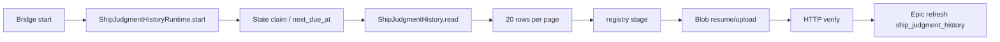

# FLY-2661 机器试判历史按需生成 — 调研
Issue: FLY-2661 (https://linear.app/geoforge3d/issue/FLY-2661/报告托管省量-机器试判历史页停止定时托管发布改为按需手动生成worker-每-30-分钟-24-页全量重发把-vercel-blob)
日期: 2026-09-16
基于: exploration.md

## 当前数据流

- `packages/teamlead/src/bridge/plugin.ts` 是唯一生产接线点：构造 runtime，并在启动/关闭时调用 `start()`/`stop()`。
- `packages/teamlead/src/ship-judgment/history-runtime.ts` 每 60 秒 tick，启动时立即执行；`history-state.ts` 把 `INTERVAL` 固定为 1,800,000ms。
- `history-publisher.ts` 负责 registry token、Blob 恢复上传、registry commit 和公网 GET 内容校验。
- `ShipJudgmentHistory.read(asOf)` 是同步只读查询，返回近 30 天、最多 10,000 行，并已对行 schema、Unicode、Discord URL、审计 ID 做校验。
- Epic materialize 读取 `readEpicHistory`；HTML 目前把 `published_url` 渲染为“查看近 30 天历史”，Markdown 仍保留最多 20 行的本地预览。

## 按需路径选择

CLI 不直接打开 `teamlead.db`。现有 `ship-judgment report/show` 已确立模式：master token + loopback Bridge GET + 严格响应验证，避免 CLI 自己迁移或锁数据库。新增 history render 路由沿用该模式：服务端读快照并渲染，客户端只做有界下载和本地原子写。

单文件优于本地多文件分页：命令只要求一个 `--out`，没有相对链接丢失问题，也不会产生托管 token。10,000 行上限和单行 2KiB 上限给出有限输出；CLI 再设置 32MiB 响应上限。

## 迁移路径

旧条目可能经过两条搬运路径：

- `migrateReportHosting()`：从旧本地 registry 上传到 Blob 后切换 gateway。
- `retargetReportHosting()`：通过 `ReportRegistry.retainedSnapshot()` 把现有托管集合搬到新 store。

因此跳过判定必须由两条路径共享。安全的窄判定是：`title` 缺失/空白，并且 hardened HTML 含稳定的 `<title>机器试判历史</title>`。它能命中自动 runtime 创建的页面（publisher 明确传 `title=undefined`），而不会使其它合法无标题报告在账号轮换时丢失。

## 风险与守卫

- route 必须只在现有 master-token middleware 后挂载；Gemini scoped token 不新增权限。
- query 只接受唯一的 `project=flywheel`，额外参数返回 400。
- CLI 必须拒绝重复/未知选项、非 `.html` 输出、非 loopback URL、缺 token、非 HTML/超限响应；失败不能留下半文件。
- HTML 内所有数据库文本继续使用现有转义和逐行预算；手动文档不包含 Vercel origin 或分页 URL。
- 迁移跳过判定要在 manifest、上传、摘要中一致，否则 retarget 的 CAS 会永久重试。
- 删除 history 自动发布接线后，`next_due_at`、旧 published URL 和 building manifest 都只剩历史数据，不触发写入；不做数据库清理或生产 mutation。

## 验证范围

聚焦测试覆盖：渲染器、Bridge auth/read-only 路由、CLI 原子写与失败清理、plugin 零接线、Epic 说明文字、初始迁移与 retarget 跳过。随后运行 lint、全仓 build、package gate 和新增/受影响脚本测试；最终结果仍以 exact-head CI 与结构化 code review 为准。
