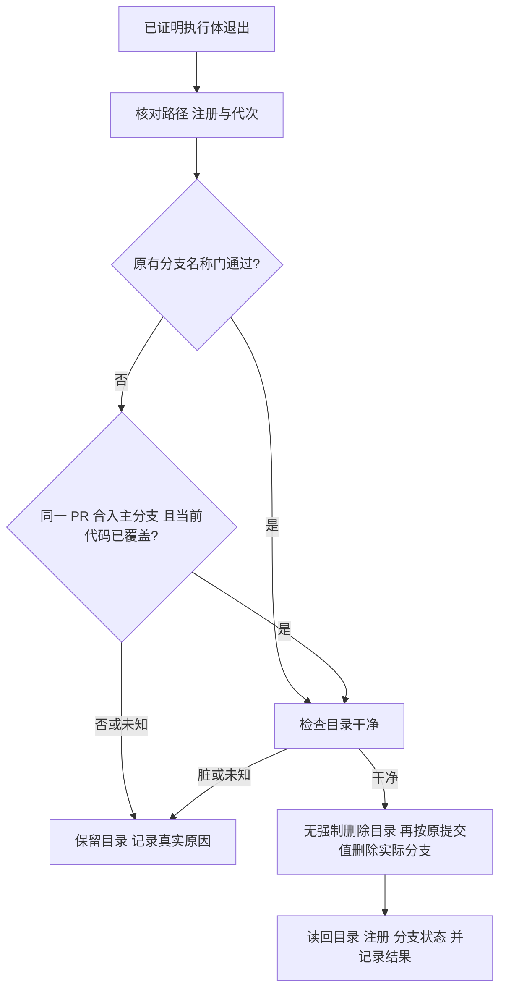

# FLY-2664 已合入分支安全清理 — 实施计划
Issue: FLY-2664 (https://linear.app/geoforge3d/issue/FLY-2664/land收尾-worktree-清理在注册分支-项目派生分支名时一律-skippedbranch-mismatchrunner-自起)
日期: 2026-09-17
基于: 无

状态：R1 有效 reviewVerdict=APPROVED（2026-09-17，request 96fb4c28-4e69-4212-ae8d-daddd5f17e0a）。8 条 MEDIUM/LOW 非阻断建议的后续实施处置见 §11；不声称这些处置已经实现。本任务为 plan_only；探索和调研合并在本文。设计阶段不实现、不清理生产目录、不申请 ship，不把测试计划当已通过证据。

## 1. 给 founder 的结论
当一个独立工作目录中的代码已经合入 main（项目主分支），系统应核实代码和目录身份后真正删除目录及其实际分支。分支叫 docs/… 或 feat/… 不应成为永久泄漏原因。工作目录的代次是创建时写下的唯一编号，用来防止同一路径重建后误删新目录。

本设计补齐三处：用可信合入记录核实自起分支；在 Runner 提交 PR 完成结果时更新同一工作目录的分支绑定；把收尾失败显示为真正原因。另交付一次性只读盘点工具，供 FLY-2628 使用。问题给出的 FLY-2601/#1232、28 个/33.7 GiB 是事故输入，本节点未重新测量生产盘量。



选择“既有安全门 + 有合入证据的分支名称例外”。拒绝删除全部 branch guard（会误删复用目录）；拒绝只修绑定表（旧 immutable land target 和失败刷新仍泄漏）；拒绝禁止 Runner 自起分支（改变正常工作流且不修存量）。merge（合入）与部署继续分离，独立 updater 才部署。

## 2. 当前证据与消费者审计
基线 HEAD：`06cbb3615`。以下均来自当前工作树读取。

| 文件/位置 | 已验证行为 | 设计处置 |
|---|---|---|
| `packages/teamlead/src/bridge/worktree-cleanup.ts:435-515` | expectedBranch、operationTarget.branch、binding.branch 三种名称检查；marker 仅 branchMatch 后读取 | 将名称判定与路径/代次判定拆开，只允许名称例外 |
| 同文件 :525-620 | clean unknown 拒绝；remove 传 branch=null；真实分支通过 CAS 删除 | 复用，补前后读回、结构化结果及恢复收据 |
| `packages/edge-worker/src/WorktreeManager.ts:1718-1808` | 按实际注册路径查询；无 force remove；内部先 reap；可选 branch 参数会走 branch -D | 本路径始终传 null，不走 branch -D，不改其他清理层 |
| `packages/teamlead/src/bridge/branch-cleanup.ts:118` | occupancy + ref 当前值 + update-ref -d old SHA | 复用精确值比较删除，不引入第二套删除器 |
| `packages/teamlead/src/bridge/land-executor.ts:2617,3022` | merge_confirmed 仅 headSha/mergeSha；inspectPr 未取 baseRefName | 不能由 MERGED 推断 main；补可信目标仓库及 main 证据 |
| `packages/teamlead/src/bridge/land-finalization-context.ts:23` | 从 durable operation/context 准备 finalization | 将可信证明在 Bridge 内传入，不信 Runner payload |
| `packages/teamlead/src/bridge/post-ship-finalization.ts:576,1238,1325,1735` | 所有 immutable targets 收尾；absent 通过；attestation 驱动远端清理；失败统一 branch mismatch | 接线所有 target，保留 absent，准确映射原因 |
| `packages/teamlead/src/StateStore.ts:25574,56954` | bindWorktreeOnce 是 set-once；commitEnrolledCompletion 原子验证身份/完成结果 | 创建路径保持 set-once，新增窄范围 branch-only CAS（比较旧值再写入） |
| `packages/teamlead/src/bridge/event-route.ts:1465,1783` | trusted PR authority/head 已解析后进入完成事务；可能是 nested repo | 只观察绑定工作目录本身，不能拿嵌套仓库的分支更新外层绑定 |
| `packages/teamlead/src/bridge/land-intent-targets.ts:333-443` | 收集所有 phase 绑定且预先拒绝名称不一致，以 path/branch/generation 去重 | 处理共享 phase cohort；否则只修 PR 作者仍进不了 land |
| `packages/teamlead/src/patrol-continuity-collector.ts:192,294,349` | 用 binding branch 做 continuity/其他 writer 诊断 | 接受刷新后的实际 branch；回归同代共享目录，不改其 admission |
| `packages/teamlead/src/bridge/land-closeout-cause.ts:1,32,106` | enum、模糊 substring 分类、中文文案 | 一处 typed 映射替代广义 branch/worktree 命中 |
| `packages/teamlead/src/bridge/plugin.ts:2640,7707,7896,10884` | 多个 cleanup composition sites，有无锁调用并存 | 新证明例外只在锁和可信 authority 完备时启用；旧调用缺证明保持原行为 |

Git 原始文档：[`merge-base --is-ancestor`](https://git-scm.com/docs/git-merge-base) 的 0 是已包含、1 是未包含、其它是探针错误；[`update-ref`](https://git-scm.com/docs/git-update-ref) 支持 old-value 比较删除；[`worktree remove`](https://git-scm.com/docs/git-worktree) 无 force 保留脏/锁保护。Squash 合入可能不保留 PR head 的祖先关系，必须支持“当前头精确等于已合入 PR head”的单独成功分支。

Lead 于 2026-09-17 回复问题 `f1b78d0c-622e-4351-96b1-69c3fd221f48`，并经 `33d0de07-d4b1-433c-92fe-94d02735581a` 明确确认：exact-head 和可信同仓 main 祖先两路均保留；两路都要证明没有未合入/未推送代码，可信 main、干净目录为共同前提。exact-head 使用已合入 PR 的服务器 head 证明该提交已推送；祖先路径使用可信 origin/main 证明已推送。不能以本地 upstream/ahead=0 代替。存量只读盘点获确认。

## 3. 身份、合入证明与数据结构
仅服务器构造，HTTP/CLI 不接收调用者自报 `merged:true` 或 proof JSON。新增 `packages/teamlead/src/bridge/merged-worktree-proof.ts`，输出内部只读判定：

```ts
type MergedWorktreeProof = {
  operationId: string; operationGeneration: number;
  projectName: string; issueId: string; runId: string | null;
  repoIdentity: string; projectRoot: string; prNumber: number;
  baseRefName: 'main'; mergedPrHead: string; mergeSha: string;
  mergeReceiptId: string; observedAt: string;
};
type BranchCoverage =
  | { ok: true; via: 'exact_pr_head' | 'ancestor_of_main'; mainSha?: string }
  | { ok: false; detail: 'merge_proof_missing' | 'merge_proof_invalid' |
      'head_not_merged' | 'merge_probe_unknown' | 'protected_branch' };
```

1. 以 `operationId + project/issue/run + prNumber + approved_head` 读取 durable `merge_confirmed`，并核对 owner/generation/lease 和现有 effect fence。验证完整 SHA、PR 号、repo identity、base=main、mergeSha 非空。`mergedPrHead` 必须等于该 operation 当前批准头，历史不同 head receipt 不能挪用。
2. `LandPrState` 与 `GhLandMergeDriver.inspectPr` 增加 baseRefName；通过项目 registry 指定并验证仓库，`gh pr view --repo <trusted-owner/repo>`，不以 worktree git config 或分支名推断仓库。registry.projectRepo 合法时显式使用 --repo；缺失或不合法时普通 inspectPr 保留既有 cwd 兼容行为，但不能产出 trusted repo/main cleanup proof，新例外返回 merge_proof_missing 并提示配置缺失，不让整个 land 热路径抛新异常。将已核实 repo identity/baseRefName 和现有 headSha/mergeSha 同写新 merge_confirmed receipt；未核实字段不写为可信。保留原 receipt reader 对旧格式的兼容。
3. 旧 receipt 不修改、不制造 merge 成功：Bridge 在同一 project/PR 重新只读查询；结果必须 MERGED、base main、head 等于已存 receipt 和 operation.approved_head、merge SHA 匹配（旧字段缺失可由本次可信查询补足）；写 `aux:closeout_audit` 补充证明，记录原 receipt 引用。查询失败/身份不符拒绝新例外，不能凭任意非空 mergeSha 放行。迁移无需批量改 DB。
4. 精确头路径：`reg.head === mergedPrHead`，包括 squash/rebase merge，不额外强迫它是 main 的祖先。合入证明已证明它属于 main 的合入 PR。
5. 祖先路径：当前头不同，必须先从可信同一 repo 获取 main 的具体 SHA；按可信 remote 精确 fetch main（实现中固定 refspec/args，不能 checkout/pull/reset主仓），核对取回值并对捕获的 SHA 执行 `git merge-base --is-ancestor <reg.head> <mainSha>`。0 才放行，1 拒绝，其它/缺对象/网络失败是 unknown；不使用可能任意移动或陈旧的本地 `main` 当外部合入证据。精确头路径不需要此 fetch。
6. 每个 target 单独核对 projectRoot 与 proof.repoIdentity；多仓 PR 不能套用另一仓证明。非主仓 target 没有对应已核验合入证明时保留原路径/拒绝例外，不扩大本单为多仓 land 协议。

补充 attestation 字段：`verificationMode?: 'derived_branch' | 'merged_branch_verified'`、`mergeProof?`（上述证明+coverage）、`branchDeleteReason?`、`failure?: { token: WorktreeFailure; detail?: string }`。`bindingVerified` 继续只表示历史四方 path/branch/generation 真正一致，旧绑定分支不同的 fallback 必须 false；不能用它诱导远端删分支。为防止刷新绑定间接扩大 remote CAS eligibility，在 `bridge/branch-cleanup.ts` 的 remote closure 最前增加 `att.verificationMode === "merged_branch_verified"` → `remote_delete_skipped:merged_proof_local_only`，即使 bindingVerified=true 且名字符合 managed shape 也拒绝。这里不放宽远端资格；旧无mode attestation继续原门。

## 4. 删除判定与不可弱化的门
在既有 issue lifecycle mutex → repo mutation lock 内执行；没有锁的旧测试 seam 可以走旧路径，但新例外 fail-closed。所有 async 探针返回后、remove 和 CAS 前重新核对现有 land effect authority，旧 owner 不可借长探针继续删除。

判定顺序：
1. 执行体已证明退出、closeout 已允许、无新 activation/出生风险；保持 FLY-2616 前提。
2. 保持当前 root/parent dev+ino、symlink、canonical path、project key、operation snapshot digest 检查。现存叶子必须是真实注册工作目录且非主仓，branch 非空、非 detached。保留 locked 的拒删行为。
3. **先恢复，后 absent**：在当前两处 ENOENT 早退（worktree-cleanup.ts:322、:430）之前查找本operation目标的 proof-gated prepared/removed receipt。有未完成本地 ref 子步骤则先执行下面的恢复分支，不能直接返回 absent-complete；没有这种收据时 **absent 分支原样保留**：只有已有 FLY-2616 的父身份及 ENOENT 证据才返回 absent；不凭注册缺失判 absent，不因 absent 新增分支删除。
4. 现存目录：读取 marker 不再依赖 branchMatch。新例外要求 binding/immutable target 存在，注册路径等于该绑定路径，generation 非空且相等；缺绑定、路径或代次不一致一律拒绝。只差 branch 字段不算身份复用。
5. `legacyNamesMatch = reg.branch === expectedBranch && (!target || target.branch === reg.branch) && (!binding || binding.branch === reg.branch)`。该布尔成立保持原 gate；否则必须 §3 证明通过，且禁止 main、HEAD、配置的保护分支；本地删除对 `isManagedBranchShape` 作本单明确例外：同路径/代次且被 merged proof 覆盖的实际分支视为此目标的受管本地 ref，故 docs/feat 名称可删除；绝不全局修改 managed-shape 函数或远端策略。分支名须通过 `git check-ref-format --branch`，所有 Git 使用 execFile 参数数组，禁止 shell 拼接。
6. `git status --porcelain` 干净才继续（含 tracked/untracked）；unknown 拒绝。紧邻 remove 前重新读取注册路径/branch/head、marker、clean 与 authority；与捕获值不同拒绝，避免探针 await 期间的变化。保留 reap-first 和无 force 的最终脏检查。
7. 在破坏性操作前记录 durable intent，含 operation/target digest、path、generation、actualBranch、headSha、proof、既有 bindingVerified。审计必须成功再 remove。成功审计 reason=`merged_branch_verified`，包括 `registeredBranch expectedBranch mergeSha`，另保存 mergedPrHead、coverage、mainSha（如用）、observedAt。
8. 调用 `removeCleanWorktreeByPath(root, registeredPath, null)`，实际删除之后读回：`lstat` 为 ENOENT 且 `git worktree list --porcelain` 无该 path；读取失败不能叫 removed。用既有 `casDeleteLocalBranch({branch: reg.branch, expectedSha: capturedHead})` 删除**实际分支**，不删除 derived expectedBranch，不用 `branch -D` 或 rm -rf。ref 验证不存在，成功才 branchDeleted=true。

### 崩溃和分支删除失败
真实目录移除与本地 ref 删除不是原子事务。目录成功但 CAS 拒绝时保留 `cleanupState=removed, branchDeleted=false` 的事实，并记录 branchDeleteReason；本次 **新例外** 的最终 closeout 返回 partial/remove_failed，不能声称“目录与分支均 cleaned”。旧模式的历史 branch best-effort 语义不改变。这个硬后置仅约束新增真删路径：目标明确要求目录和实际分支都删除，因此不能把ref失败静默变成complete。显式在 `land-retry-policy.ts` 将 `issue_closeout_incomplete:cause=worktree_remove_failed` 分类为 retryable（复用现有8级有界退避），耗尽则held+既有幂等Lead升级，禁止无限waiting；CAS永久移动由Lead通过既有正门处理，自动重试不得追随新头。告警必须携带 directoryRemoved=true、branchDeleted=false、branchDeleteReason，准确说明“目录已回收，仅分支残留”，不谎称进程仍活着或目录仍占空间。补该分类/第九次held/单次通知测试；这是明确选择的可见安全停点，并非无意副作用。

新增可重放的目标级 `aux:closeout_audit` prepared/removed/branch_deleted 记录，键由 operationId、target digest、generation、capturedBranch/head 确定。下一轮使用当前 claim 的 authority fence 核验；prepared收据的旧 operation generation只是历史证据，不要求续租后current claim generation等于旧值，必须operation及冻结target/目录代次一致。下一轮只有存在本次 proof-gated prepared 收据且 root/path/generation attribution 仍匹配、path absent且未重新注册，才继续同一 captured ref 的 occupancy + CAS；ref已缺失视该步骤完成，ref已移动绝不删除/继续 partial。对只有 prepared 的崩溃 gap，重新验证该 path 已不存在、原注册不存在、相同 operation 权限和合入证明后才能恢复 ref 子步骤；不能从普通 absent 推导此权限。重建路径、新代次、新 owner失权、保护分支均拒绝。审计失败保持 partial；重复成功不重复副作用。此恢复不重写 target snapshot，不让 session 缺行阻断已有 operation 收据路径。

## 5. 绑定刷新与 intent-time 兼容
选取“完成提交 PR 时”作为收敛边界，不加全局 git hook，不拦截每次 checkout；用户要求的两个时点择其一。创建仍走 `bindWorktreeOnce`。新增 Bridge 内部观察函数 `observeCompletionWorktreeBranch`（新文件 `bridge/worktree-binding-refresh.ts`），只在已核验 root-repo PR/head completion 上运行。

在 event-route 注入 narrow withRepoLock seam，按现有锁顺序在完成原子提交前完成观察并持锁至分支 CAS；若 completion 外层已有锁则用既有可重入锁，不引入逆序 issue lock。观察必须：当前 exec/activation/TURN 与工作目录 owner 匹配；/events 的 fleet ingest bearer 与 event.source 不提供 per-exec authority，必须通过现有 activation/current-writer/drain/route 验证；用 canonical binding path 查实际 registry/common git dir；generation marker 等于既有 binding；registered head 等于已核验 root PR head；正常非保护分支。nested repo PR 不刷新外层绑定。未知/缺绑定/过期 generation 不补造 marker，不增代次，不重写 baseline。

`commitEnrolledCompletion` 接收服务器内部 `worktreeBranchObservation`，不从 completionSubmission 反序列化；仅在所有 activation/writer/head/drain/CAS 校验通过、既有完成写入事务内应用。返回旧 completion receipt 的重放不再刷新。新增 branch-only CAS helper：参数包含 source execution/activation、run/project/issue、canonical path、generation、原 cohort 各 exec/oldBranch 及新 branch、observedHead。参数化 SQL WHERE 精确比较每个旧值；全 cohort 成功或全回滚，path/generation/locked_at/baseline 保持不变。

cohort 是同一 project/issue/run 且属于 authoritative run attribution 集合、同 canonical path/同 generation 的所有共享 phase rows，包括 parked design/QA；不得按路径跨 issue 或 generation 广播。发生 CAS race 时只跳过刷新并审计，不将本来合法 completion 变成失败；后续 fallback 仍可工作。事务内先比较全部 expected rows 后再写，不能更新一半。legacy 非 enrolled complete 用已认证 source session 和相同单次事务 helper，范围仅当前 exec（无可信 run 不扩大），接在既有 accepted complete PR branch，拒绝事件无写入。

**不能漏掉 pre-merge land intake**：`prepareLandIntentTargets` 现在要求所有绑定名称相等。cohort 刷新覆盖正常新路径；刷新失败或旧 phase rows 时，允许 snapshot builder 在 repo lock 内用同路径/代次且非 detached 的 live registration，并且 `registered.head` 精确等于本次已认证/批准 PR submission head，记录实际 branch 为新 target.branch、审计原 bindingBranch。只能在该 target repo 与 PR target repo 同一时用这个观察；未知/头不同照旧拒绝。用 gate-entry exact PR binding 的 producer、repo、targetRepoPath、generation 交叉核对 approvedHead 的 root provenance；snapshot 观察与持久化之间保留 repo lock 或提交前重新验证相同观察，避免当前 :452 释放锁到 :479 persist 的间隙。snapshot key 按 canonical path + **observed actual branch** + generation 去重，sourceExecutionIds 排序聚合。这里仅绑定要收尾的对象，不批准删除，删除仍等合入和 §4 全部门。

已冻结 `closeout_targets_json/digest/version=1` **绝不改写**；旧 target.branch 是 derived 时由 §4 merged proof 覆盖名称差异。新 snapshot 仍用现有 v1 字段，无新 schema 表。审计列出旧/新 branch、source exec、activation、generation、observed head 和 completion receipt。消费者回归还包括 `DirectEventSink.ts:595-609` 的 already_bound 比对：同path/generation、原创建分支的worktree_ready重放，只有可核验的accepted branch-refresh audit连接旧/新branch时才作为幂等已刷新处理，不写假的binding_rejected；任意新branch和真实path/gen冲突仍拒绝。消费者回归还包括 `bridge/canceled-pr-close.ts:154` 的 PR-close 精确头/代次保护、`bridge/lifecycle-sweep.ts:910` 的 ownership、`bridge/lifecycle-routes.ts:155` 的 snapshot hash：branch 更新使旧 dry-run/apply hash 正常失效，不能保留旧授权。binding 分支可刷新这项约定需同步 StateStore set-once 注释，避免后续误用；path/generation 仍 immutable。

## 6. 真实原因和对外兼容
新增唯一 `WorktreeFailure` 枚举及明确映射函数放 `land-closeout-cause.ts`，cleanup 使用 type-only import 或提取同文件无循环类型；不做自由字符串搜索。

| cleanup failure.token | LandCloseoutCause token | 文案 |
|---|---|---|
| branch_mismatch | worktree_branch_mismatch | 当前分支未能证明已合入主分支 |
| not_registered | worktree_not_registered | 目录存在，但 Git 没有对应工作目录登记 |
| dirty | worktree_dirty | 工作目录有未提交或未跟踪文件，已保留 |
| clean_unknown | worktree_clean_unknown | 无法确认工作目录是否干净，已保留 |
| binding_mismatch | worktree_binding_mismatch | 工作目录路径或创建代次与绑定不一致 |
| remove_failed | worktree_remove_failed | 目录或本地分支删除未完成，详情见审计 |
| unknown | worktree_unknown | 缺少清理结论，已保留 |

原 `skippedReason` 仍可供旧消费者读，`remove_failed:<detail>` 映射只读固定前缀，detail 单独保存且不进入 token。其它 scope/authority/probe 失败不得冒充 branch mismatch：保留现有专用生命周期 cause，未分类的 worktree 原因用 worktree_unknown+原始 detail。去掉 inferLandCloseoutCause 中泛 `branch/worktree` 匹配，历史 durable `cause=worktree_branch_mismatch` 继续能解析且展示历史兼容文案，新增结果走 typed 映射。多 targets 保留本轮已产生的 attestations，以稳定 target 顺序第一条失败为主原因；保留现有首失败早退，未尝试目标不声称已观察，也不扩展成遍历全部目标；不能被 archive_failed 掩盖。

同步所有 `describeLandCloseoutCause`、land reason parser、StateStore retry/notification、thread 文案及 tests；token 为机器字段保持英文，显示中文。HTML 派生文字全部 escape，运行时仅 textContent/value，不插 innerHTML。

## 7. 一次性只读盘点（实施交付）
新增 `scripts/audit-merged-worktrees.mjs`，显式参数 `--project flywheel --repo <canonical-root> --state-snapshot <managed-snapshot> --format json`；无 --apply/--delete/--fix 模式。文件存在、项目/仓库身份核对失败退出非零。DB 只读打开并关闭，活 DB 只能先经现有 `scripts/flywheel-snapshot-control.mjs runner` 生成受管一致快照（≤2GB）；禁止 cp live DB。

以 Git 注册列表 ∪ 受限 repo sibling 前缀目录 ∪ durable target paths 为候选，按 exact project/issue/PR/target identities 联接 operation merge receipts；对无 DB 合入记录但有精确可信 PR 绑定的候选只读 `gh --repo` 查询 MERGED/main。不能通过 Linear Done、目录含 issue 字符串或文件名就称 merged。无法证明的单列 unknown，缺失 PR/session/receipt 不丢失候选。

输出：issue、PR、operationId、repo、canonical path、pathExists、registered、registeredBranch、expectedBranch、bindingBranch、generationMatch、observedHead、mergedPrHead、mergeSha、mainSha/coverage（本地对象可证才记录；此工具不 fetch）、clean、active/locked/unknown、blockingReasons、observedAt、snapshot digest；可选 du 统计字节必须记录错误为 unknown。分类仅“已证实合入残留/未合入/无法确认/目录已缺失”，不输出可执行删除脚本，不自动清扫。扫描 git status 设置 GIT_OPTIONAL_LOCKS=0，不 prune/fetch/update-ref/写审计 DB。2628 负责另行审核和清理授权。

盘点使用示例（修复实施后可用，当前不是已执行记录）：
```sh
node scripts/audit-merged-worktrees.mjs --project flywheel --repo /Users/xiaorongli/Dev/flywheel --state-snapshot /tmp/flywheel-snapshots/EXEC_ID/teamlead.db --format json
```
其中 snapshot 路径必须替换为受管 helper 实际返回路径，不直接传生产 DB。命令本身始终 dry-run。示例输出为形状，非生产实测：
```json
{"mode":"read_only","project":"flywheel","candidates":[{"issue":"FLY-2601","pr":1232,"path":"/Users/xiaorongli/Dev/flywheel-FLY-2601","pathExists":true,"registered":true,"registeredBranch":"docs/FLY-2601-founder-page-copy-block-placement","expectedBranch":"flywheel-FLY-2601","bindingBranch":"flywheel-FLY-2601","generationMatch":true,"classification":"merged_residue","coverage":"exact_pr_head","clean":true,"blockingReasons":[],"deletionPerformed":false}],"unknownCandidates":[],"fixtureExample":true}
```
实际输出按上述字段合同补齐完整 SHA、身份和时间；字段取不到必须 null/unknown+原因，不伪造。Lead 后续使用现有 `flywheel-comm land reclose --operation <full-id> --expected-generation <n> --expected-head <sha> --reason <text>` 正门恢复已合入 operation，由其现有权限与状态校验裁决；该动作不是本单盘点脚本的一部分，本设计节点不执行。

## 8. 实施任务与红绿验收
每任务按 RED→最小实现→GREEN→commit，先跑列出的聚焦测试。所有新文件均明确标为实施新增，当前设计节点不创建产品代码。

### A. 合入证明
修改 `bridge/land-executor.ts`、`bridge/land-finalization-context.ts`；新增 `bridge/merged-worktree-proof.ts`、`bridge/__tests__/merged-worktree-proof.test.ts`。先测 exact-head squash 为真、只有 MERGED 无 main 为假、wrong repo/PR/head/mergeSha 为假、祖先 exit 1 与 error 分离；然后接线 §3。旧 receipt 成功补证/网络失败/重复/失权也测。所有 legacy/new executor mock 补 main/repo，不用空对象蒙混。

### B. 真实删除
修改 `bridge/worktree-cleanup.ts`、`bridge/post-ship-finalization.ts`、必要的 `bridge/plugin.ts` wiring；新增 `bridge/__tests__/worktree-cleanup.real-git.test.ts`，扩展原 cleanup/finalization suites。fixture 用 mkdtemp + realpath、真实 git init -b main、独立用户配置、空初始提交和真实 WorktreeManager marker；绝不引用生产 repo 或生产 process reaper。shell/Git 本体不 mock，生命周期/外部服务允许 deterministic doubles 并明确标注。

| 案例 | 构造 | 必须观察 |
|---|---|---|
| ①旧路径 | 派生分支且原门通过 | 真删目录、注册、实际 ref；旧代码为通过的回归控制 |
| ②2601形状 | docs 分支 H，binding/旧target=flywheel-FLY-2601，同 generation，可信 PR 合入 main | 旧代码 branch_mismatch RED；新代码目录/登记/ref 均不存在，reason=merged_branch_verified |
| ③未合入 | docs 分支新增提交 H，main 不含，PR 未 MERGED | 保留目录/登记/ref，complete=false，branch_mismatch |
| ④脏目录 | 同②，但 tracked 修改或 untracked 文件 | 保留全部，dirty；分别测 tracked/untracked |
| ⑤squash | main squash 后不是 H 的祖先，receipt head=H | exact_pr_head 成功，不能要求祖先 |
| ⑥祖先 | 当前 head 不等原PR头，但已在 main 的更新中 | ancestor_of_main 成功；相反方向拒绝 |

核心断言（测试 fixture 需返回实际 `repo/path/branch`）：
```ts
expect(result.removed).toBe(true);
expect(result.branchDeleted).toBe(true);
expect(existsSync(path)).toBe(false);
expect(execFileSync('git', ['-C', repo, 'worktree', 'list', '--porcelain'], {encoding:'utf8'})).not.toContain(`worktree ${path}\n`);
expect(spawnSync('git', ['-C', repo, 'show-ref', '--verify', `refs/heads/${branch}`]).status).toBe(1);
```
负例除 result 还断言 existsSync(path)、registered list、show-ref 仍存在；不能只断言 remove spy。补 path mismatch、marker缺失/变化、复用路径、新活体、保护分支、detached、locked、unknown status、Git失败、merge证明缺失、不同仓库；remove前并发head/branch变化、CAS并发移动、prepared/removed/branch_deleted 各 crash gap、audit失败、session missing。注册路径缺失沿用 absent，无 ref mutation；存在但未注册仍 not_registered。

### C. 绑定刷新
新增 `bridge/worktree-binding-refresh.ts`；改 `bridge/event-route.ts`、`StateStore.ts`、`bridge/land-intent-targets.ts`；测 `bridge/__tests__/worktree-binding-refresh.test.ts`（新增）、现有 `bridge/__tests__/land-intent-targets.test.ts`、`__tests__/StateStore.workflow-node-completion.test.ts`（若该命名不存在，新建独立 suite）。测试同 run 三 phase 同代更新、别的 issue/run/代次不动、拒绝 completion 无写、completion replay 无写、nested repo不误更新、CAS race 全跳过、无刷新仍 exact-head target capture成功；历史 frozen digest 不变。SQL 参数化，观测结果仅 Bridge 内传递。

### D. 原因与盘点
改 `bridge/land-closeout-cause.ts`、`bridge/__tests__/land-closeout-cause.test.ts`、`__tests__/post-ship-finalization.test.ts`，增加六类逐一 roundtrip/中文文案/通知和历史兼容测试；未知异常不能变 branch_mismatch。新增盘点脚本及 `scripts/__tests__/audit-merged-worktrees.test.mjs`：真实临时 repo+SQLite snapshot fixture；运行前后 HEAD/refs/status、目录列表、DB hash 完全不变；合入 docs 出现、未合入不误列、无记录列unknown、拒绝 write flag、输出文本注入安全。

### E. 隔离 land 回放与精确头 QA
新增 `scripts/qa-fly2664-closeout-replay.mjs` 和 evidence manifest。在独立临时 repo/StateStore/CommDB 构造 FLY-2601 形状，保留 old/new HEAD、fixture hash、旧binding、registered branch、真实目录存在读回、head/merge、marker、各阶段 receipt。运行真实 land finalization wiring（支持 source session 已清理的 operation-only 形状），只对 chat/Linear/进程生存探针使用隔离 doubles，禁止生产 IDs/清理。结果必须 land finalization complete、目录/登记/实际 ref 均消失；负例不得写 completed。此证据是隔离回放，不宣称生产2601已清理。若从生产取状态，必须受管 snapshot 后最小脱敏导出，关闭句柄并 release。

```sh
pnpm --filter flywheel-teamlead exec vitest run src/bridge/__tests__/merged-worktree-proof.test.ts src/bridge/__tests__/worktree-cleanup.real-git.test.ts src/bridge/__tests__/worktree-cleanup.test.ts src/bridge/__tests__/worktree-binding-refresh.test.ts src/bridge/__tests__/land-intent-targets.test.ts
pnpm --filter flywheel-teamlead exec vitest run src/bridge/__tests__/land-closeout-cause.test.ts src/__tests__/post-ship-finalization.test.ts src/bridge/__tests__/land-executor.test.ts src/bridge/__tests__/ship-remote-branch.test.ts
pnpm --filter flywheel-teamlead test:stub-hygiene
pnpm --filter flywheel-teamlead typecheck
node --test scripts/__tests__/audit-merged-worktrees.test.mjs
node scripts/qa-fly2664-closeout-replay.mjs --sandbox-only
```
以上新增入口须先实现，不能作为当前已执行。补跑 completion/DirectEventSink/patrol 对应受影响 suite，保存 Git SHA/命令/exit code/输出。修复前后对照不要求旧正常/负例“先错”：②必须 RED→GREEN，①③④在原实现通过则保留回归，不伪造红灯。最终 pushed HEAD CI 全绿且 QA独立验收；design head CI 不能替代 implementation head CI。

## 9. 迁移、回滚与边界
无批量绑定改写、无新自动历史删除任务；已有 frozen target/merge receipt 保持可读，通过只读补证覆盖缺字段。新 writer 更新同代 branch，旧 writer 不更新仍走fallback；不得更改 generation 或复制到无关 run。回滚代码恢复保守拒删，可能重新泄漏，但不能恢复已物理删除的目录；已删除内容依赖可信合入记录可回取，回滚不得伪造目录或审计。若环境没有可信 GitHub查询/对象/当前lock，则保留目录并准确报告未满足项。

本设计不改 2616 absent、不重做 runner shutdown、remote删除权、不自动清掉28个历史目录、不声明释放33.7GiB。实施/QA证明四例和2601隔离形状，本节点证明设计评审与报告交付。

## 10. 设计交付核对
- [x] plan、progress、Mermaid源码、founder HTML 已提交并推送（c702272a6；证据提交随后）。
- [x] 显式 gate + request-review；R1有效 reviewVerdict=APPROVED；无HIGH；advisories逐条处置见§11，已报告Lead。
- [x] 每图本地渲染两次均权限失败；明确标 DIAGRAM PENDING LOCAL RENDER，源码保留；Lead确认，无远程渲染。
- [x] 评论逐卡可保存、按pathname隔离、汇总分片、clipboard拒绝fallback；单nonced脚本无外部资源；controller/static检查通过，浏览器视觉QA未运行。
- [x] 静默publishOnly成功，托管HTTP200/CSP/nonce/source核验通过；Lead URL report=e2febe23-dbcf-4de0-ace2-4072d2fd80c0。
- [ ] durable cursor已更新；复用判断按受管记忆规则写入更新条目，未直接编辑原记忆索引。下一步运行phase_design_complete并park；最终收据以CommDB为准，不在失去TURN后回写文档。

## 11. R1 advisories / Follow-ups（非阻断，交实施与 QA 核验）
有效 verdict 与 raw verdict 都为 APPROVED，完整内容在 `evidence/review-r1.json`。以下是明确处置，不改变 gate 结果、不宣称 reviewer 已复核后补文案。Lead 已收到8条建议；这些是本次实施的窄验收补充，不由设计节点执行。

| findingKey | 处置与必需测试 |
|---|---|
| remote-delete-eligibility-widened | 采纳 fail-closed local-only：merged_branch_verified 禁止 remote CAS。测 docs 和自起 flywheel-FLY-x-retry 两种branch，刷新前后remote mutation均0；旧derived路径remote资格回归不变。 |
| managed-shape-gate-unaddressed | 明确本地、单目标、精确merged proof例外；不全局改isManagedBranchShape。docs真删，main/保护branch拒绝。 |
| inspectpr-repo-missing-unspecified | 无registry repo时普通land保持兼容，新清理proof拒绝；缺值/不合法/合法三格用例，不能从cwd伪造trusted repo。 |
| branch-cas-failure-now-blocks-closeout | 保留本单新路径“目录与ref均删”后置；显式复用有界retryable/held并细分残留告警，旧路径best-effort不变。Lead知道这是安全停点。 |
| absent-early-return-precedes-crash-recovery | 两处absent早退前运行receipt恢复。第二轮不能返回absent-complete而跳过ref；无receipt的普通absent零ref操作。 |
| direct-event-sink-rebind-noise | 创建事件重放用可信refresh audit证明branch变化，path/gen不变时不伪报rejected；无audit/冲突仍拒绝。 |
| vitest-positional-batch-too-large | 命令分成≤6过滤器批次；该阈值是review建议，本节点未将历史假红故事当当前实测。 |
| settle-early-return-limits-multi-cause | 文案收窄为已产生attestations，保持首失败早退；测试后续target未被调用，不能虚构其原因。 |
