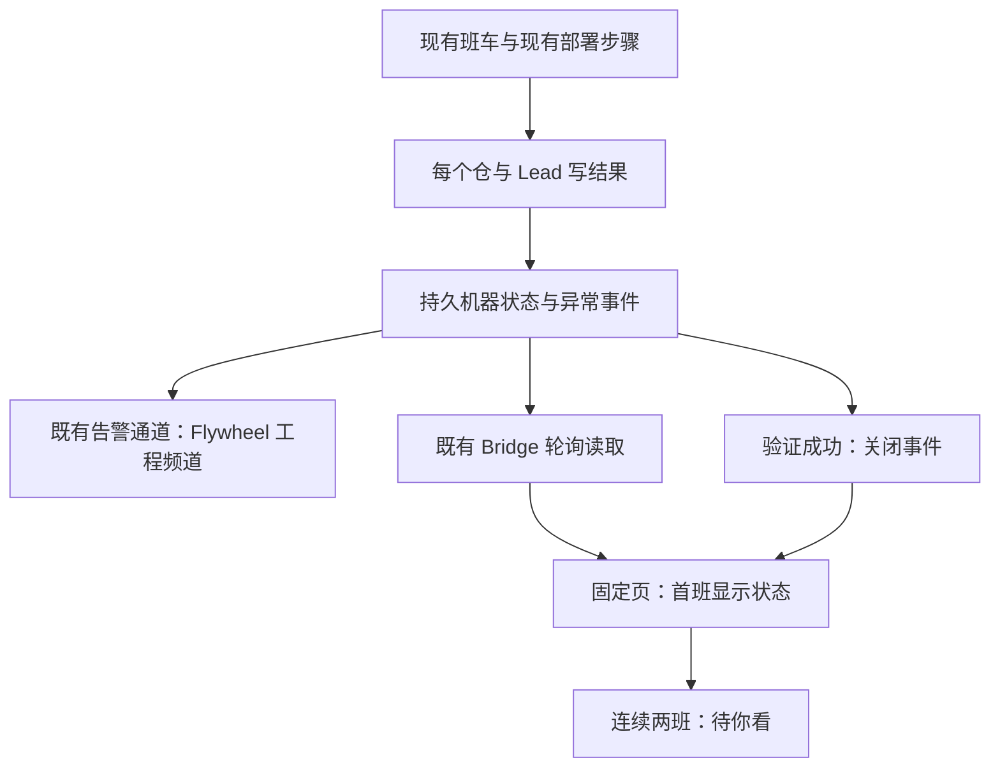

# FLY-2669 班车失败可见 — 实施计划
Issue: FLY-2669 (https://linear.app/geoforge3d/issue/FLY-2669/班车告警-班车里任何一个-lead项目的部署步骤失败或被跳过必须当场在频道告警并挂到固定页不许静默raya-仓-10-天每班-prestop)
日期: 2026-09-17
基于: 无

状态: R1 两项 HIGH 与七项建议已修订，待 R2 设计评审；plan_only，探索与调研合并在本文件。设计节点不实施、不部署、不重启。基线 `06cbb3615`。

## 一、给 founder 的说明

每班给每个仓和 Lead 留下一条结果；某一项失败或异常跳过就立即走既有告警通道到 Flywheel 工程频道，项目显式认领时另抄送；固定页从同一份机器记录显示，连续两班异常进入「待你看」，确认恢复后自动消失。主仓部署成功不能代表其他单元成功。

第一次异常：工程频道收到「Raya 预检未通过；原因 prestop-validation-failed；落后提交数/时间；日志位置」，固定页班车状态显示异常。第二班仍异常：同一天同原因不重复发频道消息，固定页升级为「连续 2 班未更新，Lead 处理中，需要你知道」。恢复后清除活动状态；当天再次失败是新事件，可以再发。



### 范围与取舍

- 覆盖主仓、当前各项目仓检查、逐 Lead 部署步骤、Raya 外仓，以及以后由同一候选清单加入的外仓 Lead。机器身份与显示名称分离，不按名字含 Raya 来识别。
- 只增加观察、持久记录、路由和页面投影；保持部署条件、先后顺序、退出码、锁、权限、回滚、deployed-sha 的既有含义。不加入任何 fetch/pull/restart 来证明恢复。
- 本单不修预检、不授予部署权限、不增加 daemon/timer/第二调度器；FLY-2657 与 FLY-2654 负责各自问题。
- 项目仓现有逻辑检查 `.lead/` 变化，并不保证整个应用 checkout 更新；页面明确显示「项目 Lead 配置检查」，不能用它声称应用部署成功。
- 不选「读日志关键词发消息」：不能可靠区分恢复、重复回放及未执行。不选每班无条件刷屏。不让 Lead 手写状态替代机器事实。
- 网络/频道权限坏时无法保证 Discord 当场可见；必须当场持久化投递状态并显示「待投递／投递失败／送达未确认」。不得把排队、去重命中或 HTTP 结果不明标成已送达。

## 二、已核实的入口与消费者

| 现状证据 | 设计处置 |
|---|---|
| `scripts/update-flywheel.sh:481` 的 `updater_run_cycle` 只设置主仓结果；`:713` 在 Raya 之前记录整轮日志；`:717` 吞掉 Raya 返回码 | 保留主仓 legacyResult 与原退出码；最后由单元集合产生整轮 result；各单元结束即写状态/尝试告警，不等最后一项 |
| `scripts/lib/updater-raya-deploy.sh:1156` 的 `updater_raya_pass` 有 not_configured/locked/awaiting_* /prestop-failed；prestop 路径只写日志 | 每条 return 都映射统一结果；不改变迁移/验证过程。rc=0 也不能绕过结果验证 |
| `scripts/restart-services.sh:1360` 项目扫描 fetch/ref 失败只 warning+continue，无法解析 repo 会被漏掉 | 候选必须先登记，再执行现有检查；每个 continue 都终结一个观察结果 |
| 同文件 `do_restart_all_leads()`（2618）使用 `lead_restart_collect_candidates`，区分 restart/skip-test/pending-install/manifestless/config-drift/probe-error；`write_leads_restart_status:538` 仅持久汇总 | 复用同一候选身份与分类，逐项记录；不把 failed=0 或成功写 deployed-sha 当成逐 Lead 成功 |
| `scripts/lead-alert.sh` 既有 claims/queue/strict-delivery；频道优先 unified；系统身份 updater 不需虚构 Lead 配置 | 新增窄 kind 与可信工程路由，复用投递链；首发与 drain 同路由，主路由固定为配置中的 Flywheel 工程 Lead |
| `packages/teamlead/src/LeadAlertNotifier.ts:1270` 的 drainQueue 支持 deliveryChannelId、送达消息 id；duplicate 是 claim，不等于送达 | 新 kind 带 unit/episode/intent 身份，并验证当前路由；沿用 delivery receipts，显式处理不确定投递 |
| `epic-page/{model,generate,attention,attention-presentation,attention-budget,render-html,render-markdown}.ts` 严格 schema、来源、体积预算；`bridge/founder-attention-facts.ts` 当前是 issue 身份体系 | 独立 deployment 扩展进入同一机器页；不伪造 issue/thread/question，不产生审批门或 ship authority |
| `bridge/gate-poller.ts` 已有 tick；`bridge/epic-page-refresher.ts` 已有 requestRefresh 与合并刷新 | 同一 tick 增加有界读入回调，变化才 requestRefresh；不创建新 setInterval/setTimeout |

以上是当前源码审计，不是生产故障复现。用户给出的 2026-09-17 12:06 日志、105 commits/247h 是回放输入，不能当作当前在线测量。

## 三、唯一观察合同

新增 `scripts/lib/shuttle-observation.py`（Python 标准库 sqlite3，无新依赖）及薄 shell 适配 `scripts/lib/shuttle-observation.sh`。独立 updater 和被它调用的 restart 子进程都用此工具；Bridge 只读其导出，不写源库。文件位于 `$FLYWHEEL_HOME/state/shuttle/observations.sqlite`，使用任务状态根解析，测试根必须可注入；生产不接受任意外部输入指定读取路径。

### 身份与名册

- `cycleId`：取得现有 updater singleton 后生成 UUID；同一执行链继承该值，不能让子进程新造周期。`cycleSeq`：源库事务内单调递增，排序不用墙钟。
- `wakeKind=scheduled|urgent|unknown`；外层竞争锁的调用不是一班，不增加计数；init/锁状态坏是 updater 自身观察失败，用既有 severe alert + meta-alert 记录，不假造全绿周期。
- `unitId` 是规范 JSON 元组 `[projectName, unitKind, ownerKey]` 的 SHA256，kind 为 core_repo/project_repo/lead/external_repo。ownerKey 来自既有 project identity、精确 `(projectName,leadId)` 或显式外仓登记 key；目录和显示名称不参与身份。相同项目多个不同 canonical repo 必须标 inventory-conflict，不能挑第一个悄悄合并。
- 名册来自现有 manifests + 正向 loaded-plist 候选，以及主仓和现有 Raya 外仓步骤的固定登记项；登记先于能力检查。Raya host-capability-absent 绝不等于「不在名册」。没有对应部署步骤的普通项目应用仓不发明部署动作，登记其现有 project_repo 检查职责。
- 对外仓新增只需现有部署集成登记一个 observation descriptor 并包住原步骤；不建立第二份可执行命令注册表。名册差异保留历史身份。候选读取失败时保留上次名册并标 inventory-unavailable，新增系统 inventory 单元；未知范围不能显示全成功。删除配置不等于恢复，原故障标 removed/unverified，需后续显式退役记录才从活动页面移出。
- 每班开始冻结本次名册。主仓已 current 因而整段 restart-services 没运行时，仍给项目/Lead 行写 `skipped:not-in-deploy-wave`，`expected=true,evaluated=false`；不会调用原来不会执行的步骤。

### 结果记录（每个 cycleId/unitId 唯一）

```ts
type UnitResult = {
  schemaVersion: 1; cycleId: string; cycleSeq: number;
  unitId: string; projectName: string; unitKind: string; ownerKey: string;
  displayName: string; wakeKind: 'scheduled'|'urgent'|'unknown';
  outcome: 'deployed'|'up_to_date'|'skipped'|'failed';
  reason: string|null; expected: boolean; evaluated: boolean;
  observedAt: string; evidenceRef: string; logRef: string;
  deployedSha: string|null; targetSha: string|null;
  behindCommits: number|null; driftSince: string|null;
  driftBasis: 'first_observed_behind'|'unknown';
};
```

`deployed` 只来自该步骤已有成功证明；`up_to_date` 需该步骤权威基线与目标相同。Lead 必须来自本轮实际 verify 成功；项目配置检查仅表示原 `.lead/` 合同已满足。`expected` 由共享 reason catalog 导出，拒绝调用方自报 expected=true。新增 `scripts/lib/shuttle-reasons.json` 是 shell/Python/Bridge 同一词表，含 outcome/expected/evaluated/display 中文；详细错误内容不进 reason 或去重键。

| 原分支 | 规范结果 | 恢复资格 |
|---|---|---|
| scheduled_deployed/urgent_deployed + 本单元成功证据 | deployed | 有 |
| scheduled_current + 本单元基线相同 | up_to_date | 有 |
| Raya prestop-failed + prestop-validation-failed | failed:prestop-validation-failed | 无 |
| host-capability-absent/canonical-standard-lead-absent/migration-ledger-absent | skipped:对应稳定原因；unexpected | 无 |
| awaiting_rebind/awaiting_proof/awaiting_reconciliation | skipped:对应稳定原因；unexpected | 无 |
| config-drift/probe-error/manifestless/pending-install | failed:config-drift / failed:probe-error / skipped:manifestless / skipped:pending-install | 无 |
| fetch/ref/source-prepare/cutover/proof/finalize/Lead verify 失败 | failed:fetch-failed/ref-unresolved/source-prepare-failed/cutover-failed/proof-invalid/finalize-failed/lead-verify-failed | 无 |
| 子步骤锁冲突 | skipped:unit-lock-held；unexpected（外层 updater 重入不算一班） | 无 |
| urgent 不包含外仓 / 正式 test-slot / 无部署波次 / 原逻辑无需重启 | skipped:wake-out-of-scope/test-slot/not-in-deploy-wave/no-restart-required；expected,evaluated=false | 无 |
| 项目首次只记录 SHA | skipped:baseline-initialized；expected,evaluated=false | 无 |
| 未识别状态、缺终结记录、波次在前置检查中止 | failed:unclassified-result / failed:unit-result-missing / skipped:upstream-step-failed（unexpected） | 无 |

未识别原始 detail 只保留有界脱敏诊断，不动态增加 reason。`unknown wake` 不是预期跳过。Raya deployed-but-awaiting-proof 不能归 deployed。

### 整轮汇总与提前中止

保留 `legacyResult`，新 `result=all_success|partial_failure|all_failed|expected_skips_only|observation_incomplete`。先检查记录完整性，再算异常数：有正常项+异常=partial_failure，所有应执行项异常=all_failed，无异常且有成功项=all_success，全部预期未执行=expected_skips_only。含 expected skip 的 all_success 也必须给 counts 与 `allUnitsVerified=false`；不得称全体均更新。曾有活动异常而本班未验证恢复，汇总另带 `activeIncidentCount`，不能从本班 all_success 推历史状态已恢复。

将现有 `updater cycle` 权威 result 日志移到 Raya 之后；原主仓行重命名 `updater core`，避免一个 cycle 两个矛盾整轮结果。对现有日志/字段消费者全仓 rg 并改测试；脚本退出码依然是原 rc，不用新异常改变 launchd 的重试语义。

开始先落 cycle + 名册；每个结果提交即更新事件并尝试告警。父层 finally 补齐未返回项，并完成周期。现有 EXIT/INT/TERM cleanup 追加观察收尾，不覆盖原 trap/退出码/锁清理；kill -9 无法运行 trap，由下次既有 Bridge tick / updater 开始只读发现陈旧未完成周期并投影 interrupted/unknown，不能推成功；源库写修复只由下一 updater/helper 操作。新周期开始前将确定无活 owner 的旧周期补齐，PID+start identity 匹配，不凭超时杀进程或改部署状态。

### 持久化与幂等

源库 schema v1：

```sql
CREATE TABLE metadata(singleton INTEGER PRIMARY KEY CHECK(singleton=1),
 source_id TEXT UNIQUE NOT NULL, schema_version INTEGER NOT NULL);
CREATE TABLE cycles(cycle_id TEXT PRIMARY KEY, seq INTEGER UNIQUE NOT NULL,
 wake_kind TEXT NOT NULL, started_at TEXT NOT NULL, ended_at TEXT,
 owner_pid INTEGER NOT NULL, owner_start TEXT NOT NULL, inventory_json TEXT NOT NULL,
 legacy_result TEXT, result TEXT, observer_bundle_digest TEXT NOT NULL,
 observer_schema_version INTEGER NOT NULL, reason_catalog_digest TEXT NOT NULL);
CREATE TABLE results(cycle_id TEXT NOT NULL, unit_id TEXT NOT NULL,
 payload_json TEXT NOT NULL, payload_digest TEXT NOT NULL,
 PRIMARY KEY(cycle_id, unit_id));
CREATE TABLE units(unit_id TEXT PRIMARY KEY, project TEXT NOT NULL,
 last_seq INTEGER NOT NULL, last_result_json TEXT NOT NULL,
 episode_id TEXT, episode_opened_at TEXT, consecutive_scheduled_bad INTEGER NOT NULL,
 last_scheduled_seq INTEGER, closed_at TEXT, drift_since TEXT,
 founder_aware INTEGER NOT NULL DEFAULT 0, last_scheduled_disposition TEXT);
CREATE TABLE notification_intents(intent_id TEXT PRIMARY KEY, unit_id TEXT NOT NULL,
 episode_id TEXT NOT NULL, reason TEXT NOT NULL, utc_day TEXT NOT NULL,
 project TEXT NOT NULL, route_key TEXT NOT NULL, payload_json TEXT NOT NULL, delivery_state TEXT NOT NULL,
 event_id TEXT, message_id TEXT, channel_id TEXT,
 claim_owner TEXT, claim_at TEXT, attempt_state TEXT NOT NULL DEFAULT 'unattempted',
 UNIQUE(unit_id, episode_id, reason, utc_day, route_key));
CREATE TABLE changes(change_seq INTEGER PRIMARY KEY AUTOINCREMENT,
 unit_id TEXT, cycle_id TEXT, payload_json TEXT NOT NULL);
```

SQLite `BEGIN IMMEDIATE`、busy_timeout=5000、WAL、synchronous=FULL；目录 0700、文件 0600，拒绝符号链接/非预期 owner，所有 SQL 参数绑定。先校验身份、枚举、JSON 长度、ISO 时间、SHA、整数范围与冻结名册，再同一事务写 result + units + intent。相同主键相同 digest 是幂等；相同主键不同 payload 拒绝并暴露 observation-conflict；更旧 seq 不倒退状态。冲突不能覆盖失败为成功。

结果提交后短事务 claim intent，释放事务再调用告警，不能持数据库锁跨网络。重试沿用 intent/eventId；只拿到真实 message receipt 才是 sent。Bridge 不直接用 sql.js 打开 WAL 文件；调用固定 helper `export --after-change-seq N --limit 200` 以只读 SQLite 一致快照导出 bounded JSON，单飞、有超时、无 shell 拼接。顺序 cursor 以完整事务版本（包括投递变化）递增，不能只按 cycle seq 漏掉同周期多次更新。使用以上 `changes` 表中的 `change_seq`，导出每页带 nextCursor/hasMore；同一个 seq 下所有变更不得截断或跳过。

观察写失败不阻断或重跑部署：用已冻结的单元结果立即尝试 `shuttle-observation-write-failed` 告警及本地 meta-alert；整轮标 observation_incomplete；导出失败/过期页面显示不可用并保留最后已知故障，不能空数组伪装绿。

## 四、异常事件、每日去重与恢复

一个单元从健康进入异常时创建 `episodeId`。原因 A→B→A 不算恢复，episode 不变；每种原因各有每日预算。只有 `evaluated=true` 的 deployed/up_to_date 成功证明能关闭 episode、清零计数和漂移观察起点。expected skip 不关闭事件；scheduled expected skip 对计数中性，原样保留连续失败计数及已升级的 founder-awareness，直到真实恢复。urgent/out-of-scope 不加班次计数，也不打断 scheduled 相邻失败。该单元第二个 distinct scheduled cycle 的实际异常即升级（中间 expected skip 不清零），原因改变也算连续未成功；重复 ingest 不加一。

```text
abnormal = outcome == failed || (outcome == skipped && !catalog.expected)
if duplicate_result: return prior_receipt
if abnormal:
  open episode if absent
  if scheduled: consecutive += 1
  insert primary intent IF ABSENT hash(unitId, episodeId, reason, observation UTC day, primary)
  if explicit secondary binding and different channel: insert copy intent with routeKey=project_copy
  founderAware |= consecutive >= 2
elif evaluated && outcome in {deployed, up_to_date}:
  close episode; consecutive = 0; founderAware = false
elif scheduled:
  retain consecutive and founderAware  # neutral skip, never clears an incident
```

units 中的 `founder_aware` 和 `last_scheduled_disposition` 按上面的唯一 reducer 更新。intent UTC day 在首次异常观察时固定；隔天重试旧消息不新造预算，隔天新班异常可新建当日意图。同日恢复再失败创建新 episode，允许新告警，符合需求例外。

落后提交数用已有 fetch 的 target 与已部署证据做只读 `git rev-list --count deployed..target`；无证据/ref 不可读/历史缺失则 null（显示未知），不填 0。divergence 另标 unknown 并留原因，不用 commit timestamp 冒充部署时间。`driftSince` 从首次观测仍落后开始累计；展示「已确认至少落后 X 小时」。已有 247h 仅在带出处的回放夹具里呈现，不对新数据捏造 10 天历史。日志位置必须是固定允许的 basename/相对路径+cycle/unit 标记，不上传日志正文、env 或凭证；托管页不暴露本机绝对用户路径。

## 五、频道投递：复用通道，补窄路由

新增 kind `shuttle_unit_unhealthy`。`lead-alert.sh` 参数仍为 project/updater/kind/body/signature，新增内部 `--shuttle-intent <id>`，由固定 helper 从源库取冻结 payload；不提供用户任意 `--channel` 开关。标题/body 由稳定字段生成，禁 @everyone/@here，不默认 @founder。

**较新 Lead 决策覆盖初稿路由选择**：question `48427c93-b493-4928-bc37-654c667b0b66` 明确班车归 Flywheel 基础设施，主路由必须覆盖所有部署单元到 Flywheel 工程频道；不要求替 7 个项目迁工程频道。原任务的「项目工程频道」在本版按 Lead 解释落为基础设施责任频道，项目自有频道作为显式可选抄送。此为有记录的范围裁定，不是实现者自行弱化告警。

- **主路由 v1 必做**：无论异常单元属于哪个项目，解析 `ProjectConfig.loadProjects` 中 `projectName=flywheel` 且 `leads[].agentId=flywheel-eng-lead` 的唯一 `chatChannel`。不硬编码频道 id，不猜标签、不落 unified。现有生产名册有这个精确身份；只读检查必须验证唯一性与 snowflake。主路由缺失是 route-unavailable，既有 meta-alert 兜底，不能报告可用。
- **副路由可选**：ProjectEntry 新增 `shuttleEngineeringLeadId`，仅明确设置时按该项目 `leads[].agentId` 精确解析 `chatChannel`。没有字段就不抄送，不报主路由失败；非法副路由独立 config_error，不能阻断主路由。由各项目 Lead 后续认领，不把 7 个项目候选映射当作上线前置或生产默认值。
- `notification_intents.route_key=primary|project_copy`；每事件每路由独立投递状态和去重，`originProject` 永远是实际部署单元项目，deliveryProject/lead 是接收方，二者不得混为一列。主、副同频道时只发主路由一条。主路由每日预算不能因新增/修改副路由重置；缺副路由不会延误主路由发送。
- 首发仍用既有 alert sender chain、claims、strict-delivery、queue。仅此 kind 且经过以上配置绑定核验才可覆盖 unified channel。queue envelope 保留 originProject/unit/episode/intent/routeKey/channel/binding digest；drain 对 primary 重核 Flywheel 工程 binding，对 copy 重核所属项目显式 binding；错配/缺失不偷换频道。显式配置改变后可在同 intent 下更新未送达路由，sent 不重发。
- alert shell `--project` 表示原始业务项目；新 kind 的 route resolver 返回接收项目/Lead/channel，渲染始终保留原始项目名。eventId/signature 使用 intentId（已含 routeKey），与 claims 和队列一致。送达记录按 intent 存储，page 聚合显示主路由状态和可选副路由状态，副路由成功不能掩盖主路由失败。
- 作为 plain 工程通知，不创建 infra ARC 自动修复工单、不触发重启；新增 kind 的事件 union、shell 白名单、copy 和路由分类需同步。补 `packages/teamlead/src/bridge/shuttle-alert-route.ts` 与共享只含非敏感映射的规范导出，由 loadProjects 验证并写 route snapshot；shell 初次读取时仍校验输入 schema/owner。主路由校验直接可从 projects.json 的同一规范字段解析，不能依赖 Bridge 正在线。

旧 Raya/fetch/Lead-wave 重复告警：仅在有效 `SHUTTLE_CYCLE_ID` 且该分支已成功交给 observation helper 时，将相同部署故障告警委托给新 intent；写入失败走旧告警兜底。token 消费/无效授权/安全及非班车手工 restart 的告警不变。不能先屏蔽旧通道再尝试写入。

投递状态：pending/sent/queued_transient/delivery_unknown/dead_lettered/config_error。`duplicate` 查已有真实 delivery receipt；没有 receipt 只能未确认。POST timeout/连接中断后不确定是否送达时，新 kind 保守置 delivery_unknown，不盲重发；继承既有 queue 的明确可重试失败（例如 429/明确未发送）才自动重试，且保持 eventId。禁止把「至多一次」宣传成网络条件下的严格 exactly-once。对不确定发送，该日保留未确认状态到页上，不凭新 signature 绕过预算；恢复后未发送旧异常取消，保留历史，迟到已送达 receipt 不重开业务事件。

## 六、固定页与同源状态

新增 `packages/teamlead/src/bridge/shuttle-observation-projector.ts`，挂既有 GatePoller tick，单飞每 20 ticks（约 60 秒）最多 200 个变更/2 MB，子进程异步 execFile、500 ms deadline，不阻塞 poll loop；启动立即读，积压下一 cadence 继续。无新 timer，变化触发 requestRefresh；固定页正常更新延迟验收上限是一个 cadence + 既有 publication 耗时，频道告警仍在执行当轮立即尝试。事务 upsert StateStore `shuttle_unit_projection(project,unit_id,source_change_seq,payload_json)` 与 `shuttle_projection_cursor(source_id,cursor,last_ok_at)`。旧 seq 不覆盖新，按 originProject 分区；读源异常产生明确 unavailable 状态。

这些新表加入 StateStore migration / schemaVersion 与 `scripts/lib/fly-2006-retention-tables/teamlead/` 精确表清单及 schema hash 闭包测试，采用项目当前版本增量方式；不得让 runner 直接写在线 teamlead.db。源 observation DB 不是 authority DB，不产生批准/可重启/已 ship 状态。

页面新增 versioned optional `deployment.v1` extension：`sourceStatus`（完整/不可用/截断/旧版未采集）、`observedAt`、`units[]`、`activeIncidents[]`。cell 来源为 StateStore 对应 project/unit/source_change_seq；rule ID `deployment.v1` 加入同一个 model 严格验证器。旧文档缺扩展显示「班车状态尚未采集」，不显示健康。

首次异常在固定页「班车状态」显示；`founderAware=true` 的同一 incident 投影到现有「现在要你看」区域，文案是「需要你知道，Lead 处理中」，不说等待批准、不添加工作流 gate。渲染直接引用 deployment 的 incident key，不往 issue-based attention 数组硬塞假 issue；同一来源两处呈现不生成两份状态。更新 attention summary 计数与 empty 文案，将 awareness 行和已有待回答事项分开计数；HTML/Markdown/JSON 同源，标题轮换的 issue 身份不受影响。无有效频道链接也展示故障与链接不可用，绝不能隐藏。

覆盖 `model.ts` 的 exact-key 校验、`generate.ts`、`render-html.ts`、`render-markdown.ts`、`labels.ts`、budget 序列化与来源收集；`bridge/epic-page-route.ts` 生成时读取投影，`epic-page-refresher.ts` 增加 refresh reason `deployment_changed`。Flywheel 的基础设施固定页汇总所有班车单元，保留 originProject 标注；各项目自己的固定页只显示本项目单元。跨项目汇总只给现有 Flywheel 工程基础设施页，不开放通用跨项目查询；不能因某外仓没有 active Epic 把它从 Flywheel 班车状态中删掉。变化提交后对 Flywheel 和已有受影响项目 requestRefresh，既有 scan 补偿漏刷。项目无 active Epic 时，Flywheel 基础设施固定页仍显示该单元，机器投影仍保留，沿用 intake/日常筐逻辑并显示 page-unavailable 诊断；不创建假 Epic。部署状态不能被 Lead note 覆盖。

source 成功读取但最近班车没有新结果，展示最近观测时间；超过最近 expected scheduled slot + 既有容忍窗口显示过期，仍保留活动故障。Bridge 不推断某个 skipped 单元已恢复。静态已托管页面靠既有 publication 更新；验收必须获取新托管版本，不以本地 HTML 证明在线更新。

## 七、实施拆分与验证（实施节点执行，本节点不跑部署）

每块依次做：写失败夹具→运行确认红→最小实现→回归→提交。跨块先完成合同，再接入生产入口；不要并行修改相同共享脚本。

1. **合同与 reducer**：新 `scripts/lib/shuttle-reasons.json`、`shuttle-observation.py`、`shuttle-observation.sh`；测试 `scripts/__tests__/shuttle-observation.test.py`。用临时 SQLite、注入时钟和 sender 捕获器，验证 schema、幂等冲突、恢复、UTC、并发 helper、进程重启后去重、只读导出分页和参数绑定。命令 `python3 scripts/__tests__/shuttle-observation.test.py`。
2. **生产者接入**：修改 `scripts/update-flywheel.sh`、`scripts/lib/updater-raya-deploy.sh`、`scripts/restart-services.sh`；新增 `scripts/__tests__/shuttle-unit-results.test.sh` 与历史 replay fixture。所有生产 sourced shell 必须兼容 macOS `/bin/bash` 3.2；把新 `scripts/lib/shuttle-observation.sh` 加到 `scripts/__tests__/update-flywheel-sources.test.sh` 的硬编码语法禁用清单，并运行该守卫。保持既有 source-only harness，stub 所有 git/network/launchctl/restart；验证 return/continue/early abort、主仓 current、名册未入波次、逐项目 fetch 失败、逐 Lead skipped、未知状态、所有结果与最终 counts，并加一次在 ff-merge 点替换工作树 helper/catalog 的夹具，证明 pinned bundle 一班不混版。运行 `bash scripts/__tests__/shuttle-unit-results.test.sh`，以及 `bash scripts/__tests__/updater-trigger-policy.test.sh`、`bash scripts/__tests__/updater-raya-deploy.test.sh`、`bash scripts/__tests__/restart-deploy-consistency.test.sh`。
3. **投递**：修改 `scripts/lead-alert.sh`、`packages/teamlead/src/LeadAlertNotifier.ts`、`bridge/alert-kind-copy.ts` 及项目配置类型/loader（`packages/teamlead/src/ProjectConfig.ts`，禁止误改通用 flywheel-config yaml）；新增 `scripts/__tests__/shuttle-alert-route.test.sh`、`packages/teamlead/src/__tests__/shuttle-alert-delivery.test.ts`。测试统一频道 env 下 7 项目全部告警到配置解析出的 Flywheel 工程主路由；一个显式副路由样例另收到一条；其余无绑定不抄送。覆盖主/副同频道合并、主失败副成功不得冒充送达、权限错、缺主配置、非法副配置、queued drain 相同频道/身份/日预算、unknown POST 不重发、原非 shuttle kind 行为不变。使用只含 projectName/agentId/chatChannel 的生产名册形状夹具。首发与 drain 均用捕获器，不用真实 Discord。
4. **投影与页面**：新增 projector、StateStore tables + retention 声明、`bridge/plugin.ts` 的 GatePoller composition wiring；修改上述 Epic 消费者；新增 `packages/teamlead/src/__tests__/shuttle-projection.test.ts`、`shuttle-epic-page.test.ts`。测试第一班状态、第二班 awareness、恢复熄灭、无 Epic、无链接、旧 schema、截断/损坏源、跨项目隔离、refresh receipt/托管重新获取；页面 payload 注入 `` 和 `@everyone` 必须作为文本。
5. **集成证据**：临时 HOME 和 fixture projects，跑真实 observation helper + shell producer adapters + notifier 捕获器 + StateStore/projector/renderers。完整循环失败→同原因第二班→成功→再失败，重启 helper/Bridge fixture 后继续。保存结果 JSON、捕获消息、投影/页面、操作调用列表；证明没有新增 deploy/restart 调用。

将三个新独立套件 `shuttle-observation.test.py`、`shuttle-unit-results.test.sh`、`shuttle-alert-route.test.sh` **全部**显式登记 `.github/workflows/ci.yml`；Python 测试末尾必须调用 unittest.main，测试摘要必须大于 0，零收集视为失败。运行 `bash scripts/__tests__/ci-shell-suite-enumeration.test.sh` 和 `bash scripts/__tests__/update-flywheel-sources.test.sh`。TS 套件放既有 Vitest 自动收集路径。

TS 聚焦命令：`pnpm --filter flywheel-teamlead exec vitest run src/__tests__/shuttle-alert-delivery.test.ts src/__tests__/shuttle-projection.test.ts src/__tests__/shuttle-epic-page.test.ts`（已核对 package.json，name=flywheel-teamlead）。`pnpm typecheck`、`pnpm lint` 按仓库 required checks 运行；不得跑会操作真实桌面或频道的套件。

### 必须提交的验收矩阵

| 输入 | 必须看到 | 禁止看到 |
|---|---|---|
| 真实旧形状：`[flywheel-updater] raya: prestop-failed prestop-validation-failed` + `raya shuttle: prestop-failed prestop-validation-failed` + `updater cycle: wake=scheduled result=scheduled_deployed` | legacy fixture 演示旧结果成功且无通知；新实际 producer fixture 产生 Raya failed、整轮 partial_failure、1 条捕获告警、页面行 | 只测试字符串 parser 就声称新入口已接通 |
| 第二个同 UTC 日班次同原因 | 总发送数仍 1；consecutive=2，待你看 1 行 | 重放同 cycle 也加到 2 |
| 成功→同日再失败 | 恢复时活动行熄灭；新 episode，发送数变 2 | 日预算把恢复后的新故障吞掉 |
| A→B→A 同日，未恢复 | A/B 各 1，consecutive 按班递增 | A 回来产生新 episode |
| 跨 UTC 日 / DST / urgent 中间插入 | 按 UTC 去重，PT 班次排序用 cycleSeq；urgent 不加班次 | 本地日期混用、一次周期重放被数两班 |
| 主仓成功 + Lead skipped + Raya bad | partial_failure；各单元都在 | deployed-sha 抹掉失败 |
| 主仓 current + 未跑 Lead 步骤 | expected skip，保留旧异常/awareness/计数 | 伪造 up_to_date/自动恢复 |
| 失败 → not-in-deploy-wave → 失败 | n=1→1→2，待你看升级；中间未执行不算成功 | n=1→0→1 永不升级 |
| 生产名册形状 7 项目 + 一个显式副路由 | 7/7 主告警都解析到 Flywheel 工程；样例有 1 副本；无绑定不影响主路由；只读解析收据 | 6/7 无绑定就无频道消息；主副同频道重复 |
| cycle 开始后 ff-merge 改 helper/catalog | 所有子步骤仍使用 cycle 冻结 observer；意外换版则 observation_incomplete | 活 cycle 自动迁 schema或混用 reason |
| 观察持久化坏 / schema 未知 / 源读失败 | observation_incomplete/unavailable + fallback 记录 | 空列表=健康 |
| timeout after POST / duplicate claim / queue pending | 未确认/排队可见；同 intent 不重复投递 | 把 duplicate 当送达 |
| 新外仓 Lead / manifest 消失 / 同名跨项目 | 新单元自动纳入，旧未证恢复保留，身份不冲突 | 只覆盖硬编码 Raya |

## 八、迁移、回滚与边界

上线随既有 updater 正常发布窗口；本任务以及 QA 不触发生产班车、不重启、不造生产失败。先完成生产主路由只读验证及生产形状夹具（一主路由 + 一个显式副路由样例），再上线兼容 reader/schema，再由正常窗口上线 producer/route；混合版本显示尚未采集或 unavailable，不伪绿。源库首次建库无历史失败计数，第一新班计 1；历史日志回放只在测试库，不能补生产告警或虚造 10 天计数。

保留 90 天 closed cycle/result/closed intent 历史，活动 incident、未终结投递与 dedup 最低身份不删；在现有 updater 每班末执行有界清理，没有 timer。不得删当天去重或尚未恢复的 episode；按 UTC 日/恢复状态决定可清理记录。

回滚只停新观察写入/投影读取，保留源库/投影表和最后状态，页面显示 stale/旧版未采集；不擦故障、不改部署 marker、不回滚部署控制。如需停新 kind 保留未发送意图，不能转发到其他频道。对源 schema 新于可读版本 fail closed 为 unavailable，不能 drop/recreate。

风险：现有 alert queue 的 unknown delivery 不能保证严格 exactly-once；本单选择不盲重发并在固定页显式暴露。Lead 在 question `d216fe8e-6230-43ad-a621-5f9b6ad1ba19` 已确认窄 kind、工程频道路由、默认不 @founder 和连续两班升级。最终生产效果须后继独立 QA 在隔离捕获器完成，再由正常发布后观察；本设计评审不等于已修复线上故障。

### 并行单协调（Lead 当前答复已确认）

FLY-2654 与本单冲突面是 `scripts/update-flywheel.sh:update_main` 的 scheduled/urgent case，以及 `updater_raya_pass` 调用外围。优先让 FLY-2654 部署授权/唤醒范围变更先合，本单在其最终主线上技术同步后套观察层；若本单先合，后合的 FLY-2654 必须 rebase/同步并保留每单元结果与最终 aggregate。双方谁后合谁解决冲突并重跑双单测试，不能用旧 case 覆盖新语义。FLY-2654 尚未在本 checkout 有方案文件，本单不臆造其最终授权规则。

急班是否执行 Raya 由合入后既有决策决定：已执行就照实际成功/失败记录和当轮告警；按规则未执行就 `skipped:wake-out-of-scope`，不恢复、不新开异常、不增加定时班失败数。已存在的 scheduled 异常若 urgent 实际验证成功，可以关闭，下一次失败是新 episode。FLY-2657 的 preflight 修复同理：消费稳定结果，不绕过检查；原 prestop 历史夹具永久保留。

### 源库变更流的具体补充

上文最终 SQL 已包含 `metadata` 和 `changes`；每次 reducer/intent 更新在同事务 append 完整单元快照（含事件与投递状态），每条都是独立完整快照，因此按 change_seq 分页可精确续传。导出用参数绑定 `WHERE change_seq > ? ORDER BY change_seq LIMIT ?`，序列永不重置；cursor 绑定源库创建时 UUID `source_id`，库重建不能复用旧 cursor。上文最终 SQL 已包含 units 的 `founder_aware`/`last_scheduled_disposition` 与 intents 的 claim/attempt 字段；回收 claim 前查实际投递回执，inflight 但没有确定未发证据变为 delivery_unknown，不直接补发。

Bridge 停机超过变更保留期时，export 返回 `cursor_expired`，读取分段一致 snapshot（固定高水位）重建本项目投影，再从该高水位继续；不能跳 cursor 丢活动异常。源库新 source_id 则将旧故障标历史未核，导入新库，不自动当作恢复。


### R1 修订：主路由必须接通，副路由自愿认领

2026-09-17 20:05Z 只读核对生产 projects.json，7 项目均无新 binding；Flywheel 现有 `flywheel-eng-lead.chatChannel` 有明确值。按较新 Lead 裁定，实施交付新增 `scripts/shuttle-route-bindings.mjs --check --projects-file <path>`：只读检查主路由唯一、合法，输出不带 token 的 route receipt；同时验证存在的显式副路由。主路由无效 check 非零；不因其余项目未认领副路由判失败。测试 production-shaped 7 项目异常 → 同一主路由捕获 7 条各自不同 unit 事件，一个明确配置的项目再得到 1 副本。正常配置发布流程可选安装未来认领的绑定；本单不写生产配置、不替别的部门指定频道、不发真实告警。

后续可选绑定候选（非默认、非授权）：geoforge3d/product-lead、joycon-typeless/joycon-lead、personal-assistant/belle-lead、growth/mufasa-lead、tidal-echo/tidal-echo-cos-lead、raya/raya。具体接收人由各项目 Lead 自己认领。未来新项目无副绑定仍有基础设施主告警，所以不存在『新项目加入但全静默』窗口。

### R1 修订：一班固定一个 observer 版本

在 begin cycle 前，helper、shell adapter、reason catalog 作为一个 observer bundle（本班固定使用的一组观察程序）复制到状态根只读版本目录，摘要绑定完整有序文件闭包。先验证文件 owner/非 symlink/大小、原子落盘 fsync，再在 cycle 行写 bundle digest/schema/catalog digest。父 shell 与 restart 子进程只调用这个冻结 bundle；传递的是 cycle identity，helper 由源库记录定位固定路径，不接受任意 env 路径成为可信程序。ff-merge 可以更新部署脚本，但本班观察字段必须保持 schema v1 兼容。新部署脚本遇到不支持的旧观察协议，仅报告 observation_incomplete 并走旧告警兜底，不迁活周期库，不影响原部署结果。

源库迁移只能在持有 updater singleton、没有其他活 cycle 时开始。bundle 缺失/摘要不匹配/ schema mismatch 明确 observation_incomplete；禁止悄悄换成工作树新 helper。运行中的 bundle 不清理，closed cycle 的保留期结束才移除。测试模拟同周期 merge 替换 helper/catalog、bundle损坏、子进程继承失败及活 cycle 迁移拒绝。

### R1 修订：页面体积降级

把 `epic-page/optional-budget.ts` 列为必改消费者。在其 524288-byte bundle 预算内，先移除 deployment 健康历史细节，再去掉正常/预期跳过 unit 行，再压短非关键诊断；保留 active incident 的 unit 名、原因、升级状态、投递状态。仍超限时按 founderAware 优先、episode_opened_at 早者优先、unitId 稳定排序裁剪，显示 retained/total 与 sourceStatus=truncated，summary/empty 判据绝不能宣称无事。必须保留最小『班车状态不完整，有 N 项未展示』警示。HTML/Markdown/JSON 共用裁剪后同一模型与 provenance 重建，不让三种出口各自裁。测试极大 units/activeIncidents 和 Unicode 字节大小；若最小警示也装不下，沿用已有 publication 失败并保留上一版/失败提示，不发布伪绿页面。
