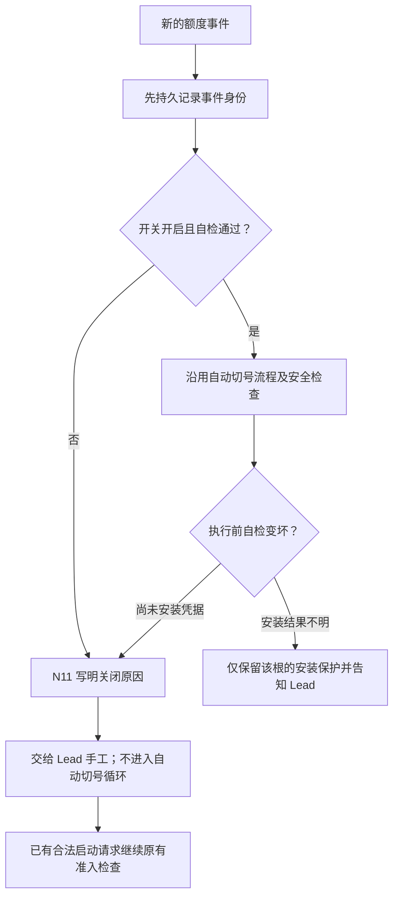

# FLY-2676 readiness 失败退回手工 — 实施计划
Issue: FLY-2676 (https://linear.app/geoforge3d/issue/FLY-2676/codex-额度b6-n11-readiness-失败降级自动切号关着时每次都说出来舰队退回手工但不被卡死)
日期: 2026-09-17
基于: 无

状态：依据 Lead 正式裁定修订，待新的显式 design review。文档 tier=plan_only；探索、源码调研和实施步骤合并于本文。
源码基线：`06cbb36157890f91a44acb850f5243bb13a171e7`。
执行：`0d4a33b8-c99f-4f0f-b9cc-8d240a33458f`；design TURN epoch=1。

## 1. 给 founder 的说明

自动切号自检不通过时，系统立即退回 Lead 手工，每一个新的额度事件都明确说出关闭原因，不再让同一故障反复阻挡整支舰队。

Readiness 是切号前的安全自检，用来确认账号凭据、工作目录和运行中的进程能够安全共存。N11 是“自动切号关着”的通知编号，不是新审批入口。正常文案为：

> ⚙️ 自动切号关着：readiness-receipt 不存在。需要手工切号。

恢复的含义是已有合法启动请求能继续经过原有检查；没有额度的账号仍不能完成工作。死掉的作业不会自动重起，QA 跨 vendor 规则不放松。凭据安装已经开始但结果不明时，只保留该凭据根的安装保护，并明确告诉 Lead；不能用“不被卡死”授权盲目覆盖凭据。



交付后用 9-11 的事故形状回放：18:43Z 人工兑卡，18:45Z 独立探针能用，但 readiness 收据缺失；旧版仍暂停 8 分钟，新版立即提示并交回手工，不等总开关被人为关闭。这里只模拟额度观测，不实际兑卡。

## 2. 范围与产品依据

权威：`product/doc/FLY-2591-codex-quota-switch/prd.md` §3.3、§8 readiness 行、§9.1、§10 判据7、§12 B6。§9 顶部“任何新逻辑不得打开”由其 §9.1 明确的可见性先落地例外限定：本单只启用降级与 N11，不打开自动切号/恢复。

- 覆盖：关闭原因结构化、每个额度事件的 N11、readiness 失败不形成无限事故循环、已有等待启动请求退出 quota 等待、旧状态迁移、评审等待退出、离线事故回放。
- N3（停摆询问兑卡）由 B2 负责；B6 的信号记录和通知派发必须独立于自动开关，不挡住 N3 后续消费。B6 不以 N11 取代 N3，不引入 N3 首次通知等待时间。
- 不做 B0/B1/B2/B4/B5/B8、不产生 consume 调用或兑卡授权、不改变选择账号算法、不改 Claude、不部署宿主、不修改旗标 raw value/default、不授予 ship 权限。
- C1/C2 全程保持：只有 founder 对绑定内容的一次批准才能由额度子系统消费指定一张卡；本单不新增调用面、凭据读取者或批准替身。
- 后续实现与 QA 分别由 DAG 节点完成；本文的用例是验收要求，尚非通过证据。

## 3. 源码调研与事实边界

| 文件/位置（基线） | 当前事实 | 本单处置 |
|---|---|---|
| `bridge/codex-quota-store.ts:654` recordSignal | 有 binding 即插 incident/target/execution_pause；usage_limit 键仅 root+generation | 将每事件记录与自动事故分开；关闭时只记信号/N11 |
| `codex-quota/coordinator.ts` readiness 分支 | readiness=false → retry_wait/readiness_failed，60s 后再试；isPaused 排除的状态不含它 | 在第一次失败就降级，不设置下一次事故重试 |
| `codex-quota/host-readiness.ts:67` 及末尾 catch | 缺收据与其它错误都折成 complete=false | 输出受限原因码，保留真实缺失原因，禁止直接显示异常堆栈 |
| `codex-quota/readiness.ts` / `runtime.ts:67` | Result 本有 failures，runtime 最终只传 boolean；OFF 早退 | 读自检结果与是否准许动作分开 |
| `bridge/plugin.ts:8305` | OFF 不构造 runtime；backfill/collector 在构造内；运行失败可让通知只剩日志 | 轻量观察/事件派发总是构造，不依赖 credential()/rotate runtime 成功 |
| `bridge/plugin.ts:11885` | runtime.tick 和 outbox 绑定维护回调 | 信号提交后唤起派发，维护轮次仅作补偿；N11 不等待 rotate/probe |
| `StateStore.recordLegacyCodexQuotaFailure/recordEnrolledTerminalSignal` / `createCodexQuotaRouter` observe | 两种 runner terminal 入口及 review observe 都丢掉 sourceEventId 再交 recordSignal | 贯通经过验证的源事件身份，涵盖 OFF 时无 binding 的 terminal 事件 |
| `codex-quota/outbox.ts` | 现有 outbox 可持久送达；旧通知宣称 fleet remains paused；使用事故级键 | 新增 N11 文案与每事件键，不能沿用事故级/主机级节流 |
| `codex-quota/admission-replay.ts` | OFF 已可重放既有启动请求且有 launch owner/liveness guards | 扩展为该根 effective manual；不调用 dead-run recovery |
| `createCodexQuotaRouter.status` + `codex-quota-client.mjs` waitReady/validateResponse | status 只认 ready/paused/probe_failed/abandoned，客户端会等 generation | 增加明确 manual_required 终止等待结果；绝不伪造 ready |
| `engineering/doc/FLY-2465-codex-fleet-rotation/design-correction.md` | 后续 Lead 裁定 OFF 退出全部启动准入，事实保留，死亡体不自动恢复 | 沿用此边界；readiness 失败相同手工语义，安装不确定另行保护 |

以上 packages 路径均相对 `packages/teamlead/src/`。事故时间/宿主形状引用 PRD §1.1/§9 的历史实测，不声称本次读过生产数据库或复现过 9-11 的原始日志。

## 4. 设计：一个自动化判定，保留事实和权限

### 4.1 可用性合同

新增 `codex-quota/availability.ts`，只组合现有开关、结构化自检和 runtime 构造状态。不是第二个用户开关，不写 flag_values。

```ts
type ManualReason = 'flag_disabled' | 'readiness_receipt_missing'
  | 'readiness_receipt_invalid' | 'authority_unavailable'
  | 'credential_not_shared' | 'canonical_unavailable'
  | 'runtime_unavailable' | 'readiness_unchecked' | 'manual_handoff'
  | 'legacy_capacity_evidence_missing';
type Availability = {
  mode: 'automatic' | 'manual';
  reasons: ManualReason[];
  revision: number; // Bridge 本次启动内单调递增，异步检查比较用
  checkedAt: string | null;
};
```

优先文案：明确缺收据 > 无效收据 > 凭据未共享/不可用 > 权威不可得 > runtime 不可得 > 开关关闭 > 尚未检查。可列多个经证实原因；OFF 不得谎称缺收据，ENOENT 只能来自对指定收据文件的检查，不能把其它文件 ENOENT 冒充为它。展示词典不包含路径、账号标识、令牌或原始异常。

观察器可在 OFF/runtime 缺席时独立读安全元数据；收据缺失快速返回，不读账号内容。完整 ready 必须来自现有完整 collector/checkCodexQuotaReadiness，不以文件存在当通过。扩展 HostInventory 为可选的受限 failureReasons；未提供原因的旧调用方保持 authority_unavailable。

- Bridge 启动前构造观察器并将状态置 manual/readiness_unchecked；完成首次检查后再开放 quota 自动路径。旧 ready 缓存不能跨 Bridge 重启当许可。
- 同一 Bridge tick 内复用 in-flight 检查避免重复扫描；每个新额度事件、启动绑定前、自动动作前检查当前状态。同步 SQL 消费者读取当前内存判定，不自行做异步 IO。
- 任一自检失败，立即把 availability 改 manual 并递增 revision，再持久化对应手工 disposition；后续同步消费者立即看到 manual。事务失败时仍禁自动动作，报警且重试持久化，不能因 DB 写失败恢复自动。
- 现有维护轮次检查恢复，下一事件也重新检查；恢复只使未来尚未交给人工的事件具备自动资格。没有新额度事件时不反复发 N11。总开关 OFF 时即使 ready 也保持 manual/flag_disabled。
- 动作跨 await 后重读旗标、revision、自检；发生失效不得执行后续 install/terminate/start。已经发出的动作按已有 durable install/start journal 对账，不能把超时当没发生。
- 无 TTL 新参数、无事故等待窗口、无后台开旗标；观测重试与事故自动重试是两回事。

### 4.2 原始暂停事实不等于有效阻挡

增加窄表 `codex_quota_manual_disposition`：`incident_id TEXT PRIMARY KEY, reason TEXT NOT NULL, recorded_at TEXT NOT NULL`。只对确知尚未开始安装/恢复的事故插入一次；不改旧 incident/target/pause 行，不伪造 settled/recovered/probe_result=ok。

允许转手工：prepared/retry_wait/probe_failed/identity_uncertain，以及仅剩历史池空标签的 pool_exhausted；触发原因必须是 readiness/构造不可用而非当前证实池空；仅排除同 root+generation 当前正向证据成立的 pool_exhausted 情况；历史 pool_exhausted 行在证据过期/缺失时也按手工释放条件处理，且无 install material、无 installing 状态、无 target terminate/start key、无新 execution/run、无已提交 generation。用单一事务重读事实并 parameterized INSERT；调用方不能靠传入 state 声明安全。任一矛盾字段按“安装/恢复不确定”处理，保留该根保护并单独诊断。

可执行策略必须有两个不同谓词：

1. `shouldPauseAdmission(root, execution)`：安装结果不明的该根保持保护；flag ON 且同根同代存在当前正向容量证据时保留真实容量等待（与 readiness 无关，不得给它写 manual disposition）；其它情况仅 automatic 且未 manual-disposed 的事故可造成 quota 暂停。OFF 的既有启动退出语义保持，不将普通历史 pause 恢复成硬闸。安装 journal 保护归 credential 安全边界，不能冒充 readiness 重试。
2. `shouldHoldQuotaCasualty(execution)`：已知 usage-limited 的死亡体仍不交给通用自动重试/死亡替换；手工处置不授予自动恢复权。此谓词读取旧 target/pause 以及新 signal 表中经过 server 验证的 runner_terminal usage-limit 事实（包括 pending/manual，但必须有已校验 runner binding、root_key 与 generation），从事件持久提交时就生效，不能等待 evaluator 或依赖新路径已不再创建的 target；无 binding 的 runner terminal 与 legacy_incident 合成身份均只诊断，不参与账户或执行 fence；保留源码 Unknown provenance is diagnostic only 不变量和 missing binding records one diagnostic without pausing legacy execution 用例。这保留 StateStore dead rollback 和 RunDispatcher.retry 的既有 guard；不能把所有 isExecutionPaused 调用一律替成 false。

**Signal 来源 hold 的解除合同。** 定义 `signalCasualtyHeld(executionId)` 仅当存在 source=runner_terminal、valid runner binding、该 execution 已经 terminal usage-limited，且 currentRoot 存在且 `signal.generation >= currentRoot.generation`、没有该 execution 对应旧 target 的 recovered/abandoned 终态时为 true。binding/root 缺失的纯信号不产生新 fence；既有 target/journal 自己已有的保护仍按旧规则执行。manual 标记不作为永久 hold 条件，readiness 恢复本身也不改变 generation，故不会擅自释放。经过现有 `CodexQuotaStore.reconcileExternalRoot`身份对账写入 external generation 并推进 currentRoot.generation 后，旧 signal 的这一项 hold 自然失效；旧 target 未结束造成的既有 hold 仍独立有效。尤其 automatic 期已建立的纯 waiting target 在转 manual 后不再由 coordinator 自动结束：跨代后原 execution 仍不能用通用 retry/dead rollback 复活，正确出路是下面的受权 terminate + 新 start，而不是反复 retry 原 execution。再次重试仍由原 request/owner/生死/预算/QA 权限检查决定，不新增扫描器或自动重起调用。Lead 的既有手工路线是经认证 `/api/runs/:runId/terminate` 后用独立幂等的 `/api/runs/start` 创建受权新请求；不会由这个 release 谓词自行调用。A6 必须同时证明：同代 readiness 恢复仍 hold、合法新代后仅旧 signal hold=false、无 binding 从始至终不新增 hold、旧 target/journal guard 没有被跨代覆盖。

**独立保存容量事实；不拿证据缺失造闸。** 新增 `codex_quota_capacity_fact`，键 `(root_key,generation,evidence_digest)`，列 `status=exhausted`、`observation_json`（现有 parser 已验证的完整三账号额度观测，不含凭据）、`evidence_ref`、`observed_at`、`resolved_at`、`resolution_evidence_ref`、`resolution_observation_json`。完整观测按 profile/account/limit 稳定排序后规范化 JSON，其 SHA256 是 evidence_digest/evidence_ref；首次插入后该 JSON 与摘要不可改，重复相同摘要幂等，不同观测追加新行。resolution 同样存完整规范化快照与摘要，不能指向可被覆写的 codex_quota_observation 活行；后续明确可用观测在同事务为该根代的未解除事实附解除快照。future selector 确认 pool_exhausted 时，同一事务保存观测与正向事实，再更新 incident/outbox；setIncidentState 不能销毁它。有效容量 guard 由共享函数每次用当前 now 对这份观测重跑既有 `selectCodexQuotaCandidate` 得到 pool_exhausted，且 root/generation 匹配、resolved_at IS NULL 才成立。沿用现有身份、窗口、60s 新鲜度规则，不新增延迟阈值。过期/缺失/观测不全/自然 reset 已过均不再是当前正向证明，不能以旧 status 或旧告警代替。这个否定只取消容量 guard，不把账号宣称为有额度、不解除 install journal、不自动切换；readiness manual 时退回 Lead 手工。

**Lead 裁定优先（2026-09-17，问题 e8772073-88e5-4256-8a7b-63e7b2d38201；durable ruling 14f60720-b39a-4971-a6ac-853d6c5869c7）。** `legacy-pool-exhausted-misclassified-by-migration` 已被正式 overruled：历史被覆写、无法证明容量状态的安装前 legacy readiness_failed/retry_wait 事故，释放到手工，N11 明说“容量证据缺失、已退回手工”。只有当前事实正面证明的 pool_exhausted 与 install journal 保持 guard。不创建 legacy_unknown guard，不要求 Lead 拉总开关，不用“证明不是池空”作为普通启动前置。误放行可能让新体撞额度，由 Lead 按当前手工流程处理；误拦会重演全舰停摆，这是 Lead 明确接受的取舍。

旧 outbox reason=pool_exhausted 只能作为历史正向痕迹归档，不能当当前容量证据。迁移若保存的观测本身满足上述共享当前判据，才保留容量等待；否则在确认安装未开始、无 in-flight terminate/start/journal 的 §4.2 范围内写 manual disposition。A12 必须覆盖 state 和 failure_code 同被覆写、outbox 又被 quota_pause_expired 抢占的反例，验证有明确缺失原因的 N11、下一 pass 启动回到原检查、无 install/terminate/consume 调用。不能用 readiness 失败本身推导池空。

**池空不是 readiness 故障。** 当前证据有效的 pool_exhausted 不进入手工释放集合；后续 readiness 失败不得把其 state 覆写为 retry_wait/readiness_failed 而丢掉容量事实；flag ON + 后续 readiness 失败只禁切号/重起并发 N11，不能把这个容量等待解释成 readiness 假暂停，也不能放积压的新 run 到已知零额度账号。容量事实保留作历史；每次准入重算当前证据后若不再能正面证明池空，则 manual 模式下取消容量阻挡（并不宣称恢复）。新鲜完整观测或 Lead 手工切号后的现有 generation 对账仍按原安全流程处理；本单不新增盲 probe/兑卡。显式 OFF 仍遵守既有 Lead 裁定的所有普通 quota 启动栅栏退出语义，这是人工选择的绕过额度等待，不把 readiness 失败等同 OFF 写旗标。自动降级没有每事件限流或放行次数阈值；相同 source 重投去重，每个真实新事件 N11 仍保留。

**整个 coordinator 的手工早退。** 每 incident 读取 manual disposition 后，在 pendingTargets/pendingWaiters 计算、settled 重开、两处 CODEX_QUOTA_MAX_PAUSE_MS 告警铸造以及任何 recover/observe/selection 之前直接跳过。不得为 manual-disposed incident 铸造 quota_pause_expired/founder_alert，不把保留的 raw isPaused=true 当有效等待。ready 状态恢复后也继续跳过旧手工事故。仅因当前正向容量/安装保护尚未写 manual disposition 的行，在 availability=manual 时也于 next_attempt_at 检查前退出：保留原状态与 next_attempt_at 作审计、不刷新重试，不再次调用 collector。只有共享 availability observer 自己按现有维护节拍检查；新事件仍产生 N11，事故本身不驱动额外扫描或通知。

**清理尚未发送的旧假通知，不删历史。** 在写 manual disposition 的同一事务，仅将该 incident、payload.reason=quota_pause_expired 且尚未开始投递的 pending outbox 标为 delivery_state=superseded，payload 保留原文并附 supersededBy 指向对应 N11 eventId；receipt_id 保持 NULL，绝不伪记 delivered。outbox 在每次此类告警 claim 前也重读 disposition，阻止旧 tick 遗留行被投递。已经发出/ambiguous 的外部请求不能保证撤回：记录原尝试并查既有 transport receipt，不再自动重发旧假通知；N11 说明事件发生时的状态与当前已交手工的结果，不谎称从未投递。与非 quota_pause_expired 的真实池空/其它告警隔离，不能批量 suppress founder_alert。补偿轮次识别 superseded 为终态，无 pending 重试。

同根若旧事故已交人工，即便 readiness 恢复，该事故也不会被旧 tick 捡回自动恢复。新事件先落信号；若命中仍有 manual disposition 的 root/generation，继续交人工并 N11（说明“该轮额度事件已交 Lead 手工”作为 disposition 状态文案），不复用该旧 incident 启动自动动作。Lead 手工切号后的现有 credential reconciliation 产生新 generation；未来新 generation 才使用自动流程。手工切号/对账失败如实报错，不在本单发明权威。

### 4.3 每个额度事件都有可投递身份

新增 `codex_quota_signal_event`：

| 字段 | 合同 |
|---|---|
| event_key TEXT PRIMARY KEY | SHA256(JSON.stringify([source, executionId, sourceEventId]))，命名空间前缀 codex-quota-event:v1 |
| source / source_event_id / execution_id | source 仅 runner_terminal / review_exec / legacy_backfill / legacy_incident；稳定身份，不能用时间/随机数 |
| binding_id / root_key / generation | 可空；仅从已校验 binding 派生；无绑定绝不猜身份 |
| observed_at / payload_digest | 审计时间；同 key 不同规范化内容拒绝冲突 |
| disposition | pending / automatic / manual；初始 pending 可恢复，manual 不再改 automatic |
| reason_codes_json / evaluated_at | 受限枚举快照与发生时判断；重投不改旧文案 |

输入与流程：
- terminal 两入口使用外层持久 session event 的 sourceEventId；结构化 signal.sourceEventId 作为规范化内容校验记录，不能绕过 execution/binding/purpose 校验；目标 identity 仍由 server 取。
- review observe 使用 signal.sourceEventId，已验证 owner、binding、purpose；同源重投不产生第二条。
- 无绑定 runner terminal 仍能写 N11，原因可为 flag_disabled/runtime_unavailable，身份显示“来源作业可识别，账号未绑定”；不创建猜测的 root/incident。
- historical backfill 使用 `legacy:<runId>:<nodeId>:<attempt>:<executionId>`，只处理现有严格历史筛选的记录；通知明确“历史事件补记”，不谎称新事故。将 backfillHistoricalQuotaFailures 从 runtime 构造移到 always-on 观察器启动后的一次 bounded bootstrap pass；查询保留原 target/unbound outbox 排除项，并增加新 signal 表该精确 sourceEventId 的 NOT EXISTS（索引 source+source_event_id+execution_id）。pending 也算已摄取，由 evaluator 续跑，不反复扫描同一批1000行。每 pass 有序读取尚未摄取子集，维护补偿只推进剩余历史行。无绑定原 diagnostic 行可保留兼容历史，但新表是新入口的幂等依据。
- 写 signal 与原 terminal 事件共享 SQLite transaction；不先异步探测再丢事件。提交后唤起单例 evaluator；pending 在启动/维护扫描恢复。
- evaluator 先评估 availability；manual 时同事务写 disposition + 通知投递意图（真实新事件写 outbox；历史来源按下文进入同一历史汇总），绝不创建新的自动 incident/target/pause。automatic 时在同事务消费 pending 并调用原事故记录步骤；执行动作前仍须重新检查。
- 如果 pending 等待期间先探测到失败后又恢复，以已捕获的失败 disposition 为准，不用后来成功抹去事件当时应有的 N11。首次无法判断就是 readiness_unchecked 手工，不无限等待。
- 自动流程中的 readiness 失效将关联的真实新事件转为 manual 并补 N11；状态转换与 N11 插入原子。历史来源记录进批次明细并汇总一次，不逐行发。先前 automatic 记录仍保留其评估审计：signal 表另存 initial_disposition/initial_reason_codes_json/initial_evaluated_at，首次从 pending 评估时写一次；disposition/reason_codes_json/evaluated_at 表示最终处置。转 manual 只更新后三列，不能伪装从未尝试。

真实新事件的 N11 outbox：kind=`automation_disabled`，eventId=`${event_key}:N11`，incident_id 可空（旧 schema 已允许），payload 仅来自上述 durable 行。不同真实新事件即便同 execution/root/generation/原因也各一条；相同事件重投只一条。不能用 `${incidentId}:kind` 默认键，不能走每主机一小时诊断节流。

**历史补记只发一条带计数的 N11（Lead 要求，已纳入本单）。** 新增 `codex_quota_legacy_batch`（migration_key UNIQUE=`FLY-2676:v1`，一次生成并持久化全局唯一 batch_id，state=collecting|sealed，计数和 sealed_at）及 `codex_quota_legacy_member`（batch_id, source, source_ref 复合主键，冻结的 run/node/attempt/execution 或 incident 身份，处理结果= pending|manual|guarded|skipped，关联 event_key）。启动迁移在单一事务用现有严格筛选 SELECT 冻结两类旧候选到成员表并创建 batch；不依赖 LIMIT 的第一次结果推断全量，也不靠时间字符串水位猜新增成员。重启读同一批次，不重新扩大成员集合。成员明细分批处理（每 pass ≤1000），每行重验身份/取消状态，已失效则 skipped；事件记录与成员结果同事务提交，完整保留逐行 reason。所有成员完成后一个事务写 sealed、最终各来源/各处置计数、唯一 outbox `eventId=${batchId}:N11:summary`。无历史成员不发空通知。

这个 summary 使用相同 informational N11 kind，但 payload 为严格 union 的 scope=legacy_batch（batchId、总记录数、manual/guarded/skipped 数和原因计数）；普通事件 scope=event 保持原 eventKey 合同。计数称“历史记录”而非“作业”，防止一个旧 incident 与其中一个 run 被误算成两个作业。文案明确“X 条历史记录已核对，其中 Y 条已交手工，Z 条仍有当前容量/安装保护”，不列秘密或巨量详情。明细留在 durable 表，禁止每个 legacy_backfill/legacy_incident 再铸单独 N11。第1001行完成才封存并发一次；这只延后历史汇总，不延后真实新事件通知，也不阻塞准入释放。批次之外新到的真实 terminal/review 事件立即单独 N11；复投已冻结历史源事件仍走原成员身份，不升级成一次新事故。迁移无需给历史旧事故创造重启/切号权。

历史 outbox pending/ambiguous/receipt 沿用同一个 batchId，不在进程重启时重建批次或随机换键。A15 1001条历史成员=一条汇总 intent/正常传输一份 receipt，批次间穿插两条新事件=另外两条 N11；每条原始明细可审计，ambiguous 不伪造 exactly-once 送达保证。

Alert 新 kind `codex_quota_automation_disabled`：informational、plain delivery、不 @founder、不能开新故障票或 ARC 自动处理，真实新事件不做 group/episode/incident 级吸收；历史补记只有上述冻结批次汇总，其余 eventId 是唯一去重边界。同步登记 `LeadAlertNotifier.ts`（枚举/INFORMATIONAL_KINDS/PLAIN_DELIVERY_KINDS）、`bridge/alert-kind-copy.ts`（两处文案）、`bridge/kind-contract.ts`（owner=claude，arc=human_by_design；informational 路由保持不建票、不执行 ARC）、`bridge/summary-activity-probe.ts`（排除通知型事件，不把 N11 当业务活动）；执行 validateKindContracts() 验证启动合同，不允许用 any 绕过；专门断言 N11 两个事件经真实 notifier policy 都能派发。沿用已有 notifier transport receipt；pending/queued/ambiguous 不记 delivered。重启丢回包用原 eventId 对账；允许传输层至少一次，但不能把含糊结果当已可见。

`enqueueOutbox` 新增 kind=automation_disabled 的 discriminated input：此 kind 允许 incidentId:string|null，其它 kind 仍要求 string；N11 独立 payload schema 是上述 event/legacy_batch union，event 分支包含 eventKey/source/executionId/reasons/evaluatedAt、可选经校验的 binding/root/generation；summary 分支不读取 incident。`outbox.ts` 在通用 incident 分支之前专门处理 N11，然后 continue；直接从 durable signal/payload 渲染词典原因，禁止 String(null)、getIncident/listTargets/source usage_limit 查找和自动切号 details 混入。读取一次 bounded pending 批次，N11 分支每行 O(1) 查询/渲染；不重复 listOutbox 全表扫描。旧通用分支可将 source 行一次建 map 或按 event_id 索引查，不让每事件新增后的成本变 O(n²)。

正常额度事件通知若已存在，可在该事件消息正文附 N11；B6 基线通过专用一条 N11 确保可见，不要求改 B2/B3 模板。未来组合卡片必须保留 eventId 关联，不能吞下一次事件的 N11。发送失败保留 pending，手工降级仍立即生效。

## 5. 消费者清单与边界

| 消费者 | 必须改造/保留 |
|---|---|
| `bridge/plugin.ts` 的两个 codexQuotaLaunchEnabled 初始化、runtime wiring、维护及 outbox | 共享 availability；观察与 outbox 在 OFF/构造失败仍运行；先降级后处理 dispatcher；不由失败 tick 阻断 outbox |
| `StateStore.isCodexQuotaLaunchPaused`、generalized precommit | 用 shouldPauseAdmission；复核冻结请求/身份，不改 vendor QA gate |
| `codex-quota/runtime.ts` wireCodexQuotaDispatcher、`launch-binding.ts` | 根级准入/物理启动前后用相同判定；manual 不要求 quota binding；既有 credential provisioning 守卫不变 |
| `bridge/run-dispatcher.ts` admission callback、`bridge/runs-route.ts` generalized/legacy start | 旧等待在下一 dispatcher pass 放行到原准入；新 root 不因旧 root failure 全局暂停 |
| `codex-quota/admission-replay.ts` | enabled() 改为按 waiter root+generation 精确判断是否可自动；旧代手工 disposition 不放行同根新代 automatic waiter；只重放已有 immutable startKey；保留 stopped、digest、scoped actor、owner、session、liveness 及 after-await checks |
| `RunDispatcher.retry` executionQuotaPaused 与 StateStore dead rollback | 继续 hold quota casualty；manual 不借通用 retry 自动重起死亡作业 |
| `coordinator.ts` / `runtime.ts` / `run-recovery.ts` / recovery permit | 在所有超时告警/settled 重开/动作之前跳过 manual-disposed；处理未发送 quota_pause_expired 的 superseded；每次 install/terminate/start 前复核。committed/recovering 不伪清，失效时暂停自动副作用并交 Lead 对账 |
| `bridge/codex-quota-route.ts` status 与 `scripts/lib/codex-quota-client.mjs` | 仅受额度故障影响的 binding 才可返回 manual_required（下方定义）；不能把全局 manual availability 映射为状态。bind 不可得保持原普通评审失败，不扩大失败面 |
| `codex-quota/audit.ts`、`scripts/codex-quota-summary*`、`scripts/lead-patrol-snapshot.sh` | 现有切号审计字段不变；N11 不是成功切号，不往 switch-audit 写假记录 |

review status 的优先级固定为：parent terminal/abandoned → 原 abandoned；未关联任何 quota 事故/额度信号且原 status() 本会返回 ready 的健康 binding → 保持原 ready（即使 flag OFF、readiness failed、runtime absent）；root 缺失/安装保护等原有非 ready 拒绝仍保留，不强行改 ready；已受影响 binding → 检查 exact root+generation 的 manual disposition，或该 binding 自己的 durable manual signal，才返回 manual_required；其它沿原 probe_failed/paused/ready 计算。新 manual signal 不建 incident，故它也是受影响的精确证明；不能以同项目、仅 root、availability.mode 来推断。manual_required 只替代 quota 故障造成的等待，绝不替代无事故正常 ready。POST /bind、GET /status、POST /status 共用此逻辑。未发生额度故障的 review 既不发 N11、也不退出或重绑定。

review status 新枚举须同提交更新 client 严格 parser + 阴性测试。滚动兼容：旧客户端遇未知状态会明确失败而不会作为 ready 运行；QA 证明其退出而非循环。禁止删除/重命名已有 CLI。受保护安装根不波及无关根/Claude；检测 owner 不明不允许重复 spawn。

## 6. 迁移、恢复与回滚

- additive CREATE TABLE IF NOT EXISTS，走 `CodexQuotaStore.migrate()`；parameterized SQL；不复制 live DB、不删除事实。
- 构造 availability 后、dispatcher 开放前检查旧 readiness_failed 事故，先按 §4.2 重算当前正向容量证据；legacy retry_wait/readiness_failed 证据缺失不是 guard，在安装前安全子集写 manual disposition 并记录 legacy_capacity_evidence_missing 原因；仅当前证实池空/安装 journal 保留保护。每个符合条件的旧事故补一个稳定 synthetic source event（source=legacy_incident，sourceEventId=`incident:<incidentId>`，executionId 作为命名空间内固定关联值 `incident:<incidentId>`，不冒充真实执行）作为历史汇总成员，不单独投递 N11；重复启动不重复通知，不为所有历史 settled 事故批量补发。
- installing/material 存在、committed/recovering、已有 terminate/start 的旧事故不归类为纯 readiness 失败；保留 journal/owner 守卫，N11 附“已有切换结果待核对”，给 Lead 具体稳定 incident/run ID（内部报告）但无秘密。
- 启动时先 manual 再自检，不能让 stale ready 缓存恢复旧暂停。因 manual disposition 而放行的等待保留原 startKey，与正常取消/权限/turn/qa gate 同时重验；已 launched 只做 liveness 对账。
- 不能通过将 availability 改 automatic 来撤回已送 N11 或重新接管旧人工事故。手工修复与新 generation 使用现有受权入口。
- 回滚到旧二进制前由部署责任方保持总开关 OFF，旧版不认新表也不能复活 readiness 阻挡；保留五张新表。本文不执行旗标写入或部署。安全回滚不是删表，不能把旧版重新打开当验收成功。

## 7. 实施分块（每块先 RED，再最小修改、GREEN、commit）

1. **诊断与判定**：新增 availability.ts 与 `codex-quota/__tests__/availability.test.ts`；修改 host-readiness/readiness/runtime。先写缺收据、错误收据、未知 authority、OFF+ready、runtime 缺席、旧 ready 重启失效测试。保持 readonly collector 和凭据边界。每个原因有确定中文词典测试。
2. **事件身份与持久处置**：在 store migrate 加五表（manual disposition、signal event、capacity fact、legacy batch/member）；提取 recordSignal 事件入口/原自动事故步骤；传递 StateStore 和 review route 的源 id。扩展 `__tests__/StateStore.codex-quota.test.ts`、`bridge/__tests__/codex-quota-route.test.ts`、`__tests__/event-route.test.ts` 与 `__tests__/DirectEventSink.dag-seam.test.ts`；后两者的 incident/target/outbox 计数按 automatic/manual 分开验证，按 eventId/kind 过滤断言而非 listOutbox()[0]，无 binding 的 isExecutionPaused=false 回归必须保留。先验证同代两个事件=两记录，同源重投=一条，冲突拒绝，无绑定不会 pause，事务中断后可恢复。
3. **取消错误阻挡**：接入 plugin 全部 consumer，扩展 coordinator/runtime/launch-binding/admission-replay，保留 casualty hold。补 `bridge/__tests__/codex-quota-coordinator.test.ts`、`codex-quota/__tests__/admission-replay.test.ts`、`__tests__/runs-route-codex-quota.test.ts`、`__tests__/codex-quota-launch-flag-wiring.test.ts`。先复现 8 分钟等待并继续推进到12分钟覆盖原10分钟假告警；再断言不创建 next_attempt_at 循环，下一 pass 原启动成功，dead-run 不自动恢复。
4. **N11 真实派发**：修改 outbox/LeadAlertNotifier/alert-kind-copy 及明确 enum consumers；扩展 `bridge/__tests__/codex-quota-outbox.test.ts` 和通知策略/validateKindContracts 测试。先验证 OFF/runtime 缺席仍到 send、不同事件不被折叠、不 ping、可投递而非只 log。模拟 receipt 缺失/抛错/重启继续 pending。
5. **评审等待与事故回放**：review route + client 同步支持 manual_required；扩展 `scripts/__tests__/codex-quota-client.test.mjs`。新增 `scripts/fixtures/codex-quota/readiness-20260911.json` 和 `bridge/__tests__/codex-quota-readiness-fallback.test.ts`；fixture 内写明事实来源/合成标识，绝不放生产凭据。集成承载形态固定为进程内直接组装真实 StateStore、availability、coordinator、createBridgeApp 的 quota/runs routes、RunDispatcher 与 createCodexQuotaOutboxDelivery + LeadAlertNotifier policy；只替换外部进程/账号/Discord transport。把 plugin 的 quota 维护正文提成可注入工厂，生产回调与测试调用同一函数；availability 只消费实际旗标/自检结果，不复用 `!process.env.VITEST`。保留生产宿主扫描的 VITEST 安全隔离，但测试工厂必须显式提供临时目录 collector 和 transport，直接驱动 tick/补偿 flush，不能因 plugin 的 VITEST early-return 跳过断言范围。A1/A5/A9 记录 automatic→manual 判定序列、实际 route admission、实际 notifier policy send/receipt 计数。提交逐用例输出、基线 RED 与新版 GREEN、清洁 diff 后交 QA。

具体命令（仓库依赖按现有 pnpm lockfile 安装；设计阶段未执行产品测试）：

```sh
pnpm --filter flywheel-teamlead exec vitest run src/codex-quota/__tests__/availability.test.ts src/codex-quota/__tests__/host-readiness.test.ts src/codex-quota/__tests__/runtime.test.ts src/codex-quota/__tests__/admission-replay.test.ts
pnpm --filter flywheel-teamlead exec vitest run src/bridge/__tests__/codex-quota-coordinator.test.ts src/bridge/__tests__/codex-quota-readiness-fallback.test.ts src/bridge/__tests__/codex-quota-route.test.ts src/bridge/__tests__/codex-quota-outbox.test.ts src/bridge/__tests__/codex-quota-recovery.test.ts src/bridge/__tests__/codex-quota-recovery-factory.test.ts
pnpm --filter flywheel-teamlead exec vitest run src/__tests__/StateStore.codex-quota.test.ts src/__tests__/runs-route-codex-quota.test.ts src/__tests__/codex-quota-launch-flag-wiring.test.ts src/__tests__/event-route.test.ts src/__tests__/DirectEventSink.dag-seam.test.ts
node --test scripts/__tests__/codex-quota-client.test.mjs
pnpm --filter flywheel-teamlead build
```

每个测试应以安全 stub/临时目录/临时 DB 运行；不运行 macOS tmux viewer 测试，不启动生产体。CI 按实现时仓库 required checks 完整执行；单元绿不代表宿主安装已通过。

## 8. 逐项验收矩阵

| 编号 | 夹具/输入 | 必须观察到的证据 |
|---|---|---|
| A1 真实形状回放 | 收据 absent、managed implement auth 普通文件、probe 18:45 可用；quota 触发，fake clock 前进8分钟再到12分钟 | 旧基线 readiness_failed/retry_wait、target 空、launch paused；新版 N11 含缺收据，manual，无自动 rotate/recover，原排队启动下一 pass 能到原准入；T+12min 零 quota_pause_expired founder_alert、零 mentionUserId，预置旧 pending 行为 superseded 而非 delivered；另设 N 个排队请求的无额度夹具，分别记录首轮 spawn、usageLimited、N11 和后续重试数：有 binding 的死亡体不新增自动重试，无绑定保持基线预算/重试语义，不能把 A13 的零 spawn 推广到本格 |
| A2 每事件 | 同根同代三个不同 sourceEventId；重投第2个；重启再投第3个 | 三个 N11 eventId，送达凭据三份；重投无新增；不是每代一条/每小时一条 |
| A3 关闭面 | OFF、runtime 构造失败、无 binding、unknown 初始状态分别触发 | N11 均可见，理由真实；不创建新自动 incident/pause，不因 collector 异常丢通知 |
| A4 失效竞争 | ready 后 observe/rotate 前坏；异步 check 回来晚于 flag OFF | revision 阻止副作用；manual disposition+N11 原子；过期回包不恢复 automatic |
| A5 已有等待 | generalized/legacy/scoped origin，pending/resuming，重启丢 HTTP 回包 | 保留 startKey/digest；next pass 前进；running owner 不重复 spawn；canceled/未知活性不误放行 |
| A6 死亡体 | quota casualty + manual 状态 | 同代已绑定 signal 的通用 retry/dead rollback 保持 hold；readiness 单独恢复不解；合法 external generation 后旧 signal hold=false、其它旧 target guard 仍在；无绑定 signal 不新增 hold，原正常重试语义保留；不新增自动 recovery 调用；automatic 已建 waiting target 转 manual 后跨代仍 hold，受权 terminate+幂等新 start 成功；同账号兑卡不推进 generation、旧 hold 仍在，同一手工新 start 路径可前进 |
| A7 安装不确定 | installing + material 或 start/terminate 已发出 | 不清 journal、不假定失败、不重复安装；只该根保护，无关根正常；明确 N11/Lead 诊断 |
| A8 恢复 | readiness ready+OFF；ready+ON+新 generation；manual 旧 generation | 前者继续 N11；新代未来事件沿原流程；旧人工事故不被自动接管 |
| A9 投递故障 | send 抛错、timeout、queued 无 receipt、重启 | 未证实不标 delivered；固定 eventId 重试；不因发送失败重建暂停；实际 notifier 不按事故折叠两个 N11 |
| A10 review | review usage limit 后 manual_required；旧客户端收到新值 | 新客户端立即结构化退出，不等新 generation、不调用自动 successor；旧客户端明确错误，不当 ready/不空转；反例：OFF/failed readiness/absent runtime + 无 quota 事故/信号时，三个 status 出口仍 ready，正常 review 完成且无 N11 |
| A11 权限阴性 | 同 vendor QA、篡改 start digest、绑定别的 execution、普通 actor 伪造批准 | 继续拒绝；consume/install/terminate/spawn 未授权次数为零 |
| A13 真正池空 | flag ON、已证实 pool_exhausted、随后 readiness 失败、积压 N 个新 run | 在现有60s观测新鲜度内 pool_exhausted 无 manual disposition、零新 spawn/死亡/预算消耗，真实事件有 N11；观测过期/缺失而 readiness 仍失败时取消容量阻挡并明确退手工，不假称有额度；模拟合法新代也不受旧容量事实阻挡 |
| A14 代际归属 | 同根 generation 5 manual、generation 6 automatic，两代 waiter 并存 | 手工 replay 仅取 generation 5，generation 6 仍由自动策略持有；无双起 |
| A15 启动合同/历史扫描 | 新 N11 kind；1001 条历史 held 行，其中 bound/unbound 混合；运行多次 backfill | validateKindContracts() 通过；冻结批次首次1000、下一次1、再0；pending 从成员表恢复；1001历史行只一条带计数汇总 N11，穿插两条真实新事件另有两条 N11，重启不重建批次 |
| A12 回滚/迁移 | 旧表和 readiness_failed 数据；二次 migrate；旧版+OFF | 原事实完整保留，synthetic 通知只一次，旧版 OFF 没有新的 quota 阻挡；额外夹具先 pool_exhausted 再覆写 retry_wait/readiness_failed 且 founder_alert 被 quota_pause_expired 抢占：按 Lead ruling 迁移必须 manual disposition+容量证据缺失原因，ON 下一 pass 可回原启动检查，无需总开关；同一夹具增加当前有效全池耗尽观测/安装 journal 的阴性格，分别继续保留对应 guard |

fixture 区分三层证据：PRD 引述的历史事故时间；从基线源码重建的自动循环；新实现实跑输出。不得把设计夹具说成生产回放录屏。QA 至少运行真实 StateStore + notifier policy + 路由/dispatcher 的集成路径；只 mock coordinator.readiness 的单元测试不足以通过 A1/A5/A9。

## 9. 取舍与交接

拒绝“失败就拉总开关”：把局部 readiness 事实写成全局持久偏好，且继续依赖人肉操作。拒绝“只追加日志”：不足以可见、也不解除错误阻挡。拒绝“所有 pause 直接清空”：抹去审计并放开死亡体/安装不确定风险。拒绝“60s 后再试”：正是事故形状。采用小型 availability 判定 + 每事件 durable outbox + 窄 manual disposition，代价是必须扫完准入和评审消费者；用 A1–A15 验证，不用多份布尔值蒙混。

设计交接门槛：effective reviewVerdict=APPROVED；plan/HTML/Mermaid/progress committed+pushed；HTML 静默发布、托管 HTTP/CSP/源码核验、评论脚本静态与模拟核验；浏览器交互与视觉若受当前权限阻断，按注入任务许可明确标未验证，图源保留 DIAGRAM PENDING LOCAL RENDER，Lead 收到含限制的 DESIGN-HTML ready；随后 exact phase_design_complete 与 park。未实施、未启用、未验证生产恢复。


## 10. R1 评审处置（2026-09-17）

有效 gate `03e31f99-1cc5-44fe-a909-d94dd026a570` = CHANGES_REQUESTED，原文保存 design-review-r1.json。以下均为本轮文档修订，不宣称实现通过：

| findingKey | 处置 |
|---|---|
| pause-expired-founder-alert-survives-manual | 采纳；所有铸告警之前 early skip，已有 pending 精确 supersede，不伪造送达；A1 推至12分钟 |
| manual-required-scope-unpinned-breaks-healthy-reviews | 采纳；精确受影响 binding/代际才退出，健康 review 的 OFF/失败/缺runtime 阴性格固定 ready |
| pool-exhausted-manual-unblock-launch-death-churn | 采纳；真实池空移出手工释放集合，flag ON 容量等待独立保留；每事件 N11 原要求不减；A13 零新 spawn |
| kind-contract-registry-not-named | 采纳；点名 kind-contract/summary-activity-probe，补启动合同检查 |
| admission-replay-root-vs-generation-granularity | 采纳；root+generation 精确归属；A14 |
| backfill-idempotence-markers-invalidated | 采纳；新 signal NOT EXISTS 幂等，always-on bounded bootstrap/补偿消费；A15 |
| vitest-guards-make-plugin-level-acceptance-unreachable | 采纳；生产共享可注入维护工厂与真实组件拼装，自检不依赖 VITEST 值 |
| n11-row-shape-vs-outbox-delivery-loop | 采纳；专用 union/分支及 bounded batch，不进入旧 incident 模板或全表嵌套扫描 |
| legacy-backfill-namespace-overloaded | 采纳；旧事故使用 legacy_incident 独立命名空间 |
| stale-line-anchors-in-source-survey | 采纳；问题入口改符号名，避免把调用点和函数入口混用 |


## 11. R2 评审处置与 Follow-ups

有效 gate `a9b28184-d156-453c-853c-afa1e274ba4b` = CHANGES_REQUESTED，原文保存 design-review-r2.json。

| findingKey | 处置 |
|---|---|
| legacy-pool-exhausted-misclassified-by-migration | 已被 Lead durable ruling 14f60720-b39a-4971-a6ac-853d6c5869c7 overruled：旧证据缺失安装前事故释放到手工，只有当前正向池空/安装 journal guard；保留 A12 覆写+outbox 抢占夹具验证实际裁定 |
| casualty-hold-extended-to-unbound-without-release | HIGH 采纳：撤销无 binding 扩闸，保持 diagnostic-only；signal hold 绑定真实 root/generation，明确解除谓词及手工路径 |
| outbox-assertion-consumers-not-swept | MEDIUM 采纳：补 event-route/DirectEventSink 回归，按身份/kind 断言，保留无绑定无 fence |
| bulk-legacy-n11-has-no-rollup-or-cap | Lead 已接纳并要求并入本单：冻结历史批次+成员明细，仅一条带计数 N11；真实新事件逐条通知不变；A15 验证1001:1及新事件穿插 |
| preserved-pool-exhausted-next-attempt-unspecified | LOW 采纳：手工期在 next_attempt 检查前退出；保留旧值作审计，仅 readiness 恢复转换后重新评估，不做事故计时重试 |
| handoff-artifacts-recorded-as-unverified | LOW 已明确：图示本机渲染失败、浏览器 QA 不可用；静态/脚本模拟、托管 HTTP/CSP/源码分别记录，不互相冒充 |

以上处置保留历史评审脉络；是否通过仍仅以新的有效 reviewVerdict 为准，Lead chat 不代替 durable ruling 或新 review request。


## 12. Lead 范围裁定的精确来源

原始回答：lead-scope-ruling.txt；问题 `e8772073-88e5-4256-8a7b-63e7b2d38201`；正式 ruling `14f60720-b39a-4971-a6ac-853d6c5869c7`；适用 findingKey=`legacy-pool-exhausted-misclassified-by-migration`，disposition=overruled。此裁定替代 R3 草案中的 legacy_unknown 容量闸，不回滚已确认的源身份/安装保护/无绑定 diagnostic-only 边界。历史批量通知汇总也已明确由 Lead 要求纳入本单，不另开任务。


## 13. R3 已通过及后续裁定修订

R3 gate `02ac9d5a-282c-4570-8aee-bd0ded37a5ea` effective reviewVerdict=APPROVED（design-review-r3.json）。该结果属于 cef168026 的旧草案；因 Lead 随后明确要求修订产品边界与历史汇总，当前版本必须另取有效 verdict，不能借用 R3 交接。

| R3 advisory findingKey | 当前处置 |
|---|---|
| legacy-unknown-readiness-failure-disposition-unspecified | 由 Lead ruling 取消 legacy_unknown 概念；安装前未知旧事故转 manual，完整早退，不出现该分支 |
| capacity-fact-evidence-ref-points-at-mutable-row | 采纳：完整规范化观测快照+摘要入 capacity_fact，按摘要追加，不引用可覆写活行；解除也保存完整快照 |
| manual-disposition-strands-waiting-targets | 采纳说明：waiting target 跨代仍 hold；写明受权 terminate+新 start，A6 覆盖 |
| bulk-legacy-n11-has-no-rollup-or-cap | 已依 Lead 指令纳入冻结批次和单条带计数汇总，A15 覆盖 |
| a13-zero-spawn-scope-not-generalizable | 采纳：A1 分 binding/unbound 记录实际计数，不把 A13 当前正向池空的零启动泛化 |
| same-account-redeem-leaves-signal-hold-untested | 采纳：A6 明确同账号兑卡不换代，旧 hold 保留，受权新启动可前进 |
