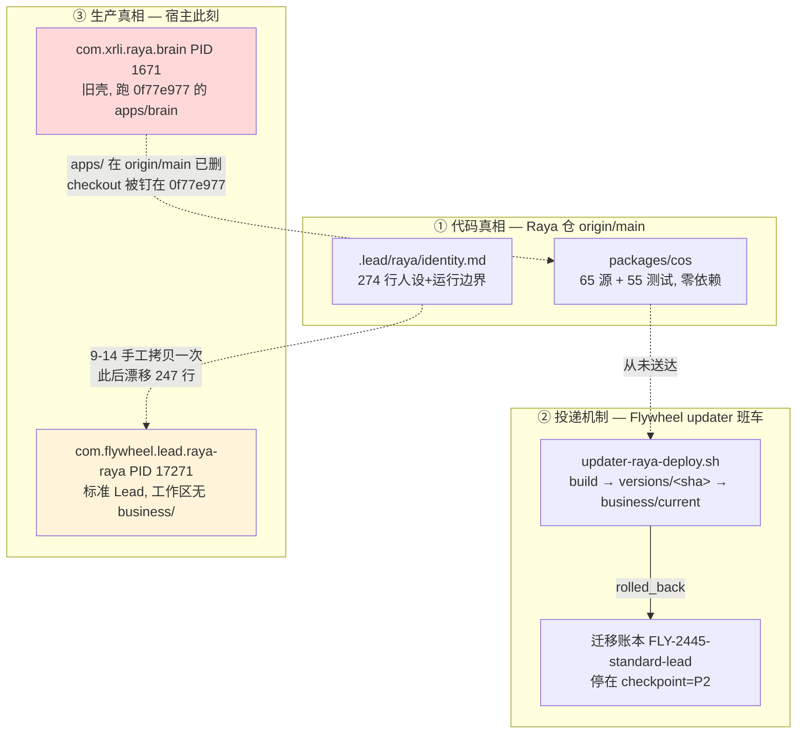

# FLY-2680 Raya 并仓设计 — 探索

Issue: FLY-2680 (https://linear.app/geoforge3d/issue/FLY-2680/raya-并仓设计-迁移方案packagescos-并入-flywheel-仓的边界加载方式旧机制拆除清单割接与回滚后续子单拆分)
日期: 2026-09-17
基于: 无

> 本页只做问题框定、选项与未决点。所有带行号的现状证据在 `research.md`;
> 可照着拆单施工的步骤在 `plan.md`。本节点只读调查 + 文档,不改任何代码、
> 不动生产、不碰 Raya 仓、不重启。

## 1. founder 已拍板的前提

founder 2026-09-17 20:29Z 在 Epic FLY-2679 拍板「搬」。本单不再论证要不要搬,
只产出一份能直接照着拆单施工的迁移方案。

**未验证**:Linear MCP 本会话 401 鉴权失败(`linear-api (AUTH_HEADER_REJECTED)`),
Epic FLY-2679 的正文与 founder 原话无法从本会话读取;本页对 Epic 范围的引用
全部来自本单 issue 描述中的转述。

## 2. 为什么这一单不是普通的「搬个包」

工单原文假设 `packages/cos` import 了 Flywheel 内部模块(点名 `meeting-voice.ts`、
`summary-workflow.ts`),需要在并仓后改成 workspace 依赖。**这个前提经全量核查不成立**
(证据见 research §3):cos 是一个零运行时依赖、零外部 import、零 `process.env` 的纯包,
通过 `ports.ts` 接受注入,依赖方向本来就是单向的 Flywheel → cos。

真正的难点在另一侧:**cos 从来没有在生产被加载过。**

- 标准 Lead 载体今天从 `<workspace>/business/current` 这个符号链接加载业务包;
- 唯一会创建这个符号链接的东西,是 `scripts/lib/updater-raya-deploy.sh` —— 也就是
  本单要拆掉的那套旧机制;
- 而活工作区 `~/Dev/raya-lead-workspace/` 里**根本没有 `business/` 目录**,
  因为那条部署路径一直在 `rolled_back`。

所以本单的形状是:**把「唯一一条会投递 cos 的路」换掉,而不是在两条已经跑通的路之间做迁移。**
这直接决定了割接顺序:并仓本身不能让 Raya 掉线,因为**今天在回 #raya 的根本不是 cos**。

## 3. 现状的三层错位(这是方案要解决的真问题)

三层错位具体是:

1. **代码 ≠ 部署**:Raya 生产 checkout 落后 origin/main 105 个 commit,且被钉死——
   因为旧壳需要 `apps/brain/dist`,而 `apps/` 在 origin/main 上已被 FLY-2445 删除。
   一旦 checkout 前移,旧壳就再也起不来。
2. **人设 ≠ 活体**:标准 Lead 工作区里那份 `identity.md` 是 9-14 手工放的,
   与 origin/main 差 247 行、落后 3 个 commit。班车本来负责投影它,但班车没跑成。
3. **两个 Raya 同时在线**:旧壳和标准 Lead 此刻都 loaded。宿主 08:55 重启后
   launchd `KeepAlive` 把旧壳又拉了回来。

## 4. 方案空间

### 4.1 代码搬家的形态

| 选项 | 说明 | 取舍 |
|---|---|---|
| **A. 只搬 `packages/cos` 源码,不带 git 历史** | 在 Flywheel 开一个新包目录,把 origin/main 的 120 个文件原样落盘,一个 commit | 最简单;丢掉 cos 的 commit 历史(该包只有 5 个代码 commit,损失小);Raya 仓 git 历史里的 2.3MB `silero_vad.onnx` 等大文件不会污染 Flywheel |
| B. `git subtree` / `filter-repo` 保历史 | 保留 457 条历史 | 会把 FLY-2031 语音时代的大二进制带进 Flywheel;cos 只有 5 个代码 commit,不值 |
| C. 把整个 Raya 仓并进来(含 `summaries/`) | 一步到位 | `summaries/` 是 94% 的提交流量、机器人持续开 PR,并进主仓会与 Flywheel 代码 PR 抢同一条 CI 队列和同一个 main;且 R1 窄豁免的「仅 `summaries/` 前缀」机器条件会横跨两类内容 |

倾向 **A**,且明确**不搬 `summaries/`**(见 §4.3)。

### 4.2 包名与位置

Flywheel monorepo 的 `pnpm-workspace.yaml` 只收 `packages/*`,现有 23 个包里 22 个用
`flywheel-` 前缀。`@raya/cos` 这个名字进来后:

- 位置:`packages/raya-cos/`(目录名避免和 `.lead/flywheel-cos-lead` / `cos-lead` 概念混淆)
- 包名候选:`flywheel-raya-cos`(随大流)vs 保留 `@raya/cos`(改名要动 CI filter、
  `verify-business-package.mjs`、可能还有 Raya 仓内引用)

这是需要定的一个点,不是阻塞点。

### 4.3 `summaries/` 与 R1 窄豁免必须原样留在 Raya 仓

「各 Lead 交 summary → Raya 仓 `summaries/` PR → merge = 已阅」这条机制的豁免
依赖两条机器可检条件(前缀 `summaries/`、无可执行文件)。把 `summaries/` 搬进
Flywheel 主仓会同时破坏三件事:

1. 豁免的前缀条件从「这个仓所有非豁免 PR 都走 founder」变成「同一个仓里两套权限」;
2. 每条 summary PR 都会触发 Flywheel 全量 CI(Raya 仓的 CI 只有一个 15 分钟的 business job);
3. `flywheel-comm summary` 的目标仓变了,已合入的 48 份 summary 的 PR number / head / base 断链。

**结论:`summaries/`、`.lead/raya/identity.md`、`README.md`、`engineering/doc/`、
`probes/`、`assets/` 全部留在 Raya 仓;`raya-memory` 仓不动。** Raya 仓并不消失,
它退化成「人设 + summary 收件箱」仓。

### 4.4 加载方式:三条候选路

旧路(`business/current` 符号链接 + 跨仓 build + 迁移账本)拆掉之后,cos 怎么到达载体?

| 候选 | 说明 | 风险 |
|---|---|---|
| **L1. 随 Flywheel 主仓部署,载体按包名解析** | cos 变成 Flywheel 的一个普通 workspace 包,跟着班车一起 build/部署;载体用现有的包解析而不是符号链接 | 需要确认载体对「业务包」的解析点在哪、是否可选分支;其他 Lead 必须零影响 |
| L2. 保留 `business/current` 符号链接,但由 Flywheel 班车指向 monorepo 内的 dist | 改动最小 | 留着一条只为 Raya 存在的特判路径,和「拆旧机制」的目标相悖 |
| L3. 载体完全不加载业务代码,cos 只作为 CLI 被 Lead 调用 | 最解耦 | 与 `verify-business-package.mjs` 断言的 `import(dist/index.js)` 契约不符 |

倾向 **L1**,但必须先读清载体侧的解析代码(调查中)。

## 5. 割接的核心约束

1. **生产 Raya 不停摆**:但要先厘清「不停摆」指什么——今天在回 #raya 的是旧壳还是
   标准 Lead?两者都 loaded,需要定位实际的出站身份。
2. **不等 FLY-2657,也不阻塞它**:2657 还在 implement(4/6),修的是旧机制的割接恢复。
   本方案必须给出「2657 成功」与「2657 失败」两条衔接路径。
3. **旧壳的自然死亡**:一旦 Raya checkout 前移离开 0f77e977,旧壳因为 `apps/` 已删
   而无法再起。这既是风险也是杠杆。

## 6. 权限面的两类改动

| 类别 | 例子 | 谁能合 |
|---|---|---|
| Flywheel 仓普通代码/文档 | 新包、拆脚本、改 CI | 正常 PR 流程 |
| `packages/teamlead/lead-rules-base/*` | `founder-only-authority.md` R1 段、`summary-inflow.md` 的回执句 | 需要 founder 按卡(待确认机制) |
| Raya 仓非 `summaries/` PR | 删 `packages/cos`、改 `verify-business-package.mjs`、改 CI | 不适用自合豁免,走 founder |

「她要按几次卡」是 founder HTML 第一屏必须答的数字。

## 7. 未决点(需要在 research/plan 收口)

1. 载体 `codex-lead-tui-runtime` 侧对业务包的解析点与可选性 —— 调查中
2. `lead-rules-base` 的变更是否真有「founder 按卡」的机器闸,还是只是约定 —— 调查中
3. 旧机制逐项的拆除顺序与「必须等新路径验收后才能拆」的分界 —— 调查中
4. cos 包名是否改成 `flywheel-raya-cos`
5. Raya 仓非 summaries PR 的具体合入人与流程
