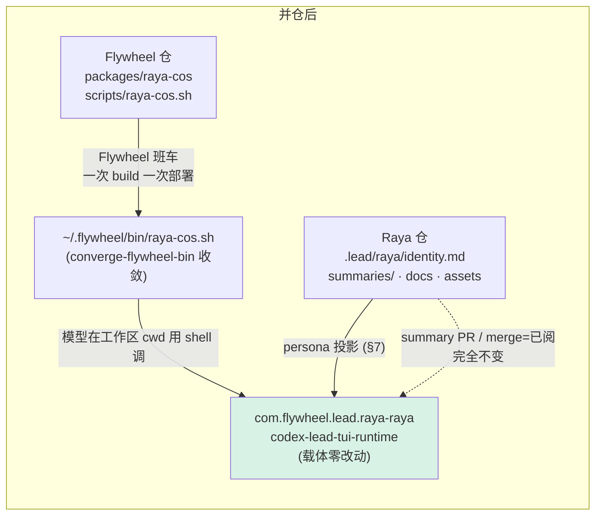
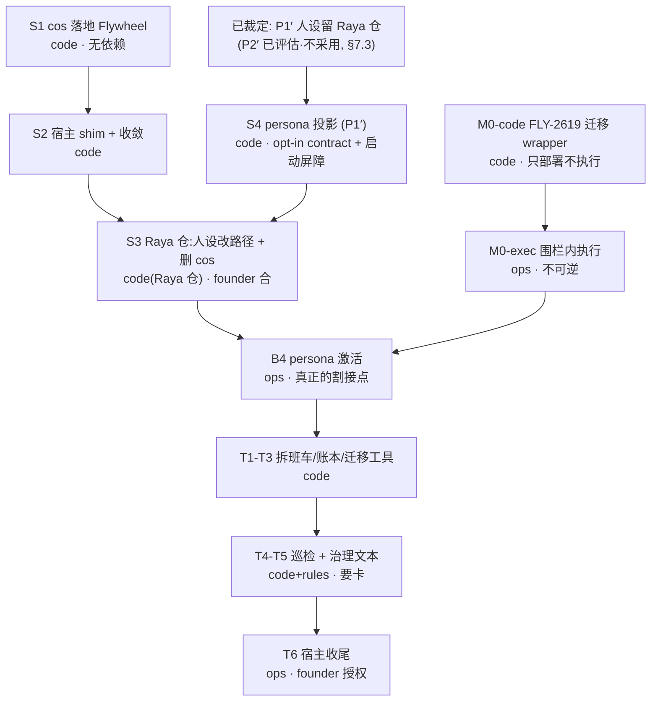

# FLY-2680 Raya 并仓设计 — 实施计划(拆单施工书)

Issue: FLY-2680 (https://linear.app/geoforge3d/issue/FLY-2680/raya-并仓设计-迁移方案packagescos-并入-flywheel-仓的边界加载方式旧机制拆除清单割接与回滚与后续子单拆分)
日期: 2026-09-17
基于: exploration.md, research.md

> 本节点**只设计**。不改代码、不动生产、不碰 Raya 仓、不重启、不申请 ship。
> 下面每一条施工指令都可以原样交给子单执行;所有现状依据在 `research.md`,带 file:line。
>
> **版本**:v5。四轮 Codex 设计评审共 26 条,**全部已独立复核属实并采纳,无驳回**。
>
> **R1(6 条)**:① FLY-2619 迁移升级为硬闸 M0(§7A);② persona 方案重写为 P1′/P2′(§7.2);
> ③ packaged payload 显式排除(§6.2);④ T2/T3 补齐遗漏消费者(§9.2);
> ⑤ 更正「零 `process.env`」的事实表述(§2、research §2);⑥ 修正 S2 回滚合同(§10.2)。
>
> **R2(7 条)**:① **v2 把 M0 排在 persona 激活之后是错的** —— §10.2 重排为
> 「阶段 A 纯增量 / 阶段 B 带并发围栏的 activation window / 阶段 C 拆除」(这是本轮最重的改动);
> ② M0 的幂等复验 / durable receipt / crash recovery 落成可执行合同(§7A.2 M-1…M-6),
> 并裁定**复用现有 CLI 加一层 wrapper,不重造第二套迁移实现**;
> ③ 清掉 §9.1 / §10.2 里残留的 `origin/main` 比较(与 P1′ 的 exact-commit 冲突),
> 补 P1′ 的 fail-open 与 path 守卫、P2′ 的 capability-v2 消费者;
> ④ packaged 阴性测试改为预置-再断言删除(避免 vacuous pass);
> ⑤ S2 retired 裁定走方案 (a) + **forward rollback**;
> ⑥ 补条件式授权账本(§11.1a);⑦ 清掉会误导执行者的旧锚点。
>
> **R3(7 条,其中 4 条是 v3 自身的合同矛盾)**:
> ① **B2 的围栏不变量写错了** —— summary round 的生产者在常驻 Bridge 的 GatePoller 里
> (`gate-poller.ts:846-860` → `summary-absorption-rider.ts:819-840`),停 Raya Lead 进程并不会
> 停止它,所以「max seq 不动」不是合法验收;围栏重写为「**停止消费**而非停止产生」,
> 并加了 pre-transport persona-digest 启动屏障(§10.2 B2);
> ② **打破 S3 / M0 / §9.1 的依赖环** —— M0-exec 是 persona 激活 B4 的前置,不是 S3 merge 的前置;
> §9.1 只约束 T1–T6(§7A、§9.1、§12);
> ③ **裁定 P1′ 为 plan of record,P2′ 降为「已评估、不采用」**(§7.3,Lead 2026-09-17 裁定);
> ④ 修正授权总账的自相矛盾,B1 拆成「冻结→授权→merge→复核→pin」四小步(§1、§10.2、§11.1a);
> ⑤ receipt 时间语义(M-4b,非阻断);⑥ 不要复用 `identityDigest` 证明 persona bytes(非阻断);
> ⑦ 清掉残余旧文案。
>
> **R4(6 条,3 阻断全是「正文已定的合同没传播到 §11 合计行 / §12 子单表」)**:
> ① S4 的 fail-open 改成**分阶段**硬约束(B3 前后不同,§12);
> ② S3 的验收去掉激活后才可能出现的证据(否则又是一个验收依赖环,§12);
> ③ §11 合计行改成「仅 PR 计数」并显式指向 §11.1a 的完整账本;
> ④ **事实更正**:「暂停 > 一个 cadence 必丢」不精确 —— 精确条件是
> 「覆盖了某个 slot 的 first-beat grace」或「未结算 slot 老化出 previous-slot 窗口」(§10.4);
> ⑤ **事实更正**:absorption pass **不是** Raya 专属,`runSummaryDueFirstBeat` 对全量 producer 建行(§10.4);
> ⑥ cursor 证据改成机制性描述,不再引用会漂移的条目数(§10.5)。
> R4 复核结论:R1 六条全部保持关闭;R2 七条中五条保持关闭,另两条的回归即上面的 ①②③,已修。

---

## 1. 一句话

**搬**一个 120 文件、零依赖的纯包 `packages/cos` 进 Flywheel;
**留**下 Raya 仓的人设、`summaries/` 收件箱与历史文档;
**删**掉一整套只为跨仓部署而存在的班车、迁移账本、部署回执与巡检事实行;
founder 的动作是 **7 张 Flywheel ship 卡** + **1 次 Raya 仓 merge 授权**
+ **1 次 activation-window 逐实例运维授权(含 exact-commit pin)** + **1 次宿主收尾授权**
—— 完整条件式账本见 §11.1a,**不要只记「7 次卡」这个数**。

## 2. 两处必须先说清的前提纠正

| 工单原文 | 核实结果 | 对方案的影响 |
|---|---|---|
| 「`packages/cos` 现在 import 了哪些 Flywheel 内部模块(至少 `meeting-voice.ts`、`summary-workflow.ts`),并仓后改成 workspace 依赖」 | **不成立。** cos 零运行时依赖、零外部 import、**非测试代码零 `process.env` 读取**(唯一一处在测试 fixture `raya:packages/cos/src/portfolio/goal-store.test.ts:47`,给 `execFile` 子进程合并环境);两个点名文件的 import 全是 `node:crypto` + 包内相对路径(research §2) | 不存在「改成 workspace 依赖」这项工作;也没有反向依赖或循环 |
| 「与今晚 FLY-2657 切换(旧机制最后一次使用)的衔接」 | **「今晚」未验证。** FLY-2657 不是切换,是恢复断点修复;仍 `implement 4/6`,本地分支无 PR,其 plan `:14` 明言不运行班车/不更新 checkout/不重启(research §7.5A) | 方案按「2657 何时落地、是否落地都不确定」设计,见 §9.4 |

另有一项工单列入拆除清单但**在 main 上不存在**:FLY-2654 Part B 只在未合入的
分支 `flywheel-FLY-2654` 上,且已自行关闭并被 FLY-2679 取代(research §7.5B)。
本方案对它的唯一动作是请 Lead 裁定那份 docs-only 分支合还是弃。

## 3. 目标形态



对比今天:没有第二个 checkout、没有第二次 build、没有 `business/current` 符号链接、
没有 `.flywheel-managed/versions/`、没有迁移账本、没有 Raya 专属部署回执、
没有 `raya checkout=` 巡检事实行、没有逐-SHA 的 founder 授权令牌行。

---

## 4. 边界清单(逐目录/文件的处置)

### 4.1 进 Flywheel

| Raya 仓路径(`origin/main`) | Flywheel 目标 | 施工要点 |
|---|---|---|
| `packages/cos/src/**`(120 `.ts`:65 源 + 55 测试) | `packages/raya-cos/src/**` | 原样落盘,**一个 commit,不带 git 历史**(理由见 §4.4) |
| `packages/cos/package.json` | `packages/raya-cos/package.json` | 改 `name`、补 `test:run`(§5.2) |
| `packages/cos/tsconfig.json` | 同上 | `"extends"` 必须由 `../../tsconfig.json` 改成 **`../../tsconfig.base.json`** —— Flywheel 仓根**没有** `tsconfig.json`,只有 `tsconfig.base.json`(参照 `packages/voice-core/tsconfig.json:2`)。照抄原文件会直接 build 失败 |
| `packages/cos/README.md`(319 行) | 同上 | 更新 `:9` 钉的 extraction SHA;把「business/current」的描述改成新调用形态 |
| `scripts/verify-business-package.mjs`(148 行) | **不搬,退役**(§5.4) | 它的六条断言在 Flywheel 里被更强的既有闸覆盖 |

### 4.2 留在 Raya 仓

`.lead/raya/identity.md`(274 行,但 `:157-174` 要改路径,见 §6)、
`summaries/**`(48 文件)、`README.md`(228 行,要改写)、
`engineering/doc/**`(37)、`probes/**`(26)、`assets/**`(2)、
`biome.json` / `package.json` / `pnpm-workspace.yaml` / `tsconfig.json` / `pnpm-lock.yaml`
(就地瘦身)、`.github/workflows/ci.yml`(就地改,删 cos 相关两步)。

`xrliAnnie/raya-memory` 仓**完全不动**。

### 4.3 为什么 `summaries/` 一定要留

三条各自独立的硬理由(research §1.1、§4):

1. **流量**:FLY-2445 之后 104 个 commit 里 98 个(94%)是 summary inflow,
   作者是机器人 `Flywheel Summary <flywheel-summary@localhost>`。
   并进 Flywheel 主仓 = 每天几十条 PR 抢 Flywheel 的 main 与全量 CI
   (Raya 仓自己的 CI 只有一个 15 分钟的 `business` job)。
2. **豁免的机器条件**:R1 窄豁免的第一条是「every file changed by the PR lies under
   the single fixed prefix `summaries/`」(`founder-only-authority.md:129`)。
   一旦同仓既有 `summaries/` 又有 Flywheel 全部代码,这条前缀条件就从
   「整仓语义」退化成「同仓两套权限」,而 Flywheel main 上还压着
   `required_status_checks:["CI OK"]` 与 `enforce_admins:true`。
3. **已合入证据的连续性**:47 份 summary 的 PR number / head / base
   与 `state/summary-merge-receipts.jsonl` 的回执绑在 `xrliAnnie/raya` 上。

### 4.4 为什么不带 git 历史

Raya 仓 457 个 commit 里,`packages/cos` 只有 5 个代码 commit;
而历史中带着 FLY-2031 语音时代的大二进制(`apps/voice/**` 含 2.3MB `silero_vad.onnx`)。
`git subtree`/`filter-repo` 会把这些拖进 Flywheel。
**做法**:在 Flywheel 的落地 commit message 里写明来源
`xrliAnnie/raya@90e433e87a68287ed59ba64f2584e3a6bc0da151:packages/cos`,
并在 `packages/raya-cos/README.md` 顶部留一行 provenance;历史留在 Raya 仓可查。

---

## 5. 包名、位置与 CI 接入

### 5.1 位置与名字

- 目录:`packages/raya-cos/`
  (不用 `packages/cos/` —— Flywheel 里 `cos` 已被 `flywheel-cos-lead` / `cos-lead` 占用为
  「Chief of Staff Lead」概念,`scripts/__tests__/flag-governance-cos-contract.test.sh`
  读的就是 `.lead/flywheel-cos-lead/identity.md`)
- 包名:`flywheel-raya-cos`
  (23 个现有包里 22 个用 `flywheel-` 前缀;唯一例外是 `@flywheel-ai/onboard`)
- bin:`raya-cos` → `dist/cli.js`(沿用 Raya 侧的 bin 名,人设里那句
  「Do not assume a `raya-cos` executable is installed on PATH」到 §6 一并改掉)

### 5.2 package.json 必须补的 script

Flywheel 的两个发现器都按 `scripts["test:run"]` 认包:

| 发现器 | 依据 |
|---|---|
| CI `light` shard | `.github/workflows/ci.yml` unit-tests 矩阵 `light`:`pnpm --filter './packages/*' --filter '!flywheel-teamlead' --filter '!flywheel-claude-runner' --filter '!flywheel-comm' --filter '!flywheel-edge-worker' test:run` |
| 本地/CI package gate | `scripts/package-gate.mjs:149-154` `readdirSync(packages).filter(pkg => pkg?.scripts?.["test:run"])` |

而 `raya:packages/cos/package.json:13` 只有 `"test": "vitest run"`。
**必须补 `"test:run": "vitest run"`**,否则这个包会静默地不进任何 CI 车道
(这正是 memory 里记的那类「看着接上了其实没跑」的坑)。
`build` / `typecheck` 已有(`:11,:14`),与 Flywheel 的 `pnpm -r build` / `pnpm -r typecheck` 兼容。
`lint` 可删(Flywheel 根 `biome check` 覆盖全仓)。

### 5.3 落地后必须为绿的命令(子单 QA 判据)

```bash
pnpm install --frozen-lockfile
pnpm -r build
pnpm --filter flywheel-raya-cos test:run      # 55 个测试文件
pnpm typecheck
pnpm lint
node scripts/package-gate.mjs                  # receipt 里必须出现 flywheel-raya-cos
```

### 5.4 `verify-business-package.mjs` 退役理由(逐条对照)

| 它的断言 | 依据 | 并仓后由谁覆盖 |
|---|---|---|
| artifact 只含 identity + cos manifest + dist | `raya:scripts/verify-business-package.mjs:61-69` | 不再有 artifact 概念 |
| 运行时依赖数为 0 | `:73-77` | 新增一条 Flywheel 侧守卫:`packages/raya-cos/package.json` 不得有 `dependencies`(建议做成 `scripts/__tests__/` 里的小 node:test) |
| 无陈旧 dist(每个 `.js/.d.ts` 都有同名 `.ts` 源) | `:78-89` | `pnpm -r build` 从干净 checkout 产出,CI 不复用 dist |
| 空环境能 `import(dist/index.js)` | `:90-96` | `test:run` 的 55 个测试文件本身就加载全部导出 |
| CLI 三条行为(`daily-report-date`/`status`/`daily-report-migration-plan`) | `:102-121` | **必须保留**:移植成 `packages/raya-cos/src/cli.test.ts` 里的三条用例(`raya:packages/cos/src/cli.test.ts` 已存在,确认是否已覆盖;未覆盖就补) |
| symlink 拒绝 | `:26-28,:52-55` | 不再有复制步骤 |

---

## 6. 加载方式

### 6.1 现状(必须先接受的事实)

标准载体 `codex-lead-tui-runtime` **不加载任何业务代码**。cos 的真实调用形态,
写死在 Raya 人设 `raya:.lead/raya/identity.md:157-174`:

```
run these commands from the registered business workspace (not the Codex home):
    node business/current/packages/cos/dist/cli.js status
    node business/current/packages/cos/dist/cli.js resume  --input state/cos/resume-input.json
    node business/current/packages/cos/dist/cli.js prepare --input state/cos/prepare-input.json
    node business/current/packages/cos/dist/cli.js record  --input state/cos/record-input.json
… Do not assume a `raya-cos` executable is installed on PATH.
```

即:**模型在 Lead 工作区 cwd 下用 shell 跑一个 CLI**。`business/current` 这个相对路径
是旧班车符号链接布局的产物,由 `scripts/lib/updater-raya-deploy.sh:775-778` 创建。
活工作区里**没有** `business/` 目录,活体 identity.md 里**也没有这一段**
—— 生产 Raya 从未被告知要跑 cos。

### 6.2 并仓后的加载路径(推荐 L1:收敛 shim)

新增 `scripts/raya-cos.sh`,形如:

```sh
#!/bin/bash
set -euo pipefail
# 沿用 flywheel-lead.sh:42-56 的同一套 host-config 定位法
state="${FLYWHEEL_STATE_DIR:-$HOME/.flywheel}"
lib="$state/bin/lib/host-config.sh"
[ -f "$lib" ] || lib="$(cd "$(dirname "${BASH_SOURCE[0]}")" && pwd)/lib/host-config.sh"
source "$lib"; host_config_load >/dev/null
exec node "$FLYWHEEL_DIR/packages/raya-cos/dist/cli.js" "$@"
```

接进现有分发机制:

| 动作 | 位置 |
|---|---|
| 加进收敛清单 —— **只加 monorepo 分支** | `scripts/converge-flywheel-bin.sh:81` 的 `FILES`(**不要加 `:92` 的 packaged 分支**,见下) |
| 加进首次采纳白名单 | `scripts/converge-flywheel-bin.sh:155` |

> 🔴 **packaged 分支必须显式排除(Codex R1#3,已复核)。**
> shim 无条件执行 `$FLYWHEEL_DIR/packages/raya-cos/dist/cli.js`,
> 但 `scripts/package-onboard.sh:47` 的 `PO_PACKAGES` 是一份**固定的客户 MVP 运行时闭包**
> (`teamlead edge-worker core config flywheel-comm claude-runner agent-team-transport
> inbox-mcp terminal-mcp token-usage github-event-transport linear-event-transport
> slack-event-transport voice-core voice-bridge voice-codex release-contract`),
> **不含 `raya-cos`**;打包循环只复制该列表,compat mirror 也只按 payload 的 package map 建链接
> (`scripts/packaged/create-compat-mirror.sh:30-40,71-90`)。
> 若把 shim 加进 packaged 的 `FILES`,packaged 安装会得到 shim 却得不到它的目标文件。
>
> **裁定:Raya 是 Annie 自托管宿主独有的 Lead,不属于客户 MVP 运行时 ⇒ `raya-cos` 不进 `PO_PACKAGES`,
> shim 也不进 packaged 分支的 `FILES`。**
>
> 🔴 **阴性测试不能用空夹具(Codex R2#4)。** 真实的 `$STATE_DIR/bin` 跨版本、
> 跨 monorepo/packaged 形态**持久存在**;如果这台宿主之前用 monorepo 分支装过
> `raya-cos.sh`,packaged 的 `FILES` 里不列它只意味着「不管理」,**不会自动删除**。
> 空目录测试即使通过也是 vacuous pass。
>
> **正确的阴性测试**:先**预置**一个 mode 555 的旧 `bin/raya-cos.sh` 和对应 adoption marker,
> 再跑带 `.flywheel-prebuilt` 哨兵的 converger,断言**两者被精确删除并验证消失**,
> 同时断言**未知的普通文件不被删**。这样才把「不打包」升级成「packaged 终态不残留」。
> (若 Lead/founder 反过来决定要进 packaged,则必须同时改 `PO_PACKAGES`、payload allowlist、
> compat mirror、`package-onboard`/`packaged-seams` 测试,并按 `scripts/package-onboard.sh:84-86`
> 的要求给 `engineering/doc/FLY-1062-npm-distribution/packaged-path-audit.md` 补一行 audit row。)

**为什么这条路对**:

1. `FLYWHEEL_DIR` 是宿主级既有真相:`scripts/lib/host-config.sh:104-106`
   逐字段 `ENV > host.json > 默认 $HOME/Dev/flywheel`,`:147` 导出。
   本机 `~/.flywheel/host.json` 不存在,走默认值。
2. `host-config.sh` 已被收敛进 `~/.flywheel/bin/lib/`(实测存在)。
3. `converge-flywheel-bin.sh` 的不变量(内容校验和等于 repo 源 **且** mode 555,
   `:15-27`)自动覆盖这个 shim —— 不用新造任何一致性机制。
4. **载体零改动 ⇒ 对其他 Lead 零影响是结构性的**,不依赖任何 if-present 守卫。

**人设里的绝对路径**:`~/.flywheel/bin/raya-cos.sh`。
不能靠 PATH —— `scripts/flywheel-lead.sh:8` 给 Lead 子进程设的 PATH 是
`~/.local/bin:~/.npm-global/bin:/opt/homebrew/bin:/usr/local/bin:$PATH`,**不含** `~/.flywheel/bin`。

**实施节点必须先验证的一件事**(设计层无法定论):
Raya 的 Codex `full-access` 沙箱是否允许执行 `~/.flywheel/bin/` 下、
且读取 `~/Dev/flywheel/packages/raya-cos/dist/` 下的文件
(工作区是 `~/Dev/raya-lead-workspace`,`resolveFullAccessProjectRoot`
拒绝与 `~/.flywheel`/state/Codex home 重叠的**工作区**,但这说的是 projectRoot,
不是可读可执行范围)。**未验证**。子单第一件事就是在隔离夹具里跑通这条。
若不通,退路 L2:把 dist 物化到工作区下一个固定目录(仍由 Flywheel 班车写,不恢复符号链接版本树)。

### 6.3 被否掉的两条

- **L2(保留 `business/current` 符号链接,只把它指向 monorepo 内 dist)**:
  会留下一条只为 Raya 存在的特判路径,与「拆旧机制」目标相悖。仅作 6.2 失败时的退路。
- **L3(载体 import cos)**:与 cos 的实际设计相悖 —— cos 的输出是
  「下一步让宿主跑什么工具」的指令对象(`raya:packages/cos/src/summary-workflow.ts:272`),
  本来就是给模型在回合内驱动的,不是给进程 import 的。

---

## 7. persona 投影:方案里唯一一个真正的开放决策

### 7.1 问题

人设留在 Raya 仓(工单要求),但**今天把它送到活工作区的也是旧班车**
(`scripts/lib/updater-raya-deploy.sh:763-772`,把 checkout 里的
`.lead/raya/identity.md` 原子写进 `<workspace>/.lead/raya/identity.md`)。
班车拆掉之后,没有任何东西负责这件事。

现场已经是失效状态:活工作区那份是 9-14 13:14 **手工**放的,
sha256 `4e982448…`,与 `raya:origin/main` 的 `ca1240f1…` **差 247 行、落后 3 个 commit**。
换句话说 —— **今天生产 Raya 跑的人设已经不是仓库里那份了**,这个问题在并仓之前就存在。

### 7.2 三个选项(v2 — Codex R1#2 后重写)

> **初稿被否掉的两点(已复核):**
> - 初稿 P1 用「`projects.json` 该 project 行有 `projectRepo` 且工作区有 `.lead/<lead>/`」
>   做**隐式**触发条件。实测 `jq '[.[] | select(.projectRepo != null)] | length, ([.[]]|length)'
>   ~/.flywheel/projects.json` → **7 / 7**,即全部 7 个 project 都有 `projectRepo`;
>   17 个 Lead 的 identity 目录也都存在。隐式触发会命中除 Raya 外的 16 个 Lead;
>   其中 13 份 identity 还是各项目 git worktree 里的 **tracked 文件**,
>   启动时从远端覆盖会污染正在工作的分支。这与「对其他 Lead 零副作用」直接冲突。
> - 初稿把 P2 说成「零新机制」也不对:载体把 system prompt 固定为
>   `${project_root}/.lead/${RUN_LEAD}/identity.md`(`scripts/flywheel-lead.sh:188`),
>   preflight 同样只看 project root;Raya 的 project root 仍是 `~/Dev/raya-lead-workspace`。
>   **只把文件放进 Flywheel 的 `.lead/raya/` 并不会让载体加载它。**

| 选项 | 做法 | 取舍 |
|---|---|---|
| **P1′(推荐)** | 新增一份**显式 per-project opt-in 的 identity source contract**,只给 raya 配:`{ repo, ref 或 approved commit, path, lastKnownGoodDigest }`。由 `lead-registry selector` 输出(`packages/flywheel-comm/src/commands/lead-registry.ts:1148-1219` **当前不输出 `projectRepo`**,必须显式扩字段),`flywheel-lead.sh` 在启动前按该 contract 浅克隆并原子写进 workspace | 没有 opt-in 的 project **一个字节都不写**;失败 fail-open 到 last-known-good + 可见告警 |
| ~~P2′~~ **(已评估·不采用,§7.3)** | 把 persona 搬进 Flywheel,并**同时**让 selector/preflight 明确选择 Flywheel 内的 canonical identity path,workspace cwd 保持不变 | 真正零网络、跟班车一起部署、受 main 保护;但要动 selector/preflight,**与工单边界冲突**,且需整体重推 §9–§12 |
| P3 | 维持现状(人工同步) | 已证明会漂 247 行;不推荐 |

**P1′ 的两条额外硬约束(Codex R2#3):**

- **fail-open 的对象必须是「verified last-known-good」,不是「workspace 里现有那个文件」。**
  回退前要证明:目标是普通文件(非 symlink)、大小受限、且 sha256 **恰等于** contract 的
  `lastKnownGoodDigest`;否则 **fail closed**。
- **`path` 必须固定为该 lead 的 identity path**,或做 traversal / symlink 拒绝 ——
  否则这个 opt-in contract 就变成了一个**任意文件投影器**。

**P2′ 漏掉的一个相邻消费者(Codex R2#3):**
Raya 今天没开 capability bundle v2,所以只改 selector/preflight/system-prompt path 对**今天**可行。
但 capability-v2 下 `packages/teamlead/src/lead-capabilities/default-runtime.ts:173-192` 的
`discoverLeadRuleSources` 会从 `projectRoot/.lead/<lead>/identity.md` 发现 persona,
而 TUI 在 v2 下用 capability parent 的 `baseInstructions`、**不用**普通 `systemPromptFiles`
(`packages/teamlead/src/lead-backends/codex/codex-lead-tui-runtime.ts:927-929`
`const baseInstructions = capabilityV2 ? capabilityParent!.baseInstructions : requirePersona(config)`)。
⇒ 若 P2′ 要做长期方案,必须把**同一个 canonical identity path 贯穿**
preflight、system prompt、skill/rule discovery 与 live digest 核验;
否则必须**显式禁止 Raya 在该方案补齐前启用 capability v2**。

**两案共同的激活权威问题(必须解决,不能留白)**:
Raya 仓 main **没有任何服务端保护**(`gh api repos/xrliAnnie/raya/branches/main/protection` → 404,
rulesets `[]`)。如果 P1′ 跟随可变的 `origin/main`,那么**任何一次 Raya 仓 main 变动都会在
Lead 下次启动时成为 full-access 系统提示**。因此 P1′ 的 contract 里
**`ref` 必须是一个经授权的精确 commit 或 digest,不能是 `main`**;
换 ref 本身即一次 founder 动作。P2′ 天然没有这个问题(走 Flywheel 的 PR + CI + main 保护)。

### 7.3 裁定:P1′ 采用;**P2′ 已评估、不采用**(v4,Lead 裁定)

**P1′ 是本方案的 plan of record。** §9、§10、§11、§12 的全部闸门、验证命令与授权账本
都按 P1′ 写死,不留条件分支。

**P2′ 降为「已评估、不采用」**,理由三条:

1. **与本单边界冲突。** 工单明确「`.lead/` 人设与规则留在 Raya 仓」。P2′ 要改这条边界。
2. **它不是换个字段名,是另一条顶层割接分支。** 选它必须整体重推
   §3 目标形态图、§4.2 边界清单、§9.1 第 2 条、§10.2 的 B1/B4、§11.1a、§12 的 S3 定位
   —— 为保留一个选项而维护两套互斥的施工书,会让「每条指令可以原样交给子单」这个承诺失效。
3. **它还有自己的前置没做。** capability-v2 下 persona 走的是
   `packages/teamlead/src/lead-capabilities/default-runtime.ts:173-192` 的 `discoverLeadRuleSources`
   与 `codex-lead-tui-runtime.ts:927-929` 的 `baseInstructions` 分叉,不是普通 `systemPromptFiles`。
   P2′ 要成为长期方案,得先把同一个 canonical identity path 贯穿
   preflight / baseInstructions / rule discovery / live proof,或显式禁止 Raya 启用 capability v2。

**P2′ 指出的那个真实风险,在 P1′ 里已经被单独处理了。**
风险是:Raya 仓 main **没有任何服务端保护**(`gh api repos/xrliAnnie/raya/branches/main/protection`
→ 404,rulesets `[]`),而人设是**直接进 full-access 系统提示**的。
P1′ 的对应措施是 §7.2 的三条:contract 的 `ref` 必须是**经授权的精确 commit**(不能是 `main`)、
fail-open 只回退 **verified last-known-good**、`path` 固定并拒绝 traversal/symlink。
换 pin 本身就是一次 founder 动作(§11.1a)。

> **留给 founder 的不是一个分叉,而是一条备注**:
> 「人设留在 Raya 仓已成书。若你希望把它搬进 Flywheel(那样它会受 main 保护 + CI 覆盖),
> 那是一张独立的后续单,需要重做本方案的 §9–§12 —— 现在不做。」

---

## 7A. M0 — FLY-2619 summary presentation 迁移(**persona 激活 B4 的硬前置**)

> Codex R1#1 提出、本节点已独立复核的**阻断项**。初稿把它写成「未验证、单独判断」,
> 那是错的:它不是可延后的清理,而是激活前置条件。
>
> 🔴 **精确说法(v4,Codex R3#2)**:M0-exec 是 **persona 激活(§10.2 B4)** 的硬前置,
> **不是 S3 merge 的前置**。v2/v3 把它写成「S3 的硬前置」,同时又让 S3 依赖 §9.1
> (而 §9.1 要求 persona 已激活、已走过一轮新 cos)——那是一个**依赖环**,
> 照着施工 S3 永远无法开始。三个节点必须分开:
>
> | 节点 | 何时 | 依赖 |
> |---|---|---|
> | **M0-code** | 阶段 A 的 A4,只部署不执行 | 无 |
> | **S3 merge** | **§10.2 的 B1**(A3/A4 之后即可准备与冻结;merge 本身在 B1 的第 3 小步,**仍在 B2 围栏之前**) | 因 opt-in / contract 仍 dormant,**merge 不激活** |
> | **M0-exec** | 阶段 B 的 B3,围栏内执行 | 是 **B4(persona 激活)** 的前置 |
>
> 并且 **§9.1 的四条前置只约束 T1–T6 的拆除,不挂在 S3 行上。**

### 7A.1 事实

| 事实 | 依据 |
|---|---|
| `begin()` 在 migration 行缺失或非 `complete` 时返回 `migration_required` | `packages/teamlead/src/bridge/summary-presentation-store.ts:595-602` |
| controller 把它变成 **HTTP 409** | `packages/teamlead/src/bridge/summary-presentation-controller.ts:187-196` |
| 旧班车在 standard-update 里**先**跑 `raya_migrate_summary_presentation`,成功后才 preflight/install | `scripts/lib/updater-raya-deploy.sh:994-1002`,实现 `:1022-1048` |
| 生产库里**没有** Raya 的 migration 行 | 只读副本查询:`summary_presentation_migration` 表存在,`SELECT COUNT(*)` = **0** |
| 新 persona 会调用该协议 | `raya:.lead/raya/identity.md` 的 summary 段要求 `lead_actions.summary_presentation` 的 `operation:"begin"`;**活工作区那份旧 persona 里没有这段** |

⇒ **按初稿的顺序,S3 一激活新 persona,Raya 第一次 `begin` 就会吃 409。**
这不是理论风险,是当前数据状态下的必然。

### 7A.2 M0 闸的合同(v3 — Codex R2#2 后收紧)

> **不要重造一套迁移实现。** `packages/teamlead/src/bin/raya-summary-presentation-migrate.ts`
> 已经是一个可直接执行的 CLI。M0 是**一次性**迁移 ⇒ 做法是给它套一层
> **受权 wrapper + 复验 + receipt**,成功并退役后连同 wrapper 一起删;
> 不要为了替代一个即将被删除的 updater 而永久维护第二套业务迁移实现。

**M-1. 复验不能靠现有实现的 early return。**
`packages/teamlead/src/bridge/summary-presentation-migration.ts:247-261` 在发现
`existing?.state === "complete"` 时**立即 return**,workspace canonicalization、
ledger/decisions 读取与 source digest 重算都在 `:263` 之后才开始。
所以「已 complete ⇒ no-op」成立,但「**验证输入 digest / boundary / 每个 disposition 后** no-op」
**不成立**。M0 的 complete fast path 必须自己重读 migration row、
所有 `seq <= boundary` 的 journal↔round 对应关系与 source digest,再判定 no-op。

**M-2. receipt 是硬闸,不是实现细节**(§9.1 第 4 条拿它当拆除前置)。
现有 CLI 只把 JSON 写 stdout(`packages/teamlead/src/bin/raya-summary-presentation-migrate.ts:97-101`),
**没有任何 durable receipt**。M0 必须定义:

- **绑定内容**:project/lead、DB 的 canonical path 与 identity、`boundary`、`cursor`、
  三类 source digests、各 disposition 计数、tool blob 摘要、Flywheel `deployed_sha`、
  workspace identity digest、执行时间、授权证据;
- **落盘形态**:普通文件(非 symlink)、`0600`、原子写(tmp + rename);
- **顺序**:DB `complete` → **独立只读复验** → 写 receipt。

**M-3. crash recovery 必须写明。**
DB 已 `complete` 但 receipt 写入前崩溃时:activation 仍然**阻塞**,
但重跑必须能**从 complete 的 DB 重建出同一份 receipt**,
且**不得**再次分类或改写任何已 finalized 的 row。

**M-4. 至少四条测试。**
① `building` 中断后续跑;② DB complete / receipt 之前崩溃;
③ receipt 之后重跑 **零写**;④ source/digest 漂移时 **fail-closed**。

**M-4b. receipt 的时间语义(实施注记,非阻断 —— Codex R3#5)。**
把**稳定的 migration completion time**(参与 receipt identity)与
**每次 wrapper 的 `generatedAt`**(不参与)分开;否则 M-3 的「重建同一份 receipt」
会因为时间戳不同而变成另一份业务证据。是否再做 file/directory fsync,
按仓库既有 durable-file helper 决定。

**M-5. 对 teardown 的约束(不变)。**
T1/T2 不得在 M0 证据成立前删除 `scripts/lib/updater-raya-deploy.sh:1025-1049`
这条唯一现有调用路径;T3 不得在 wrapper + 回归测试就位前删
`raya-summary-presentation-migrate.ts`。

**M-6. 回滚语义。**
persona 文件可以回滚,**但已完成的数据分类迁移不会反向迁移**。
M0 是本方案**第一个**不可逆点(第二个是 §10.3 的 checkout 前移)。
⚠️ 因此 §10 的回滚叙述不能再说「回到与今天等价的状态」——
M0 之后,DB 与新 round admission 已经不是今天的状态了。
cos 的回滚只应**回退 cos 命令路径**,保留与 complete migration 兼容的 summary contract。

## 8. 保持不变的东西(并仓后必须逐条仍成立)

| 机制 | 为什么不受影响 | 验证命令 |
|---|---|---|
| 各 Lead 交 summary → Raya 仓 `summaries/` PR | 目标仓常量 `packages/flywheel-comm/src/commands/summary.ts:23-24` 不动;交付走**临时浅克隆**(`summary-delivery.ts:263-292`),从不碰 `~/.flywheel/raya/code` | `node packages/flywheel-comm/dist/index.js summary --help` |
| merge = 已阅 | `summary merge` 的身份闸 `summary.ts:84-95`、校验器 `summary-pr-verifier.ts:193-221` 均不涉及部署 | — |
| R1 窄豁免两条机器条件 | `founder-only-authority.md:129`(`summaries/` 前缀)与 `:131-134`(无可执行/配置)**一字不改** | `bash scripts/__tests__/fly2030-summary-prefix-pair.test.sh` |
| 三处前缀声明一致 | `scripts/verify-summary-prefix-pair.sh:42-60` 抽取 Raya README ↔ `founder-only-authority.md` ↔ `summary-contract.ts` | `bash scripts/verify-summary-prefix-pair.sh --raya-repo ~/.flywheel/raya/code --raya-head <sha> --flywheel-repo . --flywheel-head <sha>` |
| `flywheel-comm summary` 的目标仓 | 不变(`xrliAnnie/raya`) | — |

> 🔴 改写 `founder-only-authority.md:94-114` 时的**硬约束**:
> 不得触碰 `:129` 那行,也**不得在文件任何地方新增第二处** ``single fixed prefix`` 措辞 ——
> `verify-summary-prefix-pair.sh:46-49` 要求恰好一条声明,多一条即失败。

---

## 9. 旧机制拆除清单与顺序

### 9.1 分界线:什么时候才能开始拆

> **适用范围(v4)**:本节四条**只约束 T1–T6 的拆除动作**,
> **不**是 S1/S2/S4/M0-code/S3-merge 的前置。把它们挂到 S3 行上会造成依赖环(§7A)。

**所有拆除动作的共同前置 = 下面四条同时为真:**

1. `~/.flywheel/bin/raya-cos.sh` 已收敛到位(mode 555 + 校验和等于 repo 源),
   且在宿主上 `~/.flywheel/bin/raya-cos.sh status` 返回 `{"operations":[]}` 形状;
2. 活工作区 `.lead/raya/identity.md` 的 sha256 **等于 contract 里那个经授权的精确 commit
   对应的 blob**(**不是** `origin/main` —— 见 §7.2 的激活权威;比可变 main 等于重新打开
   P1′ 要关的那个洞);
3. Raya 在一轮真实 summary 事件里实际调用过新入口(证据:cos 的 operation store 有新条目);
4. **M0(§7A)已完成**:`summary_presentation_migration` 里 raya 行 `state="complete"`、
   `cursor_seq == migration_boundary_seq`,且 §7A.2 M-2 的 receipt 已按合同落盘。

在这四条之前,**一项都不能拆** —— 理由见 research §5.10。
另外 T1/T2 对 `updater-raya-deploy.sh:1025-1049`(M0 的唯一现有调用路径)、
T3 对 `raya-summary-presentation-migrate.ts` 的处置,受 §7A.2 M-5 额外约束。

### 9.2 拆除顺序(每步一个可独立合入的 PR)

| 步 | 内容 | 必须同步改的东西 |
|---|---|---|
| **T1** | `scripts/update-flywheel.sh` 摘 6 个挂点:`:55-57`(source)、`:62`(`raya_configure_runtime_paths`)、`:99-117`(`raya_alert_dispatch`)、`:461`(`raya_lock_release`)、`:713-727`(scheduled/urgent 分支) | `scripts/__tests__/update-flywheel-sources.test.sh:42-47`(四个函数存在断言)、`:69-73`、`:76-79`、`:82-92`、`:100-131` |
| **T2** | 删 `scripts/lib/updater-raya-deploy.sh`(1241 行)、`scripts/lib/raya-standard-migration.sh`(61 行)、`scripts/__tests__/{updater-raya-deploy,raya-prestop,raya-standard-migration}.test.sh` | `.github/workflows/ci.yml:86-89`、`:749`(注释)、`:1139-1140`;`scripts/__tests__/ci-shell-suite-enumeration.test.sh`(每个 shell 套件必须字面枚举);`scripts/package-onboard.sh:129`、`scripts/package-onboard-files.allow:67`、`scripts/converge-flywheel-bin.sh:81,92,155` |
| | ⚠️ `raya-standard-migration.test.sh:82-104` 同时守着「四个旧 Raya 专属载体文件不得复活」。删它之前必须**把那条守卫搬到别处**(建议并入一个通用的 retired-entrypoint residue guard),否则等于悄悄撤掉一道防线 | |
| | 🔴 **T2 还必须同步下列字面钉住 `lib/raya-standard-migration.sh` 的消费者**(Codex R1#4,已用全仓 grep 复核):`scripts/__tests__/fly1577-cmux-bin-closure.test.sh`、`scripts/__tests__/converge-flywheel-bin.test.sh`(多处,含 600/555 mode 断言)、`scripts/__tests__/fly1577-alert-arrival.test.sh`、`scripts/__tests__/converge-fly1389.test.sh`、`scripts/__tests__/flywheel-lead-packaging.test.sh`、`engineering/doc/FLY-1062-npm-distribution/packaged-path-audit.md`。**另**:`packages/claude-runner/test/fixtures/kill-path-inventory.json:3759-3761` 有一条 `scripts/lib/updater-raya-deploy.sh` 的 kill-path 条目(初稿只列了 `raya-migration-io.ts` 的 `:1173-1177`),删 updater 时必须一并移除 | |
| **T3** | 删 `packages/teamlead/src/bin/raya-migration-{init,io,manifest,shuttle,resolve,proof,proof-evidence}.ts` + 同名 `.test.ts`、`packages/teamlead/src/bridge/__tests__/raya-standard-migration.test.ts` | fixture 登记:`packages/claude-runner/test/fixtures/kill-path-inventory.json:1173-1177`、`scripts/fly-2006-retention-consumer-gate.config.json:588-593`、`packages/teamlead/ci-test-costs.json:783,979` |
| | 🔴 `packages/teamlead/src/bin/raya-summary-presentation-migrate.ts`(FLY-2619)只被 `updater-raya-deploy.sh:1025-1049` 调用,而那正是 M0 的唯一现有入口(§7A)。**在 M0 有了另一个受管入口 + 回归测试之前,不得删、不得断这条路径。** | |
| **T4** | 巡检:删 `scripts/lead-patrol-snapshot.sh:140,145-149,1033-1187,1300-1311,1314` 的 Raya 段与事实行 | `scripts/__tests__/lead-patrol-snapshot.test.sh:48-51,182,1680-1827`;`packages/teamlead/src/__tests__/fly369-patrol-rule.test.ts:176-200`(锁定 runbook 锚文本) |
| **T5** | 治理文本(**lead-rules-base,要卡**):改写 `packages/teamlead/lead-rules-base/founder-only-authority.md:94-114`;改 `summary-inflow.md:21-25`;改 `packages/edge-worker/src/skill-templates/linear-issue-context.ts:32`;措辞 `packages/config/src/feature-flags/truth.ts:472`;runbook `lead-rules-base/runbooks/patrol-v1.md:194-207` 与 `legacy-token-savings/runner-patrol-rules.md:202-215`、`runner-patrol-rules.md:39,51` | `packages/teamlead/src/__tests__/lead-rules-bundle.test.ts:222-250`(钉了 7 条原文)、`packages/edge-worker/src/__tests__/SkillInjector.test.ts` |
| **T6** | **宿主侧收尾(运维,不是仓库改动,需 founder 授权)**:`launchctl bootout`+`disable` 并删除 `~/Library/LaunchAgents/com.xrli.raya.{brain,voice}.plist`;删 `~/.flywheel/bin/flywheel-codex-lead-wrapper-raya-tui-fullaccess.sh`(旧载体再入口,仓库守卫覆盖不到宿主 bin);归档 `~/.flywheel/raya/{deploy-receipt.json,deployed-sha,migrations/}`;删 `~/.flywheel/bin/lib/raya-standard-migration.sh` | 这一步才真正结束「两个 Raya 同时连着 Discord」 |

**T2/T3 的通用收口要求**(不要只靠上面的固定清单):
每个删除动作都要先跑一次基于被删 blob 的全仓引用闭包,例如

```bash
git grep -n -F 'lib/raya-standard-migration.sh'
git grep -n -F 'updater-raya-deploy'
git grep -n -F 'raya-migration-'
```

并把命中分成两类:**「过时断言,随删」** vs **「仍需保留的守卫,要搬走」**。
验收不能只跑 `ci-shell-suite-enumeration.test.sh`,至少还要跑上面 5 个直接测试、
kill-path inventory gate、`fly-2006-retention-consumer-gate`、
`package-onboard` / packaged audit gate。这样子单才是「可独立合入」,
而不是靠后续 PR 去修红。

### 9.3 T5 改写 `:94-114` 的具体口径

旧文本把「上线」定义成「生产 checkout 到目标 Raya SHA + `flywheel-lead.sh verify` +
`schemaVersion:2 / carrier:standard-lead` 回执」。并仓后这三样都消失,新口径应是:

- Raya 的业务代码随 **Flywheel 的** `~/.flywheel/deployed-sha` 一起上线,不再有第二个 SHA;
- Raya 仓的 PR 只影响人设 / `summaries/` / 文档,**其中人设的生效仍不等于合入**
  (P1′ 下生效点是 §10.2 的 B4:投影 + 启动屏障核验 live persona blob digest 通过,**不是 merge**);
- 删掉 FLY-2496 逐-SHA 授权令牌行(`:110-114`);
- **`:116-147` 窄豁免整段保留不动**。

### 9.4 与 FLY-2657 的两条衔接路径

| 情形 | 本方案的动作 |
|---|---|
| **2657 落地并成功完成一次切换**(账本到 P7、写出 v2 回执) | 最干净:此时旧壳已被 `raya_quiesce_legacy_owner` 停掉并 disable,`business/current` 也真的建起来了。§9.1 的前置条件 2(persona 一致)会被班车顺带满足。T1–T6 按原顺序走 |
| **2657 不落地,或落地后仍失败** | **本方案可以直接跳过旧切换。** 理由:新路径(§6.2 shim)完全不经过 `business/current`、迁移账本或 deploy receipt;`packages/raya-cos` 跟着 Flywheel 班车部署,与 Raya checkout 是否前移无关。此时 T6 要额外承担原本由 `raya_quiesce_legacy_owner` 做的事:手工 `launchctl disable + bootout` 两个 legacy job —— 这是 T6 本来就要做的动作,只是不再有账本时间戳 |
| 2657 正在飞、本方案的 T1/T2 同时想动同一批文件 | **禁止并行改 `scripts/lib/updater-raya-deploy.sh`。** T1/T2 必须等 2657 的 PR 合入或明确弃掉。S1/S2(§11)不碰这些文件,可以并行 |

**无论哪条路,本方案都不阻塞 2657**:S1–S4 全部不触碰 updater / migration / patrol 文件。

---

## 10. 割接与回滚

### 10.1 为什么「生产 Raya 不停摆」的风险比想象中低

今天在回 #raya 的是**标准 Lead**(PID 17271,今天 `state/presentation-event-119702/*` 有写入,
`lead-raya-raya.log` 13:38 仍在刷活跃 TUI 线程),它的能力来自 persona,**不来自 cos**
(cos 从未被加载,research §3)。所以:

- **S1/S2(把 cos 搬进来 + 建 shim)对生产 Raya 完全无感** —— 纯增量,没有任何东西改变行为。
- 真正改变行为的是 **§10.2 阶段 B 的 B3(M0 执行,不可逆)与 B4(persona 激活)**,以及 **T6(停旧壳)**。
  **S3 的 merge 本身在 dormant contract 下不改变生产** —— 合入 ≠ 激活,激活点在 B4。

### 10.2 步骤序列与每步的验证命令(v3 — Codex R2#1 后重排)

> **v2 的顺序是错的(已复核)。** v2 把「S4 persona 投影生效」放在第 3 步、M0 放在第 3.5 步。
> 但 `raya:origin/main:.lead/raya/identity.md` 的 summary 段**已经包含**新版
> group-level `summary_presentation` 合同 —— 所以**投影新 persona 就是激活**,
> 不是「只部署投影代码」。按 v2 的顺序,第 3 步本身就会重新制造 409。
>
> 而且**仅仅把 3 和 3.5 对调也不够**:
> `StateStore.appendSummaryPresentationRounds`(`packages/teamlead/src/StateStore.ts:21225-21251`)
> 在**同一个事务**里 journal 并 admit 每个新 summary event;
> `SummaryPresentationStore.admitRound`(`packages/teamlead/src/bridge/summary-presentation-store.ts:537-575`)
> 把 v2 round 直接写成 `eligible`;而 M0 只冻结**执行那一刻**的 boundary
> (`packages/teamlead/src/bridge/summary-presentation-migration.ts:283-301`)。
> 若 M0 完成后旧 persona 仍在线,**boundary 之后新产生的 eligible round 会被旧行为消费一次、
> 之后又被新 persona 领取一次** —— 重复/不一致呈现。
>
> ⇒ M0 与 persona 激活必须合成**一个连续的、带并发围栏的 activation window**。

#### 阶段 A — 纯增量,对生产零影响

| 步 | 动作 | 验证 | 回滚 |
|---|---|---|---|
| A0 | 记录基线 | `cat ~/.flywheel/deployed-sha`;`shasum -a 256 ~/Dev/raya-lead-workspace/.lead/raya/identity.md`;`launchctl list \| grep -i raya`;`sqlite3 <teamlead.db 只读副本> "SELECT COUNT(*) FROM summary_presentation_migration"` | — |
| A1 | S1 合入并随班车部署 | `pnpm --filter flywheel-raya-cos test:run`;部署后 `ls $FLYWHEEL_DIR/packages/raya-cos/dist/cli.js` | revert PR;生产无行为变化 |
| A2 | S2 合入并部署 | `ls -l ~/.flywheel/bin/raya-cos.sh`(mode 555);`shasum -a 256` 与 repo 源一致;`~/.flywheel/bin/raya-cos.sh status` 返回 `{"operations":[]}` 形状 | **forward rollback**,不是 `git revert`(见下) |
| A3 | **S4 代码部署为 dormant** —— 投影器/selector 扩字段都上线,但 **raya 尚未 opt-in**(或 contract 仍 pin 旧 identity commit) | 16 个非 Raya Lead 零写(阴性对照);raya 的 workspace identity digest **未变**(等于 A0 记录值) | revert PR;因为没有 opt-in,宿主状态本来就没被碰过 |
| A4 | M0 的受权 wrapper 合入并部署(**只部署,不执行**) | wrapper 的四条测试全绿(§7A.2 M-4);生产 DB **未被触碰**(`COUNT(*)` 仍等于 A0) | revert PR |

**阶段 A 结束时生产 Raya 完全未变**:旧 persona、旧 DB 状态、旧行为。

#### 阶段 B — activation window(一个连续窗口,不能中途停在半路)

| 步 | 动作 | 验证 | 失败处置 |
|---|---|---|---|
| B1 | **冻结 → 授权 → merge → 复核 → pin**(四小步,顺序不能换,见下) | 见下表 | 任一小步失败即不得进 B2 |
| B2 | **立消费围栏**(不是「停止产生」,是「停止消费」,见下) | 旧 Lead 进程与其 lease **均已消失**(`launchctl print` 报不存在 + `ps` 无该 PID + lease 记录已释放) | 围栏立不住就**不要开始 M0**,整个窗口推迟 |
| B3 | **围栏内执行 / 复验 M0**,冻结最终 boundary | `SELECT state,cursor_seq,migration_boundary_seq FROM summary_presentation_migration WHERE project_name='raya' AND lead_id='raya'` → `complete` 且两值相等;receipt 按 §7A.2 M-2 落盘并可读回 | DB complete 但 receipt 未落 ⇒ **停在此处**,按 M-3 重跑重建 receipt,**不得**解除围栏 |
| B4 | **原子更新** exact-commit contract → 投影 persona → 启动 Lead,**并由启动屏障在打开 inbox/transport 之前**证明加载的 persona blob digest 等于 B1 冻结值 | 屏障通过(digest 相等)才允许打开 transport;另在宿主侧独立核验一次 live 进程的 persona blob digest | 屏障 fail closed ⇒ **绝不打开 inbox**;fallback 见下;围栏不解除,报告并停 |
| B5 | **解除围栏**(= 新 consumer 正式开始消费) | 观察一轮真实 summary 事件:`summary_presentation begin` 返回 200(不是 409);cos operation store 出现新条目 | 只有 B4 屏障通过才允许到这一步 |

#### B1 的四小步(Codex R3#4 —— 不能先无授权 merge 再用 merge 后的 sha 补授权)

1. **冻结**:S3 PR 的 head 与**内容 digest**(`.lead/raya/identity.md` 的 blob sha256);
2. **获得 Raya 仓 merge 授权**(外仓授权,§11.1a);
3. **merge,并复核 landed blob 未变** —— ⚠️ 若平台用 squash/rebase,
   **PR head sha ≠ main commit sha**,所以授权对象必须绑定**可在 merge 后复核的内容/blob digest**,
   不能假设两个 sha 相等;
4. **获得 / 核对 exact-commit pin 授权**(P1′ 专有,§11.1a)。

#### B2 的围栏不变量(v4 重写 —— v3 的验收条件是错的)

> 🔴 **v3 把「停掉旧 Lead 进程」和「暂停 summary delivery」当成等价的二选一,
> 并统一用「`summary_presentation_rounds` 的 max seq 不动」验收。两者都错(已复核):**
>
> summary round 的**生产者在常驻 Bridge 内**,不在 Raya Lead 进程里 ——
> `packages/teamlead/src/bridge/gate-poller.ts:846-860` 独立触发 absorption tick,
> 该 pass 在 `packages/teamlead/src/bridge/summary-absorption-rider.ts:819-840` 调用
> `appendSummaryPresentationRounds` 并把事件放进 durable queue。
> **停掉 Raya TUI Lead 不会停止这个 Bridge writer**,新的 `eligible` row 仍会合法产生、
> max seq 会合法增长 ⇒ 拿 max seq 不动当验收会直接失败或逼人去停错的东西。
>
> 反过来,若围栏只是「进程不存在」,那么 **B4 一重启进程围栏就没了**,
> 而 v3 却要等进程起来之后才去外部核验 digest —— 中间那段竞态里,
> 排队的 summary event 可能被**错的 persona** 消费。

**正确的不变量(可验收)**:

> 从 **M0 开始之前**,到**新进程证明自己加载的是预期 persona blob 之前**,
> **旧 persona 不得 dequeue / 处理任何 Raya summary。**
>
> **新 round 继续被 journal / admit 是允许的** —— 它们留在队列里,
> 等新 persona 上线后消费即可。所以**不再**把「max seq 不动」作为验收条件。

**最小实现(S4 要带的 seam)**:

1. 停旧 Lead,并**证明旧 lease / process 已消失**(不是「发了停止命令」);
2. S4 增加一个 **pre-transport expected-persona-digest gate**:
   digest 不等于 B1/契约冻结值就 **fail closed,绝不打开 inbox**;
3. 只有该 gate 成功,才启动新 consumer。

> ⚠️ **实施注记(非阻断 —— Codex R3#6):不要复用现有 `identityDigest` 这个名字来证明 persona bytes。**
> `FLYWHEEL_LEAD_IDENTITY_DIGEST` 是 **registry identity 字段**的 SHA256
> (`packages/flywheel-comm/src/lead-identity.ts:111-127,459-464`),
> **并不哈希 `identity.md` / baseInstructions**;runtime assertion 发布的也是这个值
> (`packages/teamlead/src/lead-backends/codex/codex-lead-tui-runtime.ts:1693-1702`)。
> S4 要引入或复用一个明确的 `personaBlobDigest` / `baseInstructionsDigest`,
> 不要把 canonical identity digest 与 Git blob / 文件 SHA 混为一谈。
>
> 这个 seam 落在哪里是有现成位置的:TUI **已经在开 WS 之前**读 persona
> (`packages/teamlead/src/lead-backends/codex/codex-lead-tui-runtime.ts:904-929`),
> 但 `requirePersona`(`:521-537`)目前**只验证可读 / 非空**,不验证它等于授权 blob
> —— 这正是实施子单要补的那一刀。
>
> 若不走启动屏障这条路,就必须定义一个**独立的、能一直持有到 B4 核验完成**的
> per-lead delivery fence;**只「停进程」不够。**

#### B4 的 fallback:B3 之后**禁止** fail-open 回 A0 的旧 persona

P1′ 的 fail-open 语义是「回退 verified last-known-good」(§7.2)。
但 B3 之后,A0 那份旧 persona **已经不兼容 complete migration**(§10.2 回滚语义那节自己写了禁止)。
所以 B4 的「回到 pin」**必须明确指向一份冻结过的 migration-compatible fallback digest**,
而不是 A0。**如果没有冻结这样一份 fallback,B4 失败时只能 fail closed 停在围栏里,不得启动任何 persona。**
这一条必须在进 B2 之前就定下来。

#### 阶段 C — 拆除与收尾

| 步 | 动作 | 验证 | 回滚 |
|---|---|---|---|
| C1 | T1–T5 逐个合入 | 每个 PR 的 CI 绿;`bash scripts/__tests__/ci-shell-suite-enumeration.test.sh` + §9.2 的扩大套件 | 逐 PR revert |
| C2 | T6 宿主收尾 | `launchctl list \| grep -i raya` 只剩 `com.flywheel.lead.raya-raya`;`lsof -a -p <旧 brain pid> -i` 无输出;`~/.flywheel/bin/flywheel-codex-lead-wrapper-raya-tui-fullaccess.sh` 已删 | plist 已备份,但见 §10.3 的不可逆点 |

#### 回滚语义(更正 v2 的错误表述)

v2 写「回滚回到『Raya 不跑 cos』的今天状态 —— 与今天等价」。**这句话在 B3 之后不成立。**
M0 complete 之后,DB 的 round 分类与 admission 状态已经不是今天的状态了。

正确的回滚合同:

- **B3 之前**:可以完整回到今天(阶段 A 全是纯增量)。
- **B3 之后**:persona **文件**可回滚,**数据不可回滚**。
  cos 出问题时应当**只回退 cos 命令路径**(让 persona 不再调用 `raya-cos.sh`),
  **保留与 complete migration 兼容的 summary contract** ——
  不能把整个 persona 恢复到今天那份旧版本,因为旧版本不认识已迁移的数据形态。

> 🔴 **S2 的回滚合同(Codex R1#6,已复核)。**
> `scripts/converge-flywheel-bin.sh:202-215` 的主循环只遍历当前 `FILES` 并安装/校验列出的文件;
> 它**从不扫描 bin 目录去删除已从 `FILES` 移除的普通文件**。
> 所以 revert S2 的 PR 之后,`~/.flywheel/bin/raya-cos.sh` 与对应的 adoption marker
> 会变成**不受管理的残留**(和 §12.1 里那个 9-01 的旧 Raya wrapper 是同一个毛病)。
>
> **裁定(Codex R2#5):走方案 (a)** —— S2 在引入 shim 的同一个 PR 里,
> 给 converger 增加一份**精确的 `RETIRED_FILES` 清单 + 测试**,让它主动删除并**验证删除结果**。
> 方案 (b)(把清理推到 T6)不成立:S2 可能在走到 T6 之前就需要回滚。
>
> 🔴 **但 (a) 不能靠 `git revert` 自动生效。** 如果 retired 框架和 shim 在同一个 S2 PR 里引入,
> 直接 revert 整个 S2 会**连 retired 框架一起删掉**,converger 仍然不会清理宿主残留。
> 正确合同是 **forward rollback**:
>
> 1. **保留** retired 框架;
> 2. 另开一个回滚提交,把 `raya-cos.sh` 从 managed `FILES` **移到** 精确的 `RETIRED_FILES`;
> 3. 部署,并验证 `~/.flywheel/bin/raya-cos.sh` 与对应 adoption marker **确实消失**;
> 4. 之后才可以删除那条 retired 条目。
>
> packaged 分支可以在**当前版本就把这个名字视为 retired**,以闭合跨形态残留
> (见 §6.2 的阴性测试要求)。这套机制同时解决 §12.1 的第 2 条(9-01 那个旧 Raya wrapper)。

### 10.4 结论:割接窗口内 **不要** 暂停 Bridge 侧的 round 生产者

> Lead 点名要的明确结论。答案是 **不暂停,只围栏消费端**;而且**暂停生产者是更危险的那个选项**。

**为什么不需要暂停(三条,都已复核):**

1. **boundary 之后新产生的 round,本来就该是 `eligible`。**
   M0 只重分类 `seq <= boundary` 的历史;`admitRound`
   (`packages/teamlead/src/bridge/summary-presentation-store.ts:537-575`)
   把 v2 round 直接写成 `eligible` —— 这正是迁移完成后的稳态。生产者继续跑不会污染迁移结果。
2. **没有消费者时不会丢。** rider 在 journal+admit 之后把事件放进 durable queue
   (`packages/teamlead/src/bridge/summary-absorption-rider.ts:838-842`
   `deps.enqueueLeadEvent(leadEventEnvelopeFromJournalRow(durable, 2))`)。
3. **真正的危险是「错的 persona 消费它」,那是消费端属性**,由 §10.2 的 B2 围栏 +
   B4 启动屏障封死,与生产者无关。

**为什么暂停生产者反而危险(这条是新发现,不在 Codex 的三轮意见里):**

自动机制有**两个独立的窗口**,错过就补不回来(均已复核):

1. **first-beat grace**:`graceMs = Math.min(30 * 60_000, cadenceMs)`;
   due / skipped 行**只在** `nowMs < slotStartMs + graceMs` 时创建
   (`packages/teamlead/src/bridge/summary-absorption-rider.ts:775-779` →
   `runSummaryDueFirstBeat:311-330`)。错过这个窗口,代码只打一行
   `slot <...> first observed after grace; no due or absence judgment was created`
   (`:786-791`),**不会补建**。
2. **结算只回看两个 slot**:`[slotStartMs, slotStartMs - cadenceMs]`,
   且各自要满足 `nowMs >= candidate + graceMs`(`:800-802`)。
   一个已建行但未结算的 slot 一旦老化出 previous-slot 窗口,自动 pass 再也不会访问它。

⇒ **精确条件(v5 更正)**:只要暂停**覆盖了某个 slot 的 first-beat grace**,
或**让一个未结算的 slot 在恢复时已老化出 previous-slot 窗口**,
就会留下自动机制补不回来的缺口。
**「暂停 > 一个 cadence」既不是必要条件也不是充分条件** ——
相位才是关键:短于 cadence 也可能整个错过 grace;略长于 cadence 但恢复时落在下一个 slot 的 grace 内,
也可能毫无缺口。
缺口的含义要说准:是**该 slot 的自动 due/absence judgment 与 absorption round 的永久缺失**,
底层的 summary PR 与 Discord 消息本身并没有被删除。

> **v4 写的「暂停超过一个 cadence 必然丢数据」不精确,已更正。结论不变:不要暂停。**

补充事实(**v5 更正**):该 pass **不是 Raya 专属**的。
`resolveRaya`(`:503-517`)只负责挑选最终聚合 round 的那个唯一收件人;
同一个 pass 在更早的 `runSummaryDueFirstBeat`(`:311-330`)里会对
`resolveSummaryProducers(deps.projects, …)` 返回的**全量 producer** 建 due/skipped 行并分别入队。
⇒ 暂停它会先影响**整个舰队的 summary due/absence 调度**,然后才影响发给 Raya 的聚合 round。
这只会让「不要暂停」的结论更硬。

slot 结算本身是**幂等且冻结**的:`frozenEventId = "summary_slot_settled:<slotStart>"`,
先查 `getLeadEventByLeadAndId("summary-clock", frozenEventId)`,已冻结就不再重算
(`:669-674`)—— 所以生产者**重复跑是安全的,缺跑才是不安全的**。

**⇒ 写进施工书的一句话:割接窗口内 Bridge 与 GatePoller 照常运行,不做任何暂停;
唯一被围住的是 Raya Lead 这个消费者。**

### 10.5 「Raya 不停摆」到底停多久、停的时候丢不丢

| 面 | 结论 | 依据 |
|---|---|---|
| **#raya 的入站消息** | **不丢**(条件见下)。Lead 停机期间由 inbound cursor 保存位点,重启后从 `after=<snowflake>` 续读并主动 drain backlog;cursor 只在 handler durable-accept 之后才前移 | 机制:`codex-lead-tui-runtime.ts:1316` 把 `FileInboundCursorStore(config.inboundCursorPath)` 接进 REST poller;`RestPollDiscordInboundSource.ts:172-201`(恢复)与 `:437-478`(前移时机)。现场:`~/.flywheel/state/codex-lead/raya__raya-726179611f72617961/inbound-cursor.json` 存在、`0600`、合法 JSON、每个已配置 base channel 都有非空 cursor(条目数是易变快照,不作为机制证明) |
| **summary round** | **不丢** —— 但这是**有条件的保证**:前提是 Bridge / GatePoller 与 durable queue 全程健康。rider 只回看两个 slot,所以它**不是**对「Bridge/队列同时长时间故障」的无条件保证 | §10.4 |
| **实际停摆时长** | = §10.2 的 **B2 → B5**,即「停旧 Lead → M0 执行+复验 → 投影+启动+屏障核验 → 解围栏」。M0 是一次性历史迁移,量级由 boundary 之前的 round 数决定 | **未验证**:未实测 M0 耗时;S3/M0 子单应先在隔离夹具里量一次,把预估写进 activation-window 的授权申请 |
| **窗口跨越 cadence 会怎样** | 无害 —— 生产者没停,slot 照常结算并入队,等新 persona 上线后消费 | §10.4 |

> ⚠️ 但请注意:这些只保证**不丢**,不保证**不延迟**。窗口期间 founder 在 #raya 说的话
> 要等 B5 之后才被处理。授权 activation window 时应当带上预估时长。
> **未验证**:summary cadence 的具体数值 —— `~/.flywheel/summary-config.json`
> 里只有 `granularity: "per-lead"`,cadence 由 `[summary_due]` 机制下发,不在该文件。

### 10.3 不可逆点

**第一个(数据)**:M0 的 summary presentation 迁移 —— 见 §7A.2 M-6。

**第二个(进程)**:`~/.flywheel/raya/code` 的 checkout 一旦从 `0f77e977` 前移,旧壳就再也起不来
——`apps/` 在 `raya:origin/main` 上已被 FLY-2445 的 `9d63a2b` 删除。
**本方案的 S1–S4 与 T1–T5 都不需要动那个 checkout**,所以第二个不可逆点只在 T6
(或 2657 的班车切换)时才到达。建议 T6 的授权说明里明确写出这一句。

---

## 11. 权限面与按卡次数

### 11.1 逐 PR

| 子单 | 仓 | 分类 | founder 动作 |
|---|---|---|---|
| 本单设计文档 | Flywheel | `engineering/doc/` → docs 前缀(`ship-relevant-diff.ts:9-16`) | FLY-2453 窄闸默认 `dry_run`(`founder-only-authority.md:151`)⇒ 实际仍按 1 次卡 |
| **S1** cos 落地 | Flywheel | ship_relevant | 1 次卡 |
| **S2** shim + 收敛 | Flywheel | ship_relevant | 1 次卡 |
| **S4** persona 投影 | Flywheel | ship_relevant | 1 次卡 |
| **M0-code** FLY-2619 迁移 wrapper | Flywheel | ship_relevant | 1 次卡(**只授权合并代码**;**不**授权对生产 DB 执行迁移 —— 执行是 §11.1a 的独立逐实例授权) |
| **S3** Raya 仓改人设 + 删 cos | **Raya** | 非 `summaries/` ⇒ 不适用窄豁免(`founder-only-authority.md:135-136`) | 1 次**显式授权**(Raya 仓 main **无任何服务端保护**,`gh api …/protection` → 404,只有提示层约束) |
| **T1+T2+T3** 拆班车/账本 | Flywheel | ship_relevant(三者被 CI 枚举耦合,建议合成一个 PR) | 1 次卡 |
| **T4+T5** 巡检 + 治理文本 | Flywheel | ship_relevant;`lead-rules-base/` **不在** docs 前缀里 | 1 次卡 |
| **T6** 宿主收尾 | 无 PR | 运维动作 | 1 次授权 |

**合计(仅 PR / 仓库合并计数,不是 founder 的全部动作):Flywheel ship 卡 7 次(含本设计文档)。**

🔴 **founder 的完整动作账本在下面的 §11.1a** —— 除这 7 张卡外,
还有 **Raya 仓 S3 merge 授权**、**activation-window 逐实例运维授权(含 exact-commit pin)**、
**T6 宿主收尾授权**。**不要把上面那个 7 抄进 founder 请求当总数**:
那样会让不可逆的 M0-exec / persona 激活 / full-access persona pin 缺授权。

> 初稿写 6 次,是因为漏了 M0(§7A)这个独立子单。如果 M0 的受管入口能并进 S2 的 PR,
> 可以回到 6 次 —— 但那会让 S2 同时承担「shim + 迁移入口 + retired 合同」三件事,
> 不建议。**给 founder 的数字按 7 次报。**

### 11.1a 条件式授权账本 —— 🔴 **founder 动作次数的唯一权威口径**

> **本表是 founder「要按几次卡 / 发几次授权」的唯一出处。**
> founder 设计 HTML 第一屏的数字从这里取;
> 文档任何地方**不得出现第二个「合计」** —— §11.1 上面那个 7 只是 PR 计数,
> 已显式标注且指向本表。(Lead 2026-09-17 收口条件 ②)

**「7 次卡」只覆盖合并 PR。** 合并 M0 的代码 ≠ 授权对当前生产 DB 执行一次不可逆迁移。
完整账本:

| 动作 | 类型 | 授权对象 | 条件 |
|---|---|---|---|
| 7 张 Flywheel ship 卡 | ship | 各自的 PR | 不变 |
| **Raya 仓 S3 merge** | 外仓授权 | 那一个 PR | 在 §10.2 B1 的第 2 小步,**先授权再 merge** |
| **activation-window 运维授权**(§10.2 阶段 B 整体:立围栏 → 执行 M0 → 投影 → 重启 → 解围栏) | 运维,**逐实例** | 绑定本次的 DB 状态 / current state / tool blob / receipt | **必须逐实例**,不能被 M0 的 ship 卡覆盖 |
| **exact-commit pin(首次 + 每次换 pin)** | 授权 | 那个精确 Raya commit / blob digest | 在 §10.2 B1 的第 4 小步,**必须在 merge 后复核 landed blob 未变之后**(squash/rebase 下 PR head sha ≠ main commit sha) |
| T6 宿主收尾 | 运维 | 一次 | 含 §10.3 的不可逆说明 |

若 founder 愿意在**一条同时满足各自 fence 的指令**里合并
「activation-window + exact-commit pin」,可以算作一次交互 ——
但它们在计划里必须分别列明,**不能用「并入 S4」一句话概括**。
(P2′ 已评估、不采用,见 §7.3,故不再列条件分支。)

### 11.2 一条不要踩的线

任何把 FLY-2496 的**逐-SHA 授权**放宽成 **standing 授权**的做法,正是
FLY-2654 Part B 试过并被关闭的(research §7.5B);
`founder-only-authority.md:614-631` 的 AUTH-CANON (B) 给 standing carve-out 立了
「founder 批准该条目原文 + 落在精确 commit + 一份含独立确认人的 activation manifest」的门槛。
**本方案不需要 standing 授权** —— 拆完之后根本没有需要逐次授权的 Raya 专属部署动作了。

---

## 12. 后续子单拆分建议(交 Lead 建单)

> **未验证**:Epic FLY-2679 正文读不到(Linear MCP 本会话 401),
> 「范围 2–5」的原始措辞无法核对。下表是按本页调查结果提出的拆法,
> 请 Lead 对照 Epic 原文校准编号。



| 子单 | taskCategory 建议 | 可独立合入 | QA 判据要点 |
|---|---|---|---|
| **S1** cos 落地 | `code` | ✅ 最先,无依赖 | ① `pnpm --filter flywheel-raya-cos test:run` 55 文件全绿;② `node scripts/package-gate.mjs` 的 receipt 里**出现** `flywheel-raya-cos`(否则说明漏了 `test:run`);③ CI `light` shard 日志里出现该包;④ `pnpm -r build`/`typecheck`/`lint` 全绿;⑤ 全程**未触碰**任何 `raya`/`updater` 脚本(`git diff --name-only` 自证) |
| **S2** shim + 收敛 | `code` | ✅ 依赖 S1 | ① 隔离 `FLYWHEEL_STATE_DIR` 夹具里跑 `converge-flywheel-bin.sh`,断言 shim 出现、mode 555、校验和等于 repo 源;② 无 `host.json` 时解析到 `$HOME/Dev/flywheel`;③ `raya-cos.sh status` 返回 `{"operations":[]}`;④ **实机验证 Codex full-access 沙箱能执行它**(§6.2 的未验证项,这是该单的核心风险);⑤ **packaged 阴性对照**:根带 `.flywheel-prebuilt` 哨兵时收敛后 shim **不存在**且不报 `srcmissing`;⑥ retired/residue 合同已落地(§10.2 注) |
| **S4** persona 投影(P1′) | `code` | ✅ 裁定已定(§7.3),可与 S1/S2 并行开发 | ① **fail-open 是分阶段的硬约束,不是无条件的**(§10.2 B4):
**B3(M0-exec)之前**可以 fail-open 到经验证的 A0 last-known-good;
**B3 之后只能** fail-open 到「进 B2 前冻结的 migration-compatible digest」,
不存在或验证失败就 **fail closed、不得打开 transport**
(因为 A0 那份旧 persona 与 complete migration 不兼容)。
S4 的测试必须**各覆盖一个** pre-M0 fail-open 与 post-M0 fail-closed/fallback 用例;② 投影后 sha256 等于契约里那个**经授权的精确 commit**(不是 `main`);③ 🔴 **阴性对照必须覆盖当前全部 16 个非 Raya Lead**:「条件看似匹配(有 `projectRepo`、有 `.lead/<lead>/`)但没有显式 opt-in ⇒ 零写」—— 实测 7/7 个 project 都有 `projectRepo`,17 个 identity 目录全存在,其中 13 份是各项目 worktree 里的 tracked 文件;④ 若走 P1′,`lead-registry selector`(`packages/flywheel-comm/src/commands/lead-registry.ts:1148-1219`)**当前不输出 `projectRepo`**,扩字段本身要有测试 |
| **M0-code** FLY-2619 迁移 wrapper | `code` | ✅ 可与 S1/S2 并行开发;**merge ≠ 执行** | ① 幂等:对已 `complete` 的行只读 no-op;② 校验 digest / boundary / 每个历史 seq disposition / `state=complete` / `cursor_seq==migration_boundary_seq`;③ 留可审计 receipt;④ 阴性:非 raya 的 (project,lead) 零写;⑤ **不得**断开 `updater-raya-deploy.sh:1025-1049` 这条既有路径,直到本入口被证明可用 |
| **S3** Raya 仓改造(**B1 merge,仍 dormant**) | `code`(Raya 仓) | ⚠️ 依赖 S2 已部署 + S4 的 contract 仍 pin 旧值(**不**依赖 §9.1,**也不依赖任何激活后的证据**) | ① Raya 仓 CI 绿(删掉 `pnpm --filter @raya/cos test` 与 `pnpm verify:business-package` 两步后);② `scripts/verify-summary-prefix-pair.sh` 仍 `{"ok":true}`(`summaries/README.md` 不动);③ 人设里不再出现 `business/current`;④ **landed blob / content digest 与授权对象一致**,且生产 contract **仍 pin 旧值**(证明 merge 未激活)。
🔴 **不要**把「一轮真实 summary 事件里 cos operation store 有新条目」写进 S3 的验收 ——
那条证据只有 B3→B5 之后才可能出现,写进来就重新造出一个验收依赖环,
或者逼执行者为了关单提前激活 persona、绕过 B2–B4 围栏。
该证据只属于 §10.2 的 B5 与 §9.1 的 teardown 闸 |
| **T1–T3** 拆机制 | `code` | ⚠️ 依赖 §9.1 四条前置 + 2657 已收口 | ① 全量 CI 绿;② `ci-shell-suite-enumeration.test.sh` 绿(枚举行已同步删);③ `raya-standard-migration.test.sh:82-104` 的旧载体守卫**已被搬到别处**并证明仍生效;④ `kill-path-inventory.json` / `fly-2006-retention-consumer-gate` / `ci-test-costs.json` 三处 fixture 同步 |
| **T4–T5** 巡检+治理 | `docs`+`code` | ⚠️ 依赖 T1–T3 | ① `lead-rules-bundle.test.ts:222-250` 同步更新且绿;② `fly369-patrol-rule.test.ts:176-200` 同步;③ **`verify-summary-prefix-pair.sh` 仍绿**(证明 `:129` 未被误伤、且没新增第二处同措辞);④ 窄豁免 `:116-147` 逐字未变(diff 自证) |
| **T6** 宿主收尾 | `ops` | ⚠️ 最后 | ① `launchctl list \| grep -i raya` 只剩 `com.flywheel.lead.raya-raya`;② 旧 brain PID 的 Discord 长连接消失(`lsof -a -p <pid> -i` 无输出);③ `~/.flywheel/bin/flywheel-codex-lead-wrapper-raya-tui-fullaccess.sh` 已删;④ 授权说明里写明「checkout 前移后旧壳不可逆」 |

### 12.1 顺带建议单独开的两张单(本单调查中撞到,不属于本 Epic)

1. **packaged 安装里 `update-flywheel.sh` 会 source 失败**:
   `scripts/update-flywheel.sh:55-57` 无条件 source `lib/updater-raya-deploy.sh`,
   而 `scripts/package-onboard.sh` 的 `PO_SCRIPT_FILES` 不含该文件。
   **未验证** packaged 环境是否实际运行 `update-flywheel.sh`。(T1 会顺手解决,但值得单独记一笔)
2. **宿主 bin 里的退役载体没有守卫**:`raya-standard-migration.test.sh:82-96`
   只断言仓库里四个文件不存在,`~/.flywheel/bin/flywheel-codex-lead-wrapper-raya-tui-fullaccess.sh`
   仍以 555 躺在宿主上。建议给收敛器加一条「退役入口必须从 bin 中消失」的不变量。

---

## 13. 未验证清单(不要当成已核实)

1. Epic FLY-2679 正文与 founder 2026-09-17 20:29Z 原话 —— Linear MCP 本会话 401。
2. FLY-2657 是否「今晚」切换 —— 无任何文档支持;只核到 updater 定时是 00:00/12:00。
3. Raya 仓代码 PR `#154` 实际由谁按的合 —— `mergedBy` 都是 `xrliAnnie`,字段分辨不出。
4. 巡检快照当前真实输出 —— 未运行 `lead-patrol-snapshot.sh`;按现场数据**推断**应含
   `receipt_schema=1 receipt_carrier=legacy carrier_mismatch=yes overdue=yes`。
5. `updater_raya_pass` 最近一次失败的具体原因 —— 未读 updater 日志;
   现场至少有两条独立的拒绝理由(stale PID、`origin/main` ≠ `target_raya_sha`)。
6. ~~`raya-summary-presentation-migrate.ts`(FLY-2619)在新路径下是否仍需要~~ —— **已收口**:
   生产库 `summary_presentation_migration` 有表 0 行,新 persona 一 `begin` 就 409。
   升级为阻断项 M0,见 §7A。
7. Codex `full-access` 沙箱能否执行 `~/.flywheel/bin/` 下的 shim 并读 `~/Dev/flywheel/packages/`
   —— **S2 的核心风险,必须在子单里实测**。
8. `growth/mufasa-lead` 的 plist ProgramArguments(零影响证明的补充材料,非阻塞)。
9. packaged 环境是否实际运行 `update-flywheel.sh`。

---

## 14. R4 后未经复核的修订(v5)

> **Lead 2026-09-17 收口条件 ①。** 下列改动发生在 Codex R4 反馈**之后**,
> **没有再经过一轮(R5)复核**。Lead 建子单时请逐条对照。

### 14.1 三条阻断项的修复(R4 #1/#2/#3)

| # | 改动位置(节号) | 改了什么 |
|---|---|---|
| ① | **§12 子单表 · S4 行的 QA 判据第 1 条** | S4 的 fail-open 由「无条件 fail-open 到 last-known-good」改为**分阶段硬约束**:B3(M0-exec)之前可回退到经验证的 A0 last-known-good;B3 之后**只能**回退到进 B2 前冻结的 migration-compatible digest,不存在或验证失败即 fail closed、不得打开 transport。并要求测试各覆盖一个 pre-M0 fail-open 与 post-M0 fail-closed 用例。<br>**动因**:原文与 §10.2 B4 的正文约束直接矛盾,照子单表施工会把旧 persona 重新接到已迁移的数据上。 |
| ② | **§12 子单表 · S3 行的 QA 判据第 4 条**;**§7A 的三节点表** | 从 S3 验收中**删除**「一轮真实 summary 事件里 cos operation store 有新条目」,改为「landed blob / content digest 与授权对象一致,且生产 contract 仍 pin 旧值」。该证据只保留在 §10.2 B5 与 §9.1 teardown 闸。§7A 三节点表中 S3 merge 的阶段统一写成「§10.2 的 B1(仍在 B2 围栏之前)」。<br>**动因**:原文要求的是激活后才可能出现的证据,会造成验收依赖环,或逼执行者提前激活绕过 B2–B4 围栏。 |
| ③ | **§11.1 的合计行**;**§11.1a 的标题块** | 合计行改为「**仅 PR / 仓库合并计数**,不是 founder 的全部动作」,并显式指向 §11.1a;§11.1a 加标题块声明它是**唯一权威口径**。<br>**动因**:原合计行「7 次卡 + 1 + 1」漏掉 activation-window 与 exact-commit pin,而它恰好是最容易被抄进 founder 请求的那一行。 |

### 14.2 三条**我自己写错的事实**的更正(R4 #4/#5/#6)

| # | 改动位置 | 更正内容与 file:line 依据 |
|---|---|---|
| ④ | **§10.4** | v4 写「暂停生产者**超过一个 cadence** 必然丢数据」—— **不精确**。<br>精确条件是两个独立窗口任一被错过:<br>(a) **first-beat grace**:`graceMs = Math.min(30 * 60_000, cadenceMs)`,due/skipped 行只在 `nowMs < slotStartMs + graceMs` 时创建(`packages/teamlead/src/bridge/summary-absorption-rider.ts:775-779` → `runSummaryDueFirstBeat:311-330`);错过只打一行 `first observed after grace; no due or absence judgment was created`(`:786-791`),**不补建**;<br>(b) **结算只回看两个 slot**:`[slotStartMs, slotStartMs - cadenceMs]`,各自需 `nowMs >= candidate + graceMs`(`:800-802`)。<br>⇒ 「> 一个 cadence」既非必要也非充分条件,**相位才是关键**。缺口的含义是「该 slot 的自动 due/absence judgment 与 absorption round 永久缺失」,底层 summary PR 与 Discord 消息并未被删除。<br>**结论方向不变:不要暂停。** |
| ⑤ | **§10.4** | v4 写「该 pass 是 **Raya 专属**」—— **不成立**。<br>`resolveRaya`(`packages/teamlead/src/bridge/summary-absorption-rider.ts:503-517`)只负责挑选最终聚合 round 的唯一收件人;同一 pass 更早的 `runSummaryDueFirstBeat`(`:311-330`)会对 `resolveSummaryProducers(deps.projects, …)` 返回的**全量 producer** 建 due/skipped 行并分别入队。<br>⇒ 暂停它会先影响**整个舰队的 summary due/absence 调度**。**这让「不要暂停」的结论更硬,不是更软。** |
| ⑥ | **§10.5 的入站消息行与 summary round 行** | cursor 证据由「21 个 channel 条目」这类**会漂移的快照计数**改为**机制性描述**:接线点 `packages/teamlead/src/lead-backends/codex/codex-lead-tui-runtime.ts:1316`(`FileInboundCursorStore(config.inboundCursorPath)` 接进 REST poller);恢复路径 `RestPollDiscordInboundSource.ts:172-201`(有 cursor 则 `after=<snowflake>` 续读并主动 drain backlog);前移时机 `:437-478`(仅在 handler durable-accept 之后才前移)。现场只记录「存在、`0600`、合法 JSON、每个已配置 base channel 有非空 cursor」。<br>同时把「summary round 不丢」限定为**有条件保证**:前提是 Bridge / GatePoller 与 durable queue 全程健康;rider 只回看两个 slot,故**不是**对「Bridge/队列同时长时间故障」的无条件保证。 |

### 14.3 Codex R4 对本方案核心结论的独立核验(已确认,非修订)

Codex 在 R4 独立核验后**确认**了 §10.4 / §10.5 的方向:

- 割接窗口内应**保持 Bridge / GatePoller 运行,只围栏 Raya consumer** ——
  依据 `summary-absorption-rider.ts:821-840`(先 journal/admit 再写 durable queue)、
  `packages/teamlead/src/StateStore.ts:21225-21251`(journal+admit 同一事务)、
  `packages/teamlead/src/bridge/summary-presentation-store.ts:537-575`(新 v2 round 直接 admit 为 `eligible`)。
  boundary 之后继续生产是迁移完成后的**正常稳态**;真正要禁止的是**错误 persona 去 dequeue/处理**这些事件。
- #raya 入站消息在本方案的切换条件下是**延迟而非丢失**。

R4 同时复核:**R1 六条全部保持关闭;R2 七条中五条保持关闭**,回归的两条即 §14.1 的 ①②③,已修。
