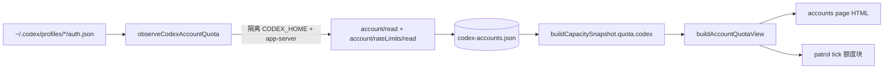

# FLY-2688 按需账号额度页 — 实施计划
Issue: FLY-2688 (https://linear.app/geoforge3d/issue/FLY-2688/额度账号页-一条命令出账号额度一览htmlclaude-各号周额度-5h-fable-单独周额度-重置时刻-订阅到期日-codex)
日期: 2026-09-18
基于: 无（plan_only；未追溯补造 exploration/research）

> 本文件是实现阶段的事实账本，不是事后倒推的探索或研究记录。本单未产出
> exploration/research：Lead 2026-09-18 裁定本单档位为 plan_only，且不追溯补造过程文档。

## 规格来源与锁定范围

- founder 2026-09-17 22:10Z：不想再手记 Claude 四号与 Codex 三号的额度表，希望需要时一句「账号页」即可得到链接。
- founder 2026-09-17 23:38Z：页面按她手记表格定版；等宽字体、一行一个账号，分 Claude/Codex 两块，不另做产品设计。
- 原始入口仍为按需生成并走既有 `publish-report` 托管。Lead 2026-09-18
  返工追加第二个入口：Claude 手动或 quota-monitor 自动切号的
  `account_switched` 通知，在通知落地前发布同一账号页并把 URL 放进同一条
  info 消息；不增加定时器或启动钩子。
- Lead 2026-09-18 复审裁定：公开托管页只显示 shopping / business /
  personal / school 等账号别名，不显示完整邮箱；切号通知里的账号页获取与
  托管共用 5 秒 deadline，为外层 30 秒投递预算保留余量。
- 页面机器读数与 patrol tick 的「额度」块共用 `buildAccountQuotaView`。页面允许逐格显示 founder 手填回退；tick 只投影机器读数，缺失显示 `n/a`，避免把手填值伪装成容量观测。

## 当前实现事实

1. `flywheel-comm accounts-page` 从受 master token 保护的 `/api/accounts-page.html` 获取当前 HTML，写入临时文件，再调用既有 `publishReport`；成功输出沿用 publish-report 的 JSON 链接回执。原按需调用行为不变；新增内部使用的 `--publish-only` 只托管并返回 URL，不另发第二条 Discord 报告。
2. 手动与自动切号共用的 `account_switched` durable 通知路径，在取得同一事件的 delivery lease 后调用 `accounts-page --publish-only --timeout-ms 5000`；同一个 deadline 覆盖账号页获取和托管，并为外层 30 秒投递预算中的 Discord、SQLite 与进程开销保留余量。成功附 `账号页：<URL>`，生成或托管失败附 `账号页本次未生成：<原因>`，deadline 到期固定标为 `账号页本次未生成：timeout`；这些降级都继续发送原切号通知。相同 switch signature 的重放先命中既有 delivery receipt，不重复发布；info 通知不 @ founder。
3. Bridge 的账号页路由与 `/api/capacity` 调用同一个 `buildCapacitySnapshot`，再经共享 view builder 生成 HTML；公开 HTML 只渲染账号别名，完整邮箱不进入托管页、容量 JSON 或 patrol tick。
4. Claude usage API 的自描述 `limits[]` 中名为 Fable 的 model-scoped 周额度与 reset，被 quota monitor、quota guard、candidate verification 三条真实读数路径写入现有账号 store，并投影回容量快照。
5. 订阅到期优先使用账号 store 的机器 `retiresAt`。机器缺值时页面使用 founder 2026-09-17 手填基线：shopping 9/20、business 10/16、personal 10/4、school 9/17；机器与手填不一致时保留机器值并在页脚列差异。
6. FLY-2670 尚未提供 Codex 数值源。页面明确显示「无数值源」，并把 founder 手填的三号 0%、到期 8/3 标为「手填」；当前账号为 personal。没有把手填值投影成机器观测。
7. 每个页面数值格显示机器/手填/缺失来源与读数时间；超过阈值的读数使用灰色 stale 样式。账号缺失、字段缺失和 Codex 无源都有显式文案。
8. 页面使用 founder 定版的等宽双表结构；只渲染并 HTML 转义账号别名，不引入完整邮箱、脚本或凭据。
9. founder 2026-09-19 返工后，每行账号名下方增加订阅档位。Claude 只读取各 profile `.credentials.json` 中经严格校验的非敏感 `subscriptionType` / `rateLimitTier`；例如机器可直接证明 `max + default_claude_max_20x` 时显示 `Max 20x`，不会从 20x 猜成或写死 `$200`。字段缺失、非法或 Codex 无同等可靠来源时逐号显示「未知」。访问令牌不进入容量快照或 HTML。
10. 所有格子的 provenance 小字改成 9px、更浅的独立 `--meta` 色，并用「来源：机器 · 读取于…」「来源：手填 · 记录于…」明确标出时间语义；表头同步改为「周重置日」，避免把 reset 日期与下面的读取时间混为第二个重置日期。档位放在账号格内，不改变 founder 锁定的额度列顺序。
11. founder 2026-09-19 追加返工后，Claude 与 Codex 的当前账号整行共用 `active-account` 状态：浅绿色底色加左侧 4px 色条；非当前行、额度列顺序、读数与 provenance 均不改变。
12. founder 2026-09-19 15:39Z 再次锁定当前账号标识：两张表的行首 `*` 全部移除，只保留 `active-account` 整行高亮作为唯一标识；页脚图例改为说明高亮行含义，并明确 Codex 高亮来自 founder 2026-09-17 手填。该返工不修改 tick 中既有的机器读数投影、容量 builder、数据列或窄屏行为：`@media(max-width:700px)` 仍负责页头与留白，390px viewport 下表格仍由 `min-width:990px` + `.table-wrap{overflow-x:auto}` 横向滚动。

## 已验证与待下游验证

- 首轮已验证：TeamLead 聚焦 8 files / 315 tests；flywheel-comm 1 file / 4 tests；两包 typecheck；全仓 `pnpm lint`（仅既有 warnings）；全仓 `pnpm -r build`；生成 HTML 为 8.7 KiB。
- 返工已验证：flywheel-comm `accounts-page` 聚焦 7 tests；TeamLead 通知路由/真实 shell receipt 聚焦 58 tests；覆盖 builder + publish 共用 5 秒 deadline、托管页仅显示账号别名，以及超时不吞掉切号通知。两包 build/typecheck、`bash -n scripts/lead-alert.sh`、受影响文件 Biome 与 `git diff --check` 通过。返工边界明确禁止本地全量，aggregate 交给精确头 CI。
- 已验证阴性对照：过期读数、缺账号、缺 Fable 机器值、Codex 无源、托管 HTML 不泄露完整邮箱、Bridge token 保护、Bridge/发布失败不继续发布。
- 2026-09-19 founder 三项返工使用 TDD：旧实现上的 3 个聚焦文件出现 4 个预期失败；实现后同 3 files / 17 tests 通过，`flywheel-teamlead` typecheck 与 package build 通过，7 个直接受影响文件 Biome 通过。渲染 fixture 的 DOM/CSS 回读逐项确认 metadata 更小更淡、7 行逐行有档位或「未知」、机器档位来自 fixture、表头「周重置日」与「读取于」文案分离。
- 2026-09-19 当前账号整行高亮返工使用 TDD：旧实现上聚焦 renderer 1 file / 2 tests 中新增断言按预期失败，实现后同一聚焦套件通过；全仓 `pnpm lint` 退出 0（仅既有 warnings），全仓 `pnpm -r build` 退出 0。生成 HTML 回读确认 Claude `shopping` 与 Codex `personal` 两行同时带 `active-account`，浅绿色底与左侧色条均存在；当时仍保留的两个 `*` 是本轮待删除项。
- 2026-09-20 去星号返工使用 TDD：旧实现上 renderer 聚焦测试 1/2 按预期因两个 identity 星号与旧页脚图例失败；最小实现后同一文件 2/2 通过。首轮 exact-head code review 发现 Bridge route 的第二处 markup 断言仍要求旧星号；该 HIGH 在本地精确复现为 1 failed / 7 passed，移除旧断言后 route + renderer 两文件 8/8 通过。TeamLead typecheck、受影响文件 Biome 与 package build 通过。生成 HTML 为 10,686 bytes；去掉 `<style>` 后可见 `*` 为 0、`` 为 0，Claude/Codex fixture 各 1 行 `active-account`，底色、左侧色条、700px media rule、390px 横向滚动所依赖的 overflow/min-width 合同均保留。tick 的 `★shopping` 断言继续通过，容量投影未改；aggregate 仍由新精确头 CI 提供。
- 像素工具边界已在 2026-09-20 重新实跑：系统 Chrome 与 Playwright Chrome 均在页面加载前 SIGABRT；临时下载到 `/tmp` 的 Playwright WebKit 也以 `Abort trap: 6` 退出，Playwright Firefox 同样 SIGABRT；Quick Look 报 `sandbox initialization failed: Operation not permitted`。因此本 implement 节点不声称像素截图通过；可复现 fixture 在 `evidence/render-rework-fixture.mjs`，独立 QA 仍需在允许浏览器启动的真机环境按 390px viewport 截图复验。
- 实现节点不部署或重启 Bridge，也不触碰生产 auth。隔离频道真机切号、通知链接公开 200 与截图仍由独立 QA 证明。
- 2026-09-21 技术性合 main：前一精确头 981b60cab 的 `Script Tests 3/5` 分片撞 FLY-1870 的 1020s 容量闸（两次 attempt 约 1035s/1040s），`CI OK` 因此为红；修它的 FLY-2755（5→6 分片）已合入 main，而同头重跑吃不到新 ci.yml，必需 job 清单也由被测头自身读取，所以唯一路径是把 `origin/main`（e82193650，13 个 commit）合进本分支出新头。`git merge-tree --write-tree` 预检零冲突，`git merge --no-ff` 成功，新头 `.github/ci-required-jobs.json` 已是六分片清单；本轮零产品文件改动。合并后定向验证：`flywheel-teamlead...` 与 `flywheel-comm...` build 退出 0；teamlead 直接归属测试两批 5+5 files / 191+170 tests 全过；flywheel-comm `accounts-page` 1 file / 7 tests 全过；`vitest related` 对 6 个 account-heal 源文件 165 files / 2336 tests 全过，对 4 个 bridge 源文件 169 files 中 168 过、1 失败（`lifecycle-closeout.test.ts` 的 FLY-2490「missing evidence through the production closure」，本分支未触碰该文件，在 `origin/main` e82193650 的主检出上本机同样失败，判为预存环境差异，交精确头 CI 裁决）；`lead-alert-strict-delivery.test.sh` 31 passed / 0 failed；两包 typecheck 退出 0；全仓 `pnpm lint` 退出 0（25 条既有 warnings）；`bash -n scripts/lead-alert.sh` 与 `git diff --check` 通过。其余 9 个引用 `lead-alert.sh` 的 shell 套件（bridge-wrapper-fail-loud、codex-home-migration-alert、fly1364-discord-e2e、fly1496-qa-acceptance、fly1577-alert-arrival、fly1577-cmux-bin-closure、fly1674-residue、flywheel-cmux-install-link-only、launchd-census-wiring、lead-alert-dirs）不覆盖 `account_switched` 路径，本地未跑，由六分片 CI 承担。
- 精确头代码评审、PR 与 GitHub Actions aggregate 尚待本文件之后的最终头完成。

## 2026-09-21 返工：Codex 真实读数 + 最早重置在前排序

founder 2026-09-21 thread 追加两项，其余保持 PR #1258 现状：

1. **Codex 用量换成真实读数** —— 走 Codex app-server 的 `account/rateLimits/read`（含
   `credits`）取每个号的真实用量与重置时刻，不再用推算/手填；六个号
   （school / personal / business / shopping / personal1 / personal2）都要列，
   注册表未收录的号按 `~/.codex/profiles/<name>/auth.json` 枚举。
2. **排序规则** —— 按「最早重置在前」排，Claude / Codex 各自分组；打满的号标红并
   显示恢复时刻（PT）。

### 事实基线（实核，不是推测）

- `~/.codex/profiles/` 实际有 6 个目录：business / personal / personal1 /
  personal2 / school / shopping；`packages/claude-runner/agents/codex-account-registry.json`
  只收录 school / personal / business 三个，且 `loadCodexAccountRegistry` 硬要求
  「恰好三个 profile」。
- FLY-2750 之后 `identifyCodexAuth` 已经支持未注册账号：匹配不到 registry 时回落成
  `account-<email-local-slug>`、role `manual_backup`，不再抛错。所以「枚举未注册号」
  不需要改 registry 合同。
- 真实 `account/rateLimits/read` 结果形状（`product/doc/FLY-1911-codex-voice-prototype/evidence/*.jsonl`
  里的真机采样）：`{limitId, limitName, primary:{usedPercent, windowDurationMins, resetsAt},
  secondary, credits:{hasCredits, unlimited, balance}, individualLimit,
  spendControlReached, planType, rateLimitReachedType}`，外层还有
  `rateLimitsByLimitId` / `rateLimitResetCredits`。采样里 `primary.windowDurationMins`
  是 10080（周）而 `secondary` 为 null —— **窗口语义必须按 `windowDurationMins` 判定，
  不能假设 primary 恒为 5h**。现有 `parseCodexRateLimits` 只取 usedPercent/resetsAt、
  丢掉窗口时长与 credits，且被 failover 选号逻辑消费，本单不改它。
- 全仓没有任何常驻路径在采集 Codex 读数：`CodexQuotaRuntime.observe()` 只在切号事件里跑，
  `codex_quota_observation` 表无写入方。所以「真实读数」必须由本单新增的读取路径产生。
- `persistCodexCandidateCredential` 把写回硬限制在 school/personal/business 三名上。
- 现有 `quota.codex` 在 `buildCapacitySnapshot` 里是写死的
  `{source:null, unavailable:["structural: codex_no_usage_api"]}`。

### 设计

**A. 新读取路径** `packages/teamlead/src/codex-quota/accounts-observer.ts`

- `listCodexProfileSlots(profilesRoot)`：枚举 `profilesRoot` 下的普通目录（拒符号链接、
  目录名必须匹配 `^[a-z0-9][a-z0-9._-]{0,31}$`、必须含普通文件 `auth.json`），按名排序。
  `.codex-quota-account-locks` 等点开头目录天然被正则拒掉。
- 对每个槽位：`identifyCodexAuth` 取 email/accountId → `codexInstallAccountKey` →
  `acquireCodexAccountLease(profilesRoot, accountKey)`（该 API 只吃 accountKey，对未注册号同样可用）
  → 在 `stateRoot/accounts-page-candidates` 下开隔离 `CODEX_HOME`（复用
  `CodexCandidateWorkspace` 的隔离形状）→ `runIsolatedCodex(["app-server", -c file store])`
  跑 `initialize` → `account/read`（校验 email 与槽位一致）→ `account/rateLimits/read`。
- 解析用**本单新增**的 `parseCodexRateLimitsDetail`：按 `windowDurationMins` 把窗口分到
  5h（<= 600 分钟）与 weekly（> 600 分钟）两个桶；带出 `planType`、`credits`
  （`hasCredits`/`unlimited`/`balance` 逐字段校验，`balance` 只接受
  `^\d{1,12}(\.\d{1,2})?$`）、`rateLimitReachedType`。字段非法 → 整条读数判 unknown，不半信半疑。
- **写回**：读完后若隔离副本的 auth 字节变了（app-server 轮换了 refresh token），
  用新增的 `persistCodexProfileQuotaRefresh`（见下）写回**同一个槽位**；写回失败
  则该号本次记 `authHealth: "recovery_uncertain"` 并进 warnings，不静默。
- **占用守卫**：沿用 `CodexQuotaRuntime` 的 in-use 语义 —— 若该 accountKey 正被 live
  Codex Lead/canonical chain 占用，跳过探测（共享 refresh token 同时用会互相打死），
  该号记 `authHealth: "in_use_unshared"`，**保留 store 里上一次成功读数**并在页面灰显
  + 标「使用中，本次未读」。不编数。
- 逐号超时 20s（与现有 `readCodexQuota` 一致），整轮有总 deadline；超时/失败的号
  单独记 `error` 码，不影响其他号。
- 结果原子写 `codex-accounts.json`（mode 0600，temp + rename + fsync，沿用
  `account-store.ts` 的写法）；**只写非敏感读数**，token / id_token / email 全不落盘
  （页面本来就只显示别名，邮箱不进托管页）。

**B. 写回函数** `packages/claude-runner/bin/codex-account-install.mjs` 新增
`persistCodexProfileQuotaRefresh({profilesRoot, profileDir, registry, accountKey,
finalAuthPath, expectedProfileDigest, accountLease})`：

- 守卫与 `persistCodexCandidateCredential` 逐条对齐（lease 校验 + orphanRecovery 配对 +
  进程已 drain + 槽位摘要等于 expected 或已等于终值 + 原子写 + `resolveCodexCandidateRecovery`），
  **唯一差别**是把「profile 名必须是 school/personal/business」换成
  「写回前后的身份（email + accountId 派生的 accountKey）必须一致，且写回目标是该 accountKey
  自己的槽位目录」。
- `persistCodexCandidateCredential` 一字不改，failover / 切号链路零行为变化。

**C. 容量快照** `capacity-snapshot.ts`

- 新增可选 deps `codexAccountStorePath`，默认
  `join(FLYWHEEL_STATE_DIR ?? ~/.flywheel, "codex-quota", "codex-accounts.json")`。
- `quota.codex` 类型放宽为
  `{source: "codex-accounts.json" | null, activeAccount: string | null,
    staleAfterMinutes: number, accounts: CodexAccountProjection[], unavailable: CapacityUnavailable}`。
- **store 缺席/不可读/为空 → 保持现状** `{source:null, unavailable:["structural: codex_no_usage_api"]}`，
  页面「无数值源」这条阴性对照继续活着。
- `activeAccount`：由 observer 记录「哪个槽位的身份等于 canonical `~/.codex/auth.json` 的身份」，
  机器可证；不再硬编码 `personal`（顺手消掉一条 advisory）。canonical 不可读时为 null，
  Codex 表就没有高亮行，并在页脚说明。

**D. view / 渲染** `account-quota-view.ts`

- Codex 行改为优先用机器读数（用量、5h reset、周 reset、planType、credits），
  逐格缺失才回落 founder 手填；`MANUAL_CODEX` 保留为「store 缺席时的回退」，
  有机器读数的格子不再显示手填值（founder 要的是真实读数）。
- Codex 表第 5 列语义从「Fable 周用量」改为「credits」（两张表各自的表头文案），
  Claude 表表头与列序一字不动。
- **排序**：`sortByEarliestReset(rows)` —— 每行取「未来最早的重置时刻」
  （Claude = 5h / 周 / Fable 三个 reset 的最小值；Codex = 5h / 周的最小值），
  升序；没有任何可用重置时刻的行排在最后；并列按账号名 `localeCompare`。
  Claude / Codex 各自独立排序（同一家分组），不跨表混排。
- **打满标红**：某行任一窗口 `usedPercent === 100`（Claude 侧还包括
  `exhaustedUntil` 在未来 / `authUnusable`）→ 行加 `exhausted-account` class
  （红色底 + 左侧红色条），并在该行显示「恢复 <M-D ddd HH:mm PT>」；恢复时刻取
  打满窗口里最晚的 reset（没有 reset 时显示「恢复时刻未知」，不猜）。
  `active-account` 与 `exhausted-account` 同时命中时，红色优先于绿色高亮，
  左侧色条保留当前账号色（两者用不同的视觉通道：底色=状态，色条=当前在用）。
- patrol tick 仍只投影机器读数：Codex 块从「无数值源」变成逐号机器读数（store 有值时），
  store 缺席时仍是「无数值源」。手填值永远不进 tick。

**E. 触发口** 

- Bridge `/api/accounts-page.html` 支持 `?refresh=1`：**仅**在该 query 存在时跑一轮
  observer（single-flight 锁，同一时刻只允许一轮；已有一轮在跑就复用它的 promise），
  然后再 `buildCapacitySnapshot` 渲染。
- `flywheel-comm accounts-page` 默认带 `?refresh=1`；`--publish-only`（切号通知路径，
  5 秒预算）**不带**，只渲染 store 里的既有读数。⛔ 不新增定时器、不新增启动钩子、
  不自动托管 —— 与本单原始约束一致。
- observer 失败/超时不阻断页面：页面照常渲染上一次读数并在页脚列出本轮失败原因。

### 不改的东西

- Claude 侧数据列、列序、`/api/capacity` 一致性、390px 窄屏合同（`min-width:990px` +
  `.table-wrap{overflow-x:auto}`）、整行高亮机制、去星号结论、托管页只显示别名。
- `parseCodexRateLimits` / `selectCodexQuotaCandidate` / `CodexQuotaRuntime` /
  `persistCodexCandidateCredential` —— failover 选号链路零改动。
- 不切 canonical Codex 号，不改 `~/.codex/config.toml`，不改 registry 合同。

### 已知限制（如实写，不装作验过）

- 被 live Codex Lead 占用的号本轮读不到（共享 refresh token 的硬约束），页面显示上次读数并标注。
- Codex 订阅到期日没有机器源，继续走 founder 手填并标「手填」。
- 实现节点**不**对生产 `~/.codex` 跑真实探测（本轮 dispatch 明令禁止），真机六号读数
  由独立 QA 在允许的环境验证；本节点只用 fixture app-server（`scripts/fixtures/codex-quota/protocol-cli.cjs`
  同形状的桩）做红绿验证。
- 像素截图仍受本机浏览器 SIGABRT 限制，沿用上一轮的边界声明。

### 独立设计评审（2026-09-21）

Codex companion R1 撞额度（thread `01a0c79b`，turn failed，`try again at Sep 27th, 2026 2:25 PM`，零评审产出）。
按 FLY-2560 判例改跑 gemini-cli 0.60.0 API-key 通道，R1 verdict **APPROVED**，原文存
`engineering/doc/FLY-2688-account-quota-page/gemini-review-round1.md`。两条非阻断建议已吸收进上面的设计：

1. **打满的号按「恢复时刻」排，而不是按最早那个 reset。** 一个两窗口都打满的号，
   它真正能再用的时刻是打满窗口里**最晚**那个 reset；按绝对最早 reset 排会把一个完全用不了的号
   排到最前面。⇒ 排序键统一定义为「该号状态下一次变好的时刻」：打满的号取恢复时刻
   （打满窗口里最晚的 reset），没打满的号取未来最早的 reset；两者都没有的排最后，并列按名。
   页脚图例写清这条规则，避免读者把红行的位置误读成「最早重置」。
2. **observer 的总 deadline 必须显著小于 HTTP 路由的容忍度。** 逐号 20s × 6 号串行最坏 120s，
   会把 `?refresh=1` 这次请求拖垮。⇒ 逐号 20s 不变，**整轮总 deadline 默认 45s**（可由 deps 覆盖）；
   总 deadline 到点就停止启动新的号、把已完成的号写进 store、未读到的号记
   `error: "deadline"` 并进页脚，页面照常渲染。single-flight 复用同一轮 promise，
   第二个并发请求不再起第二轮探测。

### Lead 2026-09-21 裁定补充（q 09d0c12f）

- 三条设计边界（未注册号写回守卫 / in_use 跳过 + 灰显上次读数 / 只按需探测）全部同意。
- **FLY-2762 稍后会把 Codex 注册表改成任意 N 号** ⇒ 新写回函数必须保持可被它替换，
  **不得再引入新的三号字面量**。本设计的守卫本来就只按「身份一致 + 同槽位 + 持锁」判定，
  不含任何 profile 名字面量；枚举也来自磁盘目录而非 registry，天然满足该约束。
- founder 追加：**每个号的状态必须由系统读出来，不能靠她口述** ⇒ 若
  `account/rateLimits/read` 的返回里能看出「有无 usage-limit reset 可兑」，要单列一列；
  看不出就在报告里写明该 RPC 不暴露它。
  - 真机采样里存在两处相关字段：窗口级 `credits:{hasCredits, unlimited, balance}`
    与顶层 `rateLimitResetCredits`（采样值为 `null`）。⇒ Codex 表第 5 列定为
    **「credits / 重置兑换」**，逐号显示：`hasCredits`/`unlimited`/`balance` 的判定结果，
    以及 `rateLimitResetCredits` 是否给出可兑的重置。字段缺席时该格显示
    「RPC 未暴露」（`source: missing`），**不推测**；同时把这一事实写进实现报告。

## 2026-09-21/22 返工实现事实

13. Codex 读数改为真实读数。新增 `codex-quota/rate-limit-detail.ts` 解析
    `account/rateLimits/read` 的完整返回：窗口按 `windowDurationMins` 分到 5h（≤600 分钟）
    与 weekly（>600 分钟），**没有给出时长的窗口只计数不归桶**（`unclassifiedWindows`），
    并带出 `planType`、`credits{hasCredits,unlimited,balance}` 与顶层 `rateLimitResetCredits`。
    `parseCodexRateLimits`（failover 选号用）一字未改。
14. 新增 `codex-quota/codex-accounts-observer.ts`：从 `<codex home>/profiles` 枚举槽位
    （普通目录、非符号链接、名字匹配 `^[a-z0-9][a-z0-9._-]{0,31}$`、含普通文件 `auth.json`），
    因此 registry 未收录的 shopping / personal1 / personal2 也被读到；每个号在隔离
    `CODEX_HOME` 里跑 `app-server` 的 initialize → account/read → account/rateLimits/read。
    逐号 20s（沿用 `readCodexQuota`），整轮默认 45s deadline，超时后不再启动新的号、
    已读到的照常写入、未读到的记 `deadline`。被 live Codex 进程占用的号直接跳过
    （`CodexQuotaRuntime.accountInUseGuard()`，inventory 读不到时 fail-closed 判全部占用），
    保留上一次读数并标「使用中，本次未读」。
15. 新增 `persistCodexProfileQuotaRefresh`（`codex-account-install.mjs`）：读数过程中
    app-server 轮换了 refresh token 时，把新字节写回**同一个槽位**。守卫与
    `persistCodexCandidateCredential` 逐条对齐（lease、orphanRecovery 配对、进程已 drain、
    槽位摘要未变、原子写、0600），唯一差别是把「profile 名必须是三号之一」换成
    「写回前后身份（email/accountId 派生的 accountKey）一致且目标是该 accountKey 自己的槽位」；
    以及对「stopped 但没有 pid」的进程记录（spawn 根本没起来、无事可 drain）不额外收紧，
    直接交给权威的 `assertCodexCandidateDrained` 判定 —— 旧函数在这一形状上更严，属有意差异。
    **不含任何 profile 名字面量**，FLY-2762 把注册表改成 N 号时可直接替换。
    `persistCodexCandidateCredential` 与 failover 链路零改动。
16. 新增 `codex-quota/codex-account-quota-store.ts`：原子写、0600 的
    `codex-accounts.json`（默认 `<FLYWHEEL_STATE_DIR|~/.flywheel>/codex-quota/`），
    只存非敏感读数；token / id_token / email 均不落盘。读侧严格校验（版本、名字、
    重复、activeAccount 悬空、窗口/credits 形状），任一不合就当作「无源」。
17. `buildCapacitySnapshot` 新增 `codexAccountStorePath` dep 并投影 `quota.codex`：
    `source/activeAccount/staleAfterMinutes/accounts[]`，逐号带 `exhausted`
    （任一窗口 100%）与 `recoveryAt`（打满窗口里最晚的 reset，缺任一 reset 则为 null）。
    **store 缺席或不合法时输出与改动前逐字节相同的 `{source:null, unavailable:[...]}`**，
    「无数值源」这条阴性对照继续活着（capacity-snapshot 测试用 `toEqual` 锁死）。
18. `activeAccount` 由机器判定：槽位身份等于 canonical `~/.codex/auth.json` 的身份。
    不再硬编码 `personal`（消掉一条 advisory）；canonical 读不到时为 null，Codex 表就没有高亮行。
19. 视图：Codex 行改为机器读数（用量 / 5h reset / 周 reset / planType / credits），
    第 5 列表头改为「credits / 重置兑换」，逐号显示
    `余额 X · 可兑重置 N`、`无可兑重置`、`credits 未暴露`、`重置兑换未暴露`，
    两项都没有时显示「RPC 未暴露」（source=missing）。Claude 表表头与列序一字未动。
    Codex 订阅到期仍无机器源，继续走 founder 手填并标「手填」；shopping/personal1/personal2
    没有手填基线，显示「无数据」。
20. 排序：两张表各自按「该号下一次变好的时刻」升序 —— 打满的号取恢复时刻，
    没打满的号取未来最早的 reset（5h / 周 / Fable 取最小），两者都没有的排最后，
    并列按账号名。打满行加 `exhausted-account`（浅红底 + 红色「打满 · 恢复 MM-DD HH:mm PT」），
    与 `active-account` 同时命中时底色用红、左侧色条仍是当前在用的绿色，页脚图例写明这两条规则。
21. 触发口：Bridge `/api/accounts-page.html?refresh=1` 才跑一轮 observer（single-flight，
    失败只记日志、页面照常渲染既有读数）；`flywheel-comm accounts-page` 默认带 `refresh=1`，
    `--publish-only`（切号通知的 5 秒预算）**不带**。⛔ 未新增任何定时器或启动钩子。
22. `readCodexQuota` 只加了一个可选 `captureResult` 回调把原始返回交给新解析器，
    协议状态机与既有判定不变。

### 本轮验证（2026-09-22）

- TDD：6 个单元各自先红后绿 —— rate-limit-detail 5、codex-account-quota-store 3、
  codex-accounts-observer 6、persistCodexProfileQuotaRefresh 6、account-quota-view 新增 5、
  capacity-snapshot 新增 2、capacity-route 新增 3、flywheel-comm accounts-page 改 2。
- 定向套件全绿：`account-quota-view` 7、`capacity-route` 9、`capacity-snapshot` 20、
  `codex-quota/__tests__` 19 files / 182、`patrol-tick` 39 + `patrol-tick-render` 50、
  `codex-quota-bench` + `runtime` + `codex-quota-probe`（合计 131）、
  claude-runner `codex-account-install` 17 + 新增 6、flywheel-comm `accounts-page` 7。
- `vitest related` 对 8 个改动的 teamlead 源文件：175 files / 2630 tests，2 个文件红：
  ① `lifecycle-closeout.test.ts` 的 FLY-2490「missing evidence through the production closure」
  —— 在 `~/Dev/flywheel` 的 main 检出（6706d59a5）上单独跑同样失败，预存环境差异；
  ② `workflow-ship-ready-head-enrichment.test.ts` 的 gh api 用例 —— **单独跑 6/6 通过**，
  main 检出单独跑 69/70 通过，只在 175 文件并行批里翻红，判为并行负载下的串扰，
  本分支未触碰该模块及其依赖。两者交精确头 CI 裁决。
  claude-runner 侧 `vitest related` 13 files / 582，红的 4 条全在
  `codex-daemon-runtime.test.ts`，main 检出同样 4 条红（预存）。
- 两包 build 与 `...flywheel-teamlead` / `...flywheel-comm` typecheck 退出 0；
  `git diff --check` 通过。本轮改动的 14 个文件 Biome 全清；全仓 `pnpm lint` 仍报
  3 errors / 25 warnings，**全部落在本分支未触碰的文件**（`doc/engineer/research/new/FLY-1547-e2e`、
  `FLY-1563-e2e`、`packages/config` 与 `packages/core` 的测试、`scripts/*.mjs`），
  全仓状态交精确头 CI。
- 像素验证这次**真的跑通了**（上一轮的浏览器 SIGABRT 不再复现）：
  `npx playwright screenshot` 以 1440×1200 与 390×900 full-page 渲染
  `evidence/render-rework-fixture.mjs` 产出的 14,691 bytes HTML，截图存
  `evidence/codex-real-readings-1440.png` 与 `evidence/codex-real-readings-390.png`。
  逐项回读确认：两张表各自按恢复/重置升序（Codex 顺序 business → shopping → school →
  personal1 → personal（打满，按恢复时刻排）→ personal2（无读数，最后））、
  打满行浅红底 + 「打满 · 恢复 09-26 02:00 PT」、当前在用行绿底 + 左侧色条、
  可见区域星号为 0、Codex 第 5 列为「CREDITS / 重置兑换」、
  「使用中，本次未读」「本次读取失败」「RPC 未暴露」三条阴性文案都在，
  390px 下由 `min-width:990px` + `.table-wrap{overflow-x:auto}` 横向滚动、页头不溢出。
- **未验**：没有对生产 `~/.codex` 跑过真实六号探测（本轮 dispatch 明令禁止），
  真机读数、切号通知链路与公开 200 仍由独立 QA 证明；生产首次真实发布需班车部署后才发生。

### 精确头代码复审（2026-09-22，同家族 Claude 口）

Codex companion 撞 usage limit（恢复 9/27），项目 flag `review_same_family_allowed=on`，
按 FLY-2763 走 Bridge 自跑的同家族 Claude 复审：request `93f4c4e5`，冻结头
`88330d02d`，verdict **APPROVED**，8 条非阻断 findings。本轮当场修掉其中 5 条：

1. （MEDIUM）**in-use 守卫每轮只取一次库存** → observer 新增 `refreshInUse`，每个槽位探测前
   重新取一次占用视图（对齐 `CodexQuotaRuntime.observe()` 的 per-profile 复查），
   plugin 侧传 `() => runtime.accountInUseGuard()`。
2. （MEDIUM）**库存读不到被写成「使用中」** → `accountInUseGuard()` 的 verdict 改成
   `boolean | "unknown"`，observer 对 `"unknown"` 记 `inventory_unavailable`，
   页面显示「占用状态未知，本次未读」。两种情况都照样跳过探测，但不再把「采集器坏了」
   说成「六个号都在忙」。
3. （LOW）**profiles 根读不到会把好 store 覆盖成空** → `listCodexProfileSlots` 不再吞
   readdir 错误，observer 直接抛，plugin 记日志、**store 原样保留**，页面继续显示上一次读数。
4. （LOW）**崩溃遗留的隔离 home 没清** → `clearPendingRecovery` 写回成功后，
   删除 `workspaceRoot` 下那个还留着 0600 auth 副本的隔离目录（路径前缀校验后才删）。
5. （LOW）**`--timeout-ms` 与 refresh 互斥** → 带 `--timeout-ms` 的调用（上限 10s，
   不可能盖住六号探测）与 `--publish-only` 一样不再带 `refresh=1`，只渲染既有读数；
   USAGE 写明这条。另外 plugin 侧给 observer 传了 90s 的 AbortSignal 天花板。

保留为 follow-up（Lead 之前已把同族条目判为非阻断）：`claudeEmails` 死管线
（`row.identity` 无人渲染，等同既有 advisory `dead-identity-email-plumbing`）、
切号降级文案里带内部 Bridge URL、以及上面第 22 条记录的 pid-less stopped 有意差异。

复审修复后重跑：observer 9、account-quota-view 7、capacity-route 9、capacity-snapshot 20、
codex-quota 19 files / 185、flywheel-comm accounts-page 8 全过；两包 build 与 teamlead
typecheck 退出 0；改动文件 Biome 全清。

### 精确头代码复审 R2（2026-09-22）

新头 `f1b211c9c` 上 request `38322143` 再判 **APPROVED**，5 条全 LOW。本轮再修 3 条：

6. （LOW）**每槽位库存刷新跑在 deadline 检查之前** → 顺序调换，过期的轮次不再为每个槽位
   白跑一次库存扫描。
7. （LOW）**`accountInUseGuard` 的文档注释仍写「未知库存报告为全部占用」** → 改写成
   现在的真实语义（返回 `"unknown"`，照样跳过探测但不谎称占用）。
8. （LOW）**auth 失效的 Claude 账号被渲染成「打满 · 恢复时刻未知」** —— 等下去并不会好，
   这是 founder 会读到的错话。⇒ 行模型拆成 `exhausted`（额度打满，只由窗口 100% 或
   未来的 `exhaustedUntil` 决定，才显示恢复时刻）与 `unusable`（凭据不可用）。
   auth 失效的行改显示「凭据失效，需重新登录」，排序键为 null（排最后，因为没有
   「自己会变好」的时刻），红色底仍保留以便一眼看到需要处理。

仍保留为 follow-up（两条 Lead 之前已判非阻断，一条为既有行为）：`claudeEmails` 死管线、
切号降级文案带内部 Bridge URL。

R2 修复后重跑：teamlead 定向 21 files / 275 tests 全过（含 view 8、observer 9、route 9、
snapshot 20、patrol-tick 89）、flywheel-comm accounts-page 8 全过；typecheck 与 build 退出 0；
改动文件 Biome 全清。渲染 fixture 不含 auth 失效账号，两张截图与 R1 后逐字节相同。

### 精确头代码复审 R3（2026-09-22）

头 `476d45190` 上 request `33138d5a` 第三次判 **APPROVED**，3 条全 LOW。修掉新出现的那条：

9. （LOW）**「凭据失效，需重新登录」把话说满了** —— 容量快照里 Claude 的 `authUnusable`
   同时覆盖 `authExpired` / `refreshTokenInvalid` / `profileVerifyFailed` **和运营手动停用标记**
   （`account.unavailable`），后者重新登录并不能解决。⇒ Claude 行改用中性文案
   「凭据不可用，需人工处理」；Codex 侧真实的 `refresh_invalid` 仍显示
   「凭据失效，需重新登录」，因为那条是机器可证的。

另外两条与 R2 相同，继续作为 follow-up 留给后续单：`claudeEmails` 死管线
（`row.identity` 无人渲染）、切号降级文案里带内部 Bridge URL。

## QA5 打回返工（implement attempt 2，2026-09-22）

QA（exec `c3b49431`）在头 `e098f7399` 上判 **FAIL**，**单一阻断项**：精确头 CI run
`35704173368` 15 success / 2 failure，红的是 `Quick Gate (build+typecheck+lint)` 与聚合 `CI OK`。
根因是本分支新增文件的 Biome **格式**错误：
`packages/teamlead/src/codex-quota/codex-account-quota-store.ts:181` 的 `if` 条件需要拆成多行。
两项 founder 返工本身 QA 已独立验证通过（含对真 codex-cli 0.153.2 二进制做零凭据探针，
证实 `account/rateLimits/read` 是真方法、serde 字段表含 `rateLimitResetCredits`，
且二进制里就有「response did not include rateLimitResetCredits」的真实文案 ——
印证把该字段缺席渲染成「RPC 未暴露」是对的）。

### 为什么我自己的 lint 检查没抓住它（我的失效模式）

我确实在改动文件上跑了 biome，但用 `grep -E ':[0-9]+:[0-9]+ (lint|assist)'` 过滤输出 ——
而 **format 类诊断根本没有 `:行:列` 前缀**（它打印成 `<path> format ━━━`），整类被我的
过滤器漏掉；我又只读了 `Found N warnings` 那一行，没读 `Found N errors` 和退出码。
这正是「尺子的范围错」：过滤器给出干净的全绿，最像已验证，所以最危险。
⇒ 本轮起改成 **用退出码当尺子**：`xargs npx biome check < changed-files.txt; echo rc=$?`。

### 本轮修了什么

23. `codex-account-quota-store.ts:181` 按 Biome 的期望拆成多行。复核方式换成退出码：
    对本分支相对 `origin/main` 改动的 36 个代码文件跑 `npx biome check`，修前 `rc=1`
    （`Found 1 error`），修后 `rc=0`（只剩 2 条既有 `useConst` warning，在 plugin.ts 我没碰的行上）。
    **CI 的原命令 `pnpm lint` 现在退出 0**（25 条既有 warnings，全在本分支未触碰的文件）。
24. （QA advisory #2）Claude 侧恢复时刻未知时渲染成「打满 · 恢复 恢复时刻未知」的结巴文案 →
    未知分支改成「打满 · 恢复时刻未知」，已知分支不变；新增一条断言锁住。

### 本轮验证（按 CI 的口径，不再自己发明过滤器）

- `pnpm lint` 退出 0；`pnpm -r typecheck` 退出 0；`pnpm build` 退出 0；
  `pnpm --filter "flywheel-teamlead..." build` 与 `"flywheel-comm..." build` 退出 0；
  `bash scripts/__tests__/fly2045-milestone-layout.test.sh` 32 passed / 0 failed。
- 定向套件：teamlead 21 files / 276 tests（view 9、route 9、snapshot 20、patrol-tick 89、
  codex-quota 全部）、flywheel-comm accounts-page 8、claude-runner 23 全过。
- 渲染 fixture 与两张截图逐字节不变（fixture 里的打满账号有已知恢复时刻，不经过改动的分支）。
- QA 的三条 honest boundary（真凭据返回体、生产首跑六号探测、真 Discord 切号回归）本轮同样未验，
  维持原样交下游。QA advisory #1（写回只更新 `profiles/<slot>/auth.json`、不动 canonical）
  属设计内边界，已在上文第 15 条记录，本轮不改。

