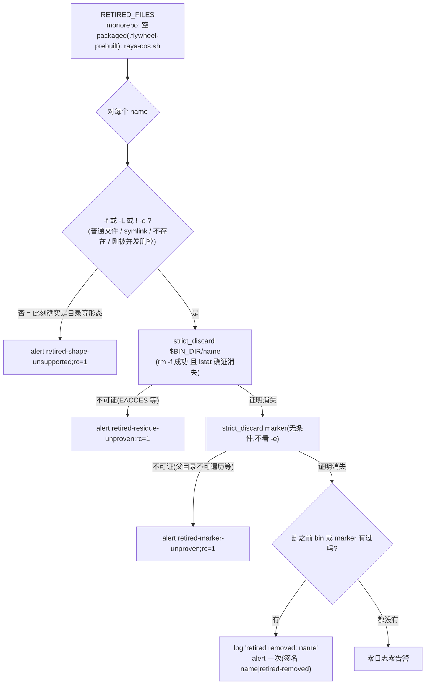

# FLY-2695 宿主 shim + converge 收敛 — 实施计划

Issue: FLY-2695 (https://linear.app/geoforge3d/issue/FLY-2695/raya-并仓s2-宿主-shim-converge-收敛raya-cosshl1-加载路径实机验证-codex-full-access)
日期: 2026-09-24
基于: exploration.md, research.md

> **版本**:v3。Codex R2 3 条阻断 + 1 条建议,**全部采纳**:① retirement 形态谓词改为「`-f || -L || ! -e` ⇒ 删;否则才 unsupported」,并让 C19 的同步点落在谓词之间(旧序红 / 新序绿);
> ② C16b 的故障改放在 `$ST/state` 父目录(managed loop 的 `mkdir -p + chmod 700` 够不着);③ ④(B) 的夹具根放在 `$HOME` 下专用目录(不在 `$TMPDIR` / `/private/tmp` / 业务 writable roots 内)并加同沙箱写入负对照;建议:工具命令里显式钉住 `FLYWHEEL_HOST_CONFIG` / `FLYWHEEL_DIR`。
> R1(gpt-6-astra, xhigh)4 条阻断 + 4 条建议,**全部采纳**:
> ① 两个 converge 重叠时首次采纳 / retirement 的幂等语义(§4.1、§4.2、C18/C19);② marker 与 bin 目标的删除一律走 `strict_discard` 证明,不拿 `-e/-L` 双假当成功(§4.2、C16b);
> ③ C9d 的确定性计数 6→7(§5.1);④ QA ④(B) 的可复现配方与工具执行证据(§6.1)。建议:自检放置点与行号、措辞、shim 测试环境隔离、跨版本回滚前提。
> 施工权威 = 已合入 main 的 `engineering/doc/FLY-2680-raya-merge-plan/plan.md` §6.2 / §10.2 注 / §12 S2 行;
> 本页把它落到 file:line。与上游 plan 的四处偏差(exploration §3)已回报 Lead(ask `89faed30`),按现实施工。
> 本节点**只设计**:不改代码、不部署、不重启、不申请 ship。

## 1. 一句话

给 Raya 人设一个**由现有收敛器守护的稳定宿主入口** `~/.flywheel/bin/raya-cos.sh`
(复制安装、sha==repo 源、mode 555),它用宿主 host-config 合同解析 Flywheel checkout 后
`exec node $FLYWHEEL_DIR/packages/raya-cos/dist/cli.js "$@"`;
同一个 PR 给收敛器加**精确的 `RETIRED_FILES` 主动删除 + 验证删除**合同,
packaged 形态当前版本即把 `raya-cos.sh` 视为 retired。
**纯增量:合入 + 部署后生产 Raya 行为零变化**(人设仍指 `business/current`,见 exploration §3.3)。

## 2. 变更面(白名单;`git diff --name-only` 自证不越界)

| # | 文件 | 动作 | 依据 |
|---|---|---|---|
| 1 | `scripts/raya-cos.sh` | **新增**,≥1024 B,mode 100755 | §3 |
| 2 | `scripts/converge-flywheel-bin.sh` | `:81` 行末追加 ` raya-cos.sh`;`:153-158` 白名单加 `raya-cos.sh`;主循环内把首次采纳资格**提前**到 sha 检查之前判定(§4.1);新增 `RETIRED_FILES` 两个分支赋值 + 交集自检(主循环之前)+ retired 删除段(主循环之后) | §4 |
| 3 | `scripts/__tests__/converge-flywheel-bin.test.sh` | 夹具枚举 + `COPY_FILES` 加 `raya-cos.sh`;**C9d 计数 6→7**;新增 C13–C19 | §5.1 |
| 4 | `scripts/__tests__/raya-cos-shim.test.sh` | **新增** hermetic shim 测试 | §5.2 |
| 5 | `scripts/__tests__/converge-fly1389.test.sh:47,97`、`fly1577-cmux-bin-closure.test.sh:70,113`、`fly1577-alert-arrival.test.sh:64,209` | 夹具枚举加 `raya-cos.sh`(否则这些夹具对它报 `srcmissing`) | research §4 |
| 6 | `.github/workflows/ci.yml:360` 批次 | 加一行 `bash scripts/__tests__/raya-cos-shim.test.sh` | `ci-shell-suite-enumeration` |
| 7 | `packages/raya-cos/README.md:33-38` | 把「delivered by S2」改成现在时:入口 = `~/.flywheel/bin/raya-cos.sh`,从注册的业务工作区 cwd 调用 | 文档一致性 |
| 8 | `engineering/doc/FLY-2695-host-shim-converge/{validation.md}` | 实施阶段落 ④ 的两层证据 + ①②③⑤⑥ 命令输出 | §7 |
| 9 | `engineering/doc/milestones/FLY-2695.md` | ship 时新建(CLAUDE.md 一 issue 一文件) | 仓规 |

**不碰**:`packages/raya-cos/src/**`、任何 `raya`/`updater`/`migration`/`patrol` 脚本、`package-onboard.sh`、
`package-onboard-files.allow`、`packaged-path-audit.md`、Raya 仓、人设、launchd、`persona-projection`。

## 3. `scripts/raya-cos.sh`(完整规格)

```mermaid
flowchart LR
    P["Raya 人设(S3 后)<br/>cwd = ~/Dev/raya-lead-workspace"] -->|"~/.flywheel/bin/raya-cos.sh status"| S["shim(bin 副本,555)"]
    S --> L{"host-config.sh 在哪"}
    L -->|"$state/bin/lib"| H["host_config_load"]
    L -->|"shim 同目录 lib/"| H
    L -->|"${FLYWHEEL_DIR:-$HOME/Dev/flywheel}/scripts/lib"| H
    L -->|"都没有"| F["exit 78 fail loud"]
    H -->|"FLYWHEEL_DIR = ENV > host.json > $HOME/Dev/flywheel"| C{"dist/cli.js 存在?"}
    C -->|"否"| F
    C -->|"是"| E["exec node $FLYWHEEL_DIR/packages/raya-cos/dist/cli.js \"$@\"<br/>(cwd 不变,argv 原样)"]
    E --> W["cos 读写 cwd/state/cos/"]
```

逻辑(与上游 plan §6.2 相同,只多了三条回退与两条 fail-loud):

```sh
#!/bin/bash
# FLY-2695: host shim for the Raya CoS business CLI (plan FLY-2680 §6.2, L1).
# … ≥1024 B 的实质注释:WHAT / WHY A SHIM(PATH 不含 ~/.flywheel/bin,flywheel-lead.sh:8;
#    copy 而非 symlink 才落在 converge 的 sha+mode 不变量里)/ INVARIANTS(无业务逻辑;
#    fail loud 78;不进 packaged 闭包,packaged 分支把本名视为 RETIRED)…
set -euo pipefail
fail() { printf '[raya-cos.sh] ERROR: %s\n' "$1" >&2; exit "${2:-78}"; }
state="${FLYWHEEL_STATE_DIR:-$HOME/.flywheel}"
lib="$state/bin/lib/host-config.sh"
[ -f "$lib" ] || lib="$(cd "$(dirname "${BASH_SOURCE[0]}")" && pwd)/lib/host-config.sh"
[ -f "$lib" ] || lib="${FLYWHEEL_DIR:-$HOME/Dev/flywheel}/scripts/lib/host-config.sh"
[ -f "$lib" ] || fail "host-config.sh is missing (looked under $state/bin/lib and the checkout)"
# shellcheck disable=SC1090
source "$lib"
host_config_load >/dev/null || fail "host.json is invalid"
cli="$FLYWHEEL_DIR/packages/raya-cos/dist/cli.js"
[ -f "$cli" ] || fail "Raya CoS CLI is not built at $cli (run pnpm -r build in $FLYWHEEL_DIR)"
command -v node >/dev/null 2>&1 || fail "node is not on PATH"
exec node "$cli" "$@"
```

硬性要求:
- **体积 ≥1024 B**(`script-sanity.sh:24`),用注释撑;测试 `raya-cos-shim.test.sh` 断言 `wc -c ≥ 1024`,让「有人把注释删瘦了」在 CI 就红,而不是在生产收敛时变成 insane 告警;
- **不 `cd`、不改 argv;宿主配置只经 host-config 读取(ENV > `host.json` > 默认),不 `source ~/.flywheel/.env`**;`FLYWHEEL_STATE_DIR` 只用于找 `host-config.sh`(与 `flywheel-lead.sh:42-56` 同源);
- 退出码:配置类失败一律 78(EX_CONFIG),与 `flywheel-lead.sh` 的 `fail` 一致;CLI 自身的退出码原样透传(`exec`);
- 理由:shim 是读者,不该吃可写文件里的变量;host-config 已给 ENV 最高优先级,launchd 传下来的 `FLYWHEEL_DIR` 会生效。
- shellcheck 干净(仓库 CI 有 shell lint);`bash -n` 通过。

## 4. `scripts/converge-flywheel-bin.sh` 改动

### 4.1 managed 侧(两处一行改)

- `:81` monorepo `FILES="… lib/codex-quota-summary.mjs raya-cos.sh"`(**追加在末尾**;`flywheel-lead-packaging.test.sh:50-63` 钉着两条子串模式与「恰好 2 行」,research §4);
- `:92` packaged `FILES` **不动**;
- `:153-158` `is_first_adoption_name` 加 `raya-cos.sh`(生产首次收敛静默、marker `state/converge-adoptions/raya-cos.sh` 600)。

**并发幂等(Codex R1#1)**:每个 Claude Lead 启动都独立跑一次收敛器(`claude-lead.sh:1467-1481`),没有共享锁。
今天的主循环在**安装之后**才查 marker(`:251`):A、B 同时看到 shim 缺失,A 装好并写 marker,B 随后完成安装、发现 marker 已在,
就落进普通 `repaired` severe 告警 —— 首次部署静默的承诺被并发打破。改法(对白名单里全部名字生效,是 bug 修复不是新机制):

```sh
for f in $FILES; do
  src=…; dst=…
  adopt_pending=0
  if is_first_adoption_name "$f" && ! adoption_is_complete "$f"; then adopt_pending=1; fi   # 资格在检查/修复之前定
  …(源缺失 / sha 相等分支不变;sha 相等分支里的采纳记录改用 $adopt_pending)…
  if install_script_atomic "$src" "$dst"; then
    if [ "$adopt_pending" = 1 ]; then
      if record_adoption "$f" "$src_sha" || adoption_is_complete "$f"; then   # 并发者刚写好 = 也算记录成功
        log "first managed adoption recorded: $f (expected rollout; alert suppressed once)"
      else … adoption-marker-failed alert(不变)… fi
    else … repaired alert(不变)… fi
  fi
done
```

### 4.2 retired 侧(新增)

放置点(Codex R1 建议 1):**清单赋值 + 交集自检**放在 `rc=0; for f in $FILES`(`:202`)之前 —— 自检失败 `exit 1` 时零写;
**删除循环**放在主循环结束(`:272`)之后、symlink lane(`:286`)之前,与 FILES 循环共享 `rc`,并受 `:191-200` 的 temp/worktree 写时守卫约束(守卫在它之前就 `exit 1` 了)。



规格:

```sh
# FLY-2695 (FLY-2680 §10.2 note): names this converger USED TO manage and must now
# actively remove. The managed loop above never scans bin, so a name dropped from
# FILES becomes unmanaged residue (the 2026-09-01 raya wrapper is the live example).
# Forward rollback = move a name from FILES to RETIRED_FILES, deploy, verify gone.
# ── 放在 rc=0 / FILES 循环之前 ──
RETIRED_FILES=""
if [ -f "$REPO_ROOT/.flywheel-prebuilt" ]; then
  # raya-cos is Annie's self-hosted Raya only; PO_PACKAGES never ships it, so a
  # packaged install must not keep a shim whose target can never exist there.
  RETIRED_FILES="raya-cos.sh"
fi
for f in $RETIRED_FILES; do case " $FILES " in *" $f "*)
  echo "[converge-bin] ERROR: $f is listed in both FILES and RETIRED_FILES — refusing to run (FLY-2695)" >&2; exit 1 ;; esac
done

# ── 放在 FILES 循环之后、symlink lane 之前 ──
for f in $RETIRED_FILES; do
  dst="$BIN_DIR/$f"; marker="$ADOPTION_DIR/${f//\//__}"
  had=0
  { [ -e "$dst" ] || [ -L "$dst" ] || [ -e "$marker" ] || [ -L "$marker" ]; } && had=1   # 只决定要不要出声,不决定要不要删
  # Predicate ORDER matters (Codex R2#1): the three tests are not one atomic
  # observation. Test the removable shapes FIRST and absence LAST, so a target
  # that a concurrent converger deletes between two tests always ends up in the
  # strict_discard branch (rm -f on an absent path succeeds, lstat proves it
  # gone). Only a path that is still present AND is neither a file nor a link
  # (a directory, a socket, …) is an unsupported shape.
  if [ -f "$dst" ] || [ -L "$dst" ] || [ ! -e "$dst" ]; then
    :
  else
    log "ERROR: retired $f has unsupported shape at $dst — NOT removing"
    alert "bin retired entry has unsupported shape: $f" "$dst exists but is neither a regular file nor a symlink. NOT auto-removed; inspect the path manually (FLY-2695)." "$f|retired-shape-unsupported"
    rc=1; continue
  fi
  if ! strict_discard "$dst"; then
    log "ERROR: could not prove removal of retired $f"
    alert "bin retired residue unproven: $f" "$dst is retired but its removal could not be proven (rm failed or the path is still present). Nothing else changed; inspect permissions and re-run converge (FLY-2695)." "$f|retired-unproven"
    rc=1; continue
  fi
  # The marker is ALWAYS taken through strict_discard: -e/-L both false cannot tell
  # "absent" from "parent directory not searchable" (Codex R1#2).
  if ! strict_discard "$marker"; then
    log "ERROR: retired adoption marker for $f could not be proven removed"
    alert "bin retired marker unproven: $f" "$dst is gone but $marker could not be proven removed. Repair state-directory permissions and re-run converge (FLY-2695)." "$f|retired-marker-unproven"
    rc=1; continue
  fi
  if [ "$had" = 1 ]; then
    log "retired removed: $f (bin copy and adoption marker verified gone)"
    alert "bin retired entry removed: $f" "$dst (and its adoption marker) was a retired entry left from an earlier managed version or a forward rollback; it was removed and verified gone (FLY-2695)." "$f|retired-removed"
  fi
done
```

不变量:
- **只按精确名单删,绝不扫目录**(bin 里有 68 项人手遗留物,research §8);
- 删除必须**被证明**(复用 `strict_discard :128-133`),**bin 目标与 marker 都无条件走 `strict_discard`**;不可证 ⇒ rc=1 ⇒ pre-kickstart 拒绝(`restart-services.sh:3297-3303`)—— 与 FLY-1577 对 alert-chain 残留的态度一致;
- **并发幂等(Codex R1#1 / R2#1)**:两个收敛器重叠时,后者无论在哪两个谓词之间撞上「前者刚删掉」,都落进 `strict_discard`(`-f`/`-L` 为真时已进入;若两者均假且目标已消失,则 `! -e` 为真同样进入;三个条件都为假才是「仍存在的不支持形态」)= `rm -f` 对不存在路径成功 + lstat 确证消失 ⇒ 同样 rc=0;只有**此刻仍存在且是目录等形态**才 unsupported。`retired-removed` 告警按签名去重,重叠时至多一条;
- `RETIRED_FILES` 与 `FILES` **不得有交集**(同名既装又删 = 抖动);启动自检在任何写之前,交集非空 ⇒ `exit 1`(写错清单在 CI 就红);
- 名字不存在(bin 与 marker 都没有)时零日志零告警(S7 packaged 稳态必须仍是「零告警」,`packaged-seams.test.sh:395-399`);
- monorepo 分支 `RETIRED_FILES` 初始为空 —— **不把 `flywheel-codex-lead-wrapper-raya-tui-fullaccess.sh` 列进去**(exploration §5.1,归 T6 / Lead 裁定;Lead 若裁定现在列,加一个名字 + 一条 C16 变体即可)。

### 4.3 forward rollback 合同(写进脚本注释与 PR 描述)

1. 保留 retired 框架;2. 另开提交:`raya-cos.sh` 从 `:81` 挪进 monorepo `RETIRED_FILES`;3. 部署,`ls ~/.flywheel/bin/raya-cos.sh ~/.flywheel/state/converge-adoptions/raya-cos.sh` 均不存在;4. 之后才删 retired 条目。
**不要 `git revert` 整个 S2 PR**(会连框架一起删,残留永远没人清)。
**操作前提(Codex R1 建议 4)**:第 3 步的「验证消失」要在**旧 managed 版本的收敛进程全部退出之后**做
(旧版本进程会把它装回来,新版本的交集自检管不到另一个版本);瞬时缺席不算稳态。本单不引入跨版本协调机制。

## 5. 测试

### 5.1 `converge-flywheel-bin.test.sh` 改动(沿用 hermetic 夹具;新增用例都在 `:328` 结果行之前)

**既有用例的确定性变化(Codex R1#3)**:C9d(`:259-275`)把 adoption 目录换成普通文件后断言**恰好 6 条** `adoption baseline FAILED`(`:273`);
白名单从 6 名变 7 名后健康的 `raya-cos.sh` 同样会尝试写 marker 并失败 ⇒ 改为 **7 条**,并加一条 `grep -q 'FAILED for raya-cos.sh'` 确认新增那条属于它;rc=0 与运行时字节健康的既有断言保持。与 §5.3 的三个兄弟夹具一起「先跑红再改」。

| 用例 | 前置 | 断言 |
|---|---|---|
| **C13** shim 首次采纳 | 稳态种子后 `rm bin/raya-cos.sh`、`rm -rf state/converge-adoptions` | rc=0;`cmp` 等于源;mode 555;`out.log` 含 `first managed adoption recorded: raya-cos.sh`;**0 条** `raya-cos` 告警;marker `state/converge-adoptions/raya-cos.sh` mode 600 且含 `managed=raya-cos.sh` |
| **C14** 采纳后漂移 | 把 bin 副本改成 1 行 | rc=0;修回;恰好 1 条含 `raya-cos.sh` 的 `bin_integrity_drift` 告警 |
| **C15** packaged 阴性(plan §6.2 🔴 预置-再断言) | `touch $FR/.flywheel-prebuilt`;预置 555 的 `bin/raya-cos.sh` + marker 600 + `bin/unrelated-user-file.txt` + `bin/lib/` 稳态 | rc=0;`bin/raya-cos.sh` **不存在**;marker **不存在**;无关文件**仍在**;`out.log` 含 `retired removed: raya-cos.sh`;告警**恰好 1 条**且签名 `retired-removed`;**0 条 `srcmissing`**;再跑一次:0 告警、0 `retired removed`(幂等) |
| **C16** retired 删除不可证 | packaged;预置 `bin/raya-cos.sh` 后 `chmod 555 bin`(目录只读) | rc=1;告警含 `retired-unproven`;`chmod 755` 复原后再跑 rc=0 且文件消失 |
| **C16b** marker 父目录不可遍历(Codex R1#2 / R2#2) | packaged;bin 里无 shim,预置 marker 后 **`chmod 000 $ST/state`**(是 `converge-adoptions` 的**父目录**:managed loop 里其他白名单名字的 `record_adoption` 会 `mkdir -p` + `chmod 700 $ADOPTION_DIR`,把直接 000 的 adoption 目录自己修好;故障放在它够不着的上一层) | rc=1;告警含 `retired-marker-unproven`;**不得**出现 `retired removed`;`chmod 700 $ST/state` 复原后再跑 rc=0、marker 消失、恰好 1 条 `retired-removed`(其余 `adoption baseline FAILED` 告警属于 managed loop,不计入本用例断言) |
| **C17** 清单交集自检 | 复制一份收敛器,把 `RETIRED_FILES="raya-cos.sh"` 也放进 monorepo 分支;并先 `rm bin/restart-services.sh` 让一个 managed 文件**确实待修** | rc=1;`out.log` 含交集错误;`bin/restart-services.sh` **仍缺失**(证明自检在任何写之前退出,不是「稳态没东西可写」);0 告警 |
| **C18** 首次采纳并发(Codex R1#1,确定同步点) | 夹具 repo 的 `lib/script-sanity.sh` 换成**测试专用**版本:`install_script_atomic` 在真正安装前先按 marker 格式写出 `state/converge-adoptions/raya-cos.sh`(模拟「A 在 B 检查之后、安装之前完成了采纳」),其余照抄真件;bin 无 shim、无 marker | rc=0;shim 装入且 555;`out.log` 含 `first managed adoption recorded: raya-cos.sh`;**0 条** `raya-cos` 告警;随后恢复真 lib、把副本改坏再跑 ⇒ 恰好 1 条 `bin_integrity_drift`(采纳不是永久豁免) |
| **C19** retirement 并发(Codex R1#1 / R2#1,同步点在**谓词之间**) | packaged;预置 555 shim + marker;夹具 `lib/path-hygiene.sh` 末尾追加**测试专用**的 `[` 函数(bash 允许定义名为 `[` 的函数遮蔽内建):先 `builtin [ "$@"`,若本次参数是对 `bin/raya-cos.sh` 的**第一个**形态谓词且结果为真,则在返回前 `/bin/rm -f` 掉目标(模拟「A 在 B 的第一个谓词之后、下一个谓词之前删掉了它」),返回原结果 | 修订后的顺序:rc=0;shim 与 marker 消失;**不得**出现 `retired-shape-unsupported`;`retired-removed` 告警 ≤1 条;无关文件仍在。**红/绿证据**:实施节点把同一夹具对**修订前**的谓词顺序(`-e && ! -f && ! -L`)跑一次并记进 `validation.md`(预期 rc=1 + `retired-shape-unsupported`),证明 C19 检验的是这次修订本身 |

C18/C19 的同步点都落在**夹具 repo 的 lib 副本**里(该测试本来就把真件复制进假 repo 再执行,`:21-25`),生产脚本零 env 旋钮、零测试钩子。
C19 的 `[` 遮蔽只对 `bin/raya-cos.sh` 那一次谓词生效,其余调用原样转发,避免影响夹具里别的判断。

并把 `raya-cos.sh` 加进 `:36-41` 夹具生成列表与 `:58 COPY_FILES`(否则 C1–C12 的「精确告警条数」全部漂移)。

### 5.2 新建 `scripts/__tests__/raya-cos-shim.test.sh`(hermetic,ubuntu 可跑)

| 用例 | 断言 |
|---|---|
| S0 体积与语法 | `wc -c scripts/raya-cos.sh ≥ 1024`;`bash -n`;首两字节 `#!`;`assert_sane_script_source`(source `script-sanity.sh`)返回 0 |
| S1 默认解析(**QA ②**) | 假 `HOME` + `$HOME/.flywheel/bin/lib/host-config.sh` 真件 + stub `$HOME/Dev/flywheel/packages/raya-cos/dist/cli.js`(回显 argv/cwd/自身路径),**显式环境**(`env -i HOME=… PATH=/usr/bin:/bin:<node 所在目录>`,沿用 `packaged-seams.test.sh:359-363` 的做法,从而隔离 `FLYWHEEL_DIR`、`FLYWHEEL_STATE_DIR`、`FLYWHEEL_HOST_CONFIG`、`HOST_CONFIG_SOURCED` 等一切宿主输入;Codex R1 建议 3),cwd=临时工作区 ⇒ target 等于 `$HOME/Dev/flywheel/packages/raya-cos/dist/cli.js`,argv 原样,cwd 未变 |
| S2 ENV 优先 | `FLYWHEEL_DIR=<alt>` ⇒ target 在 alt |
| S3 host.json 优先于默认 | `host.json {"flywheelDir": …}` ⇒ target 在 host.json 指定处 |
| S4 host-config 三级回退 | 删 `$HOME/.flywheel/bin/lib/host-config.sh`,把 shim 复制到 `<dir>/raya-cos.sh` 并放 `<dir>/lib/host-config.sh` ⇒ 仍解析;再删 ⇒ 用 `$FLYWHEEL_DIR/scripts/lib/host-config.sh`;三处都没有 ⇒ rc=78 且 stderr 含 `host-config.sh is missing` |
| S5 fail loud | dist 缺失 ⇒ rc=78 + `not built`;畸形 host.json ⇒ rc=78 + `host.json is invalid` |
| S6 CLI 退出码透传 | stub cli.js `process.exit(3)` ⇒ shim rc=3 |
| S7 真 dist(**QA ③**,仅当 `packages/raya-cos/dist/cli.js` 存在时执行,否则打印 `SKIP` 并**计失败**——CI 在 `pnpm build` 之后跑所以必有 dist) | 空临时工作区里 `raya-cos.sh status` 输出经 `jq -e '.schemaVersion==2 and .operations==[]'` 为真;工作区里**没有**新文件 |

`ci.yml:360` 批次追加 `bash scripts/__tests__/raya-cos-shim.test.sh`(该批次在 `pnpm build` 之后)。

### 5.3 必须一起改的三个夹具(research §4)

`converge-fly1389.test.sh:47,97`、`fly1577-cmux-bin-closure.test.sh:70,113`、`fly1577-alert-arrival.test.sh:64,209` 的枚举各加 `raya-cos.sh`。
实施时先不改它们跑一遍,**确认它们确实因 `srcmissing` 翻红**(证明改动是必要的,不是顺手),再改。

### 5.4 全量回归(实施节点 PR 前必跑)

```bash
pnpm --filter flywheel-raya-cos build
bash scripts/__tests__/converge-flywheel-bin.test.sh
bash scripts/__tests__/raya-cos-shim.test.sh
bash scripts/__tests__/flywheel-lead-packaging.test.sh
bash scripts/__tests__/packaged-seams.test.sh
bash scripts/__tests__/converge-fly1389.test.sh
bash scripts/__tests__/fly1577-cmux-bin-closure.test.sh
bash scripts/__tests__/fly1577-alert-arrival.test.sh
bash scripts/__tests__/ci-shell-suite-enumeration.test.sh
node --test scripts/__tests__/raya-cos-cli-dist.test.mjs
```
判成功看 `Results: N passed, 0 failed` 与退出码,不看 grep(记忆:lint/测试判据用退出码 + 计数)。
⚠️ 不要跑 `**/tmux-viewer.macos.test.ts`;本机 `TMPDIR` 过长会让真 tmux 用例红,与本单无关。

## 6. QA 判据(plan §12 S2 ①–⑥ 的可执行形式)

| # | 判据 | 证据形式 |
|---|---|---|
| ① | 隔离 `FLYWHEEL_STATE_DIR` 夹具跑收敛器:shim 出现、555、sha==源 | C13 输出 + 手工:`FLYWHEEL_STATE_DIR=$(mktemp -d) FLYWHEEL_CONVERGE_ALERT_BIN=<桩> bash <假repo>/scripts/converge-flywheel-bin.sh; ls -l; shasum -a 256` |
| ② | 无 host.json 解析到 `$HOME/Dev/flywheel` | S1 |
| ③ | `raya-cos.sh status` 返回 `.schemaVersion==2 and .operations==[]`(精度更正见 exploration §3.2) | S7 + 部署后宿主实跑(在**空临时目录**里跑,不要在 Raya 工作区跑) |
| ④ | Codex full-access 沙箱能执行 | **两层**:(A)按 research §5 的方法用同版本二进制提取策略复演,含 `$HOME`/`~/Dev/flywheel` 负对照与工作区内正对照,输出存 `validation.md`;(B)见 §6.1 的可复现配方 —— 待测产物是**本 PR 的 shim**装在隔离 state/bin 里,证据是 Codex 的**工具执行事件**(命令、cwd、exit 0、原始 stdout)而不是模型最后一句回复。若池全灭,(B)记「未验证·池不可用」并报 Lead,**不用 (A) 顶替**,不伪造 |
| ⑤ | packaged 阴性:预置后收敛,shim 与 marker 消失、无关文件保留、0 `srcmissing` | C15 |
| ⑥ | retired/residue 合同落地 | C15/C16/C17 + 脚本注释里的 forward-rollback 四步 |

### 6.1 ④(B) 真 `codex exec` 配方(Codex R1#4;实施节点照做,输出全部进 `validation.md`)

前提:不动生产 `~/.flywheel`、不动 Raya 工作区、不动共享 Codex 登录态。

0. **夹具根必须在沙箱可写范围之外(Codex R2#3)**:workspace-write 的有效可写范围 = writable roots + `$TMPDIR` + `/private/tmp`(research §5.3 的教训),所以**不能**用 `mktemp -d`。
   用 `T="$HOME/.fly2695-qa-$(date +%s)"; mkdir -p "$T"`,并记录 `realpath "$T"`、`echo $TMPDIR`,确认 `$T` 不在 `$TMPDIR`、`/private/tmp`、`~/Dev/raya-lead-workspace` 或任何额外 writable root 之下。用完 `rm -rf "$T"`。
1. **准备待测产物**(部署前,绑定本 PR 的 shim):`mkdir -p $T/state/bin/lib $T/ws`;
   `install` 本 PR 的 `scripts/raya-cos.sh` 到 `$T/state/bin/raya-cos.sh`(`chmod 555`,记录 `shasum -a 256` 与 `git rev-parse HEAD`);
   `cp scripts/lib/host-config.sh $T/state/bin/lib/`;写 `$T/state/host.json` = `{"flywheelDir":"<本 worktree 绝对路径>"}`(worktree 已 `pnpm --filter flywheel-raya-cos build`);
   `git -C $T/ws init -q`(并仍传 `--skip-git-repo-check` 兜底)。
2. **隔离 Codex 家目录**:`CODEX_HOME=$T/codex-home`,从池快照复制凭据(memory `reference_codex_pool_probe_via_isolated_codex_home`);记录 `codex --version`(须与 Raya 实际二进制 0.156.1 同版,否则写明差异)。
3. **执行**(full-access 合同的显式安全参数,与 `codex-lead-tui-home.sh:576-580` / `codex-lead-runtime.ts:408-414` 一致;工具命令里**显式钉住**宿主解析输入,不依赖继承 —— Codex R2 建议):
   ```bash
   cd $T/ws && CODEX_HOME=$T/codex-home codex exec --skip-git-repo-check -C $T/ws \
     -s workspace-write -c 'sandbox_workspace_write.network_access=true' \
     -c "sandbox_workspace_write.writable_roots=[\"$T/ws\"]" -c 'approval_policy="never"' \
     --json "Run exactly these two shell commands from the current directory, one after the other, and reply with their raw stdout/stderr and exit codes only: (1) touch $T/state/bin/probe ; (2) env -u FLYWHEEL_DIR FLYWHEEL_STATE_DIR=$T/state FLYWHEEL_HOST_CONFIG=$T/state/host.json $T/state/bin/raya-cos.sh status" \
     > $T/exec.jsonl
   ```
4. **证据与断言**(全部来自 `exec.jsonl` 的工具执行事件,不看最后一条 assistant 文本):
   - **负对照**:命令 (1) 的事件 exit code ≠ 0、stderr 含 `Operation not permitted`,且 `ls $T/state/bin/probe` 不存在 —— 证明 shim 所在目录在这个沙箱里**不可写**,即它确实是「沙箱外的只读入口」;
   - **正对照**:命令 (2) 的事件 command 含 `$T/state/bin/raya-cos.sh status`、cwd = `$T/ws`、exit code = 0;其 stdout 经 `jq -e '.schemaVersion==2 and .operations==[]'` 为真;`$T/ws` 内无新文件(`status` 不落盘);
   - 把 `codex --version`、生效的 sandbox/approval/network/writable_roots(从 `exec.jsonl` 的 session/config 事件或 `codex exec` 打印的配置行摘录)、`realpath $T`、`$TMPDIR`、shim sha、HEAD 一并写入 `validation.md`。
5. **宿主真路径的检查留在 A2-deploy**(§7),那时才验 `~/.flywheel/bin/raya-cos.sh`。

## 7. 割接与回滚(本单只覆盖 A2)

| 步 | 动作 | 验证 | 回滚 |
|---|---|---|---|
| A2-merge | PR 合入(1 张 ship 卡,plan §11.1) | CI 绿(含 §5.4 全部) | — |
| A2-deploy | 既有班车部署:`update-flywheel.sh:1567` 或 `restart-services.sh:3297` 调收敛器 | `ls -l ~/.flywheel/bin/raya-cos.sh` 555;`shasum` 等于 `~/Dev/flywheel/scripts/raya-cos.sh`;`~/.flywheel/state/converge-adoptions/raya-cos.sh` 存在 600;`(cd $(mktemp -d) && ~/.flywheel/bin/raya-cos.sh status)` 输出 ③;**Raya 工作区 `identity.md` sha 仍为 `ca1240f1…`、`launchctl list` 仍只有 `com.flywheel.lead.raya-raya`**(零影响自证) | forward rollback(§4.3),不 `git revert` |

不可逆点:**无**。本单不动数据、不动人设、不动进程。

## 8. 与上游 plan 的核对(PR 描述必须复述)

**Lead 裁定(2026-09-24,ask `89faed30` 已答)**:四处偏离(exploration §3)按现实施工;
`flywheel-codex-lead-wrapper-raya-tui-fullaccess.sh` **不列**进 S2 的 `RETIRED_FILES`,留到 T6(founder 授权);
PR 描述必须有一节 **「plan vs 现实」**,逐条写:① shim ≥1024 B 的原因(`script-sanity.sh:24`);
② QA ③ 判据改为 `.schemaVersion==2 and .operations==[]`;③ FLY-2657 已落地 ⇒ §9.4 第一行情形、S2 仍纯增量;
④ 沙箱验证两层证据(复演 + 隔离 `CODEX_HOME` 真 `codex exec`)。

- §14.1 ①②③、§14.2 ④⑤⑥ 全部落在 S4/S3/§7A/§11/§10.4/§10.5,**无一条触及 §6.2、§10.2 注、§12 S2 行** —— 已逐条核对,S2 施工口径不受影响;PR 描述写明「已逐条核对 §14,不涉及 S2」;
- §13 第 7 条(沙箱)由本单 ④ 收口;第 9 条(packaged 跑不跑 `update-flywheel.sh`)与本单无关(shim 不进 packaged)。

## 9. 风险与已知限制

| 风险 | 处置 |
|---|---|
| 有人以后把 shim 注释删瘦到 <1024 B | S0 在 CI 拦;生产侧收敛器会告警不装(fail-safe) |
| `~/.flywheel/bin/lib/host-config.sh` 被谁删了 | shim 三级回退到 checkout 的 `scripts/lib/host-config.sh`;三处都没才 78 |
| 生产第一次收敛拉 severe 告警吓到 founder | 首次采纳白名单 ⇒ 静默 + marker |
| Codex 真实 seatbelt 拼法与复演不字节一致 | ④(B)真 `codex exec` 兜底;并有生产旁证(Raya 今天已在同沙箱跑 node cli) |
| 三个兄弟夹具漏加 `raya-cos.sh` | §5.3 先跑红再改;CI 全量 |
| packaged 树里曾用 monorepo 装过 shim(跨形态残留) | packaged `RETIRED_FILES` 主动删 + 验证(C15) |
| 把 `raya-cos.sh` 同时写进 `FILES` 与 `RETIRED_FILES` | 交集自检 exit 1(C17) |

## 10. 本单不做 / 交后续

- S3(Raya 仓人设改路径 `business/current/…` → `~/.flywheel/bin/raya-cos.sh`、删 cos):不在本单;S2 部署后即满足其前置;
- `flywheel-codex-lead-wrapper-raya-tui-fullaccess.sh` 的 retired 条目:**Lead 已裁定归 T6**(ask `89faed30`),S2 不列;
- ④(C)生产证据(cos operation store 出现经 shim 的条目)只属于 §10.2 B5 / §9.1,**不写进 S2 验收**。
