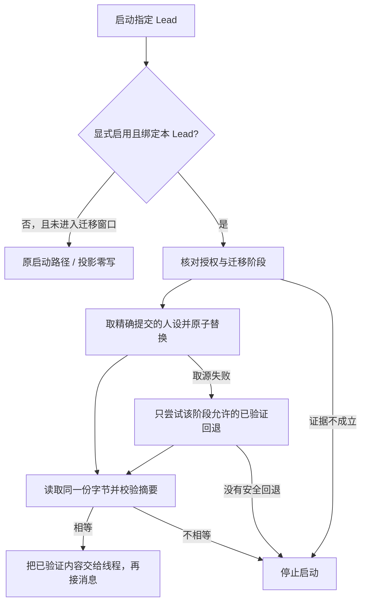

# FLY-2696 人设投影 — 实施计划
Issue: FLY-2696 (https://linear.app/geoforge3d/issue/FLY-2696/raya-并仓s4-persona-投影p1人设留-raya-仓显式-opt-in-contract-启动屏障fail-open)
日期: 2026-09-17
基于: research.md

状态：R3 effective reviewVerdict=APPROVED（question 3b4cda52-3af0-498d-a193-a9615bd60234，审查 head 44a40cfa6）。本次收尾按母方案优先落实 R3 非阻断边界澄清；这些收尾文字未再开 R4，详见 review-disposition.md。设计节点不实施、不激活。

## 1. 给 founder 的说明

把 Raya 仓里**获准的那一版人设**可靠地送到工作区，并在接收消息前核对实际加载的内容。本单后继只交付默认关闭的代码，不换生产人设，不迁移数据。

沿用母方案 `../FLY-2680-raya-merge-plan/plan.md` §7/§7.3 的 P1′。人设留在 Raya 仓；P2′ 已评估不采用。§14.1① 修订已经逐字对照：迁移之前能回到经过验证的旧版本；迁移之后只能回到事先冻结的兼容版本，没有就停止启动。



验收看四件事：16 个非 Raya Lead 没有任何投影写入；精确提交的文件摘要一致；旧人设不能接入已迁移的数据；新线程与恢复线程都实际使用核验过的提示词。

## 2. 范围、非目标与权威

- S4 范围：共享配置解析、selector additive 字段、取源与原子投影、runtime 启动屏障、最小只读 activation 证据接口、隔离测试。先部署、默认无 opt-in。
- 不改 Raya 仓，不执行 M0，不启用 contract，不请求运维/ship 授权，不重启，不删旧班车；S4 不修改 updater / migration / patrol 文件，遵守母方案 §9.4。旧 Raya pass 的 ownership guard 单独作为 activation-prep，在 FLY-2657 合入或明确放弃后完成；它只阻止激活，不阻止 S4 的独立开发、交付与 dormant 部署。不做 S1/S2/S3/T1–T6，不等待 FLY-2657。
- S4 ship ≠ exact-commit pin 授权 ≠ activation-window 授权。后两者由后续运维 owner 逐实例完成；不能用旧 FLY-2496 stop manifest、Lead 文本、模型填写的 granted_by 或 S4 PR approval 代替。
- 旧 `com.xrli.raya.brain` 已停用是任务提供的现场更新；后续步骤改为复核仍停用，不重新 bootout。标准 Raya Lead 的 B2 process/lease 围栏仍要独立证明。
- 母方案 §13 未验证项不转写成事实。Bridge/GatePoller 一直运行，只阻止 Raya consumer；round max seq 合法增长。
- S4 首轮只支持 `raya/raya`、Codex TUI、capability bundle v1 的 opt-in。其他身份显式配置该 contract 报错；所有无 opt-in Lead 原行为不变。v2 opt-in 明确拒绝，未来支持须独立验证 parent.baseInstructions 全链路。

## 3. 唯一配置合同

在 `projects.json` 的 project 行增加可选 `personaProjection`，绑定 `leadId`，不复用 QA slot 里已存在且含义不同的 `identitySource`。selector 只在当前 lead 匹配时输出该字段；输出 `projectRepo` 作为来源信息，**绝不是开关**。

```ts
type PersonaPin = {
  commit: string;                 // 完整 40 位小写 Git SHA；非 branch/tag/短 SHA
  personaBlobDigest: string;      // 原始 Git blob bytes 的 SHA256，64 hex
  approval: { channelId: string; messageId: string; contentSha256: string };
};
type PersonaProjection = {
  schemaVersion: 1;
  enabled: true;                  // 缺省无字段；false/null/空对象不算 opt-in
  leadId: "raya";
  repo: "xrliAnnie/raya";          // 必须等于该 project 的 projectRepo
  path: ".lead/raya/identity.md"; // 不接受任意文件路径
  pin: PersonaPin;
  lastKnownGood: PersonaPin;      // A0 冻结对象；digest 仍必须验证
};
```

contract 的错误只隔离到所属 Raya 行：全局 parser 保留 invalidPersonaProjection 标记和原因，不让该附加字段错误抛出并中止全舰队加载；选择 raya/raya 才 fail closed。原有全局 registry 结构错误策略不变。非 Raya selector 与启动对畸形 Raya contract 仍正常，禁止静默把 Raya 错配置当 absent。共享 validator 位于 `packages/config/src/persona-projection.ts`，由 `packages/flywheel-comm/src/lead-identity.ts` 和 `packages/teamlead/src/ProjectConfig.ts` 同时调用；只改 ProjectConfig 不够，selector 走另一条 parser。未知字段、空白绕过、外仓、分支名、路径穿越、非支持 backend/profile/version 均在边界拒绝。`enabled:false` 在配置校验时报错，关闭使用删除字段，禁止把 malformed 配置当未启用。进入 B2 后删除字段不是关闭迁移围栏的方法（§4）。

`projectsDigest` 保持对原始 registry 字节计算；`identityDigest` 保持原有 registry 身份含义；`contractDigest` 是规范化上述 contract 的摘要，另行命名。manifest 只存原有 selector 指针，不复制 pin 成第二份权威。

## 4. 阶段证据与激活接口（实施必须带的封闭边界）

**不能让启动参数自行宣称 pre-M0。** S4 的 `PersonaActivationReader` 只读 Bridge 持有的状态；输入 project/lead，输出以下判别联合。Bridge 从其当前 StateStore、不可变 window 记录和授权原始证据派生，不信任请求体里送来的 `phase`/`approved`/`expectedDigest`。

```ts
type ActivationView =
  | { kind: "unmanaged" | "legacy-managed" } // 没有 S4 enrollment/window；DB 可已由旧 updater 迁移
  | { kind: "pre-m0"; contractDigest: string; a0Digest: string; revision: string }
  | { kind: "fenced"; windowId: string; revision: string }
  | { kind: "post-m0"; windowId: string; contractDigest: string;
      expected: PersonaPin; fallback: PersonaPin | null;
      dbIdentity: string; migrationReceiptDigest: string; revision: string }
  | { kind: "refused"; reason: string };
```

只读接口为 `GET /api/lead-persona/activation?projectName=raya&leadId=raya`，通过既有 Bridge API 鉴权与身份校验；不存在写/approve/clear 操作。实现位置 `packages/teamlead/src/bridge/lead-persona-activation.ts` 与 route 文件 `lead-persona-routes.ts`；在 `packages/teamlead/src/bridge/plugin.ts` 按现有 /api/lead-note mount 注册 /api/lead-persona router。复用 `bridge/dependency-route.ts` 的 masterOnlyAuthMiddleware：master token 缺失 503、scoped token 403、错误 token 401，禁止复用无 token 时 no-op 的通用 middleware。`flywheel-comm persona-project --project raya --lead raya` 与 runtime 共用解析器及客户端 `packages/flywheel-comm/src/persona-activation-client.ts`（显式 package export）。查询使用 StateStore 的参数化读接口，不在 launcher 初始化/迁移 SQLite schema。

### 4.1 谁写、谁验证

B1/B2/M0 的**运维 owner**负责冻结/保存窗口记录，S4 只消费并验证。记录位置约定 `$STATE_DIR/state/lead-persona/raya/raya/activation.json`；字段为 schemaVersion、windowId、projectName、leadId、canonical workspace、DB identity、a0Digest、target PersonaPin、fallback PersonaPin|null、frozenAt、fenceEnteredAt、activationAuthorization（原始消息引用与内容摘要）、migrationReceiptPath+digest。普通文件，0600，父目录非 symlink，原子写。此路径不是权威本身。

验证原始授权：Bridge 使用 `bridge/discord-utils.ts:97` 的 fetchDiscordMessageFromChannel 和服务端选定 token 重新读取固定 channel/message，核对配置中的 founder 身份（authorIsBot===true 则拒绝；合法 human 可不带 bot 字段）、content hash、消息原文明确绑定 exact repo/commit/blob/path/project/lead；activation 授权还绑定 windowId、DB identity、A0、target、fallback 或显式 null。不得使用模型分类器猜批准，不接受仅有字符串 `approved` 的 JSON。需要精确字段的内容签名由 owner 在授权请求中展示，消息原文需包含其 canonical SHA256。冻结记录内容变更必须换授权；现有 ship gate 无法替代。取证不可用/被编辑/删除/身份不符均 refused，不触发内容回退。

pre-M0 只能运行 A0 冻结的旧 persona：contract.pin.personaBlobDigest 必须等于 lastKnownGood.personaBlobDigest 及已验证 a0Digest。B1 的新 target 只存在 prepared window，不能提前成为可运行 pin；新 target 即使 exact-pin 授权已取得，也必须等待 B3 完成后才允许 B4 启用。

pre-M0 的证明只在 S4 已 enrollment 后适用：当前 DB 指向授权 DB identity，Raya migration row 缺失，且当前窗口尚未进入 migrating。不能用 receipt 文件不存在证明 pre-M0。已有 S4 enrollment/window 标记不可因 contract 被删、receipt 丢失、DB 回滚或网络异常降回 unmanaged/pre-m0。只有 S4 window 才建立 S4 的封闭责任；DB complete 本身不证明 S4 曾接管。没有 S4 window 的 legacy-migrated 状态按 §4.4 处理。运维 owner 必须将 window 记录与 DB 一并备份恢复，不允许单独清掉围栏。

post-M0 的证明：M0 receipt 与当前 DB identity、project/lead、contract version、source digests、最终 boundary、cursor 一致，DB 为 complete 且 cursor==boundary；核对 M0 owner 的独立全量 disposition 复验凭证，不调用既有 migration CLI 的 complete early return 代替。DB complete/receipt 缺失、building、中断、unknown、读取失败统一 fenced/refused。S4 不重做迁移分类、不重建 receipt。

fallback 必须在进入 B2 前已冻结并获该 window 授权，明确标为 migration-compatible；时间来自同一窗口的顺序记录，不接受调用方填写的当前时间补证。旧 A0 即使 digest 正确也不入 post-M0 候选集合。没有兼容 fallback 是合法配置，含义为取源失败只能停机。

**跨子单接口收口**：Lead 已在问题 605a759d-15cd-482c-b2de-6f965d2560c1 的回复中指定 S4 为合同权威方，FLY-2697 必须逐字段满足下述 §4.3；冲突由 Lead 裁定。生产保持 dormant，missing owner evidence 的真实集成结果必须是 refused。实施不得内置 `approved:true`、测试常量、可写本地 marker 作为生产 authority。窗口写入与 M0 receipt 的生产生成属于后续授权窗口，不由 S4 自动完成。

### 4.2 无 opt-in 与已迁移状态的优先级

16 个非 Raya Lead：shell 仅对 exact raya/raya 进入新增分支，其他 Lead 连新 projector CLI 都不调用；不查询 Raya 状态、不创建目录。selector 对新增字段错误按行隔离。
Raya **无 contract 且无 S4 enrollment/window/verified-activation 记录**：本地只读检查后直接 unmanaged/legacy-managed，不调用新增 Bridge endpoint、不取源、不推断 DB 阶段，原启动路径完全保持。即使旧 updater 已将 DB 迁移为 complete，也不因此阻止启动。这是 A3 dormant 零行为影响的定义。
只要 S4 enrollment/window 曾建立，就不能因 contract 删除回到 legacy-managed；存在损坏记录也视为 enrolled 并拒绝。enrollment 是后续授权 owner 建立的永久接管 latch，与窗口一起 durable 保存；只有运维恢复能处理记录丢失，不提供自动删除/clear 操作。缺 contract + 已 enrollment 的 T2 用例必须 fenced；**不能**写成“任何 DB complete + 缺 contract 都 fenced”。

### 4.3 M0 receipt / activation fence 合同 v1（权威节）

本节由 S4 定义、FLY-2697（M0-code）和后续 activation owner 消费。字段不允许另起别名或省略。schemaVersion=1 是本证据格式；summaryContractVersion=2 是 FLY-2619 协议，不混用。下面 `Sha256` 为小写 64 hex，`Commit` 为小写 40 hex；整数必须是非负 safe integer，时间是 UTC ISO8601。

```ts
type DatabaseIdentity = {
  canonicalPath: string;
  device: string; inode: string; // stat 的十进制字符串，避免大整数精度丢失
};
type AuthorizationRef = {
  channelId: string; messageId: string; authorId: string;
  contentSha256: Sha256; authorizedPayloadDigest: Sha256;
};
type M0ReceiptV1 = {
  schemaVersion: 1;
  kind: "raya-summary-presentation-m0";
  mode: "executed" | "adopted-legacy";
  receiptId: Sha256;
  windowId: string;
  projectName: "raya"; leadId: "raya";
  database: DatabaseIdentity;
  workspaceCanonicalPath: string;
  workspaceIdentityDigest: Sha256; // M0 执行时的 raw persona bytes，不是 registry identityDigest
  summaryContractVersion: 2;
  state: "complete";
  migration_boundary_seq: number;
  cursor_seq: number;
  sourceDigests: {
    journal: Sha256; legacyLedger: Sha256; migrationDecisions: Sha256;
  };
  dispositions: {
    eligible: number; historical_presented: number;
    historical_silent: number; needs_reconciliation: number;
    claimed: number; // executed 必须为 0；adopted-legacy 可非零
  };
  verifiedRowCount: number;
  dispositionDigest: Sha256;
  issuer: {
    kind: "flywheel-m0-wrapper";
    toolPath: string; toolBlobSha256: Sha256;
    deployedSha: Commit;
  };
  executionAuthorization: AuthorizationRef;
  completedAt: string; // 稳定的迁移完成时刻，重建 receipt 不变
  generatedAt: string; // 本次证据物化时刻，不参与 receiptId
};
type ActivationFenceV1 = {
  schemaVersion: 1;
  kind: "raya-persona-activation";
  windowId: string;
  projectName: "raya"; leadId: "raya";
  database: DatabaseIdentity;
  workspaceCanonicalPath: string;
  a0Digest: Sha256;
  target: PersonaPin;
  fallback: (PersonaPin & { migrationCompatible: true }) | null;
  frozenPayloadDigest: Sha256;
  frozenAt: string;
  activationAuthorization: AuthorizationRef;
  phase: "prepared" | "fenced" | "migrating" | "migrated" | "ready";
  revision: number;
  fenceEnteredAt: string | null;
  stoppedConsumer: {
    pid: number; lstart: string; leaseId: string;
    processAbsentObservedAt: string; leaseReleasedObservedAt: string;
  } | null;
  migrationReceipt: { path: string; receiptId: Sha256 } | null;
  issuer: { kind: "activation-owner"; executionId: string };
  legacyWriterHandoff: { disabledAt: string; guardDeployedSha: Commit;
    legacyPassDrainedAt: string; baselinePersonaDigest: Sha256 };
  migrationOrigin: "new-execution" | "legacy-adoption";
};
```

**落盘**：enrollment latch = `$STATE_DIR/state/lead-persona/raya/raya/enrollment.json`（绑定 windowId、身份与授权摘要，先于 window durable，后续不自动删除）；fence = `$STATE_DIR/state/lead-persona/raya/raya/activation.json`；M0 receipt = 同目录 `m0-receipt.json`；fallback = 同目录 `blobs/<personaBlobDigest>.md`。唯一解析合同：`packages/config/src/persona-projection.ts` 导出 resolvePersonaStateRoot(env, homeDir)，要求 FLYWHEEL_STATE_DIR 已显式设置且 canonical 值等于宿主 root `${homeDir}/.flywheel`，否则拒绝；再 join(root, "state/lead-persona/raya/raya")。不调用默认返回 .flywheel/state 的 getStateDir，禁止重复 state/state。shell launcher、未来 updater guard、Bridge 与 runtime 必须共用这一解析结果/合同。测试注入隔离 homeDir，不碰生产目录，按 codex-lead-state-dir-parity.test.sh 模式验证跨语言绝对路径完全相同。拒绝路径 override、父级 symlink、非普通文件、非 0600 receipt、非受限大小（JSON ≤64 KiB、人设 ≤256 KiB）。所有文件 tmp+fsync+rename+目录 fsync；先 DB complete → 独立只读复验 → receipt → fence.migrationReceipt。S4 从不写 M0 receipt。

**签发者**：M0 receipt 只能由 FLY-2697 wrapper 在授权窗口内经独立复验后签发；issuer 是审计标签而非自证授权。activation-owner 是持有效逐实例运维授权的执行，不能由 S4 启动器自行建立窗口。Bridge 核对原始 founder 授权引用、授权中冻结的 tool blob/deployed SHA、DB identity、window/源内容；不是看到 issuer 名字就相信。签发者的 executionId 也不替代 founder 授权。

**摘要算法**：对对象 key 按字典序递归排序，数组保序，以 UTF-8 compact JSON 且无尾换行计算 SHA256。receiptId = hash(receipt 去掉 receiptId/generatedAt)。frozenPayloadDigest = hash({windowId,projectName,leadId,database,workspaceCanonicalPath,a0Digest,target,fallback,frozenAt})，进入 B2 后这些字段不可改。执行授权 payload 绑定该冻结摘要、toolBlobSha256、deployedSha、M0 输入 source digests/DB current-state snapshot digest；授权具体输入漂移必须重新取得该实例授权，不能用同一 message 为不同迁移背书。

**逐字段规则**：

| 字段组 | 验证规则 |
|---|---|
| schema/kind/identity | 精确枚举；未知 schema、错 project/lead 或 alias 均拒绝；不按显示名选身份 |
| windowId/revision/phase | windowId 非空受限标识、唯一；revision 严格递增；prepared→fenced→migrating→migrated→ready 单向，不能从 migrated 回 prepared；phase 与 DB 冲突就 fenced |
| database/workspace | canonicalPath 与 Bridge 当前打开 DB 的路径及 fstat dev/ino 精确相等；workspace 与 selector canonical root 相等；DB 替换/restore 后须新窗口复核，不能接收旧 receipt |
| target/fallback/a0 | pin 的全部约束同 §3；原始 blob SHA256 校验；fallback 必须 explicit migrationCompatible=true 且 frozen payload 被 B2 前授权；null 意为无可用 fallback，不可临时取 A0 补位 |
| frozenAt/fenceEnteredAt/stoppedConsumer | frozenAt 不晚于授权及 fenceEnteredAt；prepared 只允许后两项 null；fenced 以后必须两项非空并验证 process+lease 实际消失；不能只相信“stop 已请求” |
| state/summaryContractVersion | receipt state 必须 complete，协议必须 2；当前 DB migration row 也必须 complete；经 store.summaryPresentations.getMigration(projectName,leadId) 读取，映射 boundarySeq/cursorSeq，固定 contract version 2 |
| cursor/boundary | receipt 两值相等且与当前 DB 两值相等；boundary=0 合法，仅当历史集合实际为空；比较限定 exact project/lead |
| sourceDigests | 三个 key 必须完整，由 FLY-2697 将现有 migration.ts 的 private bounded digest 计算提取为纯函数供独立 verifier 复用；无 decisions 使用 sha256("absent")；不能哈希当前整个不断增长的源文件代替 |
| dispositions/verifiedRowCount | 只读遍历 boundary 内所有 journal↔round，逐 rowId/sourceSeq/sourceDigest/disposition 核对；计数之和等于实际历史 row 数，不假设 seq 连续，不以 boundary 数值代替 row 数 |
| dispositionDigest | 按 sourceSeq、roundId 排序的 [{sourceSeq,roundId,sourceDigest,disposition,evidenceRef}]（evidenceRef 为 string|null，保留合法 null） canonical hash；不得只核总数，不能重新分类 finalized row |
| issuer/tool/deployedSha | 对授权冻结的工具字节计算 SHA256；对授权时 deployedSha 精确比较，不与未来升级后的 current deployed SHA 混淆；完整链条可审计 |
| completedAt/generatedAt | completedAt 从新增的 DB completed_at_ms 稳定记录派生并参与 receiptId；generatedAt 每次可变且不授予新业务身份；时间不可在未来 |
| receiptId/path | 重新计算 identity digest；path 必须是上述 canonical m0-receipt.json；fence 的 receiptId 与实际一致，不把原文件全字节 hash 当稳定 identity |
| AuthorizationRef | snowflake shape + Bridge 原始 authenticated 消息读取、founder author、正文 hash/payload hash 绑定；缺失/不可读/错对象拒绝，字段 label 本身不可信 |

**历史 dispositions 与正常业务的边界**：独立全量 disposition 复验发生在 B3、consumer 仍被围住时。B5 以后 eligible→claimed 等是正常业务变化，重启不按“当前 disposition 等于迁移当天”拒绝；重启验证 immutable completion receipt、当前 complete/boundary/cursor/source identity，以及 receipt 绑定的冻结复验记录。不能重新分类或覆盖已 finalized 的历史行。FLY-2697 必须保存 frozen per-row evidence（同目录 `m0-dispositions.jsonl`，每行一条上述排序对象，0600、原子写，digest 等于 receipt.dispositionDigest 对应 canonical 数组摘要）；文件缺失时可在尚未消费的 B3 重建，B5 后不可用已变化行猜测重建。

**现有 schema 的必要补口（M0-code owner）**：当前 `summary_presentation_migration` 只有 created_at_ms/updated_at_ms，`completeMigration` 会更新 updated_at_ms，`getMigration` 不返回时间。FLY-2697 必须新增 nullable `completed_at_ms`，只在首次 building→complete 的同一事务设置，并由读取接口返回；complete replay 不得重写。对已 complete 且新列为空的历史行，只能在停消费、独立复验后把该行持久化的原 updated_at_ms 一次写入新列（不重新分类），并将该 schema adoption 记录在 wrapper evidence。不得用本次时钟生成 completedAt。S4 不通过修改 DB 补值，缺值则 refused。

**DB 身份接线（S4 owner）**：现有 `StateStore.getDbPath()` 只返回路径，没有打开句柄身份。S4 新增只读 openedDatabaseIdentity 访问器：在实际 BetterSqlite3 open 前后对 canonical DB 文件进行 stat 并核对 dev/ino 未变，将打开时身份保存在 store 生命周期中；每次验证对比该初始身份和当前路径 stat，恢复/重开后重新捕获。禁止仅 stat 当前路径后宣称是仍然打开的旧连接。换文件、路径断开或身份变化立刻 refused，不能将新文件的身份与旧连接读到的 row 混合。配套 StateStore 单元测试模拟 open 前后替换与活连接后 path replacement。

**崩溃与幂等**：DB complete 但 receipt 未落，S4 维持 fenced；FLY-2697 重跑只读复验后以相同 completedAt、receiptId 重建，绝不再次分类。receipt 已存在且有效，wrapper 重跑零写（连 generatedAt 也不必刷新）；source/tool/DB 身份漂移拒绝。fence 标记在 M0 前必须已 durable；丢失 receipt 或合同不能清除它。只有有效 ready generation 才解除消费，记录保留供每次重启检查。legacy-adoption 不要求 S4 fence 早于旧迁移的原始执行，只要求早于本次 adoption 复验与 S4 接管，详见 §4.4。

**硬约束**：阶段未知或任一证据冲突一律 fail-closed；生产 opt-in 缺省关闭。schema 不是授权：手工编造同形 JSON 不能打开 transport。后续 owner 实现不一致时由 Lead 裁决，不能自行放宽字段让测试通过。

### 4.4 旧机制已完成迁移时的接管（R2 HIGH 修复）

旧 `updater-raya-deploy.sh:700–738` 在 P7 后、上游版本变化时自动进入 standard-update，再于 :994–1002 执行旧 M0。它没有 S4 window/receipt。该状态是 **legacy-managed**，不是损坏的 S4 激活状态。S4 安装/部署不能更改其行为，FLY-2657 可独立继续推进；S4 不等待或禁止该路径。

首次 S4 opt-in/window 的硬前置（只约束激活，不约束 S4 部署）：

1. **独立 activation-prep（不在 S4 diff）**在 FLY-2657 合入或明确放弃后，为 `scripts/lib/updater-raya-deploy.sh` 增加最小 ownership guard，在已有 Raya lock 内、任何旧 pass 写入之前检查 enrollment；已接管则返回 `persona-owner=s4` 的可见 skip，不物化 persona、不跑旧 M0。未接管时旧逻辑逐字保持。该独立准备工作不删除旧 migration 调用路径，不暂停 updater 的非 Raya 工作。它未交付前 S4 保持 dormant、不能 opt-in；S4 本身不等待它或 2657。
2. activation owner 先持同一现有 Raya lock，等旧 pass 完整结束，验证支持 guard 的版本已部署，只读取得待冻结 baseline 后释放锁；此时尚不写 enrollment。拿到绑定该 baseline 的 activation 授权后重新取得同一锁，复核 baseline 和版本未变，才原子建立 enrollment/handoff 并复核。该写入是一个连续 activation window 的第一步，随后立即进入 B2；这段间隔内若 KeepAlive/crash 重启会按设计拒绝，必须在运维授权文字中披露可能提前停止消费。漂移则重新冻结/授权，不能沿用旧授权。并发旧 pass 要么先完成，要么后取得锁并观察到 skip，不能跨过接管后再写 identity。不通过设置无消费者的 env 开关宣称禁用。
3. 在首次冻结和 handoff 时均重新读实际 workspace persona 和当前 DB 状态作为 B1 的 A0（旧 updater 可能已换过版本）；不得复用 9 月 14 日快照。冻结 target/fallback 并取得本次 window 授权后才 handoff；handoff 后独立验证 legacy pass 被 guard 拒绝、无在途 writer。未满足前置不启用 S4 contract。
4. B2 停止标准 Raya consumer 并证明 process/lease 消失。若 DB 未迁移，由 FLY-2697 正常执行并签发 mode=executed；若 DB 已 complete，则进入 **adopted-legacy**：在本次围栏内独立只读验证 existing boundary/cursor/source digests、所有历史 journal↔round 的一致性、合法 dispositions 与领取/分组引用，写冻结证据及 adoption receipt，不重新分类、不把历史 claimed 改回 eligible、不执行逆迁移。
5. adopted-legacy 的 receipt 字段与 §4.3 相同，mode 明确区分；dispositions.claimed 可非零，逐行证据保留当前合法状态与 evidenceRef/null。对 claimed 核对其 source journal、当前 group/member 引用及合法状态，不捏造曾经的分类。历史证据无法复验则本次接管保持 fenced，按 Lead 运维处置；不能伪造执行前围栏时间。completed_at_ms 按 §4.3 的受权 schema adoption 稳定记录，绝不假称 S4 当年执行了迁移。
6. receipt 和 frozen evidence 有效后才原子启用 contract 并进入 B4。在 S4 视角这是 **post-M0**，只能使用本次 B2 前冻结且获准的兼容 target/fallback。已存在的旧 persona 不能仅因为被重记为 A0 就自动认定兼容。

追加硬测试：legacy standard-update 产生 complete + 无 S4 marker + 无 opt-in，dormant S4 重启仍走原路径且无新增 Bridge/投影操作；受权 handoff 后同一 DB 在围栏内 adoption，迁移行和 finalized 行不被重新分类，receipt 可重复零写，后续 B4 能启动；enrolled 后删 contract 必须 fenced；旧 writer 和接管并发时 identity 始终只有一方有写权。

### 4.5 审查 advisory 的明确取舍

R2 `permanent-restart-dependencies` 保留为非阻断 Follow-up：enrolled 的启动目前仍依赖 Bridge、原始授权可读取以及 receipt/冻结证据完整；当前 S4 不新增另一套长期授权持久化机制。旧未接管 Raya 不受此依赖影响。后续由 Lead 决定是否建立 immutable verified-activation 记录，重启只验证该记录与 DB 持久 sourceDigests，并设计经过授权的 DB restore/rebind。T1–T6 拆除不得删除当前 S4 仍依赖的证据；本方案重启不重算会被删的原始 ledger，只比较 DB 存储的 sourceDigests 与冻结 receipt。这个可用性代价必须在 activation 授权说明里披露。

## 5. 投影算法与文件安全

新增 `packages/flywheel-comm/src/persona-projector.ts` 和 `commands/persona-project.ts`，在 `src/index.ts` 注册。函数返回 `skipped|projected|fallback|refused` 的结构化 JSON（不输出人设内容或 token）。target 已在安全的 workspace 普通文件中且 raw digest 精确匹配时，先走 source=target 的本地快路径，**零 GitHub 访问**；仍须核验授权/阶段与 runtime 消费屏障。对拒绝退出 78；fallback 退出 0 但记录 warning/reason/digests，沿 launcher stderr 被既有运维日志采集。

1. 解析唯一 selector 行。非 Raya 或无 contract 且 unmanaged，立即 skipped；目标无 opt-in 时 mkdir/git/temp/write 调用计数必须为零。
2. 验证 current projectsDigest、contractDigest、exact-pin 授权与 activation revision。非法配置/授权/状态一律拒绝，**不是**取源失败 fallback。
3. projector 的单个 Node 进程取得既有 mkdir-lock 排他锁，仅覆盖取源/替换事务，完成后显式释放；不跨进程移交。runtime 重新读权威和文件、验证同一内存 Buffer，因此不依赖已退出进程的锁。B2 运维先停止并禁用自动拉起，证明旧 process+lease 消失；不能用这个文件锁代替 process/lease 围栏。
4. 临时目录仅在 opt-in 验证后创建，0700。生产私仓认证使用已配置宿主 gh 账户的 `gh auth token --hostname github.com`，token 仅在子进程内存中通过 GIT_CONFIG_COUNT/KEY_n/VALUE_n 的 http.extraHeader 传递，绝不 argv/stdout/log/落盘；未认证拒绝。设置 GIT_CONFIG_NOSYSTEM=1、GIT_CONFIG_GLOBAL=/dev/null 并清理继承 GIT_CONFIG*/GIT_* 路由覆盖，空 credential.helper、关闭 redirect，使用隔离 bare config，拒绝 insteadOf/代理重写；只允许固定 GitHub HTTPS repo，命令用 execFile 参数数组，不使用 shell 拼接；关闭 interactive prompt、hooks、submodule/filter，不 checkout。`git init --bare` → `git fetch --depth=1 <fixed-url> <full-sha>`，验证 FETCH_HEAD^{commit} 恰等于 pin，ls-tree 路径恰一条 mode=100644 type=blob，cat-file size 1..262144，读取原始 blob，SHA256 比较 pin。远端拒绝直接 SHA fetch 时拒绝/安全 fallback，不改为 main。
5. 校验 canonical workspace 下 `.lead` 和 `raya` 每级均目录非 symlink，目标非 symlink、普通文件、无多硬链接，大小上限相同；不接受路径逃逸。缺失目录只可在 opt-in 时创建；tracked 目标默认拒绝（Raya workspace 当前不 tracked），不能影响非 Raya worktree。
6. 本地 target 快路径不发生替换；需要写入时，先完成所有内容验证再在同目录用 O_EXCL/O_NOFOLLOW 建 mode 0600 临时文件，写完+fsync，复核目录 inode/目标与锁仍匹配，rename + fsync 父目录。取源/校验/rename 失败保留旧完整文件，清掉本次 temp。重复同 digest 不写、不 touch mtime。
7. fetched target 失败仅允许**已获授权候选集**的回退：pre-M0 从现存普通、受限、摘要等于 A0 的目标文件取；post-M0 从 B2 前预置的 digest-addressed fallback 文件取。fallback 再走同一安全检查/原子替换；不能退回任意 workspace bytes。网络超时（单次 30s，总 60s）或不存在对象可以回退；授权/阶段判断失败不能回退。
8. 把选中的 pin/digest、contractDigest、activation revision、source=target|pre-m0-lkg|post-m0-fallback 写入只读启动输入，runtime **重新验证权威**而非相信该结果。清理临时 clone；不保留 Git 凭据，不改 source repo checkout。

## 6. 启动屏障：证明消费的是哪个字节

`scripts/flywheel-lead.sh` 的 run_manifest 仅在 exact raya/raya 且 enrollment/contract 需要接管时，在 selector/binding 确认、实际 exec 前调用 projector；register/install/verify/preflight 不触发投影。child env 中清除继承的 persona expectation，只传 selector 身份，不把 env digest 当 authority。

runtime 新模块 `packages/teamlead/src/lead-backends/codex/persona-startup-gate.ts`：

```ts
type VerifiedPersona = {
  personaBlobDigest: string;
  baseInstructionsDigest: string;
  baseInstructions: string;
  contractDigest: string;
  activationRevision: string;
  source: "target" | "pre-m0-lkg" | "post-m0-fallback";
};
// 原子逻辑：读取 current authority → safe single read → hash raw Buffer
// → 判断 authorized candidate → stripFrontmatter(raw UTF8).trim()
// → hash effective UTF8 → 在 transport 前复验 authority revision 未变。
```

修改 `codex-lead-tui-runtime.ts` 每代 start 的现有 :904–929 seam，在 `connectDaemon`、sender、REST inbound、mailbox drain 之前 await gate。opt-in 要求恰好 canonical identity 一个输入、UTF-8 round-trip 无损、非空，不再使用宽松多文件跳过读取。处理一次 Buffer 并把派生字符串直接交给 `buildThreadParams`；不要验 hash 后再次 readFile。

raw digest 验的是 Git 原始文件；baseInstructionsDigest 验 stripFrontmatter/trim 后的最终提示词，两者明确不相等也可正常。`thread/start` 和 `thread/resume` 都必须传同一已验证字符串；但 params 相等不是 loaded thread 已消费的证明。opt-in 必须在每个 generation 证明 cold daemon：修改 `packages/teamlead/scripts/codex-lead-tui-home.sh:ensure_daemon`，严格路径仅当 buildTuiDaemonEnv 从已验证 exact raya/raya opt-in 导出 FLYWHEEL_RAYA_PERSONA_COLD_REQUIRED=1 时运行；launcher 清除继承同名 env，非 opt-in full-access 分支逐字保持旧行为。旧 daemon 已被证明不存在是合法 proven-absent，不当作 stop 失败；确有旧 daemon 时 stop 失败不得 `|| true`；记录旧 pid/lstart，证实它退出，启动后核对新 pid/lstart 与专属 socket owner，不满足就 gate refused。runtime 在 connect 前核对该代 cold proof 与 daemon 当前身份，新 generation 不复用旧 proof。cold resume RPC 成功后才启动消费源。每代重启、恢复及 rotation 都重复 gate；generation 活跃时禁止自动换 pin，B2 必须先停当前 consumer。切换 candidate 时不得复用旧 VerifiedPersona。

首轮 opt-in + capability v2 在 selector 和 runtime 两层拒绝；直接 headless entrypoint 同样拒绝 opt-in（不是继续宽松 requirePersona）。非 opt-in v2/headless 行为保持。

新增 observation receipt（不是授权）：generationId、pid+lstart、leadKey、threadId、contractDigest、activationRevision、personaBlobDigest、baseInstructionsDigest、source、thread RPC ack time。先记录 verified，成功 start/resume 后记录 ready；只有 ready 才开 inbound。receipt 写失败保持不开消费源；RPC 失败不发布 ready，清理 generation。启动前的 registry runtime assertion 不能代替它。独立宿主核验需比对 live pid/lstart/generation 和冻结 pin，不能只 cat 文件。

## 7. 状态/失败矩阵

| 当前证据 | 目标取源结果 | 允许动作 | transport/inbox |
|---|---|---|---|
| 非 Raya，无 opt-in | 不得取源 | skipped、投影零写 | 原行为 |
| Raya unmanaged/legacy-managed，未接管 | 不得取源 | 原路径，digest 不变 | 原行为 |
| pre-M0 + 授权有效 | 成功 | exact pin，且内容必须等于 A0 | 屏障通过后 |
| pre-M0 + 授权有效 | 网络/对象失败 | 验证 A0 文件后 fallback | 屏障通过后；可见告警 |
| pre-M0 | A0 被改/超限/symlink | refused | 零连接 |
| 已 S4 enrollment 的 B2/B3、building、complete 无 receipt | 任意 | fenced，等 owner 恢复证据 | 零连接 |
| post-M0 complete+receipt | 成功 | exact authorized compatible pin | 屏障通过后 |
| post-M0 | target 失败、有预冻结兼容副本 | verified compatible fallback | 屏障通过后；可见告警 |
| post-M0 | 只有正确摘要的 A0 | refused | 零连接 |
| post-M0 | contract 被删/换回旧 pin | refused | 零连接 |
| 证据 unknown/授权错误/状态漂移 | 任意 | refused；禁止降级到 pre-M0 | 零连接 |

## 8. 实施任务与验收（TDD，顺序执行）

每项按“写具体失败用例 → 跑红 → 最小实现 → 跑绿 → commit”执行。以下是设计代码接口，非已实施功能。

### T1 配置与 selector

新增 `packages/config/src/persona-projection.ts`、`__tests__/persona-projection.test.ts`，从 config index 导出；修改 `packages/flywheel-comm/src/lead-identity.ts`、`commands/lead-registry.ts`、`packages/teamlead/src/ProjectConfig.ts`。扩展现有 `lead-registry-cli.test.ts` 的 exact output + whitespace projectsDigest 用例、`ProjectConfig.test.ts`。

断言：projectRepo 原样输出，缺失时不捏造；无 opt-in 不输出 personaProjection；完整合同往返；另一 Lead 不继承；main/tag/短 SHA/null/false/未知字段/traversal/repo mismatch/不支持 runtime 拒绝；原 identityDigest 语义不变；畸形 Raya contract 不影响另外 16 个 selector 与完整 launcher，只有 Raya 失败。

### T2 只读阶段与授权验证

修改 `packages/teamlead/src/StateStore.ts` 的 DB open identity 只读 seam；新增 §4 三个模块及 `lead-persona-activation.test.ts` / `persona-activation-client.test.ts`，注册 route/export。实际 Bridge dependency 提供 StateStore 和 Discord authenticated read，不依赖 caller supplied approved。完整绑定一次 read-only decision；拒绝所有不完整证据。

断言：unmanaged/pre-M0/post-M0 分支；pre-M0 误指向新 target 即使已获 pin 授权也拒绝；building/DB unavailable/wrong DB/receipt missing/complete crash 均封闭；伪造 founder 字段、正文改动、错 commit、错 window、fallback 在 B2 后才出现拒绝；S4 window/enrollment 已存在后删 contract 仍拒绝，未接管 legacy complete 不拒绝。使用真实 schema 的 isolated StateStore fixture + stubbed authenticated Discord transport，保留原始 authorization fixture；不写 live DB。

### T3 投影器与 16 人负例

新增 `persona-projector.ts`、`commands/persona-project.ts`、`__tests__/persona-projector.test.ts` 与 fixture 名册。测试 Git 以临时本地 bare repo 依赖注入替代网络（生产 fixed HTTPS 不接受 local URL）；至少两个 commit 的同一路径不同字节，main 指向另一版，明确证明只投影 pin。

固定 fixture 精确列出 fleet-inventory.json 的全部 16 个非 Raya key，且每个都有 projectRepo、现存 identity 及各自独特 bytes。断言 16/16 enumerate 完整、bytes/mode/mtime/git status 不变、fetch/mkdir/temp/write/rename 调用均为 0；13 个 tracked 布局必须复现。重新清点现场后只追加新增 Lead，不因 drift 缩减这 16 个。另测 Raya dormant 零写。

红线用例：pre-M0 fetch 失败 + A0 正确 → fallback；post-M0 fetch 失败 + 只有 A0 → refused；post-M0 预冻结兼容副本正确 → fallback；副本错 digest → refused。symlink 文件/父目录、hardlink、超限、空 blob、非法 tree mode、途中改目录/换合同、并发启动、写/rename 崩溃、重复投影不改 mtime 均测。日志不含原文或凭据。新增本地 target 已匹配且 GitHub 不可用仍 source=target、fetch=0；实现 QA 用宿主授权 gh 账户在临时裸仓执行一次真实私仓 exact-SHA fetch 并仅记录 commit/digest/成功码（不写生产 workspace、不保存 token），以弥补 local bare fixture 不覆盖私仓认证。

### T4 runtime 与真实启动接线

新增 `persona-startup-gate.ts` 和 `__tests__/persona-startup-gate.test.ts`；修改 `codex-lead-tui-runtime.ts`、headless `codex-lead-runtime.ts`、`scripts/flywheel-lead.sh`。扩展 `codex-lead-tui-runtime.test.ts`、rotation suite、`scripts/__tests__/flywheel-lead.test.sh`。

以依赖 spy 断言：任一 gate 失败 connectDaemon/createSender/poller/mailbox dequeue 均 0 次；文件在投影后被替换会在 runtime 拒绝；raw digest 与转换后的 baseInstructionsDigest 各自正确；start/resume/rotation 捕获的 params.baseInstructions 与 gate 字符串严格相同；RPC 失败无 ready、无消费；stop 失败、PID 未换、loaded-thread 重用均拒绝，即使 resume params 正确也不能打开消费；重新启动仍执行校验。stripFrontmatter 不能隐藏未经授权的 raw bytes 改动。

### T5 集成、交付与 dormant 证据

ownership handoff 并发与旧 pass dormant no-op 测试由独立 activation-prep 扩 `scripts/__tests__/updater-raya-deploy.test.sh`，不进入 S4。S4 补 `packages/teamlead/scripts/__tests__/` 现有 daemon 套件的 cold-proof 负例、proven-absent 正例及非 opt-in full-access stop 失败仍维持原行为的对照；扩 `codex-lead-state-dir-parity.test.sh` 核对四个消费者的路径与缺 env 拒绝。无需新增 shell helper，编译文件通过既有 comm/teamlead package 构建与分发。检查 exports、build dist、`flywheel-lead-packaging.test.sh`、package smoke，确保安装包不会出现“调用新 CLI、dist 未带入”的裂缝。新增 shell suite 若有，必须同步 CI 字面枚举与 cost fixture；优先扩已有 suite。

```bash
pnpm --filter flywheel-config test:run src/__tests__/persona-projection.test.ts
pnpm --filter flywheel-comm test:run src/__tests__/lead-registry-cli.test.ts src/__tests__/persona-projector.test.ts src/__tests__/persona-activation-client.test.ts
pnpm --filter flywheel-teamlead test:run src/__tests__/ProjectConfig.test.ts src/bridge/__tests__/lead-persona-activation.test.ts src/lead-backends/codex/__tests__/persona-startup-gate.test.ts src/lead-backends/codex/__tests__/codex-lead-tui-runtime.test.ts src/lead-backends/codex/__tests__/codex-lead-tui-runtime.rotation.test.ts
bash scripts/__tests__/flywheel-lead.test.sh
bash packages/teamlead/scripts/__tests__/codex-lead-state-dir-parity.test.sh
bash scripts/__tests__/flywheel-lead-packaging.test.sh
bash scripts/__tests__/package-onboard-smoke.test.sh
bash scripts/__tests__/ci-shell-suite-enumeration.test.sh
pnpm -r build
pnpm -r typecheck
pnpm lint
```

预期所有针对性用例通过，全量仓库 checks 按实际 package scripts 执行并留 receipt；环境或既存失败必须逐条归因，不把未运行写作通过。实现 PR body 必须明确：“已对照 FLY-2680 plan §14.1① 的 R4 后修订，fail-open 已按迁移阶段测试，未采用无条件回退。”列出 16 个阴性 key 和具体 suite 结果。

S4 验收上限：代码 + 隔离接线测试 + 默认未启用的 diff/registry/identity baseline 证据。B2/B3 的 live 围栏、M0 执行、B4 宿主进程观察、B5 真实 summary 200/cos 新条目属于后续 activation；不得为了关 S4 提前激活，也不得用模拟测试声称生产已切换。

## 9. 回滚与后续交接

A3 阶段无 opt-in 可 revert S4，但只能由独立 updater 按窗口部署，merge 不等于 deploy。若已进入 B2/B3 或 M0 complete，不得回退到没有 persona gate 的 runtime，不得清掉 activation 记录，不得恢复旧 A0；只能保持消费围栏，修复当前代码或使用已冻结兼容副本。DB 无反向迁移。升级/回滚 guard 与运维检查必须在启用前满足。

向后继交付本目录三份文档、16 人名册、有效 review receipt、founder HTML hosted URL、进度 ledger。设计节点完成只通过 `complete --route phase_design_complete`，随后 park，不 dispatch、不请求 shipping authority。
