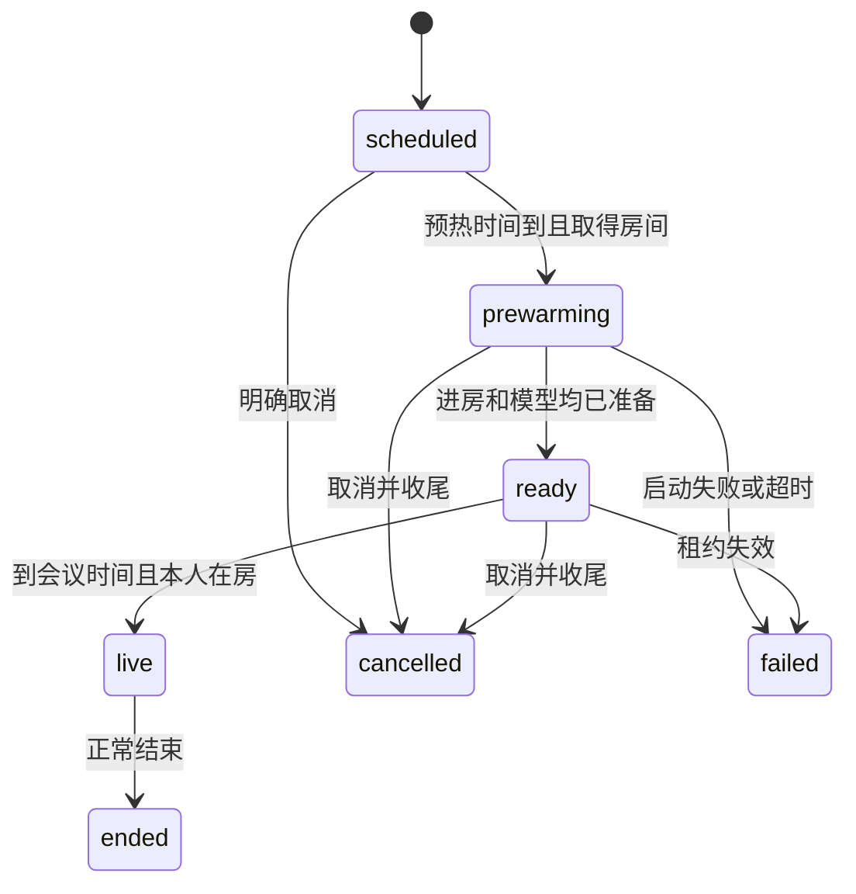

# FLY-2701 语音按需启动 — 实施计划
Issue: FLY-2701 (https://linear.app/geoforge3d/issue/FLY-2701/语音按需启动-语音进程平时不常驻开耳机模式-会议到点时才由系统启动空闲后自行退出founder-2026-09-17)
日期: 2026-09-17
基于: research.md

状态: 待有效设计评审。此设计取代FLY-2446常驻模型；2693健康来源继续复用，不复制告警系统。

## 1. Founder视角与最终范围

平时语音不运行；开启耳机模式立即要求系统启动，预约会议提前两分钟准备，结束后空闲两分钟退出。语音由launchd（macOS自带进程管理器）启动和持有，Bridge（团队共用后台）保管持久待办。无语音进程不影响定时器，因为它运行在已有Bridge里。

会议只交付Bridge预约合同与CLI直接操作，后继cos业务接入由Lead建单。本单不改Raya仓、不恢复旧gateway。Lead裁定c2452d96-ed5e-4773-9a76-211f31f59eed明确缩定调用方范围；原始founder“平时不常驻”及提前准备要求不变。

正常班车最多等待10分钟；若仍有通话则继续部署，通话可能被中断并明确告警。紧急授权重启不等待。此为Lead在7712f43a-8364-4842-8bdf-b00ff6257c50的最新取舍，替代“任何Bridge重启都不断线”的无条件承诺。不会声称崩溃后能自动接回。


## 2. 硬约束、依赖与时间指标

- 实施前FLY-2693、FLY-2655先合入；动updater前同步已合入FLY-2669/2657。未合向Lead报告顺序，不merge在飞工作分支。2693的需求revision、健康helper、reason和投递接口按最终合入代码对齐。
- `idleExitMs=120000`，最近一次会话全部收尾并首次成功空读后开始；未来未到预热时间的预约不留住进程。
- `prewarmLeadMs=120000`，由Bridge可信配置取值（允许60000–300000，部署时校验，不从请求任意覆盖），写入每条预约的冻结提前量；配置修改只影响新预约，已有预约需显式改期重算；正常提前预约在T时必须已roomReady+frontendReady。120秒是初始资源预算：52秒旧全程+未实测冷启+约一分钟调度/尾延迟余量，不冒充实测。QA若不能满足，修复或向Lead调参，不改口算通过。
- Bridge正常事件循环下，desired提交后立即wake；补扫间隔3000ms；launchctl单次deadline2000ms，每服务单飞、每3秒最多一次。正常宿主desired→系统受理目标≤5秒，命令超时/机器睡眠不声称硬实时；恢复后立即重估。
- 耳机每次实际`request→live <= 52.046s + C_i`，C_i为同次wrapper入口→daemon可claim的实测冷启。另列request→roomReady与firstHeard，不能用进房替代可通话。≥3次记录每次值和最大值，不以三个样本捏造p95。冷启可变、未测不得填估算。
- 即时耳机沿2693从有效需求起60秒未ready提醒，claim/PID不复位计时。预约未来等待不计故障，会议readiness deadline为T，到T仍未ready才报迟到；提前量与ready deadline同一预约事务冻结，不能沿用即时60秒阈值。明确启动错误立即告警、无进展60秒守卫仍可报故障；正常持续准备不能仅因超过60秒就误报。耳机120秒未ready、会议T+120秒仍未ready终结failed，保留未满足需求告警。60秒提醒不自动取消有效启动。

## 3. 状态和持久数据

StateStore是调度/占用唯一权威。新增 `voice_schedules`，未来预约不占现有voice_sessions的房间唯一槽。所有SQL参数绑定；server UUID、时间和revision严格解码，未知字段拒绝。

| 字段 | 合同 |
|---|---|
| schedule_id | server UUID，不由topic/label推导 |
| request_key, request_digest | 唯一键按credential主体+调用方UUID；相同键同冻结内容重放返回原收据，异内容409 |
| revision | 从1递增；修改/取消用expectedRevision原子比较；旧响应不可覆盖新版 |
| project_name, lead_id, guild_id, voice_channel_id, voice_bot_user_id | 验证注册表后固定身份；启动时重新验证drift，不跟显示名漂移 |
| meeting_id | 可选外部业务UUID，仅作关联；新预约鉴权不能凭知道ID就通过 |
| scheduled_at, prewarm_at, ready_deadline_at, presence_deadline_at | UTC绝对时间；预热=T−120s，presence=T+120s |
| state | scheduled / prewarming / ready / live / ended / cancelled / failed |
| session_id, session_revision | 当前实际会话及所对应预约版本；每次改期新会话，旧的必须先结束 |
| created_at, updated_at, terminal_reason | 历史可审计；cancelled不伪造恢复 |

voice_sessions新增可空schedule_id/schedule_revision、not_before_live_at、ready_at；projection parser、Bridge HTTP、client与saved session一起升级。即时旧会话字段null，旧磁盘projection可读；新schema旧binary不允许入场。重用2693 demandRevision，在reserve/desired/claim/ready/terminal/schedule到期及取消等影响需求的同事务里推进，不另造第二个计数。

`voice_schedule_requests`记录每次改期/取消的request_key+digest+result_revision+结果快照，用于请求响应丢失后准确幂等；在同事务内写，不靠当前revision猜重放成功。`voice_launch_attempts`仅有限审计（attempt UUID、sessionId、boot关联、时间、固定结果枚举），不是待办权威。保留30天终态记录，活动预约/未解决故障不清，接schema与retention registry完整登记。



状态图为主路径；live取消先ending再cancelled、无人到场T+120标ended/no_human；改期清旧session后回scheduled，见§5，不复活已terminal的预约。

新增 `voice_deploy_drain` 单行持久记录：serviceId、deploymentAttemptId、tokenHash、createdAt、waitDeadlineAt、leaseExpiresAt（仅draining阶段）、committedAt、state/releaseReason；token仅在受限调用凭据与0600 updater receipt中流转，不进日志。数据库唯一serviceId、更新校验tokenHash与attempt，读者不能凭文字创建/释放。此表也登记schema/retention。

## 4. 对外预约接口

新增 `voice-schedule-routes.ts` 挂 `/api/voice/schedules`，复用voice-session-auth的真实credentialTier、同项目/Lead权限、evidenceRoots canonical path、安全预检。不得从requestedBy文字推权限。不得让API指定launchctl label、UID、命令、host路径或token。新预约只接受meeting模式；现有rg即时路由不变。

- `POST /api/voice/schedules`：`{requestId, projectName, leadId, scheduledAt, topic?, evidenceDir, meetingId?}`。只允许ISO带时区且规范化UTC；T≥now，T≤now+30天；近于120秒预约立即准备并在收据注明lateAdmission=true，不承诺T准时。evidenceDir延续现有meeting校验。返回201 `{scheduleId,revision,state,scheduledAt,prewarmAt,lateAdmission}`；相同请求返回200同结果。
- `PATCH /:scheduleId`：`{requestId,expectedRevision,scheduledAt}`。只允许scheduled/prewarming/ready，live改期409；过期版本409。不能借改期换Lead/房间；需要换身份取消后新建。
- `POST /:scheduleId/cancel`：`{requestId,expectedRevision}`；可以取消非终态，原子递增revision、撤销尚未消费的启动意图并调用stop语义。取消响应是cancel accepted，不是已经退出；status带activeCleanup=true直到旧会话终态。
- `GET /:scheduleId`：真实状态、当前revision、ready证据、sessionId、故障和cleanup；不输出lease token/credentials。
- `flywheel-comm voice-session start --mode meeting --project … --lead … --evidence-dir … --scheduled-at <ISO> --request-id <UUID> --json`映射预约；新增 `voice-session schedule-status|reschedule|cancel-schedule`，带schedule-id及expected-revision；CLI帮助/解析/集成测试同步。已有start/status/stop不删除。

冷启动性能从CLI/HTTP收到请求开始记录preflight/provisioning，不能把前置慢调用排除在request→live指标外。注册后调用方可以退出，无需到点再次发请求。

## 5. Bridge调度、版本竞争与唯一房间

新增 `voice-schedule-runtime.ts`，作为现有voice runtime的一部分，Bridge启动立即执行、随后3秒cadence。调度步骤不等外网validate/poll：先读DB/更新到期候选和启动待办，外部副作用放独立单飞任务，每次都有deadline。Bridge旧tick中长validate/provision不得阻塞wake lane。

伪代码合同：
```text
reconcile(now):
  for due schedule ordered by (scheduled_at, schedule_id):
    transaction:
      reread state + revision; skip terminal/not due/drain fence
      if older session still active: mark cleanup pending; skip reserve
      reserveVoiceSession with scheduleId+revision under existing room uniqueness
      if busy: retain scheduled and original deadline; do not preempt
      else atomically link session and state=prewarming, advance demandRevision
  for each desired:
    if current schedule revision still matches and not cancelled/drained:
      requestWake(sessionId) // bounded async, no -k, no direct daemon spawn
```

provisioner进入desired前重读schedule revision；claim事务再核对同一revision+取消+drain。修改发生在上述任何await之后，旧副作用不可提交，已建Discord thread沿现有取消收尾；取消不得删除未确认的外部回执。跨进程只claim胜者能发音。

改期事务递增revision并先stop旧session；标scheduled且保留旧session作为cleanup引用。新版本到期也要等旧会话彻底终态，才分配新session；不得重用旧lease或并发两个bot。旧claim/ready/live回执返回409，旧进程按原lease fence停止。预约reserve幂等键为(schedule_id,schedule_revision)，修改StateStore当前meeting_id历史去重分支：仅未绑定预约的旧即时meetingId请求沿原逻辑，预约按新键查重；同schedule同时最多一条非终态session。getVoiceSessionByMeeting旧路由不承担新预约状态查询，新调用方用scheduleId。预约结束记录保留，不自动重建新的需求。房间被即时rg占用时预约等待到原deadline，T未ready告警；不抢走正在通话者。

Bridge重启直接扫描持久scheduled/desired；命令曾成功或PID存在不能抑制补扫。没有额外wake outbox：desired本身就是未完成待办，claim CAS才消费；新增launch审计不承担投递状态。已claim后daemon死亡遵循现有failed收尾，不重领旧session；需要用户新请求，不自动重join。

### 同一会议双入口去重（Lead合并裁定4891fab3，取代deca旧口径）

新预约只由Bridge API/CLI写入；canonical meeting.json不作为预约定时来源。当即时meetingId请求命中同主体/meeting_id的Bridge预约时，优先返回已有scheduleId/sessionId和状态，不reserve第二场；canonical仅用现有可信加载器核对meeting/Lead绑定。topic等显示文本不参与身份判定。不同Lead/房间/时间与当前预约不一致则409 voice_schedule_binding_conflict，复用2693同需求故障告警，不能自动覆盖预约或改期。scheduled未到期也不借即时入口提前启动。已终态预约不得被旧canonical重新创建会话；需要明确新预约requestId。查询/去重同事务，按canonical先发和schedule先发两个顺序测试，POST新预约遇到同meeting已有非终态即时session时409并报告冲突，不把旧即时会话偷转预约。

## 6. launchd、退出竞态与异常

plist固定 `RunAtLoad=false, KeepAlive=false, ThrottleInterval=1`，无StartInterval/CalendarInterval。安装器原有`ThrottleInterval==30`断言同步改为1；source/installed/loaded三者都验。1秒仅是配置值，实际kickstart是否绕过/服从节流不能凭man措辞推断；QA在短命实例退出后0/1/3/10/29秒再次请求，记录kickstart受理和真正wrapper入口时间，证明实际spawn等待纳入≤5秒目标及耳机总时限。若宿主实际节流仍超目标，验收失败，不能用受理成功或放宽C_i定义隐藏等待。删除SuccessfulExit子键；不能只改RunAtLoad。桥侧 `voice-launchd-waker.ts`仅用execFile('/bin/launchctl',['kickstart',fixedDomainLabel])，受信host配置绑定当前UID/label；deadline2秒、输出限量、只记录枚举结果，不shell拼接、不-k、不调用node语音入口。

启动调用成功只记accepted。失败三类统一接2693：kickstart明确失败立即startup failure；单元不存在/disabled/字节身份不匹配立即configuration unavailable且不偷偷安装/enable；进程存在但从未claim从desired原时间起60秒startup_not_ready。未知命令结果仍保留desired，下轮安全重试。重复失败复用同故障episode，不每次刷频道。宿主睡眠或Bridge停机不能保证实时送达，恢复补读、显示陈旧。

daemon run初次不等5秒先desired；无本地active/inflight/recovery、完整成功null连续120秒后停止接新工作、做最后成功读、有限收尾并exit0。读取失败清空idle计时，按2693退避与告警，不以错误当空闲。资源都释放：Discord/VAD、Codex子进程、timer、process lock、健康待写记录；正常收尾deadline5秒，不能清理成功就伪记exit0，超时记录shutdown_failed并非0退出。

竞态证明：最后空读N后新desired D，第一次kickstart命中尚未退出旧PID，旧PID退出E；D没有被claim所以仍是待办，E后下一次≤3秒扫描再kickstart，直至claim或明确失败deadline。Bridge在D后崩溃则重启第一次扫描同理。不能以一次kickstart受理清除D。若旧进程挂死没有退出，超时告警，不杀未知进程、不宣称已完成启动。

### 旧重启风暴刹车与按需失败预算

`scripts/restart-storm-gate.py gate voice`把每次正常启动都计入600秒/5次账本，第6次会hold并要求resume。按需wrapper从生产固定按需安装契约切换后**不再调用这个常驻服务gate**；不改其它service的风暴策略、不清旧ledger伪造恢复。旧voice hold若是风暴自动判据，迁移明确记retired_by_on_demand_policy且留历史；显式操作者禁用/停用仍保留为可信停用，不借迁移自动解禁。完整扫描wrapper、restart mounts、patrol repair及voice启动其它消费者，统一按需模式，禁止另一路重新gate voice。

替代刹车是同一StateStore需求上的有限失败预算，不限制正常会话次数：voice_launch_attempts新增actualBootId、spawnObservedAt、claimObservedAt、failedAt、failureClass；wrapper/cli通过2693现有startup观测提交实际boot事件，Bridge将其与当时唯一desired绑定。一个desired最多3个已证实失败的实际boot（配置/权限永久错第一次就停止重试）；只有kickstart重放、命令结果未知、或健康旧owner锁冲突不算新失败boot。命令本身错误仍按同需求最多3次尝试，3/10/30秒退避并记录nextAttemptAt；前一次结果未知先观察launchd identity和startup证据，不把未知当失败再无限起进程。预算耗尽写failed/startup_retry_exhausted并复用2693锁存未满足需求，停止自动wake，不永远留desired。每次claim消费该需求的启动预算；claim只代表启动结束，不当健康恢复。实际会话崩溃仍按原lease failed，不自动新建通话。新的明确用户请求是新需求，正常完成后再次启动不累计成“重启风暴”。

wrapper配置拒绝、host-tmux guard失败、锁helper不可用都交2693统一startup分类，保留原安全拒绝；不得用`exit0`吞掉失败意义。原startup-alert.ts的meta-alert仅在2693源不可写/不可用时作为fallback，正常已有同episode不得再弹桌面通知。进程锁conflict且能核验当前launchd/boot持有者健康或正在有限收尾时，仅记录benign_owner_conflict、退出0并保留desired补扫；无法证明健康owner的冲突记unknown，60秒无claim告警，不能立即把设计内竞态弹给founder。进程锁unavailable仍是明确故障。

PID文件不作为互斥权威：保留OS级process lifetime lock；删去“任何活PID就exit0”的早退，或严格验证daemon实例/启动时间/launchd归属后仅作诊断。不能杀复用PID。测试必须预置指向无关sleep进程的voice.pid并证明合法启动未被抑制。进程由launchd持有的父子证据由QA采集。

## 7. 预热、并行与测量先行

实施第一步只增加计时，先记录当前串行链真实样本，再改并行。required阶段名见research §5；记录各起止而不只总和，失败样本也保留。原始46.850秒无法追溯拆数，Lead已确认。禁止以猜测填这张表。

claim成功后立即建立SessionLifetime，再做token identity/createSession异步工作，避免启动慢于租约且尚无renew。令生命周期覆盖前置验证、两条启动支路、等待到点、founder presence、live、收尾；保持4秒renew/2秒HTTP/两次miss与本地deadline。

并行具体协议：同一AbortController启动room.start与frontend.start；等待两者完成且lease有效再报告ready。任一失败立刻fence/取消另一支，继续观察其settlement并在迟到完成时stop资源；不能Promise.race失败后遗留进房。两支和preflight有固定120秒会话启动总deadline、各操作不越过总deadline。保留model登录、account/read、只读thread回执；realtime ACK与实际ready通知分别记时，若协议无独立ready信号，将ACK标为协议准备并以真实双向音频验证可用，不把ACK直接宣传为听到了。

GenericVoiceSession新增 `ready` 与 `live` 两个门：ready之前不接受任何媒体；ready后会议到T之前也丢弃输入/输出音频，不缓存隐私音频、不产生transcript或用户消息、不朗读队列。房间状态明确“已准备，等待开会”。即时rg在ready且本人在场后live；预约必须Bridge验证now≥T且schedule revision仍当前，再允许setState live。等待本人以T+120秒为绝对截止，不从提前启动时算120秒。早到本人不提前开麦；无人到场标正常no_human，与配置故障分开。live前重新查询当前presence，不能沿用曾经出现过的一次布尔事件。

新增lease认证的 `POST /api/voice/sessions/:id/ready`，body为当前scheduleRevision（即时null）；StateStore同事务校验lease、warming状态、当前预约版本、未取消并写ready_at及schedule ready；重复幂等。session自身仍为warming，不新增并列session ready枚举。renew响应和projection带notBeforeLiveAt/presenceDeadlineAt；setState live必须核验ready_at和now≥notBeforeLiveAt，旧版本409。正常no_human终结允许warming→ended/no_human，同步StateStore allowed-map（warming→ended）、ended reason白名单（新增no_human）、live→ended额外限制（no_human仍不得由已live使用），以及VoiceEnd.ended.reason、route/client类型、source健康原因映射；不可沿现有failed/no_human偷偷将正常缺席算故障。

`ready_at`需roomReady+frontendReady+lease有效的真实回执；schedule ready允许等待T，不触发2693“未live60秒”误报。健康合同新增readinessTarget=ready|live与readyDeadline，信息来源仍同一demand snapshot；即时仍要求live，预约预热要求ready，到点改live；本人缺席正常显示等待，不把无本人当模型故障。启动终态failed仍锁存未满足需求，取消才closed_not_required。

## 8. 安装、巡检与部署等待

installer验证固定label、ProgramArguments、受信路径/权限、两个false、legacy单元不存在、未显式disabled，然后bootstrap注册；无需求时不kickstart，成功条件registered/identity verified，不要求PID。installed-idle重复安装幂等。现有plist不同必须走有权部署事务的session-free刷新，不能无条件bootout在通话单元。manifest从hold改setup，表示显式安装所有权；不用managed（其语义禁止loaded），不开copy自动安装。更新supervisor_assert_keepalive按需模式及测试，保持其他服务契约。

显式新增voice专用`voice_on_demand_contract_check`，供setup行convergence、census、installer和waker共同调用：核验source↔installed完整字节摘要、loaded ProgramArguments/固定label、RunAtLoad=false/KeepAlive=false/ThrottleInterval=1、受信路径owner/non-symlink；不能只因为选setup就假定有字节drift检查（现有仅copy检查）。setup继续不自动安装/覆盖；检测失败报configuration unavailable，waker禁止启动但不擅自bootout正在通话的实例。测试将installed plist替换为旧常驻字节，即使pid=-且exit0也必须非healthy。

census区分registered dormant与unregistered/config drift。无需求注册正常显示休眠；有需求采用2693 source检查启动/进房而非只看PID。未知需求保持unknown；旧none不能覆盖新required。先前非0退出是诊断历史，不让零需求无限发新失败；明确disabled保留操作者意图，有需求则告不可用不偷偷enable。

正常班车：在任何停止Bridge/替换voice构件之前，由restart transaction向Bridge申请新增voice drain fence（持久、绑定deploymentAttemptId、随机token、600秒固定deadline）。获取fence与检查全局非终态voice_sessions在同事务中完成：新的rg/reserve/claim/预约prewarm在fence下排队或返回503 retryAfter；已有claimed/warming/live继续renew，不能把drain当lease丢失。已provisioning/desired也算排空中，安全取消并明确结果或等待其终态，禁止遗留新claim。等待循环只读状态，每3秒一次，最多600秒。

fence生效后全空可立即重启；到deadline仍不空照常重启，记录defer_exhausted和受影响session IDs，2693负责中断告警。600秒依据是保留短会/收尾机会且低于Lead≤15分钟上限，不是测得的最优值。急迫founder授权request-restart走同fence但不等待，不增改授权机制。所有正常/回滚stop路径共用该守卫；不得只在后置ensure_voice_for_deploy加。

fence分为`draining`和`committed`：等待通话期间draining可每30秒续90秒租期；在任何stop_bridge之前，必须用当前attempt+token向Bridge执行原子commit-drain，确认持久state=committed及committedAt，并将回执原子写入既有updater受限0600 receipt。**committed fence无自动到期，不依赖已停Bridge续租**；600秒只决定何时结束等通话，绝不释放准入。新Bridge启动时先加载committed fence再开放voice admission，整个build/健康探测/Step3.5 voice刷新/回滚期间持续拒绝新claim。离线阶段只核验已冻结receipt和本部署事务锁身份，不能调用不存在的Bridge续期API。未收到commit收据不得把draining当committed。

同attempt+token只有在最后一次voice构件刷新/回滚和验证完成后才release；release失败不自动开启voice，重试精确release。draining租期过期允许Bridge解除并记录abandoned，但仅当未commit；迟到commit必须CAS拒绝，执行者重获时沿用原600秒等待deadline。committed updater崩溃时保持voice暂停并通过2693/部署告警显示drain_recovery_required，不以时间流逝开放。恢复由后续独立updater或既有运维命令接管：先取得现有全局restart事务锁、证明旧事务及其有界子进程均终止、完成/回滚构件一致性检查，再带原attempt receipt和新owner绑定CAS接管，最后release；单PID缺失/旧时间戳/任意请求体不足以解锁。不能保证旧子进程死亡则保留暂停并告警，这只冻结voice接入，不无限延期全舰队部署。

Bridge初始不可达而无法commit时，等候仍最多600秒，紧急不等；按Lead裁定可以继续重启，但要标continuity_unverified。此降级路径replacement Bridge健康后，必须先取得并commit新的同attempt drain（等待deadline仍原值）再执行任何后置voice构件刷新；若无法取得就跳过voice变更并标部署降级/未验证，不能无保护地-k刚恢复的通话。正常已commit路径启动后无需重申请，不因Bridge停机数分钟解除。

修改点：update-flywheel.sh班车attempt/窗口结果；restart-services.sh stop_bridge前共同守卫、ensure_voice_for_deploy、rollback；lib/restart-voice.sh需求敏感注册刷新。voice构件未变化时不-k语音；有变更且排空后刷新注册、由仍有效需求唤醒。无需求更新/回滚均不空启。合并与部署分离，只有独立updater按授权窗口部署；本设计节点不部署。

## 9. 切片与验证命令

每片依次：写下列失败断言→运行并确认红→最小实现→同套绿→提交；先完整合入依赖，不把旧设计原语抄一份。

| 片 | 文件/工作 | 关键失败断言和验证 |
|---|---|---|
| A 计时基线 | voice-codex/src/{cli,realtime,discord-room,session}.ts；新startup-timing.ts及测试 | 串行各段可关联，单调时间不受墙钟跳变；secret/任意error正文不出日志；QA保留优化前分段 |
| B 持久预约 | StateStore.ts、新bridge/voice-schedule-routes.ts、voice-schedule-runtime.ts、voice-session-start/routes/services/provisioner；schema初始化/迁移与retention | 重放同请求同收据、异内容409；旧revision拒绝；未来预约不占房；T−120重启补扫；改期与claim交错不双会话 |
| C 唤醒与退出 | 新bridge/voice-launchd-waker.ts，voice-session-runtime.ts，daemon.ts、config.ts、cli.ts，wrapper/plist | 最后空读→新desired→kickstart命中旧PID→退出→下轮启动；重复wake不-k；Bridge写后崩溃不漏；命令超时不消费desired；读失败不idle |
| D 预热并行 | session/realtime/discord-room/daemon、bridge-client/projection/saved-state | 两分支互不等待但live需两者+presence+T；取消发生在任意await都关闭迟到资源；提前进房音频/转录/队列零处理；lease覆盖createSession |
| E 健康安装 | 2693 health/demand/projector最终文件、install-voice-launchd.sh、lib/{supervisor,restart-voice,converge-nonlead-daemons}.sh、units.manifest、CLI voice-session.ts | no demand+no PID休眠；三启动失败类别同episode；failed不消警；ready等到T不误报；stale foreign PID不抑制启动；安装/部署/回滚无空启 |
| F 班车保护 | update-flywheel.sh、restart-services.sh、Bridge drain route+StateStore fence、新lib/voice-deploy-drain.sh | 原子fence与新reserve竞争；600秒上限、重试不延长、急迫不等；draining→committed确认后停Bridge，停机>90秒/10分钟重启仍暂停到Step3.5完成；旧token不能释放新版；committed崩溃不自动解锁；Bridge未知不伪空 |
| G 真机报告 | qa-driver.md、qa-report.md、脱敏证据附件 | 见§10，每项有实际命令/结果/时间、build/host/session/attempt关联 |

新增 `scripts/__tests__/restart-voice-on-demand.test.sh`，直接source实际lib/restart-voice.sh并注入launchctl/stub需求：idle注册不-k、active排空、drift拒绝、回滚同fence、disabled不enable；登记CI shell枚举。

新增测试建议：`voice-schedule-runtime.test.ts`、`voice-schedule-routes.test.ts`、`voice-launchd-waker.test.ts`、`voice-deploy-drain.test.ts`在teamlead/src/bridge/__tests__；`StateStore.voice-schedule.test.ts`；voice-codex/__tests__/`startup-timing.test.ts`、`daemon-idle-exit.test.ts`、`session-prewarm.test.ts`。扩展现有daemon/realtime/session/lease/parser测试。

命令（实施时按实际最终脚本执行并保存结果）：
```sh
pnpm --filter flywheel-voice-codex test:run
pnpm --filter flywheel-voice-codex typecheck
pnpm --filter flywheel-teamlead exec vitest run src/bridge/__tests__/voice-schedule-runtime.test.ts src/bridge/__tests__/voice-schedule-routes.test.ts src/bridge/__tests__/voice-launchd-waker.test.ts src/bridge/__tests__/voice-deploy-drain.test.ts src/__tests__/StateStore.voice-schedule.test.ts
pnpm --filter flywheel-comm test:run
node --test scripts/__tests__/install-voice-launchd.test.mjs
bash scripts/__tests__/flywheel-voice-wrapper.test.sh
bash scripts/__tests__/launchd-units-manifest.test.sh
bash scripts/__tests__/launchd-census.test.sh
bash scripts/__tests__/supervisor.test.sh
bash scripts/__tests__/updater-trigger-policy.test.sh
bash scripts/__tests__/converge-nonlead-daemons.test.sh
bash scripts/__tests__/host-tmux-selection-mounts.test.sh
bash scripts/__tests__/host-tmux-selection-census.test.sh
bash scripts/__tests__/host-tmux-selection-restart-mounts.test.sh
bash scripts/__tests__/restart-storm-gate.test.sh
bash scripts/__tests__/restart-voice-on-demand.test.sh
```

comm实际package名为flywheel-comm；禁止零收集假通过；增加新shell suite到CI枚举。扩展retention/schema清单完整性测试。外网/launchctl/时钟用注入fake做确定性交错，单元测试不碰生产库、不发真实Discord。变异验证至少删除补扫/去掉revision核对/提前audio门/允许idle -k四个分别让测试红。

## 10. QA和验收，设计不替代实测

正常updater部署后在真机采集候选build、host、service label、bootId、sessionId、schedule revision。数据库若需副本必须走snapshot-control受管快照，不cp活库。至少以下证据：

1. 初始无会话，launchctl print显示注册但未运行、无voice PID/子Codex；持续超过两轮巡检不被拉起。安装、重启Bridge、idle部署也不产生空启。
2. ≥3次真正冷启动耳机：每次先证无PID；记录全链分段、C_i、request→roomReady/live/firstHeard、实际双向语音；逐次比较52.046+C_i。另有优化前串行分段对照，不用估计填进房/Codex/realtime。
3. 通过真实CLI/POST预约至少提前120秒以上，提交后停止调用方；T−120附近由Bridge触发，T时room+frontend已ready；T前输入音频不转录/不送Lead，T时本人在场能说能听。本人缺席到T+120才no_human；晚预约标lateAdmission不算准时通过。
4. 结束后120秒空闲+最多5秒收尾退出0，launchctl未运行；未来预约不常驻。另在隔离真launchd服务连续10分钟触发至少6次合法按需启动（测试配置缩短idle窗口，保留生产120秒独立验证），证明不会触发旧storm hold；再故意注入3次真实失败证明按需求刹车和告警。实测短命退出0/1/3/10/29秒后重启的系统等待，不能靠假launchctl证明无30秒尾延迟。精确屏障注入退出临界新会话，保存两个boot及同一desired→claim证明不漏；中间Bridge重启重复该项。
5. kickstart失败、单元缺失、进程无claim、起来后room失败分别触发2693真实工程频道消息回执+固定页；无PID休眠阴性不告警；失败转terminal不消警，恢复须真实成功。
6. 改期、取消在provision/claim/ready边界，旧revision无音频；同房冲突不抢占；sleep/wake、墙钟跳变、Bridge启动补扫。单进程锁真实拒绝并发但不误杀复用PID。
7. 授权隔离环境验证班车：短会完成再更新，600秒仍通话则按裁定更新/中断告警；urgent零等待；真实观察短Bridge中断同lease继续、超过窗口failed且无自动rejoin。不在未经批准的生产通话上注入故障。
8. founder亲测一场后才标产品验收通过（FLY-2642 v2 §2.3⑤）；之前报告“工程已测/待founder亲测”，不能宣称全单可用。本节点只交付设计，不等待或伪造这项后继验收。

## 11. 迁移、回滚、后继

schema增量向前；旧即时会话字段null照旧，先排空再切launchd契约。迁移期间Bridge必须先有调度/健康理解能力、daemon支持新projection后才开放新预约；新能力版本不匹配拒绝scheduled API，不把预约写给旧daemon。已有未来预约升级后补扫，已过T+120且无进行中会话标missed/failed并告警，不启动迟到旧会。

回滚到支持按需的前一构件需保留预约/receipt/健康历史，依旧不空启。回滚到常驻旧binary/plist无法满足硬要求：必须关闭新预约接入、明确取消或迁移未完成预约并保留收据，排空后由有权发布流程决定回滚，不静默恢复RunAtLoad常驻。任何未知schema不删库不补造成功。

后继建议交给Lead：S1 FLY-2694将cos落地Flywheel之后，在`packages/raya-cos/src/meeting-round.ts`排会/改期/取消处调用本预约API，`meeting-voice.ts`存Bridge scheduleId/revision/receipt，`meeting-artifact.ts`不再等到T才唯一投影；业务meetingRevision与Bridge expectedRevision显式映射，失败补偿不得重复排会。旧apps/brain的15秒tick只作历史对照，不复活。此后继单承接founder自然语言预约全链，本单QA用直接CLI/POST。
