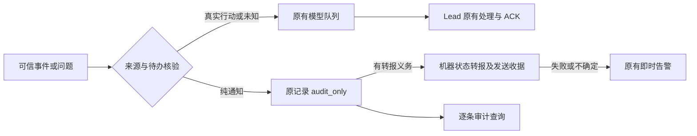

# FLY-2749 纯通知停止唤醒 — 实施计划
Issue: FLY-2749 (https://linear.app/geoforge3d/issue/FLY-2749/额度lead-成本-lead-会话占-fable-额度-92percent每个小事件都唤醒-lead每轮重读-50-60-万-token)
日期: 2026-09-18
基于: research.md

## 1. 给 founder 的结论
修好已经存在的 `lead_token_savings`：确定没有待办的通知保留记录、需要转报的由机器发一句状态，停止为它们单独调用 Lead 模型；真问题、失败和批准继续立即进入 Lead。

本设计沿用 FLY-2567/#1204 的 audit_only（只记审计、不向模型投递）和同一开关。不是重新建设合批队列。最新范围与硬验收由 exploration.md 的两条 Lead 指令及问题 ae5477ac-dea7-4401-86c7-aa256908270a 确认。上下文、模型窗口、规则/记忆瘦身、用量页面全部不做。设计通过不等于已上线或节省已实现。

## 2. 为什么原来没拦住
- 开关实际 ON，已有大量 audit_only 行；不能声称旧功能完全没工作。
- 普通阶段名单只有六种；混入的旧 decision_route 还把部分 implement/test 重新判成需要行动。
- REVIEW 和报告走另一条 canonical mailbox（唯一收件箱）入队链路，不经过 event-route 分类；只在最终 runtime 加一条 guard 不够。
- 启动、动作、workflow 事件还有不同 producer（事件产生处），默认均是 model。逐类事实见 research.md，不能把类型名自动等同于纯通知。

## 3. 总体流程

只改变模型投递选择。原阶段状态更新、review启动、线程建档、Lead指令完成收据、工作流判决等业务副作用先正常完成；classification 不授予任何新执行/审批能力。

## 4. 类型决策表（所有 Lead、所有 vendor）
策略模块仍在 `bridge/EventFilter.ts`，将 boolean trustedBridge 升级为内部 typed evidence；外部 body 中的同名字段不作为证据。返回 `{disposition, reason, policyVersion:'notification-v1', proofRef?, relayKind?}`。开关OFF或读取失败全走原 model；未知/证据缺失/检查失败也是 model。必须在真实 producer 边界根据受信任数据库/调用路径建 evidence，不能由 runtime renderer 猜测。

| 类型 | 可 audit_only 的必要证据 | 必须 model 的反例 |
|---|---|---|
| stage_changed | 原事件已通过 insertStageChangedEvent 校验；stage 为六普通阶段，或 design_review/code_review/pr_created 且独立 review/PR处理义务已有权威 owner；当前没有该事件引出的未结行动 | approve/ship/completed；错误、真实未结 decision、混入 founder/ASK；无owner的review开始 |
| REVIEW gate_question | 复用 isReviewGateCheckpoint；通过原 eligibility/Lead作用域检查；属于现有跨模型review回答通道 | 非REVIEW；普通 question/brainstorm/founder_review/approve_to_ship；unknown checkpoint |
| trusted runner-stop | 现有 trusted三元组 + runner_stop_declarations 中 exact questionId、execution、state/content hash；reason=done且当前phase/terminal完成收据证明无待办；必须的状态relay已登记 | blocked/quota/context_full/error；awaiting_approval 若审批尚未完成；其他 reason/伪造前缀/缺声明 |
| 纯DONE report | kind=report +结构化 producer receipt，服务端回查 exact执行、目标Lead、事件/claim/指令ID、完成状态、正文digest一致；所有引出义务已完成 | DONE字样、kind=report本身、模型自报needs_action=false均不足；review findings、交接请求、权限请求、带未结advisory默认model |
| session_started | 已完成有效session/activation/attempt注册；普通首次启动；无错误或动作；必需启动公告登记为机器relay | replacement/retry启动含待办、owner不明、未完成线程/注册、失败 |
| monitoring_reestablished | Heartbeat真实恢复探测/接管成功 receipt，当前恢复事件无独立未结告警；旧status不是新义务证据 | monitoring_lost、error/stuck/告警仍在；恢复未确认 |
| replacement_eligibility | 仅 next_check_disposition=replacement_candidate 的未来重查提示；持久timer、exact当前attempt证据；Lead已在问题 d6989f8f-baa2-4340-9e89-56dc78ae5fe0 明确批准该窄例外 | 实际replacement、环境hold、retry-limit hold、timer不明、死亡确认/owner不明全部即时 |
| workflow_claim_recorded | 本轮默认保留 model；只有现存 exact claim 后续义务全部完成的收据才允许无动作副本 audit；不得为扩大比例假造完成 | 未处理返工、结果汇报或ship判决；FLY-2152巡检仍认为pending的claim |
| action_executed | 已完成纯记录动作及要求的公告、有exact action receipt，后续义务为空 | approved_to_ship、reject/defer/retry/shelve引出待办、失败、未知action默认model |

Founder消息、ASK、非REVIEW gate、session_failed、真正replacement、所有告警优先命中 model；含这些内容的混合事件也不静默。alert消失必须由其原生命周期收据证明，不能用新开关自动结案。

### 4.1 不删安全guard，区分旧状态
现有 raw payload 的 actionable字段继续否决。enriched session.decision_route非空时回查对应当前执行/判决：只有 exact decision 已有消费/履行收据且此stage无新义务，才标 inherited_resolved；缺ID或无可靠关联继续model。status同理：awaiting_review只是旧状态不等于监控恢复本身需处理，但其未结review义务仍必须由原owner负责。所有忽略字段要写 reason+proofRef；不能把 guard列表缩短当修复。

### 4.2 结构化DONE的具体边界
扩展 `ask --report` 可选 `--receipt <receipt-id>`，不是 `--quiet`。沿用现有 sender_ref/执行身份。桥接层resolver只支持版本化receipt类型：`runner_stop_done`（声明+完成证据）、`workflow_phase_completed`（exact已接受的phase decision且后续owner已接管）、`lead_instruction_applied`（exact instruction消费收据且没有残留follow-up）。每种通过现有权威存储lookup，不解析正文猜状态；缺可用receipt的现存报告维持原行为。
receipt结构冻结 `{version:1, kind, sourceId, executionId, leadId, contentSha256}`，只存引用/摘要，不存凭证。重复同questionId但不同receipt或正文409；非report携receipt400；跨执行/Lead、过期generation/不存在source拒绝quiet但不得吞消息，记录model reason。真正处理的Lead指令完成receipt必须在投递抑制前落库，不能靠Lead阅读DONE文字才更新。

## 5. 唯一收件箱的持久合同
### 5.1 最小增量schema，原身份不变
`lead_events.delivery_disposition` 继续为 model|audit_only。CommDB mailbox增加：
- `delivery_disposition TEXT NOT NULL DEFAULT 'model' CHECK(...)`
- `notification_policy_version TEXT NULL`, `notification_reason TEXT NULL`, `notification_proof_ref TEXT NULL`, `notification_decided_at TEXT NULL`。
不增加队列、不新增15分钟timer、不改变 delivery_id/questionId/seq。旧行默认model；不自动静默或重放历史。`msg_class`不改成protocol；纯通知也不是协议命令。

### 5.2 canonical admission与模型claim
`QuestionAdmission.revalidate` 完成原eligibility后、任何 render/materialize 前计算策略。新增明确union分支 `{deliver:false, disposition:'audit_only', auditDecision}`；LeadInboxLoop不能把它送进现有markDead/retry路径。
在持有 ownerEpoch/batchId 的新候选批、retry_count=0且未handoff时，`MailboxQueue.releaseClaimForAudit` 事务做：校验原delivery identity和未handoff证据→保存auditDecision→state回QUEUED、清claimed_by/claim_expires_at/batch_id→写 mailbox_log 审计。保持 relay_state/resolved_at/acked_at/delivered_at 不变。claim/retry/pending-model/dead-letter统计查询统一过滤 `delivery_disposition='model'`，防audit行不断被领到。原本不存在的独立relay obligation仍可pending，不能以QUEUED数量判断卡住。
必须保留现有freshBatch或未materialize证明（lead-inbox-loop.ts:342）；不得仅用retry_count=0判断可变，因为adapter可能已拿到冻结成员但崩溃未回执。已handoff/frozen batch完全沿用原成员、重投及ACK，不做本轮追溯重分类。

### 5.3 两库失败恢复，不假装跨库事务
question投递选择以CommDB mailbox的持久decision为唯一权威，lead_events是审计镜像。顺序：
1. 带owner fence的CommDB事务提交decision及所需状态relay intent。
2. 用原稳定eventId `gate_<qid>` / `runner_q_<qid>` 幂等append audit_only镜像；保存seq关联。
3. 下次正常inbox tick先有界修复缺镜像的audit行（最多100条/Lead/tick，持久cursor；错误可重试），不重开模型投递。registry/legacy导入检查canonical disposition后才可派发，不得从旧model镜像复活。
若第1步失败不claim成功，不调用adapter，下一tick按原身份重试。第1步后宕机，question仍pending且可回答，模型claim排除；第2步恢复补镜像。若已存在model镜像且未handoff，可在验证same identity与canonical audit后CAS修正；若已有handoff，维持原model决策到结束。已有audit镜像不能被append去重改回model。
Non-question事件仍以StateStore原eventId+leadId决策为权威，在原事务/producer中存disposition；queue导入原样带入，不复制另一分类词表。

### 5.4 question与ACK守恒
REVIEW audit行继续open、pending、可request-review绑定、reviewer respond和超时；不得terminal_dispose/填response/ACK。未绑定review或失败由原review超时/失败事件立即唤醒，不新增轮询模型。
report-only静默是“无模型消费”，不能写report_ack。纯状态完成若原业务需要结清report relay义务，只有机器relay真实sent收据与no-action proof俱全才写 `resolved_via='notification_relay_sent'`；这是机器履行单向转报，不是回答或模型ACK。禁止用于REVIEW/ASK。
只读 audit inspect 命令/现有events查询返回逐条ID、类型、正文引用、分类理由、proofRef、relay状态；有权限范围过滤和参数化SQL。不要以审计分类伪造 delivered_at。原live/archive查询、bootstrap、pending attention、getPendingQuestions和保留/GC路径均需消费者sweep：model唤醒视图排除quiet；审核权威pending视图保留REVIEW；audit只在原持久义务完成且既有retention门满足后才归档。未投递不是死信，不新增死信告警噪音。

## 6. 必需的一句状态：由机器履行
不修改规则包内容（最新scope禁止规则改动），只在纯通知的生产投递路径实现等价业务副作用。quiet payload不会进入Lead；需要Lead行动的原路径继续原转报/ACK合同。

增加一张窄用途 `notification_relay_receipts`，承载现有必需thread公告的发送收据，**不是待合批模型队列**：`(project,leadId,sourceId,relayKind)`唯一；字段 `contentDigest,destinationThreadId,state(pending|sending|sent|uncertain|failed),attemptId,leaseUntil,messageId,errorCode,updatedAt`。question来源与auditDecision同CommDB事务落intent；event来源用stable eventId的既有桥接tick幂等ensure intent，并以source记录补偿崩溃间隙。不存在合法intent之前不发布quiet副作用完成。
复用 `bridge/tools.ts` 的 canonical chat-thread lookup和 `postDiscordMessageToChannel`，不走某vendor独占sender。模板仅可信issue显示名、执行phase、规范reason（例“FLY-2749 · Runner 已完成设计阶段。”），禁自由文本指令、@mentions和链接注入；allowed_mentions.parse=[]。始终用原Lead/project/thread身份，缺thread不乱投general。
既有inbox tick/后台tick处理这些有限intent：sent不重复；pending经租约CAS进sending；成功存实际messageId+目的地。已知失败释放重试（30s/2m/10m上限3次）并通过既有即时infra告警提示原sourceId；权限/路由缺失立即告警。外部发送后本地提交前崩溃，sending过期置uncertain，先按nonce/历史receipt核对真实messageId；无法证明则告警交Lead裁定，不能盲目重复，也不能声称exactly-once。
在这个不确定状态下quiet模型通知仍不冒充sent，补救告警单独走model；relay失败不能吞掉原业务义务。上线须验证成功/失败/未知三格。状态计数与可查原source必须在同一审计输出，不能以“已构造模板”当成功。

## 7. 代码触点与实施顺序
实现者先红测再最小改动；每项独立提交，所有修复在同一reviewed head验证。

| 步骤 | 文件 | 红侧和绿侧证明 |
|---|---|---|
| T1 冻结根因fixture | `teamlead/src/__tests__/EventFilter.test.ts`, `event-route.test.ts` | 29 ordinary stale-route类、review/pr阶段无待办、真未结decision负例；旧代码应产生多余model，新代码仅证明无义务时audit |
| T2 receipt/分类 | `bridge/EventFilter.ts`, 新`bridge/notification-proof.ts`, `flywheel-comm/src/commands/ask.ts`, `db.ts`, `mailbox-queue.ts` | 伪DONE/跨Lead/缺receipt不静默；exact完成receipt可静默；同ID内容冲突拒绝；scope/error优先级不变 |
| T3 canonical+legacy | `bridge/question-admission.ts`, `lead-inbox-loop.ts`, `gate-poller.ts`, `runtime-registry.ts`, `lead-inbox-runtime.ts` | 真insertQuestion→claim→admission→adapter调用计数=0；review照常bind/respond；旧legacy和redrive都不复活 |
| T4 producer补齐 | `bridge/event-route.ts`, `HeartbeatService.ts`, `bridge/actions.ts`, `StateStore.ts`, `bridge/workflow-replacement-lead-event.ts` | 逐类走真实producer而非手造classifier；所有side effects一致；claim待办和实际replacement仍触发model |
| T5 状态relay | 新`bridge/notification-status-relay.ts`, `flywheel-comm/src/mailbox-queue.ts`/schema, `bridge/tools.ts`共享发送逻辑, `discord-utils.ts` | source→正确thread→messageId；断网、403、缺路由、send后宕机；exact source重复无已知重复转报 |
| T6 消费者一致性 | `flywheel-comm/src/db.ts`/`mailbox-queue.ts`, `bridge/bootstrap-generator.ts`, `StateStore.ts`, `scripts/lead-patrol-snapshot.sh`涉及query | quiet不变死信/模型pending；REVIEW仍待答；audit内容不丢；live/archive/GC/expiry/rollback均区分义务和投递 |
| T7 独立QA交付 | 本folder evidence、验证报告 | 全Lead vendor矩阵，真实延迟样本与24h脚本；没有部署就不能PASS生产 |

不可为本单顺手改 FLY-2152 duty语义；claim在没有已完成receipt时保持model，也不移除巡检。若某候选类别不具备安全proof，记录该类别`model:proof_missing`及数量，不能写“所有候选已压”。实现报告逐项对照类型表，不得以classifier单测代替production path。

## 8. 验收矩阵与命令
### 必须通过的逻辑/集成检查
1. ON/OFF/项目覆盖/flag读取失败四格，各用Claude与Codex adapter；至少两个Lead且不同project，禁止硬编码flywheel-eng-lead。
2. 八类每个正负例；真正founder/ASK/非REVIEW/session_failed/replacement/告警不被抑制；malformed或mixed payload不误判。
3. REVIEW create→audit→request-review→reviewer response→runner消费链路完整；check不因quiet提前resolve，review timeout保持即时。
4. fresh batch中 quiet+urgent：quiet在freeze前移除，urgent继续本tick投递；已frozen混合batch保留原ACK集合；伪ACK/部分ACK/重放/owner rebirth/expiry不改变原保证。
5. 每个两库存储边界kill/restart，最终exact原ID只留一个分类，quiet无模型调用、无丢审计；旧model行不自动迁移。
6. stop/done消费证明、机器relay成功/失败/uncertain、外部输入escaping/mentions负例；输出source→目标thread→messageId证据，不用log中的channel标签代替。
7. ON→OFF只恢复新决策；OFF时不可因旧guard强制quiet。既有audit历史不自动重放，未完成机器relay继续履行，不丢pending义务。ACK正确性修补独立于开关。

命令（实现者按实际包gate运行，不在设计阶段声称已跑）：
```
pnpm --filter flywheel-comm exec vitest run src/__tests__/mailbox-queue.test.ts
pnpm --filter flywheel-teamlead exec vitest run src/__tests__/EventFilter.test.ts src/__tests__/event-route.test.ts src/__tests__/lead-token-savings.test.ts
pnpm --filter flywheel-teamlead exec vitest run src/bridge/__tests__/lead-inbox-loop.test.ts src/bridge/__tests__/question-admission.test.ts src/bridge/__tests__/lead-inbox-runtime.test.ts
pnpm --filter flywheel-comm build
pnpm --filter flywheel-teamlead build
```
新增notification tests一并运行，上述现存test路径已在设计时核实；不得跳过缺失文件。按仓库规定执行完整冻结head checks、review与QA，不以这组focused tests替代全门禁。

### 真机与24h验收（实现/QA持TURN执行，设计不执行）
硬门：对可证纯通知按原source ID联结 producer receipt→audit decision→mailbox disposition→runtime call ledger→transcript，model投递=0；原始审计逐条可查询，机器必需转报有真实receipt。负证据必须覆盖整个选择窗口、两vendor和redrive，不是截一张空日志。
紧急四类 founder、ASK、非REVIEW gate、session_failed 各在部署前后真机送一条，另含backlog/quiet混合/重启恢复对照。记录 t_ingress、t_commit、t_transport、t_model_consumed、t_first_action，原message/qid、batchId、adapter turnId。founder probe由真人发送，不冒用身份。单样本只证明样本；按预先相同负载方案比较延迟，不把transport ACK当模型消费；任何已测新增延迟或丢失先FAIL排查，不能用节省掩盖。持续窗口提供p50/p95/max与样本数。
`measure-usage.py`同SHA比较9/17、完整9/18与独立updater部署后的连续24h；9/18当前partial不得作为完整日基线。全模型、Fable子集、外部turn数、模型requests、四usage、subagent额外开销、工作量分母都报告，混合/unknown不藏。归因包括同turn所有工具往返直至下次外部输入。日总下降≥60%作为监测目标，不是本设计硬门（Lead明确裁定）；未达须写实际差值与剩余来源，不宣称目标实现。

## 9. 回滚、迁移、边界
开关仍为 lead_token_savings，一个来源、按项目/全局现有优先级读。没有新开关，没有模型/窗口/规则变更。schema additive default=model；rollback先关flag，停止产生新quiet决策，保留认识audit字段的消费者直到pending relay完成，禁止旧二进制无过滤claim已audit的QUEUED行。若必须回退旧代码，先由持权运维排空/停用新消费者并确认quiet行不被旧claim扫到；不能只回退代码宣称无损。不要删除已有audit记录或重新发整段历史。
已投递batch不追溯；历史quiet不自动补投；确需历史重放是另有授权的操作。默认OFF读失败恢复模型路径，告警/ACK correctness不受此开关控制。发布、独立updater激活、24h生产量测仍是后续有权阶段工作。

## 10. 设计交付状态
有效评审以 review-receipt.json 的 reviewVerdict 为准。必须先获得APPROVED，再发布最终founder-report.html（静默），报告URL，提交推送所有文档与证据，然后走 phase_design_complete/park。当前尚未实现，无生产PASS声明。
