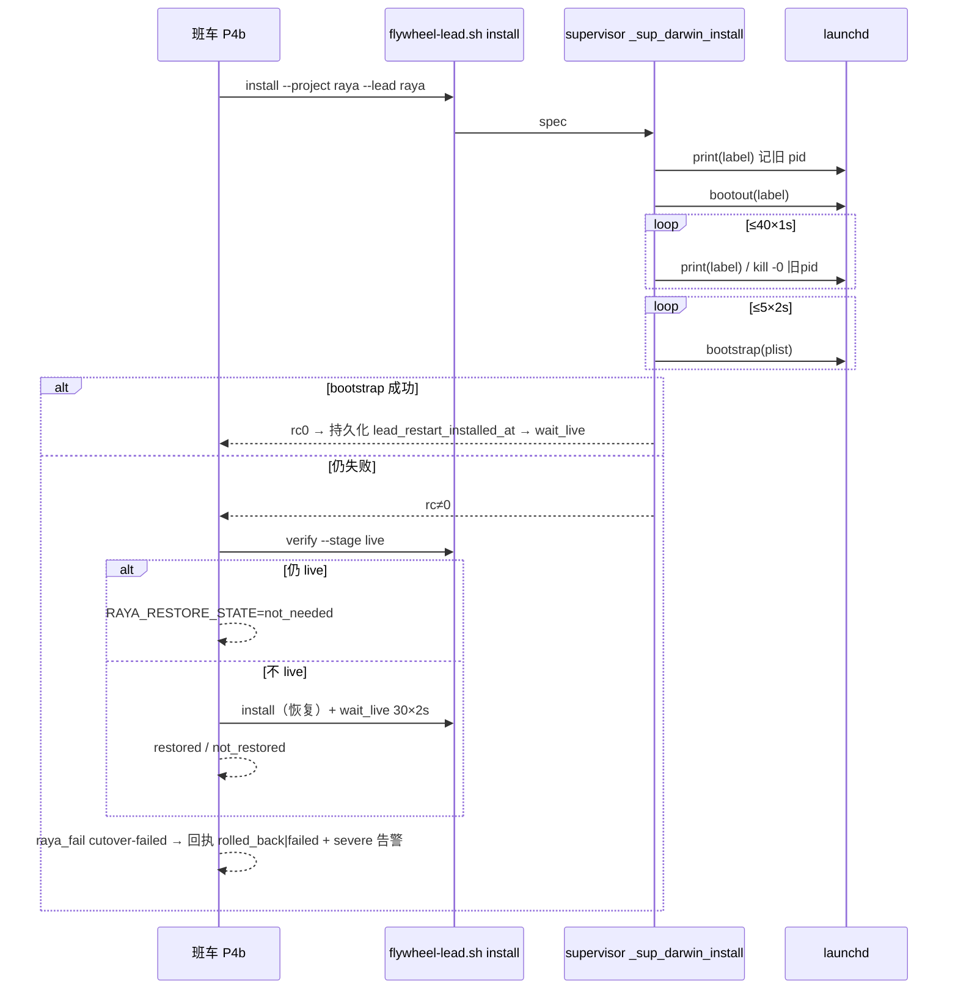

# FLY-2758 Raya 割接 bootstrap EIO — 实施计划
Issue: FLY-2758 (https://linear.app/geoforge3d/issue/FLY-2758/raya上线阻塞-09-19-0009-班车割接失败-cutover-failed15-项-preflight-全-pass但)
日期: 2026-09-22
基于: research.md

## 目标与边界

修两个断点，不改 P0–P7 状态机语义、不改 v2 回执 key 集合、不改 shuttle-reasons 注册表、不新增依赖：

1. `scripts/lib/supervisor.sh:_sup_darwin_install` 在 bootout 与 bootstrap 之间等待 label 真正离开 launchd domain（且旧 pid 退出），bootstrap 有界重试。
2. `scripts/lib/updater-raya-deploy.sh` 的 P4b 在 `install` 失败后立即恢复标准 Lead：live 仍在 → 不动；不 live → 再 install 一次并按既有 30×2s 等 live；回执与告警如实写「已恢复 / 未恢复（Raya 离线）」。

本节点不运行班车、不 bootstrap/bootout 任何生产 label、不改生产账本或回执；生产恢复由合并后的班车或 founder 授权的一次 `install` 完成。

## 最小实现

### A. `scripts/lib/supervisor.sh`

* 新增私有 helper：
  * `_sup_launchd_absent <target>`：`launchctl print` rc≠0 且 stderr 匹配 `could not find service|no such process`（大小写不敏感）→ 0；rc0 → 1；其他输出 → 2（fail closed，按 loaded 处理）。
  * `_sup_launchd_pid <target>`：从 `launchctl print` 取首个 `pid = N`，无则空。
  * `_sup_darwin_wait_unloaded <target> <old_pid>`：`FLYWHEEL_SUPERVISOR_BOOTOUT_WAIT_ATTEMPTS`（默认 40，`^[1-9][0-9]*$`）× `FLYWHEEL_SUPERVISOR_BOOTOUT_WAIT_INTERVAL`（默认 1，`^[0-9]+$`）轮询；条件 = label absent 且（old_pid 为空或 `kill -0` 失败）；非法环境值回退默认并打 warning。
  * `_sup_darwin_bootstrap_retry <domain> <plist> <label>`：`FLYWHEEL_SUPERVISOR_BOOTSTRAP_ATTEMPTS`（默认 5）× `FLYWHEEL_SUPERVISOR_BOOTSTRAP_INTERVAL`（默认 2）；每次失败 `_sup_log "bootstrap attempt i/n failed rc=R for label"`，launchctl 的 stderr 不吞。
* `_sup_darwin_install` 尾部改为：记旧 pid → bootout → `_sup_darwin_wait_unloaded`（超预算只 warning，不中止）→ `_sup_darwin_bootstrap_retry`，失败仍 `_sup_err "bootstrap failed: $label"; return 1`（错误串不变，`raya`/lead 日志消费者不受影响）。
* linux / delegating no-op 路径字节不变。

### B. `scripts/lib/updater-raya-deploy.sh`

* `updater_raya_pass` 初始化 `RAYA_RESTORE_STATE=""`。
* 新增 `raya_recover_standard_lead_after_install_failure`：
  1. `raya_standard_lead verify --stage live "$RAYA_CANONICAL_MANIFEST"` 通过 → `RAYA_RESTORE_STATE=not_needed; return 0`。
  2. `raya_log`「standard Lead not live after failed install; restoring」→ `raya_standard_lead install --project raya --lead raya && raya_standard_lead_wait_live` → `restored; return 0`；否则 `not_restored; return 1`。
* `raya_standard_cutover` P4b 两臂的 `install` 失败分支改为：`raya_recover_standard_lead_after_install_failure || true; return 1`。账本不写（`lead_restart_installed_at` 保持 null，下一班仍是 verify live → install）。
* `raya_fail`：
  * `state=failed`；`RAYA_RESTORE_STATE=restored` 时 `state=rolled_back`。
  * 告警正文：`not_needed` →「…; standard Lead was never unloaded and is still live」；`restored` →「…; standard Lead restored and live — Raya remains conversational; the shuttle retries next window」；`not_restored` →「…; standard Lead could NOT be restored — Raya is OFFLINE (no carrier loaded); manual `flywheel-lead.sh install --project raya --lead raya` required」；空 → 原文。
  * `RAYA_DEPLOY_STATE=$state`，回执 `raya_write_standard_receipt "$state" "$detail"`（`failure` 仍是注册过的 `cutover-failed`，`outcome` 为 `rolled_back` 或 `failed`）。`updater_observation_record_raya` 对 `rolled_back` 走默认臂，按 `detail=cutover-failed` 记 failed，不改观测代码。

### C. 测试夹具

* `scripts/__tests__/flywheel-lead.test.sh` 两处 `launchctl` 桩改为状态化：`bootout <target>` 写 `$TMP/launchctl-absent/<label>`；`print gui/<uid>/<label>` 若标记存在则 stderr `Could not find service "<label>" in domain for user gui: <uid>` 并 rc1；`bootstrap <domain> <plist>` 删除对应标记。其余行为（记录调用、verify 用的 running 输出）不变。
* 不动 `fly2264-verify-native-cutover.test.sh` 等只读 `print` 的桩。

## TDD 顺序

1. `supervisor.test.sh` 先红：
   * S8：桩 `print` 在 bootout 后前 2 次仍回 running（pid 4321），第 3 次起 `Could not find service`；`bootstrap` 在标记未清时 rc5 并打印 `Bootstrap failed: 5: Input/output error`。断言：调用序列 `print, bootout, print×3, bootstrap`，install rc0，bootstrap 之前没有出现过 rc5。
   * S9：`print` 恒 running；`ATTEMPTS=3 INTERVAL=0`。断言 install 仍尝试 bootstrap（桩 rc0）并 rc0，stderr 含 `still loaded after bootout`。
   * S10：`bootstrap` 恒 rc5；`BOOTSTRAP_ATTEMPTS=3 INTERVAL=0`。断言 bootstrap 恰好 3 次、rc1、stderr 含 `bootstrap failed: com.flywheel.<name>`。
   * S11：非法环境值（`ATTEMPTS=abc`）回退默认且不崩（用 `BOOTOUT_WAIT_INTERVAL=0` 保证时长）。
2. `updater-raya-deploy.test.sh` 先红（沿用 `raya_standard_lead` 函数桩 + `CALLS`）：
   * preexisting 臂 install 失败、post-failure live 失败、恢复 install 成功、第 2 次 live 通过：cutover rc1；`CALLS` 精确为 `verify live, install, verify live, install, verify live, wait 2, verify live`；`RAYA_RESTORE_STATE=restored`；账本 `P4b` 且 `lead_restart_installed_at=null`。
   * 同上但恢复 install 失败：`not_restored`，`CALLS` 无多余 wait。
   * install 失败但 live 仍过：`not_needed`，恰好 1 次 install。
   * fresh 臂（`cursor.status=seeded`）install 失败同样进入恢复。
   * `updater_raya_pass` 级：restored → `RAYA_DEPLOY_STATE=rolled_back`、回执 `outcome=rolled_back failure=cutover-failed deployed_sha=null`、`raya_alert` 收到 severe 且正文含 `restored`；not_restored → `failed` + 正文含 `OFFLINE`。
   * 下一班：install 成功 → P5，且 `install` 只出现 1 次（既有语义不变）。
3. 最小实现 A/B/C，跑绿。
4. 阴性对照：`bash scripts/__tests__/fly1663-bridge-launchd.test.sh`、`flywheel-lead-packaging.test.sh`、`shuttle-unit-results.test.sh`（观测分类不变）。

## 本地定向验证（FLY-2753 规则）

* `pnpm lint`。
* 改动只在 `scripts/`（bash），无 TS 包导出变化：不跑 `pnpm --filter` build/typecheck，但跑 `bash scripts/__tests__/ci-structure*.test.sh` 中枚举 script 套件的守卫（若存在）以确认 CI 清单未变。
* 全量证据以 exact-head CI 为准；PR body 披露本地跑过的套件与排除项。

## 验收映射

| Issue 判据 | 本节点证据 | 后续生产证据（QA/班车） |
| --- | --- | --- |
| 修掉 bootstrap EIO，班车能完成 P0–P7 | S8 证明等到 label 消失才 bootstrap；raya 夹具证明 P4b→P5 | 班车日志无 `Bootstrap failed`，账本推进到 P7 |
| 回执 `schemaVersion:2 carrier:standard-lead deployed_sha/flywheel_deployed_sha` 非 null | 既有成功回执测试保持绿 | `deploy-receipt.json outcome=deployed` |
| 失败路径把 Raya 拉回可对话状态并告警 | 三态夹具 + 回执 `rolled_back` + 告警正文 | QA 阴性对照：用 PATH 前置的 `launchctl` 桩让 bootstrap 返回 5，跑一次授权 install/班车，观察 raya-raya 被重新 bootstrap、`verify --stage live` PASS、#raya 真对话、#flywheel-engineer 收到含 restored 的 severe |
| 不接受「preflight 全 PASS」当上线证据 | 无 | QA 硬红仍以 `launchctl list` + 回执 + 真对话为准 |

## 设计评审记录

### Codex R1
起跑即 `usage limit`（共享 `~/.codex`，恢复时间 2026-09-27 14:25 PT）。按 FLY-2654 裁定不切 `codex-profile`。

### Gemini API-key 独立评审 R1（原文见同目录 `gemini-review-round1.md`）
Verdict: **APPROVED**，无 HIGH。三条 minor 的处置：

| # | 条目 | 处置 |
| --- | --- | --- |
| 1 | 等待/重试的 interval 环境名要与测试一致 | 采纳并简化：只保留一个 `FLYWHEEL_SUPERVISOR_LAUNCHD_POLL_INTERVAL`（默认 1s，同时用于 bootout 等待与 bootstrap 重试），加上 `FLYWHEEL_SUPERVISOR_BOOTOUT_WAIT_ATTEMPTS`（40）与 `FLYWHEEL_SUPERVISOR_BOOTSTRAP_ATTEMPTS`（5）；三者登记进 `packages/config/src/feature-flags/truth.ts` 的非开关 env 清单。上文 A 节的 `*_WAIT_INTERVAL` / `*_BOOTSTRAP_INTERVAL` 以本表为准。 |
| 2 | `_sup_launchd_pid` 的 PID 抽取要健壮 | 部分采纳：**去掉旧 pid 检查**。launchd 只有在主进程被回收后才把 label 从 domain 摘除，「label absent」已蕴含旧主进程退出；保留 pid 检查反而引入宿主 PID 复用与夹具假 pid 的误判。等待条件 = `launchctl print` 报 `could not find service|no such process`。 |
| 3 | 恢复结果要在 updater 日志里一眼可见 | 采纳：`raya_fail` 加 `raya_log "cutover failed; recovery state: <state>; detail: <detail>"`，恢复函数每个分支各打一条 `raya_log`。 |

### Lead 裁定（question 6d0497c6-246a-48c7-89d7-13a1caa063af，2026-09-22）
1. 设计门按 FLY-2560 形状用 Gemini R1 + `leadAcceptance{instructionId:6d0497c6-…, codexFinalVerdict:not_run_usage_limit}` 收口；Gemini 若有 HIGH 必修（无）。
2. 不走 founder 手动 install；目标是**修好合入并赶上 00:00 PT 班车**，赶不上则 12:00 PT。
3. 修法要点与本计划一致：bootout 后有界等待 label 真正离开 domain 再 bootstrap；`raya_fail` 必须有恢复动作；**用隔离 label 的集成测试复现 EIO → 修复**。
4. 代码复审走同家族 Claude `request-review`。

### 裁定新增：隔离 label 集成测试
新增 `scripts/__tests__/fly2758-launchd-install-real.test.sh`（Darwin-only，非 Darwin / 无 `launchctl` 打 `[SKIP]` 退出 0）：
* 用 `FLYWHEEL_LAUNCHD_DIR=<mktemp>` 与一次性 label `com.flywheel.fly2758-eio-probe-<pid>`（KeepAlive 服务，`trap` SIGTERM 后 sleep 6s 再退出，模拟 Codex TUI Lead 的慢关停）。
* 阴性对照（复现）：先 bootstrap 起服务，再 `bootout` 后**立即**裸 `bootstrap` —— 记录返回码与 stderr；预期 rc≠0（EIO），若宿主没复现只打 `[INFO] race not reproduced on this host`，不判红（竞争本身依赖 teardown 时长）。
* 修复路径：服务运行中调用 `_sup_darwin_install` 同一 spec → 断言 rc0、`launchctl print` 恰好一个 running pid、且 pid 不等于旧 pid。
* `trap` 清理：bootout + 等待 label 消失 + 删 plist；任何路径都不留 label。
* 不进 CI 清单（CI 为 ubuntu，会 SKIP）；本地运行结果与 exact-head CI 一起写进 PR body。

## 给 Lead 的即时提示（已由裁定否决手动 install）

Raya 现在完全离线；每个 restart 窗口只会把 raya-raya 拉起 ~2 分钟随后被旧班车代码再次杀掉。Lead 裁定不做合并前手动 install，以合入赶班车为目标。
