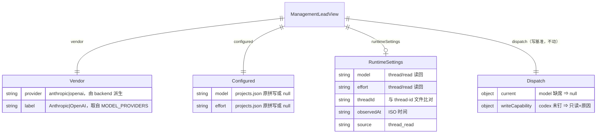
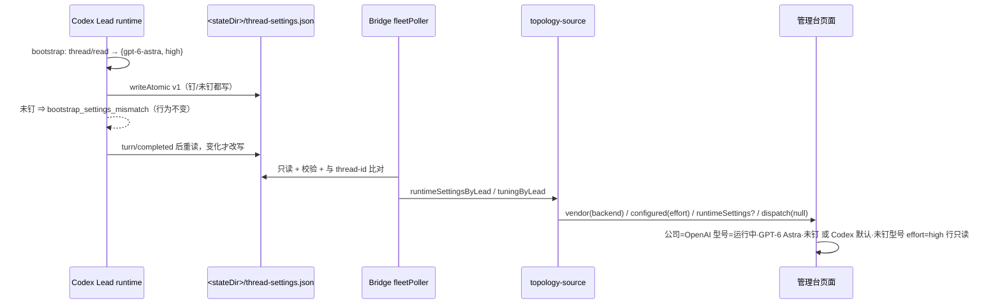

# FLY-2760 Codex Lead 模型行：公司按 backend、effort 按注册表、型号按线程读回 — 实施计划
Issue: FLY-2760 (https://linear.app/geoforge3d/issue/FLY-2760/dashboardlead-模型行-fleet-console-把-backendcodex-app-server-的-leadmufasa)
日期: 2026-09-24
基于: research.md

**Status**: codex-approved（Round 2，2026-09-24；Round 1 CHANGES REQUESTED 6 条 + Round 2 P3 3 条全部采纳，见 §10）
**Lead 裁定（2026-09-24, question bd18dcd3）**：Q1 未钉型号的 Codex 行只读；Q2 runtime 写 `thread-settings.json`、Bridge 只读投影、重启前显示诚实占位；公司栏只看 backend 立即显示 OpenAI；⛔ 不为取证重启任何 Lead。

**关键定义（全文通用）**：`unpinnedCodex(lead) := lead.backend === "codex-app-server" && lead.configured.model === null`。所有「未钉」文案、runtime 型号显示、effort 补显、只读原因**只在这一分支生效**；已钉 Codex 行（如 raya）、所有 Claude 行（含 model 缺席的 Claude 行）保持现有行为字节不变。

## 0. 一句话

`backend=codex-app-server` 的 Lead 行：公司固定 OpenAI（由 backend 派生），effort 读 `projects.json` 的 `effort`，型号读 runtime 落盘的线程设置证据；证据缺席时显示「Codex 默认 · 未钉型号（等待运行时证据）」，永不再显示「Anthropic / 账户默认 / 账户默认」。全程按 backend 通用处理，不按 Lead 名字特判。

## 1. 目标与验收

| # | 验收项 | 证据 |
|---|---|---|
| A1 | mufasa-lead / codex-infra-bot-lead 在管理台显示 **OpenAI → （型号栏见 A2）→ high** | DOM 单测 + Bridge 重启后 founder 截图 |
| A2 | 型号栏：`thread-settings.json` 存在且校验通过 ⇒「运行中 · GPT-6 Astra · 未钉」+ 观察时间；缺席 ⇒「Codex 默认 · 未钉型号（等待运行时证据）」 | DOM 单测（两态各一） |
| A3 | 已钉型号的 Codex Lead（raya）与所有 Claude 载体 Lead 行显示不变 | 既有 DOM/topology 断言不改 + 新阴性用例 |
| A4 | 单测覆盖「backend=codex-app-server 且 model 缺席/null」的投影与渲染分支 | topology + DOM + html 三处 |
| A5 | 顶部「当前显示配置值；实际生效以进程验收为准。」原句保留 | 既有断言 |
| A6 | 未钉 codex 行只读并给出原因；已钉 codex 行与 Claude 行写能力位不变 | capabilities + topology 单测 |
| A7 | runtime 在 bootstrap 后写证据文件（钉/未钉两种都写），`turn/completed` 后重读并在变化时改写；写失败只 log 不影响 Lead | NativeLeadRuntimeConfig 单测 |
| A8 | 证据文件损坏 / 软链接 / 超限 / threadId 不匹配 / effort 非法 ⇒ 视为缺席并记 degradation reason | fleet-data 传感器单测 |

## 2. 变更清单（按依赖顺序）

### C1 `flywheel-config`：公开导出 `MODEL_PROVIDERS`
`MODEL_PROVIDERS` 定义在 `packages/config/src/model-builtins.ts`，但 `model-registry.ts:35-46` 的 `export {…}` 与 `packages/config/src/index.ts` 都没有公开它。C1 把 `MODEL_PROVIDERS` 加进 `model-registry.ts` 的既有 `export {}` 块和 `index.ts` 对应的 re-export 列表（纯加性）。C3 只从 `flywheel-config` 包入口 import，不跨包引用源码。`ROLE_EFFORT_LEVELS`、`getModelRegistryEntry` 已公开。

### C2 `packages/teamlead/src/bridge/lead-dispatch-selection.ts`（新建，消灭镜像）
```ts
export function leadDispatchSelection(lead: ProjectEntry["leads"][number]): ModelSelection | null
```
逐字搬 `management-topology-source.ts currentLeadSelection`；`management-existing-writers.ts selectionFromLead` 删除，改 import。行为不变（model 缺席仍 null）。

### C3 `packages/teamlead/src/bridge/fleet-capabilities.ts`
```ts
import { MODEL_PROVIDERS } from "flywheel-config"; // C1 公开导出后
export function leadVendorForBackend(backend: LeadBackendId): { provider: ModelProviderId; label: string } {
  const id = backend === "codex-app-server" ? "openai" : "anthropic";
  return { provider: id, label: MODEL_PROVIDERS[id].label };
}
export function leadTuningWriteCapability(backend, codexHotConfigAvailable = false, modelPinned = true): WriteCapability
```
- codex && `!modelPinned` ⇒ `{ writable:false, reason:"projects.json 未钉型号：Codex 热配置无法接管（runtime bootstrap_settings_mismatch）；请先按受控迁移在 projects.json 钉型号并重启", consequence:"governance-readonly", requiresAcknowledgement:false }`（字段形状对齐现有只读分支）。
- 其余分支不变。第三参默认 `true` 保证既有调用方语义不变；本单两个调用点显式传 `lead.model !== undefined && lead.model !== null`。

### C4 `management-console-contract.ts`（加性，`MANAGEMENT_SCHEMA_VERSION` 保持 2）
```ts
export interface LeadRuntimeSettingsView {
  model: string; effort: string; threadId: string; observedAt: string; source: "thread_read";
}
export interface ManagementLeadView {
  …既有字段…
  /** FLY-2760: backend-derived vendor; never inferred from a null model. */
  vendor: { provider: ModelProviderId; label: string };
  /** FLY-2760: registry spelling verbatim; effort survives an unpinned model. */
  configured: { model: string | null; effort: string | null };
  /** FLY-2760: runtime thread readback evidence, absent until the Lead runs a build that records it. */
  runtimeSettings?: LeadRuntimeSettingsView;
}
```
`dispatch` 不动。

### C5 `fleet-data.ts`（Bridge 传感器，入口 `collectFleetSnapshot`）
- `FleetLeadState` 加 `runtimeSettings?: LeadRuntimeSettingsView`。
- **目录解析（可注入，优先级明确）**：`FleetProbeDeps` 新增可选 `codexLeadStateDir?(projectName, leadId): string`。生产注入 `(p, l) => resolveCodexLeadStateDir(p, l)`（**不传第三参**，从而保留 `lead-inbox-runtime.ts:1263-1288` 的 `FLYWHEEL_CODEX_LEAD_STATE_DIRS` per-Lead 注入优先、其次默认 root `~/.flywheel/state/codex-lead` 的既有顺序，与 `lead-config-runtime-adapter.ts:78-82` 一致）；测试注入纯函数。resolver 抛错（注入变量存在但缺该 Lead 映射 / 非绝对路径）⇒ reason `thread-settings-unresolved`，**不回退到生产目录**。
- **有界、拒软链接的小文件 reader（可注入）**：`FleetProbeDeps` 新增可选 `readEvidenceFile?(path, maxBytes): { kind:"ok"; text } | { kind:"missing" | "symlink_or_irregular" | "oversize" | "unreadable" }`。生产实现：`lstatSync` 非普通文件（含悬空/指向文件的软链接）⇒ `symlink_or_irregular`；`openSync(O_RDONLY|O_NOFOLLOW|O_NONBLOCK)` → 同一 fd `fstatSync` 再核 `isFile` 与 `size ≤ maxBytes`（超 ⇒ `oversize`，**不读内容**）→ `readSync` 最多 `maxBytes`；ENOENT ⇒ `missing`，其余 ⇒ `unreadable`。**不替换**其他 Fleet 传感器通用的 `readFile/fileExists`（`fleet-data.ts:930-940` 的 `statSync` 语义保持）。
- 新函数 `readThreadSettingsEvidence(dir, deps): { value?: LeadRuntimeSettingsView; reason?: string }`，只对 `eff.backend === "codex-app-server"` 调用：
  1. `readEvidenceFile(join(dir,"thread-settings.json"), 4096)`：`missing` ⇒ 无 value 无 reason（正常占位）；`symlink_or_irregular | oversize | unreadable` ⇒ reason `thread-settings-invalid`。
  2. JSON 解析失败或字段不合白名单 ⇒ `thread-settings-invalid`。白名单：`version===1`、`threadId /^[0-9a-f-]{36}$/`、`model /^[A-Za-z0-9._\[\]-]{1,64}$/`、`effort ∈ ROLE_EFFORT_LEVELS`、`Number.isFinite(Date.parse(observedAt))`、`source==="thread_read"`；多余键忽略。
  3. **当前线程身份**：`readThreadIdStrict(join(dir,"thread-id"))`（`codex-lead-thread-rotation.ts:96`，已区分 missing/unreadable/symlink/oversize/unsafe/empty）。证据文件存在但 thread-id 非 `ok` ⇒ **不投影**，reason `thread-settings-stale`（证据无法与当前线程绑定就不展示）；`ok` 但 id 不等于证据 `threadId` ⇒ 同 `thread-settings-stale`。
  4. reason 只推入 `degradationReasons`；`management / runtime / presentation / paneWatch` 判定不变（在 `collectFleetSnapshot` 层断言）。

### C6 `management-topology-source.ts`
- `BuildTopologyInput` 加 `runtimeSettingsByLead?: ReadonlyMap<string, LeadRuntimeSettingsView | undefined>`（key 同 `tuningByLead`：`${project}-${leadId}`）。
- `buildLead` 投影 `vendor`、`configured`、`runtimeSettings`（有才挂，避免 `undefined` 键进 JSON 快照 diff）；`writeCapability` 传 `modelPinned`。
- `currentLeadSelection` 改为 import C2。

### C7 `management-ssot-providers.ts` + `plugin.ts:6748`
- `ManagementSsotSources` 加 `runtimeSettingsByLead?()`；provider 透传给 `buildTopologyView`。
- plugin 处从 `fleetPoller.snapshot().leads` 同时构造 `tuningByLead` 与 `runtimeSettingsByLead`。

### C8 `management-existing-writers.ts`
- `selectionFromLead` → import C2；`resolveLeadTarget` 的 `leadTuningWriteCapability` 传 `modelPinned`。

### C9 `fleet-console-html.ts`（页面）
- `modelControl(managed,surface,label,providerLocked,selectionNullable,lock)`，`lock` 可选：`{provider, providerLabel, unpinnedCodex, configuredModel, effort, runtime}`；`renderLeadRows` 传 `{provider:lead.vendor.provider, providerLabel:lead.vendor.label, unpinnedCodex: lead.backend==="codex-app-server" && lead.configured.model===null, configuredModel:lead.configured.model, effort:lead.configured.effort, runtime:lead.runtimeSettings||null}`；Runner/DAG 调用不传。
- **provider 下拉（所有 Lead 行）**：`lock` 存在时 `provider = catalog.providers.find(id===lock.provider)`；找不到 ⇒ 渲染单个 `disabled selected` 选项 `lock.providerLabel`（不回退到 `providers[0]`）。`catalog.providers.length===0` 的既有早返回（L334）：有 `lock` 时把「当前值」行渲染为 `<vendor.label> / <configured.model ?? 未钉> / <configured.effort ?? 未设置>`，不再依赖 `value`。
- **以下三条只在 `lock.unpinnedCodex` 为真时生效**（已钉 Codex、Claude 行、Runner/DAG 全部沿用旧分支与旧文案，含 nullable 的「账户默认」）：
  - 型号下拉空值项文案：`lock.runtime` ⇒ `运行中 · <label(runtime.model)> · 未钉`；否则 `Codex 默认 · 未钉型号`。`label(id)` = 当前 catalog 该 provider 下匹配 id 的 `label`，找不到用原 id。value 仍为 `""`。
  - effort 下拉：`value` 一律为 null（该行只读，`writable:false` ⇒ 无草稿），选中项 = `lock.effort`（选项列表 = 锁定 provider 在 lead 面所有型号 `efforts` 并集，`lock.effort` 不在列表则按注册表拼写原样追加）；`disabled`。**不放开任何可写行的 effort 控件**，`effortDisabled = !writableTarget || !model` 原式保留。
  - `help` 行：`lock.runtime` ⇒ `型号来源：线程读回 <observedAt>（projects.json 未钉型号）`；否则 `型号来源：projects.json 未钉；运行时证据待 Lead 以新版本重启后出现`。
- **草稿语义不变**：`value = effective(managed)` 仍是显示基准；显式草稿（含用户把 effort 选回「账户默认」产生的 `effort:null`、切型号后的 `effort:null`）按草稿显示，不用注册表值回填。
- `defaultSelection(surface, lockedProvider)`：有锁定 provider 时取该 provider 首个型号（`handleModelChange` 传 `holder.dataset.modelProvider`）。这是对既有 `current || defaultSelection` 路径的**同 provider 守卫**；本单不新增触发它的入口（未钉 codex 行只读；Claude 行 effort 控件条件不变）。
- 所有 runtime/registry 字段经 `esc()`。

### C10 runtime：`NativeLeadRuntimeConfig.ts`
- 新私有 `recordThreadSettings(threadId, pair): boolean`：`writeAtomic(join(stateDir,"thread-settings.json"), JSON.stringify({version:1, threadId, model:pair.model, effort:pair.effort, observedAt:new Date().toISOString(), source:"thread_read", buildSha:build.artifactBuildSha})+"\n")`。成功 ⇒ 更新 `lastRecorded = {threadId, model, effort}` 并返回 true；异常 ⇒ `log("thread settings evidence unavailable: …")`，**不更新 `lastRecorded`**（下一轮同值会重试），返回 false，不抛。
- `bootstrap()`：`pair = await readThreadSettings(threadId)` 之后、mismatch 判断之前：`if (this.closed) return;`（既有检查保留）→ `recordThreadSettings(threadId, pair)`。bootstrap 的既有异常语义（mismatch 只 log、`ready` 置位规则）不变。
- `onTurn`：在现有 `ready` 门之前新增分支，只处理 `method==="turn/completed" && raw.threadId===this.threadId`：`void this.refreshThreadSettings(raw.threadId)`。
- `refreshThreadSettings(threadId)` 生命周期合同：
  1. 单飞：`refreshing` 为真时置 `refreshPending = true` 后返回；完成后若 `refreshPending` 再跑一次（最多 1 个待处理）。
  2. `const pair = await readThreadSettings(threadId)` 整段 try/catch：RPC reject（超时 / 进程已停）⇒ 只 `log`。
  3. await 之后、写文件之前再核 `!this.closed && threadId === this.threadId`，不满足直接丢弃（旧线程迟到、关闭期间返回都不落盘）。
  4. 去重以**成功落盘**的 `lastRecorded (threadId, model, effort)` 为准：相同则不写；不同或上次写失败 ⇒ `recordThreadSettings`。
  5. `close()`：置 `closed`（既有）并清 `refreshPending`；进行中的 await 返回后按第 3 条丢弃。
- 不新增持久状态机、不改 inbox 协议、不改 launcher、不改 plist。

### C11 测试（先写红）
| 文件 | 用例 |
|---|---|
| `src/__tests__/fleet-capabilities.test.ts` | `leadVendorForBackend` 两态；`leadTuningWriteCapability("codex-app-server", true, false)` 只读+原因；`(…, true, true)` 与 claude 分支不变 |
| `src/__tests__/management-topology-source.test.ts` | codex + model 缺席 ⇒ `vendor.openai`、`configured.effort="high"`、`dispatch.current=null`、只读；codex + model=null 同；claude + model 缺席 ⇒ `vendor.anthropic`、既有形状与写能力不变；已钉 codex ⇒ 可写不变；`runtimeSettingsByLead` 命中 ⇒ `runtimeSettings` 挂上、未命中 ⇒ 无该键 |
| `src/bridge/__tests__/fleet-data.test.ts`（既有传感器测试，入口 `collectFleetSnapshot`）新增 describe | **真实临时文件**：合法文件 + 匹配 `thread-id` ⇒ `runtimeSettings`；证据缺席 ⇒ 无 value 无 reason；损坏 JSON / effort 非法 / model 非法 ⇒ `thread-settings-invalid`；超 4096 字节 ⇒ `thread-settings-invalid` 且 reader 未读内容（用注入 reader 断言）；普通软链接与**悬空软链接** ⇒ `thread-settings-invalid`；`thread-id` 缺席 / 不可读 / 非法 / 与证据不符 ⇒ `thread-settings-stale`；目录解析：同时设置 per-Lead 注入与 Fleet root ⇒ 只读注入目录；注入变量存在但缺映射 ⇒ `thread-settings-unresolved` 且不碰默认目录；claude Lead 不读；所有失败只增 reason，`management/runtime/presentation/paneWatch` 与无证据时相同 |
| `src/__tests__/management-console-dom.test.ts` | catalog 加 openai provider（GPT-6 Astra，efforts 五档）；fixture 加 codex 未钉 Lead（model 缺席与 model=null 各一）：provider select 选中 `openai` 且文案 OpenAI、型号选项文案 `Codex 默认 · 未钉型号`、effort 选中 `high` 且 disabled、只读原因可见；给 `runtimeSettings` ⇒ `运行中 · GPT-6 Astra · 未钉` + help 含 observedAt；**阴性**：已钉 codex + runtimeSettings ⇒ 无「未钉」文案、空值项仍「账户默认」；未钉 Claude 行 ⇒ 无等待说明、effort 控件仍 disabled；**交互**：已钉 Claude/Codex 把 effort 选回「账户默认」⇒ 显示「账户默认」且 stage payload `effort:null`；从 `high` 切型号 ⇒ 显示与 payload 都是 `effort:null`；未钉 Claude 行不存在能只改 effort 就钉型号的路径；`catalog.providers=[]` 早返回分支含 vendor/配置值；XSS：runtime.model 含 `` 被转义 |
| `src/__tests__/fleet-console-html.test.ts` | `renderLeadRows` 桩测试补传 `vendor/configured`；禁词表保持（不得出现 `codex-infra-bot-lead`）；仍单个 `<script>` |
| `src/lead-backends/codex/__tests__/NativeLeadRuntimeConfig.test.ts` | 未钉（tuning.model undefined）bootstrap ⇒ 文件存在且 pair 正确、`isSupported` 仍 false；钉定 ⇒ 同样写；`turn/completed` 后 readThreadSettings 返回新 pair ⇒ 文件更新；同值 ⇒ 不重写（mtime/写次数）；**deferred Promise** 用例：读回 reject ⇒ 只 log；close 后才 resolve ⇒ 不写；旧 threadId 迟到 ⇒ 不写；writeAtomic 抛错 ⇒ 只 log 且下一轮同值仍重试 |
| `src/__tests__/management-existing-writers.test.ts` | `selectionFromLead` 改 import 后既有用例绿；新增：未钉 codex 目标 stage 被能力位拒绝（只读原因） |
| `src/__tests__/management-ssot-providers.test.ts` | `runtimeSettingsByLead` 端到端投影进快照；未提供时无该键 |

### C12 文档
- 本文件夹 `founder-design.html`（见 §7）。
- 不改 CLAUDE.md 里程碑表（FLY-2045 规则）；ship 时新建 `engineering/doc/milestones/FLY-2760.md`。

## 3. 数据模型（新增字段）



## 4. 流程（改后）



## 5. 迁移 / 回滚 / 兼容

- **迁移**：无数据迁移；不改 projects.json、plist、launcher；不重启 Lead。
- **部署时序**：Bridge 重启后 A1/A3/A5/A6 立即成立；A2 的「运行中」态在 Lead 随 updater 班车用新 build 重启后出现；重启前显示占位。
- **回滚**：revert PR；遗留的 `thread-settings.json` 被旧 Bridge 忽略、对 runtime 无副作用；快照字段加性，旧页面忽略新键。
- **旧 Bridge + 新 runtime / 新 Bridge + 旧 runtime**：两种错配都只退化到占位文案，不报错。

## 6. 负面守卫清单

1. 不按 `agentId` / `displayName` 分支（代码审查用 `grep -n "mufasa\|infra-bot" fleet-console-html.ts management-topology-source.ts` 必须为空）。
2. provider 永不取 `providers[0]`（Lead 面）。
3. 证据文件：C5 的有界 reader `readEvidenceFile`（父目录 `lstat` 必须是真目录且非软链接——沿用 `readRegularFileNoFollow` 的父目录检查逻辑，但不调用其无界 `readFileSync`；叶子 `lstat` 拒软链接含悬空；`O_NOFOLLOW` 打开后同一 fd `fstat` 核类型与 ≤4 KiB 再读；`finally` 关 fd）、白名单校验、`readThreadIdStrict` 比对、effort 枚举；任何失败只降级不抛。
4. runtime 写失败只 log；`bootstrap` 既有异常语义不变（先写后比对）。
5. 页面所有派生文本经 `esc()`；不引入外部依赖；脚本仍是单个 `<script>`（html 测试断言 `scripts.length===1`）。
6. `dispatch.current` 与 `updateDraft` 语义零变化；未钉 codex 行 `writable:false` ⇒ `setDraft` 直接 return。

## 7. founder HTML
`engineering/doc/FLY-2760-codex-lead-model-row/founder-design.html`：Apple-light、零外链、Mermaid 用 mmdc 本地渲成内联 SVG（`--svgId FLY-2760-d1/d2`），逐段评论层 + `【页面意见汇总】FLY-2760` 汇总卡，`<script nonce="__CSP_NONCE__">` 单块、`addEventListener` 绑定。

## 8. 实施顺序（给 implement 节点）

1. C11 的红测试（capabilities → topology → fleet-data 传感器 → DOM → native）。
2. **C1（config 包导出，先做并确认 `flywheel-config` 入口已导出 `MODEL_PROVIDERS`）** → C2/C3/C4 → C6/C7/C8 → C5 → C9 → C10。
3. `pnpm --filter flywheel-teamlead exec vitest run <上列文件>`（≤6 文件/批；排除 `tmux-viewer.macos`），`pnpm -w biome check`（看退出码 + `Found N errors`，不用 grep 过滤）。
4. 本地起 Bridge 看管理台截图（不重启任何 Lead）；把截图与 A1–A8 对照表写进 PR test plan；A2「运行中」态用单测 + 手工放置合法 `thread-settings.json` 与匹配的 `thread-id` 到临时目录，并以 `FLYWHEEL_CODEX_LEAD_STATE_DIRS='{"growth":{"mufasa-lead":"/tmp/FLY-2760-evidence"}}'` 起本地 Bridge 验证（C5 的生产 resolver 不传 root，注入生效）；不碰生产 state dir。

## 10. 设计评审记录
- Round 1（2026-09-24，Codex gpt-6-astra xhigh）：CHANGES REQUESTED，6 条。处置：
  1. P1 effort 回退覆盖草稿 / 放开未钉 Claude effort 控件 → **采纳**：补显只在 `unpinnedCodex` 只读分支；`effectDisabled` 原式保留；加交互阴性用例（C9/C11）。
  2. P2 文案缺适用条件违反 A3 → **采纳**：引入 `unpinnedCodex` 定义并限定三条文案；`providers=[]` 早返回分支补 vendor；加已钉 Codex + runtime、未钉 Claude 阴性用例。
  3. P2 显式 root 绕过 `FLYWHEEL_CODEX_LEAD_STATE_DIRS` → **采纳**：resolver 可注入、生产不传 root、缺映射降级 `thread-settings-unresolved`（C5）。
  4. P2 thread-id 弱判据 / 4 KiB 未闭合 / 悬空软链接 → **采纳**：`readThreadIdStrict`、fd 级有界 reader、真实临时文件测试（C5/C11）。
  5. P2 异步生命周期 → **采纳**：`refreshThreadSettings` 五条合同 + deferred 用例（C10/C11）。
  6. P3 勘误 → **采纳**：C1 公开导出 `MODEL_PROVIDERS`；入口改 `collectFleetSnapshot`；测试落 `src/bridge/__tests__/fleet-data.test.ts`，补 writers/ssot 回归目标。
- Round 2（2026-09-24，同线程 resume）：**APPROVED**，3 条 P3 非阻塞，均已就地采纳：`lock.configuredModel`（C9 空 catalog 分支）；§6 守卫改为有界 reader 并带父目录检查、`finally` 关 fd；实施顺序补 C1 在前。

## 9. 非目标（明确不做）
- 不改 `policyCatalog` 的内联 provider 标签镜像（workflow 面）。
- 不新增 inbox socket 方法、不做 Bridge 直读 rollout。
- 不提供跨厂商切换或「在页面钉型号」的写路径（受控迁移仍是唯一路径）。
- 不给 Runner 默认 / DAG / Cron 行加 vendor 逻辑。
