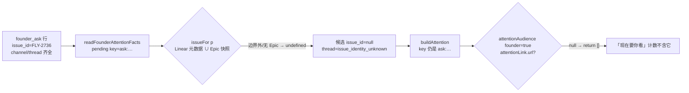

# FLY-2761 固定页漏报「无会话、不在 Epic」的 founderAsk — 探索
Issue: FLY-2761 (https://linear.app/geoforge3d/issue/FLY-2761/固定页漏报-founderask-挂在无会话不在-epic-范围的-issue-上时-现在要你看静默丢掉它attentionaudience)
日期: 2026-09-24
基于: 无

## 0. 产品判据（写在第一行）

> founder 面的任何清单，过滤条件只能是「这件事还需不需要她」，不能是「我们能不能把它渲染出来」。
> 渲染不出来是我们的问题，不是让它消失的理由。（Honey Lemon，2026-09-20 00:07Z）

## 1. 现象

Honey Lemon 实测 FLY-2736：ask `9c090bb4` 在 `founder_ask` 表里 pending（无 session、无 Epic parent），
23:47Z 固定页「⚡ 现在要你看」写「2 件」，FLY-2736 出现 0 次。实际等 founder 的是 3 件。

样本已于 2026-09-22T03:00Z 被 founder 回复 settle（`settled_by=founder_reply`，只读查询确认），
按 issue 约定改用 fixture 复现（`packages/teamlead/src/epic-page/__tests__/founder-ask-outside-scope.test.ts`），
不算验收缺失。

## 2. 丢失链路（读码确认，HEAD 637752fcc）

1. `bridge/founder-attention-facts.ts`：ask 已进 pending（`kind=founder_ask` → level `answer`），`issue`=`ask.issue_id`、`channel`=`ask.channel_id`。来源没问题。
2. `epic-page/attention-sources.ts`：身份只从 Linear 元数据查询（带 team/project/label 边界，`flywheel` 项目是 `FLY / Flywheel / label Flywheel`）
   与 Epic 范围快照拿。产品线的单常常不带 `Flywheel` 标签或不在该 project、也没有 Epic parent → 查询**成功但返回空** → `issueFor` undefined。
3. 身份 undefined 时，候选的 thread 被直接写成 `issue_identity_unknown`，根本不去查 `chat_threads`
   ——尽管 ask 行自己带着 `channel_id/thread_id`，`chat_threads` 里也有 (FLY-2736, channel) 的绑定行。
4. `epic-page/attention-presentation.ts` `attentionAudience(page, true)`：`if (founder && !attentionLink(page,item).url) return [];`
   把没链接的候选整条丢掉。HTML 标题 `· N 件` 用的就是这个数组长度。

阴性对照（未改代码，HEAD 637752fcc，同一 fixture）：

| 操作 | 标题 | 页脚摘要 |
|---|---|---|
| 无 ask | `⚡ 现在要你看 · 0 件` | 现在没有等你的事 |
| 打一条 ask 后 | `⚡ 现在要你看 · 0 件` | 已知 0 条记录，清单不完整（1 条记录缺少讨论串链接；身份尚未核齐…） |

计数不变；摘要自相矛盾（「已知 0 条」却又说「1 条缺链接」），读者自然会绕过——正是 Honey Lemon 说的「两类不完整混成一句」。

## 3. founder 视图 call site 逐个核（按 issue 要求 grep `founder &&` / 以 `.url` 为条件的 return）

| 位置 | 过滤条件 | 性质 | 处置 |
|---|---|---|---|
| `attention-presentation.ts:195` `attentionAudience` | 无可点链接 → 丢 | **渲染能力** | 删除，改为列出 + 标注 |
| `attention-presentation.ts:24` `attentionSummary` | 无链接计入「清单不完整」 | 计数口径混淆 | 拆成两类 |
| `render-markdown.ts:484-499` | founder 列表同样丢无链接项，另起「缺少讨论串链接的记录」折叠；摘要用 `page.attention.length`（含 Lead 项） | **渲染能力** + 计数口径 | 与 HTML 同口径 |
| `attention-sources.ts:215-253` | 身份不知道 → 不查讨论串 | **渲染能力**（身份只是为了拼链接） | founder_ask 自带身份补源 |
| `attention-sources.ts:228` `visible` | 标题状态不是 answer/ship（已完结/blocked/已批）→ 隐藏 | 需不需要她（生命周期） | 保留 |
| `founder-attention-facts.ts` ask 循环 | `message_id` 为空（没送达 Discord）或关联 runner 问题已答 → 跳过 | 需不需要她 | 保留 |
| `attention-budget.ts` | 体积超限按 founder 优先截断 | 有 `budget_incomplete` 标记 | 保留 |
| `workflow-engine-dispatcher.ts:506` `notice.pending.founder &&` | 重试节拍 | 不是清单 | 不相关 |
| thread 标题（`issue-display-refresher.ts`） | 走 `readEffectiveFounderAttention`，无 session 也点亮 | 已被 `founder-attention-sync.test.ts` 覆盖 | 不改 |

## 4. 顺带：bootstrap `pendingDecisions`

`bridge/bootstrap-generator.ts` 的 `pendingDecisions` = 最近 session 里 `status=awaiting_review` 的那些，按 Lead 过滤。
它是 **Lead 自己的 session 决策**，不是「等 founder 的事」，与 `founder_ask` 无关（Honey Lemon 两次读到 0 是对的）。
选择**写明不覆盖**，不接入：接入会让 Lead bootstrap 与固定页出现第二份 founder 待办，违反「固定页『待你看』只来自同一机器状态」
（`lead-rules-base/department-lead-rules.md:181`）。

## 5. 方向

- **A 呈现**：founder 视图不再以链接为条件；无链接的行照常列出、计数，行内显示 issue 标识 + 「（无讨论串链接）」。
- **B 补源**：founder_ask 行自带的 issue 标识就是身份；缺 Linear/Epic 元数据时用它，再走与已解析 issue 相同的 `chat_threads` 绑定查询拿讨论串。
- **C 计数**：页脚区分「列全了但有 M 件缺链接」与「清单本身不完整」两类，数字对得上：「要你看 N 件，其中 M 件缺讨论串链接」。
- **D 文档**：`pendingDecisions` 注明不覆盖 founder_ask。

撤回的临时缓解（给单挂 Epic parent）不做：那是改数据迁就视图。
