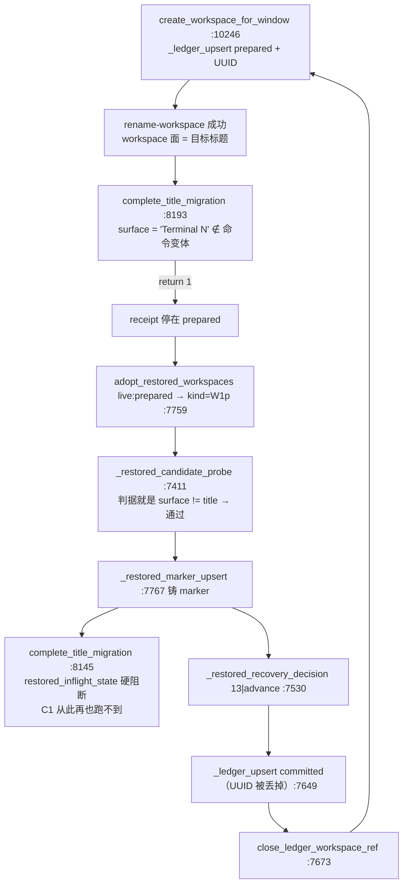

# FLY-2770 cmux 同步器失控 — 实施计划 (v3, 已落地)

Issue: FLY-2770 (https://linear.app/geoforge3d/issue/FLY-2770/cmux同步器失控-flywheel-cmux-sync-watch-给新窗口建镜像时title-stock-topology-proof)
日期: 2026-09-22
基于: research.md（v2 依据独立设计评审 round 1，`/tmp/fly2770-design-review-round1.md`，重写）

> v2 → v3 变更（依据独立设计评审 round 2，`design-review-round2.md`，10 条全部采纳）：
> ① C1b 改在 `_restored_candidate_probe` 落点，但**必须同时**给 `--rebuild-views` 的 W1p
>   分支一条收敛出口，否则它对本 issue 涉及的三个 Lead 直接报 FAILED；
> ② C2 的抑制对象错了——C1 之后真正每轮重复的是 `guarded rename-tab deferred`，
>   新增 `title-rename-deferred` kind，三个 kind 都登记进**两份** allowlist；
> ③ 「部署后一轮 close/recreate 抖动」是错的：probe 落点让既有 marker 走
>   `14|marker-delete`，**零 close 零重建，一轮收敛**；
> ④ `refresh` 在 `maintenance_entry_allowed` 里没有自己的分支（和 `once`/`reaper` 共用
>   `else`），必须新开一条 `elif`，否则会把 `--once` 一起放开；
> ⑤ `publish_ops_rebuild_claim` 放开 marker 会顺带解冻 `--converge-runners`（脚本里最具
>   破坏性的入口），改成 `allow-parked` 显式 opt-in，只有 `--rebuild-views` 传；
> ⑥ C1 的 `:9029` 行表错了——`__NULL__` 子分支确实获得新权限，补了用例；
> ⑦ `restart-services.sh` 今天完全不认识 marker，派生式要与另两个脚本一致，且
>   `trigger_cmux_refresh` 的**两步**都要跳过；
> ⑧ T12 改成双向行为测试（stub `sleep` + `wait`），不新增 CI 未注册的 .test.sh；
> ⑨ 永久卡住的行现在既不回收也不升级 → 新增 `migration` stall 计数器，
>   到阈值经 `_alert_cmux_cleanup` 升级一次；
> ⑩ 行号漂移、`local` 位置、`:14146` 注释等一并修。
>
> v1 → v2 变更：v1 误判了「回收者」（真正关掉 workspace 的是 W1p restored-adoption，
> 不是 prepared-stall 计数器），因此漏掉了 issue 的阴性验收；C2 漏了第二份 kind
> allowlist 且两条消息撞同一 episode key；C3 的安全论证建立在「`--refresh` 是纯 tmux
> 修复」这个错误事实上，且漏掉了 `restart-services.sh` 这个自动调用方。以下逐条修正。

## 目标（与 issue 验收一一对应）

| 验收 | 交付它的机制 |
|---|---|
| (a) 摘标记后 30 分钟零「Terminal N」空壳、活体各恰一个 workspace | C1 让 title migration 收敛 → receipt commit → `adopt_restored_workspaces` 走 `live:committed → continue`，不再铸 W1p marker |
| (b) 全舰重启后 14 个 Lead socket `list-clients` 全为 1 | 依赖 watcher 恢复健康：`self_heal_sweep_all`（`:11623`）+ create 时的 verify/retry 循环（`:10310-10320`）。C1/C1b 之外无新代码 |
| (c) 阴性：人为让 rename 失败 → 不再造，只告警一次 | **C1b**（不再给「迁移待完成」的行铸 W1p marker）+ **C2**（episode 抑制） |
| (d) 三个 Codex 载体 Lead `--verify-agent-visible status=pass` | 硬前提是 `rule=restored-marker`（`:12212`）为 0 → 由 C1b 交付；另需 `rule=render` / `rule=client-count>=1` / `rule=a1-topology`，这三条由 watcher 恢复健康后的既有路径交付（C3 让 `--rebuild-views` 在 park 时可用是操作出口）。`receipt-uuid-unattributable` 只是 WARN（`:12207`），`birth:missing` 本身不会挡 pass |

不改：FLY-913 护栏、`~/.flywheel/state/cmux-maintenance` marker 本身、launchctl、
`flywheel-view-attach.sh` 重连循环。

## 病理链（核对过的真实路径）



每轮关掉→重建，就是侧边栏一圈圈的空壳。单轮 `rename-tab` 失败即足以进入这个圈。

## 改动

### C1 —— tab 面接受 cmux 自带占位标题（UUID 绑定时），按 FLY-1884 的精确字节钉法

`scripts/flywheel-cmux-sync.sh` `complete_title_migration`（`:8142`），改 `:8193` 那一处：

```bash
  if ! _managed_view_command_in_variants "$surface" "$canonical_raw"; then
    # FLY-2770: cmux 给新建 surface 的初始标题是它自己的占位符（"Terminal N"），
    # 只有 attach 真正画出画面后 tmux 才会把它改成目标标题。占位符不携带任何
    # founder 意图。一个 UUID 绑定的 receipt 可以在其上完成 tab 改名——这不是新
    # 授权等级：adopt_birth_candidate（:8378）与 _v2_lead_prepare_and_name
    # （:5091）本来就在无命令面证明时对不匹配的 surface 发 rename-tab。这里把
    # 观察到的“精确字节”钉进变体表，守卫在真正变更前会重新按字节比对，surface
    # 若在读与改之间被换掉（Terminal 65 → Terminal 66）守卫仍然拒绝。
    if [[ -n "$workspace_uuid" ]] && _workspace_title_is_default "$surface"; then
      canonical_raw="${canonical_raw}${canonical_raw:+$'\n'}${surface}"
    else
      log_cmux_episode title-surface-drift "$title" "$ref|$surface" \
        "WARN: title migration surface drift ref=$ref expected_raw=$canonical_raw observed=$surface; preserving receipt"
      return 1
    fi
  fi
```

`_GUARD_TITLE_RAW="$canonical_raw"`（`:8201`）本来就在下面赋值，因此守卫
`_title_tab_rename_guard`（`:8116`，唯一调用点 `:8203`）**不需要任何改动**，
且继续用 `_managed_view_command_in_variants` 做唯一匹配器 —— 与 FLY-1884
`__DEFAULT__` 分支（`:8951-8958`）同形。

**四个调用点的预期行为变化**（评审 issue #10）：

| 调用点 | 传入 | C1 之后 |
|---|---|---|
| `:8722` `reconcile_workspace_titles` | `managed_view_command_variants` | receipt 带 UUID（birth 收编而来）时可迁移占位符；legacy stock 行不变 |
| `:9029` `reconcile_prepared_ledger` `__NULL__/__PROVISIONAL__/__DEFAULT__` 臂 | 已含占位符 | 不变（`__DEFAULT__` 已自带） |
| `:9041` `reconcile_prepared_ledger` `"$title"` 臂 | `$provisional` | **本 bug 的主现场**：现在可迁移 |
| `:10292` `create_workspace_for_window` | `$attach_cmd` | 新建后立刻可迁移 → 当场 commit，不留 prepared |

`authorize_stock_candidate`（`:8688`）为 founder 既有 stock 写的是四字段 legacy 行，
永远拿不到这个授权。注意 `_ledger_upgrade_legacy_uuid`（`:6944`）能把 legacy 行升级成
UUID 行，所以准确表述是「UUID 绑定的 receipt 只能来自本 watcher 的 create、birth 记录
收编、或 birth 证明过的 legacy 升级」，代码注释按此措辞。

### C1b —— 迁移待完成的行不再铸 W1p marker（真正的断圈，阴性验收）

`_restored_candidate_probe`（`:7411-7413`）W1p 分支之后追加：

```bash
  if [[ "$kind" == "W1p" ]] && _workspace_title_is_default "$surface"; then
    local pending_uuid
    pending_uuid=$(ledger_exact_receipt_uuid "$generation" "$ref" "$title" 2>/dev/null || true)
    # FLY-2770: UUID 绑定的 prepared receipt + cmux 自带占位 tab = “title 迁移待完成”，
    # 不是“被 restore 的半截事务”。在这里铸 marker 会让 complete_title_migration 在
    # :8145 的 restored_inflight_state 上硬阻断，然后 13|advance → recovery-close 把
    # 一个健康的 workspace 关掉再重建 —— 就是 issue 里的空壳圈。交给
    # reconcile_prepared_ledger 收敛；真收敛不了由 C2 的 episode 告警一次。
    if [[ -n "$pending_uuid" && "$pending_uuid" != "__LEGACY__" ]]; then
      return 1
    fi
  fi
```

legacy（四字段）prepared 行的 W1p 行为**完全不变**（回归测试钉住）。

代价与边界：一个 UUID 绑定的 prepared 行如果 `rename-tab` 永久失败，将永远停在
prepared 而不再被回收 —— 这正是 issue 的阴性要求（「不再造，只告警一次」），
且严格优于 close+recreate 的抖动。

### C2 —— 告警只落一次（两份 allowlist、两个不同 kind）

* `scripts/flywheel-cmux-sync.sh:9469`（`_cmux_log_episode_state_valid` 的**状态文件校验器**）
  与 `:9509`（`log_cmux_episode` 的分发门）**两处**都加上新 kind。
  只改一处会让新 kind 的行把状态文件判为 malformed，从而给**所有**既有 kind
  关闭抑制并每轮打一条 `suppression disabled` —— 净增噪。
* 两条消息用**两个不同 kind**，避免同一 `(kind,title)` 键互相重置 evidence 哈希：
  * `title-surface-drift` —— `complete_title_migration` `:8194`，evidence `ref|surface`；
  * `prepared-migration-deferred` —— `reconcile_prepared_ledger` `:9030` / `:9042`，evidence `ref`。

抑制窗口沿用 `FLYWHEEL_CMUX_LOG_REPEAT_SECONDS`（默认 3600s），复述时带
`(suppressed N repeats)`。注意 `log_cmux_episode` 在丢 lease 时退化为普通 `log`
（`:9513-9516`），所以「恰好一条」只在持 lease 的正常通道成立，测试按此断言。

### C3 —— park ≠ 活 mutator（按真实调用图论证）

**先纠正 v1 的事实错误**：`--refresh` 不是纯 tmux 修复。真实调用图：

```
--refresh → run_mutator_once refresh refresh_linked_sessions            (:14141)
  refresh_linked_sessions → prepare_linked_view_state pre               (:10479)
                          → refresh_linked_sessions_tail                (:10483)
      recover_restored_transactions   (:10486)  → close_ledger_workspace_ref (:7673)  ← 会关 cmux workspace
      prepare_linked_view_state post  (:10490)  → reconcile_prepared_ledger (:9435)   ← 会 rename / commit
      repair_view_invariants          (:10493)
```

因此 C3 的真正不变量是 **mutator lease 才是互斥体**，marker 只是「暂停自动 watcher」。
`:10465` 与 `:14142` 两处「tmux-only / safe from anywhere」的注释已经过时，一并订正。

* **C3a** `maintenance_entry_allowed()`（`:13878`）—— 只摘掉 marker 这一项，其余判据
  原样保留。目标控制流逐行写死：

  ```
  refresh:
      QA teardown claim 在        -> return 1
      ops_rebuild claim 在        -> return 1        （与今天一致；lease 交接窗口不被抢）
      否则                        -> return 0        （marker 被忽略）
  ops_rebuild:
      QA teardown claim 在        -> return 1
      ops claim 不在              -> return 0        （marker 被忽略；覆盖不带 --handover 的 --rebuild-views --execute）
      ops claim 在                -> 自有且存活 ? 0 : 1
  ```
  `watch` / `once` / `reaper` / `qa_teardown` 等其余 mode **一律不变**。

* **C3b** `publish_ops_rebuild_claim()`（`:13501`）前置与 CAS 复检里去掉 marker 项，
  只保留「QA teardown claim 不在 且 ops claim 不在」。`maintenance_requested`
  （`:13217`）不动，所以 ops claim 在场时 watcher 照旧 park。

* **C3c** `scripts/restart-services.sh` `trigger_cmux_refresh()`（`:2692`）在 marker 在时
  跳过那条自动 `--refresh`（`:2698`）并打一行日志。没有这一条，C3a 会把
  「marker = 冻结全舰」悄悄变成「marker = 只停 watcher，但任何 Lead 重启仍会重塑全舰」。
  验收 (b) 的场景没有 marker，因此不受影响。

* **C3d** 订正 `:10465` 与 `:14142` 的过时注释。

**明确披露（写进 PR body）**：park 期间运维手动 `--refresh` / `--rebuild-views`
**会**关闭并重建 cmux workspace；互斥依靠 mutator lease 而非 marker。marker 创建到
watcher 下一次 `watcher_maintenance_checkpoint`（`:13914`）之间 watcher 仍持 lease，
此时修复命令拿不到 lease，`run_mutator_once` 打 "mutator already running … skipping"
并返回 0（`:13975-13986`）—— fail-closed，无并发洞。

### C4 —— QA teardown claim 独立 env

`scripts/flywheel-cmux-sync.sh:116` 与 `scripts/test-teardown.sh:50`：

```bash
CMUX_QA_TEARDOWN_CLAIM="${FLYWHEEL_CMUX_QA_TEARDOWN_CLAIM:-${CMUX_MAINTENANCE_MARKER}.qa-teardown}"
```

默认值不变 → 生产零行为变化。

两条必须写进 PR body 的注意事项：
* `test-teardown.sh` 在 `:441`、`:1261`、`:1284` 读 marker 作为**拒绝闸**，
  C4 不动它 —— 解耦的是 claim 路径，不是那道安全闸；
* C3 之后 QA claim 成为唯一还挡着 refresh/ops_rebuild 的信号，因此
  `FLYWHEEL_CMUX_QA_TEARDOWN_CLAIM` 必须同时导出给两个脚本，单边设置会让
  refresh/rebuild 在拆房**期间**跑起来。

不新增 `scripts/__tests__/*.test.sh` —— 两条静态断言并入 `scripts/test-cmux-sync.sh`，
避免 FLY-1764 枚举守卫（`scripts/__tests__/ci-shell-suite-enumeration.test.sh:15-40`）
与 FLY-1364 精确步骤清单（`scripts/__tests__/ci-structure.test.sh:1481-1500`）的注册成本。

## TDD 顺序（每条先红后绿，全部落在 `scripts/test-cmux-sync.sh` 并登记进 run-all）

| # | 测试 | 断言 |
|---|---|---|
| T1 | `test_fly2770_uuid_receipt_migrates_placeholder_surface` | workspace 面已是目标标题 + surface `Terminal 66` + 五字段 UUID receipt → 恰一次 `rename-tab`、surface readback == title、receipt → `committed` 且 UUID 保留 |
| T2 | `test_fly2770_legacy_receipt_never_migrates_placeholder_surface` | 同场景、四字段 legacy receipt → 零 `rename-tab`、ledger 字节不变 |
| T3 | `test_fly2770_foreign_surface_still_refused` | surface `npm run dev` + UUID receipt → 零 mutation、仍 prepared |
| T4 | `test_fly2770_placeholder_surface_swap_is_refused` | 预检读到 `Terminal 65`、守卫时变成 `Terminal 66` → 守卫拒绝、零 commit（精确字节钉法回归） |
| T5 | `test_fly2770_failed_rename_never_recreates_or_recycles` | **本 issue 的核心测试**：UUID prepared 行 + 占位 surface + 活源窗口 + restored adoption 开启 + `rename-tab` mock 恒失败，连跑 3 轮 `adopt_restored_workspaces live` → `recover_restored_transactions` → `reconcile_prepared_ledger`：零 `close-workspace`、零 `new-workspace`、恰一条 WARN |
| T6 | `test_fly2770_legacy_prepared_still_mints_w1p_marker` | 同 T5 但 legacy receipt → W1p marker 照旧铸出（C1b 不越界） |
| T7 | `test_fly2770_new_log_episode_kinds_pass_state_validator` | 写入两个新 kind 后 `_cmux_log_episode_state_valid` 仍 rc=0；只改分发门不改校验器的版本必须红 |
| T8 | `test_fly2770_maintenance_entry_allowed_refresh_truth_table` | 仅 marker → 0；QA claim → 1；ops claim → 1 |
| T9 | `test_fly2770_maintenance_entry_allowed_ops_rebuild_truth_table` | 四行全覆盖，含 marker 在 + 无 ops claim（不带 `--handover` 的常见调用） |
| T10 | `test_fly2770_publish_ops_claim_tolerates_marker` | marker 在 → 发布成功且 marker 字节不变；QA claim 在 → 失败 |
| T11 | `test_fly2770_qa_teardown_claim_env_is_independent` | 两个脚本：设了 env → 用自定义路径；未设 → 仍是派生默认值；`test-teardown.sh` 的 marker 拒绝闸未被改动 |
| T12 | `test_fly2770_trigger_cmux_refresh_skips_while_parked` | `restart-services.sh` 的 `trigger_cmux_refresh` 在 marker 在时不触发 `--refresh` |

## 本地定向验证

* `pnpm lint`
* `/bin/bash scripts/test-cmux-sync.sh`（必须用 macOS 系统 bash 3.2；基线 597 passed / 0 failed）
* `/bin/bash scripts/test-cmux-sync-hooks-integration.sh`
* 变更文件的消费者扫描（`git grep -lF`，逐个列出并处置，含以下已知项）：
  * `scripts/restart-services.sh:2698`（`--refresh` 自动调用方 → C3c 处理）
  * `scripts/lib/cmux-mutator-process-census.sh:194`
  * `scripts/__tests__/fly2048-cmux-convergence.test.sh:13`（导出内部名 `CMUX_QA_TEARDOWN_CLAIM`，历来无效，C4 后仍无效）
  * `scripts/__tests__/test-teardown-lease-contract.test.sh:256`
* 真机只读复验：三个 Codex 载体 Lead 的 `--verify-agent-visible --target … --json`
  （⛔ 不摘 marker、不动 launchd）

## 部署后的收敛说明（必须写进 PR body）

`~/.flywheel/state/` 里**已存在**的 W1p marker 不会被 C1b 追溯删除：
`recover_restored_transactions` 在每轮里跑在 `reconcile_prepared_ledger` **之前**，
所以摘标记后的第一轮，每个当前卡住的 workspace 仍会被关掉重建一次；重建出的新
workspace 没有 marker，C1 在 create 当场 commit，之后不再铸 marker —— 一轮收敛。
因此验收 (a) 的 30 分钟观察窗应当在 `~/.flywheel/state/cmux-restored*` 归零之后开始计时。

## 验收与本 PR 的边界（明确披露）

本 PR 交付代码与单测。下列真机验收需要摘 marker / 全舰重启，属 Lead+QA 权限，
本节点不执行，只给出「修复前」的真机基线读数：

* 摘标记后 watcher 跑 30 分钟、空壳数 = 0；
* 全舰重启后 14 个 Lead socket `list-clients` 全为 1；
* 三个 Codex 载体 Lead `--verify-agent-visible` 全 `status=pass` 且
  `flywheel-lead.sh verify --stage live` #7 PASS。

---

## 落地记录（v3 实际交付，2026-09-22）

### 代码

| 文件 | 改动 |
|---|---|
| `scripts/flywheel-cmux-sync.sh` | C1 占位符精确字节钉入 `complete_title_migration`；C1b `_restored_migration_pending` + probe 落点 + `execute_ops_rebuild_targets` 的 W1p 收敛出口；C2 三个 episode kind（两份 allowlist）+ 四条 WARN 改走抑制；`migration` stall 计数器 + `title-migration-stuck` 升级；C3a `refresh` 独立分支 + `ops_rebuild` 摘 marker；C3b `publish_ops_rebuild_claim allow-parked`；C3d 三处过时注释；C4 `FLYWHEEL_CMUX_QA_TEARDOWN_CLAIM` |
| `scripts/restart-services.sh` | C3c `trigger_cmux_refresh` 在 marker 在时整体跳过（两步都跳），派生式与另两个脚本一致 |
| `scripts/test-teardown.sh` | C4 `FLYWHEEL_CMUX_QA_TEARDOWN_CLAIM` |
| `scripts/test-cmux-sync.sh` | `MOCK_CMUX_SURFACE_TITLE_SEQ` 夹具接缝 + 16 个 FLY-2770 用例 |

### 本地定向验证结果

* `pnpm lint` → exit 0
* `/bin/bash scripts/test-cmux-sync.sh` → **613 passed / 0 failed**（基线 597/0；新增 16）
* `/bin/bash scripts/test-cmux-sync-hooks-integration.sh` → PASS
* `/bin/bash scripts/test-restart-services.sh` → 161 passed / 0 failed
* `scripts/__tests__/` 相邻套件全绿：`fly2048-cmux-convergence`、`test-teardown-lease-contract`、
  `converge-fly1389`、`restart-cmux-watcher`、`fly1884-attach-recovery`、`fly1884-node-presence`、
  `fly1944-birth-adoption`、`fly1944-dead-view-rebuild`、`fly1944-helper-reap`、
  `cmux-cleanup-lifecycle`、`cmux-view-rebind`、`fly1663-cmux-v2`、`fly2266-cmux-lead-attach-health`、
  `fly1446-cmux-roster`、`ci-shell-suite-enumeration`、`ci-structure`
* 两条**既有**失败，已在 `origin/main` 上以相同计数复现，与本 PR 无关：
  `agent-visibility`（38 passed / 1 failed，"installed verifier could not resolve the binding helper"，
  依赖本机 `~/.flywheel/bin` 已部署产物）与 `fly1944-attach-protocol`
  （9 passed / 1 failed，"builder grammar drift"，依赖本机 tmux 绝对路径 pin）。

### 消费者扫描（`git grep`，2026-09-22）

| 符号 | 消费者 | 处置 |
|---|---|---|
| `CMUX_QA_TEARDOWN_CLAIM` | `scripts/__tests__/fly2048-cmux-convergence.test.sh:13`（导出内部名，历来无效） | 无需改；默认值不变 |
| | `scripts/__tests__/test-teardown-lease-contract.test.sh:256,270` | 读自己的 env，PASS |
| `trigger_cmux_refresh` | `scripts/__tests__/restart-cmux-watcher.test.sh:491`、`scripts/test-restart-services.sh:786-788`（都断言**调用点**行号，非函数体） | 未受影响，PASS |
| | `scripts/restart-services.sh:3472,3817` | 调用点未动 |
| `publish_ops_rebuild_claim` | `scripts/__tests__/fly2048-cmux-convergence.test.sh:100,145`（stub） | 新参数可选，stub 仍兼容，PASS |
| `maintenance_entry_allowed` | `scripts/__tests__/fly2048-cmux-convergence.test.sh`（stub） | PASS |
| `--refresh` 自动调用方 | `scripts/restart-services.sh:2698` | C3c 处理 |
| | `scripts/lib/cmux-mutator-process-census.sh:194` | 只是 mode 允许表，只读，未动 |

本 PR 没有净删除或改名任何 `flywheel-comm` / CLI 子命令，因此不触发 FLY-1914 的 CLI 合同扫描。

### 真机基线（修复前，只读取证，未摘 marker、未动 launchd）

```
--verify-agent-visible --target raya-raya                      → inconclusive / ownership_unproven
--verify-agent-visible --target growth-mufasa-lead             → fail / surface_mismatch
--verify-agent-visible --target flywheel-codex-infra-bot-lead  → inconclusive / probe_unavailable + receipt=prepared
--rebuild-views --target flywheel-codex-infra-bot-lead (dry)   → class=W1p   ← 正是 C1b 会波及、因此必须给出口的那一类
--rebuild-views --target raya-raya (dry)                       → class=W2
--rebuild-views --target growth-mufasa-lead (dry)              → class=W2
cmux list-pane-surfaces --workspace workspace:451              → title="Terminal 65"
cmux list-workspaces  workspace:451                            → title="flywheel-codex-infra-bot-lead"
~/.flywheel/state/cmux-view-ledger                             → prepared|…|workspace:451|…|10A91D8B-…
```

### 部署后的收敛（订正 v2 的错误说法）

既有 W1p marker **不会**再触发 close/recreate：`recover_restored_transactions` 调 probe 拿到
rc=1 → `evidence=drift` → `W1p:prepared:present` 走 `14|marker-delete`，marker 被撤销；
同一轮 `prepare_linked_view_state post` → `reconcile_prepared_ledger` 里 `restored_inflight_state`
已放行，C1 完成改名并 commit。**一轮收敛，零 close，零重建。** 30 分钟观察窗可以在第一轮跑完后
立即开始计时。运维会看到 marker 直接消失而没有任何 close —— 这是预期，不是没跑。
