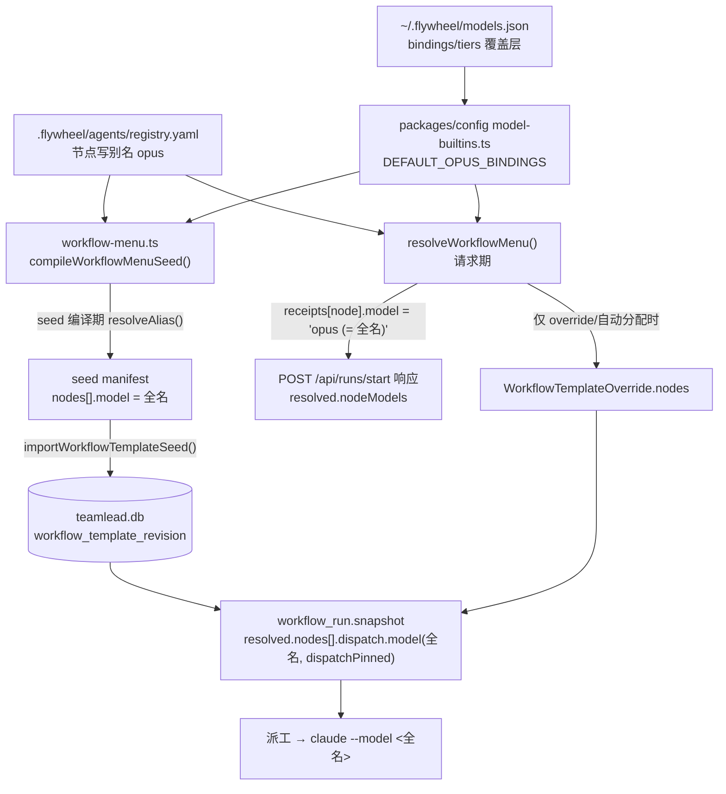

# FLY-2775 Opus 线切到 Opus 5.5 — 调研

Issue: FLY-2775 (https://linear.app/geoforge3d/issue/FLY-2775/模型opus-线-opus-线切到-opus-55claude-opus-5-5-已于-2026-09-22-1007-pt)
日期: 2026-09-22
基于: exploration.md

## 1. 模型可用性实测(本机,2026-09-22)

| 命令 | 结果 |
|---|---|
| `claude-code@2.1.280 -p --model claude-opus-5-5` | `claude-opus-5-5` ✅ |
| `claude-code@2.1.280 -p --model 'claude-opus-5-5[1m]'` | `claude-opus-5-5[1m]` ✅ |
| `claude-code@2.1.280 -p --model 'claude-opus-5[1m]'`(对照) | `claude-opus-5[1m]` ✅ |
| `claude-code@2.1.280 -p --model claude-opus-9-9`(阴性对照) | `unrecognized_model` + "It may not exist" ❌ |
| **`claude-code@2.1.278 -p --model claude-opus-5-5`** | **`API Error: 400 ... version 2.1.280 or newer is required`** ❌ |
| 本机 `claude --version` | `2.1.280` |

结论:
1. 全名 `claude-opus-5-5` 与 `[1m]` 变体在 **2.1.280** 上都真实可用(阴性对照证明这把尺子不是恒绿)。
2. **≤2.1.279 的客户端用全名钉 5.5 会 400**。服务端 `opus` 别名已漂到 5.5 与此无关 —— Flywheel
   派工下发的是**全名**(`workflow_run.snapshot.resolved.nodes[].dispatch.model`)。
3. runner 走 PATH 上的 `claude`,本机=2.1.280 ⇒ 当前满足前置条件。但这是**主机状态,不是仓内不变量**,
   必须写进部署说明并留回滚。

## 2. 代码路径:一次派工里模型到底从哪来



**两条独立的路要同时翻,少一条就半翻:**

- **绑定层(仓内)**:`DEFAULT_OPUS_BINDINGS` + `BUILTIN_MODEL_TIERS`。决定别名 `opus` 解析成什么。
- **目录层(运行时 DB)**:已发布的 template manifest 里冻着**上一次** seed 编译的全名。
  新 run 的 `snapshot.dispatch.model` 默认取自它,**不是**请求期重新解析的。

判据 1 看的 `resolved.nodeModels` 走的是请求期 `receipts`,绑定一翻就变;
但**真正派出去的体**由目录层决定。两者会在目录层没跟上时**不一致**——这是本单最容易漏的地方。

## 3. 目录层能不能自愈:一半能

Bridge 启动时 `loadWorkflowMenuSeeds()` → `migrateFly2121WorkflowCatalog()` → `importWorkflowTemplateSeed()`。
seed 内容变了(model 全名变了)⇒ `contentHash` 变 ⇒ 本该重新 import。**但**:

```ts
if (existing?.seed_owner === "founder") { ...audit... return { status: "refused" } }
```

生产实查(只读句柄,2026-09-22):

| template | seed_owner | rev | 绑定翻转后 |
|---|---|---|---|
| tpl_eng_heavy | system | 5 | ~~✅ 自动重 seed~~ ❌ **更正**:已退役(FLY-1693),不在 registry.yaml,无 seed 可重编;0 category binding,09-01 起 0 run。见 implementation-notes §1.2(b) |
| tpl_prd | system | 9 | ✅ |
| tpl_design | system | 9 | ✅ |
| tpl_prototype | system | 9 | ✅ |
| tpl_generic_menu | system | 8 | ✅ |
| **tpl_code** | **founder** | 14 | ❌ **拒收,停在 claude-opus-5** |
| **tpl_simple_code** | **founder** | 6 | ❌ **拒收,停在 claude-opus-5** |

founder-owned 在迁移计划里是 `status: "skipped"` + audit,**不会**抛错阻塞启动(已读 StateStore.ts
`migrateFly2121WorkflowCatalog` 的 seed 循环),所以这是「静默停滞」不是「响亮失败」。

而 `tpl_code` / `tpl_simple_code` 恰好是两条**主力代码线**(本单自己就跑在 tpl_simple_code 上)。

> ⚠️ **更正(Codex 代码评审 R1)**:本节漏了**时序** —— seed 在 Bridge **启动时**按当时的配置编译。
> 先重启、后改 models.json,system-owned 模板会按旧 override 冻在 Opus 5。正确顺序见 implementation-notes §1.2(a)。

⇒ 部署说明必须含一条显式的 operator 动作:
```
flywheel-comm workflow-template publish --template tpl_code       --from seed --reason "FLY-2775 Opus 5.5"
flywheel-comm workflow-template publish --template tpl_simple_code --from seed --reason "FLY-2775 Opus 5.5"
```
(`--from seed` 走 `loadWorkflowMenuSeeds(snapshot).find(...)`,即用**当前绑定**重新编译的 seed。)

## 4. 旧 id 的 dispatch 合法性(判据 4)

`model-config.ts:buildDispatchLookupForRegistry()`:

```ts
for (const entry of registry) {
  if (!entry.surfaces.includes("dispatch") && entry.id !== MODEL_IDS.FABLE_1M) continue;
  ...登记 id + aliases
}
for (const id of [MODEL_IDS.OPUS_48, MODEL_IDS.OPUS_48_1M, ...LEGACY_FABLE_MODEL_IDS]) lookup.set(...)
```

`claude-opus-5` 当前在白名单里**仅因为它是被绑的那个**(`bound()` 带 dispatch 面)。
翻绑后它变成 `legacy()`(无 dispatch 面)且不在硬编码串里 ⇒ 直接掉出白名单。

同一形状在 `model-builtins.ts:buildDispatchLookup()` 里已经用 `OPUS_IDENTITIES` 覆盖了
(`for (const id of [...OPUS_IDENTITIES, ...LEGACY_FABLE_MODEL_IDS])`),所以**两处不对称**:
builtins 那份靠 `OPUS_IDENTITIES` 自动带上,config 那份靠硬编码手抄。

FLY-1467 升 4.8→5 时就是往硬编码串里补 4.8 的。本次沿用同一先例 = 补 `OPUS_5` / `OPUS_5_1M`。

**为什么不顺手改成「让 legacy 条目带 dispatch 面」**:那会连带让 `tiers.medium = claude-opus-4-8`
这种历史 id 变成合法 tier 值(`createSnapshot` 的 tier 校验要求 `surfaces.includes("dispatch")`),
是行为放宽,超出本单范围。留作 follow-up。

### 4.1 ~~部署窗口内的一处可接受不一致~~ → 更正:这个窗口**不可接受**

> ⚠️ **更正(Codex 代码评审 R1)**:本节把「先重启、后改 models.json」当成一个可以压到 0 的短窗口,
> 漏看了 seed 只在**启动时**编译一次(§3 的更正)。按这个顺序,system-owned 模板会在启动那一刻按旧 override
> 冻在 Opus 5,之后改文件也不会重编。正确顺序是**先改文件、再启动新 Bridge**,
> 见 implementation-notes §1.2(a)。下表保留为「顺序被违反时的症状」,不再是部署计划的一部分。

(以下为原文)代码合入并重启后、Lead 改 `~/.flywheel/models.json` 之前:

| 层 | 值 | 行为 |
|---|---|---|
| `bindings.opus = "claude-opus-5"`(文件里) | 解析成功(`resolveBindingTarget` 只查 runtimeVendor) | 别名 `opus` 落到 legacy 条目;`resolveAlias` 仍通过(legacy 有 `workflow` 面) |
| `tiers.medium = "claude-opus-5"` | **被忽略 + warning**(tier 校验要求 dispatch 面) | 回落到内建 = Opus 5.5 |
| 在飞 run 快照 `claude-opus-5` | 需白名单 | 由 §4 的补丁保住 ✅ |

即:窗口内 tier 与 binding 会短暂不一致(一个已是 5.5、一个还是 5)。~~且不致命。~~
~~**部署说明要求把 models.json 的改动和重启放在同一次维护动作里**,把窗口压到 0。~~
(更正见本节顶部:不致命的判断漏了 seed 冻结;同一次维护动作不够,必须先改文件。)

推荐改法(对齐 FLY-2766「改一处生效」):**删掉** models.json 里的 `bindings.opus` /
`bindings.opus1m` 和 `tiers.medium/light/trivial` 三项覆盖,让内建默认当家;
不愿删就显式改成 `claude-opus-5-5`。

## 5. 成本报表会静默归零

`packages/token-usage/src/pricing.ts`:未登记模型 → `costMicroUsd` 返回 **0** + 一次 `console.warn`。
`MODEL_RATES` 没有 `claude-opus-5-5` ⇒ 不补,Opus 线的成本估算整条变 $0。
Opus 5 的费率是 `{input:5, output:25, cacheRead:0.5, cacheWrite:6.25}`(FLY-1467 注:与 4.8 同价)。
5.5 的公开价此刻未知 ⇒ 按同族同价登记,并在注释里写明「按 Opus 5 同价登记,官方 catalog 列出 5.5 后复核」。

(已知既有缺口:`claude-opus-5[1m]` 本来就不在 `MODEL_RATES` 里,1M 变体一直按 $0 计。
这是 pre-existing,**不在本单范围**,记为 follow-up。)

## 6. 受影响测试面(先普查,实际清单以跑测试为准)

`git grep -l 'claude-opus-5' -- '*/__tests__/*' '*.test.ts'` = **49 个文件**。
其中两类要分开处置:

- **「它是当前默认绑定」** → 改成 `claude-opus-5-5`(如 `model-binding.test.ts` 的 `MODEL_IDS.OPUS_5`
  断言、`model-tiers.test.ts` 的 `normalizeDispatchModel("opus")`、`MODEL_TIERS[tier].id`)。
- **「它是一个历史 id / 任意夹具值」** → **保持不动**,而且正好变成判据 4 的现成回归
  (`ACCEPTED_DISPATCH_MODELS` 仍要 contain `claude-opus-5`)。

不预先猜全量清单 —— 改完按 §7 的选测口径跑,以退出码 + Tests 条数为准。

## 7. 本地验证口径(遵循 implement 节点的目标化规则)

- `pnpm lint`(判绿只看退出码 + `Found N errors`,不用 grep 过滤器 —— biome 的 format 诊断不带行列号)
- `pnpm --filter "flywheel-config..." build`、`pnpm --filter "flywheel-teamlead..." build`、
  `pnpm --filter "flywheel-token-usage..." build`
- 导出/类型有变 ⇒ `pnpm --filter "...flywheel-config" typecheck`
- `vitest related <改动的 ts 文件> --run` + 用 `git grep -lF` 按**全路径/文件名/父目录**找消费者,
  逐批(≤6 文件/批)跑,排除项逐条写明
- 🔴 必须排除 `**/tmux-viewer.macos.test.ts`(会真开 Terminal.app 弹授权窗到 founder 屏幕)

## 8. 明确不做

- 不动 Fable 线、Codex/Astra、Lead 载体模型(Lead 是 Fable)。
- 不动 `.flywheel/agents/registry.yaml`(已是别名,本来就对)。
- 不改生产 `~/.flywheel/models.json`、不重启 Bridge、不 publish 生产 template(判据 5:由 Lead 执行)。
- 不放宽 legacy 条目的 surface(见 §4)。
- 不补 `claude-opus-5[1m]` 的历史费率缺口(见 §5)。
