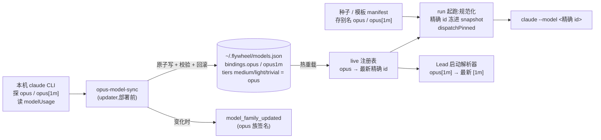

# FLY-2775 Opus 线「跟最新」— 返工实施计划

Issue: FLY-2775 (https://linear.app/geoforge3d/issue/FLY-2775/模型opus-线-opus-线切到-opus-55claude-opus-5-5-已于-2026-09-22-1007-pt)
日期: 2026-09-23
基于: plan.md、implementation-notes.md、QA FAIL(run 53ab3f14 qa attempt 1)、Lead 裁定 q 9d81f23e / cb3115df

## 0. 为什么返工

founder 2026-09-23 00:11Z:「不要 hardcode 成 5.5,以后有最新的 Opus 就自动切换」。第一版只是把绑定从 5 改成 5.5,
还是写死的。QA 判 FAIL,两条 BLOCKING:

- **B1 跟最新未实现。** QA 找到了现成落点:Fable 线早有 FLY-2766 的 `account-heal/fable-model-sync.ts`。
  它由 `scripts/update-flywheel.sh` 的 `updater_sync_fable_model` 在**每次部署前**调用,流程是:
  探 Anthropic `/v1/models` → 挑本线最高版 → 原子写 `~/.flywheel/models.json` 的 `bindings.fable` / `tiers.heavy`
  → 写后校验,失败就回滚 → 发 `model_family_updated` 告警。Opus 这半边一直没做。
- **B2 exact-head CI 红。** `model-routing.md` 多了 147 字符,压垮了常驻 rule 预算。**已修**(commit `236202b4a`):
  措辞改成比 main 短 10 字符,按先例刷新 `legacy-bundle.json` 并加 evolution 记录;两条预算用例在合并树上 7/7 通过。

## 1. QA 判据(issue 正文,Lead 00:1xZ)

1. 新派一张单:Claude 实现体和 QA 体首屏显示 Opus 5.5,运行回执记的是精确 id `claude-opus-5-5`。
2. Lead 模型解析器对 `opus[1m]` 输出 5.5 的 1M 变体,且要有测试。
3. 模拟「产品线出了更新版」:不改代码、不改 models.json,新派单就解析到更新版,并触发版本变化记录和告警。
4. 已在飞的 run 快照不变。

另加:所有项目生效,并附项目×节点核对表;管理台下拉要有「opus(跟最新)」;部署说明按新形态重写。

## 2. 关键事实(实测)

| 事实 | 证据 |
|---|---|
| `opus` 家族别名由 **CLI 客户端按版本**解析,不是服务端 | `modelUsage`:2.1.278 `--model opus` → `claude-opus-5`;2.1.280 → `claude-opus-5-5`;两版都接受 `opus[1m]` |
| 全名钉新版需要 CLI 认识它 | 2.1.278 `--model claude-opus-5-5` → API 400 |
| manifest 可以存别名,run 起跑时解析并钉死 | `tpl_code` rev14(founder 发布,schema 2)存 `eng_design.model = "fable"`;FLY-2762 快照为 `claude-fable-5-1` + `dispatchPinned` |
| 种子路径把别名冻成全名 | `compileWorkflowMenuSeed` 写 `resolveAlias(...).model`;`importWorkflowTemplateSeed` 持久化的是规范化后的 manifest |
| 模板规范化用的是 live 注册表 | `validateWorkflowManifest(m)` 对 `qa.model = "opus"` 返回 `claude-opus-5-5`(隔离 HOME 实测) |
| Fable sync 跑在部署/重启**之前** | `update-flywheel.sh`:`updater_converge_bin` → `updater_sync_fable_model` → `updater_run_launchd_then_cycle` |

## 3. 设计(R2:已吸收 Codex 设计审 R1)

### 3.1 opus-model-sync:以本机 CLI 为发现权威(R1 #3/#5 + 推荐的更简方案)

**不再**对 `/v1/models` 的结果排序。原因:`opus` 别名本来就是由 CLI **客户端按版本**解析的(§2 实测),
所以「跟最新」的真实含义就是「跟本机 CLI 认识的最新」。直接问 CLI 最准,还顺带消掉三件事:
日期后缀 id 排序的坑、`max_input_tokens` 推断,以及「API 列出了、本机 CLI 却不认」的错配。

- **两次探测,要求结果成对**:
  - `claude -p --model opus --output-format json <固定短 prompt>`,`modelUsage` 的键里恰好有一个,且匹配
    `^claude-opus-\d+(?:-\d+)?$`(只认一段或两段版本号,**明确拒绝**以 8 位日期结尾的 id,
    形状不符就 fail closed);
  - `claude -p --model 'opus[1m]' --output-format json …`,`modelUsage` 的键必须**恰好等于**「基础 id + `[1m]`」。
  - 任一失败,两个 binding 都不动,绝不半推进。
- **进程契约**:
  - 调用方式:`execFile`,`shell:false`,stdin 关闭。
  - 限额:stdout/stderr 上限 64 KiB,硬墙钟 60 s,超时 SIGTERM,再 5 s 后 SIGKILL。
  - 环境隔离:cwd = 临时空目录;加 `--setting-sources ''`、`--disable-slash-commands`、`--strict-mcp-config`
    这类隔离开关,具体以 CLI 实测为准;不加载项目插件或 MCP。
  - 二进制可用 `FLYWHEEL_CLAUDE_BIN` 覆盖。
  - 探测在拿 authority 锁**之前**跑,拿锁后重读并比较 preimage(与 Fable 同一模式)。
- **可诊断的 retained 原因**:`cli_missing`、`cli_timeout`、`cli_auth_unavailable`、`cli_rejected`、`cli_output_invalid`、
  `cli_pair_mismatch`、`disabled`、`cooldown`、`unsafe_authority`、`invalid_authority`、`write_failed`、
  `verification_failed`、`rollback_failed`、`authority_busy`。
  - `rollback_failed`(R1 #9):校验失败后回写旧字节也失败,单独报这个结果并发 **high** 告警,不再冒充「已回滚」。
- **冷却(R1 #4)**:updater 除了 00:00/12:00 的定时触发,**每次 urgent 唤醒也会跑**。
  - 由于解析结果只随 CLI 版本变,冷却键取 `claude --version`。版本没变、且上次探测在 24 小时以内,就跳过探测
    (零花费),返回 `cooldown`。
  - 状态记在 `~/.flywheel/state/opus-model-sync.json`,写入原子,0600。
  - 检测 SLA 写明:CLI 更新后的下一次 updater 运行即可发现;最坏情况是「CLI 版本不变、服务端改了映射」,
    这时靠 24 小时的兜底复探。
- **写入**:upsert `models[]` 两条(`dispatch: true`,label `Opus X.Y` / `Opus X.Y (1M)`,别名 `opus-X-Y` / `opus-X-Y-1m`;
  `[1m]` 条目写 `contextWindowTokens: 1_000_000`,基础条目不写,与 Fable 对未证实窗口的处理一致)。
  - `bindings.opus` / `bindings.opus1m` 推进到新 id。
  - `tiers.medium/light/trivial`:仅当值为 `undefined`、`"opus"` 或等于当前 canonical 时改成 `"opus"`。
  - **只 upsert、不删**:上一代留在 overlay 里,仍带 dispatch 面,在飞快照继续可派工。
- **熔断(R1 §6.1 答复)**:Fable 本身没有冻结手段。这里不往 models.json 新增字段,改用 updater 级 kill switch
  `FLYWHEEL_OPUS_MODEL_SYNC_DISABLED=1`,跳过时要记日志,并有测试覆盖。
  回滚 = 打开 kill switch,再把两个 Opus binding 钉回想要的精确 id。
- **公共原语抽模块(R1 #10)**:把 `authorityIsSafe`、`atomicReplace`、`readVerifiedSnapshot` 原样搬到
  `account-heal/model-authority-io.ts`,Fable 与 Opus 都 import 它。纯搬移,用 Fable 现有测试证明行为不变。
  `fetchModels` 仍留在 Fable 里,因为 Opus 不再用它。

### 3.1b R3 补丁(Codex 设计审 R2,全部采纳)

- **发现 ≠ 准入(R2 #1 BLOCKING)**:别名探测得到一对新 id 后,还要再用**精确拼写**探两次:
  `--model <base-id>` 与 `--model <base-id>[1m]`。四个结果全部一致才提交。
  - 已准入的元组 `{claude 二进制 realpath, CLI 版本, base, 1m}` 写进状态文件缓存;同一元组不重复付费探测。
  - 同一阶段的 base 与 1M 两次探测并发跑,压缩墙钟时间。
  - 回归用例:别名探测返回 5.5、精确探测被拒 ⇒ 两个 binding 都不动。
- **告警持久化(R2 #2 BLOCKING)**:状态文件里记一个待发通知队列,每条是 `{family, from, to, kind, signature, delivered}`。
  - 先把条目写进待发队列,再提交 authority。
  - **每次** updater 运行都先补发未送达的条目,冷却期间也补。签名固定,便于去重。
  - `rollback_failed` 的 high 告警走同一条路。
  - 要测的场景:发送失败、进程重启、冷却期补发、签名只算一次。
- **编译传原别名(R2 #3)**:`compileWorkflowMenuSeed` 仍调用 `resolveAlias` 做 vendor/策略校验,但写进 manifest 的是
  `defaultPolicy.model` 的原始拼写(仅限三个 Opus 别名)。三种拼写都要走通 编译 → 预检 → apply → DB 读回。
- **探测进程契约定稿(R2 #4)**:
  - argv:`-p <固定 prompt> --model <m> --output-format json --safe-mode --setting-sources "" --strict-mcp-config
    --disable-slash-commands --tools "" --permission-prompts none --no-session-persistence`(**不用** `--bare`,它会禁掉 OAuth)。
  - `--version` 走同一个有界 helper:stdin 关闭,两路输出都封顶,超时杀进程组。
  - 两个覆盖变量分开:`FLYWHEEL_OPUS_MODEL_SYNC_CLI` 是编译后的 sync 程序,`FLYWHEEL_CLAUDE_BIN` 是被探测的 claude。
  - kill switch 与 authority 安全检查放在任何付费调用之前。
- **受控写入器(R2 #5)**:参数化后的发布器测试覆盖 `tpl_code.qa` / `tpl_simple_code.qa`。
  - 初始状态:精确 `claude-opus-5` 或 `claude-opus-5-5`,`effort: high`,改成 `opus`。
  - 要证明:stage、apply、DB 原样读回、founder 归属、不相关节点不变、重复执行是 no-op。
  - 另加只读部署预检。
- **实现节点证据(R2 #6)**:部署验收同时要拿到 implement 节点选 `opus` 的证据(FLY-2763 同 vendor 特许,
  或另开一单),两个节点各自的请求派工 id 与 pane 首屏都要截取。回执一律称「请求派工回执」。
- 冷却不得压住 authority 规范化或待发通知(R2 §6.3)。kill switch 写在 `~/.flywheel/.env`
  (updater 会 source 它),回滚说明写清在哪设、怎么撤。

### 3.2 updater 接线

- 新增 `updater_sync_opus_model`,紧跟 `updater_sync_fable_model`,属于 advisory(失败不改退出码)。
- 支持两个环境变量:`FLYWHEEL_OPUS_MODEL_SYNC_CLI` 覆盖 CLI 路径,`FLYWHEEL_OPUS_MODEL_SYNC_DISABLED` 做 kill switch。
- 把 CLI 路径、版本和结果原因记进 updater 日志,不含凭据。

### 3.3 模板存别名,run 起跑时解析(R1 #1/#2 的修法)

- **system-owned 种子,统一持久化契约**:新增 `validateSeedManifestForPersistence(manifest, snapshot)`,
  内部调用 `validateWorkflowManifest(..., { modelSnapshot, retainFollowLatestAliases: true })`。
  - 该选项下,节点 model 若是 `opus`、`opus-1m` 或 `opus[1m]`,照常用 `canonicalWorkflowModel` 严格校验
    vendor/effort/surface 支持,但**返回原别名**;其余 model 行为不变。
  - **同一个 helper** 用在四处:`compileWorkflowMenuSeed`、目录迁移预检(`StateStore` 的 seed hash 重算)、
    迁移 apply,以及 `importWorkflowTemplateSeed`。三处 hash 口径一致,消掉启动时 hash 不匹配这颗炸弹。
  - 补一条**真实**的 `migrateFly2121WorkflowCatalog` 启动迁移测试:别名种子经它导入,DB 读回的字面量是 `opus`。
- **founder-owned 模板,走受控别名写入器**:把 `bin/publish-fable-template-alias.ts` 参数化成
  `--model <fable|opus|opus[1m]>`(默认 `fable`,Fable 行为逐字不变)。它走管理台 stage/apply,管理台 DAG
  写入器本来就保留别名并读回校验(Codex 已核实 `management-dag-writer.ts`)。
  - 本次一次性迁移 `tpl_code.qa` 与 `tpl_simple_code.qa` → `opus`。
  - **不再用** `workflow-template publish --from seed`,它会把别名冻回全名。已在部署说明里写明;
    让它也保留别名留作 follow-up。
- 保留范围只限这三个 Opus 别名;Fable 种子不动(R1 §6.4)。

### 3.4 回执的口径(R1 #7,**需 Lead 确认**)

snapshot 记录的是「**请求派工的精确 id**」(`dispatch.model` + `dispatchPinned`),这是判据 1 可自动断言的部分。
它**不能**证明实际服务的模型:Claude Code 过载时的 `--fallback-model` 可能换模型。
这里不偷换概念,向 Lead 提两个选项:
- (a) 判据 1 的回执 = 请求派工 id;实际服务模型由 QA 看 pane 首屏(判据原文已要求),`modelUsage` 回填比对
  另开 follow-up 单;
- (b) 本单内实现回填比对。

我建议 (a)。已报 Lead,答复前先做其余部分。

### 3.5 QA 须与实现不同

比较在**解析之后**进行(`resolveMenuOverrides` 按解析出的 vendor 比较;snapshot 里是精确 id)。**不改代码**。
补测试:两个节点都写 `opus` 时,无特许仍拒绝,有 FLY-2763 特许仍放行。

### 3.6 定价与标签(R1 #6)

- **不加** Opus 家族通配费率。未知的新 Opus 仍是「$0 + 告警」,显眼地未定价,不会被静默套用旧价。
- **改正** 5.5 两条费率:第一版登记的 5/25/0.5/6.25 是错的。按 Anthropic 当前价目:input $4、output $20、
  cache read $0.20、cache write(5 分钟档,沿用本表 1.25× input 的列定义)$5;`[1m]` 同价。
- sync 推进到新 id 时,若该 id 不在内建费率表里,告警正文附一句「新模型未定价,成本报表记 $0,请在
  token-pricing.json 配置」。
- `render-html.ts`:加 Opus 正则标签(`Opus 5.5 · 1M`)和族色兜底。这只是显示,不涉及价格。

### 3.7 Lead 侧

- 解析器 `_pre_resolve_lead_model_decision` 已经走注册表。补测试:projects.json 写 `opus[1m]` →
  `--model claude-opus-5-5[1m]`;models.json 推进到 `claude-opus-6` 后 → `claude-opus-6[1m]`。
- 所有项目的 Lead 共用这一个解析器。

### 3.8 管理台下拉

`claudeTierOptions` 在目录之外加两个「跟最新」选项:`opus` 显示为「Opus · 跟最新」,`opus[1m]` 显示为「Opus 1M · 跟最新」。
Codex 已核实 fleet 批量写入器把值原样写进 projects.json;加测试钉住这一点(`validateModelWrite` 注释里
「持久化会被规范化」的说法与实际不符,顺手修正注释)。

### 3.9 全项目盘点 = 部署闸(R1 #8)

新增只读脚本 `scripts/fly2775-opus-inventory.mjs`,盘点三类对象:
- 每个活跃的 `workflow_category_binding`,对应当前发布修订里每个 Opus 节点;
- 每个项目 `projects.json` 里 Lead 的 model;
- 7 个项目 × 节点。

每项分为三类:「稳定别名」「精确钉(有意豁免)」「需迁移」。存在「需迁移」项时脚本 exit 1。
PR 里附这张表;部署完成后脚本 exit 0,才算判据「所有项目」达成。

## 4. 部署(R2)

1. 合入 + rebuild + 重启。种子存别名,**不再依赖顺序**。
2. 立即跑一次 `node packages/teamlead/dist/account-heal/opus-model-sync-cli.js --authority ~/.flywheel/models.json`
   (或等下一次 updater)。它会**自动**把生产 models.json 的 `bindings.opus = claude-opus-5` 和三档 tier
   推进到 5.5 / `"opus"`。
3. 用受控写入器一次性把 `tpl_code.qa`、`tpl_simple_code.qa` 改成 `opus`:
   `node packages/teamlead/dist/bin/publish-fable-template-alias.js --model opus --template <id> --node qa`。
   **不要**用 `--from seed`。
4. 跑盘点脚本,exit 0 为通过。
5. 验收:
   - 新 run 的 `resolved.nodeModels.qa.model = "opus (= claude-opus-5-5)"`,snapshot 为 `claude-opus-5-5`;
   - 在飞 run 的快照不变;
   - QA 看 pane 首屏显示 Opus 5.5。

回滚:设 `FLYWHEEL_OPUS_MODEL_SYNC_DISABLED=1`,再在 models.json 里把两个 Opus binding 钉回想要的精确 id。
不需要改代码,也不需要重启(注册表热重载;模板存的是别名)。

## 5. 测试(只跑相关文件;R2 #7 已刷新)

- `opus-model-sync.test.ts`:
  - 别名 JSON 解析:`modelUsage` 单键、形状校验(一段或两段版本、拒日期尾、fail closed)、成对一致。
  - 准入:精确探测被拒 ⇒ 不动;四个结果一致 ⇒ 推进;已缓存的元组不重复探测。
  - 有界进程 helper:永不退出、输出超限、ENOENT、非零退出、坏 JSON;`--version` 同样有界。
  - 冷却:键是 CLI 版本;状态文件损坏 ⇒ 视为无缓存重探;冷却期内仍补发待发通知。
  - 锁下漂移:探测后、拿锁前 authority 被改 ⇒ 重读后按新 preimage 规划。
  - 写后校验失败 ⇒ 回滚;回滚也失败 ⇒ `rollback_failed` + high 告警。
  - 连续两次升级(5.5 → 6 → 6-1):旧代都仍可派工。
  - **判据 3 的模拟**:探测返回 `claude-opus-6` ⇒ models.json 推进 + 告警入队送达;新 snapshot 解析出 `claude-opus-6`,
    旧 snapshot 仍是 5.5。
- `opus-model-sync-cli.test.ts`:kill switch、advisory 退出码 0、通知失败后下一次运行补发。
- 种子:三种 Opus 拼写经 编译 → `migrateFly2121WorkflowCatalog` → DB 读回都是原别名,hash 口径一致;
  两个节点都写 `opus` 时,QA 同 vendor 规则照旧生效。
- 发布器参数化:`tpl_code.qa`、`tpl_simple_code.qa` 场景(见 §3.1b)。
- updater shell:`updater_sync_opus_model` 的桩调用、kill switch、advisory 语义。
- `fly241-lead-model-override.test.sh`:`opus[1m]` → `claude-opus-5-5[1m]`;推进后 → `claude-opus-6[1m]`。
- fleet-capabilities / feature-flag-report:「跟最新」选项在列,且原样写入。
- pricing:5.5 新价;未知 Opus 仍记 $0 并告警。render-html:Opus 标签兜底。
- Fable 回归:`fable-model-sync*.test.ts` 全过,证明抽模块没改行为。
- 盘点脚本:用夹具 DB 覆盖 exit 0 / exit 1 两种情况。

## 6. 待确认

1. ~~熔断形状~~ → 采纳 Codex:updater 级 kill switch(§3.1)。
2. **回执口径**(§3.4)→ 等 Lead 裁定 (a)/(b);建议 (a)。
3. ~~探测节奏~~ → updater(定时 + urgent)+ 以 CLI 版本为键的冷却(§3.1),不另起每小时任务。
4. ~~Fable 种子存别名~~ → 不在本单(Codex 同意)。
