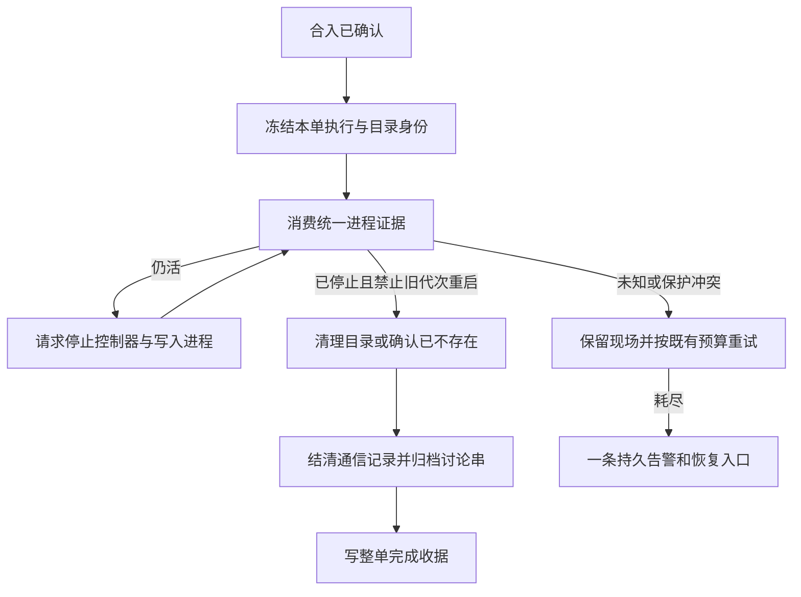

# FLY-2778 收尾恢复 — 实施计划
Issue: FLY-2778 (https://linear.app/geoforge3d/issue/FLY-2778/收尾清理失效-ship-之后-worktree-没被删thread-没归档land-收尾-issue-closeout-incomplete)
日期: 2026-09-26
基于: research.md

状态：待有效 design review。仅设计，不是上线证明。

## 1. Founder 视角
合入后，系统要把“还能写文件的执行进程”“临时工作目录”“讨论串”和“完成记录”逐项结清；任何一项失败要说明卡在哪里，并给出可重复恢复的入口。
本次不是恢复一段完全停止的删除代码。实查 DAG（按节点运行的工作流）把清理收据写在另一张表：9-17 后已有62条删除成功。真正问题是部分旧判断拦住统一证据采集、探针预算冲突，以及收尾事实与旧错误标签混在一起。

交付分为：统一证据接线、可靠失败可见、存量安全回收。原验收五项全部保留，不以静态检查替代真实隔离 ship。

## 2. 复用与依赖
- Lead 在问题回复 `cb2a32e9-73f8-4b6e-9520-21223c712403` 明确：2919尚未合入时，本单可以定义单一 seam 并使用保守回退，不必等待整单合入才能实现。最终集成并核验2919的 `execution-body-liveness.ts` / `execution-process-liveness.ts`，其 `BodyObservation` 为物理生命真源；不造进程扫描器、owner registry、第二份 alive/dead 状态表或独立调度器。Bridge composition root 只注入一个 provider：2919已可用则用其正式导出；未可用时的兼容provider仅委托现有受信完整execution closeout证据/关闭回执并保留所有活体、owner、spawn和未知守卫，不拼新探针或复制窗口式判定。缺控制器/代次绑定的旧证据一律unknown，绝不为适配接口把字段补成dead。用启动时明确能力/协议校验选择provider，禁止同一请求双跑或按错误静默降级。2919合入后在同一composition root切换，兼容provider保留仅明确旧部署需要的范围；消费者/测试矩阵不变。实现记录实际provider、版本和未覆盖形状，正式真实ship验收仍需所选provider完成全链，不以fallback配置成功代替。
- 复用 FLY-2903 stop-owner-before-reap 和 runtime drained；2919 已覆盖 controller restart/spawn fencing。死亡意味着旧 writer 和能重启它的控制器均不能再写。
- 复用 FLY-2616 的 immutable closeout_targets、reservation、closeout_execution_evidence、CommDB trusted finalization、land_alert_outbox、operation audit；复用 FLY-2662 的鉴权 `land reclose`，不重复设计合入/租约系统。
- 保留 FLY-2688/2751 worktree 作为样本；仅在隔离环境重构复现。生产本单只读 dry-run，真正执行由后续既有授权流程处理。

## 3. A — 修复正常 ship 的收尾消费链
### 3.1 每个节点都要有明确结论
改 `packages/teamlead/src/bridge/lifecycle-closeout.ts` 的 land 分支；在旧 closeRunner/preserved/pending 返回之前，按当前精确身份获得2919 body observation。不是把 return 删除后无条件继续：先核对 operation owner/generation、issue/run attribution、reservation、launch/spawn owner、activation、生命周期版本和 observation 有效期。

| 统一结果 | land 行为 | 不得发生 |
|---|---|---|
| alive | 走既有受权 cooperative shutdown → controller stop/drain → 精确 reap → 新证据；正常可退出的本体在首个 finalization 尝试内完成 | 以窗口缺失、心跳过期或状态 completed 直接删除 |
| dead | 原 status/取证保留；进入现有 physical pass 与通信结账；展示窗口残留单独幂等清理 | 再被旧 pane/host-shell/heartbeat 生命判断否决 |
| unknown / expired / identity mismatch | 持久化缺失项和子原因，保留现场并有限重试 | 降为 absent、继续归档、重绑证据给新代次 |

将旧 `probeRunExecutionLiveness`、`probeRunnerProcessLiveness` 和每节点 pgrep/ps 从 **land 死亡授权链** 删除或转为非授权诊断。FLY-2919 已修改的消费者不重复改；实现以最终 diff 与消费路径为准。非 land 调用不扩大重构。

`execution-closeout-evidence.ts` 保留 closeout 身份/CommDB/launch/归属包装，生命 verdict 直接映射 body dead→gone、alive→alive、unknown→unknown。追加 body observation 引用或嵌入受限字段（identity、bindingDigest、observedAt/expiresAt、reason）；不得重算另一套判定。有效期采用共同证据较短期限，不能从收到证据时重置 TTL。旧 version=1 证据只作审计；新 destructive consumer 不接受旧窗口式 gone 作为共同 body 证明。若2919已升级 envelope，沿用其版本，避免另起版本。

把 `closeout_issue_items_blocked` 的每节点项目扩充为 executionId、evidenceId、bodyReason、阻塞阶段（shutdown/body/comm/worktree/archive）、具体 prerequisite；缺 evidence 也须说明何处提前返回。复用 operation aux audit，原 session event 保持兼容，不用假 execution ID 造新事件。

### 3.2 旧历史节点的缺证恢复
不将所有 missing/no_group 当 dead。2688 的 auth ENOENT 只说明候选，必须核对原始失败事件的 project/run/activation、closed launch claim、未发生成功 spawn、无当前 owner/restart/lock/socket/worker 的完整闭包，再由现有受信 pre-adapter 例外或经审查的 FLY-2754 legacy 恢复得到共同接口认可的证据。固定迁移截止时刻、receipt origin=legacy_compat，重复执行幂等；不能把新诊断日志当旧出生证明。
2910 的 Child stdio timeout、2751 的“ghost”操作说明不能作为从未启动证明。缺少受信旧绑定/退出回执时，dry-run 输出 `legacy_evidence_missing` 与所缺材料，由原 recovery 门补证/处置；禁止按 issue ID 白名单放行。实现交付须量化这些未解决项，不承诺所有历史目录都可自动删除。
此处不创建新的人工 dead=true 权限。若现有2919/2754恢复入口不能覆盖某样本，实现须向 Lead 带完整身份和缺项报告，补设计后再执行；不能降低保护求绿。

### 3.3 两阶段收尾与状态一致性
保留现有 physical pass → worktree settlement → record finalization pass 顺序，归档必须在所有当前归属 writer 已停止、通信义务可安全结清、目标目录已 removed/absent 后执行。physical pass 的 `communicationsFinalized=true` 现为“允许延后”的内部信号，不能在最终对外摘要冒充实际 CommDB 完成；对外列 physicalProof、recordsFinalized 分项事实。
在第二次 pass 必须复核新的 activation/owner/TURN；可以消费同身份仍新鲜的共同 observation，过期重新采样，不能复用旧 gone 绕过新 writer。Fencing 失效立即停止后续 effect，不能先删再补授权。
只有 `finalization_completed` 成功持久化后 `land_operation.state=completed` 才表示收尾完成。核对 `StateStore.recordLandOperationStep` 的该分支：原 last_error 如仍保留则在同事务清除当前错误，历史错误保留在 step/event，不篡改历史。历史 completed+last_error 不全库自动改写；报告按 finalization receipt/target/record/archive 分项判定，显式区分旧标签与当前阻塞。
已被人工删掉的准确 bound path 沿用 `cleanupState=absent`：父目录身份有效、真实叶子 ENOENT，权限错误/父目录消失/软链不算 absent；存在同名新目录或新 generation 均拒绝。目录不存在只完成目录义务，不自动证明节点死亡或讨论串已归档。

## 4. B — 失败可见，复用现有持久告警
当前 `releaseLandOperationWithRetryAccounting` 已原子写 held 和 land_alert_outbox，保留。`land-executor` 的 thread 通知只是补充；`suppressed_archived` 不算主告警成功或失败的唯一证据。
审计并最小修复 `workflow-engine-dispatcher.reconcileLegacyLandAlerts` 到 `sink.alert` 的端到端身份：将对外 eventId 固定为 `land-held:<operationId>:<resumeGeneration>`（attempt 只作 metadata），源表仍用现有唯一键。与 workflow-engine escalation 的平行通知检查是否重复；若同一 episode 两路到 Lead，保留一条持久告警路径，线程进度日志不额外叫醒 Lead。不得改其他事件去重策略。
“只一次”定义：同一 operation/resume_generation 的一条逻辑告警；同请求失败、进程重启、发送成功但本地 ACK 丢失均用相同 id 重试。显式 reclose 增加 generation 后的新失败允许新告警。持久 outbox 的 sent 表示 sink 接受（可能只是 queued），报告另列投递 receipt，不称模型已读；QA 必须到最终 Lead mailbox 唯一消息验证，不能只看源表。
现有最多3次投递失败的状态必须有可检索 dead-letter/既有升级入口。实现追踪该入口；如果没有则复用既有 alert dead-letter，保留 operation/recovery 命令，不静默丢弃、不再建一套通知器。失败原因保持原始 typed cause，并携带阶段与 missing evidence IDs。

## 5. C — 可重复的存量回收入口
扩展现有 `packages/flywheel-comm/src/commands/land.ts` 与 `bridge/lifecycle-routes.ts` 的 Lead-only lane，建议命令名 `land cleanup --dry-run --project 
` 和 `land cleanup --execute <manifest> --request-id <uuid>`。命名可按已有 CLI 风格调整，语义不可省。没有参数默认只读；执行只接受服务器验证的候选集，Runner token/跨项目/未鉴权拒绝。复用当前 Lead 鉴权与 issue/repo lock，不用本地 manifest 内容作为授权。

### 5.1 dry-run
枚举 Git 实际 registered worktree（不是 glob ~/Dev）与可信 target/binding；关联 repository + PR number + actual head branch，查询远端实际 MERGED/CLOSED。每候选输出：project/repo、issue/run/op（可空）、PR id/state/head、canonical path、parent identity、generation、branch/head、所有关联 execution/activation、共同 body 结果、工作树 clean 状态、远端保全证明、eligible/exclusion reasons、observedAt、manifest digest。所有动态 SQL 参数化，路径/UUID/枚举/大小/数量边界校验，报告转义。

合格集合同时满足：
1. MERGED 或 CLOSED；OPEN、无 PR、查询不明、多 PR 归属歧义一律排除。显式排除2688/2751样本；不因最新 founder 曾允许手清无PR扩大本单自动清理。
2. 所有关联 writer/controller 共同证据 dead，launch/resume fenced；无未知归属/在飞 activation/TURN。只看最后一个 runner 不足以准入。
3. `git status --porcelain` 含 tracked、staged、untracked 都为空；无法读取则 unknown。submodule dirtiness 也拒绝。工作树 locked、detached、main/protected 分支排除。
4. HEAD 有新鲜远端保全：准确远端 ref 可达/包含 HEAD，或 MERGED PR 保存的 exact merged head 与 HEAD 一致且 merge/base 证明完整。禁止仅本地 stale origin ref、branch 名称或“已合入”保全后来新增提交。CLOSED 未合入必须有远端实际 ref 包含该 HEAD，不能用已关闭 PR 的旧 head 代替。
5. 父目录/叶子/registered path、branch、generation 与绑定一致；软链/重建/路径越界/无可信 binding 拒绝。所有 `teamlead.db.corrupt-inplace-*` 等取证件不进入枚举或执行目标。

输出分类总数：原始 MERGED/CLOSED、dirty、unpushed、live、unknown、preserved、identity conflict、最终 eligible。QA 要求“数量一致”是同一时点按这些全部守卫计算的集合相等，不能声称等于32或所有仅干净目录。每个排除项有理由，保留 dirty 阴性对照。

### 5.2 execute
服务器重新枚举并复核候选，不信任 manifest 的 eligible/dead/clean；manifest 只是操作者选择的上限。逐项在既有 issue mutex/repo lock 内重核 PR state/head、branch HEAD、worktree generation/parent、clean、共同 body/owner 状态和已推证明；任一变化拒绝该项且继续输出其他项结果。effect 前再核 lease/authority；所有 Git 调用使用 execFile 参数数组和 `--`，不拼 shell。使用 `removeCleanWorktreeByPath` / `git worktree remove` 无 --force；不 rm，不调用全局 prune，不删除非候选文件。
MERGED 有匹配 land op 的项走现有 authenticated closeout_only reclose（不再 merge/重审 shipping），目录清理由同一 finalizer 执行。CLOSED 无匹配 merge authority 的项只走当前 closed/canceled lifecycle authority下的**目录回收**，记录 `worktree_cleanup_done/absent` 和 requestId/目标摘要；不伪造 merged operation，不把 issue 标 shipped，不擅自 archive thread。CLOSED 路径复用cleanup中可安全独立调用的 path/clean/non-force能力，增加远端保全前置，禁止借 legacy derived-branch 分支绕过本节守卫。需要审计身份时使用现有 lifecycle audit，不把 operation_id 伪成 execution_id。
重复同 requestId+digest 返回既有结果；requestId 不同内容409。进程在 remove 后、收据前退出：重放时目录真实 absent、父身份匹配，记 recovered_absent，不再删除分支或其他目录。重建同路径必须阻断。批量中部分失败返回 per-item result，不报整批成功。分支删除不是回收80GB的必要动作，存量路径默认保留本地 ref；普通 ship 原有 CAS branch cleanup 不扩张。

## 6. 结构模型与兼容
不新增生命状态表。权威链为：`land_operation + closeout_targets`（对象身份）→ 2919 `BodyObservation`（短期进程证据）→ `closeout_execution_evidence`（本次收尾引用）→ `land_operation_step`（效果收据）→ `land_alert_outbox`（失败通知）。CLI manifest 是建议选择，绝非死亡/删除授权。
新增批量 request receipt 仅当现有生命周期幂等收据无法承载时才增最小 durable record，字段 requestId/project/actor/targetDigest/outcomes；必须在实现前审计现有操作收据可复用点并记录选择，不引入通用 job/队列框架。如新增表，加入 retention registry 保护当前引用，参数化唯一约束，迁移向后可读；旧 writer 不理解新 destructive evidence 时不得执行该路径。
回滚：关闭新增 execute 路由，保留 dry-run/收据/既有失败保护。不能回滚到窗口等于死亡，也不能回滚已完成的文件删除；代码回滚与数据清理不可逆性分别说明。未知旧证据继续 fail-closed；无自动重写 held/completed、无自动生产reclose。合并与部署分开，仅 updater 在窗口部署。

## 7. 实施任务与正反验收
每任务先红测试→最小实现→相关绿。实现/QA 不得把本设计勾为已完成。

| 任务 | 文件范围 | 必需证据 |
|---|---|---|
| A0 对齐2919 | 共同接口、plugin wiring、research appendix | 最终导出/部署版本/消费者映射；单provider接线；2919未就绪时保守回退及切换测试 |
| A1 统一收尾 | lifecycle-closeout.ts、execution-closeout-evidence.ts、post-ship-finalization.ts；close-runner/codex-phase-shutdown 仅2919遗漏接线 | failed/no_group、pending、dead body/live viewer、alive body/absent window、controller restarting、超时逐项红绿；准确节点无 evidence 的缺口被覆盖；旧错误标签不压过新事实 |
| A2 身份与完成 | StateStore.ts、land-operation-audit.ts、worktree-cleanup.ts现有逻辑 | probe后新activation/owner/TURN、目录重建拒绝；absent重放幂等；第二pass失败不谎报completed；完成后旧错误清理且历史仍在 |
| B 告警 | workflow-engine-dispatcher.ts、StateStore既有outbox、sink去重实际消费者 | 第一次held一条；发送成功ACK丢失→重启仍一条；三次失败可见dead-letter；resume新代次一条；run_id空与DAG均测 |
| C 存量入口 | flywheel-comm commands/land.ts/index.ts、lifecycle-routes.ts、复用cleanup原语 | dry-run零写/零kill/零archive；execute重验；CLOSED有远端保全可删/无保全拒绝；dirty/untracked/OPEN/noPR/unpushed/live/unknown/样本/取证全部阴性 |
| D 隔离验收 | 新增最小 `scripts/qa-fly2778-closeout.mjs` 及本目录 evidence，复用原529测试房工具 | 真实DAG ship→merge→done事件→目录不存在→thread远端archived→op completed，无incomplete；非mock整链 |

**真实事故与变异：**从命名样本的完整 identities 构造最小隔离关系闭包，保留来源/时间/digest/原始值与替换映射；不得搬生产 credential 或访问生产 destructive endpoint。至少 nodes_not_confirmed_gone（旧提前return/统一API）与 husk_lease_stale（旧heartbeat+pane veto）各一例，另加 pending。新代码绿后逐个还原对应旧行为，用同一测试必须红，再恢复绿；只删断言不算变异。生产unknown样本不得在fixture里直接写 dead，要明确标 synthetic 的可证明死体变体，并保留原unknown拒绝对照。
真实ship使用隔离repo/数据库/runner/Discord sandbox thread/Linear sandbox issue，走原land executor和post-ship wiring，不允许只调用cleanup helper。不新增生产provider授权；测试房使用现有授权能力，否则报告缺项，不能降格成mock验收。确认 `eventKind=worktree_cleanup_done` 来自operation audit（DAG）且包含同op/target身份，session_events同名仅legacy兼容，不要求伪造双写。
生产dry-run只读：新入口与独立 Git+PR+clean+body 判定集合逐路径相等，人工已删目录单列absent；保留所有排除理由。实际execute只在隔离环境证明 repeat/restart/race。目录样本2688/2751和取证文件做前后存在/摘要负控。

## 8. 本地测试选择（必须遵守local-test-policy/v1）
禁止全仓/全包套件。实现先记录对旧/新 literal 的 `git grep -lF -- '<literal>'`，并检索每 changed full path/filename/parent目录；每个排除测试说明原因。下表是初始候选，不代替实施后发现；每次只一个具体文件。

- `packages/teamlead/src/bridge/__tests__/lifecycle-closeout.test.ts`
- `packages/teamlead/src/bridge/__tests__/execution-closeout-evidence.test.ts`
- `packages/teamlead/src/bridge/__tests__/run-quiescence.test.ts`
- `packages/teamlead/src/bridge/__tests__/run-quiescence.fly2498-absence-probe.test.ts`
- `packages/teamlead/src/bridge/__tests__/codex-phase-shutdown.test.ts`
- `packages/teamlead/src/bridge/__tests__/shipped-husk-escalation.test.ts`
- `packages/teamlead/src/bridge/__tests__/worktree-cleanup.test.ts`
- `packages/teamlead/src/bridge/__tests__/worktree-cleanup.real-git.test.ts`
- `packages/teamlead/src/bridge/__tests__/land-alert-delivery.test.ts`
- `packages/teamlead/src/bridge/__tests__/lifecycle-routes.test.ts`
- `packages/teamlead/src/bridge/__tests__/land-executor.test.ts`
- `packages/teamlead/src/__tests__/StateStore.land-lifecycle.test.ts`
- `packages/teamlead/src/__tests__/post-ship-finalization.test.ts`
- 新批量CLI/route测试：在各owning package添加一个具体文件，覆盖B/C表，不扩成测试框架。

例如 `pnpm --filter flywheel-teamlead exec vitest run src/bridge/__tests__/lifecycle-closeout.test.ts`。changed TS 另跑 owning package `vitest related <明确changed files> --run`；不得空列表或目录/glob代替文件；确认配置不会隐式全包。保留 `pnpm lint`、`pnpm --filter 'flywheel-teamlead...' build`，CLI改动再做对应依赖build；导出类型变化追加依赖方typecheck。新增 scripts/__tests__/*.test.sh 逐文件运行。只有 frozen-head `CI OK` 是全套证据，related绿不是。设计阶段不跑实现测试。

## 9. 交付与边界
设计节点交付 exploration/research/plan、原始筛选证据、Mermaid源与HTML；有效reviewVerdict=APPROVED后发布并核对托管HTTP/CSP/评论交互，再发Lead结构化report、phase_design_complete、park。不得实现、dispatch、ship approval、merge、deploy、restart或生产删除。
实现和QA后继必须交付：①真实ship最终四项收据；②两类变异红绿；③生产只读candidate集合与阴性；④端到端告警唯一消息；⑤DAG operation audit中done+目录消失。原本33%/80GB叙述仅历史输入，本单以本次实际审计口径和新验收证据为准。

## 10. Lead 边界澄清（2026-09-26）
问题回复 cb2a32e9-73f8-4b6e-9520-21223c712403 确认本次62 done/24 absent反证，并说明已更正founder与issue描述。2919当时WIP head a84a07854，不是合入/部署证据。本计划据此允许单一seam的保守回退；生产清理仍未授权，2688/2751继续保留。此修订改变依赖策略，需要新plan blob有效review，不沿用旧blob判决。
