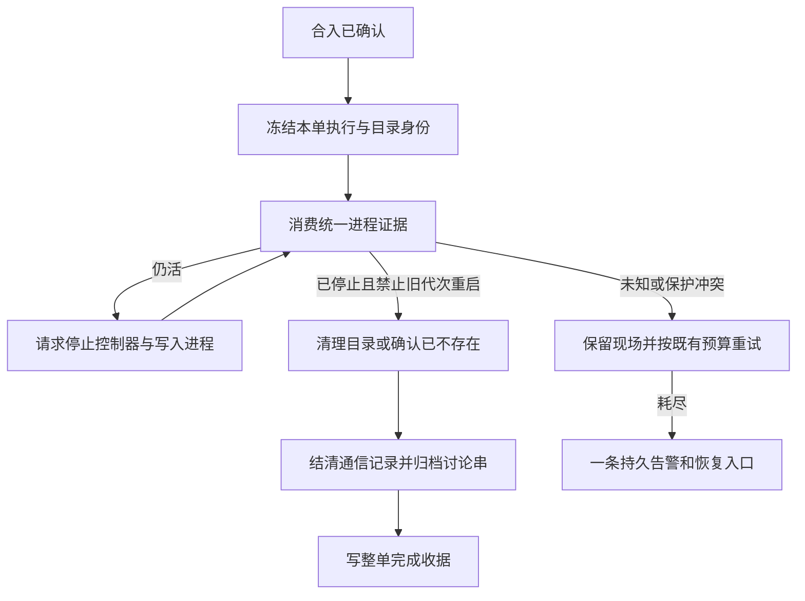

# FLY-2778 收尾恢复 — 实施计划
Issue: FLY-2778 (https://linear.app/geoforge3d/issue/FLY-2778/收尾清理失效-ship-之后-worktree-没被删thread-没归档land-收尾-issue-closeout-incomplete)
日期: 2026-09-26
基于: research.md

状态：待有效 design review。仅设计，不是上线证明。

## 1. Founder 视角
合入后，系统要把“还能写文件的执行进程”“临时工作目录”“讨论串”和“完成记录”逐项结清；任何一项失败要说明卡在哪里，并给出可重复恢复的入口。
本次不是恢复一段完全停止的删除代码。实查 DAG（按节点运行的工作流）把清理收据写在另一张表：9-17 后已有62条删除成功。真正问题是部分旧判断拦住统一证据采集、探针预算冲突，以及收尾事实与旧错误标签混在一起。

交付分为：统一证据接线、可靠失败可见、存量安全回收。原验收五项全部保留，不以静态检查替代真实隔离 ship。

## 2. 复用与依赖
- Lead 在问题回复 `cb2a32e9-73f8-4b6e-9520-21223c712403` 允许先实现单一 seam 与保守回退。实施与部署分开：2919未就绪时可以开发、审查B/只读C和A接口，但兼容provider明确只返回 **alive/unknown**，不能将现有v1窗口式gone或closeRunner窗口kill回执变成dead。因现有v1 controllerGeneration为空，这不是能完成正常ship的生产provider；**A的新破坏性消费者与C execute不得在仅有fallback时切入生产，也不得替换仍在服务的旧land路径**。不会把所有旧land迁成unknown→held后宣称已交付。真正切换的前置为2919正式导出/协议、owner/spawn接线、cohort处理与真实ship验收通过；这是可执行部署门，不要求等待2919才开始开发。
- Bridge composition root在启动时选唯一provider。fallback只用于尚未启用A/C execute的诊断与测试；2919通过能力校验后选其正式provider，随后删除fallback生产选择分支，只保留测试fake，不维护两个并行生命真源。禁止因正式provider异常临时降级；异常返回unknown。部署记录provider版本与启用范围，回滚停用新破坏性入口，保留收据；不得复活窗口式死亡授权。
- 复用 FLY-2903 stop-owner-before-reap 和 runtime drained；2919 已覆盖 controller restart/spawn fencing。死亡意味着旧 writer 和能重启它的控制器均不能再写。
- 复用 FLY-2616 的 immutable closeout_targets、reservation、closeout_execution_evidence、CommDB trusted finalization、land_alert_outbox、operation audit；复用 FLY-2662 的鉴权 `land reclose`，不重复设计合入/租约系统。
- 保留 FLY-2688/2751 worktree 作为样本；仅在隔离环境重构复现。生产本单只读 dry-run，真正执行由后续既有授权流程处理。

## 3. A — 修复正常 ship 的收尾消费链
### 3.1 每个节点都要有明确结论
改 `packages/teamlead/src/bridge/lifecycle-closeout.ts` 的 land 分支；在旧 closeRunner/preserved/pending 返回之前，按当前精确身份获得2919 body observation。不是把 return 删除后无条件继续：先核对 operation owner/generation、issue/run attribution、reservation、launch/spawn owner、activation、生命周期版本和 observation 有效期。

| 统一结果 | land 行为 | 不得发生 |
|---|---|---|
| alive | 走既有受权 cooperative shutdown → controller stop/drain → 精确 reap → 新证据；正常可退出的本体在首个 finalization 尝试内完成 | 以窗口缺失、心跳过期或状态 completed 直接删除 |
| dead | 原 status/取证保留；进入现有 physical pass 与通信结账；展示窗口残留单独幂等清理 | 再被旧 pane/host-shell/heartbeat 生命判断否决 |
| unknown / expired / identity mismatch | 持久化缺失项和子原因，保留现场并有限重试 | 降为 absent、继续归档、重绑证据给新代次 |

将旧 `probeRunExecutionLiveness`、`probeRunnerProcessLiveness` 和每节点 pgrep/ps 从 **land 死亡授权链** 删除或转为非授权诊断。FLY-2919 已修改的消费者不重复改；实现以最终 diff 与消费路径为准。非 land 调用不扩大重构。

`execution-closeout-evidence.ts` 保留 closeout 身份/CommDB/launch/归属包装，生命 verdict 直接映射 body dead→gone、alive→alive、unknown→unknown。追加 body observation 引用或嵌入受限字段（identity、bindingDigest、observedAt/expiresAt、reason）；不得重算另一套判定。有效期采用共同证据较短期限，不能从收到证据时重置 TTL。旧 version=1 证据只作审计；新 destructive consumer 不接受旧窗口式 gone 作为共同 body 证明。若2919已升级 envelope，沿用其版本，避免另起版本。

把 `closeout_issue_items_blocked` 的每节点项目扩充为 executionId、evidenceId、bodyReason、阻塞阶段（shutdown/body/comm/worktree/archive）、具体 prerequisite；缺 evidence 也须说明何处提前返回。复用 operation aux audit，原 session event 保持兼容，不用假 execution ID 造新事件。

### 3.2 旧历史节点的缺证恢复
不将所有 missing/no_group 当 dead。2688 的 auth ENOENT 只说明候选，必须核对原始失败事件的 project/run/activation、closed launch claim、未发生成功 spawn、无当前 owner/restart/lock/socket/worker 的完整闭包，再由现有受信 pre-adapter 例外或本单已接纳的 FLY-2754 legacy 恢复（见§12）得到共同接口认可的证据。固定迁移截止时刻、receipt origin=legacy_compat，重复执行幂等；不能把新诊断日志当旧出生证明。
2910 的 Child stdio timeout、2751 的“ghost”操作说明不能作为从未启动证明。缺少受信旧绑定/退出回执时，dry-run 输出 `legacy_evidence_missing` 与所缺材料，由原 recovery 门补证/处置；禁止按 issue ID 白名单放行。实现交付须量化这些未解决项，不承诺所有历史目录都可自动删除。
**切换前cohort账本：**按部署冻结点枚举所有现役和历史关联execution，分为accepted binding、可由既有受信退出/closed pre-adapter receipt恢复、缺证未知三组；记录数量、完整身份、expected eligible yield与拒绝理由。对会进入新自动land的在飞bindingless cohort，必须先由2919真实存活绑定补采，或经已有停机/drained协议收体并留下受信退出回执；unknown不能被批量终结。新生产A切换前这组在飞未结项必须为0，否则保持旧路径并阻止切换。历史缺证项仍逐项可见列为legacy_evidence_missing，不伪装成功回收；dry-run明示可回收数量和不能回收数量，不能将零yield报告成解决存量问题。保留2688/2751不因cohort处理删除。
此处不创建新的人工 dead=true 权限。若现有2919/2754恢复入口不能覆盖某样本，实现须向 Lead 带完整身份和缺项报告，补设计后再执行；不能降低保护求绿。

### 3.3 两阶段收尾与状态一致性
保留现有 physical pass → worktree settlement → record finalization pass 顺序，归档必须在所有当前归属 writer 已停止、通信义务可安全结清、目标目录已 removed/absent 后执行。physical pass 的 `communicationsFinalized=true` 现为“允许延后”的内部信号，不能在最终对外摘要冒充实际 CommDB 完成；对外列 physicalProof、recordsFinalized 分项事实。
在第二次 pass 必须复核新的 activation/owner/TURN；可以消费同身份仍新鲜的共同 observation，过期重新采样，不能复用旧 gone 绕过新 writer。land通过2919共同采样入口提交带exact identity的按需请求，并复用该入口的in-flight coalescing、并发/取消预算；不直接运行另一套OS探针。每个effect前取得仍在10秒有效期内的证据，25秒reap之后必重新采样。尚未轮到采样属于pending_observation，保留阶段游标、归还执行机会，不消耗业务故障重试计数；实际probe_timeout/unknown才按既有故障预算处理。一次按需请求受共同5秒期限约束，超时取消并回收探针，不无界等缓存。若2919当前导出没有按需入口，先在其共同服务补受同一限流的接口并审查，不在本单另造调度器。Fencing 失效立即停止后续 effect，不能先删再补授权。
只有 `finalization_completed` 成功持久化后 `land_operation.state=completed` 才表示收尾完成。核对 `StateStore.recordLandOperationStep` 的该分支：原 last_error 如仍保留，先在同事务的finalization_completed收据中保存 `priorLastError`（含null）再清除当前错误；已有partial覆盖可能没有event，不能假定历史早已保存。重放读取原收据，不覆盖最初priorLastError。历史 completed+last_error 不全库自动改写；报告按 finalization receipt/target/record/archive 分项判定，显式区分旧标签与当前阻塞。
已被人工删掉的准确 bound path 沿用 `cleanupState=absent`：父目录身份有效、真实叶子 ENOENT，权限错误/父目录消失/软链不算 absent；存在同名新目录或新 generation 均拒绝。目录不存在只完成目录义务，不自动证明节点死亡或讨论串已归档。

## 4. B — 失败可见，复用现有持久告警
当前 `releaseLandOperationWithRetryAccounting` 已原子写 held 和 land_alert_outbox，保留。`land-executor` 的 thread 通知只是补充；`suppressed_archived` 不算主告警成功或失败的唯一证据。
审计并最小修复 `workflow-engine-dispatcher.reconcileLegacyLandAlerts` 到 `sink.alert` 的端到端身份：将对外 eventId 固定为 `land-held:<operationId>:<resumeGeneration>`（attempt 只作 metadata），源表仍用现有唯一键。与 workflow-engine escalation 的平行通知检查是否重复；若同一 episode 两路到 Lead，保留一条持久告警路径，线程进度日志不额外叫醒 Lead。不得改其他事件去重策略。
“只一次”定义：同一 operation/resume_generation 的一条逻辑告警；同请求失败、进程重启、发送成功但本地 ACK 丢失均用相同 id 重试。显式 reclose 增加 generation 后的新失败允许新告警。
复用 `LeadAlertNotifier.AlertAttemptOptions` 和 `alert_delivery_receipts`：每次重试先按稳定eventId读delivery receipt；sent/queued_durable表示已交给下游（继续追下游结果），deadlettered_durable表示明确失败归档，不是送达。仅有claims.db或lead_events claim、以及skipped:duplicate都不是delivery，不能直接标outbox sent。先持久记录attempt开始时间；崩溃后无delivery receipt的尝试遵守现有30分钟ambiguous-attempt reclaim fence，持有exact outbox claim/generation的重放者才可通过call option `replayAfterAmbiguousAttempt:true`调用sink，绕过attempt-only去重；该选项不可来自manifest或外部payload。sink类型与plugin wiring须传递该option，重放后仍需delivery receipt才结账。沿用现有接收端稳定message identity去重；如果实际receiver不能在远端POST成功/响应丢失窗口去重，则阻止“只一次”验收，不宣称eventId本身足够。新增“claim已写但POST前崩溃”“POST成功但receipt落盘前崩溃”“queued receipt已在但旧outbox未settle”三例，跨重启最终只有一条逻辑消息。持久 outbox 的 sent 表示 sink 接受（可能只是 queued），报告另列投递 receipt，不称模型已读；QA 必须到最终 Lead mailbox 唯一消息验证，不能只看源表。
现有最多3次投递失败的状态必须有可检索 dead-letter/既有升级入口。实现追踪该入口；如果没有则复用既有 alert dead-letter，保留 operation/recovery 命令，不静默丢弃、不再建一套通知器。失败原因保持原始 typed cause，并携带阶段与 missing evidence IDs。

## 5. C — 可重复的存量回收入口
扩展现有 `packages/flywheel-comm/src/commands/land.ts` 与 `bridge/lifecycle-routes.ts` 的 Lead-only lane，建议命令名 `land cleanup --dry-run --project 
` 和 `land cleanup --execute <manifest> --request-id <uuid>`。命名可按已有 CLI 风格调整，语义不可省。没有参数默认只读；执行只接受服务器验证的候选集，Runner token/跨项目/未鉴权拒绝。复用当前 Lead 鉴权与 issue/repo lock，不用本地 manifest 内容作为授权。两载体完整接线：Codex使用现有private carrier context（activation/identityDigest、project scope）鉴权HTTP路由；Claude Lead使用 `land-reclose-peer.ts` 的OS-peer-authenticated Unix socket，在既有版本化消息schema增加 `land.cleanup.preview` / `land.cleanup.execute` 方法，plugin调用同一内部执行函数。复用peer PID/start/boot、Lead ancestry、Runner排除与每effect assertCurrent，不用body自报leadId或普通bearer代替。`land.ts`按现有carrierClaim分流；peer缺失拒绝，不fallback到HTTP。scope加入peer server、plugin与CLI消费者测试：Runner credential、普通bearer、跨项目Lead、过期carrier、PID reuse、peer身份改变均零副作用。

### 5.1 dry-run
枚举 Git 实际 registered worktree（不是 glob ~/Dev）与可信 target/binding；关联 repository + PR number + actual head branch，查询远端实际 MERGED/CLOSED。每候选输出：project/repo、issue/run/op（可空）、PR id/state/head、canonical path、parent identity、generation、branch/head、所有关联 execution/activation、共同 body 结果、工作树 clean 状态、远端保全证明、eligible/exclusion reasons、observedAt、manifest digest。所有动态 SQL 参数化，路径/UUID/枚举/大小/数量边界校验，报告转义。

合格集合同时满足：
1. MERGED 或 CLOSED；OPEN、无 PR、查询不明、多 PR 归属歧义一律排除。显式排除2688/2751样本；不因最新 founder 曾允许手清无PR扩大本单自动清理。
2. 所有关联 writer/controller 共同证据 dead，launch/resume fenced；无未知归属/在飞 activation/TURN。只看最后一个 runner 不足以准入。
3. `git status --porcelain` 含 tracked、staged、untracked 都为空；无法读取则 unknown。submodule dirtiness 也拒绝。工作树 locked、detached、main/protected 分支排除。额外以只读、不跟随软链的目录检查寻找候选根目录下除根.git以外的嵌套.git文件/目录，并比对Git实际registered worktree的规范路径是否严格位于候选之下；包括gitignored的paired/、.claude/worktrees/、.worktrees/。任一命中以nested_repository拒绝；遍历权限/IO/身份不明以nested_scan_unknown拒绝。不能仅凭porcelain干净删除被ignore的嵌套仓库。
4. HEAD 有新鲜远端保全：准确远端 ref 可达/包含 HEAD，或 MERGED PR 保存的 exact merged head 与 HEAD 一致且 merge/base 证明完整。禁止仅本地 stale origin ref、branch 名称或“已合入”保全后来新增提交。CLOSED 未合入必须有远端实际 ref 包含该 HEAD，不能用已关闭 PR 的旧 head 代替。只读机制为 `git ls-remote` 获取远端准确ref tip，加GitHub PR/read/compare API核验HEAD相同或ancestor；比较参数使用API结构化/编码参数。不得在dry-run执行fetch、更新本地ref或索引；API不支持/超时/commit不可比即remote_proof_unknown。execute内重新读取远端tip并重验compare，变动拒绝重试。
5. 父目录/叶子/registered path、branch、generation 与绑定一致；软链/重建/路径越界/无可信 binding 拒绝。所有 `teamlead.db.corrupt-inplace-*` 等取证件不进入枚举或执行目标。

输出分类总数：原始 MERGED/CLOSED、dirty、unpushed、live、unknown、preserved、identity conflict、最终 eligible。QA 要求“数量一致”是同一时点按这些全部守卫计算的集合相等，不能声称等于32或所有仅干净目录。每个排除项有理由，保留 dirty 阴性对照。另列 `process_present`、`process_census_unknown`、`nested_repository`、`legacy_evidence_missing`、`terminal_authority_missing` 和在飞bindingless cohort数量；输出本次expected yield，未查项不能算合格。

### 5.2 execute
服务器重新枚举并复核候选，不信任manifest的eligible/dead/clean；manifest只是操作者选择的上限。逐项持有既有issue mutex/repo lock，重核PR、HEAD、generation/parent、clean/嵌套仓库、共同body/owner和远端保全，任一变化拒绝。所有Git用execFile参数数组与路径终止符，不拼shell、不force、不rm、不全局prune。

**存量execute绝不发信号（R2 HIGH修复）：**在上述锁内调用现有 `listSystemCwds` 做只读census，任一进程cwd等于或位于candidate path之下都排除 `process_present`，包括不属于run的founder shell、编辑器、QA/reviewer、detached旧子进程或新执行；不因name/PID/“不是writer”忽略。扫描不完整/权限失败为process_census_unknown。临删前再采一次，身份变化或新match拒绝。dry-run也只读显示该排除项；授权检查本身不能kill。
现有 `WorktreeManager.removeCleanWorktreeByPath` **先调用reapPath，会SIGTERM/SIGKILL，不可原样复用**。最小实现为给此原语增加内部explicit `processHandling: "refuse"` 路径：在持锁实现内做只读census，匹配/未知立即return；绝不调用reapPath/reapWorktreeProcesses/killGroup，随后只执行non-force git remove并保持branch=null。普通ship原有模式不在本单放宽。所有C路径（含MERGED reclose后台执行）必须携带由服务器写入且绑定requestId/target digest的stock-cleanup context，消费端缺此context或模式不匹配拒绝，不可丢失后回落默认reap。C也不得借reclose调用closeRunner关停未知/活体：关联body必须已dead，出现alive/unknown直接拒绝。normal ship A的受权精确收体不是stock模式。
本锁只约束Flywheel admission，不能阻止同UID的人在最后census后cd进入目录，因此不声称OS原子隔离。通过禁用所有signal保证该竞态也零误杀；Git non-force是脏文件的第二道保护。未来需要对任意外部并发写的原子隔离属于独立OS权限边界，不在本单伪造保证。

| 存量形态 | 执行与权威来源 |
|---|---|
| MERGED + matching held/partial op | authenticated closeout_only reclose，服务器将stock-cleanup约束绑定此次resume receipt并在finalizer各effect复核；不得关停体、不得path-reap。路径消失后沿已有收尾结清，绝不重merge |
| MERGED + matching completed op但目录还在 | 不调用返回alreadyCompleted的no-op并称成功，不重开op。按原immutable merge/target proof和当前无新run/park/reopen的terminal authority，仅执行同一stock目录回收；使用下述目录回收claim/receipt，成功只更新回收收据，原land completed与历史步骤不改。不存在准确原目标/authority则terminal_authority_missing拒绝 |
| CLOSED未合入 | PR CLOSED本身不是取消权威。须已有canonical issue的persisted terminal authority，且fresh Linear state.type=canceled与记录的updatedAt匹配；沿 `closeoutIssueWithSnapshotGuard` 的approved-set subset、freshLinear/applyAuthority、issue mutex和admission fence重验。缺权威/仍active/重开/park冲突为terminal_authority_missing或authority_changed；不自动创建cancel/park，不把PR关闭升级成终态。只有目录回收，不archive、不改Linear/shipped |

目录回收claim复用现有lifecycle apply的持久approvedHash epoch / `putApplyClaim` / `getApplyClaim`，目标集合为本次已鉴权并经真实terminal authority验证的目录，不能将客户端hash当founder授权。扩展该目录子路径的版本化receipt以携带requestId、actor、project、canonical issue、target digest、terminal authority identity、processHandling=refuse、per-item outcome；与全issue closeout epoch使用不同effect scope，防止已有complete报告使新目录操作误作no-op。若现有authority需要founder-approved apply manifest，则必须匹配那份真实批准，不由本请求制造；dry-run清楚标出缺少的authority。所有replay在新对象/branch/generation加入时拒绝扩大选择。
重复同 requestId+digest 返回既有结果；requestId 不同内容409。进程在 remove 后、收据前退出：重放时目录真实 absent、父身份匹配，记 recovered_absent，不再删除分支或其他目录。重建同路径必须阻断。批量中部分失败返回 per-item result，不报整批成功。分支删除不是回收80GB的必要动作，存量路径默认保留本地 ref；普通 ship 原有 CAS branch cleanup 不扩张。

## 6. 结构模型与兼容
不新增平行生命状态表。§12沿用2754的来源凭证及冻结兼容政策两张表；它们保存来源而非第二套生命verdict。权威链为：`land_operation + closeout_targets`（对象身份）→ 2919 `BodyObservation`（短期进程证据）→ `closeout_execution_evidence`（本次收尾引用）→ `land_operation_step`（效果收据）→ `land_alert_outbox`（失败通知）。CLI manifest 是建议选择，绝非死亡/删除授权。
批量request receipt使用§5.2现有lifecycle apply claim的版本化、effect-scoped内容；不新增job/生命表。加入不可歧义的requestId+digest重放映射，参数化唯一约束；沿已有retention保护引用。旧writer不理解stock processHandling=refuse或新receipt scope时拒绝消费，不能忽略新字段后走旧reaper。
回滚：关闭新增 execute 路由，保留 dry-run/收据/既有失败保护。不能回滚到窗口等于死亡，也不能回滚已完成的文件删除；代码回滚与数据清理不可逆性分别说明。未知旧证据继续 fail-closed；无自动重写 held/completed、无自动生产reclose。合并与部署分开，仅 updater 在窗口部署。

## 7. 实施任务与正反验收
每任务先红测试→最小实现→相关绿。实现/QA 不得把本设计勾为已完成。

| 任务 | 文件范围 | 必需证据 |
|---|---|---|
| A0 对齐2919 | 共同接口、plugin wiring、research appendix | 最终导出/部署版本/消费者映射；单provider接线；fallback仅alive/unknown；A/C生产启用门、bindingless cohort=0与正式provider切换测试 |
| A1 统一收尾 | lifecycle-closeout.ts、execution-closeout-evidence.ts、post-ship-finalization.ts；close-runner/codex-phase-shutdown 仅2919遗漏接线 | failed/no_group、pending、dead body/live viewer、alive body/absent window、controller restarting、超时逐项红绿；准确节点无 evidence 的缺口被覆盖；旧错误标签不压过新事实 |
| A2 身份与完成 | StateStore.ts、land-operation-audit.ts、worktree-cleanup.ts现有逻辑 | probe后新activation/owner/TURN、目录重建拒绝；absent重放幂等；第二pass失败不谎报completed；完成后旧错误清理且历史仍在 |
| B 告警 | workflow-engine-dispatcher.ts、StateStore既有outbox、sink去重实际消费者 | 第一次held一条；claim后POST前崩溃、发送成功ACK丢失、queued未settle→重启仍一条；receipt查询与30分钟ambiguous fence；三次失败可见dead-letter；resume新代次一条；run_id空与DAG均测 |
| C 存量入口 | flywheel-comm commands/land.ts/index.ts、lifecycle-routes.ts、land-reclose-peer.ts、plugin.ts、edge-worker WorktreeManager.ts/refuse分支与listSystemCwds | dry-run零写/零kill/零archive；execute重验；CLOSED有取消权威+远端保全可删/缺任一拒绝；MERGED completed残留真删除；无关cwd进程、临删新cwd进程均零signal（包括reclose）；ignored嵌套脏仓库零remove；peer/HTTP两载体反向授权；dirty/untracked/OPEN/noPR/unpushed/live/unknown/样本/取证全部阴性 |
| D 隔离验收 | 新增最小 `scripts/qa-fly2778-closeout.mjs` 及本目录 evidence，复用原529测试房工具 | 真实DAG ship→merge→done事件→目录不存在→thread远端archived→op completed，无incomplete；非mock整链 |

**真实事故与变异：**从命名样本的完整 identities 构造最小隔离关系闭包，保留来源/时间/digest/原始值与替换映射；不得搬生产 credential 或访问生产 destructive endpoint。至少 nodes_not_confirmed_gone（旧提前return/统一API）与 husk_lease_stale（旧heartbeat+pane veto）各一例，另加 pending。新代码绿后逐个还原对应旧行为，用同一测试必须红，再恢复绿；只删断言不算变异。生产unknown样本不得在fixture里直接写 dead，要明确标 synthetic 的可证明死体变体，并保留原unknown拒绝对照。
真实ship使用隔离repo/数据库/runner/Discord sandbox thread/Linear sandbox issue，走原land executor和post-ship wiring，不允许只调用cleanup helper。不新增生产provider授权；测试房使用现有授权能力，否则报告缺项，不能降格成mock验收。确认 `eventKind=worktree_cleanup_done` 来自operation audit（DAG）且包含同op/target身份，session_events同名仅legacy兼容，不要求伪造双写。
生产dry-run只读：新入口与独立 Git+PR+clean+body 判定集合逐路径相等，人工已删目录单列absent；保留所有排除理由。实际execute只在隔离环境证明 repeat/restart/race。目录样本2688/2751和取证文件做前后存在/摘要负控。

## 8. 本地测试选择（必须遵守local-test-policy/v1）
禁止全仓/全包套件。实现先记录对旧/新 literal 的 `git grep -lF -- '<literal>'`，并检索每 changed full path/filename/parent目录；每个排除测试说明原因。下表是初始候选，不代替实施后发现；每次只一个具体文件。

- `packages/teamlead/src/bridge/__tests__/lifecycle-closeout.test.ts`
- `packages/teamlead/src/bridge/__tests__/execution-closeout-evidence.test.ts`
- `packages/teamlead/src/bridge/__tests__/run-quiescence.test.ts`
- `packages/teamlead/src/bridge/__tests__/run-quiescence.fly2498-absence-probe.test.ts`
- `packages/teamlead/src/bridge/__tests__/codex-phase-shutdown.test.ts`
- `packages/teamlead/src/bridge/__tests__/shipped-husk-escalation.test.ts`
- `packages/teamlead/src/bridge/__tests__/worktree-cleanup.test.ts`
- `packages/teamlead/src/bridge/__tests__/worktree-cleanup.real-git.test.ts`
- `packages/teamlead/src/bridge/__tests__/land-alert-delivery.test.ts`
- `packages/teamlead/src/bridge/__tests__/lifecycle-routes.test.ts`
- `packages/teamlead/src/bridge/__tests__/land-executor.test.ts`
- `packages/teamlead/src/__tests__/StateStore.land-lifecycle.test.ts`
- `packages/teamlead/src/__tests__/post-ship-finalization.test.ts`
- `packages/teamlead/src/__tests__/LeadAlertNotifier.test.ts`（claim-only/receipt/ambiguous replay，不修改其他告警策略）
- `packages/teamlead/src/bridge/__tests__/land-reclose-peer.test.ts`（先核对当前具体文件路径）
- edge-worker owning package中WorktreeManager/worktree-process-reaper的具体文件由发现步骤确认，逐文件运行；重点assert stock两条路径reapPath/killGroup/signal调用恒0。
- 新批量CLI/route测试：在各owning package添加一个具体文件，覆盖B/C表，不扩成测试框架。

例如 `pnpm --filter flywheel-teamlead exec vitest run src/bridge/__tests__/lifecycle-closeout.test.ts`。changed TS 另跑 owning package `vitest related <明确changed files> --run`；不得空列表或目录/glob代替文件；确认配置不会隐式全包。保留 `pnpm lint`、`pnpm --filter 'flywheel-teamlead...' build`，CLI改动再做对应依赖build；导出类型变化追加依赖方typecheck。新增 scripts/__tests__/*.test.sh 逐文件运行。只有 frozen-head `CI OK` 是全套证据，related绿不是。设计阶段不跑实现测试。

## 9. 交付与边界
设计节点交付 exploration/research/plan、原始筛选证据、Mermaid源与HTML；有效reviewVerdict=APPROVED后发布并核对托管HTTP/CSP/评论交互，再发Lead结构化report、phase_design_complete、park。不得实现、dispatch、ship approval、merge、deploy、restart或生产删除。
实现和QA后继必须交付：①真实ship最终四项收据；②两类变异红绿；③生产只读candidate集合与阴性；④端到端告警唯一消息；⑤DAG operation audit中done+目录消失。原本33%/80GB叙述仅历史输入，本单以本次实际审计口径和新验收证据为准。

## 10. Lead 边界澄清（2026-09-26）
问题回复 cb2a32e9-73f8-4b6e-9520-21223c712403 确认本次62 done/24 absent反证，并说明已更正founder与issue描述。2919当时WIP head a84a07854，不是合入/部署证据。本计划据此允许单一seam的保守回退；生产清理仍未授权，2688/2751继续保留。此修订改变依赖策略，需要新plan blob有效review，不沿用旧blob判决。

## 11. R2评审处置
有效判决CHANGES_REQUESTED，request bca4184d-347e-4a10-832d-5dc70270f2c4；此修订待新gate，不沿用旧批准。
- HIGH `c-execute-reaps-unattributed-cwd-processes`：§5.2锁内census、任意cwd匹配拒绝、所有stock路径no-signal/refuse模式、后台reclose context持久传递与竞态反测。
- MEDIUM `compat-provider-vacuous-or-contradictory`：§2明确fallback只alive/unknown；允许开发不允许A/C仅靠fallback部署，正式切换删除fallback生产分支。
- MEDIUM `pre-2919-bindingless-cohort-stranded`：§3.2部署cohort、在飞unknown归零门、历史缺证数量和expected yield；不能默默切入造成新held。
- MEDIUM `land-alert-stable-eventid-vs-claim-before-send`：§4查询真正delivery receipt、30分钟ambiguous fence和receiver去重，三种crash窗口验收。
- MEDIUM `merged-completed-op-reclose-noop`：§5.2独立目录义务，不重开completed也不把no-op算清理。
- MEDIUM `c-auth-transport-reclose-peer-omitted`：§5完整peer/HTTP两载体与scope反测。
- MEDIUM `closed-path-authority-undefined`：§5.2以persisted terminal authority+fresh Linear canceled及原snapshot guard为权威；PR CLOSED不足。
- MEDIUM `ignored-nested-worktrees-deleted`：§5.1嵌套.git及registered descendant检查，忽略目录也检查，real-git dirty阴性。
- LOW `completion-clears-last-error-without-history`：§3.3同事务保存priorLastError再清除。
- LOW `dry-run-fresh-remote-proof-mechanism`：§5.1 ls-remote+GitHub compare API，全程不fetch/不写ref。
- LOW `body-observation-acquisition-ttl`：§3.3同一采样服务按需、coalesce、TTL effect前重采、pending不算故障重试。

## 12. 已并入 FLY-2754 的明确承接（Lead 2026-09-26 13:16 PDT）
Lead 回复 `05415572-ee92-49de-805f-5a910fa80c51` 传达 founder 批准：2754取消并入2778。范围包括“failed/blocked但已证明体不再存在的节点仍被crash_preserve阻挡”，不是只做auth错误分类。统一provider给出准确dead时允许原收尾继续，保留原失败状态、原因和取证；alive/unknown仍保留。auth启动前失败是一个可证明从未启动的子类，不能代表所有failed/blocked。

已读远端 `origin/flywheel-FLY-2754` head `3f89b8a76bac6709281c8a0d184f9f99d21124fc` 的计划、进度和相关实现。head两提交是进度和dry-run测试快照比较优化；实际实现分布在更早提交。原分支implement 4/5，尚有验证/代码审查待完成，因此不是已通过实现证据；本设计不cherry-pick代码。后继按下面清单择取最小diff、适配当前main与2919，再重新相关验证，不能整分支无差别合入。

| 来源提交/内容 | 本单承接与适配 |
|---|---|
| `81f8f6afd` 真正fresh auth边界类型化 | 复用CodexAuthPreSpawnError、core导出、adapter fresh preflight与Blueprint→DirectEventSink失败链；仅真正未调用runtime/daemon/TUI的trusted边界可产proof。recovery/runtime普通异常不得伪装pre-spawn，DecisionLayer/gitChecker/emitCompleted零调用 |
| `2934a3979` 持久凭证 | 复用StateStore、DirectEventSink内部来源、HTTP拒绝伪造、receipt/policy additive schema、失效与归档保留；引用有效期间不能被retention删除。外部kind/proof/source均不能授权 |
| `fc52ab9c2` 来源评估与消费 | 复用sourceEventId、冻结cutoff、closed launch、exact activation/revision、daemon安全shape、legacy assessor及dryRun零写语义。将来源验证接进2919共同provider的受信never-started分支；不带入helper自行pgrep/ps/window扫描和run-quiescence独立dead判断，不保留旧collector的pane/heartbeat二次否决。实际当前物理/owner否决由2919唯一采样和fencing处理 |
| `e3e4153de` 真实失败链测试；`54b634eda` dry-run快照比较 | 复用teamlead内跨真实adapter→Blueprint→DirectEventSink→临时StateStore链式反测及只读快照比较；重新断言当前身份/单provider接线，不照搬旧green计数 |
| `b636ad8e7` quota结果分类 | 不直接带入旧4行映射：当前adapter已有新的quotaFailure/goal outcome链。保留usageLimited不产生pre-spawn proof、真正blocked不改写的负控；若发现当前独立分类回归，先报Lead，不扩本单配额策略 |

**来源与事务。**新凭证保留execution/project/issue/**executionRunId**/activation/lifecycleRevision/sourceEventId/failureCode/origin/proofDigest/terminalAt；origin只允许live_preflight或legacy_compat。有效凭证对execution唯一；相同source+digest幂等，冲突不改原凭证。采纳2754评审的receipt-conflict建议：先做来源/身份资格检查，不合资格仍持久真实session_failed与teardown、记录拒绝、零新proof；合资格的终态+teardown+proof在同一事务写，真实SQL/IO失败整体回滚。任一重新launch/resume原子失效旧proof；并发身份变化拒绝，不通过手工补字段修正来源。

**严格旧数据资格。**只接受旧真实DirectEventSink终态事件与服务端同源teardown联结，两种既有锚定auth失败族且发生在冻结cutoff之前；UTC解析、事件和teardown时间关联按2754既有规则核对。策略singleton首次Bridge启用INSERT OR IGNORE，重启/回滚升级不得推进，缺policy的dry-run只报policy_not_initialized。legacy只允许no_group+prelaunch_home_only（仅home与更新时间，无thread/runtime/binding），live_preflight可用同shape或missing；这只是来源资格，还必须共同provider证明无socket/spawn lock/owner/restart/活体，unknown拒绝。禁止日志substring、Child stdio timeout、“ghost”、普通blocked或窗口缺失放行。dry-run不会创建policy、legacy receipt、evidence或通知；正常受权closeout才以snapshotDigest CAS落legacy proof，并在effect前重新验证。

**原失败执行与后续land身份分开。**旧diff的collector要求proof.runId等于identity.runId，调用方却传operation.run_id；历史失败run与后续成功land run不同就无法通过。新envelope明确executionRunId与operationRunId：前者来自可信workflow execution binding/activation并与proof全身份一致，后者来自land operation；沿现有canonical issue/project attribution与immutable closeout target证明该旧execution属于本次收尾集合。不能把proof的runId改成land run，也不能仅同issue或同路径便接受。两组generation/owner/reservation分别重核；其他issue/project、已替换activation、伪造target均拒绝。正确跨run历史案例必须走完整collector→worktree→CommDB→archive链，不能只mock helper为dead。

**新增验收与接线。**A1增加failed和blocked各自dead放行、alive/unknown拒绝、auth never-started受信凭证、任意无group拒绝。A0正式provider同时覆盖上述来源分支，不能在fallback临时放开dead。C只读清单复用来源评估并列明candidate与eligible差别；不另造并行preSpawnOnly清理CLI。沿原2754诊断入口已有适配时复用同assessor，不扩大旧入口的鉴权。已授权的四个旧样本及七候选仅作为来源fixture/只读再分类，不能继承原计划生产reclose权限；本次2688/2751保留要求不变。

§8的发现清单增加以下具体文件（逐文件，不照搬2754旧多文件/全量命令）：`packages/claude-runner/test/CodexTmuxAdapter.test.ts`、`packages/claude-runner/test/codex-home.test.ts`、`packages/claude-runner/test/codex-daemon-runtime.test.ts`、`packages/edge-worker/src/__tests__/Blueprint.decision.test.ts`、`packages/teamlead/src/__tests__/DirectEventSink.dag-seam.test.ts`、`packages/teamlead/src/__tests__/StateStore.codex-pre-spawn.test.ts`、`packages/teamlead/src/__tests__/event-route.test.ts`、`packages/teamlead/src/bridge/__tests__/codex-pre-spawn-proof.test.ts`、`packages/teamlead/src/__tests__/StateStore.fly2341-terminal-archive.test.ts`及精确retention migration测试。源身份伪造、cutoff后移、缺字段、事务各写点失败、restart/resume失效、跨run真/假关系、dry-run DB逐字节不变均需正反测；真实producer链失败点恢复旧代码必须红。新增core/adapter导出需相关依赖build/typecheck，旧分支绿不替代2778 exact-head验证。
