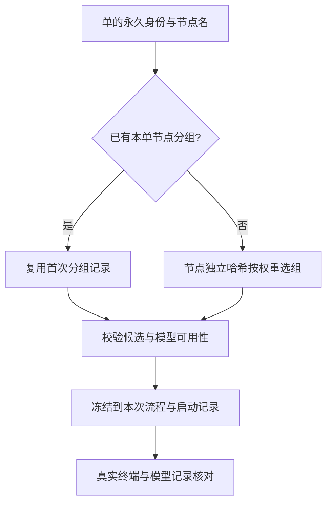

# FLY-2788 节点模型分流 — 实施计划
Issue: FLY-2788 (https://linear.app/geoforge3d/issue/FLY-2788/2787-a分流引擎-每个节点按定稿选模型设计三组-astraopus-55fable-51-各-13实现-opus-55qa-gpt-6)
日期: 2026-09-22
基于: research.md

## 1. 交付效果与范围
新自动派单：工程设计 Astra / Opus 5.5 / Fable 5.1 各 1/3；实现 Opus 5.5 50% / GPT-5.6 Sol 25% / GPT-6 Sol 25%；QA GPT-5.6 Sol 50% / GPT-6 Sol 25% / Opus 5.5 25%；PRD、产品设计、原型、通用单节点 Opus 5.5。设计、实现与 QA 分别分组，同一单同一节点在重派、返工、拉起时保留首次分组。

本计划约束实现与隔离验证；不把代码或配置静态检查冒充生产验证。实现只改仓内代码/候选/隔离测试及 runbook，不改生产 models.json、模板、Lead，不重启。分支已合入 FLY-2775 与 FLY-2766 依赖提交；继续保留它们的模型注册、历史身份、载体兼容修复。若后续同步需要非快进推送，仍走 Lead force-push 授权。

| 范围 | 生效选择 |
|---|---|
| code.eng_design | 新节点加权策略 |
| code/simple_code.qa | 新节点加权策略 |
| code/simple_code.implement | 独立节点加权策略，Opus 50% / Sol 5.6 25% / Sol 6 25% |
| prd.pm / product_design_flow.product_design / prototype.proto / generic.general | registry 默认 opus，显式 pin 到 run |
| 其他自定义图、其他节点、Lead | 保持原行为 |



## 2. 最小数据合同

### 2.1 新规则，不重写旧规则
在现有 `modelSplit` 中增加 discriminant `issue_node_weighted`，旧 parity 与 percentage parser/算法不改变。新规则整体校验失败保留 `runtimeModelSplitStatus=invalid` 并使适用的自动 admission 报 `MODEL_SPLIT_CONFIG_INVALID`，不能降回默认或旧奇偶。这里的“适用”不从已成功解析的 policy 或 legacy `fly2403-v1` 推断，而由本单静态 scope 表直接判定：`code.eng_design|implement|qa` 与 `simple_code.implement|qa`。因此即使 parser 只能返回 invalid、`modelSplit=undefined`，上述五个节点也必须 fail-closed；移除 legacy design 块不能改变这道闸门。

```json
{
  "enabled": true,
  "rule": "issue_node_weighted",
  "balance": {"enabled": false},
  "nodes": {
    "eng_design": [
      {"arm":"design_astra","model":"astra","weight":1},
      {"arm":"design_opus","model":"opus","weight":1},
      {"arm":"design_fable","model":"fable","weight":1}
    ],
    "implement": [
      {"arm":"impl_opus","model":"opus","weight":2},
      {"arm":"impl_sol56","model":"codex","weight":1},
      {"arm":"impl_sol6","model":"sol","weight":1}
    ],
    "qa": [
      {"arm":"qa_sol56","model":"codex","weight":2},
      {"arm":"qa_sol6","model":"sol","weight":1},
      {"arm":"qa_opus","model":"opus","weight":1}
    ]
  }
}
```

使用相对整数权重（设计 1/1/1；实现 2/1/1；QA 2/1/1），不需要浮点百分比恰好加到 100。允许 34/33/33，归一化分母是权重和。只为本单三个随机节点提供规则；不建立任意路由 DSL。GPT-6 Sol 尚不可用时使用独立的 pre-Sol6 policyVersion：实现 2/2（Opus/Sol 5.6），QA 3/1（Sol 5.6/Opus），不产生 sol6 arm，也不写 degraded receipt；GPT-6 上线后的 2/1/1 是另一策略版本，只影响尚未首次分组的单。
校验：对象无未知字段；enabled 必须 true；nodes 恰含 eng_design/implement/qa；每列表至少 2 项；arm/model 非空字符串，arm 与 model 在节点内不得重复；weight 为正安全整数、总和为安全整数；模型须在 workflow surface 可选；按声明顺序构造累积区间。缺模型、错节点、空数组、负数/0/NaN/Infinity/超界权重全部 fail-closed。balance 缺省等同 `{enabled:false}`，只允许布尔 enabled，无其他键。版本不信用户输入，规范序列化 `{rule,balance,nodes}`（节点键固定顺序，臂数组顺序保留）后 SHA-256 得 `fly2788-v1:<digest>`；收据保存该规范内容。

家族名是配置身份，具体 id 是本次运行身份。`astra`、`opus`、`fable`、`codex` 复用已有绑定，其中 `codex` 是 GPT-5.6 Sol；`sol` 在 model-builtins alias 表映射 FLY-2766 注册的 `gpt-6-sol`，不重指旧 `codex`，不引入第二套 alias map。FLY-2769 后续统一 family resolver 时沿用此入口。

### 2.1a 默认关闭的额度平衡预留

按 founder 2026-09-23 05:42Z 与 Lead 对问题 8fdb194a-b174-4aca-95ad-c0c8b2751d80 的答复，本单只增加默认关闭的 `balance.enabled` 策略形状，不接实时成绩或额度源。关闭时选组算法仍只用原始 nodes 权重，哈希输入、bucket 与 arm 结果完全不变；每条 `model_arm_assigned` 的 weighted basis 必须记录 `weightAudit={enabled:false,applied:false,baseWeights,effectiveWeights}`，其中两个权重数组逐项相同。

`balance.enabled=true` 可通过策略形状校验并产生不同 policyVersion，但在成绩相近判据和 Claude/Codex 剩余额度的服务器权威输入接入前，admission 明确报 `MODEL_SPLIT_BALANCE_INPUT_UNAVAILABLE`，不猜数据、不偏移、不静默按 base 权重继续。真正开启、最大偏移量、成绩相近阈值和额度证据合同等 FLY-2789 成绩记录及额度数据就绪后另案决定；不能为了额度把流量塞给成绩较差的 arm。

### 2.1b 与 FLY-2789 的读取合同（逐字对齐）

```ts
interface ScorecardAssignmentReceiptV1 {
  schemaVersion: 1;
  runId: string;
  nodeId: string;
  policyVersion: string;
  arm: string;
  resolvedModel: string;
  assignedAt: string;
}
```

该字段集合位于 `model_arm_assigned` payload 顶层；payload 附本单重放必需的 modelAlias/model/basis，以及 §2.1a 的 weightAudit，不要求成绩读取器理解扩展字段。assignedAt 为 ISO-8601 UTC 服务端时间。设计 arm 枚举：design_astra / design_opus / design_fable；实现：impl_opus / impl_sol56 / impl_sol6；QA：qa_sol56 / qa_sol6 / qa_opus。固定产品默认没有实验 arm，不为它们伪造分组事件；其实际模型由 snapshot/runtime 证明。人工覆盖无自动组事件。老事件保留原 shape，FLY-2789 兼容处理，禁止制造新 schemaVersion 冒充新记录。

### 2.2 稳定键与算法
新增解析上下文 `issueKey`：上游 Linear 返回的该单 UUID；保持小写规范 UUID，不从自由文本猜、不用根 Epic/lifecycle root 代替子单。`issueIdentifier` 只作展示。两个 admission 入口均从可信读取结果传入；没得到稳定 UUID，报 `MODEL_SPLIT_ISSUE_INVALID`，不回退数字后缀。`resolveWorkflowTemplateSelection` 将这个独立的可信字段继续传入 `materializeWorkflowRun`；materialization 只接受 `assignment.basis.issueKey === input.issueKey`，并在存在不同的 `entryRootKey` 时显式拒绝 basis 使用 root key。不得用包含 root 的通用 alias 集合替代这条精确等式。

```ts
const u = Number.parseInt(createHash('sha256')
  .update(JSON.stringify(['fly2788-v1', issueKey, nodeId]))
  .digest('hex').slice(0, 13), 16) / 2 ** 52;
const target = u * arms.reduce((sum, arm) => sum + arm.weight, 0);
// 从左到右累加 weight，返回第一个 target < cumulative 的 arm。
```

不含 execId、attempt、runId、当前时间、版本 digest 或另一节点结果。13 位十六进制数可精确表示；边界左闭右开，u 永小于 1。固定 vector 锁算法。节点名作为哈希输入使设计、实现与 QA 各自独立；列联表只是实现验收的观测佐证，不宣称有限样本证明统计独立。

### 2.3 首次分组与跨运行重用
复用 `WorkflowModelAssignmentReceipt` 与现有 workflow_run_event 表。按 Lead 回复 ed6d8b69-734f-49c5-be11-3c1eaf2094c4 与 FLY-2789 §2.2a，新写 `kind=model_arm_assigned`、`event_uid=model_arm_assigned:${runId}:${nodeId}`，每 run/node 只冻结一次；旧 `design_model_arm_assigned` 保留兼容读取，新运行不双写。所有历史读取/重放按新旧两种 kind 分支；同 run/node 同 kind 重复写按 event_uid 幂等、相同内容返回首次时间，冲突拒绝；若新旧 kind 同时存在，按 FLY-2789 §2.2a 规范化后完全一致只算一次，不同则拒绝歧义。不新建实验表、不重命名旧事件。新 basis 分支含 `rule, ruleVersion, issueKey, issueIdentifier, nodeId, bucket=u, nodes, weightAudit`；顶层保留 `arm,modelAlias,model`，新增必填 `schemaVersion:1,runId,nodeId,policyVersion,resolvedModel,assignedAt`（新规则）；policyVersion=ruleVersion、resolvedModel=model，单一构造函数赋值并校验等值，不容两个独立事实源。assignedAt 为服务端事务提交时间，runId 为当前被提交运行；跨新 run 重用时新的 runId/assignedAt 记录本次 assignment，basis/arm/具体模型仍取首次。FLY-2789 以现有事件读取这些字段，旧 receipt 不造假回填。首次选择在预检阶段只返回无时间的 draft，materialization 分配 runId/时间后形成最终 receipt。vendor/effort 从 frozen node dispatch 核对，不从 receipt 再猜。

新运行 admission 先通过 `workflow_run_issue_alias` 找同项目、同 UUID 的旧运行，读取该 nodeId 已提交的新规则自动分组事件。StateStore 查询同时接收 `projectName` 与 `issueKey`，SQL 必须包含 `run.project_name = ?`；不依赖 Linear UUID 永久全局唯一来代替租户边界。使用首次合法记录，后续记录仅比较 `arm/modelAlias/model` 及 basis 中 `rule/ruleVersion/issueKey/nodeId/bucket/nodes/weightAudit`；不比较 schemaVersion 的表示差异、本次 runId/assignedAt 或展示 issueIdentifier（展示单号更名不影响 UUID 比较）；不得只按 `workflow_run.issue_id` 等值查，因为该列可能是单号。无新规则历史才按当前策略首次计算。旧 parity/percentage 的历史运行仍按自身快照重放，新创建运行进入新规则；这一显式迁移边界不会把旧 A/B 臂误当三臂。

lookup 使用现有 StateStore 参数化查询；按 issue alias 的索引缩小候选，不全表扫 JSON。在 `materializeWorkflowRun` 的写事务内再次核对首次记录：若并发提交已形成不同结果，拒绝 `MODEL_ASSIGNMENT_CONFLICT`，调用方重新选择；不发布错误 snapshot，不最后写入获胜。若历史记录损坏/歧义则失败，不重抽。重派时变更比例或顺序也不移动已有组；改变分组需另案明确迁移，不在本单中偷偷 reset。

新旧 assignment 事件不参与现有四类 telemetry retention 删除，增加回归守卫。模型不再可启动时暂停并报具体不可用原因，不换臂。已经提交的 reservation/retry 用冻结记录，不依赖当前无效 models.json 重新计算；新运行重用旧组仍须通过当前自动候选校验，因此删候选会显式拒绝。

### 2.4 摘要与重放的规范化形态（修复 R3 两项 HIGH）

**receipt 语义摘要。** 在 `workflow-model-assignment.ts` 提供一个新规则 receipt/draft 共用的 projection：

```ts
// Input has already passed rule-specific identity and model validation.
const assignmentSemantics = ({arm, modelAlias, model, basis}) => ({
  arm, modelAlias, model,
  basis: {rule: basis.rule, ruleVersion: basis.ruleVersion,
    issueKey: basis.issueKey, nodeId: basis.nodeId, bucket: basis.bucket,
    nodes: basis.nodes, weightAudit: basis.weightAudit}
});
```

新规则 selectionDigest 的 `modelAssignments` 只取按 nodeId 规范排序后的该 projection；不折入 runId、assignedAt、展示单号或重复的 resolvedModel/policyVersion。首次 draft 与落库最终 receipt 的 projection 必须相同。legacy parity/percentage 保持原 digest 字节算法，不迁移既有 reservation。
必须同时替换 `workflow-template-selection.ts` 初次 selectionDigest（361）、shadow probe refreshedSelectionDigest（455），和 `StateStore.ts` 事务 currentSelectionDigest（35462）三处；只改其中一处仍会拒绝重放。跨新 run 的首次分组等值判定也用此 projection，不能比较整份 receipt。

**冻结 selection override。** 新规则的 snapshot 增一个可选、仅新运行写入的 `modelRouting` 元数据：`{version:1, policyVersion, selectionOverride, requestedOverrideDigest}`。selectionOverride 保存已解析的完整最终选择（含 reason、节点 vendor/model/effort），既含随机节点，也含四个固定产品节点；requestedOverrideDigest 保存本次入口经过授权后收到的显式 override 请求的规范摘要（没有时为固定的空对象摘要），不含自动补值。它不是新的表，也不生成假 arm。元数据放在 snapshot_digest 覆盖范围内；`workflow-run-snapshot.ts` 的 v2/v3 构造与严格读取分支同步支持并逐项验证：每个 override node 的 dispatch 必须与 resolved.nodes 一致，policyVersion 格式正确。旧 snapshot 无此字段仍走旧路径。

`resolveFrozenModelSplit` 对该新 marker：从新/旧事件恢复并验证 assignments，**无条件从冻结 modelRouting.selectionOverride 返回完整 override**；即便零 assignment（prd/product_design_flow/prototype/generic）也返回它，不重新读当前 registry。若元数据中的固定节点缺失/与 snapshot dispatch 不符，拒绝损坏，不能忽略为“无 override”。`mergeAutomaticModelSplit` 对新路径遍历 override.nodes，而非仅 assignments。

不要用冻结 override 掩盖用户改请求：`runs-route` 在跳过 freshMain 时仍计算当前原始 overrides 的同一规范摘要，先与 requestedOverrideDigest 比较；非菜单入口的 input.override 同理。同一个 idempotencyKey 携不同显式 model/effort/reason 或不同节点必须拒绝；相同请求才直接复用原 selectionOverride，**新 marker 的 replay 分支不得再调用 mergeAutomaticModelSplit 把 input.override 合并一次**，否则会重复拼接 reason。首次路径仍合并一次；replay 直接进入使用冻结 override 的摘要计算/resolveReplay。`resolveWorkflowTemplateSelection` 新增原请求 `requestedOverrideDigest` 输入，由 runs-route 在菜单自动补值前从经过授权的原始 req.body.overrides 计算；直接模板入口从显式 input.override（未叠加 automatic/tier）计算，不能用首次自动展开后的 menuTemplateOverride 代替。不会因重放少算 menu override 而丢 pin，也不会把新人工请求当成旧请求成功。

本轮至少测试：首次 K 成功后，仅保留新事件、移动时钟、改变可变模型配置，再重发相同 K，返回原 run/execution/selectionDigest；四种固定产品 shape（零 arm 事件）分别同样通过；更改显式 override 后重发 K 仍失败；初次/刷新/事务三种摘要一致；跨新 run 分组相同但 runId/assignedAt 可不同。由相同 K 的真实 route 回归覆盖，不能只测 helper 返回 arm/model。

## 3. 选择优先级与启动合同

### 3.1 全入口一致
新规则只对上表白名单形状/节点生效，不能靠 `node.modelSplit` 是否存在来开关。registry 的 fly2403-v1 保留给 legacy fallback；新规则从显式 rule+shape/node 生效，即便其旧闸门缺失也不静默跳过。移除生产该段不属于 runbook。

`runs-route.ts` 菜单路径与 `workflow-template-selection.ts` 自动模板路径共享上下文（issueKey、已验证的节点分组策略、当前 model snapshot），共享 resolution；不要另写平行选组器。更新 resolveAutomaticModelSplit 的返回处理：不仅 assignments 非空才携带 override，固定产品节点也必须传选中的具体 vendor/model/effort。所有本单目标自动选择，在新规则激活时显式 pin；不能被 live template 旧具体版本覆盖。registry 里的固定默认只有一份来源。

保留原 recipe/custom-template 行为。已提交运行的 `resolveFrozenModelSplit`、launch resolver 按冻结 basis 校验，不访问当前 arms；旧规则照旧。自动与人工合并 helper mergeAutomaticModelSplit 必须同步改造：先排除已有授权 model override 的节点，再为其余节点生成 assignment；不能让原来的 conflict 检查或 assignments 非空条件吞掉固定产品默认。

### 3.2 人工覆盖的边界
FLY-2769 最新 founder 页面优先于旧产品文档：人工选择可在自动候选外，且持续至撤销。该 UI/持久覆盖服务不在本单实现。
本单保持现有经过 admission 授权的每次 `overrides` 入口：明确 model override 优先于自动选择；workflow catalog 的可用模型校验与 effort 校验仍适用；人工合法 QA 明确使用 §3.3 的节点同家族许可，QA 之外保留其相应守卫，绝不能把 QA 许可用于 design/code review。**本单明确修改 workflow-menu.ts:734–748 的 node.models 边界**：自动选择仍必须命中候选，现有授权显式 model override 可不命中候选；外部裸字段不能伪造持久人工权限。不再以 `MODEL_SPLIT_OVERRIDE_CONFLICT` 拒绝合法人工选择。人工列表外选择必须同时显式提供受 workflow model catalog 支持的 effort；缺 effort 返回可读错误，不为列表外模型制造节点默认值。候选内人工选择延续该候选的默认 effort。只改变已有授权 override 的解析，不增加新 dispatch 身份或权限；FLY-2769 的持久控制/UI 仍不在本单。effort-only override 仍按自动模型并校验选中模型的档位。
人工运行不写假自动 arm 事件，不覆写首次自动分组；现有 override audit 保存具体值/来源。此前未分配自动组时，此次人工选择不铸造组；恢复自动后首次自动 admission 才分配。同一 run 的重试仍用它当时的人工 pin，下一新 run 由现行人工/自动决策决定。统计排除人工 override，不能把人工例外报告为分组不稳定。
本单不建立“永远优先于人工”的自动 pin；FLY-2769 的持久覆盖未来在相同授权层合流。未经授权请求不因该变化得到 dispatch 权限。

### 3.3 候选、effort、同厂商与实际模型
- code.eng_design 增 opus；code/simple_code.implement 补 opus/codex/sol，default=opus。
- code/simple_code qa 补 opus/codex/sol，default=opus。其他原候选不做无关删除。
- 设计节点固定 high，实现节点三臂固定 xhigh，QA 三臂固定 high；`code.qa` 与 `simple_code.qa` 的 opus/codex/sol 每个候选 `defaultEffort` 都必须是 high，不能让同一 qa_sol56 arm 在两种图形下分叉。代码/设计评审固定 xhigh。校验实际模型的 supported efforts，不从另一节点或另一模型复制档位。
- **最新 Lead 裁定 [lead-instruction cc848d61-245f-4dd0-a00b-1c2e317ec249]，founder 2026-09-23 04:15Z：QA 节点整体允许同家族。** 它取代先前 qa_opus/qa_sol 逐臂豁免；删除臂上的豁免字段与具体同模型限制。仍不打开全局 review_same_family_allowed。
- 菜单预检与 StateStore 三条路径都由服务器验证：在本单 code/simple_code 形状中，节点确为注册 qa 类型、decision family=qa_verdict、有 qa_verdict_emitter 且不 produces_output；producer 是同 run 的合法上游 implement。所有有效候选组合都可做 QA，同厂商/同具体模型均允许。人工合法指定 QA 模型也走这个 QA 节点规则，不伪造自动 arm。其他自定义图本单不扩范围。
- predicate 的结构层接服务器 menu/manifest 的节点类型、能力和唯一下游关系，用于尚无 run 的菜单预检；运行层在 admission/claim 接服务器 snapshot/decision contract/runtime/activation 并核对身份，不能要求预检读取尚不存在的 runtime；不接受调用方自报 `allowSameFamily`。admission 与两条 claim 提交路径（StateStore:44019、62262、64979）一致接入。claim 仅 qa_passed/qa_failed；issuer/producer 必须匹配本 run 当前 activation/attempt 的真实 runtime，保留 capability/subject/head 校验；伪造 nodeId=qa 而实际 family=review_verdict 不能通过。
- 同厂商 QA 被接受时，admission 事务写 `qa_same_family_exemption_applied` 审计事件，含 runId,nodeId,executionId,producerExecutionId、policy=fly2788-qa-node-v1、双方实际 vendor/model、assignment 引用（人工则为 override 引用）、reason=founder-approved-2026-09-23T04:15Z、assignedAt；事件 UID=`qa_same_family_exemption_applied:${runId}:${nodeId}:${activationId}`，每个 activation 幂等，并携 producerExecutionId；同一 resident execution 返工后 producer 变化时写新 activation 的审计，不能复用旧 execution-only 事件。事件是审计，不是可提交的权限凭据。
- 不改通用 `sameFamilyReviewSanctioned` 函数，不将 QA 许可传入 review_verdict、codex_approved、design_review_approved。保留所有非本单节点的原策略。
- **代码复审与设计评审必须动态跨家族并钉具体模型。** 路由是按 immutable runtime 的实际 author vendor 定义的总函数，而不是只覆盖六个自动 arm：design 的 Codex 作者（含 Astra、Sol56、Sol6 或合法人工 Codex 模型）→Claude Opus 5.5，Claude 作者（含 Opus/Fable 或合法人工 Claude 模型）→Codex Astra；code 的 Claude 作者→Codex GPT-5.6 Sol，Codex 作者→Claude Opus 5.5。这样自然得到 design_astra→Opus55、design_opus/design_fable→Astra、impl_opus→Sol56、impl_sol56/impl_sol6→Opus55；降级后实际为 Opus 的实现作者仍→Sol56。缺 runtime vendor、vendor 不受支持或目标具体 reviewer 不可用时 fail-closed，不能让 `undefined` 回落 legacy lane；组名只作归因，不能凌驾实际作者模型。
- 覆盖真正 review-request carrier：`bridge/review-request-coordinator.ts` 的 authorFamily/sameFamilySanction 分支，以及 Claude-author 的既有 Codex reviewer lane。对本单新策略的 design/code review，不接受全局同家族应急开关替代跨家族 reviewer；从服务端 execution→run.snapshot.modelRouting 确定本单范围（含无 arm 的人工覆盖），从 runtime 确定实际作者 vendor，assignment 仅辅助归因，选择相反 vendor。任务注入/REQUEST 入口亦须检查该路由，不靠 plan 文案声称“仍跨家族”。旧运行及其他项目既有 emergency 行为保留。无异家族可用容量时等待，不改同家族审。复用既有两条 reviewer lane，不新增 review 服务。
- 源码已证 phases.qa 不被解析，本单不恢复它。以旧 phases.qa=opus-4-6 + 旧模板的冲突夹具验证新 split 仍冻结 Sol/Opus55；若依赖合入后发现新的有效消费者，实施须重新追踪并在 pin 优先合同下修复，不盲删文字。
- 确认 launcher 使用 immutable runtime：StateStore runtime model/vendor/effort → workflow-engine-dispatcher → run-dispatcher generalized dispatch → Blueprint → Claude `--model` / Codex thread-start model。session/run 记录与 pane 实际观察必须一致。

### 3.4 实现 Sol 号池全灭时的显式降级

来源：[lead-instruction 5910e061-52d8-43d9-aea3-4e1d4ee99387]、Lead 答复 9ea553e5-eabc-43f8-a43c-2df24e1b6854 与最新 [lead-instruction 3f349930-92cb-4dda-b660-8a400a515ce1]。仅自动 `implement/impl_sol56|impl_sol6` 在整个 Codex 池权威全灭时降级；首次分组永不改写，实际执行模型为 Opus 5.5。设计/QA Sol 不借用这条降级规则。GPT-6 尚未上线由 §2.1 的 pre-Sol6 策略表达，不属于降级，不写此事件。

**权威证据。** 使用 `packages/teamlead/src/bridge/codex-quota-store.ts` 的 `recordPoolExhausted` / `hasCurrentCapacityGuard` 对应 `codex_quota_capacity_fact`。新增最小只读 accessor 返回经验证的当前 fact（rootKey、generation、evidenceRef、evidenceDigest、observation、observedAt）；复用 `codex-quota/candidate-selector.ts` 的现有 selector 在 admission 时重验：所有注册槽位 school/personal/business 观测新鲜（现行上限 60s）、身份已验、auth 有效、scope 已知、窗口有效且全部达到上限，fact 未恢复、root generation 与当前一致。不能靠 isPaused、quotaLaunchPaused、pool_exhausted 字符串、一个号没额度、配置名、网络错误、unknown/stale 来降级。

**事务边界。** `resolveNodeDispatchAtLaunch` 生成 proposal 但不改 snapshot/assignment；StateStore admission 事务二次验证同一 quota fact 与目标 opus 在当前自动候选内/可启动，随后同时冻结 runtime 的 actual model 与下面的事件。组 receipt 仍为 impl_sol56/gpt-5.6-sol 或 impl_sol6/gpt-6-sol，降级 dispatch 的 effort 取 implement 节点合同 xhigh，并同时验证 node allowedEfforts 与模型 workflow surface。扩展 payload 的 quotaEvidence 旁保存 assignedEffort/actualEffort；原 frozen snapshot、runtime 与 launcher 均为 xhigh。launch 返回 actual Opus/xhigh + degraded 标记，原 assignment.model 与原 snapshot 相等的校验仍保留，另校验 actual 与降级凭据相等。所有新 spawn/replacement 入口（runs-route、workflow-engine-dispatcher、actions retry）走相同 seam，wake 走后述 admission 内部恢复，不在 rework coordinator 调 launch resolver。

不得因 vendor 改为 Claude 绕过既有 casualty / uncertain-installation / credential / TURN 守卫；只绕过有同一 exhaustion fact 证明的 Codex 容量等待，并继续验证其他安全守卫。目标 Opus 候选缺失/不可用则明确失败，不回退默认、不重抽组。尚未获得完整 fact 时正常等待/报错，不自动降级。

**rootKey 载体一致。** 给 `resolveNodeDispatchAtLaunch` input 增可选服务器 `codexQuotaRootKey`。runs-route 复用 auth.codexQuotaRootKey，engine 复用其 options.codexQuotaRootKey；从已持久化 run.project_name 求值，必须在候选 Sol 改为 Claude 之前取 key。给 `createActionRouter` 和 handleRetry 追加同名 provider 参数，并在 plugin 的 `/actions` 与 `/api/actions` 两个挂载同时传 `() => opts?.codexQuota?.rootKey`（与 runs-router 相同）；actions retry 将同一 key 传 resolver 与 admission。缺 provider/错 root/generation 都不授权降级，不接受 request body 提供 rootKey，不读另一个猜测的全局路径。

**wake 写入者。** `bridge/workflow-rework-coordinator.ts` 仍只提交 route-pinned execution/activationMode=wake/attempt/reworkRequestId，不调用 resolveNodeDispatchAtLaunch，保留结构测试禁令。`StateStore.admitGeneralizedWorkflowExecution` 在 wake 分支内部读取既有 immutable runtime，核对 run/node/execution/attempt/合法 rework binding，优先使用其实际 vendor/model/effort，而非 snapshot 的 assigned Sol。若 runtime 是降级 Opus，读取并验证该 execution 原先的 model_arm_degraded 与原 assignment：两者 model/effort/身份一致，才能同事务为本 activation 写新 degraded 事件。缺失/冲突则拒绝；不按现时额度重决策。此 effective dispatch 一致用于同家族校验、quotaPaused 与 resume runtime digest（StateStore:43981/44018/44029/44290）。

**激活与重放。** activation 是一次被控制器正式准许执行的工作回合。事件与 immutable runtime 在 admission 同事务写、先于 spawn；失败回滚不留半条记录。相同 activation 重放复用已提交 actual model/receipt，不再读实时号池；冲突拒绝。只在首次 spawn 或已授权的 replacement 新 execution 确定供应商，不在活着的 Sol 进程里换厂商。已有执行的 wake 按冻结 runtime 继续；若该执行原先降级，每次新 activation 复制其原始已证实降级原因/来源生成本次 receipt，不伪称刚重验了号池。新 replacement execution 可按新鲜 fact 重新决定实际模型；恢复额度可回原 Sol 模型，但 arm 始终保持 impl_sol56 或 impl_sol6。没有安全 replacement 依据就维持原执行/等待，不杀进程造条件。

**与 FLY-2789 对齐的载荷。** [lead-instruction 16a8dafb-af31-4b79-80c2-2ce1b7a52b45] 指定如下固定字段：

```ts
interface ScorecardDegradedReceiptV1 {
  schemaVersion: 1;
  runId: string;
  nodeId: string;
  activationId: string;
  assignmentEventUid: string;
  arm: string;
  degraded: true;
  assignedModel: string;
  actualModel: string;
  reason: 'codex_pool_exhausted';
  degradedAt: string;
}
```

写 `workflow_run_event.kind=model_arm_degraded`，`event_uid=model_arm_degraded:${runId}:${nodeId}:${activationId}`，每 activation 最多一条；assignmentEventUid 精确指向 `model_arm_assigned:${runId}:${nodeId}`。arm 保留 impl_sol56 或 impl_sol6；assignedModel 分别为 gpt-5.6-sol 或 gpt-6-sol，actualModel=claude-opus-5-5；degradedAt 为本次服务端事务 UTC 时间。payload 可扩展 quotaEvidence 与 originalDegradationEventUid（wake 继承时）以便审计；两者由服务端查出，绝不信任 Runner 自报。新事件也排除 retention。

B 只凭该显式事件标 degraded，不从模型不一致推断；一张单该节点存在降级 activation 时，成绩单列 degraded，不混进 Sol 或 Opus 正常组的比较。原始分组事件仍可追溯。代码复审按 actual writer vendor 反转：降级后 Opus 由 Codex 审；如果 Codex 号池仍全灭，代码复审等待额度，不顺带降成 Claude 自审。降级改善实现可用性，不承诺号池全灭时整个流程能立即完成。

## 4. 顺序实施任务（每组遵循失败测试→最小实现→回归→提交）

### A. 基线、模型入口与新策略
1. 核对 FLY-2775/2766 合入 SHA；冲突时保留其历史 pin 和新模型能力。核对新 family 入口 `sol` 不与 FLY-2769 已落地实现重复。
2. 在 `packages/config/src/__tests__/model-split.test.ts` 加新 rule 的固定向量、1/1/1、2/1/1 与 pre-Sol6 的 2/2、3/1，整数边界、全非法输入、节点独立、旧两类 byte-stable 测试，先运行看到新规则尚不支持。
3. 最小修改 `model-split.ts`、`model-config.ts`、`model-builtins.ts` 与 `index.ts` export；新 parser/resolver 在原模块内，不增加依赖/服务/通用框架。`model-config.test.ts` 验证 invalid 状态且不静默 fallback，并覆盖 balance 缺省/显式 false 等价、false 时零影响、true 时无权威输入 fail-closed。`workflow-model-split.test.ts` 用静态 shape+node scope 证明 invalid authority 在 `code` 和 `simple_code` 都拒绝 implement/qa，不能依赖成功 policy 或 legacy design block。
4. 改 `.flywheel/agents/registry.yaml` 候选/默认，`agent-registry.test.ts` 与 seed 验证覆盖所有表内节点；保留 fly2403-v1。无需改生产模板或增添备用实验 registry。

### B. 全入口与不可变凭据
1. 在 `workflow-model-split.test.ts` 写 code/simple_code 与四种产品形状，固定产品默认、实现与 QA 各三臂、pre-Sol6 两臂策略、无候选报错、人工优先、effort-only、QA 节点豁免与反例失败测试。
2. 修改 `workflow-menu.ts` receipt union/resolution；`workflow-template-selection.ts` 和 `bridge/runs-route.ts` 传 UUID/节点组策略，同一次 resolution 贯通固定节点和随机节点。
3. 在 `workflow-model-assignment.ts` 新增按 rule 分支的共享 receipt 验证：重新 hash、校验臂与 modelAlias、ruleVersion、bucket、nodeId 和可信 UUID 一致。入口/StateStore/重放都调用同一验证；materialization 另收独立可信 issueKey 并要求 basis 精确相等、拒绝 entry root 冒充；canonical model 与 frozen dispatch 一致，vendor 也一致。跨 run 查询同时按 projectName+issueKey 限定。
4. 在 B.4 同步实现 §2.4 projection 和 snapshot.modelRouting：初次/刷新/事务摘要三处同源，固定产品 pin 的 frozen override 重放不能丢失。`StateStore.ts` 用现有 alias 与事件表加首次分组读取，并在 materialize 事务校验并发一致性；不增加数据库 schema。按 [lead-instruction bb2b1130-1b31-478b-86c3-0d15e2fc63d5]，同一变更必须迁移 `workflow-template-selection.ts::resolveFrozenModelSplit` 与 `workflow-dispatch-resolution.ts::resolveModelAssignment`：认识 model_arm_assigned，并兼容旧 design_model_arm_assigned，不双写伪造旧格式。两个读取方分别加 **只有新事件** 的 fixture，断言正确返回 arm/model；再测 old-only、语义相同双 kind 幂等、冲突双 kind 拒绝。使用同一 normalization/verification helper 保持 §2.3 与 FLY-2789 的合同一致。
5. 按 §2.4 在 `workflow-run-snapshot.ts` 的构造/摘要/读取增加可选 modelRouting，v2/v3 均覆盖；旧快照仍可读，不拆已有严格校验。snapshot/runtime 保持 pin。新增同 K route 重发和四产品零事件重放测试。

### B2. QA 节点许可、动态跨家族 review 与可审计降级
1. 在 `StateStore.generalized-execution.test.ts`、`StateStore.workflow-claims.test.ts` 和对应 decision submission 测试先加入QA 所有模型组合的同家族许可通过用例；同时加入wrong run/node/producer、伪造 QA 类型、review_verdict/code-review 阴性，人工合法 QA 是阳性。另锁定 `code`/`simple_code` 三个 QA 候选的 effort 全为 high。
2. `workflow-menu.ts` 与 `StateStore.ts` 三处守卫接同一服务器验证的 scoped QA predicate，admission 写去重审计事件；不修改通用 sanction 函数；对新策略 design/code review 在 coordinator 与 Claude-author lane 按实际 runtime vendor 使用上述总函数选择相反 vendor，所有合法人工 author model 也命中具体 reviewer，缺身份/目标则拒绝，不能回落 legacy 或被全局开关改成同家族。
3. 按 §3.4 接线三个 spawn seams 的 root provider、plugin 两 action mounts，并在 admission 内补 wake 既有 runtime/receipt 恢复。`bridge/codex-quota-store.ts` 新增返回当前已验证容量事实的最小 accessor；`workflow-dispatch-resolution.ts` 与 StateStore admission 消费该事实，支持 §3.4 的 actual dispatch 和原组独立保存。无新账号探针、无新故障判定框架。
4. 延伸 `workflow-dispatch-resolution.test.ts`、`bridge/__tests__/actions-retry-route.test.ts` 与 quota store/selector 现有测试：新鲜全灭才降级，stale/unknown/auth bad/一个号耗尽/有可选账号/错误 root generation 均不降级；并发与事务回滚；wake/replacement；actual writer 的代码 reviewer 仍跨家族。
5. 增加 degraded schema/event 幂等、归属验证和 retention 防误删测试；向 FLY-2789 提供完全相同的事件 fixture（包括 assignmentEventUid 与实际 activation），不代实现成绩聚合。

### C. 兼容、CLI 与部署说明
1. 扩展 `scripts/design-model-split.mjs show` 诚实显示三个节点/臂/比例/版本，不把三臂显示成旧 50/50。
2. 旧 `set --codex-percent` 遇新 rule 拒绝并解释，不能整段覆盖清掉 QA。保留旧配置的 set 语法、锁、mode 0600、原子 rename；扩展同一个脚本 `set --policy-file <json>`，与 --codex-percent 互斥。policy-file 只含完整 modelSplit 对象，支持新规则及合法旧规则（用于明确回滚）；在现有 withModelAuthorityLock 内重新读取完整 authority，校验 policy 后只替换 modelSplit，保留 bindings/models/tiers/其他键；复用现有 0600/O_EXCL/O_NOFOLLOW/fsync/readback/原子 rename 流程，不手改文件。锁超时/候选无效均零写入。show 记录前后 policyVersion 和 authority revision；不另建写入服务。
3. 扩展 `scripts/__tests__/design-model-split.test.sh`，覆盖新 show/policy-file set、与 codex-percent 互斥、拒绝 destructive percent set、合法旧 policy-file 回滚、旧 show/set、不安全文件/无效配置零写入、与 fable-model-sync 共享锁的并发保留。
4. `scripts/fly2403-design-model-comparison.sql` 暂保持旧 cohort 报表；新规则不伪装 fly2403/fly2570。不扩展额度看板。若脚本依赖 rule 判别，显式过滤旧规则、未知规则提示不支持。
5. 写本文件 §6 的具体部署/回滚操作清单进实现 PR，不执行生产动作。

### D. 命令与通过标准
以下由实现/QA 执行，设计阶段不声称通过。依赖按仓库 frozen lockfile 安装；每次确认 Vitest 实际运行的文件与测试计数。

```sh
pnpm --filter flywheel-config exec vitest run src/__tests__/model-split.test.ts src/__tests__/model-config.test.ts src/__tests__/agent-registry.test.ts
pnpm --filter flywheel-teamlead exec vitest run src/__tests__/workflow-model-split.test.ts src/__tests__/workflow-template-selection.test.ts src/__tests__/workflow-dispatch-resolution.test.ts
pnpm --filter flywheel-teamlead exec vitest run src/bridge/__tests__/runs-route.dag-entry.test.ts src/bridge/__tests__/actions-retry-route.test.ts src/__tests__/workflow-dispatch-seams.structure.test.ts
bash scripts/__tests__/design-model-split.test.sh
pnpm verify:workflow-seeds
pnpm --filter flywheel-config build
pnpm --filter flywheel-teamlead typecheck
```

通过要求：新增 case 先有预期失败，再全通过；旧 parity、百分比分组、冻结重放、权限/模板选择回归无退化。全局 flag=false 时，本单 QA 节点所有合法组合都通过；design/code review 即使全局 flag=true 也必须选相反 vendor。非本单范围维持原行为。

## 5. 验收矩阵（不以配置文件代替运行证据）

| 编号 | 隔离验收操作 | 必须提交的证据/判据 |
|---|---|---|
| Q1 | 固定 UUID 00000000-0000-4000-8000-000000000001 至尾号 000000000120 的 120 张 code 单走隔离 admission→runtime；另覆盖 simple_code；实现另跑 1000 个固定 UUID | CSV 每行 issueKey,nodeId,runId,execId,ruleVersion,arm,alias,runtime.model,runtime.effort；120 张正式策略期望：设计 Astra/Opus/Fable=44/38/38，实现 Opus/Sol56/Sol6=58/30/32，QA Sol56/Sol6/Opus=56/35/29；pre-Sol6 期望实现 Opus/Sol56=58/62、QA Sol56/Opus=91/29；1000 次实现期望 Opus/Sol56/Sol6=514/240/246。精确匹配预先试算值，报告运行实际计数，不重抽；code/simple_code 同一 QA arm 的 runtime.effort 均为 high |
| Q2 | 每单每节点重派新 run、返工、重拉各 3 次 | 同 K 首次 draft 与最终 receipt 重放的 selectionDigest 相等，四产品零 arm 事件仍保留完整 override/pin，修改请求仍拒绝；跨新 run 只比较 §2.4 语义 projection，不比较 runId/assignedAt；arm 与首次自动记录一致；UUID/单号入口等价；已有组在 policy 顺序/比例改变后不变；reservation 在当前配置损坏时仍能重放 |
| Q3 | code 子集设计×QA、设计×实现、实现×QA 三张 3×3 列联表 | 各表实际计数，每个设计组都出现多种实现/QA，每个实现组也出现多种 QA；另以确定性构造的 issue-only 错误实现作为负例，断言不会与真算法同结果。不得声称样本分布“数学证明”独立 |
| Q4 | 隔离环境真派一单，走完整 implement/QA，并各选一条 Sol QA 与 Opus QA 覆盖 | 实现与 QA 真 pane 首屏图、启动输出、runtime.model/vendor/effort 与 run assignment 绑定；至少一条完整路径满足 Lead 真机标准，其余 arm 用真实载体补证。设计三臂与产品四节点也需各有真实 run/session 模型证据 |
| Q5 | 从某节点候选移除其选中模型；全局目录仍可用 | 自动派单 `MODEL_NOT_ALLOWED_FOR_NODE`，reason 带节点、目标模型与 legal 列表；无 runtime/无 pane/不回退。人工经原授权入口显式选同模型并提供受目录支持的 effort 是单独阳性；验证 node.models 前置校验已按 §3.2 拆成自动/人工两支，未授权请求仍拒绝 |
| Q6 | 旧 phases.qa+旧模板、未知 rule、invalid authority、缺 UUID、根 Epic UUID 冒充子单、伪造 bucket/arm/node/UUID、重复/矛盾事件 | 旧死键不覆盖 pin；invalid authority × `simple_code.implement/qa`（以及 code 对应节点）必须 `MODEL_SPLIT_CONFIG_INVALID`、零 runtime，且结果不依赖 legacy design block；basis.issueKey 不等于可信子单 UUID或等于不同 entryRootKey 必须拒绝；其余非法状态清楚拒绝。并发首次 admission 不产生两个不同组；同 UUID 不同 project 不跨租户复用 |
| Q7 | 留旧 parity/percentage 已提交 run，再启用新 rule、改模板/别名 | 旧 run 按原具体模型启动；新 issue 才用新规则。自动运行失败不因换模型自行恢复 |
| Q8 | 全局 flag=false/true；所有 3×3 实现/QA 组合；人工 override 后撤销 | 合法 QA 节点所有候选组合均通过，同家族留审计；错误节点类型、review_verdict、另一 producer/run 拒绝；人工合法 QA 通过但记录与自动组隔离，撤销恢复既有组 |
| Q11 | 动态跨家族评审 | design_astra→Opus55、design_opus/design_fable→Astra、impl_opus→Sol56、impl_sol56/impl_sol6→Opus55 六条独立 routing 测试；另覆盖 design 人工 Sol→Opus、implement 人工 Fable→Sol56 等非 arm 合法候选，证明按 actual runtime vendor 的总函数仍钉具体 reviewer；降级实际 Opus→Sol56；缺 runtime vendor/未知 vendor/目标不可用、错误同家族 reviewer 与全局开关尝试均拒绝且不能回落 legacy；所有 review effort=xhigh；实际 review job 的作者/评审 model/vendor 字段证明 |
| Q10 | implement Codex 两臂全灭降级与故障阴性 | 新鲜全槽位权威证据→实际 Opus，原 arm 不变，degraded receipt 与 runtime 同事务，实际 effort=xhigh；覆盖三个 spawn入口（含两 action mounts/root provider）和 rework/wake admission 内写 receipt，effective dispatch/暂停判断/resume digest 全一致；pre-Sol6 不写 degraded；unknown/stale/单号没额/人为暂停不降级；重复 activation 幂等；wake 保持载体，replacement 合法恢复；成绩不计正常 Sol/Opus 组，代码 review 等待 Codex 也不自审 |
| Q12 | 额度平衡开关 | 缺省与显式 false 的 policyVersion/120 固定向量相同；每条 assignment 的 base/effective 权重逐项相同且 enabled/applied=false；true 使用不同 policyVersion 并报 MODEL_SPLIT_BALANCE_INPUT_UNAVAILABLE，不产生 assignment/runtime |
| Q9 | Lead 范围与保留证据 | Raya/Tadashi/Sonnet Lead 配置与 launcher 未被本 PR 改动；assignment 不被 retention 删除；现有 review gate 与权限回归通过 |

Q1 使用固定向量的已知精确计数；区间只用于额外真实随机样本的诊断，不把正确的确定性实现因抽样波动判失败。未命中固定期望不调整 seed 重抽，保留计数调查。如果无法取得 Q4，QA 明确缺口，不能把 mock/源码通过写成真机 PASS。隔离测试使用专用配置、数据库、HOME 路径和已授权载体，不改生产、不重启生产服务；准备不了隔离真派条件时报告 Lead，不能换成纯函数假验收。

## 6. Lead 切换 / 回滚 runbook（执行权不在本设计节点）
1. 校验部署包包含 FLY-2775 与 FLY-2766 的合入提交，Claude/Codex 载体识别目标模型；用实际解析打印 astra→gpt-6-astra、opus→claude-opus-5-5、fable→claude-fable-5-1、codex→gpt-5.6-sol、sol→gpt-6-sol。任一不符停止。
2. 确认隔离 Q1–Q11 完成，核验 QA 节点许可生效且无新全局放宽；确认代码复审仍走跨家族，验证实现降级的权威 fact/accessor 与事件；号池全灭不承诺代码复审也能完成。列出现行人工覆盖，不撤销；有覆盖的 run 单独标注不计自动比例。
3. 记录生产 model authority 文件的内容摘要、权限、前一份配置和 template revisions。先确认独立 updater 已部署本次兼容二进制、Bridge 健康信息 buildSha 与目标一致，并用部署目录中的 show/parser dry read 证明认识新规则；旧二进制仍运行时绝不写新 rule。之后只由 Lead 执行 `node scripts/design-model-split.mjs set --policy-file <已审核的新split.json> --config <生产authority路径>`，用同一锁/原子写流程把旧 codexPercent=100 替换为 §2 新 rule；保留其他 bindings/tiers/models。检查兼容 show 输出三节点，不出现旧全量覆盖。
4. Lead 经模板正式发布流程将相关固定默认更新为家族名；不直接写生产数据库。保留 fly2403-v1；Lead 可删除已确认无消费者的 phases.qa 死键作清理，不能将这一步当生效证明。无需本 Runner 重启服务；部署仅独立 updater 窗口执行。
5. 观察新 run 的 snapshot、assignment、runtime 与实际首屏，确认模板未改写 pin，记录配置生效时间。旧 run/首次分组保持原样。
6. 回滚经同脚本 `set --policy-file <备份的旧split.json>` 与正式模板发布流程恢复前一 authority/模板 revision 对未来未分配单的选择；已冻结运行和首次分组不重算。不要降级到不认识新 receipt 的旧二进制；保留兼容 reader 或等待已分配运行结束。只有实现 impl_sol56/impl_sol6 的已证实 Codex 号池全灭可走 §3.4 降级；GPT-6 未上线改用 pre-Sol6 policyVersion，其他不可用状态暂停受影响新派单交 Lead 决策，不静默选另一模型。

7. 在飞跨家族评审的容量等待：Lead 从现有 review job 的 requestId/questionId/作者 runtime/目标 reviewer vendor/等待原因定位，区别容量等待与进程故障；进入容量等待时复用现有报告通道记录一次含具体 job 的通知，保持 gate pending、不可 fail-open。每 30 分钟由 Lead 值守复查或按号池恢复事件处理，不造新轮询服务。恢复所需家族的既有账号容量（等待 reset，或仅由有授权的 operator 修复可用账号）后，经既有 review retry 路径恢复同一 request/冻结 artifact；已终止或 reviewer 明确 no_verdict 才开新 gate，artifact 变更必须新 gate。无需改派作者/改组/重启 Runner；若长期无可用容量，由 Lead 向 founder 报该具体 gate 并选择继续等或明确取消该单，不代授同家族 review 豁免。配置回滚不能解开既有冻结 reviewer 要求，runbook 明示这一限制。

## 7. 风险、评审与交接
最新决定来源：[lead-instruction 3f349930-92cb-4dda-b660-8a400a515ce1]：实现为 Opus50/Sol56 25/Sol6 25，QA 为 Sol56 50/Sol6 25/Opus25；评审按实际作者模型跨家族且钉具体 reviewer model，所有 review 为 xhigh。旧评审 1d58d36b 对旧稿不构成这次变更的批准。

最大风险：分组正确但启动被覆盖；QA 特例只通过启动却在 claim 被拒，或外溢到代码复审；新规则 parser 正确但重放拒绝；单号/UUID 导致分组漂移；旧 CLI 抹掉 QA 策略。上述每项都绑定验收用例。

不做：价格研究、额度成本归因表、实验自动停止、人工覆盖管理 UI、Lead 模型迁移、全局 unknown-key 清理、registry 重构。此单的数据扩展限 receipt union 与新 snapshot 的可选 modelRouting 元数据，不新增表。

评审：本次模型比例、pre-Sol6 和额度平衡修订必须重新通过显式 review_design gate + request-review，获得有效 reviewVerdict=APPROVED 后继续相关实现。blocking finding 修复后开新 gate；非阻塞 advisories 报 Lead。实现完成还须单独 code review、PR 与 injected completion；不等于 QA 或生产效果已验收。

### 评审需重点核对的新增边界
策略字段入版本摘要、draft→materialized receipt 时序、跨运行复用只比较 basis/arm/model 不比较本次 runId/assignedAt、两条 QA claim 提交路径的节点限定许可、代码 review 不继承豁免。FLY-2789 成绩读取接口由 Lead 回复确认，额外记账功能不并入。

## 最新修订记录
实现与 QA 三臂、pre-Sol6 策略、QA 节点许可及 activation 级降级按最新 Lead instruction 修订；新旧 assignment 双事件规范化去重与 FLY-2789 保持一致。旧评审通过也不能代替这轮重审。

最新权威：[lead-instruction cc848d61-245f-4dd0-a00b-1c2e317ec249] 取代逐臂同家族豁免，QA 节点整体允许；[lead-instruction 3f349930-92cb-4dda-b660-8a400a515ce1] 取代旧 75/25 两臂与泛化 reviewer 家族描述。§2.1、§3.3、Q1、Q10、Q11 为正式合同。
