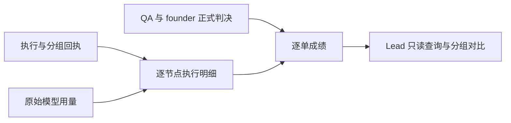

# FLY-2789 节点成绩记录 — 实施计划
Issue: FLY-2789 (https://linear.app/geoforge3d/issue/FLY-2789/2787-b成绩记录-每张单每个节点记下用的模型组别并记-qa-是否一次过founder-打回次数额度花费耗时按组汇总每张一次过-qa)
日期: 2026-09-22
基于: research.md

状态: R3有效APPROVED（e602258c-2f53-4466-a267-bc6a7ee91ccd）；按Lead答复4aba8512-26c5-4b47-b66f-493cdd6ecdcb收尾修正三处非阻塞示例/旧措辞，不重开评审。仅设计，未实现、未生产验证。

## 1. 给 founder 的说明
每次干活留下“哪张单、哪个节点、哪次执行、实际模型、原分组、用量与时间”的可核对明细；Lead 用一条只读命令比较每组产出一次过 QA 单子的投入。换体不丢旧账，重发不多一笔；没拿到的账明确显示缺失。

不新增管理页面、不改分流、不改生产配置、不重启。设计三组、实现两组与 QA 两组是三张独立对比表，同一单可各出现一次，不能把三表相加。founder 2026-09-23 新要求：实现组由 A 分配 Opus 5.5 75%（impl_opus）/ GPT-6 Sol 25%（impl_sol）；B 只读真实回执，不实现比例选择。额度降级单单列，不进入原组。



## 2. 计量合同 v1
### 2.1 身份与覆盖
- 单的主键 `(project_name, canonical_issue_id)`，以 workflow_run 与现有 issue_alias 正规化；输出可读 identifier。跨 run 重派仍只是一张单，列全部 run_ids。
- 执行行主键 `activation_id`，引用不可变 workflow_execution_binding，保留 run_id/node_id/attempt/execution_id/mode。attempt 是返工轮次，execution 是载体身份；换体可能同 attempt，不是返工次数。
- 每个执行节点（design/implement/qa/generic）均记账；gate 为非模型节点，明确 non_executable，不能伪造模型或零 token。
- 观测范围为新版本记录启用以后；历史只从确切旧证据补齐。历史缺模型/分配/原始用量显示 unknown/incomplete，不把未知填零，不把旧数据静默排除。
- 输出 coverage：eligible/complete/partial/missing 数量、缺失原因、source watermark（已读到的来源位置）、as_of。所有行包括进行中、失败、取消和被替换执行。

### 2.2 模型与分组
- `launch_model_id/vendor/effort` 取 immutable runtime；`observed_model_ids` 取实际 Claude message.model 或 Codex exact turn_context.model。二者同时列，别名不得伪装精确 id；中途模型变化逐来源行保留，执行聚合列 model set/mixed。
- 分组身份为 `(axis, policy_version, arm_id)`，axis=design|implement|qa；标签仅展示。已有 `design_model_arm_assigned` / `WorkflowModelAssignmentReceipt` 是来源，不复制其选组公式。
- Lead 已在问题 b73345b0-9966-4203-ab26-113e4fe3b657 同意由 B 定读接口、A 按此写。A 未落地时支持旧 policy/version 与无分流；A 的设计三组/实现两组/QA两组 id 是 opaque arm，不在 B 枚举或复制分流算法。
- 新 admission 在同一事务明确冻结 assigned/unassigned 状态；在完整来源查询中没有 receipt 的记 unassigned（Lead 指定）。来源不可读/归档缺失与无效/冲突 receipt 为 unknown；旧策略单独显示，不混入新设计三组/实现两组/QA两组。
- 节点级分组取本节点分配；implement 按其真实分组记账；generic 无分流亦照录。逐单在每个 axis 若所有相关 run 的分配一致则归该组；全部明确无分流归 unassigned；发生不同 arm/policy、或 assigned 与完整证据确认 unassigned 并存，均归 mixed 并列组成；缺证据归 unknown，列出组成。不把整张单复制到两个组。
- query 不能修改 assignment、重算随机/比例分流、用当前模板覆盖历史、从模型推组。

### 2.2a 给 2787-A 的冻结读接口
以现有 WorkflowModelAssignmentReceipt 为基础，新增只读规范化类型（位于已有 `packages/teamlead/src/workflow-model-assignment.ts`，A/B 共用纯读适配；不改旧 type 的已有必填字段）：

```ts
type ScorecardAssignmentReceiptV1 = {
  schemaVersion: 1;
  runId: string;
  nodeId: string;
  policyVersion: string;
  arm: string;
  resolvedModel: string;
  assignedAt: string; // UTC ISO timestamp
};
```

A 将上述 payload 以 `model_arm_assigned` 写到现有 workflow_run_event，稳定 event_uid=`model_arm_assigned:${runId}:${nodeId}`，绑定 event.run_id/node_id。以 `(runId,nodeId)` 一次冻结，重派/返工/换体继承；相同 key 相同内容重放 noop，冲突拒绝。axis 来自该 run pinned snapshot 的 node.type（design/implement/qa），不相信模型名或调用方 axis。policyVersion 是完整策略版本，arm 是稳定组 id，resolvedModel 是解析后的精确启动 id；assignedAt 取服务器首次写入时间。模型实际观测仍另列，不覆盖分配模型。

B 兼容读取旧 `design_model_arm_assigned`：runId/nodeId/assignedAt 从 event envelope 的 run_id/node_id/at；policyVersion=basis.ruleVersion；arm=payload.arm；resolvedModel=payload.model。旧 at 的 `YYYY-MM-DD HH:mm:ss` 先严格识别为 SQLite UTC 格式，再标准化 `YYYY-MM-DDTHH:mm:ss.000Z`；已经合法的 ISO UTC 保留。非法时间标 unknown，不按本机时区猜测；同秒可并列，排序以 run seq/event_uid 决定，assignedAt 不作唯一键。保留 event_uid/digest；新旧两种事件同时出现且规范化 payload 完全一致只算一次，若不同则 invalid_assignment，不择一。A 的写入与运行 snapshot 固定分配应同一事务，先于 admission。跨 run 的继承必须重新物化新 run 的规范回执，不能仅口头称为继承（详见 §2.2b.1）。B 不实现 A writer；B 的 reader fixtures 必须包含设计三组、实现两组、QA两组、无分流及旧 receipt。A 上线前可完整记录 unassigned。

### 2.2a.1 A/B 消费者闭包与分配一致性（R1 HIGH 修复）
选择 **A 在同一个实现变更迁移全部消费者**，不要求伪造旧 parity/percentage payload 来双写。A 的 writer 改为 model_arm_assigned 时，必须同步 `packages/teamlead/src/workflow-dispatch-resolution.ts:23` 的 resolveModelAssignment 与 `packages/teamlead/src/workflow-template-selection.ts:111` 的 resolveFrozenModelSplit（重放入口在 :324），统一使用上述纯读适配并保留旧事件兼容及身份/模型校验。三个节点类型都要测试首次 start、同 idempotency key replay、admission、换体与 wake 使用同一冻结分配；不能只迁移 B 报表 reader。A 的交付证据必须有“仅新事件无旧事件”的 start replay 测试，证明 resolved dispatch 仍等于 receipt.resolvedModel。该改造属于 A，不由 B 越界修改分流。

B 对每条 activation 用 binding.execution_id 关联 immutable workflow_execution_runtime（不信其旧 attempt），校验 assignment.resolvedModel == runtime.model。不同且无有效 degraded 回执时标 `assignment_not_honored`，保留 assigned/launch/observed 三栏及原组；从原组比较中剔除并作为单独异常 bucket，不能伪装正常该组成绩。若已验证的 observed exact model 与 launch exact id 不一致，同样显示 model_mismatch 并使分组可信度为异常；别名未解析/无 observed 证据则标 missing，而非假判一致。

有效 degraded 回执允许 runtime.model == degraded.actualModel，原 assignment.resolvedModel 必须 == degraded.assignedModel，归 degraded 集合；若回执声称 actualModel 与 runtime 不符则 invalid_degradation，不能免检。同单跨 run 任一分配一致性失败，三个维度都进 assignment_not_honored 异常集合，统计全单但不污染正常原组。原组+degraded+异常+mixed+unknown+unassigned 单数守恒。B 先部署时仍可记录无分流；有新回执却 A 消费者未迁移时 B 诚实暴露异常，不篡改 dispatch 自行“修复”。

### 2.2b 额度降级读接口（Lead 冻结，A 写 B 读）
依据 Lead 指令 fa066f60-0a86-46f4-99a0-1a14c956fe79 和答复 b4105797-3065-4798-b529-344d588bec94；核心 assignment receipt 不变。A 同样写 `workflow_run_event`，kind=`model_arm_degraded`，event_uid=`model_arm_degraded:${runId}:${nodeId}:${activationId}`，每 activation 最多一条：

```ts
type ScorecardDegradedReceiptV1 = {
  schemaVersion: 1;
  runId: string;
  nodeId: string;
  activationId: string;
  assignmentEventUid: string;
  arm: string; // 原组，不改
  degraded: true;
  assignedModel: string;
  actualModel: string;
  reason: 'codex_pool_exhausted'; // v1 最小枚举，扩展须由 A/B 同步版本
  degradedAt: string;
};
```

仅服务端可写。B 核验 envelope 与 payload run/node 相同、activation 属于该 run/node、assignmentEventUid 等于原 `model_arm_assigned:${runId}:${nodeId}` 且该回执存在，arm/assignedModel 与原分配一致，actualModel 为已解析精确 id，degradedAt 为服务器时间。相同 key/digest 重放 noop；冲突、悬空或不支持版本标 invalid_degradation（覆盖 unknown，不放回原组）。不能仅因 launch/observed model 不同推断 degraded，也不把 arbitrary runner text 当标记。

逐节点明细保留原组、assignedModel、actualModel、降级原因及原事件编号。逐单只要任一 run/activation 有已接受降级回执，该单在 as_of 之后归入独立 `degraded` 集合；在三个 axis 的原组统计中均排除（降级会影响整单后续 QA 与总投入）。degraded 单表保留全单成本、首过、founder 次数和时间，以及 original_groups、degraded_activations；不得消失、拆成两单或同时进原组。判定优先级 invalid/unknown → degraded（须actualModel一致）→ assignment_not_honored → mixed → assigned/unassigned。重派/换体不清除同一单的历史降级；恢复原模型也不洗回原组。as_of 早于降级事件时按当时已知事实查询，明确历史观测版本。

### 2.2b.1 新 run 恢复与旧回执过渡
现有 `StateStore.ts:37362,37409` 的 quota recovery 会建立新 run，并以 `quota_recovery_reserved.payload.sourceRunId` 留原 run 身份。A 必须在 R2 的 admission/降级前，把 R1 冻结分配原样继承为 R2 的 `model_arm_assigned:R2:node`：arm/policyVersion/resolvedModel 不重算，assignedAt 记录这条新 run 分配写入时刻；原始分配时间与 sourceRunId 保留在现有恢复事件供回溯。B 校验同 issue/project、恢复事件链接与两端分配一致，拒绝跨 issue 或任意自称继承；成本同时包含 R1+R2，不因 R1 terminated 丢弃。

过渡中的同 run 只有 legacy `design_model_arm_assigned` 时，A 在写降级前，先通过 §2.2a 适配器规范化为同 run 的 canonical `model_arm_assigned`（原 arm/model/policy/time 不变），新旧语义相同由 B 视为一份。这样继续保持 Lead 冻结的 assignmentEventUid 指向 canonical uid，不扩大该权威引用的接受范围。若旧数据无法完整标准化，明确 invalid_degradation；不能猜补模型或绕过来源检查。A 新写路径必须覆盖该过渡，不以 B fail-visible 当作正常验收。

E 的唯一数值与时间fixture见 §7：quota recovery_reserved 创建 R2（sourceRunId=R1），R2 继承分配并降级；run仍2、issue仍1、degraded仍1。此处不再维护第二份数字。重放 recovery/assignment/degraded 三种事件都不变。另测 legacy assignment 转canonical后降级有效；不写 R2 assignment 或伪造 sourceRunId 时明确拒绝。A 同时迁移 recovery producer，不由 B 创建生产回执。

### 2.3 QA 与 founder
- QA 来源为 `workflow_claims(decision_kind='qa_verdict', predicate IN ('qa_passed','qa_failed'))`，按 `server_seq` 找这张单所有 run 的最早已提交判决。
- `qa_first_pass=true` 当第一条为 pass；fail 后 pass 仍为 false；换体但尚未有判决不算 fail。后续 founder 打回重测不改变最早首过事实。
- 历史事实读取不套当前 claim TTL / revocation 过滤：它们控制现在能否 ship，不抹掉曾经通过/失败。只有实际事务提交的 claim 才是事实。
- 没 verdict：pending；明确 QA exempt 或无需 QA：not_applicable；已知历史不完整：unknown。均不得当 pass/false 混进率的分母。
- founder 次数 = distinct `workflow_founder_gate_verdict.verdict_id`，条件 `verdict='rework' AND founder_authored=1`。保留 source_event_id、question/head、author evidence 摘要；不用 rework request authority 计数。
- Lead 携真实 founder message 转派可计一次；engine 沿链复制 authority、Lead 自主返工、机器人文字、失败请求均不计。

### 2.4 Token 与时间
- 单位固定 `provider_total_tokens_v1`，只是 token 数，不是订阅账单或账号额度百分比。Claude=input+output+cache_read+cache_write；Codex=input+output，cached_input 是 input 的子集，reasoning 是 output 的子集，均不再加一次。保留原始分项、供应商与 normalizer_version。
- 不把现有 costMicroUsd 相对权重当付费金额；不把多人共用账号的额度差值归因到单。跨供应商 token 可按明确上述计数定义显示，但不能宣称同等货币成本；同时输出 vendor 分项。每个组行必须带 vendor_mix（vendor/observed model/token 分项）、unit=provider_total_tokens_v1、cross_vendor_unit_incomparable；报告内存在不同供应商的比较或同组混供应商时 flag=true，text 显式提示“跨供应商计数不可视为等价额度”，不按此值给跨供应商优胜排序。单一供应商对比 flag=false 仍保留非账单声明。
- 按节点/单 sum 每个唯一 usage source record 的 delta 一次；包含失败、返工、替换前的消耗、完成命令后同原生 turn 的迟到消耗。
- 新记录的节点耗时为 activation admission 到该 activation 首个完成/失败/替换关闭的墙钟时间，服务端时间为准，明确包括该次执行内等待；不是推理耗时。resident 两次 activation 之间 park 不计入任一 activation。
- 每张单分别输出 `node_work_ms=sum(closed activation intervals)`（可能并行累计）、`elapsed_ms=first admission → latest terminal close`（端到端墙钟），绝不将两者混称。
- open/缺关闭回执 interval 输出 null + 当前 elapsed_so_far；负时间、重复 close 冲突显式错误。换体关闭旧 activation 用已接受 replacement 事件时间，不修改旧 node.started_at 假装真实进程起点。

### 2.5 汇总公式与时间窗口
默认以 issue 首次 admission 时间属于 `[from,to)` UTC 的单为固定 cohort（比较集合），跨窗口的所有后续记录读到 as_of；不能截断节点 token 后还用全单首过结果。返回 cohort_policy 和 as_of。

每个 axis/group 输出：
- issue_count：本组全部 distinct 非降级单；另外提供全局 degraded_count 与降级明细。降级集合也使用相同公式单独展示，不合并回原组。每个 axis 的所有 bucket（含 degraded/mixed/unknown/unassigned）单数之和必须等于全局单数。
- terminal_count 基于本组单集合；issue_count 为全部 distinct 单；terminal_count、open_count、unknown_count 单列。terminal 由全部该单 run 当前均已终态判定，并显示状态组成，不把 phase done 当 issue terminal。
- 每个正常 arm 行并列 `assigned_issue_count_before_exclusions`、`degraded_from_this_arm` 和 `degraded_from_this_arm_rate=count/before_exclusions`（零分母null）；按可验证 original_groups 每单每axis最多计一次，分母包含后来因降级移出的单，并包括mixed/异常时明确可证明的原始分配，重复run不增加。该字段是剔除说明，不加回正常成绩分母或token分子；三维均展示，原因细节指向实际降级节点，不能误称三节点都发生额度耗尽。读者一眼能看到“原分40单，降级移出12单、mixed移出2单、assignment_not_honored移出1单、正常25单”，不得只有全局degraded_count。
- qa_first_pass_rate = 首次 verdict 为 pass 的单数 / 有已接受首个 verdict 且历史完整的单数。展示分子分母，包含尚未 ship 但 QA 已出结果的单。
- founder_reject_rate = 至少一次真实打回的单数 / 有 founder_authored 正式判决的单数；另列尚未受审数量。
- 成本主指标 `tokens_per_first_pass_issue` = 可完整计量且已终态的全部单总 token / 同一集合中首过 QA 的单数。失败/取消单的已花投入保留在分子，不只看成功样本。
- 辅助指标 `mean_tokens_of_first_pass_issues` = 该集合中首过单的 token / 首过单数；明确名称避免与主指标混淆。
- 若组有终态单用量缺失，整组主指标置 null；同时给 complete_subset_estimate（标注覆盖 n/N），不能以完整子集冒充整组均值。零首过分母结果 null（不是 0/Infinity）。部分未终态的单单列 pending spend，不混入终态指标。
- 平均耗时按同一终态集合算 mean(node_work_ms) 与 mean(elapsed_ms)；缺时钟边界则对应整组指标 null，并列覆盖子集。
- 首过证据 unknown 的终态单会使成本主指标 null；QA exempt 明确不贡献首过分母，已花成本仍在总投入分子。Lead 可用 CLI `--qa eligible` 另查仅需要 QA 的集合，输出必须显示过滤。

## 3. 最小数据增量（复用 outcome 表，不新增计数器）
新增 `packages/teamlead/src/workflow-scorecard.ts`，容纳建表、边界校验和纯查询；不要新建一套服务层框架。

| 表 | 键与字段 | 写入边界 |
|---|---|---|
| workflow_scorecard_activation | PK activation_id FK binding；assignment_state、axis、policy_version、arm_id、assignment_event_uid/digest；admitted_at；closed_at/close_event_uid/close_kind nullable | admission/close 事务内 savepoint 尝试写；会计失败回滚 savepoint 后仍提交权威事件，缺行即可持久推导 missing |
| workflow_scorecard_turn | PK `(vendor,native_session_id,native_turn_id)`；execution_id、activation_id nullable、attribution_state、start/end 来源回执；source_generation、start_offset、end_offset | 原生 turn start 冻结身份；held 时 activation=null，记 issue overhead；已冻结归属不可随当前 TURN 更新 |
| workflow_scorecard_usage | PK `(vendor,native_session_id,source_generation,source_record_id)`；provider_request_id、native_turn_id、observed_model_id、raw counters、normalized_delta、source_digest、at、source_offset | 绑定来源 importer；完整校验后幂等事务写入 |
| workflow_scorecard_cursor | PK `(vendor,native_session_id,source_generation)`；execution_id、canonical source locator、committed_offset、source fingerprint、coverage/error/final_watermark | 与该批 usage 同事务推进；持久 session 关联先于模型启动/ready 后首个 turn |

四张窄表只保存本任务必需事实。run/node/attempt/model 启动值从现有 immutable 表 JOIN，不重复存一份可漂移词汇；QA/founder 直接读已有表。原始证据只留 token、模型、身份、偏移及摘要，绝不复制 prompt、key、正文、源码或凭据。

参数化 SQL；Zod 严格验证 provider enum、整数非负/安全范围、UTC、身份长度与已注册关系。source 文件必须位于服务端已绑定 provider home、真实路径验证拒绝 symlink 越界，不接受 runner 指定任意文件。每条 usage 必须能沿 session → execution → activation → run/project 证明归属，错误行隔离并把 coverage 置 partial。

## 4. 写入与恢复路径
### 4.1 激活与用时
修改 StateStore admission（44139）及既有 accepted completion、failure、proven-dead replacement 事务：在局部 savepoint 写 activation snapshot 或首个 close。完全相同重放返回原记录；相同主键不同字段拒绝该会计写入，不能 INSERT OR IGNORE 吞冲突。会计失败仅 rollback to savepoint，保留主事务的 binding/runtime/权威事件并正常推进工作流。读取器 LEFT JOIN 权威 activation 集合，缺少 scorecard 行或 close 与权威事件不一致时必标 accounting_unavailable；这是一份可从持久事实重建的缺账，不需要再写一张也可能失败的错误表。已有原始事件支持恢复补齐。底层主DB自身失败仍依既有事务失败路径处理，不掩饰它。所有 source_event_uid 绑定既有事件。
未启用/不支持分流也记录 unassigned；非工作流执行不强凑 activation，返回 unsupported_legacy 并保留可识别 issue 用量缺口。

### 4.2 Claude
- `TmuxAdapter.ts:499` 分配 session UUID 后、spawn 前，持久 exact execution/session/source 根绑定，启动失败也有可查记录。
- 只扩展 `packages/claude-runner/src/TmuxAdapter.ts:1305` 的每次 launch 内联 `--settings`（经 `packages/config/src/non-lead-forbidden-plugins.ts:53` 的 buildNonLeadClaudeSettings 合并），只加入 UserPromptSubmit 的 runner-scoped 会计标记；不在 inline settings 中声明 Stop、StopFailure 或 PostToolUse。不改 `~/.claude/settings.json`，不要求重跑 setup-flywheel-hooks，不挂到 founder/Lead 交互会话；无 exact execution/session context 则该 hook no-op。UserPromptSubmit hook 只通知既有已授权 Bridge callback，脚本随正常发布包分发，无独立 operator 配置步骤。现有全局 Stop/StopFailure 仅复用已有注册，不新增 inline 同名事件；PostToolUse inbox-check 注册完全保留。UserPromptSubmit 记录最小 session/turn-start 标记，初始提示、后续 wake 与自动继续都必须被集成测试覆盖。标记使用原生 user UUID/受控 transcript offset，不能靠提示文本匹配。
- 复用 `scripts/hooks/runner-stop-notify.sh:122` 与 `commands/runner-stopped.ts:188` 的 Stop 原生 transcript 入口通知 importer；失败路径由 adapter terminal/recovery 的尾部补读负责（不依赖已知未触发的 global StopFailure）；只通知路径不能当权威，服务端核对已绑定 session。
- usage 的 source_record_id 明确定义为原始完整 JSONL 记录的起始 byte offset（十进制字符串），不是 requestId；source_generation 用已持久 source fingerprint 标识，同 generation 同 offset 不同 digest 是篡改/冲突。provider_request_id 另列，用于同一请求多次观测归并；每个观测 append-only，重复复制的相同 counters 不新增消耗。
- 解析 exact session assistant requestId、message.model、四类 token。请求可能有重复流式记录：按原生请求 ID 聚合已证明的最终 counters，未完成时标 provisional；同摘要重放 noop，合法后续更完整观测作为新的 source_record_id 保留，按同 provider_request_id 的上一已提交分项 counters 计算差值入账，不能“第一行赢”。冲突/倒退拒绝，不用 UUID fallback 把同请求拆成多笔。
- Claude CLI 2.1.280 的真CLI隔离spike已确认 inline UserPromptSubmit 触发且 global UserPromptSubmit/PostToolUse/Stop 均保留，见 hook-merge-evidence.md。baseline 与候选的 global StopFailure 均未触发，故不宣称此路径健康、也不能归因于本变更；不采用三事件 inline 方案。失败/强制终止的用量补读必须由既有 adapter terminal/recovery callback 在来源清理前驱动，不依赖 StopFailure 独自保证完整性，覆盖 cursor-final-watermark 后才可complete。若无法取得尾部，必须partial并保留来源待补读，不静默漏记。后续实际版本若 UserPromptSubmit 不生效或正常收信/结束 hook 回归，验收失败，不切换到未经授权的全局配置安装。
- 首次 prompt-start 不可得时不能猜当前 activation；记录 unattributed issue overhead、coverage partial，集成验收必须修复本期新执行的正常路径覆盖。

### 4.3 Codex
- `CodexTmuxAdapter.ts:1535` onThreadReady 持久 exact thread/execution；`:1599` owned markTurnStarted 的串行屏障内绑定当前 admitted activation；`:1701` usage notification 只触发源读取，不能把易重放的通知当增量账。
- 复用 `packages/teamlead/src/lead-backends/codex/lead-turn-evidence.ts:69` 的 session_meta 校验与 exact turn_context.turn_id 模型定位；读取同 thread rollout 的 token_count 原始累计字段，持久来源 byte offset / fingerprint /摘要。
- 按原始文件顺序处理累计观测：本线程本 generation 第一个已证明从零开始的值计为 delta；以后 delta=current cumulative - previous committed cumulative。重读原偏移 noop；同累计值 delta=0；回退/截断/未知基线标 partial，不 clamp 为零或凭空重置计数。reset 只有 provider 原生新 generation 证据时才另开 generation。
- 一个 turn 可有多次模型请求；不把 tokenUsage.last 当整 turn，不对每个通知重复加 total；native turn id 冻结归属直到该 turn 结束。下一个 activation 已启动时旧 turn 的迟到记录仍归旧 activation。
- 原始形状支持必须由当前本地 carrier 的脱敏 fixture 证明，含 input/cached/output/reasoning 与 compaction 前后。无法证明的 counter dialect 返回 unsupported_counter，不允许交付时用全 null 的 Codex 覆盖冒充完成。

### 4.4 漏记、重放与读取隔离
- importer 由原生 Stop/usage 通知唤醒，并复用既有 Runner lifecycle 的启动恢复/结束回收扫描这些已绑定来源；不新增定时服务。每次只读新增完整行，尾部半行留待下次，source 与 watermark 有界。
- cursor 与 usage 同事务；读源后崩溃但未提交会重读，提交后崩溃重放 noop。失败保留重试状态和原始来源，不先推进 cursor。
- 关闭 activation 不阻止后续原 turn 用量入账；terminal cost 只有所有 session final watermark 已核对后才 complete。父节点后代原生 session 只有明确 parent/session 关系时归入；否则列 overhead 与缺口，不隐藏。旁路设计 reviewer/Lead 独立工作未绑定本 issue 的消耗不臆测计入。
- 读取仅查数据库，绝不趁 query 补账、迁移或推进 cursor。新采集未部署之前 CLI 可以只读运行并诚实返回 unavailable_schema，不能为通过 dry-run 在生产建表。
- 归属不明但能识别单的真实用量单列 issue_overhead；总投入包含已知 overhead，节点成本保持 partial。完全不能确认 issue 的源列 global unattributed，不分摊。

## 5. Lead 查询入口
新增 `packages/teamlead/src/workflow-scorecard-cli.ts`，直接运行：

```sh
node packages/teamlead/dist/workflow-scorecard-cli.js report --db /path/teamlead.db --project flywheel --from 2026-09-01T00:00:00Z --to 2026-10-01T00:00:00Z --as-of 2026-09-30T23:59:59Z --format json --dry-run
node packages/teamlead/dist/workflow-scorecard-cli.js issue --db /path/teamlead.db --project flywheel --issue FLY-2789 --format text --dry-run
```

`--dry-run` 是明确只读意图（所有查询本来只读）；不提供 apply、写文件、回填或网络发布选项。直接 better-sqlite3 `{readonly:true,fileMustExist:true}`，只读事务取得一致快照，关闭 handle；不实例化 StateStore，不修改 journal_mode，不创建缺失 DB。允许 `--format text|json`，日期、project、issue 必须校验，分页 bounded（limit 1..1000、默认 100）只影响明细，不截断汇总。JSON schema_version=1、metric_version=1、source/as_of/coverage/denominators 必有。

成功 0；参数错误 2；读取失败 1；可读但 schema/coverage 缺失输出明确 status（不得用成功码宣称数据齐全）。生产首次验证在记录未部署情况下接受 unavailable_schema 作为只读执行证据，但功能验收仍需隔离完整数据证明。DB 正在变化时使用 SQLite 一致快照；锁忙有限等待后报错，不写锁修复状态。query 查询计划需用索引 run/project、activation、native session/source；禁止无界扫用户主目录。

## 6. 实施步骤与聚焦验证
每步遵守先失败用例→最少实现→聚焦通过→提交。这里约定接口与判定，不把未来实现源码复制成第二份维护对象。

1. **冻结读者合同与手算 fixture**：新增 `packages/teamlead/src/__tests__/workflow-scorecard.test.ts`。先以第 7 节期望值写失败断言；定义输出类型、空/零/unknown/mixed，确认三个 axis 不相加。
2. **窄表和事务边界**：新增 `workflow-scorecard.ts`，修改 `StateStore.ts`。测试 admission/replacement/wake/close 原子性、幂等/冲突、历史缺口、rollback 不写半条。只写实际所需 SQL，不改 StateStore 其他职责。
3. **原生来源采集**：新增 `packages/teamlead/src/workflow-usage-source.ts`（读源与持久层同在 teamlead；可同包调用/抽取 lead-turn-evidence 纯读函数，禁止 claude-runner 反向 import teamlead），修改 TmuxAdapter/CodexTmuxAdapter/codex-daemon-client 已有 callback，`scripts/hooks/runner-stop-notify.sh`、`packages/flywheel-comm/src/commands/runner-stopped.ts` 与现有 hook 配置生成消费者。扩展已有 adapter callback 到 Bridge 写入接口，不能让 runner 自报组或开直写 DB 权限。新增 `packages/teamlead/src/__tests__/workflow-usage-source.test.ts`，先用两供应商当前本地 carrier 的脱敏来源 fixture 跑 counter/identity 失败例，再实现解析及持久 ack/reconcile。
4. **只读查询**：新增 CLI 与 `packages/teamlead/src/__tests__/workflow-scorecard-cli.test.ts`，CLI 跟既有 patrol read-only 构造方式；直接查询 QA/founder 账。新增无效输入、缺 DB/schema、read-only DB、分页与单数/公式测试。
5. **隔离端到端验收**：新增 `packages/teamlead/src/bridge/__tests__/workflow-scorecard.e2e.test.ts`，经真实 admission/decision/replacement 入口运行第 7 节完整 fixture；实际 Claude/Codex source importer 参与，不 mock 掉计量本体。记录每条 source id、activation、claim/verdict 和人工合计表。对生产 CLI 做真正只读 probe（不启动 Bridge、不重启）。
6. **回归、交付**：聚焦现有 workflow-node-lifecycle、founder-gate-verdict、workflow-rework、adapter tests；typecheck；把实际输出/测试命令/局限写本目录 implementation/qa 交付文件。本设计节点不得执行以上实现。

建议命令（由实现者创建对应测试后执行）：
```sh
pnpm --filter flywheel-teamlead exec vitest run src/__tests__/workflow-scorecard.test.ts src/__tests__/workflow-scorecard-cli.test.ts src/bridge/__tests__/workflow-scorecard.e2e.test.ts
pnpm --filter flywheel-teamlead exec vitest run src/__tests__/StateStore.workflow-node-lifecycle.test.ts src/__tests__/StateStore.founder-gate-verdict.test.ts src/bridge/__tests__/workflow-rework.e2e.test.ts
pnpm --filter flywheel-teamlead exec vitest run src/__tests__/workflow-usage-source.test.ts
pnpm --filter flywheel-claude-runner exec vitest run test/CodexTmuxAdapter.test.ts
pnpm --filter flywheel-teamlead typecheck
```

## 7. 可手算的验收矩阵
下面 token 为同一已归一化单位。基准四单均完整终态、全部已受 founder 正式审阅；design=G1/G2 是隔离 fixture 的 receipt id，不是生产 arm。

| 单 | design / implement / qa | 各节点 token | QA | founder 打回 | 节点累计 ms / 端到端 ms |
|---|---|---|---|---|---|
| A | G1 / impl_opus / Q1 | D20+I50+Q30=100 | pass | 0 | 1000 / 1200 |
| B | G1 / impl_sol / Q2 | D20+I60+Q20+I80+Q20=200 | fail→pass | 0 | 2000 / 2600 |
| C | G2 / impl_opus / Q1 | D20+I60+Q20+I30+Q20=150 | pass→founder 打回→pass | 1 | 1500 / 2200 |
| D | G1 / impl_opus / Q1 | D旧10+D替换20+I40+Q30=100 | 换体后首次 pass | 0 | 1200 / 1400 |

期望：G1 单数3、QA 首过2/3、founder 打回0/3、总token400、主指标200、首过单自身平均100、平均节点耗时1400、平均端到端1733.333…；G2 单数1、首过1/1、打回1/1、主指标150。Q1 单数3、首过3/3、打回1/3、总token350、主指标116.666…；Q2 单数1、首过0/1、总token200、主指标null。逐单 founder 次数 A0/B0/C1/D0；所有表的时间输出整数总和与数值均值，text 可四舍五入而 JSON 不改变分子分母。

实现组期望：impl_opus（A/C/D）单数3、首过3/3、founder打回1/3、打回次数合计1、总token350、主指标116.666…、平均节点1233.333…ms、平均端到端1600ms；impl_sol（B）单数1、首过0/1、总token200、主指标null。

新增E单（唯一数值fixture）：原分组G1/impl_sol/Q2。R1=D20+I20=40 token；R1 terminated 后 quota recovery 创建 R2，R2=I50+Q30=80 token，总D20+I70+Q30=120。A 为 R2 的实现 activation 写 model_arm_degraded（codex_pool_exhausted），首过pass、founder打回0。相对时间：R1 D=[0,200)ms、I=[200,500)ms；恢复等待=[500,1500)ms；R2 I=[1500,2000)ms、Q=[2000,2300)ms。节点累计=200+300+500+300=1300ms，端到端=2300ms，差1000ms明确为跨run等待。全局5单，三axis各自的原组A-D数字全部不变；degraded_count=1、成本120、主指标120，E明细保留原组与实际模型。重放降级回执不变；换体/后续恢复原模型后仍是降级单。只改 observed model、没有降级回执的对照单不得自动归 degraded。降级移出说明：G1=1/4、impl_sol=1/2、Q2=1/2；其他原组0，对应normal issue_count仍按A-D不变。

必测阴性与恢复：
- 仅新 model_arm_assigned 的首次start和重复start，经 A 两个 reader 后模型保持同组；B 模拟 receipt/model 不同无degraded回执 → assignment_not_honored，不入原组；匹配degraded.actualModel → degraded；伪造actualModel不匹配 → invalid。
- Claude同一请求先800后2400，保留两来源行（不同offset），delta=800+1600，总2400；重放任一行不增；同offset改payload拒绝。
- 使用真实CLI且隔离config/native provider stub 验证 per-launch UserPromptSubmit 触发，同时原有 inbox-check（PostToolUse）和 runner-stop-notify（Stop）实际脚本在隔离依赖下仍被调用；fixture 不能仅mock settings merge。单独强制 provider failure，保存 baseline/candidate StopFailure差异；当前2.1.280两者均缺失，故以 adapter terminal/recovery 尾部补读确保失败用量完整，不能靠本不存在的hook证明完成。founder无execution环境不采集；会计表CHECK故障不阻断admission，但报表missing。
- legacy SQLite时间严格UTC标准化，同秒不同event不去重；跨供应商组显示incomparable标记。
- 同 admission、QA、founder、usage 重放两遍：全部数值完全相同；相同 key 改 payload 拒绝。
- 旧体消耗10、新体20均在D设计节点；不能只剩20或算两张单。同 execution wake 两次仅各算所属 source；mid-turn complete 后迟到 usage 不转给下一 activation。
- QA CLI pass 但凭据陈旧/事务拒绝/仅 transport ack：0个新 verdict；first pass 不靠 attempt==1。
- Lead 转发真实 founder evidence计1；自主返工计0；沿链复制 founder authority计0；同 founder verdict 重放计0增量。
- 一单两个 run：issue_count仍1、所有真实用量求和；异组进mixed不复制整单。
- 通知乱序、累计重复、累计算法重置、源半行、tail flush、崩溃在提交前后、日志轮转、同原生ID跨provider、模型切换、缓存分项：逐项手算。
- 完整来源无分配为 unassigned vs 来源不可读为 unknown；空组/全失败/零分母/pending/exempt/未受审/缺账/未知模型/未关闭 interval：状态与覆盖正确。
- 手工核对以上A-D全链，另以实际本地carrier脱敏log证明两供应商parser正常覆盖；不能以全unknown验收“每个节点用量”。
- 只读生产 probe 前后不要求活跃 DB 全文件 hash 相同（其他进程会写）；用只读连接、SQL authorizer/statement trace 和对照 fixture 文件模式证明本命令无INSERT/UPDATE/DDL/PRAGMA写、无网络、无输出文件、缺schema不迁移。保留生产命令stdout与时间，但不复制活库。

## 8. 迁移、保留与回滚
只加表/索引，不改既有分流/QA/ship裁决。会计写失败回滚局部 savepoint，不阻止 admission/正式结果提交；权威记录存在而会计记录缺失会被 LEFT JOIN 强制显示 accounting_unavailable，绝不返回“已完整记账”。原生采集失败也不终止模型工作，持久 partial 并重读补齐。无需为观测功能另造运行时开关；保证缺账可见与保障调度不中断是两条独立边界。

新表依赖 immutable binding/runtime/claims/verdict：实现者须检查 `terminal-row-archive.ts` 与 retention registry 的引用闭包，把四张表加进相同归档/保留单元或在删父记录前拒绝删除；不能单独清理来源留下看似完整成绩。默认与其父工作流同保留周期，不新增独立永久存储。旧来源清理仅在 final watermark 与持久明细确认以后；QA 覆盖归档后查询或明确 expired 状态。

回滚代码停止新增采集；保留已写表不 drop、不回写 outcome，不把停止采集后的空白当零。重启/部署归独立 updater；B 的实现/QA 均不修改生产配置或自行重启。若需要最新 schema 的生产功能演示，留待正常部署窗口，不能借 dry-run 偷建表。

## 9. 范围审计与交接门槛
| 要求 | 实现/QA 证明 |
|---|---|
| 每节点每执行精确模型/组/节点 | activation明细 + 两供应商原生来源 + 无分流/assigned样本 |
| QA首过/founder次数/节点token和耗时 | accepted receipts 与 A-D 手算一致 |
| 组单数、率、平均成本和时间 | 三axis与degraded全部公式断言及CLI输出 |
| 重派/返工/换体可追溯不重不漏 | run+activation+source 明细、重放和崩溃恢复 |
| A前可用，不改分流/生产 | unassigned/旧receipt测试，diff范围审查 |
| 生产只读dry-run | 真实命令输出+只读负控，缺schema无写 |

## 10. PR Follow-ups 与 Lead 范围裁定
Lead 2026-09-23 经答复 44f4f015-0e68-4c66-8bd1-04e78ae474b7 裁定：只新增 inline UserPromptSubmit；baseline/candidate 均未触发 global StopFailure 属既有问题，不在 FLY-2789 修复，也不另开单。实现者必须原样写进最终 PR 的 Follow-ups：

- **既有 global StopFailure 未触发**：Claude 2.1.280 隔离真实CLI baseline和候选均复现；当前变更没有造成新的丢失。失败轮次额度可能漏采；若 terminal/recovery 补读不能证明完整，则该轮/节点/单用量标 missing，整组成本按coverage规则null，不能把已收到部分token或0伪称总量。本单不修该hook，正常成功轮次与其他有完整证据的失败轮次仍需逐条可追溯。该问题不另建单。

这段是范围裁定与证据记录，不是作者自我overrule；HIGH治理是否settled以服务器review-ruling及新gate的有效reviewVerdict为准。

## 11. 范围变更与评审 lineage
初稿 759806066 的 review question c6d857a2-98e4-45fb-a973-ed99213d9d92 不覆盖后到的 founder 实现分组/降级要求。按 fa066f60-0a86-46f4-99a0-1a14c956fe79 扩充实现维度、§2.2b 和 E 样例，必须对新头重新登记设计评审；保留首轮 findings 并逐条处置，不以旧批准替代。

设计交接前：有效 reviewVerdict=APPROVED；提交推送 exploration/research/plan/HTML/Mermaid源；托管HTTP/CSP验证；报告Lead URL；执行 phase_design_complete 并 park。HTML意见标记仅是修订反馈，不是批准。任何未获得的证据均不得写成“已验收”。
