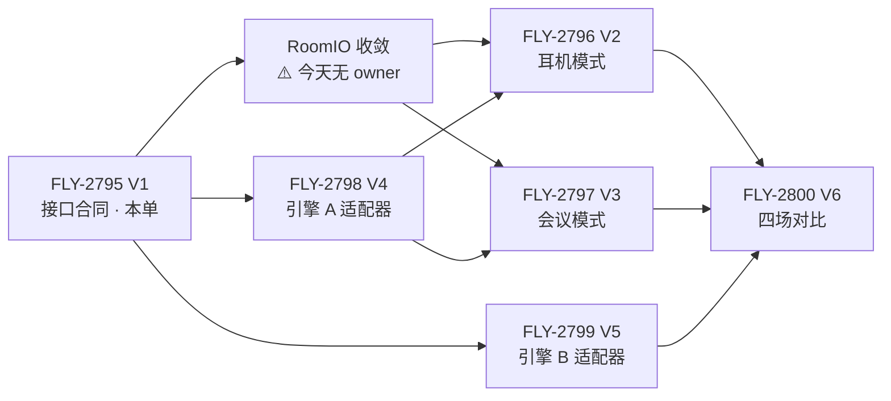

# FLY-2795 语音 V1 分层与引擎接口 — 实施计划（V2–V6 范围更新）

Issue: FLY-2795 (https://linear.app/geoforge3d/issue/FLY-2795/语音v1-分层与引擎接口耳机会议模式引擎无关-对话引擎-ab-的接口合同-现有代码与-9-月初-raya-语音代码盘点找回清单)
日期: 2026-09-22
基于: research.md

> **本单不写实现代码、不改生产。** 本文是「接口定稿 + 后续单范围增量」，不是施工单。
>
> ⚠️ **一处诚实边界**：本机 `linear-api` MCP 返回 `AUTH_HEADER_REJECTED`（HTTP 401，token 已失效），
> 我**没能读到 FLY-2796/2797/2798/2799/2800 各自的正文**。单号来自 Lead 2026-09-22 的答复
> （V2=FLY-2796 耳机最小集 · V3=FLY-2797 会议最小集 · V4=FLY-2798 引擎 A · V5=FLY-2799 引擎 B · V6=FLY-2800 四场对比）。
> ⇒ 下面写的是**本单核实出来的、相对各单原范围的增量**；与各单正文冲突之处以正文为准，请 Lead 裁。
> ⛔ 我没有编造任何一条「某单原本写了什么」。

---

## 1. V1 定稿了什么（四句）

1. **分层成立，切线要挪**：房间层今天是**两套**（voice-codex / voice-bridge），引擎抽象**已经存在**
   （`packages/voice-core/src/types.ts:151-263`）但只覆盖 5 个引擎里的 2 个；
   模式层**不是零** —— 耳机规则层已引擎无关，会议在 huddle 有三段代码（⛔ 但不是 PRD 闭环）。
2. **引擎身份已定**（founder 2026-09-23 06:17Z）：A = `gpt-live-1` 公开 Live + 后台 Lead；B = Codex 0.156.1 V2 + `gpt-realtime-2.1`；模型与端点在合同里是**配置项**（K6）。
3. **接口五项定稿**：`speak(text, kind, {verification})` · `onUtterance` · `handoffToLead(intent)` · 会话起止 ·
   `initialSessionContext`（+ 与之分开的运行中 `injectContext`）。
   ⚠️ 其中 **`speak` / `onUtterance` / `injectContext` / 会话起止是扩 `voice-core` 已有抽象**（⛔ 不是「五项全部扩已有、不新建」）；
   **`handoffToLead` 不是** —— 今天只有整句邮箱投递与 ship 专用 mutation 两条专用路，
   通用 request/receipt carrier **要新建**（research.md §4.1 ③、§4.4）。
   ⚠️ 引擎 A 的 Live **client delegation 是接缝，不是 `handoffToLead` 本身**：
   delegation 事件是「模型 → 应用」的 inbound 请求 + 相关句柄（原始事件只有 `{id,type,target}`），
   `handoffToLead` 仍由模式层从已持久已归属的 utterance 构造，用自己的 `handoffId`/`idempotencyKey` 派发；
   `session.commentary.append` 只是把结果回给 Live 说出来，⛔ 不是业务 commit。
4. **「找回」有两个来源**，不只 Raya 仓：Raya `apps/voice@f669d1b`（41 个非测试文件，41/41 已逐项处置）
   **和** Flywheel 本仓 `voice-core/src/headphone/*`、`voice-bridge/src/huddle/*`。
   issue 正文只写了前者，这是本单的主要更正。

⚠️ **本文经 Codex 设计评审 R1–R5 五轮更正**（R1 11 条 → R2 6 条 → R3 5 条 → R4 7 条 → R5 5 条，全部核实后接受）。
被推翻的自有主张逐轮记在下面，免得后来的人以为它们仍成立。**R1 推翻了七条**：
「speak 有四态回执且 `confirmed` 等于她听见了」（实为三态，且只到本地播放提交）·
「`appendText` 是现成的塞文字让它先开口样板」（它不触发 response）·
「`VoiceScheduleState` 是会话权威」（实为 `VoiceSessionState`）·
「会议模式已有完整一套，纪要不动」（PRD 五段未覆盖，且现有 landing 会提前 Done）·
「Raya 盘点已完成」（漏 11 个文件，且引了一个不在该 commit 上的 model 路径）·
「`VoiceRoomRuntime` 负责进房与身份校验」（它只是回调路由器）·
「`OutboxWatcher:250-268` 是通用逐字 grounding」（那只是 filter scope）。

**R2 又推翻了六条**（同样列出来，免得被当成仍成立）：
「`readback.ts` 是逐字保真判据」（它只做 identifier 匹配，不比较整句）·
「`TranscriptLog.ts` 整件找回」（那是第二个限长内存 store，只要 utilities 与归属规则）·
「`SpeakReceipt` 是一个字符串 union 且可以 `stage ≥`」（字符串无序；进度与终局已拆成两字段）·
「`kind ≠ control` 一律必须逐字」（与 §4.3 自相矛盾；改为按 `kind` 分别规定）·
「`bargeIn` 是 Lead 能不能主动插话」（**反了**，它是她开口能不能打断模型那一轮）·
「`unknown` 是 handoff 的一等终局态」（它是 `ambiguous`，必须进持久 reconciliation）。

**R3 又推翻了三条**：
「`SpeakReceipt` 用一个可选 `proof` 字段 + `proof !== "none"` 判 arm」（可选字段缺省时 `undefined !== "none"` 恒真 ⇒ 无证据也能放行；已改为三个正交必填字段 + 正向枚举）·
「现有 `unconfirmed` 映射为 completed」（它来自 speech timeout，状态行就是「这段未朗读」⇒ 是 failed）·
「R-12 的最低成立条件是 RoomIO 的两件」（`cancelSpeech` 只 flush 本地嘴，不 fence 那一轮 ⇒ 旧答案会再冒出来；必须加第三件 `turnCancelOrSuppress`）。

**R4 又推翻了四条**：
「`SpeakReceipt` 三个正交字段就不可构造非法组合」（笛卡尔积仍能构造 `{rejected, playback_drained, transcript_equivalent}`；已改成 discriminated union，并补上 `pendingKey` + `requestDigest` 绑定 —— 否则同 key 不同文本会拿到别人的 proof）·
「今天的 `confirmed` 是 `playback_drained`」（`audio.ts:216-228` 写完最后一帧就 resolve、不等 drain，证据名本来就叫 `realtime_playback_submitted` ⇒ 只能映射为 `submitted`）·
「`handoffToLead` 在 A 上就映射到 client delegation」（delegation 是「模型 → 应用」的 inbound 请求 + 相关句柄，不含任务文本；outbound intent 仍由模式层构造派发）·
「`authorized → dispatched` 两态够用」（中间缺 `dispatching` 就有不可恢复的崩溃窗口；并补 lease/CAS fencing 与「provider 必须支持只读查询」的 dispatch 前置）。

---

## 2. 六条跨单硬约束（V2–V6 都受它约束）

| # | 约束 | 依据 |
|---|---|---|
| K1 | **⛔ 不许出现第三套房间层，且必须有一个 convergence owner。** 以 `voice-codex/src/discord-room.ts` 为底座（在生产跑、有身份断言、有收听健康、有等待音床），把 `RealtimeAudioOwner` 挪出 `realtime.ts`、`playSpeech(speechId, pcm24Mono)` 换成带 `format` 的通用帧、并入 `SessionSlot` 的单会话互斥、**新增 `audibleTail`（估算）**。⚠️ 只禁第三套**不足以**保证 V6「四场同一房间层」——**必须有一单显式拥有 `RoomIO` 的落地、voice-bridge 侧的适配/迁移、以及 `/gemini` `/eleven` 的兼容与验收**（见 §3）。不删 voice-bridge 那套 | research.md §3.1；exploration.md §3.4 |
| K2 | **⛔ 不许留第二个 Codex app-server 作为捷径**，不得从 Raya 旧 `AppServerClient.ts` 复制出新的进程客户端（该文件判「不要，仅协议证据参考」）；V5 扩 Flywheel 已有的 `packages/teamlead/src/lead-backends/codex/CodexLeadProcess.ts:166-292` | FLY-2445 `plan.md:29,150,184`（C2） |
| K3 | **⛔ 引擎不得自行丢弃归不上说话人的整句。** 必须上报 `attribution:{kind:"unknown", reason}` 的 utterance，由模式层决定；且 `unknown` 时**禁止任何有副作用的动作**（fail closed）。今天 `voice-codex/src/realtime.ts:739-761` 的丢弃行为在 2026-09-23 03:05Z 实测中吃掉了她一段约 5 秒的话 | FLY-2786 `exploration.md:2.1` |
| K4 | **⛔ 任何状态、证据名、文档句子都不许把本地可观测状态说成「她听见了」。** 全栈今天能观测到的最远一档是「**本地 PCM 已 submitted**」（A 的 `confirmed` 证据名就叫 `realtime_playback_submitted`，`voice-codex/src/session.ts:457-466`；`audio.ts:216-228` 写完最后一帧就 resolve、**不等 drain** ⇒ 连「播放队列已排空」都不是）。ship / readback 的 arm 条件写成精确布尔谓词，**正向枚举 `contentProof`**（⛔ 不用 `!== "none"` 的负向检查 —— 字段缺失时它恒真），且 `audibleTail` 每次提及都要带「**估算**」二字（research.md §4.1 ①） | research.md §3.3 红框、§4.1 ① |
| K6 | **语音模型与端点是配置项，⛔ 不是常量；额度/权限失败必须明确报「语音不可用」，⛔ 不得静默切引擎。** 引擎身份由 founder 2026-09-23 06:17Z 定：**A = `gpt-live-1`**（公开接口 `wss://api.openai.com/v1/live/sessions`，`session.start` + `delegation.type=client`），**B = Codex 0.156.1 V2 + `gpt-realtime-2.1`**。⚠️ 公开 Live **不是换个模型字符串** —— 新入口、新会话协议；协议与模型不匹配 ⇒ 启动即报不可用 | FLY-2799 `engineering/doc/FLY-2799-codex-voice-container/gpt-live-handoff.md`＠`15fe2c875`；research.md §4.2b |
| K5 | **⛔ 不许有第二套会话状态机。** 实际会话权威是 `VoiceSessionState`（`packages/teamlead/src/StateStore.ts:2663-2672`）；`VoiceScheduleState`（`:2731-2738`）只管**未来预约**；模式状态机只管 item / meeting flow | research.md §4.1 ④ |

## 3. 依赖顺序与两道 fail-closed 闸

**入场条件**：
- V2 / V3 各自**至少需要**：收敛后的 `RoomIO` + 一个合规 backend（最早是 V4 的 A）。
- V6 需要：A、B **都**经同一 `RoomIO` 与同一模式层跑通。

🔴 **闸 G1 —— `RoomIO` 的收敛 owner 未定。** K1 今天只禁了第三套，**没有一单负责把两套收敛成一套**。
**未满足以下全部 exit criteria，V2 / V3 不得进入实现**（⛔ 「不得」，不是「不应」）：

| # | G1 的关闭条件（都要可审计） |
|---|---|
| G1-a | 有一张**具名 issue** 与一个 owner 负责 `RoomIO`（新建，或明确并入 V2 并写进该单正文） |
| G1-b | 固定 `RoomIO` 的 base 与**接口版本号**：至少含带说话人的收音帧、放音 + 取消、presence、收听健康、**`audibleTail`（估算）**、lease/slot |
| G1-c | 写明 voice-bridge 侧的**迁移或适配路径**（不是「以后再说」） |
| G1-d | `/gemini` 与 `/eleven` 的**兼容验收**已列出并通过 |
| G1-e | 有一个 V6 可机械验证的 **implementation identity**（能证明四场跑的是同一份 `RoomIO`，例如同一模块导出 + 版本常量） |

**本单不替 Lead 指派 owner。**

🔴 **闸 G2 —— 与 V2–V6 各单正文对账（fail closed）。**
本机 `linear-api` MCP 返回 401，我**没读到** FLY-2796..2800 的正文。
⇒ §4 全部标为**提议增量**。**关闭条件 = 一份持久的对账回执**，内容至少包含：

| # | G2 的关闭条件 |
|---|---|
| G2-a | 每张 FLY-2796..2800 正文的 **revision / `updatedAt`**（证明对的是哪一版） |
| G2-b | **逐条冲突清单**（本文增量 vs 该单原 acceptance criteria） |
| G2-c | **Lead 对每条冲突的裁定** |
| G2-d | 裁定的**反写位置**（写回哪张单的哪一段） |

在这份回执存在之前，⛔ **不得把本文的范围当作覆盖了各单原有的 acceptance criteria**。
（401 本身不是缺陷，缺的是这道对账闸。）

## 4. 逐单范围增量

### V2 = **FLY-2796** 耳机模式最小集（引擎无关）

**V1 的核实改变了什么**：耳机模式的规则层**已经存在且引擎无关**，缺的是三格 + 一个音频面。
⇒ V2 不是「实现耳机模式」，是「**补三格 + 接上语音房**」。
⚠️ 入场条件：**闸 G1（`RoomIO` owner）先解决**，否则 V2 会自己长出第三套房间层。

| 要做 | 现状 | 落点 |
|---|---|---|
| **接语音房音频面** | 唯一 `HeadphoneIO` 实现是桌面 dry-run（`voice-headphone/src/null-audio-io.ts:1-7,:55`，经 edge-tts 念到 Mac 扬声器） | 新写一个 `HeadphoneIO` 实现，`speak` 走 V1 合同的 `speak(text, kind, {verification})`，底下接 K1 的 `RoomIO` |
| **先定 durable inbox 合同**（⚠️ 新增前置） | 🔴 **更正本单先前的写法「所有 I/O 都注入、换两个注入即可」**：Raya `InboxReader.ts:1-8` 直接 import 并调用 `readVoiceInbox` / `appendVoiceInboxAck` 与 filter store，**绑死 Raya 的 inbox/ack 文件协议**。而 Flywheel 今天的耳机 daemon 在 mode off 期间**不形成可在入场回放的持久积压** | V2 **先**定义 Bridge 侧的 durable inbox：来源、cursor、ack 权威、离线积压规则、重放幂等。**之后**才谈复用 `InboxReader` 的排序/重试规则 |
| **进来播报**（PRD FLY-1850 §5.1） | **没有**。开模式只是开始拉队列（`daemon-core.ts:149-153` → `turn-machine.ts:230-236,:258`） | 在上一行的 inbox 合同之上，**找回 Raya `InboxReader.ts`(381) 的规则**：按 `needsDecision` 降序（`:237-250`）、只有逐字校验通过才 ack `spoken`（`:263-272`）、每 item 每 session 最多 2 次 + 60s 退避（`:87-88`）；**并搬 `SpeechBrief.ts`(81)**（三段校验 `:39-53`，含「不得含任何数字」`:27-29`） |
| **存活信号**（PRD FLY-1850 §5.4） | **没有**。等待音床只在 voice-codex 房（`voice-codex/src/audio.ts:100,:173,:177`） | 归 K1 的 `RoomIO` 暴露；模式层用 `speak(kind:"heartbeat")` 或床。⚠️ **间隔值 PRD §6.2 仍是刻意留空**（「一小时」是体感阈值，不是配置值）⇒ **V2 不许自己定一个数当需求**，给可配置项 + 默认值并标「待她用过再定」 |
| **筛选的「学」那半边**（PRD §5.3） | 只有静态谓词 `tap-filter.ts:33` | **找回 Raya `filter/FilterRules.ts`(186) 的三件**：`StoredFilterRule` 形状（`:20-29`）、`matchesFilter` 的 AND 语义 + NFKC keyword（`:137-153`）、原子写（`wx`+`fsync`+`rename`，0600/0700，`:156-178`，损坏 fail-open `:132-134`）。谓词本身用现成的 |
| **用嘴批补三条规则** | 阶梯已有（`turn-machine.ts:21-30,:87-95`，receipt-first） | **从 Raya `ShipGateFlow.ts`(809) 只取三条**：① arm 条件按 K4 写成精确布尔谓词（research.md §4.1，**正向枚举 `contentProof`**，`audibleTail` 是**估算**；形状参考 `:652-659`）② founder 词表**全等**匹配（`:129-150`，词表 `:20-21`）③ 执行前重拉 binding **全字段**比对（`:152-160,:492-495`）。⛔ 不整搬 809 行 |
| **通用复述闸**（PRD §5.6：动手前念专名和编号） | 只在 ship 阶梯内有 readback | **找回 Raya `ReadbackGate.ts`(294)** 的 `run/observe/invalidate` 与 grace 窗口，接到 `speak(kind:"readback")`；判据工具用 **`readback.ts`(95)** 的 **identifier 匹配**（`:40-60` 抽 `fly-\d+`(`:43-45`)/`#\d+`(`:46-48`)/`owner/repo`(`:49-52`)/alias(`:54-58`)，`:85-87` 判 `every(id => spoken.includes(id))`）。⛔ 更正：它**不比较整句**，不能当 `content_verified` 的证据 |
| **transcript 底座** | Flywheel 的 `TranscriptEntry` 缺字段（research.md §3.7 缺口 8）；`TranscriptSink.append` 返回 `void` 且 JSONL 实现吞写错（缺口见 research.md §4.4） | **部分找回 Raya `speech/TranscriptLog.ts`(257)**：`containsIdentifierText`（`:42`）、`extractIdentifierTokens`（`:57`）、归属规则（epoch/final 归属 `:95-148`，owner+窗口算法 `:229-255`）。⛔ **不要 `TranscriptLog` 这个 store 本身**（限长内存 transcript，默认 200），否则与 `TranscriptSink` + RoomIO 归属权威三头并存。⚠️ 并要给副作用路径定义**可等待的持久化回执**，写失败 fail closed |
| **`handoffToLead` 的通用载体**（⚠️ 新增） | 🔴 **更正**：`voice-headphone/src/bridge-client.ts:136` 只是 `POST /api/voice/ship-approval`，**承载不了**开单/改优先级/派 Runner；`adapters.ts:103 ingest` 是整句邮箱投递，不是 intent | 按 research.md §4.1 ③ 定义 request/receipt（`intentKind`、payload、session/transcript/原话、`idempotencyKey`、`authorityBinding`、**`ambiguous` 作为非终局态 + 持久 reconciliation**），再分别映射通用 comm 与 ship 专用两条实现。**找回 Raya `OutboxWatcher.ts`(658) 的 grounding 规则**（`:444-460`、`:477-490`、`:547-568`）——本单先前漏把它写进 V2 范围 |
| **退出补两条** | 已有 `芝麻关门` + vc_exit | **找回 Raya `ExitProtocol.ts`(43) 的 `composeStartInstructions`**（退出条款注入 `initialSessionContext`，幂等 + 8192 上限 `:12-24`）**与 `runtime.ts:1082-1100` 那条守卫**：口头退出必须先有 founder 的 user 转写才认 |

**V2 不做**：不选引擎（但**必须经 V1 接口**）。⚠️ 更正本单先前的写法「V4 的 A 或现成 edge-tts 都可以」——
edge-tts 只实现 `AnnouncerSession`（`types.ts:178-184`），**没有 `onUtterance`** ⇒ 单独不满足 V1 接口；
若用它，必须与一个提供上行的 conversation face 组合，组合规则由 V4 给。

### V3 = **FLY-2797** 会议模式最小集（引擎无关）

🔴 **更正本单先前的写法「会议模式已有完整一套，纪要⛔不动」——那句强于证据。**
huddle 确实有即时起会 + 会中编排 + 会后 landing 三段代码，但**产品闭环没有成立**：
PRD FLY-1851 的预约/提醒/link 主路径（R-4–R-10）、时长（R-2b）、互动 HTML（R-22/R-27）、
**逐条 action item 互动**（R-23）、repo 归档（R-25）、**会后读转写的 note taker**（R-21 §41 修订后）
全都**没有**实现；而且现有 landing 的落地合同是「comment → worktree → **Done** → 卡片，Done 是最后一步」
（`ConclusionPipeline.ts:1-15`），它在**会议一结束**就把立项 issue 置 Done，
**早于**她逐条批 action items ⇒ 与 **R-24 直接冲突**。逐条见 research.md §3.5 红框。

⚠️ 入场条件：同 V2 —— **闸 G1 先解决**。

| 要做 | 现状 | 落点 |
|---|---|---|
| **控制口解绑** | `HuddleSession.ts:1105 speakThrough` → `:1119 sendText(prompt)`（gemini 转述，非逐字） | 换成 `speak(text, kind, {verification})`：要她听到原话的走 `kind:"brief"/"question"` 且**显式传 `verification:"required"`**（⛔ 不能只写「逐字」—— `brief` 的默认是 `best_effort`），只给引擎意图的走 `kind:"control"`（`verification:"none"`） |
| **起会** | 已有即时 ×3（`GlawCommand.ts`、`GeminiCommand.ts`、`wireMeeting.ts:1-10`）；`wireMeeting.ts:14-25` 写死 Gemini | 改为按 `VoiceBackend` registry 取引擎 |
| **预约 / 提醒 / link**（R-4–R-10、R-2b） | ❌ 无。FLY-2701 的 `voice_schedules`（`StateStore.ts:2731-2738`）存在但**没和 huddle 接起来** | **V3 要么承担，要么显式 defer 到一个有名字、有验收条件的 scope。⛔ 不许当成「已有」** |
| **会议上下文** | 已有（`FeedPipeline.ts:39 injectContext`、`BriefingEngine.ts:23-31`） | 按 V1 §4.1 ⑤ **拆成两件**：`initialSessionContext`（开场）与 `injectContext`（运行中静默、**不触发出声、不写 transcript sink**）。**找回 Raya `meeting-context.ts`(61) 的规则**（meetingId 一致性 `:28-31`、状态白名单 `:32-36`、记忆文件清单拼接 `:47-49`），loader 换掉 |
| **带节奏** | 已有（`AddressRouter.ts`、`HuddleSession.ts:1211/:312/:383/:303`、`ConfirmationLadder.ts`） | ⚠️ PRD V1 是**单 AI 一场会** ⇒ **抽取其中引擎无关的策略**（发言权、插话、思考看门狗），⛔ 不是默认把整套多 Lead 编排（黏性寻址、`grantTo`/`interruptLine`）当模式层基底。⛔ `ConfirmationLadder` tier c 结构上没有执行路径，不要偷偷给它加 |
| **结束** | 已有（`HuddleSession.ts:984`、`AssistantSession.ts:435`） | 换控制口 + **R-39**：她退房 Lead 也退，不留在房里等（`prd.md:655-663`） |
| **开场注入** | — | Raya `runtime.ts:595-599` 是**形状参考**；⛔ 不是「已验证能让它开口」的样板（§1.1）⇒ 经 `speak(kind:"control")` 走，B 侧能不能成由 V5 定 |
| **纪要 / 结单时机** | landing ×3 已有，`summarize` 是注入函数 ⇒ 引擎无关 | 🔴 **不得**把会提前 Done 的 landing 当作 R-24 的合规实现。V3 要么改结单时机（Done 移到她逐条批完之后），要么显式 defer 并写明现状与 R-24 冲突。V1 只保证「转写留痕 schema 对 A/B 一致」（`TranscriptSink`），纪要不进引擎接口 |

**V3 不做**：⛔ 不实现会中逐 Lead 实时派发（`dispatchActionItems` 今天只是 `ConclusionPipeline.ts:13-16` 的注释）。

### V4 = **FLY-2798** 引擎 A：`gpt-live-1` 前台 + 后台 Lead

🔴 **founder 2026-09-23 06:17Z 定「用 GPT Live」** ⇒ A 的前台**不是**今天生产那条直连 OpenAI Realtime，
而是公开的 **`gpt-live-1`**（`wss://api.openai.com/v1/live/sessions`，`session.start` + `delegation.type=client`）。
⚠️ 它是**新入口 + 新会话协议**，⛔ 不能只换旧 Realtime 的模型字符串。
事实来源：FLY-2799 `engineering/doc/FLY-2799-codex-voice-container/gpt-live-handoff.md`＠`15fe2c875`「给 FLY-2798 用」（**单场本机实测**）。

🔴 **另一条更正（R2 指出）**：`RealtimeFrontend`（`voice-codex/src/realtime.ts:221`）既不是 `VoiceBackend` factory
（无 `createConversation`）也不满足 `ConversationSession`（无 `sessionId`、`sendAudio`/`sendText`/`injectContext`/`endUserTurn`/`on`/`close`），
今天喂它的 `FrontendLike`（`session.ts:34-40`）是另一种 lifecycle ⇒ **范围是 backend factory + session adapter**，不是加个 `implements`。

| 要做 | 落点 |
|---|---|
| `GptLiveBackend` factory + conversation/session adapter | 注册进 `factory.ts:102-116`（今天只有 edge-tts 与 gemini-live）；逐方法对 `ConversationSession`（`types.ts:212-247`）列映射表，缺的明确标「不支持」 |
| `speak(text, kind, {verification})` → `session.commentary.append` | ✅ 开口机制已跑通（单场实测）。⚠️ **`contentProof` 要重新取证** —— 那一场没做逐字保真；把 `realtime.ts:381-383` 的逐字 instructions + `speech.ts:167 isFiniteSpeechEquivalent`（强制点 `:1017-1019`）+ `prepareReplySpeech(raw, 80)` 这套**规则**移植到 Live |
| **client delegation 接缝**（⛔ 不等于 `handoffToLead`） | ✅ **协议回环已跑通**：`target=client` 委托事件带 **`delegation.id`**，应用按同一 id 用 `session.commentary.append` 回送，模型把结果说出来。🔴 **⛔ 不要再另造函数工具**（founder 明示），**但也⛔ 不要把它当成 `handoffToLead` 本身**：委托事件是「模型 → 应用」的 inbound 请求，原始事件只有 `{id,type,target}`（`duplex-live.jsonl@15fe2c875`），**不含完整任务文本**。`handoffToLead(intent)` 仍由模式层从**已持久、已归属**的 utterance 构造并校验，用**自己的 `handoffId`/`idempotencyKey`** 经真正的 Lead carrier 派发；`commentary.append` 只负责把结果说出来，⛔ **不是业务 commit**。⇒ 要持久化 **`delegation.id ↔ handoffId ↔ transcriptId/requestDigest`** 绑定；⛔ 没有证据表明 `delegation.id` 可跨重连查询 ⇒ **不得拿它当 `idempotencyKey`**。⚠️ 真实 Lead 那一段（信箱送达、Lead 消费、动作授权、纪要回投）**全未验** ⇒ 「协议回环已跑通」≠「`handoffToLead` 已跑通」 |
| `turnCancelOrSuppress` | 🔴 **必做且要自建**：那一场 **Live 没有与 Realtime 等价的取消事件**（Realtime 对照在插话第一帧后 167.7ms 明确取消旧响应），而 `discord-room.ts:279-281 cancelSpeech` 只 flush 本地嘴 ⇒ 需要 adapter 侧的 suppression generation/token，丢弃被取消那一轮的后续 audio/transcript/tool 效果。⚠️ 没有它，R-12 在 A 上 fail closed（research.md §4.3） |
| `onUtterance` 对齐规范形状 + **扩 schema** | 🔴 **A 的归属＝未验**：`realtime.ts:38-45` 的 `ownerUserId`/`utteranceId` 属于 **legacy OpenAI Realtime**，不是 `gpt-live-1` 的能力 ⇒ 要靠 RoomIO 的说话事件与 Live 事件**关联**之后才能声明。Live 输入/输出转写**时间区间重叠 200ms**（单场实测）⇒ 只推得出「不能假设输入输出串行、⛔ 不能只靠时间区间互斥判 turn」，⛔ **推不出出现了重复项**（dedup 规则等观测到重复 id/内容再定）。`ConversationEventMap.transcript` 与 `TranscriptEntry` 缺 `transcriptId`/`utteranceId`/归属（research.md §3.7 缺口 8）⇒ 一并扩，并落归属的可判别 union |
| **`capabilities` 加规范字段** | `VoiceBackendCapabilities`（`types.ts:56-70`）今天**没有** `verbatim` / `attribution`；`turnCancelOrSuppress` 是**有效会话行为**（不是静态表）⇒ 都要落，并接 research.md §4.3 的准入矩阵（未满足 **fail closed**） |
| **定清 `speak` 归哪张脸** | `speak` 是共享输出能力、`AnnouncerSession` 的脸、还是 `ConversationSession` 的扩展？⛔ 不许让一个类同时冒充 backend 与 session。顺带给出「edge-tts（只有 announce）＋某个提供上行的 conversation face」的组合规则（V2 要用） |
| `injectContext` | ⚠️ `commentary.append` **会触发开口** ⇒ **不能**直接拿它当静默注入。要么找到 Live 的静默通路，要么在 `capabilities` 里声明不支持（会议 V3 依赖它） |
| **K3：不再丢弃归不上的整句** | 新 adapter 不得复制 `realtime.ts:739-761` 的丢弃行为 |
| **K6：模型/端点配置化 + 失败显式** | 见 §2 K6：额度或权限失败明确报「语音不可用」，⛔ 不静默切引擎 |
| **两条路分开**（快路 / handoff 路） | 今天每句话都整句进 Lead 邮箱（`delivery.ts:72` → `adapters.ts:103`）。V4 把 `handoffToLead(intent)` 收窄为只走「要动手的事」。⚠️ **载体不是 client delegation** —— 那是 inbound 接缝；outbound 仍要模式层构造 + 真正的 Lead carrier（research.md §4.1 ③、§4.4） |
| ⚠️ **前置：要 founder 拍板** | 「前台自己回答」**部分推翻** founder 2026-09-08 的 F2/F3 与 FLY-2655 的「Realtime 不得独立回答」。FLY-2786 讨论页第 10 区块已交给她。**⇒ 她拍板前只做接口壳、schema 扩展与 K3，不打开前台自答** |

⚠️ **那一场的三个数字（开口 1175.0ms / 插话后新答案 4772.5ms / 后台结果 3016.8ms）是文字到达时间**，
⛔ 不是人耳延迟、⛔ 不是性能排名，每种配置只跑一场；也**没有**接真实房间的扬声器/麦克风/播放队列
⇒ ⛔ 不宣称真人打断手感或播放缓冲清空已通过。

### V5 = **FLY-2799** 引擎 B（Codex 0.156.1 V2 + `gpt-realtime-2.1` 语音容器）—— 第 1 步实测的口径要改

⚠️ **引擎身份**（Lead 2026-09-22 转达 founder 决定）：B 继续走 **Codex 0.156.1 V2 + `gpt-realtime-2.1`**；
公开 GPT Live 归 V4。⚠️ Codex 0.156.1 **V3** 指定 `gpt-live-1` 返回 `Voice session access denied` ——
那是**另一条接入路径**，⛔ 不能据此说密钥不能用 Live（FLY-2799 `gpt-live-handoff.md`＠`15fe2c875`）。

**V1 的核实改变了什么（本单对 V5 最重要的一条）**：
issue FLY-2795 正文把第 1 步写成「Codex 实时语音能否**塞文字让它先开口**」。
**核到的只有「RPC 存在」这一格 —— 两条候选路径都还不是「已验证能出声」**
⇒ 再去测「有没有这个 API」是浪费一轮，但**也不能写成「已经有答案」**。

**合同层已核（research.md §1）—— 但只到「RPC 存在」这一格**：
- 本机 as-of 2026-09-22：Raya 实际在跑的 `~/.codex-raya/…/0.154.0` 二进制方法枚举里
  含 `thread/realtime/{start,appendAudio,appendText,appendSpeech,stop,listVoices}`，字段名含
  `clientManagedHandoffs`/`includeStartupContext`/`outputModality`。
- 🔴 **但两条候选路径都不是「已验证能出声」**：上游 FLY-2446 `exploration.md:1.3`（rust-v0.153.2 源码核过）
  明写 **`appendText` 只加一条文本项、不触发 response**，v2 上 `role=developer` 行为**未验**；
  Raya `runtime.ts:595-599` 那个调用点**只证明有人这样调过** —— 当时的触发源是 app-server 侧的
  `server_vad{create_response:true}`，不是 `appendText`。

**⇒ 建议把 V5 第 1 步改成四问，按顺序**：

| 步 | 要测什么 | 为什么 | 通过判据 |
|---|---|---|---|
| B-1 | **生产同构环境里 `thread/realtime/start` + `appendSpeech` 能不能真出一次声，并留痕** | FLY-2655 2026-09-22 生产实测是这条路**收不到回话**（`session.created` 被标 unsupported realtime v2，`FLY-2655/exploration.md:54`）。API 存在 ≠ 能跑 | 有一条真音频出声的留痕（不是「RPC 返回 ok」） |
| B-2 | **逐字保真率** | `appendSpeech` **不是 TTS 直读**：Raya 旧代码靠 `Speaker.ts:4-6` 的系统前缀「请逐字、完整地对 Annie 说出下一行正文…」**求模型复述**，是软约定 ⇒ 这决定 B 的 `capabilities.verbatim` 能不能声明为 true | 🔴 **判据是「每一次是否都有可检出的逐句 proof」**，不是通过率：即每次注入都能拿到 `contentProof:"transcript_equivalent"`，且不一致时**能被检出并降级**（Raya 的转写回读比对，`Speaker.ts:296,:206-212`；Flywheel 侧 `speech.ts:167 isFiniteSpeechEquivalent`）。比例只作为可用性附注 |
| B-3 | **说话人归属** | Codex realtime 的 `transcript/*` **不带 ownerUserId**（Raya `RealtimeTransport.ts:333-356`）；而 PRD §5.7 用嘴批要求校验 founder 身份 ⇒ B 必须由 `RoomIO` 的说话事件补归属，否则 `attribution` 恒为 `unknown`，按 K3 用嘴批在 B 上 **fail closed** | 有一条可行的归属方案（房间层 speaking 事件对齐），并留痕 |
| B-4 | **`kind:"control"` 的映射 + `turnCancelOrSuppress`** | ① `appendText(role:"developer")` 塞进去之后**到底会不会触发出声**（§1.1 的未验项）② `stop()` 的**首帧停止边界** ③ 🔴 **被取消那一轮的后续 audio / transcript / tool 效果是否都被 fence 住**（⛔ 只验「第一帧停了」不算 —— 那正是 `cancelSpeech` 的毛病：旧答案会再冒出来）④ 重连/关闭行为。**会议 R-12 直接依赖 ②③** | 每项各有一条留痕；③ 必须给出「取消后到该轮明确终结之间，没有任何后续效果泄漏」的证据。不成立就在 `capabilities` 里声明 `false`，并按 research.md §4.3 关闭对应模式能力（⛔ 不笼统降级） |

**V5 其余范围**（承 K2）：
- **找回·引擎 B**：`codex/RealtimeTransport.ts`(401)、`codex/CodexLeg.ts`(252)。
  `CodexLeg.ts:118-134`（生成守卫 `:115-117`） 的 `baseInstructions = IDENTITY.md + MEMORY.md`（+ ACTIONS 合同 `:68-84`）
  **就是「装当前 Lead 的 memory」的落点**；`thread/start` 回执须过 `assertThreadReceipt` 校验 cwd/writableRoots（`:135-138`）。
- ⚠️ `codex/AppServerClient.ts`(395) **只作协议规则参考**，按 K2 扩 `CodexLeadProcess.ts:166-292`，不搬那 395 行。
- ⚠️ `CodexLeg` **不转发** `appendSpeech`/`appendText`/`appendAudio`（V1 核实），注入要直接拿 transport 调 —— 新适配器要把这层补上。
- **两条 handoff 的优先级要定**：Codex 实时模型自带 `background_agent` 工具，与 V1 的 `handoffToLead` 是**两条**路。V5 要定谁优先，⛔ 不能两条都开着让她收到两份回执。
- **`initialSessionContext` 的组合规则**：`CodexLeg.ts:118-125` 里**显式传入的 `baseInstructions` 会替换掉**默认的 identity+memory 拼接 ⇒ V5 必须定义「给显式会议上下文时如何**不丢** identity / memory / ACTIONS 合同」。
- **capability 声明纪律**：`verbatim` / `attribution` / `bargeIn` 三项在 B-2/B-3/B-4 出结果前**一律 `false`**，对应模式能力按 research.md §4.3 **fail closed**。
  ⚠️ `verbatim:true` 的判据是「**每一次都有可检出的逐句 proof**」，⛔ **不是抽样比例** —— 比例只说明可用性，不能把一个安全 capability 置 true。
  ⚠️ `bargeIn` 指的是**她开口能不能打断模型那一轮**；🔴 **R-12「她一插话 Lead 立刻停」要三件齐**：`roomDetectsBargeIn` + `localPlaybackCancel`（RoomIO）**+ `turnCancelOrSuppress`**（引擎适配器的有效会话行为）。只做前两件 = 旧答案会再冒出来，⛔ 不算满足（research.md §4.3）。

---

### V6 = **FLY-2800** 四场对比

**V1 的核实改变了什么**：对比的**前提条件**要写死，否则四场不可比。

| 要求 | 依据 |
|---|---|
| 四场必须**同一套房间层**（K1）、**同一个模式层**，只换引擎 | 否则量的是两套实现的差，不是两个引擎的差。⚠️ **这条只有在闸 G1（`RoomIO` 收敛 owner）真的落地后才成立** —— K1 只禁第三套，不自动产生收敛 |
| 入场条件：A、B **都**已经过同一 `RoomIO` 与同一模式层跑通（见 §3 的 DAG），且**该模式所需的 capability 在两个引擎上对等** | 🔴 **capability parity 是硬条件**：若 B 在某模式的必需 capability 上 fail closed（`verbatim` / `attribution` / R-12 的最小组合），那一格在 B 上是**关闭**的 ⇒ 该场次标 **`blocked / not comparable`**，⛔ **不计入四场对比**，⛔ 不许「跑完再在报告里注明少了哪几格」 |
| 口径必须与 FLY-2786 实测**同源**：说完（人声门关）→ 听到第一个字；另列转写完成、进邮箱、Lead 回复出现、领取、开始出声 | FLY-2786 `exploration.md:2.1` 已有 `c1b4b972` 会话的分段表可作基线 |
| ⚠️ **不能拿今天的 38s/18s 当「引擎 A 的成绩」** | 那两个数是 `n=2`、单场、且走的是「每句进 Lead 邮箱」的老路；V4 之后的 A 与它不是同一条路 |
| ⚠️ **9 月初那版没有逐句延迟留痕** | Raya `voice-evidence/events.jsonl` 只有 08-27 的 19 行（FLY-2786 §3）⇒ B 没有历史基线可引，只能现测 |
| 参考值只能标为「另一条管线的参考值」 | `/gemini`（Gemini Live 自带脑子）真人「说完 → 回应 0.86s」，FLY-1347 `voice-measurement-pack.md:17`，2026-07-17 |

---

## 5. 本单交付物清单

| # | 交付 | 位置 |
|---|---|---|
| 1 | 接口合同（一页）：`speak(text, kind, {verification})` / `onUtterance` / `handoffToLead(intent)` / 会话起止 / `initialSessionContext` + `injectContext`，含 capability 准入矩阵与 ambiguous 收敛 + A/B 逐项对照 | `research.md` §4 |
| 2 | 盘点表 ①：Raya `apps/voice@f669d1b` 逐模块「找回·模式层 / 找回·引擎 B / 不要」 | `research.md` §2 |
| 3 | 盘点表 ②：Flywheel 现有通用代码逐项 file:line + 十一个缺口 | `research.md` §3 |
| 4 | V2–V6 范围增量（本文） | `plan.md` §4 |
| 5 | 分层核实与三层边界 | `exploration.md` |

## 6. 不做什么

- 不写实现代码、不改生产/配置/服务、不开语音会话、不跑付费探针。
- 不替 founder 拍「前台能不能自己回答」那一板（FLY-2786 讨论页第 10 区块已交给她）。
- 不删 `packages/voice-bridge` 的房间层，也不宣布 `/gemini`、`/eleven` 作废。
- 不编造 V2–V6 各单正文里写了什么（Linear MCP 401，读不到）。
