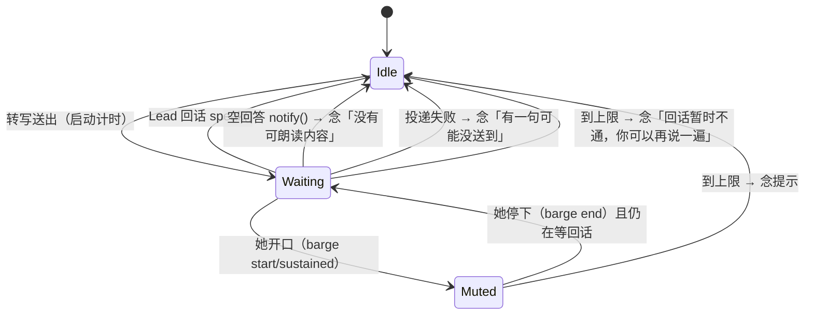

# FLY-2796 founder 打回修复 — 实施说明
Issue: FLY-2796 (URL 不可得,只写 issue 号)
日期: 2026-09-24
基于: plan.md

## 1. 打回原话与现象

founder 在两间真人房（车上 e2f65d70、家里 cac78575）里遇到三件事：

1. 一句话送到 Lead 后没有回话，等待音一直响（家里约 4 分钟）。
2. 等待音响着的时候她开口说话，等待音不停，打断不了。
3. 房里只有她一个人，清晰的话被悄悄丢掉（车上 7 段丢 3 段、家里丢 1 段），证据里记为 `skipped_unknown`。

全部发生在默认引擎 `openai_realtime_direct`，也就是 voice-codex 的 `GenericVoiceSession` + `RealtimeFrontend` 这条路径。

## 2. 根因

| 现象 | 根因（代码位置） |
|------|------------------|
| 等待音不停 | `session.ts` 收到转写就 `setWaiting(true)`，只有 `speak()` 会置回 false。Lead 不回、投递失败（`capture` 返回 false）、Lead 回了空内容（daemon 走 `notify`）这三种情况都不会关掉等待音，`WaitingMouth` 本身也没有超时。 |
| 打断不了 | 会话没订阅房间的说话事件，她开口时没有任何代码去停等待音。 |
| 单人房丢句 | `realtime.ts` 的 `ownerForRange` 要求一次服务端断句里只有一个 Discord utterance、中间没有空洞。她说完马上接着说时，Discord 会切成两个 utterance；句中停顿会在中间留下时钟补的静音帧。这两种情况都会让归属为空，于是这句按 `skipped_unknown` 被丢掉。前端「请再说一遍」的 `onStatus` 在 `cli.ts` 里也没接上。 |

## 3. 修法（只改 voice-codex 默认引擎路径；不改 RoomIO / 房间层，不改 2798/2799 引擎代码）

1. **等待音上限**：每送出一句都会启动一个等待计时，新的一句会重新计时。上限是 `FLYWHEEL_VOICE_REPLY_WAIT_MS`，默认 15000。这个默认值是工程起步值，等她用过以后再定，已经登记进 `truth.ts` 的数值调参 allowlist。
   - 到上限时先停等待音，再在线程里发「📻 回话暂时不通，你可以再说一遍」，同时把这句念出来。
   - 投递失败时立刻停，念「有一句可能没送到，请再说一遍」。文字提示 delivery 已经发过，这里不重复发。
   - Lead 回了空内容（daemon 的 `notify`）时立刻停，把「没有可朗读内容，请看文字」念出来。
   - Lead 的回话一开始念，等待就结束，之后不会再补超时提示。
2. **等待音期间可打断**：订阅 RoomIO 已经在发的 `onBargeIn` 事件（Silero 门控确认的人声）。
   - 收到 start/sustained：只要她在说话，等待音就静音。
   - 收到 end：如果还在等回话，恢复等待音。
   - 她说的话照常走转写 → 投递。等待计时不会因为她说话而停。
3. **不悄悄丢句**：人数来源是新增的 `room-headcount.ts`（`ChannelHeadcount`）。
   - 每次判定时同步读 gateway 的 `guild.voiceStates.cache`，数频道里的占用者。只排除本 bot 和已确认是 bot 的成员；身份没解析出来的占用者一律算作「可能是真人」；缓存读不到时结果为未知。
   - client 句柄取自房间自己订阅 deps 时传入的那个，RoomIO 不改。
   - 为什么不用现成的计数，Codex 复审前两轮各指出一处（都是 HIGH）：
     - R1：RoomIO 的 `humanCount` 只在 founder 自己进出时刷新，别人进来后会过期。
     - R2：deps 的进出事件要先等 REST 查完成员信息才发出，查不到就直接丢弃；`voiceChannelHumanCount` 还会漏数没解析出来的成员。
     - 这些计数在「判断还有没有人」时是 fail-closed，拿来判断「是不是只剩她一人」时反而成了 fail-open。
   - 单人房归给她要同时满足四条：她在房里；可能真人数恰好为 1；这段话里所有有声帧都属于她；至少有一帧有声。满足时这句归给她，证据记 `attribution: "sole_human"`。
   - 其它情况一律拒绝：段里出现别的已捕获说话人、整段只有静音、或者多人房。被拒的句子走前端 `onStatus`，文字发到线程，同时把「有一句话没能确认说话人，请再说一遍」念出来。
   - 多人房**不做**猜测归属。
4. **会话串行朗读**：Lead 回话和会话自己要说的提示走同一条 FIFO 队列。提示正在念的时候，Lead 回话排在后面，不会像以前那样直接返回 `failed`。同一句提示还在排队时，不会再重复入队。提示念完后不会补发「已念完」。

## 4. 证据字段（给 QA 真房对照）

- `reply_wait_ended`：`reason` 取 `reply` / `reply_unspeakable` / `delivery_failed` / `timeout` 之一。
- `voice_prompt_spoken`：`text` 是念出的原文，`receipt` 取 `confirmed` / `unconfirmed` / `failed` 之一。
- `waiting_interrupted`：她开口时等待音被静音的那一刻。
- `realtime_input_terminal`：新增 `attribution: "sole_human"` 字段，只在单人房归属补救生效时出现。

## 5. 刻意不做

- Lead 回话播放期间被她打断（取消 Lead 语音）属于第二批「打断」，这次不做。本次只处理等待音。
- 不改 Bridge 侧：Lead 不回话、Lead 会话卡死这类情况，由第 1 条的上限兜底。
- 两句重叠时，第一句的回话会把两句的等待一起结束。这是因为 outbound 条目不带对应转写的 id，没法按句对应。
