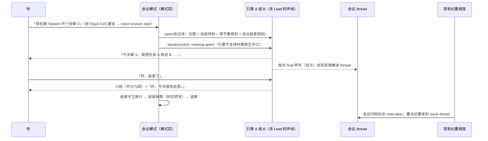

# FLY-2797 会议模式最小集 — 实施计划
Issue: FLY-2797 (https://linear.app/geoforge3d/issue/FLY-2797/语音v3-会议模式最小集引擎无关带议题起会-载入会议上下文-lead-带节奏-说结束就退出-转写进-thread-出纪要-找回)
日期: 2026-09-24
基于: research.md

Status: draft R3（design-only；实现在 FLY-2796 合入后另开 code run）。
R1 Codex 设计评审提出 6 条阻塞、2 条建议；R2 又提出 2 条阻塞、2 条建议。全部核实后接受，修订点列在 §10。

## 1. 给 founder 看：一场会怎么走

你跟某个 Lead 说「现在开个会聊 X」。Lead 进语音房，用它自己的声线先开口，说今天聊什么、准备按什么顺序聊。
然后一件一件聊，你说「这个可以了」它才进下一件。
你说「好，结束了」，它用一两句话总结，说「好，今天就到这里」，然后退出房间。你直接退房也行，它会跟着退，不会留在房里等。
双方说的每句话在会中就进入会议 thread。要点纪要由现有纪要流程发到这场会的 issue thread。



## 2. 范围、权威与依赖

- 权威：FLY-2795 合同 `313befcfa` §4 V3、Lead 的 G2 六条裁定（exploration.md §4，照抄不改），以及本轮 Lead 追加的声线与话术约束。
- 入场：**G1 由 FLY-2796 负责**。本单不自建房间层，不另开会话状态机（K1、K5）。
- 依赖版本见 research.md §0。其中 2796 在本轮评审期间已从 `a6477251a` 前进到 `513e5c82d`。**实现 T0 必须换成 Lead 给的已合入 SHA，并逐行核对 §6 的「具名依赖」表**；对不上的退回 Lead，不私自补第二套实现。

## 3. 文件与所有权（给实现 run 的施工表）

| 路径 | 新增 / 改动 | owner | 职责 |
|---|---|---|---|
| `packages/voice-core/src/meeting/MeetingContext.ts`（新） | 找回 Raya `meeting-context.ts` 里「拼会议段落」的规则 | 本单 | 由投影生成**会议块**（议题、会前材料、带节奏规则、会中动作规则、会议结束条款），检查会议块自身的预算（§4.1） |
| `packages/voice-core/src/meeting/MeetingExit.ts`（新） | 会议版退出条款与守卫。⛔ 不调用耳机版 `composeStartInstructions`（它会硬拼耳机退出条款） | 本单 | `MEETING_EXIT_CLAUSE`、`MEETING_EXIT_SENTENCE`、`MEETING_CONFIRM_QUESTION`、`isMeetingEndRequest`、`MeetingExitGuard`（§4.3） |
| `packages/voice-core/src/meeting/MeetingMode.ts`（新） | 与 2796 `HeadphoneMode` 同构 | 本单 | 串行任务：open → 开场 → 会中（handoff 策略、转写管线）→ 收尾屏障；只管会议流程，不持有会话状态 |
| `packages/voice-core/src/meeting/index.ts`（新） | 导出 | 本单 | — |
| `packages/teamlead/src/meeting-notes-config.ts` | 新增窄入口 `readTrustedMeetingBriefing(config, meetingId)` | 本单（teamlead） | 复用现有 `readTrustedFile` 的可信文件边界，只读 `meetings/<id>/briefing.md`。**不要求终态归档**（§4.1） |
| `packages/teamlead/src/bridge/voice-session-services.ts` | 改 `projectSession` | 本单（teamlead） | `mode=meeting` 时投影 `topic` 与 `briefing{status,text?}`；`realtimeVoice` 缺失**不回退 marin** |
| `packages/voice-codex/src/`（组合根 `cli.ts`，按 2796 合入后的实际文件） | 接线 | 本单 | `mode=meeting` 时组装 `MeetingMode`；实现收尾屏障（§4.5 ②）；重启恢复入口（`cli.ts:363-379`）消费新的 journal 字段 |
| `packages/voice-codex/src/journal.ts`、`delivery.ts` | 扩展现有 journal 与投递（⛔ 不新建队列） | 本单 | journal 记录增加 `role`、`purpose`、`segmentKey`；`recover()` 按这三项恢复；会议管线接管 evidence 写入后，`capture()` 不再重复写 user 行（§4.5 ①） |
| 部署前置：`~/.flywheel/projects.json` 的 `realtimeVoice` / `voiceModes.meeting` | 配置对齐（⛔ 不在本单代码里改） | Lead 指派运维 | §5 的声线对齐与会议准入 |

⛔ 不改：`ConclusionPipeline.ts`、huddle 的 `/glaw` 路径、`meeting-notes-scheduler`、`meeting-notes` skill、Raya CoS 的建会流程。

## 4. 五个接点

### 4.1 带议题起会 + 载入会议上下文

**起会入口不变**：Raya CoS business round 建会议记录 → `flywheel-comm voice-session start --meeting-id` → Bridge 校验（meetingId 一致、状态白名单、按 `meeting.leadId` 解析 Lead，`voice-session-start.ts:155-189`）。
Raya `meeting-context.ts` 的前两条规则已经在这里执行；模式层只复核「投影的 meetingId 等于 session 行」。

**缺的是议题和会前材料**。`projectSession` 在 `mode=meeting` 时补上两项：

- `topic`：取 session 行的 `topic`（起会时已从 current meeting 抄入）。
- `briefing`：调用新增的 `readTrustedMeetingBriefing`，返回 `{status: "included"|"missing"|"unreadable", text?}`。
  - 起会时会议还是 `starting`，没有终态归档，所以**不能**用 `loadTrustedMeetingInputs`（它先读归档并只接受 ended/cancelled/missed，`meeting-notes-config.ts:202-208,237-249`）。
  - 起会身份仍由 current meeting 加 session 行绑定验证（现有逻辑）。新入口只负责读文件。
  - 状态含义：文件不存在 ⇒ `missing`（正常情况，R-9 会前材料是 Lead 视议题决定要不要准备的）；symlink、越界或读取失败 ⇒ `unreadable`（不当成 missing，会议块里写明「会前材料读取失败」，并记 evidence）。

**会议块的内容**（中文）：

```
【这是一场会议】你是 <Lead 显示名>。今天和 Annie 开会，议题：<topic>。
【会前材料】<briefing 原文 | 这次没有会前材料 | 会前材料太长，这次没带进来，需要时问她 | 会前材料读取失败>
【怎么开】开会后你先开口，用一两句话说今天聊什么；能拆成几件的，说一下打算按什么顺序聊。
【怎么聊】一件一件来。她说这件可以了，你再进下一件；聊得够不够由她判断。
          像人开会一样说话：不念稿、不列清单、不照原文读。
【她让你去做事】这场会里不去动任何单、人或仓库。记下来，告诉她会后纪要会列出来让她逐条定。
【结束】<MEETING_EXIT_CLAUSE，见 §4.3>
```

**预算分两层，单位由各自 owner 定**：

| 层 | owner | 规则 |
|---|---|---|
| 会议块自身 | 本单 `MeetingContext` | `meeting.briefingMaxBytes = 6144` UTF-8 bytes（工程默认）：briefing 超过就不带正文，状态改为 `excluded_oversize`，并在会议块里写明。会议块总长 ≤ `meeting.blockMaxBytes = 8192` UTF-8 bytes（工程默认）；去掉 briefing 后仍超 ⇒ 拒绝开会 |
| 最终开场字符串（身份 + 记忆 + 状态 + 会议块 + wrapper） | 引擎适配器 | B：2799 `buildVoiceSessionContext` 固定顺序拼接，预算是最终 prompt **131072 UTF-8 bytes 且 32768 个本地估计 token**（2799 plan §3.1，已取消 8192 码点闸）。A：2798 按 token 计量（plan §4）。超限 ⇒ `context_too_large`，拒绝开会，⛔ 不静默截断 |

- 会议块是模式层交给适配器的**模式块**。适配器负责把身份、记忆放在前面，并在网络 open **之前**校验最终字符串的预算。这是一条具名依赖（§6 D1）：2796 的 `open(initialSessionContext: string)` 需要明确「参数 = 模式块」这层语义。
- 会议块里只有会议结束条款，**不得**混入耳机版退出条款（「好，退出语音模式。」）。
- 拒绝开会时，经现有 `postStatus` 在 thread 发一行原因。

### 4.2 Lead 带节奏

G2-3 按合同执行：PRD V1 是「单 AI 一场会」，只抽取引擎无关的策略。PRD R-11～R-14 的口径是「先验证原生能力，不足才补」。

⇒ **最小集只做两件事，逐项推进交给引擎自己**：

1. **开场一推**：`open()` 之后调用 `speak("meeting.open", "control", {pendingKey: "meeting:<sessionId>:<generation>:open", verification: "none"})`。
   - `control` 的 text 是**枚举意图**，不是台词。会议模式只用三个意图：`meeting.open`（开场）、`meeting.action_noted`（「记下了，会后纪要里给你逐条定」）、`meeting.lead_result_in_thread`（「Lead 回了，我发在 thread 里」）。
   - 每个引擎自己把意图映射成出声方式：A 用 commentary 让模型用自己的话说；B 按 2799 plan §4 映射成确定的中文引导句，经 `appendSpeech` 用同一声线说。
   - 引擎对某个意图返回 `rejected`（不支持）⇒ 该意图降级。`meeting.open` 降级为靠会议块里的「开会后你先开口」加引擎原生开口（B 开会后会主动打招呼，FLY-1850 PRD 实测）；另两个意图降级为只发 thread 文字。
   - 同一 session 的开场一推只发一次；断线重连换了 generation 也不再发（她已经听过开场）。
   - 开会后 `meeting.openingSilenceMs = 15000`（工程默认）内没有 assistant final ⇒ 记 `meeting_opening_silent`，经 `postStatus` 发文字「Lead 还没开口，你可以先说一句」。⛔ 不用合成音补一句。
2. **会中动作策略**（§4.4）。

模式层**不**维护议程指针，**不**从她的话里猜「这件聊完了」（FLY-2863 §4.3 同一原则）。
V6 真人会上如果发现引擎不会带节奏，再按实测补议程状态机，登记在 §9。

### 4.3 说结束就退出（R-15、R-17、R-39）

**会议版退出条款**（`MEETING_EXIT_CLAUSE`，由 `MeetingContext` 幂等拼进会议块，只拼一次）：

```
【结束会议的规则】
- 她明确表示会开完了（例如「好，结束了」「今天就到这」「先这样」「散会」），你先用一两句话口头总结今天定了什么，
  最后单独说这一句：「好，今天就到这里。」
- 她的话里有「结束」但意思不是结束会议（例如「这个方案还没结束」「我不想结束这个话题」），照常聊。
- 拿不准时，先问「那今天先到这里？」，她确认后再总结、再说那句话。
- 除此之外，任何时候都不要说「好，今天就到这里。」
```

**三条退出路径**：

| 路径 | 触发 | 顺序 | voice-signal reason |
|---|---|---|---|
| 口头结束 | `MeetingExitGuard` 放行 | 收尾屏障（§4.5）→ 退房 | `voice-stop` |
| 她离开房间（R-15 / R-39） | `onPresence.founderPresent=false` 持续 `meeting.founderLeftGraceMs = 10000`（工程默认，只为吸收 Discord 瞬断） | 收尾屏障 → 退房。⛔ 不补小结，⛔ 不留在房里等 | `she-left` |
| 文字停止 | 现有 `voice-session stop` | 收尾屏障 → 现有流程 | `text-stop` |

宽限期内她回来 ⇒ 取消退出。这个宽限是工程默认值，不是她的需求。她的原话是「不需要一直等在那里」，所以只能往短调。

**`MeetingExitGuard`：一个只管本次结束交互的局部状态**（不是议程状态机）

状态：`idle` → `confirming` → `armed` → `accepted`。所有状态都绑定 `(sessionId, generation)`。

| 事件 | 条件 | 结果 |
|---|---|---|
| founder final 是结束请求 | **合格 founder 原话**（见下）+ `isMeetingEndRequest` 为真 | → `armed`，记 `requestTranscriptId` |
| assistant final 以确认问句结尾 | 当前 `idle`，同 session/generation | → `confirming`，记 `questionTranscriptId` |
| founder final 是肯定词 | 当前 `confirming`，且是问句之后**紧接的第一条**合格 founder 原话，肯定词为 对 / 好 / 嗯 / 是 / 可以 / 行 | → `armed` |
| 其他 founder final | 当前 `confirming` | → `idle` |
| assistant final 不以退出句结尾 | 当前 `armed` | **保持 `armed`**，这是分段小结。A 会按输出转写的 idle 边界切成多条 final（`GptLiveBackend.ts:198-212,247-256`@2798） |
| assistant final 以退出句结尾 | 当前 `armed`，同 session/generation，归一化后以 `MEETING_EXIT_SENTENCE` 结尾，该条 ≤ 400 字 | → `accepted`，开始收尾 |
| 任何新的 user final | 当前 `armed`，且不是结束请求（包括否定、改口、继续聊，也包括归属为 unknown 的） | → `idle`：她改口了或有人在说话，旧授权作废 |
| 否定式结束请求 | 任意状态 | → `idle` |
| 布防超时 | `armed` 持续超过 `meeting.exitArmWindowMs = 60000`（工程默认） | → `idle`。**这是授权过期，不是自动退出** |
| generation 变化 / close / lease 丢失 | 任意状态 | → `idle` |

- **合格 founder 原话**：`role=user`、`final=true`、同 session/generation、`attribution.kind="known"` 且等于 founderUserId；并且持久回执满足 `durable=true`、`receipt.sessionId`、`receipt.transcriptId` 都与该话相同，**`receipt.contentDigest` 等于模式层用 2796 `durableTranscriptContentDigest` 独立重算的值**（合同 research `:630-633`）。⛔ 只核 durable 和 transcriptId 不够。
- `isMeetingEndRequest`：NFKC 归一化后命中「结束了 / 今天就到这 / 先到这 / 先这样 / 散会 / 会开完了 / 结束会议」之一，并且不命中否定式「不(想|要)?结束 / 还没结束 / 没结束」。
- 已布防但引擎一直不说退出句 ⇒ **不按计时器自动退**（她可能改主意继续聊；要走可以直接退房）。
- 归属为 unknown 的「结束了」不布防（K3）；前台按条款会追问。她离房这条路不依赖归属。

### 4.4 会中动作（控制范围，不扩范围）

- 合同写明「V3 不做会中逐 Lead 实时派发」，G2 也把 action items 放在第二批；R-13（动手前念单号/人名/仓库名）本单不建。
- ⇒ 会议模式给 handoff 加一条纯函数策略，A、B 共用：
  - `intentKind ∈ {query, judgment}`（只读）照常交 V4/V2 的 carrier。
  - `intentKind = action` **不派发**，只留在转写里，由会后纪要列成 action item；同时发意图 `meeting.action_noted`。
- B 自带的 `background_agent` 按 2799 plan §3.2「不拥有动作路由」，唯一业务出口仍是模式层的 handoff。本策略对它同样生效。

### 4.5 转写进 thread + 收尾屏障 + 要点纪要（R-19、R-24b）

**① 会中：每条 final 走同一条转写管线**（双方都走，按到达顺序串行执行）

1. `appendDurable` 拿到持久回执（2796 的 durable sink，写失败显式抛错）。
2. 投影成一行 `realtime_transcript` 写入 `<evidenceDir>/voice-evidence/events.jsonl`：`{ts, role, text, generation, transcriptId, speakerUserId?}`。今天只写 founder 一方（`delivery.ts:88-95`），这里补上 assistant。
3. 交给**现有逐句镜像**发到会话 thread（`delivery.ts` 的 journal + `DiscordMirrorClient`），并把区分信息**写进 journal**，让重启恢复也遵守同一规则：
   - journal 记录新增三个字段：`role`（user / assistant）；`purpose`（`mirror_and_ingest` / `mirror_only`）；`segmentKey` = `<transcriptId>#<i>/<n>`（不切段时 n=1）。**journal 的 Map key 从 transcriptId 改为 segmentKey**，同时保留父 transcriptId 作关联。
   - 旧记录没有这三个字段 ⇒ 按 `role=user, purpose=mirror_and_ingest, segmentKey=<transcriptId>#1/1` 读取，与今天的行为一致。
   - assistant 行：`purpose=mirror_only`，前缀「🎙️ <Lead 名>」。**镜像成功（`mirrored`）即终结**，任何路径（包括 `recover()`）都不 ingest，也不会被补成 founder 身份（今天 `delivery.ts:173-190` 缺 speakerUserId 时回退 founderUserId，只在 `mirror_and_ingest` 下保留）。
   - founder 行的镜像与 ingest 维持 2798 合入后的现状。切成多段时，**每个 transcriptId 只 ingest 一次**：所有子段都 `mirrored` 之后，用第 1 段的 messageId ingest。显示上的切段不会把一句原话变成多次业务 ingest。
   - nonce = 现有 `nonce(sessionId, segmentKey)`（25 位以内小写 base36，符合 `adapters.ts:25`）。journal key 与 nonce 引用同一个稳定的子段身份。
   - 单条超过 1900 字时按确定规则切成子段，带「（续 i/n）」前缀，前缀长度计入上限。全文和顺序都保留。
   - 继续沿用现有的 lease 校验、有界重试窗口和 `mirror_unknown` 放弃语义。⛔ 不新建 Discord 队列，也不需要会后补发（所以不存在 lease 释放后谁有权投递的问题）。
   - **每条 final 的 canonical evidence 只写一次**：由本管线第 2 步写。会议管线调用 `capture()` 时关掉它自带的 user 行 evidence 写入（`delivery.ts:87-94`），避免 founder 句写两遍。
4. 管线任一步失败 ⇒ 这一条标为 `transcript_gap`（记 transcriptId 和失败的步骤），不阻塞后续条目。

**② 收尾屏障**：三条退出路径都经过同一个一次性收尾（放在组合根现有 controller 里，⛔ 不另建状态机）

⚠️ 上游 A 的 `close()` **会取消正在播放的音频**（2798 plan `:98`；`live-lead-adapter.ts:313-326` 先 `speech.cancel` 再 `room.localPlaybackCancel`，`:882-888`，均为 `64cb70d4e`）。⇒ 口头结束必须先让告别说完，再调 close。

| 步 | `voice-stop`（口头结束） | `she-left` / `text-stop` |
|---|---|---|
| 1 fence | 模式层停止新的 speak 与 handoff；若适配器提供 `quiesce()`（D8：停止向引擎送新的输入、抑制新的回合，**不取消当前播放**）就调用 | 同左 |
| 2 等告别说完 | 等 `audibleTail().drained`（**估算**），上限 `meeting.farewellDrainMaxMs = 8000`（工程默认）。只说明「本地估计已排空」，⛔ 不声称她听到了 | **跳过**：她已经不在，或是用文字停的，直接取消播放没有损失 |
| 3 close | `engine.close()`（此时取消的只剩残余）；收取关闭阶段吐出的 final（D4） | 同左 |
| 4 排空转写管线 | 已收到的每条 final 都走完 ① 的第 1–3 步，或落成 `transcript_gap` | 同左 |
| 5 总上限 | 步 2–4 共用 `meeting.closeBarrierMaxMs = 15000`（工程默认）；超时的在途条目一律记 `transcript_gap` | 步 3–4 共用同一上限 |
| 6 终止信号 | **只有 `transcript_gap` 为零**才写终止 lifecycle evidence，以及 `voice-signal.json` 的 ended（reason 按 §4.3），并满足下面的时间不等式 | 同左 |
| 7 有缺口 | 写 evidence `meeting_transcript_incomplete{gaps}`，**不写终止信号**；经 `postStatus`（lease 仍在，`cli.ts:335`）在 thread 发「本场转写有 N 句没记全」。postStatus 失败也继续往下走 | 同左 |
| 8 退房 | 释放资源、退房，Bridge 会话进入终态（现有 `daemon.ts:730-748`）。任何一步失败或超时都照样走到这一步；⛔ 不等纪要生成 | 同左 |

**时间不等式**（selector 按时间戳而不是写入顺序取行：上界是 `min(signal.at, meeting.endedAt)`，并排除时间戳恰好等于锚点或上界的行，`meeting-notes-scheduler.ts:581-583,648-650`）：

- 证据时钟由组合根统一给出，单调不回退：每条 `realtime_transcript.ts` 严格大于 live 锚点的 `ts`；终止信号 `at = max(now, 最后一条转写 ts + 1ms)`。
- 成功路径必须满足 `live.at < 每条 transcript.ts < min(signal.at, meeting.endedAt)`。`meeting.endedAt` 由 Raya CoS 在 Bridge 终态之后归档写入（`raya-cos/src/meeting-voice.ts:254-257` 取 Bridge 报的 endedAt），按顺序应不早于 signal.at。这一点列为具名依赖 D9，T0 核对。
- 写信号前发现无法满足这个不等式 ⇒ 按缺口处理（第 7 步）。

为什么缺口时不写终止信号：纪要链路的 `selectMeetingTranscript` 只收**已有**的行，缺一条 assistant 行照样会判 `trusted=true`（`meeting-notes-scheduler.ts:643-679`）。不写终止信号就走它现成的失败路径 `meeting_container_exit_unproven`，note-taker 按 skill 第 4 步在 issue thread 说明来源不可信，不会出一份缺句子的纪要。持久转写回执保留，作为人工恢复依据。这样不需要改 scheduler。

**③ 要点纪要**：原样复用 `meeting-notes-scheduler`。会议归档为 ended ⇒ 派 note-taker ⇒ 纪要发到这场会的 issue thread（R-24b）。

- **mode=meeting 的纪要只有这一个生产者**。2799 plan §6 规划的「B 退出时另建 minutes job」在会议模式下必须关闭（§6 D5）。
- ⛔ 不调用 `ConclusionPipeline`，⛔ 不改调度器和 skill。
- ⚠️ **与 R-24 的冲突写进实现 PR**：huddle `/glaw` 路径上的 `ConclusionPipeline` 仍会在会议一结束就置 Done（`:88`、`:188`）。本单的新会议模式不走它，那条旧路径不修，R-24 留在第二批。
- 纪要调度现有的 action items、互动卡和 founder_review 属于 R-20～R-27，本单原样保留、不验收（§8 Q2）。

## 5. 声线与话术（本轮 Lead 追加）

- **声线 = 该 Lead 的 `realtimeVoice`**，开会时传给引擎（A：`session.audio.output.voice`；B：`thread/realtime/start.voice`）。两边都是开会时固定、会中不换，正好对应「一场会只和一个 Lead 聊」。
- **「字段非空」不等于「是 PRD 定的声线」**。R1 只读核验（Codex，`~/.flywheel/projects.json`）：17 个 Lead 的 `realtimeVoice` **全部是 marin**，包括 Honey Lemon。而 PRD（FLY-1850 `prd.md:2443,2452`）定的是 Honey Lemon=alloy、Tadashi=verse。
  ⇒ **部署前置（具名，owner 由 Lead 指派运维）**：
  1. 把已选定的两位对齐：Honey Lemon（`flywheel-product-lead`）→ alloy，Tadashi（`flywheel-eng-lead`）→ verse。
  2. 「marin → 主管 Lead」是 founder 自己补的角色名，**不擅自映射到某个具体的 Lead**，由 Lead 向 founder 确认是谁。
  3. 会议准入用**现有的** `voiceModes.meeting` 开关：只有声线已按 PRD 对齐的 Lead 设为 true，其余设为 false（今天 17 个全为 true，FLY-2598）。⛔ 不在模式层复制第二份声线表。
  4. 完成证据：一份只读核验，逐个列出 agentId、realtimeVoice、voiceModes.meeting 三项，对照 PRD 表。
- **运行时严格**：`mode=meeting` 的投影缺 `realtimeVoice` 就拒绝开会，不回退 marin（那样会让别的 Lead 用主管 Lead 的声音说话）。
- **引擎不支持这个声线** ⇒ 按 K6 报「语音不可用」。⛔ 换声线，⛔ 退回 edge-tts，⛔ 静默换引擎，三者都不允许。
- **⛔ 合成音**：会议模式组装引擎时，播报器只能是「同声线播报器」（FLY-2863 负责）或「无」；配置里出现 edge-tts 播报器 ⇒ 启动校验失败。
- **什么时候要一字不差**：只有「后台 Lead 的原话结果」（A 的 handoff 结果）。这类内容用 `speak(text, "brief", {verification: "required"})`，只能经同声线播报器，拿到 `contentProof` 正向枚举（`deterministic_tts` 或 `transcript_equivalent`）才算说完。同声线播报器就绪前，原话只发 thread，并发意图 `meeting.lead_result_in_thread`。
- **其余一律对话**：开场、推进、小结、「记下了」都是 `control` + `verification:"none"`，由引擎用自己的话说（FLY-2863：对话式、不原样念文字）。这满足 G2-4「要她听原话的才显式 required」。

## 6. 具名依赖（T0 必须逐行锁定；未落地就按「不成立时」处理）

| # | 依赖 | owner | 本单需要的形状 | 不成立时 |
|---|---|---|---|---|
| D1 | `open(ctx)` 的 ctx 语义 = 模式块；适配器前置身份/记忆，并在网络 open 前校验最终字符串预算 | 2796 定语义；2798 / 2799 实现 | A、B 都不得自动追加耳机退出条款 | 拒绝开会 |
| D2 | `speak(control)` 接受枚举意图；不支持的意图返回 `rejected` | 2798 / 2799 | A：commentary；B：确定引导句经 `appendSpeech`（2799 plan §4） | 按 §4.2 降级 |
| D3 | 播报器可配为「无」：A 在 announcer=无时能正常开会，且所有 cue/result 路径都不进入 edge-tts | 2798 | 与 FLY-2798 plan §6.2「V3 开场/提问用 brief/question」那句冲突，要改（§8 Q3） | 会议模式在 A 上不开放 |
| D4 | 引擎 close 会吐出关闭阶段的 final，并能等待其回调结束 | 2798 / 2799 | 收尾屏障第 2 步 | 缺口按 `transcript_gap` 记 |
| D5 | B 在 `mode=meeting` 时不另建 minutes job | 2799（plan §6） | 纪要只有一个生产者 | 冲突，需要 Lead 裁 |
| D6 | `durableTranscriptContentDigest` 与 durable 回执 | 2796（`transcript.ts:253-275`@`513e5c82d`） | 守卫独立重算 digest | 不布防 |
| D7 | `gpt-live-1` 支持 alloy / verse | V4 / V6 开会前实测 | — | A 上只开放 marin 的 Lead（§8 Q4） |
| D8 | 可选的 `quiesce()`：停止送新输入、抑制新回合，但不取消当前播放 | 2798 / 2799 | 收尾第 1 步 | 没有就只做模式层 fence，由第 2 步的上限兜底；上限到了 close 会取消残余 |
| D9 | 会议归档的 `endedAt` 不早于终止信号 `at` | Raya CoS（`meeting-voice.ts:254-257`）+ Bridge 终态时间 | 时间不等式 | T0 核对；不成立则最后一句可能被 selector 排除，要回到这里重新设计 |

R-12 打断仍由 V4/V5 提供、V6 验证。会议激活时要引用它们的有效能力证据，⛔ 不能把「不在本单实现」当成已满足准入。

## 7. 测试（假引擎单测 = 本单 QA 判据）

全部用 2796 的 `FakeV1Session`，加上假 RoomIO（presence / audibleTail）、时钟注入。出站用**真实的 `DiscordMirrorClient` 加 stub HTTP**，不用假的 thread 出站。

| # | 判据 | 用例 |
|---|---|---|
| T1 | 起会载入上下文 | 用**真实** `readTrustedMeetingBriefing`：会议处于 starting、没有归档时能读到；**只有 `lstat` 返回 ENOENT** 才是 `missing`；存在 ⇒ 会议块含正文；指向可读文件的 symlink、**悬空 symlink**、越界、**权限错误**、读失败 ⇒ 一律 `unreadable`（窄读取器先 `lstat` 再走 `readTrustedFile` 的路径检查，不能靠 `existsSync()` 判断缺失，因为悬空 symlink 会被它当成不存在，`meeting-notes-config.ts:160-181`）；briefing 超预算 ⇒ `excluded_oversize` 且会议块写明。会议块含议题、带节奏规则、会议结束条款，**会议条款恰好一次、耳机条款零次**；去掉 briefing 仍超 `blockMaxBytes` ⇒ 拒绝且 `open()` 未被调用；B 的最终 prompt 大于 8192 字符但在 131072 bytes / 32768 token 内 ⇒ 通过（用适配器预算校验的 fixture）；投影 meetingId 与 session 行不一致 ⇒ 拒绝 |
| T2 | 开场一推 | 同 session 只发一次 `meeting.open`，重连不再发；返回 rejected ⇒ 不重发、靠原生开口；15s 无 assistant final ⇒ `meeting_opening_silent` + 一次 postStatus |
| T3 | 结束口令触发退出 | 合格请求 + assistant「……好，今天就到这里。」⇒ 走收尾，reason `voice-stop`；**分段小结**（请求 → 小结 final → 小结 final → 退出句）⇒ 退出；**改口**（请求 → 她又说别的 → 迟到的退出句）⇒ 不退；否定式 ⇒ 不布防；unknown 归属 ⇒ 不布防；没有请求时 assistant 自己说退出句 ⇒ 不退；确认分支「那今天先到这里？」→「对」⇒ 布防；**旧 generation 的确认** ⇒ 不布防；**回执 contentDigest 错** ⇒ 不布防；`durable=false` ⇒ 不布防；布防 60s 未收到退出句 ⇒ 回到 idle 且不退出 |
| T3b | 告别不被掐断 | 用「close 会清空播放队列」的 fake：退出句 final 已到、尾音仍在排队 ⇒ 口头退出路径在估算排空（或 8s 上限）之前**不调用** close；尾音一直不排空 ⇒ 8s 后照样 close，15s 总上限内退房；`she-left` / `text-stop` 直接 close |
| T4 | 她离房就退 | `founderPresent=false` 持续 10s ⇒ 收尾，reason `she-left`，没有任何 speak；宽限期内回来 ⇒ 不退 |
| T5 | 纪要落 thread | 双方每条 final 经真实镜像 client 发出；nonce 合规、`allowed_mentions` 为空；超长单条子切分带编号且顺序完整。**真正重新加载 journal 文件后恢复**：assistant 分别从 captured / mirror_requested / mirrored 恢复，始终零 ingest、不被补成 founder；多段中第 1 段已确认、后面的未完成 ⇒ 不漏段、不重发已确认的段；founder 原话无论切几段都只 ingest 一次；canonical evidence 每条 final 恰好一行；旧格式 journal 记录照今天的行为恢复。收尾：**离房时仍有在途 append**、**close 阶段吐出最后一句** ⇒ 最后一句都在终止信号之前落进 evidence；**冻结时钟下的同毫秒边界**（转写 ts 等于锚点、等于 signal.at、等于 endedAt）⇒ 成功路径的时钟规则保证严格不等式，真实 selector 不排除任何一句；用**真实的 writer**（`writeMeetingVoiceSignal`）和**真实的 `selectMeetingTranscript`** 检查：判为 trusted，且**逐条**包含双方全部 final（不是「至少各一行」）。evidence 写失败 ⇒ 不写终止信号，selector 返回 `meeting_container_exit_unproven`，thread 收到一行缺口说明。依赖图断言 `ConclusionPipeline` 未被引用 |
| T6 | 声线与禁合成音 | Honey Lemon → alloy、Tadashi → verse：身份 → 配置 → 引擎开场参数一致；**非空但错配**（HL=marin）属于部署核验的负例，由部署前置的只读核验判失败；缺失 ⇒ 拒绝开会；配置 edge-tts 播报器 ⇒ 启动失败；`required` 且无同声线播报器 ⇒ 不 speak，改发 thread |
| T7 | 会中动作 | action 意图 ⇒ carrier 零调用 + 一次 `meeting.action_noted`；query 意图 ⇒ 正常交 carrier |

真机验证放 V6（A、B 各开一场）。实现 run 本机只跑 `voice-core`、`voice-codex`、`teamlead` 相关测试，全量交给 PR CI。

## 8. 待 Lead 裁的问题（不阻塞设计；每条都给了推荐）

| # | 问题 | 推荐 |
|---|---|---|
| Q1 | 声线未对齐的 Lead 要不要开放会议？ | **不开放**：用 `voiceModes.meeting=false` 关掉，先按 §5 部署前置对齐 HL / Tadashi，「主管 Lead」是谁请 founder 确认。回退 marin 会让别的 Lead 用主管 Lead 的声音 |
| Q2 | 现有纪要调度会连带产出 action items + 互动卡 + founder_review（属于 R-20～R-27）。原样复用，还是关掉只出要点？ | **原样复用，不改、不验收**。它不会提前置 Done；关掉反而要改现有行为，超出本单。PR 里写明 R-23/R-24 的完整性留第二批 |
| Q3 | FLY-2798 plan §6.2 写「V3 需要确定念完的开场/提问必须用 brief/question」，在 A 上会走 edge-tts，与「⛔ 合成音」冲突 | 会议的开场和推进用 `control` 意图（对话，不需要逐字）；只有 Lead 原话用 `required`，并且只走同声线播报器。请 2798 删掉那句，或改成「V3 原话播报走同声线播报器」（D3） |
| Q4 | `gpt-live-1` 能不能用 alloy / verse？官方文档只示例了 marin | 由 V4 或 V6 开会前实测一次。不支持的话，A 上只开放 marin 的 Lead，V6 的 A/B 对比要选 marin 的 Lead，或把 A 场标为 blocked（合同 V6 的 capability parity 硬条件） |
| Q5 | 「会议 thread」指哪个？ | **会话 thread**（`🎙️ 议题 · 日期`，现成，她已在里面，会中逐句进入）。纪要按 R-24b 发 issue thread |
| Q6 | B 退出时自建 minutes job（2799 plan §6）与本单「纪要只有 scheduler 一个生产者」冲突 | 会议模式下关掉 B 的 minutes job，保留给非会议模式（D5） |

## 9. 不做

- 不写产品代码，不开实现 PR，不改生产配置（§5 的配置对齐由运维另做）。
- 约时间、提醒、链接（R-4～R-10）；R-2b 时长；R-16 带上上一场纪要；R-20～R-27 每场 issue + 互动卡 + 逐条批 + 结单时机（第二批）。
- R-12 打断（V4/V5 提供、V6 验）；R-13 动手前复述（会中不派发动作，本单用不上）；R-14「我想一下」。
- 议程状态机：等 V6 证明引擎自己带不了节奏再建。
- 转写缺口的自动补写恢复：缺口时走纪要链路现成的不可信路径，持久回执保留作人工恢复依据。
- 不修 huddle `/glaw` 路径上 `ConclusionPipeline` 提前置 Done 的问题。

## 10. 评审修订记录（R1、R2）

| 评审项 | 处理 |
|---|---|
| 1 起会不能用只接受终态归档的 `loadTrustedMeetingInputs` | 接受：新增窄入口 `readTrustedMeetingBriefing`，并细分 missing / unreadable（§3、§4.1、T1） |
| 2 `composeStartInstructions` 与会议条款、B 的预算不兼容 | 接受：会议条款由 `MeetingContext` 自己拼；预算分两层，最终串由适配器按各自单位校验；B 为 131072 bytes / 32768 token（§4.1、D1、T1） |
| 3 耳机守卫遇到任何 assistant final 就清掉布防，分段小结会失效 | 接受：`MeetingExitGuard` 的完整消费 / 撤销表；digest 独立重算（§4.3、T3） |
| 4 终止信号与转写写入之间缺封存屏障 | 接受：串行转写管线 + 一次性收尾屏障；有缺口时不写终止信号，走 selector 现成的不可信路径；纪要只有一个生产者（§4.5、D4、D5、T5） |
| 5 会后投递没有可恢复的出站合同 | 接受并简化：改为**会中**经现有逐句镜像（journal + nonce + lease）进 thread，不再做会后补发任务；超长单条确定性子切分（§4.5 ①、T5） |
| 6 字段非空 ≠ PRD 定的声线（17 个 Lead 全是 marin） | 接受：具名部署前置 + 用现有 `voiceModes.meeting` 做准入，不另建声线表（§5、Q1、T6） |
| 7 依赖事实过期、control 语义要明确 | 接受：更新 2796 SHA；control 改为枚举意图 + rejected 降级，不新增 capability 字段；具名依赖表（§4.2、§6） |
| 8 纪要硬要求的表述不准 | 接受：research.md §4 改写，区分 writer 校验与 selector 行为 |
| R2-1 收尾先 close 会掐掉告别 | 接受：口头结束先 fence、等告别的估算尾音排空（有上限），再 close；离房和文字停止直接 close；D8 可选 `quiesce()`（§4.5 ②、T3b） |
| R2-2 journal 恢复分不清 assistant 与子段 | 接受：journal 增加 `role` / `purpose` / `segmentKey`，key 改为 segmentKey，assistant 镜像成功即终结，founder 每句只 ingest 一次，旧记录兼容；evidence 每条只写一次（§3、§4.5 ①、T5） |
| R2-3 悬空 symlink 会被当成 missing | 接受：先 `lstat`，只有 ENOENT 才是 missing（T1） |
| R2-4 同毫秒边界要按 selector 的不等式验收 | 接受：统一单调证据时钟 + `signal.at = max(now, last+1ms)` + D9；T5 用冻结时钟验两侧边界（§4.5 ②） |
