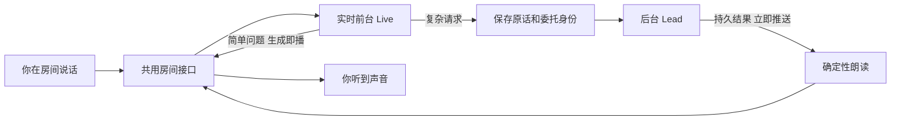

# FLY-2798 前台快答与后台 Lead — 实施计划
Issue: FLY-2798 (https://linear.app/geoforge3d/issue/FLY-2798/语音v4-引擎-a前台快答-后台-lead-在现有通用管道上让实时模型自己答简单的复杂的交给)
日期: 2026-09-23
基于: research.md

状态：待显式设计评审。范围：design-only；下列代码与测试是交给 Implement/QA 的施工要求，不是已完成声明。

## 1. 给 founder 看
简单问题由前台直接答；需要查、做或判断时，前台说「我问下 Lead」，后台收到你的完整原话，结果一准备好就推回来念。字幕始终区分「🤖 前台」与「💬 Lead」。

房间接口由 FLY-2796 统一，本单不再造一个。确定性朗读指把指定文字转为语音，不让模型改写；它与前台可能使用不同声音，V6 测试前明确说明。打断先马上停止本地声音，再重连前台保证旧答案不会回来；恢复耗时要实测披露，不能只给最理想数字。

完成标准：测试房 Raya 10 次简单问题，说完到人耳听到第一字每次 ≤2s，公布全分布；复杂任务真实交 Lead 并有结果；进来播报和会议带节奏可经同一个接口念出；字幕来源正确。现在仅形成方案，尚无这组验收结果。

## 2. 范围、权威与依赖
任务 G2 的六项裁定完整保留。前台自答已获 founder 批准；A 是 openai-live / gpt-live-1 新协议，不改 legacy Realtime 的 create_response 或「不得独立回答」策略；不另造 function tool。
Lead 问题回执 `f2fec268-75dc-4661-8257-918cf72d10a2`、`817101aa-c418-4fe2-ba6a-f1fd98169418` 是本计划范围依据，已向 Lead 报告采纳。它们不是 ship 或生产探针许可。

| 依赖/归属 | 本单消费的合同与验收 | 禁止代替 |
|---|---|---|
| FLY-2796 RoomIO v1 | ROOM_IO_VERSION=1；discord-room 底座；带 speaker/房间时间的帧；start/write/end/cancel 增量播放与背压；sustained barge-in；presence/health；audibleTail（估算）；lease/SessionSlot | 不复制收音/播放/Discord 房间，不另加进程 slot |
| FLY-2796 通用 carrier | 同一 handoffId / requestDigest；intentKind=query/judgment/action；完整原话 durable receipt；预先持久的可查询幂等键；授权 result commit + seq/outbox；query-by-key；generation 撤销 fence | 不新建 handoff DB、第二套状态机、伪造 Discord message ID |
| FLY-2796 transcript durability | 统一 TranscriptSink schema；可等待 append/flush + 按 sessionId/transcriptId/contentDigest 回读；写失败拒绝动作 | 不新建 TranscriptLog，不拿 flush resolve 当持久化证明 |
| 本单 voice-core V1 接口扩展 | 下文 types/capabilities/speak/adapter，提供给 V2/V3/B 使用；与 V2 共改类型时以同一导出为准 | 不重复定义 receipt/state enum |
| V2/V3 模式策略 | 意图构造、确认/复述/ship 授权、会中阶段/进来播报由模式层持有 | adapter 不执行 mutation、不 dispatch Runner |

上表是给 2796 的**消费需求**，不是声称其已落地。Lead 已确认 owner/base/version；2796 定稿后核对导出路径、方法、commit SHA，记录 dependency-lock。不满足时可以完成离线 adapter 测试，但不得宣称 room integration / V2/V3 联调完成。不得私自实现缺失依赖；差异退回 Lead 对齐。G1 的 /gemini、/eleven 兼容与同一 RoomIO implementation identity 验收由 2796 负责，V6 必须引用实际通过证据。

### 2.1 九项依赖：2796 定稿前全部待对齐
Lead `61d6f5c8-54aa-4e39-a88d-a0cc609ebdda` 已把消费清单转给 2796，要求逐项落点或不支持原因。下文涉及这些字段/API 的具体形状均为本单消费提案，不能自行当作上游定稿。
1. RoomIO start/write/end/cancel 的增量输出与背压。
2. sustained barge-in 事件、speaker 归属及统一 timeline。
3. generation-aware 帧、lease 与取消 fence 的接口。
4. query/judgment/action 的 intentKind 类型。
5. 完整原话的 transcript binding 与可等待持久回执。
6. I/O 前已落盘且可查询的 idempotencyKey。
7. 授权 Lead result commit event 与持久 replay cursor/outbox。
8. dispatch 前 generation fence 的原子校验。
9. 现有 claim/attemptToken 播放权威与恢复语义保持。

以上 9 项状态均为 **依赖 2796，待对齐**。实现 T0 必须把每项落点、接口版本和对应 conformance fixture 固定；没有落点的项报 Lead，禁止偷偷补第二实现。

## 3. 文件与实际组装路径
所有路径下文省略 packages/ 前缀。

| 路径 | 改动责任 |
|---|---|
| voice-core/src/types.ts、index.ts | 添加 V1 强类型导出、verbatim/attribution、source/稳定身份字段；老调用不变，V1 admission 显式检测 |
| voice-core/src/backends/openai-live/{GptLiveBackend,LiveSession,liveTransport,liveProtocol}.ts（新） | backend factory、协议边界、generation fencing、增量音频与标准事件；不 import teamlead |
| voice-core/src/backends/openai-live/{CompositeSpeech,LiveUtteranceAssembler}.ts（新） | 两张脸的独占播放、请求绑定 receipt；转写关联与封口 |
| voice-core/src/config.ts、factory.ts、backends/registry.ts | 显式 openai-live 与 announcer 配置、依赖注入、惰性构造、启动校验 |
| voice-core/src/backends/edge-tts/{EdgeTtsEngine,EdgeTtsBackend}.ts；stream-edge-tts.py（新） | 增量 TTS 输出，复用已有参数/错误规则；不再等整份 MP3 完成；旧 synthesize 兼容 |
| voice-codex/src/{config,cli,session,daemon,bridge-client}.ts | factory 实际接入；V1 session facade；订阅 replies；续租与消费分离；禁止 A 走旧全句自动 ingest |
| voice-codex/src/live-lead-adapter.ts（新） | 消费 V2 carrier/transcript/RoomIO；绑定 delegation 与 canonical handoff；取消与结果校验 |
| teamlead/src/bridge/{voice-session-routes,voice-session-services,voice-session-poller}.ts | 授权 result event → 现有 voice_outbound；受鉴权的事件流；A steady path 不再 poll Discord |
| teamlead/src/lead-backends/codex/{CodexLeadOutboundHandler,leadDiscordSend,capability-outbound}.ts 与 bridge/plugin.ts | 两种已存在发送入口均传递并校验 canonical reply binding；禁止把所有频道消息念出 |
| flywheel-comm/src/lead-inbox-nudge.ts；teamlead/src/bridge/lead-inbox-loop.ts | deliveryId 级 nudge 状态/及时补偿与计时，修复经回归复现的门铃故障 |
| voice-codex/src/{delivery,adapters}.ts | A 的完整原话走 carrier；Discord 限长镜像脱离关键路径；保留 legacy 行为 |

RoomIO 输出/转写持久化底层文件归 2796；本单仅接口集成。两单共享冲突通过正常合并解决，不覆盖另一个 owner 的实现。

## 4. V1 接口与兼容
在现有 ConversationSession 上提供 V1 扩展类型（`V1ConversationSession extends ConversationSession`），必需 `contractVersion:1`、`speak`、`onUtterance`、有效会话能力 getter；registry 的 V1 获取器运行时校验。旧 Gemini/Edge 的 legacy factory/调用仍可用；不把可选缺省当支持。不另造所有引擎的新基类。

| 方法 | A 的精确映射 |
|---|---|
| createConversation/open(ctx) | 新 WS → session.start → session.started；ctx 含 Lead 身份、已筛选 memory、模式/会议、退出规则；Live config 和 RoomIO lease 全检查 |
| sendAudio(frame,format) | 匹配协商 PCM16 mono 24k，必要重采样，20ms 按实际采样率持续送，静音也送；不突发快倒整文件 |
| endUserTurn | 记录 RoomIO 发言窗口关闭；不是 response.create，也不编造服务端 final |
| onUtterance / transcript | shared schema，原始 delta 去重/累积→应用封口，见 §5；display 与 durable/action 事件分开 |
| speak(text,kind,opts) | 显式 CompositeSpeech，见 §6；模式层不依赖供应商 |
| sendText | 兼容映射 speak(kind=control)，不冒充 user 原话 |
| injectContext | session.thinking.append，delegation_id=null；不进 transcript sink、不要求即时出声；含 500 token 单事件上限。需 quiet-output 测试；未证明 silent 时返回 unsupported，不能偷偷用 commentary |
| injectToolResult | A 不支持旧函数工具；抛 unsupported。Lead 结果只能经有 handoff/digest/generation 的 typed result API |
| interrupt | §7 全代 fence + RoomIO cancel；不把 native bargeIn 静态 flag 当成立证据 |
| close | fence 新效果、取消播放、flush transcript、session.close/closed（有界超时记 incomplete）、释放订阅；VoiceSessionState 由原 controller 结束 |

配置：backendId=openai-live、model=gpt-live-1、endpoint=wss://api.openai.com/v1/live/sessions、delegation=client，announcerId=edge-tts、announcer voice、协议版本、上下文上限/队列上限均显式。model/endpoint 不硬编码在 transport；部署配置钉这组默认，模式层不可改。端点要求 TLS 与服务端允许列表；API key 只在服务器认证头，不进文档/转写/日志。
启动校验 model/protocol/格式/RoomIO version、两面依赖、TTS decoder。Live 不支持的命令或权限/额度错误→明确「语音不可用」，不切 B/legacy；live admission 必须等完整握手。上下文组合必须保留 identity、memory、mode、退出规则，按 token 上限检查并显式拒绝超限，不静默截断。
Capabilities：native Live `verbatim=false`；composite 对 announcer 逐次 proof 能力为 true（不是对 Live 转写）；`attribution` 仅 RoomIO timeline 对齐实际合格后 true，单句 unknown 仍拒绝动作；`turnCancelOrSuppress` 由当前 generation fence 有效性给出；bargeIn 的最终值必须结合 RoomIO 检测+取消，不能只读 backend 静态值。V2/V3 按 V1 准入矩阵逐格检查，缺能力不是本单完成的替代品。

## 5. 原话、归属和委托绑定
标准 Utterance 增加 `sessionId, sessionGeneration, utteranceId, transcriptId, contentDigest, sequence, source, attribution, final, finalizationKind, start/end`。source 来自应用 origin（founder/frontend/lead）；不能读模型文字决定来源。attribution 是 known(speakerUserId) / unknown(reason)。

1. RoomIO 为发言窗口分配稳定 utteranceId，帧含 speaker 与 monotonic sample timeline。连接起点映射到同一时间轴。Live input delta 按 event_id 去重，保留原始空格、重复词与 start/end，不按文本 dedup。
2. delta 只在与一个 RoomIO owner 窗口可证明唯一关联时 known；跨窗口/重叠/时钟缺失→unknown，保存并展示。委托按 offset_ms 与该窗口关联，必须唯一；禁止 latest utterance 猜测。
3. 简单快答不等待持久封口才能出声，但不得由 partial 推动副作用。普通字幕段可用显示分段，标 final=false；停顿不充当 provider final。
4. 复杂 delegation 到达后等真实 RoomIO 发言结束；封存该 Live generation，按 §7 关旧连接并收尾 input deltas、flush，建立不可变 transcript revision。`finalizationKind=connection_sealed` 是**应用结束该代收集**，不是 Live 提供 final。断线/关闭超时、窗口缺片、无法唯一归属，仍记完整可得文本及 unknown/incomplete；不派发，明确请求澄清。不得用最后 delta 时间或超时冒充“原话完整”。
5. 将封存转写交 V2 durability API，回读 sessionId+transcriptId+digest 相等才给模式层 final receipt。更新不得改已提交原话；补充话使用新 revision/新 handoff，不重复旧动作。用户插话 generation fence 不应删除用户输入；禁止的是旧 assistant/业务效果。
6. 模式层用完整 canonical 原话构造 intent；query/judgment 只读，action 必须 V2 已有 authority/readback gate，Live 只请求帮助。未知说话人禁副作用；本设计对不能唯一关联的只读委托也请求澄清，保留 utterance。
7. 持久绑定键 `(sessionId, generation, delegation.id)` → `handoffId, transcriptId, requestDigest, modeOperationId`；carrier 的 idempotencyKey 由业务操作生成并在 I/O 前保存。重复 delegation 复用绑定；同键异 digest 拒绝；重连 delegation.id 不复用成业务键。对同一已存在业务操作的重复请求查询原 handoff，不自动创建第二次 mutation。
8. 通用 carrier 保留 V1 authorized→dispatching→dispatched→committed/rejected/ambiguous→needs_human 的唯一状态机；stale dispatching 只读对账，所有变更 CAS+lease；queryable key 在 I/O 前存在。不会读回的 mutation 默认拒绝；human-recovery-only 必须模式显式声明。任何 comm ACK 不是业务 committed。
9. 原话不受 1800 字镜像限制；配置 maxTranscriptBytes 明确超限失败，绝不截短再执行。内部记录按既有私有目录权限保存，公开 Discord/HTML 只使用脱敏投影；要脱敏则标记投影，不改变 canonical digest。

委托后的「我问下 Lead」首选 Live prompt 在模型请求帮助前说出；应用依转写确认是否已说，缺失时以 frontend 来源 cue 补一次，不能把这句当作 Lead 已消费或动作已完成证据。

## 6. speak、流式播放与字幕
### 6.1 请求与回执
逐字复用 V1 research §4.1 的 `SpeakReceipt` union：pendingKey/requestDigest + rejected(none/none)、failed(none|submitted/proof)、completed(submitted|playback_drained/proof)。所有字段必填；required 无 proof 必须 failed；本机目前只给 submitted。
requestDigest 绑定 sessionId/generation/text/kind/resolved verification/voice/format，以及关联操作的 authorityBinding digest（如有）。同 pendingKey 同 digest 返回同 Promise；不同 digest rejected/pending_key_conflict；取消/重连后不能复用旧 proof。
默认 verification：question/readback/cue=required，brief=best_effort，heartbeat/control=none。V2 进来播报明确 required。副作用 arm 谓词原样消费 V1：completed + 正向 proof enum + 独立重算 key/digest 等值 + audibleTail（估算）drained；不得把 receipt 自报 digest 当期望值。

### 6.2 两张脸的固定分工
- 自主快答：Live 原生流式输出，source=frontend，不借道 speak 排队。
- text-bearing speak（brief/question/readback/heartbeat/cue）和已持久 Lead 结果：显式 announcer face，经同 RoomIO 输出，来源来自调用者绑定；Lead 原话无改写，避免无 turn ID 时把前台新话错标 Lead。Live 得到 thinking 上下文用于继续对话，不用它重复念结果。
- control：通过 commentary/应用指令要求前台带节奏，source=frontend、proof=none，不允许 required；有限控制请求若无法证明完成，超时 failed，不把 commentary ACK 当 completed。V3 需要确定念完的开场/提问必须用 brief/question，而不是伪装 control。
- Live 内部 delegation result 可回 thinking.append 做背景；正确 id 只用于尚存的原代；旧代已关闭的结果恢复到新代时用 null session context，并保留 handoff binding。不得向新连接塞旧 delegation.id。业务结果只由 carrier receipt 认定。

### 6.3 无整段缓存
Live delta 到达即按格式送 RoomIO.write；不等转写、不 concat 全段。RoomIO 只需有限抖动缓冲，默认 100ms、硬上限 2s（48kB/s PCM24k mono），write 返回背压 Promise。持续背压或超限→停止该输出、明确 failed，不丢帧后继续假称完整。
现有 EdgeTtsEngine 是文件型，不能直接声称满足。新增 streaming synthesis face：受控 Python helper 使用 edge_tts 的音频迭代流，经二进制 stdout → 单个受控 decoder → PCM16 mono 24k → 同 RoomIO.write；元数据/错误走独立 stderr/结构管道，正文经私有 stdin/文件，不能 shell 拼参。TTS 进程正常结束、精确输入 digest、完整生成/解码字节计数及连续 chunk seq 构成 deterministic_tts proof；错误/截断/取消缺任一项→failed。实现先验证所钉 edge_tts 版本 streaming API，不增加云账户。
每个 speak 单独的 synthesis ID 关联源文字、voice/format、PCM hash；即使音频已提交后才发现后段失败，receipt 仍 failed/submitted，不能 arm。流式生成无需整句回读缓存，既有 synthesize 仅为老调用保留。
同一房间只有一个 output owner。announcer 占用前 fence 并关闭 Live 旧输出代，暂停新 Live 播放；期间输入帧带身份有界保存。announcer 结束/取消再新建 Live，注入已播报结果与未完成任务状态，回放输入一次。输入缓冲上限默认 30s，溢出明确「语音暂不可用，请重说」，保留到达记录与 overflow 证据；不静默吞话。连续长播报须分段给输入恢复机会；每段仍共享请求 receipt，所有段成功才 completed。
这个声音切换与恢复等待是已获 Lead 接受的成本，QA 必须给真实可听证据，不能用切换次数代替体验。

### 6.4 字幕与不可信内容
Live output 只标 🤖 前台；经 carrier 校验的 Lead 结果/announcer 标 💬 Lead（leadId 用权威映射到显示名）。已播报 Lead 文本与实际播放进度分开，pending/partial/interrupted 清晰；不要一开始就标整段已念完。保留已说出的 interrupted 片段，取消后旧片段不再追加为有效字幕。日志可记 late/suppressed 审计，不能喂模式动作池。
Discord 禁 mentions，HTML 对所有派生字段 escape；浏览器只 textContent/value，不拼 innerHTML。状态消息不冒充 Lead 回复（例如进房提示不得被作为工作结果朗读）。

## 7. turnCancelOrSuppress 与连接恢复
取消入口由 RoomIO sustained barge-in 给出，不以 assistant 回声或短 backchannel 触发。具体能量/时长阈值归 RoomIO；effective capability 包含 RoomIO 实际配置。
取消操作先同步设置本地 generation tombstone，RoomIO.flush/cancel 立即执行；中止该代排队 speak/await 回调/未 dispatch 委托；通知 carrier 撤销该代未派发请求。随后关旧 WS，所有 handler 捕获 generation，在任何 await 后、播放写入前、转写发布前、delegation dispatch 前、result 注入前再次校验。旧代永不恢复；晚到 provider 音频即使没有 ID 也可按其 socket 归属丢弃。
撤销与外部提交有竞态：V2 carrier 在 dispatch 的 CAS 原子核对 generation/authority；已经 dispatch 的动作只能继续按原 operation 查询，不能声称被撤回，也不自动重发。结果保留在持久 carrier；新 generation 由模式重新决定是否播报，但不会重做动作。
新 WS session.started 后以新 generation 出声；VoiceSessionState/room lease/slot 不变。启动上下文仅含已持久 user/已确认结果，排除被 fence 的旧 assistant 草稿。interrupt 时的输入从 RoomIO 环形缓冲首帧保存，按采样率播放到新连接一次；延迟/容量超过配置则失败可见，不能丢首字。
原会话失去 lease/用户退房/controller ending：全局 fence，终止输入补发、取消 TTS/订阅、不再重连。仅连接断开可以同一 backend 有界重连，不自动改模型；连续失败由现有 controller 报语音不可用。

## 8. 去双轮询与修门铃
### 8.1 已有权威上的事件推送
V2 carrier commit canonical Lead result（含 project/lead/session/handoff/requestDigest、resultId、full text、seq）时写同一事务 outbox；本单订阅 commit hook，投影到既有 voice_outbound。不能先发通知再落记录；不能把任意频道 bot 文本当 canonical result。
Codex 的 send API 与 broker 入口都使用同一个授权 result adapter；server 从 frozen mailbox delivery/handoff binding 推导 voice reply route，调用者自报 handoffId 只能匹配检查。Claude 路径也接相同 carrier result adapter；未支持时相应会话启动明确不可用，不把 FLY-2711 起会修复吞入本单。
Discord mirror 与 voice 投递互不阻塞，canonical result 是一次正文；Discord 分片 ID 仅关联展示，不能生成多次朗读。崩溃后按 V2 durable outbox 重建 voice_outbound，一条 resultId 唯一插入；不重发 Lead mutation。
Bridge 加 `GET /api/voice/sessions/:id/events`（拟名）：主认证 + X-Voice-Lease + session/project/lead 绑定；header cursor，不在 URL 放凭据。先注册订阅，再读取持久 high-water 与 backlog，重叠按 seq 去重；通知只带 seq/result identity，正文从已鉴权存储取。
客户端收到后立即唤醒现有 list/claim→speak→finish 流程，claim/attemptToken 仍是唯一播放权威。续租独立定时，不能借 SSE 长连接保活绕过 lease。lease 轮换/终结立刻关闭订阅；客户端断线重连按持久 cursor 补读，保留 claim 中的 ambiguous、不自动重播已可能出声项。连接缓冲有界，满则断开重连补读，绝不跳过 seq。
A steady path 完全不运行 Discord 3s poll，也不等 daemon 4s 循环；poller 仅 legacy 明确选项及断线后的有限补账，不能热路径双写。遗留 poll 修复也使用同一 result identity，无法关联的频道消息只供人工查看。

### 8.2 门铃的可验证修复
门铃已存在，12.7s 根因未定位。为每个 handoff/deliveryId 记录：durable_commit_at、nudge_sent/accepted/error、inbox_tick_started、admission（含 busy/backpressure 原因）、transport_receipted、model_consumed、lead_result_committed。模型消费必须来自 runtime turn 输入/回复关联，不从 socket ACK 推断。
A 启动必须校验有效 BRIDGE_URL；nudge 失败/跳过返回明确结果。对已经持久的同 delivery 允许再次 nudge（不再 ingest），忙 tick coalesce 后保证马上补一轮。Bridge 重启从 durable pending 恢复扫描，异常补偿是事件丢失恢复，不是每次等固定轮询。
先用缺 URL、HTTP 失败、busy tick、重复 nudge、restart 回归复现；只有能由代码与时间证据归因的故障才改。Lead 真忙的串行等待如实显示「Lead 正在处理」，不另开 app-server 或绕过 mailbox lease 插队。QA 仍需证明不再有无说明的空等，未证明则此项不通过。

## 9. 实施顺序与相关测试
每任务依次：写会失败的相关测试→跑出预期失败→最小实现→相关测试通过→提交。禁止本机全量。

| # | 任务 | RED/验收用例 | 命令/证据 |
|---|---|---|---|
| T0 | 锁 2796 依赖版本及 public exports | 缺 RoomIO v1/carrier/durability 明确拒绝 | dependency-lock 记录 commit、导出、双单联调 fixture |
| T1 | V1 types/config/factory 与 CLI 选择 | 实际选 openai-live；模型/协议不符、announcer 缺失拒绝；旧 Gemini/Edge 不回归 | pnpm --filter flywheel-voice-core test -- src/__tests__/registry.test.ts src/__tests__/cli-factory.test.ts src/__tests__/public-exports.test.ts |
| T2 | Live transport/stream/generation | session.started 前拒绝输入；无 done 协议 fixture；按序音频首 chunk 即播放；旧代 late event 全 fence | 新 src/__tests__/openai-live.test.ts；voice-codex audio/session/discord-room 相关套件 |
| T3 | Utterance + carrier 消费 | 重叠窗口、unknown、late delta、close timeout、重复相同话、长于1800、持久化失败、错 digest；不得错人动作 | 新 live-lead-adapter.test.ts + V2 shared conformance fixtures |
| T4 | CompositeSpeak/stream announcer | 同 key 异 digest；required 无 proof；decoder 截断；生成中先播；取消后无新帧；背压/输入 overflow | 新 composite-speech.test.ts、edge-tts-stream.test.ts；原 edge-tts.test.ts |
| T5 | 授权 result→push→claim | producer commit crash、两 Codex 入口、Claude adapter、伪造 origin、错误 session/lease、snapshot/live race、断线 seq gap、ambiguous 不重播 | teamlead voice-session-routes.test.ts、voice-session-poller.test.ts、StateStore.voice-session.test.ts；daemon/bridge-client.test.ts |
| T6 | 门铃具体回归 | 缺 URL/忙 tick/重试/恢复；区分模型消费和 transport ACK | flywheel-comm lead-inbox-nudge.test.ts；teamlead lead-inbox-loop.test.ts |
| T7 | 联调/QA交接 | V2进来播报 required receipt；V3 brief/question/control、silent context、真实打断 | V1 conformance fixtures + 下表真实证据 |

测试路径以仓内实际 __tests__ 目录为准；新测试放各改动包 src/__tests__。分别执行 `pnpm --filter flywheel-voice-core typecheck`、`pnpm --filter flywheel-voice-codex typecheck`；teamlead/flywheel-comm 仅针对变更的 tests/typecheck。全量 tests/build 留 PR CI；设计阶段不运行这些尚不存在的实现测试。

## 10. QA 明细：不能缩小判据
| 条件 | 必需留痕与判定 |
|---|---|
| 简单快答 10次 | 固定测试房 Raya、同 RoomIO implementation identity/lease/config、同一录音声道口径；每次人声结束→听到首个实际回答字，报告10值、min/median/p90/max与失败/漏答；每次≤2000ms，等待音/提示词不算回答首字 |
| 复杂 query / judgment / action | 各真实用例，完整原话+durability、delegation↔handoff、mailbox/consume、Lead result、可见落地；只读无 mutation；action 服从独立权限，不用测试指令替代 founder 批准 |
| 双轮询已移除 | 关闭 A Discord poll & reply sleep 后仍收到结果；commit→notification→claim→audio 四段时间，断线恢复对照；续租仍正常 |
| 门铃空等 | idle 与 busy 各覆盖；每个 delivery 的全部时间线及等待原因；复现原问题或等价丢 nudge 后立刻恢复；不把 ACK 当模型消费 |
| 打断 10次 | 同一录音与事件时间轴分别给：插话首帧→旧声音停止、本地 flush 时间、→新连接就绪、→新答案可听；各10值分布；旧 generation 从取消到终结音频/有效字幕/委托/回送零泄漏；其中穿插网络晚帧/后台已 dispatch |
| 输入不丢 | 插话首字、长句、两人重叠、重连缓冲上限/溢出；可得文本全部保留，overflow 明确报错，不静默丢 |
| V2/V3 | V2 进来播报 required proof 才 ack；V3 真实开场/问答/带节奏及 R-12；silent injectContext 实测无新增输出。依赖未齐写 pending，不用 fake 测试替代联调 |
| 字幕 | 前台快答/询问 Lead/cue 标前台；权威 Lead 文本标Lead；混入旧代、错误 handoff、untrusted channel 消息不能被标Lead；多段/取消的进度诚实 |
| K6与兼容 | 无额度/无权限/错误协议任一面失败明确语音不可用，无切引擎；V6预告两面声音可能不同；legacy/Gemini/Eleven 的相关兼容由同一房间版本验 |

所有性能证据包含 commit、模型/endpoint（无 key）、backend/announcer voice、RoomIO版本与实现 SHA、session/generation、硬件/录音时钟、样本与原始文件hash。不能拿 15fe2c875 的文字时间、单场探针或历史 38/18秒当 A 的成绩。

## 11. 迁移、回滚、排除
只对显式选择 openai-live composite 的新会话启用；已有 legacy 会话按原协议终结，不热替换。扩展字段允许老历史记录读取为 legacy/unknown，无重写旧 evidence；能力缺省 false；新 carrier schema 归 2796 additive migration。
回滚关闭新会话选择并由既有 controller 结束当前 A；旧代所有效果 fence，保留 outbox/handoff/transcript 供对账。配置 rollback 由独立 updater/授权运维执行，本设计不部署。不能回滚 DB 抹去可能已经执行的 action，不能重放 ambiguous。
FLY-2767/2773/2711 不做；仅对真实对比 blocker 具名最小修补，单列 PR；不增加会议产品功能、ship 权限或第二个 app-server。最终实现必须保留上述所有 acceptance，不能以能力关闭或依赖未齐宣称任务已完成。
