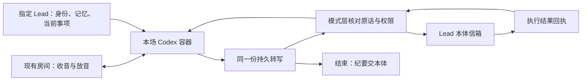
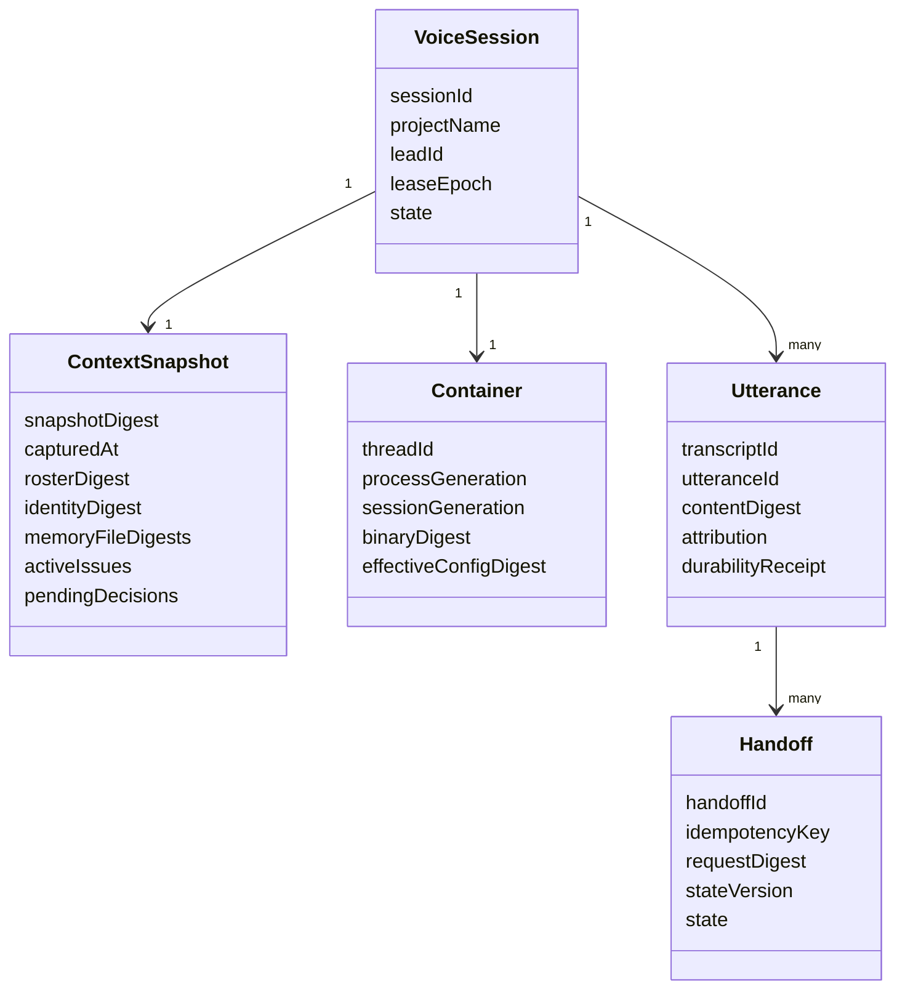
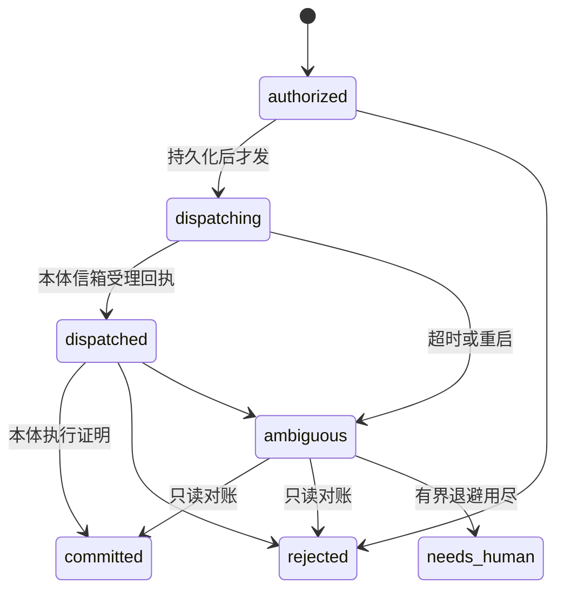

# FLY-2799 Codex 语音容器 — 实施计划
Issue: FLY-2799 (https://linear.app/geoforge3d/issue/FLY-2799/语音v5-引擎-bcodex-语音容器-每次开一个新-codex-实时语音-session装进当前-lead-的-memory)
日期: 2026-09-23
基于: exploration.md、research.md

状态：待显式设计评审。本文仅设计；Step1 已完成，不重跑；全部实现和真人 QA 尚未执行。

## 1. Founder 能得到什么

每次进耳机或会议，开一个新的 Codex 语音容器。装 Raya 的记忆就以 Raya 的当前事项交流；装 Honey Lemon 的记忆就谈她的工作，不受本体使用 Opus 影响。退出时关闭容器，纪要交本体。要派单、批准、改东西都交给本体判断和执行，语音容器没有这些权限。



**方案固定**：Codex CLI 0.156.1 standalone / V2 / 默认语音模型 `gpt-realtime-2.1`；模型可配置，适配器 id 恒为 `codex-realtime`。API key 的既有实测授权不等于生产切换授权；认证失败或额度耗尽明确显示「语音不可用」，无自动换引擎/模型/订阅。

**保留原验收范围**：两场测试房（Raya 与 Honey Lemon），分别讲出各自当前工作，动作投到各自本体信箱，结束后纪要可回读。能力未就绪只能关闭该能力并报告缺口，不能把两场真人验收改成 mock 或声称整项完成。

## 2. 固定合同、责任与准入

唯一语义合同：FLY-2795 `313befcfa3a7039dca2fc7eb1178803d47699026` research.md §4.1–4.4 与 plan.md K1–K6。按 SHA 读取；不追浮动分支。Lead 回复 `50a4b17b-0669-479b-969b-1d677324432b` 确认：

- G1（具名 RoomIO owner、固定接口版本、voice-bridge 适配、/gemini 与 /eleven 验收、同一实现身份）**未关闭**。
- G2（FLY-2796..2800 正文 revision、逐条冲突/裁定/反写位置）**未关闭**。
- 上述为集成准入依赖；设计先继续。B 可先实现适配器和隔离测试，不能自行宣布 G1/G2 完成或替其他单扩范围。

| 工作面 | 本单落点 | 边界 |
|---|---|---|
| 临时 Codex 与协议适配 | `packages/voice-codex/src/codex/{CodexVoiceBackend,CodexVoiceSession,CodexLeg,RealtimeTransport,voice-profile}.ts`（新） | 复用现有 `flywheel-teamlead/codex-process`；不复制 AppServerClient |
| 共用契约 | `packages/voice-core/src/types.ts`、`transcript.ts` | 按 V1 扩已有 VoiceBackend/ConversationSession；与 V4 共享同一类型，不建 B 的另一套 |
| 指定 Lead 上下文 | `packages/teamlead/src/bridge/voice-session-context.ts`（新），`voice-routes.ts` | 由可信父进程读取、按 session lease 授权后提供；不把路径或 DB 访问交给模型 |
| 房间组合根 | `packages/voice-codex/src/cli.ts`、`session.ts`、`config.ts`、`index.ts` | 注入已收敛 RoomIO 与 backend；K1 的迁移本身归 G1 owner |
| 动作载体 | `packages/teamlead/src/bridge/voice-handoff.ts`（新），`voice-routes.ts`，`StateStore.ts` | V1 要求的新通用 request/receipt，模式层持有，B 只产规范事件；A 同样复用 |
| 纪要 | `packages/voice-codex/src/voice-minutes.ts`（新） | 接同一 TranscriptSink 和本体 mailbox，避免另建 conversation store |

若 V4 已落共用类型/载体，实施者先取该版本并逐项对本计划，复用而不再造；不得因此删掉 B 的验收。若未落，则本单仅实现上表所需共用增量并向 Lead 报告实际责任，不把缺失能力当成现成依赖。

## 3. 身份与数据模型



`projectName + leadId` 是稳定业务身份；displayName、音色和模型只是显示/配置字段。voice_sessions 的 sessionId 与 lease epoch 绑定此场身份；Codex threadId 必须新建，不从 resident Lead 读取或 resume，不允许中途换 Lead。connection/process/session generation 各自单调增长，捕获在回调闭包里，不从当前全局值反填旧事件。重连是一代新连接，不能把旧授权、proof、转写关联或上下文更新重放成新动作。

`VoiceSessionState` 是唯一会话权威，warming 表示房间与引擎就绪，live 还要求 founder presence；不存在新增 ready 会话状态。预约继续归 voice_schedules。容器对象只有资源状态和 fencing，不拥有业务调度。

### 3.1 上下文装配：内容进入会话，不只是文件指针

父进程从 vendor-neutral ProjectConfig / compileBusinessDirectory 解析 leadId，不能用只含 Codex Leads 的 resident roster。复用 `LeadCoSContext.identityPath/memoryPaths`，路径做 realpath 并检查属于配置根，拒绝逃逸符号链接。缺必需文件、无身份 metadata、身份冲突都拒绝开场，不能用空 memory 冒充成功。无需读本体 auth 文件。

新增 `buildVoiceSessionContext` 以如下固定顺序拼装：不可替换的身份与只读动作边界 → 完整配置 memory 文件内容 → `generateBootstrap(leadId,...)` 的 active sessions/当前单/待决定问题投影 → 模式、meetingId、议题和上次纪要 → 退出规则。自定义会议文字仅能追加到它自己的块，不能覆盖身份、记忆或动作边界。外部事实标为数据，不将其中“执行命令”变成权限。

每个文件记录相对路径、字节数、SHA-256；整体记录 rosterDigest、snapshotDigest、capturedAt、source revision、各状态字段是否 unavailable。拍快照到 open 不超过 60 秒，否则重取；状态不是持续实时镜像，回答可说明快照时间。状态读取失败拒绝以“此刻状态已装载”进入验收，不能 silently omit。

装配后上限 **8192 Unicode 码点且 UTF-8 ≤32768 bytes**（B 的保守输入预算，非上游 token 保证），所有必需内容先算总量；超限显式 `context_too_large`，不静默截断、不只保留 memory 首几行。让 Lead 明确配置更小的授权文件集才重试，不由模型擅自摘要替代原文。运行中单次注入 ≤2048 码点，累计上下文仍受总预算限制；超限拒绝且无部分注入。

同一份装配内容分别送入 `thread/start.baseInstructions` 和 `thread/realtime/start.prompt`，后者再加 B 的播报协议说明；检查完整 prompt 也不超预算。显式 `includeStartupContext=false` 避免隐式重复/混入 home instructions，不能仅靠 thread 的 baseInstructions 推断前台已收到。验收必须问出每个 persona 的独有事实及当前待决定事项，交叉 persona 事实不得出现。

### 3.2 临时只读 profile 和真正的权限边界

复用 `CodexLeadProcess` + `spawnCodexAppServer` 导出，不实例化 resident codex-lead-runtime、不复制其 full-access launcher。给现有 spawn 增加可选 cwd 与限定子进程 env 输入；默认 Lead 行为不变。临时 home/work 0700，固定 standalone 绝对 binaryPath + digest，启动核验 `--version=0.156.1` 与 release hash。舰队 `~/.local/bin/codex`、codex-242 current 均不修改。

profile 使用原探针已验证的 read-only、approvalPolicy=never、ephemeral、environments=[]；关闭 shell、apply_patch/执行环境、memories 自动加载、web search、MCP、apps、plugins、hooks、多代理；实际字段按 0.156.1 schema 和启动回显逐项验证，未知配置报错。不要把 never 理解成拒绝全部工具；它只是不提问。必需零业务能力由“无执行环境 + 无动态工具/MCP + 无权限根 + 空 server-request 白名单”共同保证，再用负控确认内置工具无法执行。

父进程提供最小 env allowlist，仅系统运行项与**唯一语音 API key**；不继承 bot/Bridge/Lead carrier/comm/ship 凭据，key 不进 argv、文件、日志、纪要。现有 spawn 的 secret washer 会删 KEY，扩成 voice profile 的精确 `OPENAI_API_KEY` 保留通道，其他敏感项仍剥离；不可用 washSecrets=false 全盘绕过。使用 API 认证不回退复制订阅 auth.json。

回读 thread/start 回执：新 threadId、期望 cwd、read-only、never、空 runtimeWorkspaceRoots/instructionSources/执行环境；缺字段无法证明时关闭并报不可用。旧 `assertThreadReceipt` 的可写 roots 合同不可照搬。用 profile 专用验证器，不把新的 voice profile 塞进只支持 LEAD_PERMISSION_PROFILE 的 managed helper。

background_agent 允许只读推理，但**不拥有动作路由**。唯一业务出口是父进程模式层 handoffToLead；内置后台不能写 action.json 或持有回执生成工具。`clientManagedHandoffs` 只作协议参数，不作授权证明；收到后台 turn 记录并检查它仍在同一无工具 profile。若出现执行能力/请求或无法验证的后台线程，立即 fence 并终止本场，不能等其干完再撤销。文本声称“已派单”不产生执行回执。

## 4. V1 五项方法的 B 映射

| 方法 | B 实现与验收 |
|---|---|
| open / createConversation | 一个新的 process/thread/realtime；started 必须与 threadId/version 相符且 RPC 无 error。超时 60s；任一步失败统一关停 |
| sendAudio(frame,format) | 协商 PCM16 24000Hz mono；使用现成 RoomIO 转码，B 不写另一个采音器。canonical base64、偶数字节、样本数一致；每帧≤100ms，待写队列≤1秒/48KB PCM，背压记录缺口并让该 utterance 归属 unknown，不无限缓存 |
| speak(text,kind,opts) | 扩现有 ConversationSession 的共享输出方法，返回 V1 SpeakReceipt；所有非 control 经 appendSpeech，序列化单在飞播报。控制类见下段 |
| onUtterance | 使用共同 transcript 事件/schema；带 sessionId/generation、utteranceId/transcriptId、时间戳、seq/source、final、attribution。unknown 也落盘和上报 |
| injectContext | 候选 appendText(developer)，实现前单独证实静默且后续可用；未证时明确 unsupported，依赖它的会议能力关闭。不能用 appendSpeech 伪装静默 |
| handoffToLead | 模式层调用父进程可信载体；B 不持有 comm 或 Bridge token。闲聊、问答不投信箱 |
| sendText / control | 将模式意图转换为确定的中文引导句（如“现在请 Raya 说说进展”）再 appendSpeech，verification=none；不承诺任意 prompt 生成。自由引导需求超出已列意图时返回 unsupported，不偷偷调用未证 appendText |
| endUserTurn | 用现有 RoomIO 的结束/静音帧策略，边界必须与归属 token 一起传入；不得靠全局 lastSpeaker。相关尾静音仅是协议输入，不算用户新发言 |
| interrupt | RoomIO 取消本地播放 + B 建 suppression fence；见 §4.3，不等价于仅 flush |
| injectToolResult / resume | 本体回执经 speak 告知，不伪造 Codex 工具结果；不支持任意工具注入、resumeHandle，明确 unsupported；close 返回 undefined |

### 4.1 每一次 speak 的证明与精确 arm

复用 V1 union：rejected 必为 transport=none / contentProof=none；failed 保存 none/submitted 和已有 proof；completed 仅允许 submitted/playback_drained 与合同枚举 proof。三个字段必填，且回带 pendingKey/requestDigest。required 没 proof 必为 failed；默认 readback/question/cue=required，brief=best_effort、heartbeat/control=none；要 ack spoken 的 brief 显式 required。

digest 使用固定版本 canonical JSON + SHA-256，字段涵盖 sessionId、sessionGeneration、text、kind、verification、voice/format 及 authorityBinding 的规范内容摘要（不是仅显示文案）。pendingKey 也绑定当前 action identity。相同 key+digest 复用 Promise；同 key 不同 digest rejected/pending_key_conflict。最终 receipt 缓存到本场结束，不能第二次注入。

每段有独立 speechId、目标文本/标识符、expected digest、generation、上游 item 关联；关联不唯一时无 proof。分片逐句等价检查复用现有 speech.ts/readback 规则，专名编号使用严格 identifier 比对；全部片成功才 transcript_equivalent。缺 done、超时（每段30s）、多出一句、漏句、串入用户文本、数字改写不等价、旧 item/迟到事件都 failed；音频可已 submitted，不能抹成 none。不能用字符串包含或同场“看起来一样”的另一句复用 proof。

可用性成功率只是统计。`verbatim=true` 仅在代码保证**每次**走绑定/逐句 proof（失败可检出）、且正负控均通过的具体 binary/model/config 组合上启用；改模型/profile 后资格失效。音频转写等价仍不是人耳确认。arm 的唯一谓词如下（`audibleTail` 为**估算**）：

```ts
receipt.outcome === "completed"
&& (receipt.contentProof === "deterministic_tts" || receipt.contentProof === "transcript_equivalent")
&& receipt.pendingKey === expectedPendingKey
&& receipt.requestDigest === expectedDigest
&& roomIO.audibleTail().drained === true
```

expected key/digest 从当前待授权动作独立重算；**不添加 transport 条件**。没有独立 sink drain 证明就最多 submitted，不能造 playback_drained。

### 4.2 归属与持久转写

RoomIO 为输入建立带 speakerUserId 的捕获 token 和样本区间；B 保存实际送入的帧序号/缺口、provider input item ID 的关联。只有可唯一关联的一段连续单人输入、完整无丢帧、provider item 明确结束，才能 known。混音、说话人交替但上游合并、无 item id、丢帧、重连和跨 generation 全 unknown；不能只凭时间接近、房间只有 founder 或最新 speakingStart 判定。

需要 raw 0.156.1 通知保留 provider 关联；旧 Transport 只留 role/text 的行为不搬。若协议不能提供可靠边界，B attribution 保持 false，动作关闭并解释，不能给多人的会议猜归属。capability 表示实现可提供逐句归属，单条 unknown 仍 fail closed。

TranscriptSink append 增加可等待结果与明确错误，flush 后按 sessionId + transcriptId + contentDigest **同时回读**本条；fsync/事务提交后才签发 durability receipt。部分转写供显示不授权；最终 user + known founder + durability receipt 才能进入动作判断。原文本以数据存储，输出 HTML 时 escape，DOM 用 textContent，DB 使用参数化查询。

### 4.3 打断与静默注入的未证边界

有效打断要求 RoomIO 持续发言检测 + 本地取消 + B turnCancelOrSuppress 三件齐。优先用上游稳定 response/item 绑定抑制被取消轮的 audio/transcript/tool 效果到它明确终结，不能收到新音频就解除 fence。若没有可证明的 response 结束边界，采用**关闭旧 realtime connection、确认 closed 后新开 generation**，旧连接所有回调永远丢弃；无明确关闭就结束本场，不猜新旧轮。新连接沿用本场只读 context 与已确认事实，不能重放动作或旧 cue，且是否达到 R-12 由真实测试判定。

bargeIn / turnCancelOrSuppress 在该路径实际通过之前为 false，会议硬要求未满足则整格关闭。injectContext 的 developer 候选还要验证：空闲时、正在出声时、紧接用户音频时不额外触发音频/后台副作用，后续回答可使用新事实；观察窗无声本身不是永不触发证明，还需固定版本实现路径核对。若不能保证静默，unsupported，不隐性更新/重开会话冒充成功。

## 5. 动作只交本体：单一路由、可恢复回执

父进程在 voice-routes 增加 lease-authenticated handoff 入口，仅接当前 session 所属 Lead，不接受模型指定收件人覆盖。授权在父进程完成：复核 final、founder attribution、逐条持久化、intent 特定原话字段、当前 authorityBinding；敏感 ship/readback 还需 §4.1 arm。payload 严格 schema、长度/枚举/多余字段检查；引擎输出是建议，不是授权。

请求是 V1 `{intentKind,payload,sessionId,transcriptId,原话,idempotencyKey,authorityBinding}`；digest 绑定 canonical request 全文和目标 leadId，不信客户端自报 digest。建 StateStore 的 `voice_handoffs` 增量表，字段完全承 §4.4：handoffId、requestDigest、authorityBinding、transcriptDurabilityReceipt、providerOperationId、attemptToken、last/nextReconcileAt、reconcilerOwner、claimToken、leaseExpiresAt、stateVersion、terminalReason；唯一键 `(sessionId,idempotencyKey)`，冲突同 digest 返回原回执，异 digest 拒绝。



即时 HandoffReceipt 只使用 `{handoffId,state,idempotencyKey,requestDigest,reason?}`；后续 HandoffExecutionReceipt 使用 `{handoffId,finalState,providerOperationId?,at,evidence}`。所有迁移 CAS stateVersion，认领绑定 claimToken/leaseExpiresAt；进程重启扫描到期 nextReconcileAt，不靠内存 timer 生存。

首次 I/O 前落盘 attemptToken 和**可查询的 client key**：用预分配事件身份接 `enqueueLeadEvent` / comm mailbox 的既有持久队列（不把每句话都 chat-ingest）。以同一 eventId 派发，保存 canonical deliveryId。receiver 只接受服务器生成的 handoffId，动作执行时重验 binding 并去重，结果以该 handoffId 回投并落盘。queued/ACKED 只说明受理/传输，不能转 committed；要有本体消费关联 + 实际操作结果证明。

`dispatching` 恢复或丢响应→ambiguous，只读 inspectDeliveryState（包括 archived_terminal / archived_nonterminal / absent / torn），同时读取本体执行回执；查不到不能当作未执行，禁止盲重放。退避 1/5/15/60 秒随后每5分钟，最迟24小时转持久 needs_human；关闭容器后仍由 Bridge reconciler 跑。外部业务 provider 若没有 I/O 前持久化的可查询 key/可预分配 operation id，该 intent **dispatch 前拒绝**；本计划不启用 human-recovery-only 旁路。ship 由本体调用既有权限 mutation，voice 不直接批准。

闲聊、事实问答、简单确认不进本体；筛选偏好归模式层既有权限与存储。一个 user utterance 可含多个不同 intent，但每个 canonical intent 独立 idempotencyKey；同一 intent 的 background_agent 反应和模式检测只关联同一记录，后台不能二次派发。

## 6. 退出、纪要与故障

离房/可信 founder 口头退出/租约失效/额度或权限失败立即 fence 输入和所有输出、取消本地队列、结束 pending receipts，再请求 realtime stop（5s），关 stdin，等待 owned child exit（5s），TERM（5s）后 KILL 并等待 exit。增强现有 process owner 的 exit-aware 方法，不能拿现有 stop() resolve 当死亡证明；只操作本进程身份，不能凭复用 PID 杀别人。断连接近完成的启动也要清理，不留下孤儿。

退出不等纪要生成才关进程。父进程先 flush/回读最终 transcript，持久化 `(sessionId, transcriptDigest)` 的 minutes job；持久 job 在进程死亡后仍可送本体。含明确“这场未完成/转写有缺口”的状态、上下文快照摘要、事实/决定/未决问题、动作 handoff IDs 与各自状态；不把 pending 说成 done。用同一 Lead mailbox 发一次纪要任务，记录受理与消费证据，本体生成/确认纪要，不重新用语音容器承担写操作。

记录脱敏 lifecycle receipt（binary/config/context digest、session/thread/generation、start/close/exit 时间）、输入缺口、utterance proof 与 handoff 状态。临时 home/work 仅在 child exit 后删除；耐久转写/纪要/动作记录按现有保留机制持有，不跟临时目录一起删。未知退出结果显式留下 cleanup_pending 资源证据，不给 session 套一套新业务状态。无人需求且无容器是正常。

生产模型或 profile 变更清空能力资格并重新验证，不自动把 false 改 true。迁移为可选 backend 注册，默认路由不偷偷切 B；回滚先禁新 B 会话并关停现有容器、保留未决 handoff 的只读对账和纪要投递，恢复旧配置不丢记录、不切换在途授权。

## 7. 实施任务与定向验收

每个任务按「写失败用例 → 跑定向测试看到失败 → 最小实现 → 同用例通过 → 提交」执行。下列是任务验收，不表示本设计节点已经运行。既有 Step1/API 探针不重跑；新端到端测试验证实现新增行为。

| 顺序 / 文件 | 必须失败在前的用例与通过条件 | 本地命令 |
|---|---|---|
| T1 `teamlead/.../CodexLeadProcess.ts`、`codex-lead-runtime.ts`；对应 `lead-backends/codex/__tests__/CodexLeadProcess.test.ts` | RPC error 不当成功；stdin 背压有界；超长/未换行帧封顶；启动中关闭、exit/TERM/KILL、无 orphan；默认 resident 功能不变 | `pnpm --filter flywheel-teamlead exec vitest run src/lead-backends/codex/__tests__/CodexLeadProcess.test.ts` |
| T2 新 `bridge/voice-session-context.ts`、`voice-routes.ts`；`src/__tests__/voice-session-context.test.ts` | Raya/Opus Honey Lemon 两 fixture、不可覆盖 identity/memory/ACTIONS、路径逃逸/缺文件/超限/过时/错 lease 拒绝；最终两份 prompt 同 snapshotDigest | `pnpm --filter flywheel-teamlead exec vitest run src/__tests__/voice-session-context.test.ts` |
| T3 新 `voice-codex/src/codex/*`；`src/__tests__/codex-container.test.ts` | 每场不同 thread/home；只允许固定 binary；API key 精确注入、无业务 credentials；shell/file/app/MCP/后台执行负控；metadata 不符拒绝 | `pnpm --filter flywheel-voice-codex exec vitest run src/__tests__/codex-container.test.ts` |
| T4 同目录 `RealtimeTransport.ts`；`src/__tests__/codex-transport.test.ts` | started 双条件、24k mono/base64、缺 thread/generation、stale appendText/closed 后音频均拒绝；背压产生缺口；取消后迟到 audio/transcript/tool 零泄漏 | `pnpm --filter flywheel-voice-codex exec vitest run src/__tests__/codex-transport.test.ts` |
| T5 `voice-core/src/types.ts/transcript.ts`、B speak；`codex-speak.test.ts`、core `transcript.test.ts` | union 非法组合 typecheck 失败；同 key 异 digest/同文案异动作；逐片缺失/重复/数字不等价/超时 required 失败；disk full、flush吞错负控不授权；arm 不依赖 transport | `pnpm --filter flywheel-voice-codex exec vitest run src/__tests__/codex-speak.test.ts`；`pnpm --filter flywheel-voice-core exec vitest run src/__tests__/transcript.test.ts` |
| T6 `StateStore.ts`、新 voice-handoff 与 routes；`src/__tests__/voice-handoff.test.ts` | partial/unknown/nonfounder/伪 transcript/错 lease、同 key异digest 拒绝；CAS 两恢复者只一人；每个 I/O 前后 crash、ACK丢失、归档查询、无可查询键、24h needs_human；queued 不等于 committed | `pnpm --filter flywheel-teamlead exec vitest run src/__tests__/voice-handoff.test.ts` |
| T7 `config.ts/cli.ts/session.ts`、新 voice-minutes；`codex-room.test.ts`、`voice-minutes.test.ts` | registry 从 composition root 注入，core 不 import teamlead；租约/离房同步关闭；纪要持久 job crash恢复只投一次；quota/401显示不可用不回退 | `pnpm --filter flywheel-voice-codex exec vitest run src/__tests__/codex-room.test.ts src/__tests__/voice-minutes.test.ts` |
| T8 `scripts/qa/fly2799-codex-container.mjs`（新，显式测试房参数） | 下表全部真房间证据；有效 capability 与准入矩阵一致；不触生产默认路由 | `node scripts/qa/fly2799-codex-container.mjs --manifest <authorized-test-room-manifest>` |

新增测试名由上表定义；实施前核对现有包命令/测试路径（若现有同名则扩）。热路径总 JSON 行上限 1MiB，stderr 保留现有64KiB界限；voice frame 使用较小上限且超限 fail closed，不能使共享 Lead request 无故截断。新 optional transport 背压/exit 功能保持已有 ChildTransport fixtures 兼容。

| 实际验收 | 必须留存的证据与负控 |
|---|---|
| Raya / Honey Lemon 各一场 | 测试房授权 manifest、同一 RoomIO implementation identity、binary/model/config、真实 context 文件 manifest、session/thread IDs；问各自独有记忆+当前单+待决定事项，回答可与源逐项核对；Honey Lemon 本体仍是 Opus |
| 主动播报 / 带节奏 | 无音频输入时 speak 出声，control 引导句正确；逐句 proof 可回读；developer 是否出声与 injectContext 静默独立记录，不用原 role=user 结果替代 |
| 外部音频 / 归属 | 真人麦克风→房间→B→音频回答；交叉发言/unknown 保留原句但无动作；丢帧无错认 |
| 打断 | 连续插话触发 local cancel，直到旧轮终结都无 audio/transcript/tool 效果回流；最终会话配置下测，不用静态 capability 表代替 |
| 动作 | 一个无害测试派单请求分别落到正确本体信箱；记录 enqueue、模型消费、实际测试动作 receipt；批准/修改走测试 authorityBinding，旧/错 binding 不执行；容器直接执行尝试零副作用 |
| 退出 | founder 离房或可信口头退出后 B 确认 child exit、无残留连接；本体收到纪要且能回读同场 transcript；重进用新 thread，新场不继承旧授权 |
| 失败与回滚 | 缺 API key/拒绝/额度耗尽、网络失联、临时目录失败、错误 binary、状态超时、磁盘写错都可见；无 silent fallback；在途 ambiguous 在关容器后仍对账 |

本地只执行以上受影响用例和三个包 typecheck；全量由 PR CI。G1/G2 未关闭时不做集成成功声明，T8 不能打勾；未证的 verbatim/attribution/bargeIn 均 false，ship/readback/会议打断等对应格明确关闭。原两场 QA 仍是完成条件，未通过必须报告未完成。

## 8. 设计节点收尾与后续风险

本节点提交 exploration/research/plan 和轻色 founder HTML，显式 request-review 获有效 APPROVED 后才能发布最终报告；修 HIGH 后新建 gate，不把原始 reviewer vote 代替 reviewVerdict。报告含 Mermaid 本地 SVG、每节评论、带 pathname 的本地存储、单 nonce 脚本与分块汇总；发布后核对托管 HTTP/CSP/源码。报告 Lead URL 后运行 `complete --route phase_design_complete` 并 park，不实施/dispatch/ship。

保留风险：Codex V2 原始事件可能不足以稳定关联逐句/说话人/取消轮；届时按能力格 fail closed，向 Lead 提交具体缺失证据，而非换引擎冒充完成。G1/G2、原前台自答策略与生产切换授权的后续裁定以 Lead 增量为准；设计放行不自动开启生产自答。所有未验项在后续 QA 一项一项证明。
