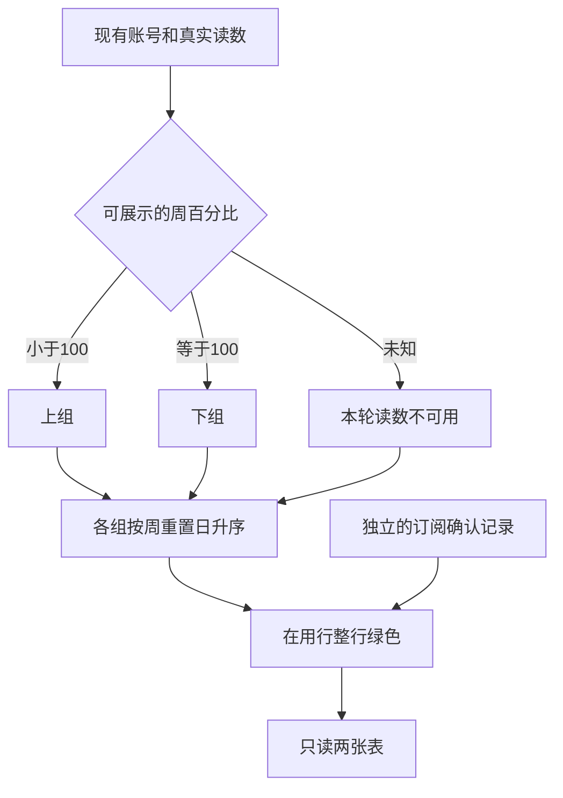

# FLY-2803 额度页页面改版 — 实施计划
Issue: FLY-2803 (https://linear.app/geoforge3d/issue/FLY-2803/额度页页面-页面一张单改完spec-e1-e19呈现改版分组排序在用号染绿进度条时间格式-订阅到期显示与手填记确认人时间-e19)
日期: 2026-09-23
基于: research.md, exploration.md

## 1. 给使用者看的结果

额度页只留下标题、生成时刻和 Claude/Codex 两表；有周额度在上、周用满在下，组内周重置日从早到晚，在用号无论哪组都整行绿底。周用量与 Fable 用量分别显示数字和条形。订阅只在确认取消后给到期日，手填保留谁在何时确认；不猜任何账号名单。

本计划覆盖 E1–E19。数据层沿用 FLY-2807，发布前要完成与它的真实接口验收。只读额度展示不成为账号调度输入。设计评审状态与 questionId 记在 progress.md；本文件描述未来实现，不代表已实现或生产验证。



## 2. 基线、范围、合并规则

1. 开始实现时运行 `git fetch origin`、`gh pr view 1301 --json state,mergedAt,headRefOid`，核对 TURN/inbox；保留 `068493b2b` 的目录枚举与 token 列。
2. #1301 已合入：在保持当前设计提交的前提同步最新 main。未推送分支可 rebase；已推送分支优先 merge origin/main，避免未经允许的 force push。出现重写需要时按 Runner force-push guard 询问 Lead。
3. #1301 未合入：只做本计划页面投影、渲染与独立手填文件；不改它的 parser/observer/降级代码，不 cherry-pick 整个 2807。待它合入后同步、解冲突、执行第7节集成证据后才交最终 QA。先前测试不替代合并后验收。
4. 不复制 #1301 的旧 MANUAL_CODEX fallback，不丢 tokenStatus，不把无源 active 改成 personal；不改变机器取消时抑制旧读数的规则。
5. 不改账号切换/候选选择/自动退役逻辑；尤其不写 `retiresAt`，它还被 candidate-selector 与 quota-monitor 消费。手填日期不是自动退役命令。
6. 不创建新的 founder 决策，不实调/重登 business，不把 20x 当已裁定。E20–E23 数据能力由 2807 完成，本单负责接住其可见结果。

## 3. 文件与数据接口

| 文件（均在 packages/teamlead/src/ 下） | 计划变化 |
|---|---|
| `bridge/account-quota-view.ts` | 导出既有 ACCOUNT_NAME 供手填校验；QuotaCell 加可选 rawValue/rawInstant；构造时仅为机器数值附加原值，文字 display 保持旧合同；renderAccountsPageHtml 调页面投影/组件；保留 formatAccountQuotaTickLines 和默认共享排序 |
| 新 `bridge/account-quota-page.ts` | 纯页面投影、分组、排序、页面日期与订阅显示函数；无 IO，无轮转调用 |
| 新 `bridge/account-subscription-manual.ts` | 只读解析、身份绑定、有效确认选择；不修改任何账户运行态 |
| 新 `bridge/account-subscription-manual-cli.ts` | validate / install / identities 三个终端入口；install重新校验并原子写入唯一页面记录文件，不修改账号池 |
| `bridge/plugin.ts` | GET 页面的调用链读取手填和非秘密身份上下文，传给 renderer；保持 tokenAuth、refresh 预算与 2807 observer 原样 |
| `bridge/__tests__/account-quota-view.test.ts` | E1–E14/E19 HTML、共享 tick 不变、2807集成、2762回归 |
| 新 `bridge/__tests__/account-quota-page.test.ts` | 纯函数分组排序/时间/订阅状态测试 |
| 新 `bridge/__tests__/account-subscription-manual.test.ts` | 文件边界、schema、身份隔离、确认优先级 |
| 新 `bridge/__tests__/account-subscription-manual-cli.test.ts` | identities无秘密输出、validate退出码、install原子读回/锁冲突/拒绝后旧文件不变 |
| `__tests__/capacity-route.test.ts` | 实际 GET 路径读手填、鉴权拒绝、无 refresh 副作用 |
| 本 doc 目录 `subscription-input.md`（实现时补） | Lead 实操录入步骤、空 schema、错误定位、回滚说明，不带真实账号数据 |

可选原值是加法扩展，不改变原 display，避免 tickPct/tickReset 破坏。仅 source=machine 的 machinePctCell 赋 `rawValue: number`（0–100）；MANUAL_CLAUDE 旧硬编码百分比不赋 rawValue，也不进入页面数值/进度条/分组输入；machineResetCell 赋 `rawInstant: ISO`；缺失、取消抑制值不给 rawValue。页面对source=manual的旧百分比明确显示“无”（单元格保留、不画条、不显示旧80%）；未知周数进带标题的“本轮读数不可用”组。shared view原display及tick保持兼容；不退休底层常量、不改取数器。原 weeklyResetAt 在页面专用投影上下文中保留用于排序，即使显示为“已取消”；不得把 sortAt 当 weeklyResetAt。快照中不存在周重置时才 null。

```ts
type PageGroup = 'available' | 'full' | 'unavailable';
interface PageRow {
  row: AccountQuotaRow;
  weeklyPct: number | null;
  fablePct: number | null;
  weeklyResetAt: string | null;
  fiveHResetAt: string | null;
  group: PageGroup;
}
const groupOf = (pct: number | null): PageGroup =>
  pct === null ? 'unavailable' : pct === 100 ? 'full' : 'available';
const rank = {available: 0, full: 1, unavailable: 2} as const;
function compare(a: PageRow, b: PageRow): number {
  const time = (v: string | null) => v === null ? Infinity : Date.parse(v);
  return rank[a.group] - rank[b.group]
    || time(a.weeklyResetAt) - time(b.weeklyResetAt)
    || a.row.name.localeCompare(b.row.name, 'en-US');
}
```

构造 PageRow 时只能接受已验证 0–100 数字与有效 ISO；不从 display 匹配百分号，不把 null 转 0。`[...rows].sort(compare)` 不 mutate 共享 view。即使两个 null 相减 NaN，也使用 name 稳定分支。provider 分表，不相互排序。

页面上下文 `AccountQuotaPageContext` 包含原 snapshot（只取 quota 原值）、按 provider/name 的订阅确认与身份键；独立参数传 `renderAccountsPageHtml(view, context?)`，旧调用无 context 时用加法 raw 字段/null 安全降级。生产 GET 必须传完整 context；其它调用不读文件，不改变共享容量 schema。

## 4. E1–E19 可执行合同

| 编号 | 实现规则 | 验收证据 |
|---|---|---|
| E1 | 页头标题+一个生成时刻，无按需/陈旧说明 | header 文本/截图 |
| E2 | HTML 不输出任何 sourceMeta 或来源/读取时间小字，含 stale 卡片；数据模型仍留出处 | DOM 不含 .meta 与相应文案；tick 不变 |
| E3 | 第二表后无 footer/legend/差异/数据说明 | DOM 次序+全页截图；设计审稿报告的评论层不属于产品页面 |
| E4 | Codex 去余额，只留兑换卡逐张/缺明细状态；不删 token 状态 | 2807卡片样本+token列截图 |
| E5 | 有周数<100、=100两组，仅颜色与8px细缝，无组名；空组无占位；未知第三组保留标题 | 0/1/3组 DOM和截图 |
| E6 | 周重置日升序；周/5h显示 `09/28 周一 09:00`，固定PT时区 | ISO排序、周几、跨年/DST测试 |
| E7 | 不渲染 recovery 文案，无“恢复 XX” | DOM无 .recovery；5h列仍保留（E10） |
| E8 | active 的每个 td 最后覆盖绿底，首格绿轨，名前绿点与在用绿标；不置顶 | active×full/unknown 两provider浏览器computedStyle |
| E9 | past reset 仍按原时间升序；stale 不加灰、角标或沉底 | old/future/unknown混排；时钟平移不改排序 |
| E10 | 两表都保留5h reset，Codex token等未点名列都保留 | 旧/新列清单+并排截图 |
| E11 | 删行级合成打满标签；页面tokenStatus里的旧“打满”映射“正常”（其源只在authHealth=valid时产生），真实吊销/失效原样 | 周20、5h100不打满；吊销仍可见 |
| E12 | 只看机器来源且可展示的周百分比，不看Fable/5h/exhausted/档位/auth；旧手填常量不算机器读数 | 周96+Fable100仍上组；周100下组 |
| E13 | Claude周/Fable并排百分比+各自条形；Codex周也有条形，满格维度红色并带“周已满”/“Fable已满”；未知文字无假0%条 | 0/23/97/100/null DOM+截图 |
| E14 | 保留精度与数值，97%与23%可区分；不只满/没满 | numeric fixture与aria-valuenow |
| E15 | 保留订阅到期列；active确认不显示日期，canceled有日期才显示日期 | 三态/日期缺失矩阵 |
| E16 | 独立JSON字段面可读入手填，重启/刷新后持久有效 | 临时文件→GET→HTML集成测试 |
| E17 | 每条确认必须有confirmedBy/confirmedAt/sourceRef，缺字段拒绝，不填默认确认人 | 负测+手填文件读回 |
| E18 | 不预填任何cancel名单或示例日期，不继承MANUAL_CLAUDE.expiry/retiresAt | 空输入下日期不出现，2792由Lead后续录入 |
| E19 | business只显示机器值与founder 20x待确认文案；不改底层tier；tier不参与group/comparator/selector | 改5x/20x/unknown，页面分组/顺序一致；selector输入类型与import审计证明档位没有接入自动决策 |

E19 固定未裁定文案在 business 的档位格（例：机器读数 5x / 你说 20x，待你确认）；机器读不到时写“机器档位未知 / 你说20x，待你确认”，绝不造5x。未来裁定只能凭 Lead 新指令追加 correction，本计划不自动解除。

进度条用原生 progress 或带 role=progressbar 的静态元素，数值严格校验后设置 width；动态文字统一 escapeHtml，无 inline event，无 JS 外依赖。颜色不是唯一维度满格信号（保留数字和维度级文字）。取消、token异常、未知不被误装成0%。

CSS 顺序必须覆盖到单元格：默认组样式→full红底→active td绿底（包括active+full和active+unavailable）；不要给未知格子再加不透明灰背景。保留红色数字/条，绿底不把满格信号涂绿。

## 5. 订阅手填数据合同

这是页面记录，不是扣费、取消订阅或自动退役动作。字段输入面选择一个固定文件：`<FLYWHEEL_STATE_DIR or ~/.flywheel>/account-subscriptions/manual.json`。操作人先编辑临时输入文件，使用下述CLI验证和安装；install自身再次验证所有内容及身份后原子rename，文件mode 0600。代码不内置任何真实记录，不存在等价空表；上线验收见§8真实记录门槛。仅本地受控文件输入，GET不写文件。

实现以下可直接调用的入口（这些是未来实现的命令，本设计节点不执行写入）：

```sh
node packages/teamlead/dist/bridge/account-subscription-manual-cli.js identities
node packages/teamlead/dist/bridge/account-subscription-manual-cli.js validate --input /tmp/subscriptions.json
node packages/teamlead/dist/bridge/account-subscription-manual-cli.js install --input /tmp/subscriptions.json
```

identities仅输出provider/profile/是否有可信身份及页面所用非秘密digest，不打印email/token。validate成功返回0和逐行适用性结果；失败返回非0及safe枚举，不输出原始记录。install不能仅信任先前validate：重新读入受限文件、校验schema/确认时间/当前身份，任何不适用记录拒绝安装；在独立manual.json.lock排他锁下读取现有记录，与输入按复合确认键合并（同键异内容拒绝），写同目录随机临时文件、fsync、rename、关闭锁。输入不得删除历史确认；撤销用新增unknown记录。锁已占用返回非0，不清理不明owner的锁。目标固定在stateDir，不允许指定账号池/凭据路径。测试注入临时stateDir，覆盖install→read回与失败后旧文件不变。

```ts
interface SubscriptionConfirmation {
  provider: 'Claude' | 'Codex';
  profile: string;
  identityKey: string; // 64个小写hex，绑定既有身份，不是token hash
  status: 'active' | 'canceled' | 'unknown';
  expiresOn: string | null; // YYYY-MM-DD；仅canceled允许非null
  confirmedBy: string;
  confirmedAt: string; // canonical UTC ISO，不能晚于生成时刻
  sourceRef: string; // founder确认的消息/issue引用，不能只是模型推断
}
interface ManualSubscriptions {
  version: 1;
  confirmations: SubscriptionConfirmation[];
}
```

- profile 复用 account-quota-view.ts 新导出的 ACCOUNT_NAME 正则；provider必须枚举。最多128条，64KiB；未知字段/版本/重复provider+profile+identityKey+confirmedAt拒绝；同一键不同时间记录保留以审计，取最新不晚于生成时刻的有效记录。显式 unknown 是撤回旧确认，不能回退拿更旧 canceled。
- 日期严格日历 round-trip，拒绝2/30、无年份和带时刻；confirmedAt 必须 canonical UTC ISO。确认人 trim 后1–128字符，sourceRef 1–512字符，拒绝控制字符；不把字符串当 HTML/命令执行。文件记录“谁说的”不构成 ship 或账号操作授权。
- 安全读取：固定路径，realpath必须在stateDir内，leaf不得symlink、普通文件、同UID、不可group/world写；open O_NOFOLLOW 后 fstat 再限大小读取，拒绝父路径逃逸。结构错误，或记录晚于generatedAt，均写safe-error（future_confirmation）；仅未来记录可用时同样报告，不静默跳过。身份缺失/不匹配分别报告identity_missing/identity_mismatch，页面仍显示未知，不伪装安装成功。任一结构错误使本次手填整体不可用，结构化safe error仅写日志，页面未知/机器状态继续显示，不503整页，不拿上一份缓存冒充新确认。
- 身份键：Codex沿用 `loadCodexAccountPool({profilesRoot})` 的ready slot identity，经 `codexInstallAccountKey` 生成当前身份键；若quota store有identityKey则必须一致。复用现有只读身份解析，不新增token解析器、刷新或写凭据。Claude复用 `account-heal/account-identity.ts` 的exported `identityKey(identity)`，以 `createHash('sha256').update(identityKey(identity)).digest('hex')` 构造，与既有identityDigest同源；不使用另一种用途的expectedIdentityDigest，也不新造序列化；字段缺失则不应用手填。首次写文件的runbook使用上述identities命令导出键。2026-09-23只读前置已核实business/personal/school/shopping/personal1均hasIdentity=true、hasUuid=false，只输出有/无，未输出email、未写入。Lead收到2792涉及的账号后在录入前再次运行identities；缺identity由Lead取得可信身份确认后，使用既有 `node packages/teamlead/dist/account-heal/quota-guard-cli.js identity-set --name <profile> --email <confirmed-email> [--uuid <confirmed-uuid>]` 补录（有独立权限才执行；本单不自动补）；随后重新导出页面digest。禁止从用量probe猜身份。只有匹配 provider/profile/identityKey 的记录适用；目录改名不迁移，同名换号不继承；身份不可证时显示“未知”，不给旧日期。
- 接线：在 plugin.ts 现有 codexQuota options（refreshAccountQuota同一接口）追加 `readAccountIdentityKeys?: () => Readonly<Record<string,string>>`；生产配置中实现为 getCodexQuotaAccountPool().slots 的 ready且无problem成员→codexInstallAccountKey(identity)，GET在需要手填时调用该只读回调。loader内部会读本机auth解析身份，但不输出token、不联网、不刷新、不写盘；不是本设计节点实调。测试注入映射验证重名换号和callback缺失，缺失或异常返回空映射使手填不应用。不把 identityKey 或邮箱发到公共HTML。
- Claude机器subscription `canceled` 可作为无手填时的取消事实，但不提供到期日，因此显示“已取消 · 日期待确认”。机器active不是未取消续订证据；无手填时为未知。手填active→日期空白；手填canceled→已取消+日期；unknown→未知。
- 机器 canceled 与手填 active 冲突时，若机器 observation 在确认之后，显示“未知 · 状态待核对”并隐藏日期；若手填更新则采用其明确确认。机器active与手填canceled不冲突：可能取消自动续订但仍在付费周期。manual未知覆盖旧取消推断；无machine observation timestamp则不声称更新。
- 订阅确认不改变百分比与group；2807取消抑制数据的语义单独保留。到期日已过仍展示真实日期，不自动切号/退休。
- 不迁移旧 expiry/retiresAt，因为没有cancel与确认来源。旧运行态文件原封不动；JSON新字段面独立，回滚旧版本不读取它。回滚页面提交即可，保留记录供再上线读取，绝不把日期反写账号池。

## 6. 实现步骤（每步先写失败测试，再最小实现）

### T1 固定页面原值与共享消费者

在 account-quota-view.test 加机器原始百分比/ISO字段、取消格无数值、旧手填fallback不得当页面数值，固定现有 formatAccountQuotaTickLines 快照。特别覆盖shopping机器周数null+旧manual80：页面周数“无”、第三组且无进度条；机器周96+旧manual0则机器96上组；Fable仅manual79时“无”、无假条。运行该文件看到新字段断言 RED，再附加机器rawValue/rawInstant，不改display/nextImprovementAt。GREEN后提交；保留缺失与过期真实值。

### T2 纯页面分组与时间

新 account-quota-page.test 按第4节矩阵加混排测试；对相同rows分别变active、tier、5h、Fable、stale，断言顺序不变。RED后实现第3节接口，page copy排序、zh-CN周几+MM/DD+HH:mm格式。取消有效usage与不可读usage各一个fixture。GREEN后提交。

### T3 手填记录与投影

新 account-subscription-manual.test：missing/corrupt/超大/权限/符号链接/逃逸路径/重复确认/日期错误/未来确认/同名换号/provider重名/显式unknown/冲突覆盖均先RED。实现第5节reader、reconcile及CLI，纯函数接受now与identity context；文件依赖只在路由读。临时目录测试读回，不能写用户实际state。GREEN后提交。

### T4 页面布局

先更新HTML断言只针对点名变化：source/meta/footer/recovery消失、token列保留、两reset列、可见绿点/在用、percent和progress、第三组标题。实现静态render helpers和CSS层级；不要改共享tick。无数据不删列，卡片多行显示保留2807。GREEN后提交。

### T5 GET接线与依赖集成

capacity-route.test 注入测试路径与非秘密identity fixture；真实GET响应证明订阅显示+token auth，GET不写文件不触发额外网络。接线plugin仅页面路线，不往capacity/global tick装手填。重新核查#1301并同步最新main，保留2762，运行卡片null/empty/count-only/truncated、多卡日期、canceled与恢复active、personal2周100测试。GREEN后提交。

### T6 阴性控制与浏览器QA

从同一脱敏fixture输出baseline（当前main与2807合并后）和candidate HTML；另对照产品原始bb747fba页面列清单，截图并排。浏览器断言active×100/unknown两provider每个td computed background为绿色且绿点/标/左轨存在。将运行证据、截图SHA/输入fixture SHA/浏览器版本/commit写QA记录。真实页面取数不可用时报告缺口，不拿静态fixture宣称生产已验。

## 7. 点名验证与验收门槛

本机只运行这些相关检查，完整suite交PR CI：

```sh
pnpm --filter flywheel-teamlead exec vitest run src/bridge/__tests__/account-quota-view.test.ts src/bridge/__tests__/account-quota-page.test.ts src/bridge/__tests__/account-subscription-manual.test.ts src/bridge/__tests__/account-subscription-manual-cli.test.ts src/__tests__/capacity-route.test.ts src/__tests__/patrol-tick-render.test.ts
pnpm --filter flywheel-teamlead exec vitest run src/codex-quota/__tests__/codex-accounts-observer.test.ts src/codex-quota/__tests__/rate-limit-detail.test.ts src/codex-quota/__tests__/codex-account-quota-store.test.ts src/bridge/__tests__/capacity-snapshot.test.ts
pnpm --filter flywheel-teamlead exec vitest run src/__tests__/account-candidate-selector.test.ts
```

先核对实际测试路径；新增文件T1–T5生成后才运行。自动决策证据使用真实依赖边界：审计AccountEntry及selector输入类型不含subscriptionTier/rateLimitTier/planType，类型负断言不得通过任何cast向其添加tier；搜索所有轮转/候选模块，确认没有import新page/manual模块或其输出。当前selector本就没有tier输入，禁止向fixture塞一个被忽略字段再宣称阴性测试通过。E19行为负测只在真实具有tier输入的页面投影上做5x/20x/unknown变换；输出group/order必须一致。`rg` consumer sweep 证明新的 page/manual module 无 runtime-selector import、retiresAt 写入、额度RPC/credentials写入。若实现引入类型变更，再按节点合同运行targeted build/typecheck；不擅自跑本机全量suite。

必须保留的浏览器样本：两provider active+full和active+全未知；Claude周96/Fable100；周97/23；陈旧过去周reset仍最前；未知reset最后；两组之一为空；真实取消+无usage；取消但usage仍有效；Codex token失效仍显示；卡片未知/0/仅张数/截断/逐张多行；宽屏与手机横向滚动；无外部网络依赖。

“除点名外无元素消失”必须有旧/新逐项表：账号、档位、token状态、周reset、5hreset、周用量、Fable、卡片、订阅到期、现有错误原因均在；来源/读取于、顶部灰字、footer、余额、恢复/合成打满是授权删除项。不要以只检查截图数量当验收。

## 8. 风险、回滚与交付

- 最大风险是合并#1301回退2762；必须按功能逐块合并并同时跑两个系列的测试。
- identity缺失使手填不能应用；明确未知，不让同名另一账号看到旧到期日。输入维护说明要写清如何取得非秘密身份键。
- 三态不是取数健康；别用authUnusable/canceled把有真实周数的行丢掉。机器已抑制的历史读数不恢复。
- E24上线验收由Engineering Lead负责真实确认录入、QA负责页面证据：至少一条由真实确认导出的订阅状态和真实到期日经过install→GET→渲染往返，并验证其它行正确空白/未知；2807机器canceled但无日期可显示“已取消·日期待确认”，不能冒充已验证真实到期日。若2792尚无日期或缺必要确认，实施可以继续，设计可以交接，但必须报告订阅列真实验收尚未完成，不能以全未知/空列宣称上线完成。不得为了此门槛猜名单或用spec占位日期。这是部署前验收条件，不是让本设计节点申请ship或等待founder审批。
- 设计无运行代码变化，可直接撤回设计文档；实现回滚只回滚页面/手填reader，保留2807取数与2762目录枚举，保留确认文件，不改数据库或凭据。
- 设计完成需明确 reviewVerdict=APPROVED；最终浅色HTML逐section评论、localStorage pathname隔离、单nonce脚本、复制失败fallback、分片marker；Mermaid本地渲染失败按规定保留源及pending标签。
- 提交并push文档，publish-report --publish-only，验证托管HTTP/CSP/源码，向Lead报DESIGN-HTML ready；然后精确complete --route phase_design_complete及park。等待后继TURN，不实现/dispatch/merge，不将phase边界标成整个goal完成。
