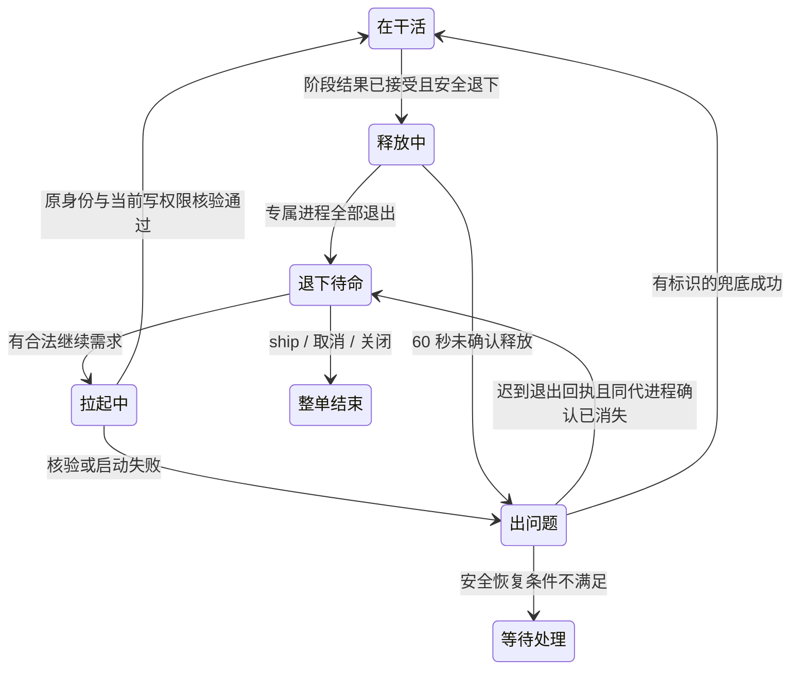

# FLY-2808 全节点退下与原会话拉起 — 实施计划
Issue: FLY-2808 (https://linear.app/geoforge3d/issue/FLY-2808/节点生命周期n1-设计主动退下与意外死亡的区分信号-六个会把退下当死亡的打断点怎么改-拉起的身份模型工作目录核对)
日期: 2026-09-24
基于: research.md、exploration.md

状态：设计定稿待评审（本轮为沙箱 run 855ed9e9 eng_design 重新定稿；上游生产分支 R2 已批准的内容为基线，批准后追加的实现记录与 review disposition 全部移入 follow-ups.md，plan 只含设计合同）。仍不部署、不启用生产恢复、不操作真实凭证。

## 1. 给 founder 的结论

所有节点做完自己的阶段便真正释放进程，被打回时用原模型、原对话、原工作目录继续；拉不起会明确说明原因并走单独预算的兜底。

“做完阶段”“退下待命”“整单结束”是三个事实。阶段完成仍按当前规则推进一次，退下和拉起本身绝不推进或回滚整单。设计、实现、QA 以及未来节点统一；Claude/Codex 同一合同。无空转缓冲，不引入内存 checkpoint（将整个进程内存冻结保存）的路线。

默认在整单结束前一直可恢复；同一工作目录一次一个，不同目录最多并行两个。恢复失败最多尝试两次原会话、一次明确的新执行兜底。新执行意味着丢失原对话，必须显示出来。

> 沙箱重派说明（2026-09-24）：本轮在 QA 沙箱 run 855ed9e9 的 eng_design 节点重新定稿。源码锚点沿用生产树 abce27a27（经 origin/flywheel-FLY-2808 分支读取）；沙箱 main 1855f7a1a 的旧快照不含泛化工作流引擎模块（phase-actor-reentry / turn-belt-reconcile / recipient-resolve 等），本地能核到的对应点是 packages/flywheel-comm/src/commands/declare-state.ts:84-94 与 packages/claude-runner/src/TmuxAdapter.ts:802（生产为 :1316）。

## 2. 权威与最小改动

产品 PRD 固定为仓库内可解析的对象：blob `f0e5610d7efe4ae621cee9ca358a21e9c5e4345e`（`product/doc/FLY-2782-resume-standby/prd.md`，首次可见提交 `40cde65e90dcd228b4dd33ccea79cd8e37e9e9aa`，PR #1291）；exploration.md 同步记录。评审收据绑定的是本 plan 的 blob，PRD blob 在此处正文固定，两者一起构成本设计的权威快照。六处是必须逐个处置的入口，不是消费者全集。复用现有工作流、park outbox、CommDB 投影、TURN、消息投递、Codex recovery owner、writer replacement；不另写调度框架。

StateStore 是工作流/激活权威；CommDB 是消息和状态投影。`runner_declared_states.parked` 保留为自报，不能单独批准退下。`workflow-engine-park-evidence.ts` 已有 run/node/attempt/activation/generation/source_row_id 的双库精确匹配，扩展该路径，禁止发明平行的 park 权威。

新增最小载体状态表 `workflow_execution_carrier`，只管理物理进程生命周期。既有 `workflow_execution_runtime` 是不可变配置绑定，不修改其 append-only 合同。通用动作仍经 controller 处理；Runner 没有自行宣告“我已释放”的权力。

### 2.1 持久数据

| 数据/位置 | 必需字段与约束 | 写入者/用途 |
|---|---|---|
| 原工作流 | run_id/node_id/attempt/activation_id、execution_id、当前 TURN epoch | 原引擎；过程身份不复制到新调度层 |
| workflow_execution_carrier（一行/execId） | execution_id PK、generation 正整数、state、completion_event_id、park source_row_id、manifest_digest、current_demand_id、owner_claim_id、started_at、updated_at、reason_code | StateStore 事务以 expected generation/state 比较更新；state 为 active/retiring/standby/resuming/resume_failed/closed |
| 现有 park outbox + CommDB projection | 现有精确身份字段，增加 carrier generation/state/reference；逐条 source_row_id 有序投影 | 同事务写 outbox；落后时 held/pending，不从旧投影推断死活 |
| adapter resume manifest | schemaVersion、execId、vendor、非空 provider sessionId、resolvedModel（含窗口变体）、effort、home/account binding、canonical cwd、git commonDir/worktree identity、branch ref、lastObservedHead、validatedAt | adapter 在实际会话建立时保存，atomic rename；Codex 扩充现有 session.json，Claude 新建同级 claude-sessions/<execId>/session.json |
| 退下时工作区基线（retire baseline，同代冻结，随载体记录/manifest 一起写） | `git status --porcelain=v2 -z` 的规范化摘要、index tree id、每个 staged/unstaged/untracked 条目的路径+mode+内容 digest（不存文件正文）、HEAD、branch ref、capturedAt、generation | 控制器在 active→retiring 事务中捕获；拉起前逐条比对（§5.2），是矩阵 B/E 的机械验收依据 |
| 需求 episode（demand，一行/需求） | 创建时冻结且不可变：demand_id、source_kind（rework/phase_wake/gate_response/mailbox）、`authority_mode = conversation_only \| writer`、authority provenance（来源 request/event id，如 workflow_rework_request id）、目标 run/node/attempt、创建时观察到的旧状态 fence（当时的 activation_id / TURN epoch，只用于拒绝过期，不当未来授权）、expiry、cancel identity、episode 主键（首需求 id）、pending envelope（待投递的首条输入，含 HEAD/dirty 前移摘要） | 由既有 rework/phase-wake/gate/mailbox 入口在创建需求时冻结；恢复、回放、兜底只按此记录判断权限，不从消息文本或调用方参数推断 |
| grant receipt（需求 episode 的追加式不可变子记录，仅 writer；主键 (demand_id, carrier_generation)） | granted_activation_id、granted_turn_epoch、carrier_generation、grant request id、grantedAt；每条只能写一次（CAS 从空到值），不能更新；同一 demand 在新载体代数下追加新记录，旧记录保留但不再是投递候选 | §5.3 第 3 步在原工作流真实 grant 之后封存；第 4 步只以「当前 carrier generation 对应的那条 receipt」为投递候选，且入队瞬间重新核当前 activation / TURN holder+epoch / demand 有效性 / carrier generation，不只匹配历史 receipt。grant 后、首条输入消费前载体死亡→清理确认→同 demand 以 G+1 重试时，新代数追加新 receipt，不重置 episode 预算。创建需求时不存在未来的 epoch，所以不在创建时冻结、不猜、不事后回填 |
| delivery authorization（一行/首条输入投递，StateStore） | delivery_id PK、demand_id、carrier_generation、receipt 引用、envelope digest、state = reserved/enqueued/turn_stale/cancelled/consumed、updated_at；同 demand 同时只允许一条非终态 delivery | §5.3 第 4 步 a 预留、d 消费/取消；cancel / 终态 / 换代与预留共用同一 CAS 行；CommDB 项与 transport claim 都以 delivery_id 关联并回核此行 |
| execution profile 绑定（authority_mode → 每个 vendor 可核验的启动形态） | conversation_only：Codex 必须以 `sandbox: "read-only"`、无 writable roots、无外部 mutation credential、网络写能力关闭启动（daemon `thread/start` 支持 read-only，基线 CodexTmuxAdapter 固定 workspace-write/never/writable roots/network，需新增 profile 分支）；Claude 以本代 generation+nonce 绑定的 SessionStart/PreToolUse hooks 拒绝全部 mutating tool，并不注入 git/外部凭证。writer：现有 workspace-write 形态。首条 prompt 前必须核验 observed profile（Codex 读回 thread 配置；Claude 读回 hook 注册回执），不符则 fail closed | 控制器按 demand 的 authority_mode 选 profile 并写入载体记录；profile 不能在同一载体内原地切换，conversation_only → writer 必须按 §5.4 重建新代载体 |
| 原 workflow_run_event | event_uid、完整身份/generation、demand_id、尝试序号、requested/started/verified/finished、result、reason、queueMs/startupMs/totalMs、expected/observed session/model、fallback execution link | 控制器事实，去重事件；不保存口令/完整环境/凭证 |
| 现有 dispatch ledger（workflow_side_effect_ledger） | 新增 purpose = initial/fault_replacement/resume_fallback，source_demand_id；launchOrdinal 继续单调排序；两列在迁移完成后纳入 identity immutable trigger | purpose 只由 StateStore 单一 API 按服务端动作派生，外部调用方不得传值；原会话恢复不制造 dispatch；迁移与 NULL 语义见 §9 |

进程代数 generation 与既有 park generation 分属物理载体和逻辑待命，必须显式记录绑定，不能混用。恢复新载体代数递增；阶段新激活的凭证按原引擎生成。普通恢复不增加 node attempt；合法 rework 原本会增加 attempt/activation 的地方照旧，不回滚到退下时的旧值。

Codex session.json 是会话 handle 真源，carrier 只存引用摘要；Claude 对应文件同样由 adapter 管理。摘要用于发现漂移，不当身份/授权凭证。输入 sessionId 不允许空白、超长或非法格式；model 必须解析到明确版本，不能把 latest/账户默认当原模型证明；未知即拒绝恢复。

### 2.2 原子性与失效原则

所有 SQL 使用参数绑定。控制器操作绑定 execution + 当前激活 + generation + request id；旧 callback、ACK、探活结果不能更新新代数。session_identity_epoch 仅用于消息身份新鲜度，不是锁。重用现有 execution owner，并在 StateStore 做 durable claim；Bridge 重启不能仅因 claim 超时再起一个，必须核实旧进程/后端全部不存在或安全接管当前同代数所有权。

双库无跨库事务：先 StateStore 事务（载体记录 + park outbox），投影消费成功并精确匹配后才允许真正停止载体。投影落后先保留进程并显示“释放等待确认”，不伪装待命。崩溃后按同一 event_uid 重放，不重新计算业务结果。CommDB 有旧投影而 StateStore 不可读时，只能排队/hold，不能 kill/resume/replace。

## 3. 退下协议：主动退下与意外死亡

1. 既有 complete 路由先验证输出、评审/节点回执和当前 activation，只提交一次阶段完成。新生命周期版本下，所有可执行 DAG 节点 session 留在非终态 `ship_parked`（内部兼容名，UI 文案统一待命），node 可 done，terminal_at 不写；整单终态继续原路径。不得从 completed 改回去补救。
2. Runner `park` 是意图；控制器核验该 execution/activation 的 accepted completion、没有正在执行的模型 turn 或未收尾写工具、恢复 handle 已持久且核验过、当前 owner。阶段完成后立即进入退下，不设 15 分钟等待。polling/drain 的短暂时间是必要清理，非空转缓冲。
3. CAS active→retiring，冻结退下 manifest 和当代进程身份，持久化请求；发布上述投影。standby 专用 stop 路由只停止专属载体，不能调用整单 terminal shutdown/closeout。先暂停新业务输入并排队，完成当前命令回复及 transcript flush。
4. adapter 停 TUI/Claude 进程树及 Codex 独立 daemon；按已绑定 PID+启动时间/进程组+execution 所有权核验，不能按窗口名、孤立 PID 或 broad pkill 杀进程。复用安全 reap/drain；Codex home lease 可释放并清敏感 credential，保留会话数据。保留工作目录、分支、dirty 文件。
5. 专属进程、独立 daemon、专属监听端点已不存在才写 `retired` 证据并 retiring→standby。60 秒内无法证明释放则 resume_failed(reason=retirement_unconfirmed)，可见并让 Lead 检查；不假报内存释放，不并行起第二身体。

退下失败不是终点，有闭集的收敛规则（reason 闭集，每条转换都绑定 request id + owner/generation CAS + 审计 receipt）：

| 处于 retirement_unconfirmed 时观察到 | 合法转换 |
|---|---|
| 迟到的精确同代退出回执，或后续探活证明该代所有专属进程/daemon/端点已消失 | 自动补写 `retired` → standby；problem 解除；不需要 Lead |
| 进程仍活、且业务 intake 已暂停 | 保持 fenced problem；旧 finally/死亡巡检对该代不得改写为 completed 或故障；Lead 可发 stop-retry（同一 stop 请求重放）或 safe-takeover（核验后按当前代接管并再次 stop） |
| 探活 indeterminate（PID 复用、权限不足） | 保持 problem 并 hold；不 kill、不 replace、不拉起；只显示需要人工核对的确切原因 |
| Lead 执行 return-active（决定不退下、继续在这个进程里干活） | 审计 CAS → active；重新核当前 activation/TURN，不复活旧凭证 |
| 需求在 problem 中到达 | 持久排队，不触发拉起；转入 standby 后按 §5 正常处理 |

矩阵补：60 秒超时后迟到退出、Bridge 在 deadline 前后重启、需求在 problem 中到达（§8.1 场景 O）。

进程退出发生在 retiring 且匹配已批准 stop/generation 时，继续核验并补写待命；只有 parked、无批准退下请求而进程死去，仍是真实故障。批准后尚未发 stop 的崩溃通过该请求的 durable step 状态重放，不把未知死因改成成功完成。active 状态死亡继续走既有严格死亡证据和故障预算。

退下过程中到达需求：持久排队，完成有界释放后恢复；不撤销/覆盖已批准 stop，避免“旧 kill 杀新进程”。没有业务需求时 Bridge 重启仅重建监视状态，不自动恢复所有待命节点。

## 4. 六处修改与周边闭包

| # | 必改路径 | 明确新行为 | 负例 |
|---|---|---|---|
| 1 | TmuxAdapter.waitForCompletion/finally；CodexTmuxAdapter controlled shutdown | 返回 standby disposition，保持非终态；有代数的停机回执不发 session_completed | 旧代数 finally 不终结新进程；无退出回执不显示待命 |
| 2 | phase-actor-reentry.classifyPhaseActorReentry；workflow-rework-coordinator | 先匹配 carrier，再决定 wake/resume/hold/故障 replace；删除通用 rework 终态快捷判断对新生命周期节点的误用 | 只留 parked 或 registration absent 不准当可恢复 |
| 3 | turn-belt-reconcile；workflow-engine-dispatcher 与 rework/launch admission | 无进程且正常待命不判 STALE；合法阶段交接照常推进 TURN；恢复者必须重新 turn 查询 | 旧 manifest 中 TURN 不可复活；同目录两需求不能双写 |
| 4 | recipient-resolve、session-terminal、mailbox-queue 与 db enqueue/clearDeclaredState | 终态排除待命，待命可接收 QUEUED；保留消息 TTL/取消/租约；唤醒对当前代数重解析 | clearDeclaredState 不清载体真源；投递 ACK 不算模型消费 |
| 5 | HeartbeatService.readoptParkedPhase；engine dead sweep | 无需求+standby+无进程是正常；有需求才恢复；retiring/resuming 监视有界截止 | indeterminate 不冒充无进程；重启不拉起全员 |
| 6 | StateStore rollbackDeadWorkflowNodeExecution/eligibility/environment escalation；dispatcher backoff/计数显示 | 所有 budget/backoff 改同一目的计数，不用 dispatch 总数 | 3 次兜底不自动耗掉 3 次真实故障额度；回放不双扣 |

还须修改 StateStore.projectGeneralizedCompletionTx、applyTerminalTimestamp 调用边界和完成投影；CommDB.finalizeProvenGoneSession、done-running-reconciler、commdb-session-prune、cmux-watcher-patrol、pane-loss / monitor-lost 巡检、worktree/branch cleanup 禁止对待命做终态回收或报进程丢失。旧代数 finalize ticket 即使进程已经不存在也失效。整单终态会在事务中 close carrier 并取消待恢复需求，后续所有旧 ACK/完成/唤醒均拒绝。

不全局改变所有 completed 的含义，不为历史终态 session 清 terminal_at/恢复撤销凭证。旧 run 迁移规则见 §9。

## 5. 按需拉起：真正原会话继续

### 5.1 需求与互斥

现有 durable rework/phase-wake/gate-response/mailbox 是需求来源，不新建一条易丢的通知队列。每条需求保留原 ID；同 exec 的并发需求共享一次载体恢复，消息各自保留并在恢复后顺序消费。首需求 ID 作为恢复批次主键，后续消息不能重置额度。

每条需求在创建时冻结 `authority_mode`（§2.1 需求 episode）：只有既有权威的 rework / phase-wake 才是 `writer`；普通 mailbox 文字与 gate response 是 `conversation_only`。创建时冻结的是权限来源（provenance）和旧状态 fence，不是未来的 activation/TURN——生产路径里 rework 先持久化请求，`workflow-rework-coordinator` 做完 reentry/worktree/holder 激活后才 admission，`grantTurn` 之后才有 epoch，所以真实的 activation/epoch 只能在 §5.3 第 3 步 grant 后写进 set-once 的 grant receipt。保存旧 epoch 当授权会错误拒绝合法 grant，猜未来 epoch 会与 TURN 权威竞争，事后回填违反创建时冻结，三者都禁止。conversation_only 只允许恢复交谈，不授予写工作目录权限，也不能触发 writer replacement；写入仍须当前 activation 与 TURN，并且只能由 writer 需求经原工作流的 holder 激活路径（沿用 `workflow-rework-coordinator` 先 reentry/worktree 检查、再 activate holder、再生成 activation/TURN 的顺序）取得。同一恢复批次里混有两类需求时，批次权限取各需求各自的记录，不向上合并。

每个 canonical worktree 只一位写持有人和一次恢复。不同 worktree 全机最大 2 个恢复中，叠加现有 capacity/admission；排队 FIFO，已取消/过期项剔除。继续生产执行不占“恢复中”槽。等待超过 5 分钟显示排队原因，但不计恢复失败；本地容量不足只等待，不拉新账号或静默换模型。

### 5.2 拉起前

- 核工作流非终态、需求仍有效、原节点 binding 当前、版本支持；领取 durable claim，递增 carrier generation。再次核所有旧专属进程、daemon、监听端点均消失；不能证明则 hold，不能新建兜底。
- 读取 adapter 原 manifest：sessionId 非空且存在可读 transcript、execId/vendor/home/账户与不可变 runtime 绑定匹配。凭证重新按当前 authority 注入，不把旧凭证当许可；不在本单添加跨账号迁移。
- 配置解析后的模型标识（包括窗口变体）、effort 与原会话完全匹配；同时校验当前 provider 可用能力。改过节点默认值也不能替换原模型。无法确认则 model_unverified；不匹配则 model_mismatch，调用模型前拒绝。失败显式兜底仍使用原冻结模型，换模型必须另有 Lead 决策。
- cwd realpath、git commonDir、worktree 登记和分支 ref 与原身份一致。共享分支 HEAD 可因后续节点合法提交而前移；不要求退下时 HEAD 相等，更不能自动 reset/checkout。HEAD 合法变化规则：退下基线的 HEAD 必须是当前 HEAD 的祖先（fast-forward）；不是祖先（rebase / reset / force 重写）判 `head_rewritten` 并 hold。启动瞬间记下当前 HEAD/dirty 摘要，恢复过程不修改它们；若有另一合法 writer 则等待 TURN。目录不存在/分支不符/dirty 状态丢失不能自动覆盖。
- 逐条比对退下时工作区基线（§2.1）。自动通过只有两种：(a) 当前工作树/index 仍有同路径、同 mode、同 digest 的条目；(b) 基线的**精确 blob+mode** 先进入了基线 HEAD..当前 HEAD 谱系中某个提交（`git log --find-object=<blob>` 可验证），在此之后沿该谱系发生的进一步修改才可接受。「后继提交改了同路径」本身不是通过条件：未跟踪文件 `x`（digest A）被删除、后继节点以内容 B 新建并提交 `x`，与「A 被合法改成 B」在当前 HEAD 上同构，只凭基线 digest 与 Git 历史无法区分，必须 hold。若将来要允许 A 直接变 B，需要新增受 TURN/writer fence 保护的 before/after digest mutation receipt，本设计不含。任一条目无法解释（被清掉、被外部 reset/clean、worktree 重建、同路径替换、index tree 不符）判 `workspace_baseline_mismatch` 并 hold，给 Lead 看 expected/observed 路径清单（脱敏），不自动覆盖也不自动继续。比对通过后，基线→当前的差异（合法前移提交、被后继修改的条目）进入需求 episode 的 pending envelope，作为拉起后首条输入的前置内容。

### 5.3 adapter 与拉起后

Codex：扩展 resumeExistingExecution 现有 owner/recovery commit；standby 模式强制 handle，不允许 undefined→thread/start。codex-daemon-client.resumeThread 返回值必须来自响应非空 id，不再在这条路径 `?? requestedId`；实际 thread/read 的 id、有效 model/cwd/绑定核验完成才发工作输入。若所用协议 resume 会自动恢复 goal，必须在启动配置中保持 paused/无工具业务入口，直到验证完成；不能“先干活后对 ID”。用现有 preflight/gate hold seam 完成该顺序并加真载体验证，能力不支持时 fail closed。

Claude：在 TmuxAdapter 初始 SessionStart 时保存实际 session id、resolved model/effort 和 cwd，并关联 launcher 预分配 id；恢复走交互式 `--resume <exact-id>`，不带 --fork-session、不生成新 --session-id。复用 hook callback 通道，在 SessionStart 的 trusted launcher wrapper 校验实际 session id/cwd/model 与 manifest，并以本次 nonce/generation 回报；核验前阻断用户 prompt 和工具入口（SessionStart + PreToolUse 守门均绑定当前凭证）。模型文本声称 ID 不是证明。若本机 CLI 不能提供 model 的有效证据，则以已确认 launch 参数+可验证 transcript 元数据比对，缺任一项判 unverified，N4 必须证明不是别名漂移。首次工作输入通过现有 transport 的安全文件/stdin 通路，禁止接在变长参数后或拼 shell 字符串。

两 vendor 均需，且顺序固定：

1. 核验实际会话身份、model、cwd、进程身份 → 持久 `resume_verified`。`resume_verified` 只表示这四项核验通过，不包含任何业务输入。
2. 重建可见且 attachable 的 runner TUI，核当前窗口绑定；更新 transport 注册及 identity epoch。standby 本身允许无窗口；active/resuming 必须有可见 TUI 或显示启动中的确切原因。
3. 按需求 episode 的 `authority_mode` 取权限：writer 需求在此处走原工作流 holder 激活路径（reentry → worktree → holder activation → admission → `grantTurn` → 记录 turn，顺序不变），真实 grant 成功后把 granted_activation_id / granted_turn_epoch / carrier_generation 以 set-once CAS 追加为本代数的 grant receipt（主键 (demand_id, carrier_generation)）；失败则 hold 并显示等待 TURN，本代数无 receipt。conversation_only 需求不做 TURN 申请，也不激活 holder，没有 receipt。载体在 grant 后、首条输入消费前死亡的，清理确认后以 G+1 重试时重新走本步、追加 G+1 的 receipt，旧 receipt 保留作审计，不是投递候选，也不重置 episode 预算。
4. 只有第 3 步结束后，才把 pending envelope（基线→当前 HEAD 的提交/文件变更摘要与 dirty 差异，见 §5.2；原会话缓存的是退下时刻的文件内容，fresh 会重新读盘而 resume 不会）与原需求投递为首条业务输入。demand / carrier / receipt 在 StateStore，当前 TURN holder+epoch 与 `turn_wake_outbox`/mailbox 在 CommDB，两库没有跨库事务（§2.2），所以这一步**不是**一个「同时重核四项的入队事务」，而是下面的双库线性化协议（每一步以唯一 `delivery_id` 幂等，任一阶段崩溃都从持久状态重放）：

   a. **StateStore 预留（CAS）**：对当前 carrier generation 的 receipt 封存一条 delivery authorization（`delivery_id`、demand_id、carrier_generation、receipt 引用、envelope digest、state=reserved）。CAS 条件：demand 未取消未过期、run 非终态、carrier generation 未变、本代 receipt 存在、该 demand 没有其它非终态 delivery。cancel / 整单终态 / generation change 与这条预留操作作用于同一行、同一 CAS，谁先提交谁赢，输的一方看到状态后放弃。预留同事务写入 durable outbox（复用 park outbox 的投影链路，v2 事件）。
   b. **CommDB 入队（IMMEDIATE 事务）**：核 exact `three_stage_turn` holder+epoch 与 activation 元组等于 receipt 里的 granted 值，不等则不入队并把结果回投 StateStore（delivery→turn_stale，回到第 3 步或 hold）；相等则原子 enqueue 带同一 `delivery_id` 的 wake/mailbox 项（对 delivery_id 幂等，重复入队为 no-op）。`grantTurn` 转授在**同一 CommDB 事务**里取消所有带旧 epoch、尚未消费的 delivery 项，因此转授与入队在 CommDB 内线性化。
   c. **transport claim / 首次模型消费前**：claim 该项时再核 StateStore 投影里的 delivery 状态 = reserved/enqueued 且 carrier generation 相符、run 非终态；投影未知或落后 fail closed，不推给模型。这一步挡住「CommDB 入队后、StateStore 里 demand 被取消 / run 终结 / carrier 换代」的窗口。
   d. **ACK 与回投**：模型消费回执按 `delivery_id` 幂等地把 StateStore 的 delivery 置为 consumed（重复 ACK no-op）；StateStore 若已 cancelled，CommDB/transport 侧的项在下一次投影或 claim 时丢弃。Bridge 在 a 后、b 后、push 后、consume 后任一点崩溃，重启都按 delivery_id 从两库持久状态续跑，不会产生第二条 delivery，也不会把陈旧 envelope 推给模型。

   writer 投递候选只有当前 carrier generation 对应的 receipt；需求创建后 TURN 已变化的，只有取得真实新 epoch 的 receipt 才能投递，旧 demand/旧 receipt 不得投递。conversation_only 需求走同一协议但跳过 b 中的 TURN 核验（只核 activation 不存在与 profile）。摘要先持久在 envelope 里，不在核验前进入模型；任一阶段失败时 envelope 保留，不投递，episode 预算不重置。

首轮可观察模型消费回执后记 resume_succeeded；队列投递成功、启动退出码 0 或窗口存在都不是成功。

每次记录 queueMs、startupMs（启动至身份确认）、totalMs（需求至业务输入消费），以及原/实际 ID、模型、目录、耗时和原因。180 秒单次启动超时，两 vendor 同值；慢启动取消后必须证明新进程已清理才可重试。没有证明时 cleanup_unconfirmed，不能继续第二次或兜底。

### 5.4 激活、输出与消息

会话连续不等于旧权限继续：普通恢复保持当前 activation；合法返工由原工作流产生新 activation/attempt/输出凭证时，刷新到原 exec 环境/协议，旧 credential 不再可用，旧输出回放不能成为新结果。对于无法安全刷新当前进程权限的 carrier，重建载体并验证原会话后再给新需求，不复用旧 shell env。

投递仍依现有 QUEUED/ACKED/consumed 语义。Bridge 重启后由投递回执和模型 turn 证据续跑，不重复执行已消费需求。会话核验失败期间无业务工具调用，无新输出/完成提交。取消与恢复同时发生以 StateStore CAS 决定，失败方只清理自己 claim 对应进程，不得杀已经接管的新代数。

## 6. 恢复失败、兜底与分账

| 分类 | 自动动作 | 预算和人看到的原因 |
|---|---|---|
| 瞬态启动/通信超时 | 清理确认后 10 秒再试一次；总计最多 2 次 | resume attempt；显示重试中，记超时阶段 |
| 空/错会话 ID、transcript 不可读或损坏 | 不再试同一个坏 handle；允许一次显式 fresh fallback（writer 需求 → writer replacement；conversation_only 需求 → 无写权限的新会话，见下文） | resume failure + fallback，各自记账；显示上下文无法恢复 |
| 模型/目录/分支/账户不符、owner 冲突、清理不明 | 不自动 fresh；hold 并给修复/重新授权入口 | 不扣故障预算；显示具体 expected/observed（脱敏） |
| fresh fallback 的启动失败 | 不在原需求下继续兜底循环 | 一次 fallback 耗尽，hold，Lead 修复后以审计操作重开恢复额度 |
| 清理不明（cleanup_unconfirmed）闩锁 | 不重试、不兜底；founder 面 `canResume=false`，标为出问题 | 不扣故障预算；只能经 Lead 审计重开路径（记录 server 侧 actor/时间/原因与旧尝试边界，reason 改 `operator_reopened`）解锁，之后恢复额度从审计边界重新计数，旧尝试留痕不删 |
| 成功运行后意外死亡 | 原死亡证明 + 故障换人路径 | fault_replacement，最多原有 3 次，与恢复额度隔离 |

兜底继承而不扩大原需求的权限，但两类需求都有兜底（PRD §4.4「拉不起来时这一单还能往下走」与成功标准 5 对所有需求成立）：

- `writer` 需求（既有权威 rework / phase-wake）：走 writer replacement（下文）。
- `conversation_only` 需求：走 **conversation-only fresh fallback**——可以新建会话/载体（新 execId、新 carrier generation、原模型、原目录），但该载体**不获得** activation、TURN、output/submission credential 或 writer replacement 身份，并且必须以 §2.1 的 conversation_only execution profile 启动：Codex `sandbox: "read-only"`、无 writable roots、无外部 mutation credential、网络写关闭（基线 CodexTmuxAdapter 固定 workspace-write/approvalPolicy never/writable roots/network，需新增 profile 分支，不能复用 writer 启动参数）；Claude 以本代 generation+nonce 绑定的 hooks 拒绝全部 mutating tool 且不注入 git/外部凭证。complete 路由按无 activation 拒绝只是最后一道，不能替代结构性只读——它挡不住本地文件、Git、外部系统的 mutation。首条 prompt 前核验 observed profile，不符 fail closed。原消息保留并按独立 fallback 预算投递，DTO 显示 `contextLoss=true`、「原对话恢复失败，已用新会话继续交谈（无写权限）」。之后若同节点来了 writer 需求，**不允许原地静默扩权**：先按 §5 取得 activation/TURN，再按 §5.4 重建新代载体（writer profile）并核验原会话/身份，旧只读载体退役，不继承任何旧凭证。

写权限来源永远是原工作流的 holder 激活路径，兜底只是换了载体。兜底是可行时自动让单子继续的路径：当前 writer 需求有效、原载体已证明不在、原工作目录/分支/模型可用、原 writer 已 fenced，控制器事务产生 `resume_fallback` receipt，调用既有 writer replacement、分配新 execId，并重新绑定本节点当前 activation/TURN/未消费需求。保留 node 身份和完成/返工历史；UI 明示“原对话恢复失败，已重新开始”，不能显示“原会话已恢复”。原 exec 终结并拒绝后续输出；旧 gate 答案按既有明确 rebind 规则迁移，无法迁移则新建相应 gate，不能抄 APPROVED/ship authority。重做输入仅含既有工件、进度和合法需求，不假装完整上下文。

目录丢失场景无法凭空保证未提交内容：有已验证 checkpoint 才可按既有 resolver 在新目录恢复，明确缺失内容和上下文；没有则 Lead 选择可审核的工作副本/重做范围，单子保留 held 可恢复，绝不判 retry_limit 死单。模型改变同样要独立决策。安全条件满足后的 fresh fallback 必须有成功路径验收，不用“永远告警等待”替代兜底。

预算主键：故障为 (run,node,attempt)，恢复/fallback 为 (run,node,attempt,demand episode)。所有初始 launch 计 initial=1，不吃替换额度；faultReplacementCount 仅统计 purpose=fault_replacement，允许追加条件 <3。resume fallback 可增加 launchOrdinal，但不增加故障数。既有 eligibility/backoff/environment 连续故障判定、告警文案统一用同一计数函数；不能各自 COUNT dispatch。老记录首个 initial、之后保守归 fault_replacement，不能根据名称倒推“免费”。重复 demand、重启、事件回放不得重置或双扣；新的合法返工才是新 episode。

## 7. Founder 状态与真实资源

统一 DTO（接口显示数据）给列表、项目页、issue 标题、状态 API/Lead 工具及窗口列表：`activityState=working|standby|problem`，附 phase、parkedAt、canResume、transition、reason、lastResumeMs、contextLoss、observedAt。working 可细分排队/拉起/等授权；standby 只在确认释放后出现，显示“可拉起 · 已完成哪一段 · 退下时间”；problem 有可读原因及兜底进度。held/未知不能染成 working 成功色。正常长时间待命不报死亡。

以 StateStore carrier 推导，terminal 是单独整单结局，不能映射成“出问题”。旧 runner-status 的 pane heuristic 仅作物理观察，不能覆盖控制器待命。`issue-title-state.ts` 当前读取自报，需改读精确状态投影；其它页面通过统一 DTO 渲染，N2 开始前用 `rg 'ship_parked|runner_declared_states|status.*completed|keepalive_park|design_done|getActiveSessions|getReadoptCandidateSessions' packages scripts` 产出逐消费者 disposition（root 必须覆盖全部 packages，已知 `packages/core/src/workflow-fsm.ts` 与 `packages/claude-runner/src/codex-home.ts` 持有 ship_parked / home lease 逻辑而旧命令扫不到），N5 验收全部实际入口。

源码中的字段/状态先 HTML escape，运行时只用 textContent；SQL 不拼接用户文本。显示内容不得泄露 home credential、token、完整 transcript。资源验证记录每个专属进程 PID/启动时间/RSS，退下后验证 daemon 也消失；macOS 不用 free pages/swap 的单一变化谎称节省。节点合计 RSS 和同一观测口径的待命峰值下降才是证据。

## 8. N2–N5 的建单边界与验收

| 单 | 范围 / 前置 | 交付与启用线 |
|---|---|---|
| N2 通用生命周期与六处接线 | 本 N1 批准；两 vendor/all nodes 共用 | carrier schema/CAS/outbox、completion 非终态、所有消费者、分账、DTO、版本门；fake adapter 全竞态合同测试通过，生产退下开关仍关闭 |
| N3 Codex 原会话退下/恢复 | N2 合同 | 扩充 session.json、强制 id/model 核验、owner/generation、daemon 释放、paused preflight、可见 TUI；各节点适用，不是仅 implement |
| N4 Claude 原会话退下/恢复 | N2 合同；可与 N3 并行开发 | 持久会话 ID、交互 resume、hook 身份核验、原目录与工具守门、资源释放；各节点适用 |
| N5 集成、可见性、迁移和真验收 | N2+N3+N4 | 所有 UI 接线、旧 run/回滚演练、跨节点来回、双 vendor、故障矩阵与内存/时延证据；符合生产授权后统一启用 |

不允许 N3 上线仅 Codex implement 即宣布完成产品目标。N3/N4 技术可分别合入默认关闭的实现，最终启用同时覆盖所有节点两 vendor。不改已有未来节点为各自硬编码；节点 registry 声明统一 resumable 生命周期能力，由快照版本约束。

每项实现工作按：先增对应失败测试 → 只跑该用例证明红 → 最小改动 → 重跑相关测试 → 提交。禁止顺便重写 StateStore/调度框架、添加外部依赖或通用 resume SDK。

### 8.1 必过测试矩阵

| 编号 | 场景 | 必须观察的断言 |
|---|---|---|
| A | Claude/Codex × design/implement/QA + 自定义节点 | accepted completion 仅一次；立即退下；node 状态/整单进度不因退出重复推进 |
| B | QA 打回实现→实现改完退下→QA 原会话复验；设计被打回 | 原 exec/provider id/模型、当前 activation/TURN、原上下文问答与工具消费记录；同目录当前分支及 dirty 保留，且以退下基线逐条 digest 比对为准，不以「未执行 reset」代替 |
| C | 空 ID、错误 ID、响应 ID 缺失/不等 | 启动前拒空；响应不等不发业务 prompt/工具；没有 silent fresh；有可见原因 |
| D | 模型/窗口/effort/账户错配，默认模型已变 | 模型调用前拒绝；无 60 秒后才发现的错误；不自动换模型 |
| E | 目录缺失、改分支、合法 HEAD 前移、未提交改动；staged/unstaged/untracked 各自被外部删除或还原、worktree 重建、同路径替换、rebase/non-fast-forward；反例：未跟踪 `x`(A) 被删后由后继提交以内容 B 新建同路径 | 缺失/改分支 hold；合法前移通过且前移摘要已送达被恢复会话（首条输入可见）；每类 dirty 条目丢失都判 `workspace_baseline_mismatch` hold 并列出路径；A→删除→B 同路径提交必须 hold（不能被「后继提交改了」放行）；基线精确 blob 先入谱系再被改则通过；非祖先 HEAD 判 `head_rewritten`；不得 reset/清理 dirty |
| F | Bridge 分别在 intent、投影、stop、退出、spawn、身份确认、grant 后首条输入消费前、投递后重启/进程丢失 | 每点都只有一个身体；回执可补写；旧代数 kill/finally 不生效；模型不双消费；grant receipt 已封存→载体丢失→清理确认→同 demand 以新 generation 重试可继续，追加新 receipt，episode 预算不重置 |
| G | 多需求/两节点同时打回、跨目录三需求、容量紧张 | 同目录一个恢复/写者；跨目录最多2；第三个排队；无丢信/重复扣账/饥饿 |
| H | 只有 park 的意外死亡 vs 批准退下，身份探测不明 | 前者故障路径；后者待命；不明不 kill/replace；取消赢过旧 ACK |
| I | 强制坏 transcript→一次显式兜底成功；分别对 writer 需求与 conversation_only 需求，Claude/Codex 各一 | 原对话丢失可见；新 exec lineage 正确；工作流继续；原 fault count 原值不变；conversation_only 兜底载体无 activation/TURN/credential，且在真载体里**实际尝试**文件写入、git index/commit、外部 mutation、complete 四项全部被结构性拒绝（Codex：read-only sandbox 拒；Claude：hook 拒），消息仍被消费；observed profile 与 authority_mode 不符时首条 prompt 前 fail closed |
| J | 2 次超时、兜底失败、之后真实崩溃 | 有界，hold 有恢复入口；fallback 不扣 fault；真故障最多3，ordinal 不当预算 |
| K | TTL 过期消息、投影落后、terminal closeout 与恢复竞争 | 不消费过期消息、不移交虚假 TURN、不清待命；终态禁止恢复，旧凭证拒绝 |
| L | 退下后重启 Bridge，无任何需求 | 不拉进程、不报死亡；所有专属 daemon/子进程消失，内存按 PID 核验 |
| M | 页面/标题/状态工具真实浏览器 | 三态与阶段/时间/可恢复性一致；转义恶意文本；刷新/移动端可读；不能用 DTO 单测代替 |
| N | 旧 snapshot、旧 adapter、新数据库；回滚前仍有 standby | 不部分启用；未知代数 fail closed；可恢复后再退旧版，无遗留无进程节点被旧版判死 |
| O | retirement_unconfirmed 后迟到退出；Bridge 在 60 秒 deadline 前/后重启；需求在 problem 中到达 | 迟到同代退出自动转 standby；重启后按 durable step 收敛不重复 kill；problem 中需求只排队不拉起 |
| P | 普通 mailbox 坏 handle、gate response 坏 handle、TURN 已转授、需求创建后 TURN 变化再恢复、receipt 封存后 TURN 转授、conversation_only 载体上到达 writer 需求；投递协议每个缝隙：StateStore 预留→CommDB 入队之间、CommDB 入队→push/consume 之间分别发生 TURN transfer / cancel / 整单终态 / carrier generation change / Bridge crash | conversation_only 不产生 writer/不激活 holder 但仍有无写权限兜底；HEAD/dirty 摘要不在 TURN CAS 前进入模型；writer 投递只匹配当前 generation 的真实 receipt；CommDB 入队核 exact turn 元组，转授在同库事务取消旧 epoch 未消费项；transport claim 回核 StateStore 投影，未知/落后 fail closed；每种缝隙里陈旧输入都不进模型、delivery_id 不重复、episode 预算不重置；每条 receipt set-once 不可改；conversation_only → writer 不原地扩权，必须重建新代载体；崩溃后按 delivery_id 重放不双发 |
| Q | 从 abce27a27 的真实建表 SQL 建库 → 跑 outbox rebuild 迁移 → 旧 writer 写 v1、新 writer 写 v2、回滚、cursor 重放；不只喂 projector 内存 fixture | 迁移保留全部 row_id/event_id/generation 且旧行 schema_version=1；旧 writer 迁移后仍能插 v1；v2 event 插入通过新 CHECK；旧 projector 对未知 schema_version hold 且 `last_row_id` 不前移；新 projector 重放同一行得到相同投影 |
| R | 旧 binary 写入 dispatch 行（purpose NULL）→ 回滚 → 再前滚；所有计数消费者 | NULL 保守读为 fault_replacement；回填与 trigger 替换不互锁；eligibility/backoff/environment/告警文案共用同一计数查询（断言唯一调用点） |

相关命令（实现时跑精确文件，不跑全仓/真 GUI 测试）：

- `pnpm --filter flywheel-teamlead exec vitest run src/__tests__/StateStore.fly1385-dead-exec.test.ts src/__tests__/StateStore.workflow-engine-transition.test.ts src/__tests__/StateStore.workflow-rework.test.ts src/__tests__/workflow-engine-dispatcher.test.ts`
- `pnpm --filter flywheel-teamlead exec vitest run src/bridge/__tests__/workflow-rework-coordinator.test.ts src/bridge/__tests__/turn-belt-reconcile.test.ts src/bridge/__tests__/workflow-engine-park-projector.test.ts src/bridge/__tests__/workflow-engine-park-evidence.test.ts src/__tests__/HeartbeatService.fly1329-readopt-parked.test.ts`
- 在 `packages/claude-runner` 执行 `pnpm exec vitest run test/CodexTmuxAdapter.test.ts test/TmuxAdapter.test.ts`；在 `packages/flywheel-comm` 执行 `pnpm exec vitest run src/__tests__/declare-state.test.ts src/__tests__/recipient-resolve.test.ts src/__tests__/mailbox-queue-capabilities.test.ts src/__tests__/db.fly2517-wake-retirement.test.ts`。

新增 `StateStore.workflow-carrier.test.ts` 覆盖事务崩溃/预算、`workflow-carrier.integration.test.ts` 覆盖两库顺序；真 carrier 在隔离 Bridge/临时工作目录中走真实可见 TUI，不触碰生产会话，不从原型 CLI 结果冒领生产 PASS。N5 另附每项真实证据路径和未验证项。

## 9. 迁移、版本与回滚

schema 仅加字段/表/索引，只有两个显式例外：(1) dispatch ledger 的 identity immutable trigger 按下述两阶段替换；(2) `workflow_engine_park_outbox` 的事务性表重建（下述），因为基线 `event` 列带 `CHECK(event IN ('park_opened','park_cleared'))`，SQLite 不能靠 `ADD COLUMN` 扩宽已有列的 CHECK，不重建则首个 v2 event 插入即失败。

park outbox wire contract（现状：事件 CHECK 只有 `park_opened|park_cleared`，旧 `applyWorkflowEngineParkEvents` 把非 `park_opened` 一律当 cleared 并无条件推进 `last_row_id`，因此「旧投影遇新事件先 hold」必须落成可执行合同）：

- 表重建迁移：单事务 `CREATE new → INSERT SELECT → DROP old → RENAME`，保留全部 row_id / event_id / generation 及索引，现有行写入 `schema_version=1`；新 CHECK 按版本约束接受 v1 与 v2 event（v1 行仍只能是 `park_opened|park_cleared`），旧 writer 迁移后继续能写 v1。
- 每行新增 `schema_version`；载体状态以新 event 值 + v2 字段表达，不复用 v1 事件名承载新语义。
- projector 对未知 `schema_version` 或未知事件值：标记 poison/hold，`last_row_id` 停在首个未知行之前，不丢弃、不推进；hold 期间该 exec 的投影视为「落后」，控制器按 §2.2 不得 stop/resume/replace。
- 两阶段发布：先部署能拒绝未知版本并上报 capability 的 reader/projector（v2-aware，但 writer 仍写 v1）；全部 projector 上报支持后，才允许 writer 发 v2 行。回滚保留扩宽后的 schema 与 v2 projector 直到 outbox 排空，不回退表结构。
- 集成测试见 §8.1 场景 Q。

dispatch ledger purpose 迁移（现状：`workflow_side_effect_identity_immutable` 只保护 run/node/attempt/kind/launch_ordinal/execution_id/created_at，旧 binary 的 INSERT 不写新列）：

- 阶段一：加 nullable `purpose`、`source_demand_id`；同一事务回填历史行——每 (run,node,attempt) 按 launch_ordinal 首条为 initial，其余保守为 fault_replacement。
- 阶段二：替换 immutable trigger，把两列纳入不可更新集合；新行只由 StateStore 单一 API 派生 purpose。
- 混跑/回滚期间读到 NULL 一律按 fault_replacement 保守计数；所有 eligibility/backoff/environment/告警消费者共用同一计数查询，测试断言唯一调用点（§8.1 场景 R）。

feature 默认关闭；只有 controller + CommDB projector + 两 adapter + 全消费者均声明 lifecycleVersion=1，且冻结快照支持，才启用整套新语义。新增 generic 能力走现有 registry/snapshot validator，两条快照物化路径都更新，禁止直接改旧 snapshot JSON。

旧 active run 不从 pid 缺失或 parked 自报推导待命，不把旧 completed 复活。对仍活着的 legacy actor 可通过引擎现有有审计的 snapshot 迁移入口（若没有则另建授权 migration 而非原地编辑）捕获实测 manifest，并在下一次正式完成时切换；迁移前保持旧行为并标明尚未纳入。这是过渡方式，N5 的全量验收必须清点所有可迁移 actor，不能永久把设计/QA 排除。历史已终结 actor 只能明确 fresh fallback/新激活，不承诺原会话成功。

回滚先关闭新退下 admission；保留新版恢复/清理直到所有非终态 standby 已安全恢复为旧版可持续运行的载体，或整单按授权终结。retiring/resuming 事务必须收敛、跨库投影排空。无法恢复的 held 保留新版管理并升级 Lead，不能直接部署会把它当死亡的旧二进制。禁止删表/删除 transcript/盲改 terminal_at 作为回滚。发布和部署分离，独立 updater 按窗口执行；本设计不授予部署/外部账号权限。

## 10. 接受的代价与开放项定稿

- 不设空转缓冲：频繁打回多付本地重建时间，遵从已批准产品决定。
- 保留至整单终态：占磁盘换恢复可靠性；不因时间偷偷回收。已有磁盘安全限制仍生效，空间不足显式 hold 并让 Lead 决策，不能删除未终态会话。
- 并发2/目录串行、启动180秒、退下60秒、最多2次原会话+1次兜底、10秒重试间隔、排队5分钟提示是本设计默认值，非上游实测结论；保存在统一配置，run 启动冻结。
- 保留完整 transcript，不承诺模型永远逐字记忆、不引入摘要替代；用原会话 ID+实际上下文验收证明连续性。
- 剩余实施不确定性：Claude 交互 hook 的 model/身份有效证据、Codex resume 自动 goal 的安全暂停时序、各 UI 最终消费者清单与大型会话尾延时。均已列为 N3/N4/N5 启用前硬验收，不以“后续优化”绕过。

## 11. Lead 最新决定与建单建议

Lead 回答 question `11a10fbd-8cbe-4f82-b91c-5e3e0dd7d573` 已同意：无墙钟 TTL、单目录串行/跨目录最多2、原会话最多2次/每需求1次明确丢上下文兜底、故障分账、泛化 completion/rework 一并覆盖。另要求根据代码改动面建议实现1张还是2张，founder 不希望拆碎。

**建议1张实现单，内部按 N2–N5 四个可验收工作包推进。** 生命周期事务、completion 投影、两 adapter、消息和 TURN 消费者是一条不可分割的跨层合同；按引擎/载体分单会增加中间不兼容状态。N2–N5 的范围/前置/测试保持 §8 不变，改作实施清单而非要求四张独立 issue。「一张单」指 issue 粒度，不等于一个 PR：N3/N4 可按默认关闭分别合入，启用线仍以 §8 为准。实现后仍走独立代码评审和 QA 节点，部署仍需原审批。DAG 后继仍由 orchestrator 派发，本节点不派 QA、不 merge、不 deploy。

实现是否合并为一张单由 Lead 按本节结论开单决定；本设计节点不实现、不派 QA、不 merge、不 deploy。
