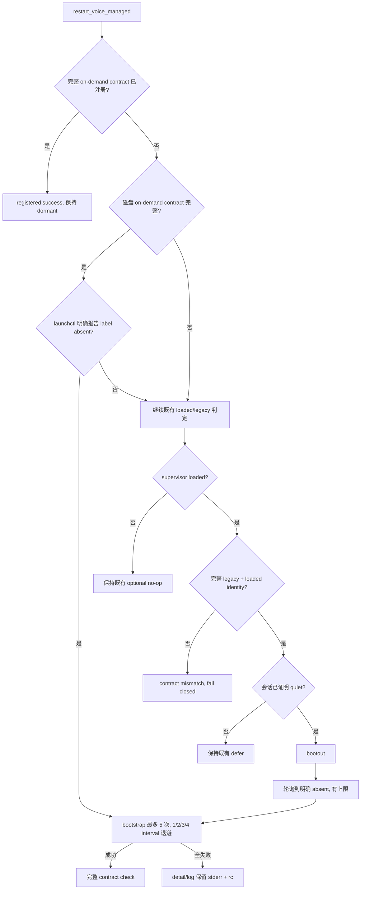

# FLY-2819 语音 launchd 迁移收敛 — 调研
Issue: FLY-2819 (https://linear.app/geoforge3d/issue/FLY-2819/班车部署阻塞-语音按需迁移-bootout-后立刻-bootstrap-失败报错被丢进-devnull-9-23-0000-pdt)
日期: 2026-09-23
基于: exploration.md

## 当前 HEAD 证据

基线为 `8fc0fab1a`。聚焦测试 `bash scripts/__tests__/restart-voice-on-demand.test.sh` 在修改前通过，但只覆盖“bootout/bootstrap 都立即成功”的无状态桩；它不覆盖 bootout 后 label 仍存在、bootstrap 短暂失败或磁盘契约已新但 label 缺失。

`scripts/lib/restart-voice.sh` 的现状：

- `voice_migrate_to_on_demand` 在 bootout 后立即复制 plist、chmod、bootstrap；bootout 与 bootstrap 都把 stdout/stderr 丢到 `/dev/null`。
- bootstrap 失败只返回 1，随后 `restart_voice_managed` 把 `VOICE_RESTART_DETAIL` 固定覆盖为 `on_demand_migration_failed`。
- `restart_voice_managed` 第一个分支是 `supervisor_is_loaded`。`launchctl print` 对缺失 label 返回非零后，函数以 `not_loaded` 成功返回；磁盘上的新 plist 从未被检查或重新注册。
- legacy 迁移前的三道安全门是完整 installed plist 匹配、loaded identity 匹配、会话状态证明 quiet。这些门必须原样保留。

`scripts/lib/voice-on-demand.sh` 的现有完整检查已经同时验证：source/installed/wrapper 是 owner 自有的非 symlink regular file、source 与 installed 字节相同、plist 字段完整匹配 on-demand 形态、loaded identity 指向 installed plist 与固定 wrapper。为了识别“磁盘正确但 label absent”，应只把前半段提取成独立 helper，不放宽原完整检查。

## 同仓工作模式

FLY-2758 已在 `scripts/lib/supervisor.sh` 修过同类 bootout/bootstrap EIO：

- 用 `launchctl print` 的非零退出加 `Could not find service|No such process` 文本证明 label absent；其他非零结果不当成 absent。
- 条件轮询有明确次数上限，避免任意 sleep 猜时序。
- bootstrap 有有限次数重试，并让 launchctl 原始 stderr 留在日志。
- 测试使用 stateful launchctl stub：bootout 后先保持 loaded，若干次 print 后转 absent，bootstrap 再转 loaded。

本单不能直接复用 supervisor 私有 helper：restart seam 还要求把 stderr 与退出码写入 `VOICE_RESTART_DETAIL`，重试次数也固定为 3。可复用的是条件等待与 stateful stub 的形状。

## 目标控制流

## 错误与日志合同

- wait 超时：不 bootstrap；`VOICE_RESTART_DETAIL` 说明 label 在有限轮询后仍未证明 absent，并写 restart 日志。
- bootstrap 单次失败：日志写 `attempt/max`、`rc=<n>` 和原始 stderr；失败后按 attempt × poll interval 线性退避。
- bootstrap 五次全失败：返回 1；`VOICE_RESTART_DETAIL` 保留最后一次的 rc 与原始 stderr，调用方不得再覆盖。
- bootstrap 成功后按同一有限预算轮询完整 contract；耗尽才返回 1 并给出 `on_demand_contract_check_failed_after_bootstrap`，避免把注册成功与契约收敛混为一谈，也避免一次瞬时 print 不可见触发整车回滚。

## 测试设计与阴性对照

扩展既有 `scripts/__tests__/restart-voice-on-demand.test.sh`，不新建 CI suite。stateful stub 用文件保存跨 command-substitution 的状态，避免 shell 子进程变量不回传。

八个独立场景都以聚合方式运行，旧实现上要分别记录失败而不是第一条失败就退出：

1. bootout 后两次 print 仍 loaded，第三次（或指定次数）才 absent；断言 bootstrap 发生在 absent 之后且只调用一次。
2. bootstrap 前两次返回 `Bootstrap failed: 5: Input/output error`，第三次成功；断言迁移返回成功、三次调用、最终完整契约通过。
3. bootstrap 五次都失败；断言返回失败、恰好五次、detail 与日志包含原始错误及 rc=5。
4. bootstrap 返回成功但完整 contract 两次 probe 后才可见；断言不会因第一次 print 缺失而误判失败，也不会重复 bootstrap。
5. source/installed 已是新契约、supervisor 未 loaded、launchctl 明确 absent；断言 `restart_voice_managed` 调用 bootstrap、状态为 registered，并通过完整契约检查。
6. 同一 residual 状态下 bootstrap 五次都失败；断言 `restart_voice_managed` 返回 1、state=failed，detail 保留 launchctl rc/原话。这条新 deploy rollback 路径是故障诚实性要求，不是未知 probe 的误杀。
7. 只 source `restart-voice.sh`、不预先 source `voice-on-demand.sh`；断言 lazy guard 同时装载完整/磁盘两个 helper 并恢复注册，覆盖真实生产 source 顺序。
8. supervisor helper 不在 scope 且 tuning 非法；断言使用默认值并把 warning 写入 restart 日志。

把 production 修复去掉后，场景 1 的第一次 print 发生在 bootstrap 之后，场景 2 因只试一次失败，场景 3 因只试一次且 detail 丢失，场景 4 因 bootstrap 后只检查一次 contract 而失败，场景 5/6 因 `not_loaded` no-op 而失败，场景 7 因 early return 跳过 lazy source 而失败，场景 8 因 tuning helper 不存在而失败，形成逐格阴性对照。

## 消费者扫描

对 `scripts/lib/restart-voice.sh` 的完整路径和文件名扫描得到四个直接消费者：

- `scripts/restart-services.sh`：生产调用与 rollback detail 传播，必须保留接口。
- `scripts/test-restart-services.sh`：聚合 restart shell 套件，必须运行。
- `scripts/__tests__/restart-voice-on-demand.test.sh`：直接行为测试，修改并运行。
- `scripts/__tests__/flywheel-voice-wrapper.test.sh`：source seam 与 on-demand 行为，必须运行。

对 `scripts/lib/voice-on-demand.sh` 的文件名扫描还得到：

- `scripts/install-voice-launchd.sh` 与 `scripts/__tests__/install-voice-launchd.test.mjs`：完整契约调用者与测试，必须运行。
- `scripts/flywheel-voice-wrapper.sh` 与 `scripts/__tests__/flywheel-voice-wrapper.test.sh`：完整契约调用者与测试，必须运行。
- `packages/teamlead/src/bridge/voice-launchd-waker.ts` 及其测试：只把脚本路径作为配置/契约输入，不调用新增磁盘 helper；扫描保留为影响面核对，TypeScript 行为不变。

父目录字符串 `scripts/lib` 的其余匹配全部引用其他 lib 成员、测试夹具目录或通用路径规则，没有 source/call `restart-voice.sh` 或 `voice-on-demand.sh`；它们不依赖本次函数合同，故不列入执行集。最终 diff 后会重跑三种检索并按实际变更复核这一排除。

## 本地验证范围

按实现节点规则，修改后的验证集为：

- `bash scripts/__tests__/restart-voice-on-demand.test.sh`
- `bash scripts/__tests__/flywheel-voice-wrapper.test.sh`
- `node --test scripts/__tests__/install-voice-launchd.test.mjs`
- `bash scripts/test-restart-services.sh`
- `pnpm lint`

本单不改 TypeScript，不适用 `vitest related`、package build 或 dependent typecheck。不会运行真实 mutating launchctl；529 slot/纯测试 domain 的真机验证留给 QA。
