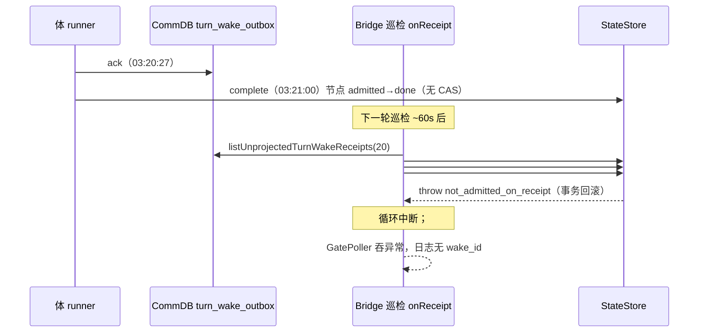
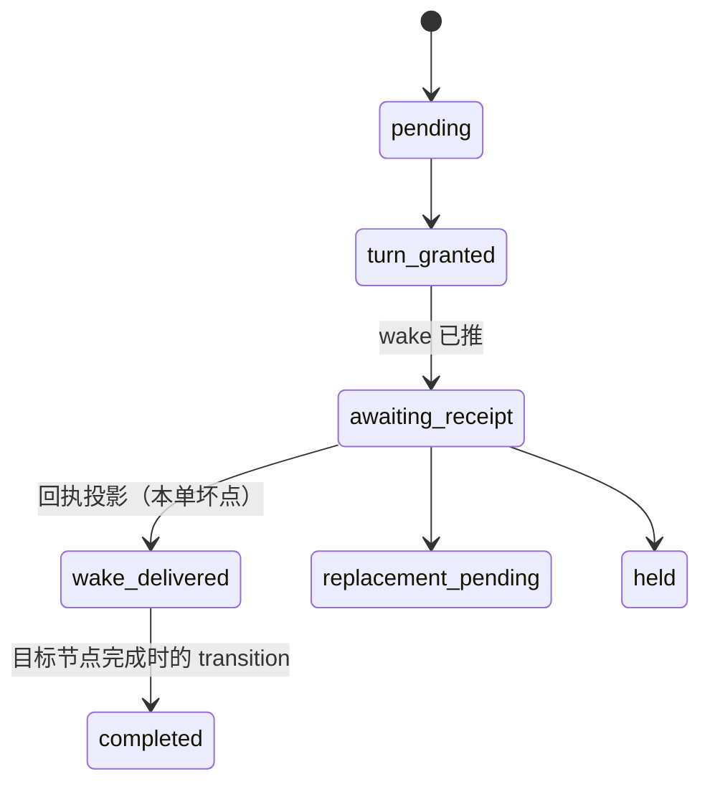

# FLY-2828 返工回执投影停摆 — 探索

Issue: FLY-2828 (https://linear.app/geoforge3d/issue/FLY-2828/病根-返工回执投影停摆体已-ack-但-receipt-projected-at-永不写入-delivery-卡-awaiting)
日期: 2026-09-24
基于: 无

## 0. 一句话结论

**根因到行**：`packages/teamlead/src/StateStore.ts:42518-42531`（`recordWorkflowReworkWakeReceipt`）把 `workflow_run_node` 从 `admitted` 改成 `running` 的 CAS 改了 0 行就 `throw new Error("workflow_rework_activation_not_admitted_on_receipt")`；而节点完成写点 `StateStore.ts:59049`（`projectGeneralizedCompletionTx`）把节点改成 `done` 时**不带前置状态 CAS**。体在巡检投影到场前（正常延迟 22–325 秒）就 `complete` 的返工，节点直接 `admitted → done`，随后每一轮回执投影必然抛异常。异常从 `onReceipt` 穿出 `drainTurnWakeOutbox`（`turn-wake-patrol.ts:133-141` 没有 try/catch），**整条投影循环在该行处中断**，队列里排在它后面的所有收据永远访问不到；异常最终被 `gate-poller.ts:654` 以 `[GatePoller] reconcile patrol error (non-fatal): <message>` 吞掉，**日志没有 wake_id**。

## 1. 矛盾的解答（issue「⭐ 唯一未解的矛盾」）

issue 的问题：「窗口 20 以内、却既不投影也不记日志的那 18 条走了哪条路？」

答案：**它们一条都没被访问到**。不是 `!activation || !run` 的无日志分支，也不是 `held` 日志漏打；而是循环在第 3 条就被异常终止了。

证据链（全部实测，2026-09-24 01:00Z 前后）：

| # | 证据 | 来源 |
|---|------|------|
| 1 | 队列顺序（`ORDER BY acked_at, wake_id`）前 3 条：FLY-2241（9-01）、FLY-2616（9-16）、**FLY-2781（9-23 03:20:27Z）** | 线上 `comm.db` 只读查询 |
| 2 | FLY-2241 的 delivery 是 `held` → 返回 `rework_wake_receipt_not_ready`（有日志）；FLY-2616 的 route revision 已推进到 2 且 preferred actor 换人 → `rework_wake_receipt_identity_conflict`（有日志）。这两条永远 `retry`，永远在队首 | `teamlead.db` join；bridge 日志 |
| 3 | FLY-2781（`general` 节点 attempt 2）：`started_at 03:20:21`、体 ACK `03:20:27`、节点 `ended_at 03:21:00`（**39 秒完成**）；delivery 停在 `awaiting_receipt`（generation 8、lease 一直续）；节点状态 `done` | `teamlead.db` |
| 4 | bridge 日志每一轮巡检的模式是「2 条 held + 1 条 `reconcile patrol error (non-fatal): workflow_rework_activation_not_admitted_on_receipt`」；当前 + 3 个轮转日志中该错误共 **127 次**，held 成对出现、从无第三条 | `/tmp/flywheel-bridge.log{,.1,.2,.3}` |
| 5 | 最后一次成功投影：`2026-09-22 23:46:58Z`；之后 0 条 | `comm.db` |

所以 issue 里问的两件事分别确认：

* 「窗口 20 以内既不投影也不记日志的 18 条」→ 循环在第 3 条中断，第 4–20 条**从未被访问**。
* 「窗口外 #21–#28 是否窗口饥饿」→ 也成立，但**不是当前的直接原因**：只要 #3 还在抛，窗口是 20 还是 200 都一样。修了 #3 的抛异常后，窗口饥饿才会成为下一层问题（两条永久 `retry` 的陈旧收据仍会占据前两个位置）。

QA 的收窄线索也解释了：「会打日志的两条是唯一不是当天 acked 的」——因为它们排在抛异常的那条**前面**。

## 2. 为什么 9-23 才爆

抛异常这行是 2026-08-21 FLY-1940（`772a116ed`）引入的，从那天起就是隐患。触发条件只有一个：**体在巡检投影之前就完成节点**。

* 投影延迟 = reconcile patrol 节拍（3s tick × 20 = 60s）+ 巡检自身耗时。实测 9-11 到 9-22 的投影延迟：均值 22–138 秒，最大 351 秒。
* 一个 39 秒完成的 `general` 节点（FLY-2781，文档类返工）第一次卡在了这个窗口里。
* 历史上有 7 条投影时节点已 `done` 的收据（8-23 到 9-16）**没有**抛异常，是因为它们的 delivery 已经被别的路径推进到 `wake_delivered`/`completed`，`recordWorkflowReworkWakeReceipt` 在 CAS 之前就以 `idempotentReplay` 返回了。其中 9-16 那两条（FLY-2606 / FLY-2616）延迟 5–7 小时才投影，正是 FLY-2640 同形事件被手工结算后「解卡」的痕迹。

## 3. 爆炸半径（比 issue 描述的更大）

`onReconcilePatrolTick`（`plugin.ts:12641`）在 `drainTurnWakeOutbox` 之后还串着：

* `reconcileWorkflowTurnLedgers`
* `projectWorkflowEngineParkOutbox`
* `terminalGateRetirement.pass()`
* `orphanFounderReviewMonitorTick()`
* `leadInboxRuntime.reconcileRetiredLeadMailboxes()`

异常从 `drainTurnWakeOutbox` 穿出后，**这五步从 9-23 03:20Z 起每一轮都没有执行**。本单的修复范围只到「投影循环不再被单条收据炸掉」，但要在 plan 里明确指出这条副作用，让 Lead 决定是否另开单核查这五步的积压。

## 4. 停摆后的连锁（为什么表现为 rework_already_open）

* `workflow_rework_delivery` 只有回执投影这一条路能从 `awaiting_receipt` 到 `wake_delivered`。
* `workflow_rework_verification_path` 只有回执投影这一条路能从 `pending` 到 `active`（`StateStore.ts:42535`）。
* 目标节点完成时（`commitWorkflowTransitionTx`，`StateStore.ts:64400`）只查 `state='active' AND current_node_id=? AND current_attempt=?` 的 path；path 还是 `pending` 就**当作没有返工**照常推进，path 永远留在 `pending`。
* coordinator（`workflow-rework-coordinator.ts:440-456`）对 `awaiting_receipt` 只接受 `target.state==='admitted'`；节点已 `done` 就 `rework_target_not_reserved` → `releaseRetryable` → `settleWorkflowReworkFailure` 只对 `pending|turn_granted` 生效，`awaiting_receipt` 直接 `stale_delivery_owner` → 只 release 不结算 → 下一轮再 claim，generation 无限涨。这就是「看起来活的，其实空转」。
* 两道门：Lead 返工（`StateStore.ts:50563`）查 delivery ∪ verification_path；founder 打回（`StateStore.ts:66543`）只查 delivery。

## 5. 两道门为什么不对称

* founder 打回门（`openPendingCarryoverFounderFeedbackTx`）来自 2026-08-18 FLY-1833（`87e9e8352`），只查 delivery。
* Lead 返工门（`openOperatorRework`）的 `UNION ALL verification_path` 是 2026-09-03 FLY-2248（`64c1c9859`）加的；FLY-2248 的设计文档没有提到 founder 门，founder 门也没同步改。
* 另一方面 `commitWorkflowTransitionTx` 里 `supersedingRework = activePath && authorityKickback`（2026-07 就有）是为「path 处于 `active` 时 founder/QA 打回」专门建模的合法路径：打回会把 path 收成 `completed` 再开新返工。
* 结论：这不是有意的不对称，而是 FLY-2248 只改了一边。但「path 为 `active` 时 founder 打回应被允许（superseding）」是既有语义。所以对齐的正确形状是：**两道门共用同一个谓词函数**，谓词 = delivery 未结算 **或** verification_path 为 `pending`；`active` 的 path 由 superseding 语义处理（founder 门放行，Lead 门是否放行按现状保持拒绝并写明理由——Lead 手工返工不走 superseding 路径，让它在 active 期间开第二条返工会撞 `rework_target_reserved`）。具体在 plan 里定。

## 6. 已排除项（与 issue 一致，不再查）

* comm.db 分裂：否。
* activation/run 解析失败：否（30/30 命中，本次多了 FLY-2803 QA@2 一条）。
* `!activation || !run` 无日志分支：对全部 30 条都不成立。

## 7. 现状快照（2026-09-24 01:10Z）

* `turn_wake_outbox`：acked 且未投影 **30 条**（issue 写作时 28，随后新增 FLY-2799 e14、FLY-2803 e8）；其中 delivery 仍 `awaiting_receipt` 的 18 条，`completed` 的 12 条（含 B 手工结算的两条，均会以 idempotentReplay 投影成功）。
* 30 条中节点仍 `admitted` 的 9 条**本可正常投影**（只要循环能走到它们）；节点已 `done` 的 21 条中，delivery 仍 `awaiting_receipt` 的会继续抛异常（新的毒行）。
* 现存告警车道：`materializeTurnWakeNoReceiptAlerts` 只覆盖 `state='sent' AND acked_at IS NULL`（体没 ACK）；`rework_activation_stalled_alerted` 车道 2026-09-04 已退役（源码无发射点）。「体已 ACK、回执未投影」和「delivery 在 awaiting_receipt 空转」**没有任何可见告警**。

## 8. 修复方向（供 research/plan 展开）

1. **完成即回执**：`commitEnrolledCompletion` 主事务里、`commitWorkflowTransitionTx` 之前，如果 binding 带 `rework_request_id`、delivery 为 `awaiting_receipt`、route 的 preferred actor 就是本 execution，则内联投影回执（delivery→`wake_delivered`、path `pending`→`active`、节点 `admitted`→`running`、同一个 `rework_wake_receipt:<activation>:<epoch>` 事件 uid）。完成命令本身就是「wake 已送达」的证明（activation 凭证 + turn epoch 校验都在 `commitEnrolledCompletion` 里）。之后 CommDB 那条收据到场时以 idempotentReplay 收尾。
2. **投影循环隔离**：每条收据 try/catch；任何 `retry` 与异常都打带 wake_id 的日志；`markTurnWakeReceiptProjected` 返回值必须检查；把「陈旧收据」（identity_conflict、held/needs_lead 不可恢复）判成终态 `not_applicable`，不再永久占位；对仍会 `retry` 的收据计数并降级排序。
3. **可见告警**：新增「acked 超过 N 分钟未投影」车道，一条一次，进 Lead question。
4. **两道门共用谓词**。
5. 回归测试按 issue 六条要求覆盖。
