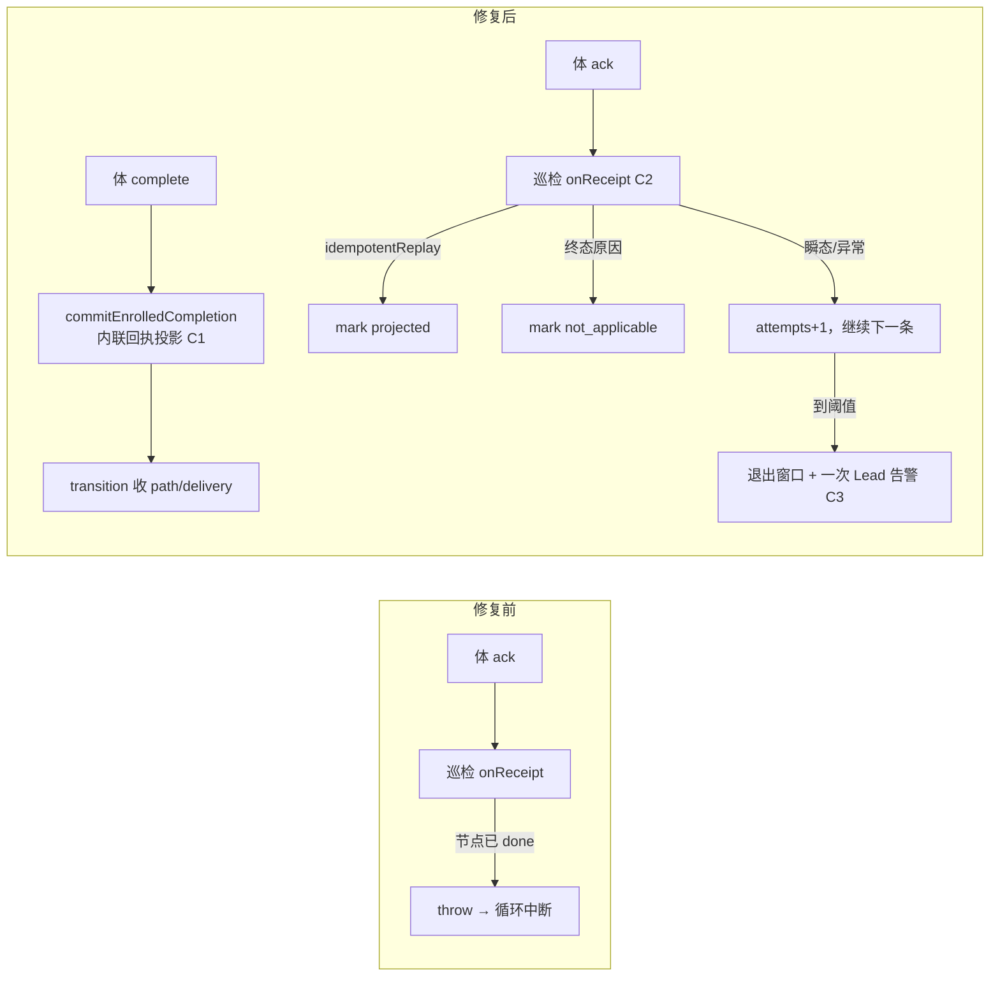

# FLY-2828 返工回执投影停摆 — 实施计划

Issue: FLY-2828 (https://linear.app/geoforge3d/issue/FLY-2828/病根-返工回执投影停摆体已-ack-但-receipt-projected-at-永不写入-delivery-卡-awaiting)
日期: 2026-09-24
基于: research.md

**Version**: v1.58.0
**Status**: draft

## 0. 目标与非目标

**目标**（对应 issue「修复要求」1–6）：

1. 根因已到行（exploration §0），本计划把它修掉：返工 activation 的体在巡检投影前完成节点时，回执不再永久投影失败。
2. 巡检投影循环对单条收据的失败隔离：任何一条收据都不能中断循环、不能永久占窗。
3. 每一次 `retry` 与每一次 mark 失败都有带 `wake_id` 与原因的日志。
4. 「体已 ACK、收据长期未投影」成为一次性的可见 Lead 告警。
5. Lead 返工门与 founder 打回门共用同一个「返工已打开」谓词，`active` path 的差异显式写明。
6. 回归测试覆盖 issue §6 四条 + research §8 两条。

**非目标**：

* 不改通用节点完成写点 `projectGeneralizedCompletionTx`（`StateStore.ts:59049`）的 CAS 语义。
* 不改 `onReconcilePatrolTick` 中 `drainTurnWakeOutbox` 之后五步的顺序或容错（exploration §3 的副作用另开单）。
* 不做线上积压的自动结算；plan §7 给一次性人工判据。
* 不改 rework coordinator 的状态机（`awaiting_receipt` 之后的推进仍只经回执投影或 replacement）。

## 1. 变更总览



| Chunk | 内容 | 主要文件 |
|-------|------|----------|
| C1 | 完成即回执：`commitEnrolledCompletion` 主事务内、`commitWorkflowTransitionTx` 之前内联投影 | `packages/teamlead/src/StateStore.ts` |
| C2 | 投影循环隔离 + 日志 + 终态判定 + attempts 排序/隔离 | `packages/flywheel-comm/src/db.ts`、`packages/teamlead/src/bridge/turn-wake-patrol.ts`、`packages/teamlead/src/bridge/plugin.ts` |
| C3 | 未投影收据告警车道 | `packages/flywheel-comm/src/db.ts`、`turn-wake-patrol.ts` |
| C4 | 两道门共用谓词 | `packages/teamlead/src/StateStore.ts` |
| C5 | 回归测试 | `packages/teamlead/src/bridge/__tests__/turn-wake-patrol.test.ts`、`packages/teamlead/src/bridge/__tests__/workflow-rework.e2e.test.ts`、`packages/teamlead/src/__tests__/StateStore.workflow-rework.test.ts`、`packages/teamlead/src/__tests__/StateStore.founder-kickback-newcard-loop.test.ts`、`packages/flywheel-comm/src/__tests__/worktree-turn.test.ts` |

实施顺序：C2 → C3 → C1 → C4 → C5 逐条跟随（TDD：每个 chunk 先写红测试）。C2/C3 先落是因为它们让线上停摆立刻恢复（循环不再被炸），C1 才是根因修复。

## 2. C1 完成即回执

### 2.1 抽事务体

把 `recordWorkflowReworkWakeReceipt`（`StateStore.ts:42424-42566`）的 `this.db.transaction(() => …)` 内部抽成私有方法：

```ts
private projectWorkflowReworkWakeReceiptTx(input: {
  activationId: string;
  executionId: string;
  epoch: number;
  ackedAt: string;
  alertIdentity: WorkflowEngineAlertIdentity;
  source: "turn_wake_receipt" | "completion_implied";
}):
  | { ok: true; idempotentReplay: boolean }
  | { ok: false; reason: string }
```

行为与现状逐字相同，只改三处：

1. 节点 CAS（42518-42531）改为：
   * 节点 `state === 'admitted'` 且 `execution_id === input.executionId` → `UPDATE … SET state='running' WHERE … AND state='admitted'`，改 0 行仍 `throw`（并发保护不变）。
   * 节点 `state === 'running'` 且 `execution_id === input.executionId` → 跳过 UPDATE（已由 replacement 启动路径 `markWorkflowReplacementStartedTx` 或本入口的另一次调用推进）。
   * 其他（`done|failed|superseded|pending` 或 execution 不符）→ `return { ok: false, reason: "rework_wake_receipt_node_not_reserved:<state>" }`，**不 throw**。这是修复前遗留毒行的落点，归 C2 的终态类。
2. 事件 payload 增加 `source` 字段（uid 不变：`rework_wake_receipt:<activation_id>:<epoch>`）。
3. `recordWorkflowReworkWakeReceipt` 变成薄封装：入参校验 → `transaction(projectTx)` → `save()`。返回类型不变，`plugin.ts` 调用点不改。

### 2.2 在完成入口内联

`commitEnrolledCompletion` 主事务（`StateStore.ts:62150`）里，`classifyCurrentWorkflowWriterTx` 通过之后、`commitWorkflowTransitionTx`（62346）之前，插入：

```ts
const implied = this.implyWorkflowReworkWakeReceiptOnCompletionTx({
  binding: context.binding,
  now,
  alertIdentity: input.alertIdentity,
});
```

`implyWorkflowReworkWakeReceiptOnCompletionTx` 的资格谓词（全部成立才投影，否则返回 `{ applied: false, reason }` 且完成照常）：

* `binding.rework_request_id` 非空；
* `delivery = getWorkflowReworkDelivery(requestId)` 存在且 `state === 'awaiting_receipt'`；
* `route = getLatestWorkflowReworkRoute(requestId)` 存在，`delivery.route_revision === route.revision`，`route.preferred_actor_execution_id === binding.execution_id`；
* `turn = getWorkflowActivationTurn(binding.activation_id)` 存在，`turn.execution_id === binding.execution_id`；
* `node = getWorkflowRunNode(run, node, attempt)`，`node.state === 'admitted'`，`node.execution_id === binding.execution_id`。

命中时调用 `projectWorkflowReworkWakeReceiptTx({ activationId: binding.activation_id, executionId: binding.execution_id, epoch: turn.epoch, ackedAt: now, alertIdentity: input.alertIdentity, source: "completion_implied" })`。返回 `ok:false` 时 **throw `WorkflowEngineInvariantError("rework_receipt_implied_on_completion_failed:<reason>")`**：资格谓词已经排除了所有合法的失败原因，走到这里只能是并发改写，让完成事务回滚并由 runner 重试（`commitEnrolledCompletion` 现有的 `engine_completion_transition_refused` 通道）。

`alertIdentity`：`commitEnrolledCompletion` 的 `input.alertIdentity` 已是必填（62351 直接传给 transition）。

### 2.3 完成路径的其他入口

| 入口 | 处理 |
|------|------|
| `commitEnrolledCompletion` 带 activation（62150 主事务） | 内联（本节） |
| `commitEnrolledCompletion` 不带 activation（legacy 单 activation） | 同一主事务，同一插入点；`binding.rework_request_id` 为空时谓词自然不命中 |
| 62007 的重放事务（`existing` 完成回执已存在） | 不插：首次完成已经投影过；此处只重放 disposition |
| 55514 hold-resume 完成（`resume_*` 决议） | 不插：hold 解除的完成走 `allowCompletedWriter`，其 delivery 已由 hold 路径结算（55273 `UPDATE workflow_rework_delivery`）；在测试 T7 里断言这条路径不受影响 |
| 62525 teardown 投影 | 不插：只投影 `done`，没有 transition |

### 2.4 事件与回滚边界

* 事件 `rework_delivery_wake_delivered`（uid `rework_wake_receipt:<activation>:<epoch>`，payload 新增 `source:"completion_implied"`）与随后 transition 的事件在同一事务提交；事务失败整体回滚，不留半状态。
* 回滚：C1 是纯代码，回退 = revert；已写入的 `source` 字段只是 payload 附加键，旧代码不读。

## 3. C2 投影循环隔离

### 3.1 CommDB（`packages/flywheel-comm/src/db.ts`）

**新列**（建表 DDL 280-306 与迁移 1670-1678 同步加；`TurnWakeOutboxRow` 522-545 同步加字段）：

| 列 | 类型 | 用途 |
|----|------|------|
| `projection_attempts` | `INTEGER NOT NULL DEFAULT 0` | 投影失败次数 |
| `projection_last_error` | `TEXT` | 最近一次失败/终态原因 |
| `projection_alerted_at` | `INTEGER` | C3 告警时间 |
| `projection_alert_question_id` | `TEXT` | C3 question id |

迁移形状照抄 1670-1678（`PRAGMA table_info` 缺列则 `ALTER TABLE ADD COLUMN`）。四列均可空或有默认值，旧行无需回填。**回滚**：旧版本代码忽略未知列；`ALTER TABLE ADD COLUMN` 不需要 down migration（与 `receipt_projected_at` 同理）。

**方法改动**：

```ts
listUnprojectedTurnWakeReceipts(limit = 100, quarantineAfterAttempts = 20): TurnWakeOutboxRow[]
// WHERE state='acked' AND acked_at IS NOT NULL AND receipt_projected_at IS NULL
//   AND projection_attempts < ?
// ORDER BY projection_attempts, acked_at, wake_id LIMIT ?

markTurnWakeReceiptProjected(wakeId, projectedAtMs, disposition: "projected" | "not_applicable", reason?: string): boolean
// SET receipt_projected_at = ?, projection_last_error = CASE WHEN ? = 'not_applicable' THEN ? ELSE NULL END
// WHERE 同现状；changes === 1

recordTurnWakeReceiptProjectionAttempt(wakeId, reason: string, nowMs): { attempts: number } | null
// UPDATE … SET projection_attempts = projection_attempts + 1, projection_last_error = ?
// WHERE wake_id = ? AND state='acked' AND receipt_projected_at IS NULL
// 返回更新后的 attempts（changes !== 1 → null）
```

`not_applicable` 复用 `receipt_projected_at` 作为「已处置」标记（现状对 `purpose` 不匹配的行已这样做），用 `projection_last_error` 区分「投影成功」与「终态跳过」。

### 3.2 patrol（`turn-wake-patrol.ts:133-141`）

`onReceipt` 返回类型改为：

```ts
type TurnWakeReceiptOutcome =
  | { kind: "projected" }
  | { kind: "not_applicable"; reason: string }
  | { kind: "retry"; reason: string };
```

循环：

```ts
for (const receipt of db.listUnprojectedTurnWakeReceipts(maxPerProject, quarantineAfterAttempts)) {
  let outcome: TurnWakeReceiptOutcome;
  try { outcome = await input.onReceipt(receipt); }
  catch (error) { outcome = { kind: "retry", reason: `exception:${message(error)}` }; }
  if (outcome.kind === "retry") {
    const attempt = db.recordTurnWakeReceiptProjectionAttempt(receipt.wake_id, outcome.reason, nowMs);
    console.warn(`[turn-wake] receipt projection retry for ${receipt.wake_id}: ${outcome.reason} (attempt ${attempt?.attempts ?? "?"})`);
    if (attempt && attempt.attempts >= quarantineAfterAttempts) quarantinedWakeIds.add(receipt.wake_id);
    continue;
  }
  const marked = db.markTurnWakeReceiptProjected(receipt.wake_id, nowMs, outcome.kind, outcome.kind === "not_applicable" ? outcome.reason : undefined);
  if (!marked) console.warn(`[turn-wake] receipt projection mark failed for ${receipt.wake_id} (${outcome.kind})`);
  if (outcome.kind === "not_applicable") console.warn(`[turn-wake] receipt not applicable for ${receipt.wake_id}: ${outcome.reason}`);
}
```

* `quarantineAfterAttempts` 新入参，默认 20（巡检每 60s 一轮 → 约 20 分钟）。
* `quarantinedWakeIds` 交给 C3 立即物化告警。
* 返回值增加 `receipts: { projected, notApplicable, retried, quarantined }` 计数（现有三个字段不动，测试用 `toMatchObject`）。

### 3.3 handler（`plugin.ts:12858-12908`）

返回值改为判别联合，并按 research §3.1 分类：

| 情形 | 返回 |
|------|------|
| `!receipt.activation_id \|\| acked_at === null` | `not_applicable: "legacy_or_unacked"`（现状语义） |
| `purpose` 不是 rework/carrier | `not_applicable: "purpose:<purpose>"`（现状语义） |
| `!activation \|\| !run` | `retry: "activation_or_run_unresolved"`（**补日志**，由 patrol 层统一打） |
| `projected.ok` | `projected` |
| reason ∈ {`rework_wake_receipt_identity_conflict`} | `not_applicable: reason` |
| reason === `rework_wake_receipt_not_ready` 且 `store.getWorkflowReworkDelivery(binding.rework_request_id).state ∈ {held, needs_lead, replacement_pending}` | `not_applicable: "${reason}:${state}"` |
| reason 以 `rework_wake_receipt_node_not_reserved:` 开头 且 run.status ≠ `active` | `not_applicable: reason`（run 已终止，无人再消费） |
| reason 以 `rework_wake_receipt_node_not_reserved:` 开头 且 run.status === `active` | `retry: reason`（到阈值隔离 + 告警，交 Lead 人工结算；这是修复前遗留形态） |
| 其他 reason | `retry: reason` |

carrier 分支同形改造（`recordWorkflowCarrierWakeReceipt` 的失败也带 reason 返回 `retry`），不改其 StateStore 逻辑。

## 4. C3 未投影收据告警

`db.ts` 新增（形状照抄 `materializeTurnWakeNoReceiptAlerts` 8310-8378）：

```ts
materializeTurnWakeUnprojectedReceiptAlerts(input: { nowMs: number; alertAfterMs: number; wakeIds?: string[] }): string[]
// WHERE w.state='acked' AND w.acked_at IS NOT NULL AND w.receipt_projected_at IS NULL
//   AND w.projection_alerted_at IS NULL AND w.acked_at <= nowMs - alertAfterMs [AND w.wake_id IN (...)]
// leadId 同现有 COALESCE(s.lead_id, l.lead_id)；无 leadId 跳过
// questionId = `turn-wake-projection-alert:${wake_id}`
// insertQuestion("bridge", leadId, `TURN wake acked but receipt never projected for ${issue_id}: ${execution_id}, epoch ${epoch}, activation ${activation_id}, wake ${wake_id}, attempts ${projection_attempts}, last ${projection_last_error ?? "n/a"}. Inspect workflow_rework_delivery for the activation's rework request.`, { id: questionId })
// UPDATE … SET projection_alerted_at=?, projection_alert_question_id=? WHERE wake_id=? AND projection_alerted_at IS NULL AND receipt_projected_at IS NULL
```

patrol 在投影循环之后：

```ts
alerts += db.materializeTurnWakeUnprojectedReceiptAlerts({ nowMs, alertAfterMs: projectionAlertAfterMs }).length;
if (quarantinedWakeIds.size) alerts += db.materializeTurnWakeUnprojectedReceiptAlerts({ nowMs, alertAfterMs: 0, wakeIds: [...quarantinedWakeIds] }).length;
```

* `projectionAlertAfterMs` 新入参，默认 15 分钟。
* 一条收据一生只告警一次（`projection_alerted_at IS NULL` 守卫），投影成功后不再补消息。
* 这条车道与现有 `turn-wake-alert:<wake>`（体没 ACK）互斥：前者要求 `state='acked'`，后者 `state='sent'`。

## 5. C4 两道门共用谓词

`StateStore` 新增：

```ts
findOpenWorkflowReworkForRun(runId: string):
  | { requestId: string; source: "delivery"; state: WorkflowReworkDeliveryRow["state"] }
  | { requestId: string; source: "verification_path"; state: "pending" | "active" }
  | undefined
```

SQL = 现有 Lead 门 UNION（50563-50573），path 部分改为 `state IN ('pending','active')` 并把 state 带出；delivery 优先。

| 门 | 位置 | 新判定 |
|----|------|--------|
| `openOperatorRework` | 50563-50577 | `open && !(open.source==='verification_path' && open.state==='active')` 之外**全部**拒 → 即 delivery 任一未结算态、path `pending`、path `active` 都拒（**与现状逐字等价**，只是换成共用谓词） |
| `openPendingCarryoverFounderFeedbackTx` | 66543-66554 | delivery 未结算 → 拒（现状）；path `pending` → **新增拒**，同一个 `rework_already_open` 错误；path `active` → 放行（现状，`supersedingRework` 合法对象） |

代码注释写明：path `pending` = 返工的体还没回执，此时再开返工必撞 `rework_target_reserved`；path `active` 是 founder/QA 打回的 superseding 对象，Lead 手工返工不走 superseding 所以仍拒。

founder 门的拒绝通道不变（`throw new Error("founder feedback kickback failed: rework_already_open")`，由 67568 的调用方按现状处理）。

## 6. C5 测试

| ID | 文件 | 断言 |
|----|------|------|
| T1 积压 > 窗口 | `turn-wake-patrol.test.ts` | 25 条 acked 收据、`maxPerProject: 5`；`onReceipt` 对 wake-1/wake-2 永远 `retry`；跑 6 轮后 23 条 `receipt_projected_at` 非空、wake-1/2 `projection_attempts === 6`；每轮访问顺序为 attempts 小者优先 |
| T2 队首永久失败 | 同上 | `onReceipt` 对 wake-1 `throw`；断言 wake-2 在同一轮被投影、循环返回值 `retried:1`、`console.warn` 收到含 `wake-1` 与 `exception:` 的行；`quarantineAfterAttempts: 3` 跑 3 轮后 wake-1 不再出现在列表、`projection_alerted_at` 非空、Lead question `turn-wake-projection-alert:wake-1` 存在且只 1 条；第 4 轮不再重复告警 |
| T3 无日志分支 | 同上 | `onReceipt` 返回 `retry:"activation_or_run_unresolved"` → warn 含 wake_id 与该 reason；`markTurnWakeReceiptProjected` 被 stub 成 false → warn `mark failed` |
| T4 not_applicable 终态 | 同上 | `onReceipt` 返回 `not_applicable:"rework_wake_receipt_identity_conflict"` → `receipt_projected_at` 非空、`projection_last_error` 等于原因、不告警 |
| T5 两道门 | `StateStore.workflow-rework.test.ts` | 造 delivery `completed` + path `pending`：`openOperatorRework` → `rework_already_open`；founder 打回（`StateStore.founder-kickback-newcard-loop.test.ts` 夹具）→ throw `rework_already_open`；path 改 `active`：founder 放行、Lead 仍拒 |
| T6 完成先于回执 | `workflow-rework.e2e.test.ts:1040-1140` 反转 | `commitEnrolledCompletion` 先：`ok:true`；path `completed`（chained）或按该用例既有期望；delivery `completed`；事件 `rework_wake_receipt:<activation>:<epoch>` payload `source:"completion_implied"`；随后 `recordWorkflowReworkWakeReceipt` → `{ok:true, idempotentReplay:true}` |
| T7 hold-resume 完成不受影响 | `StateStore.workflow-rework.test.ts` 现有 hold 用例 | 加断言：resume 完成路径不产生 `rework_wake_receipt:*` 事件 |
| T8 节点已 running 时回执 | `StateStore.workflow-rework.test.ts:2706` 附近 | 先 `markWorkflowReplacementStartedTx` 或直接把节点置 running，再 `recordWorkflowReworkWakeReceipt` → `ok:true, idempotentReplay:false`，不 throw |
| T9 节点已 done 时回执 | 同上 | 节点 `done` + delivery `awaiting_receipt` → `{ok:false, reason:"rework_wake_receipt_node_not_reserved:done"}`，**不 throw**，delivery 不变 |
| T10 CommDB 迁移 | `worktree-turn.test.ts` | 用旧 DDL 建库（无四列）再打开 → `PRAGMA table_info` 含四列；`listUnprojectedTurnWakeReceipts` 排序与 quarantine 过滤；`recordTurnWakeReceiptProjectionAttempt` 对已投影行返回 null |
| T11 完成入口谓词负样本 | `StateStore.workflow-rework.test.ts` | delivery `turn_granted` / route revision 落后 / preferred actor 非本 execution / 节点已 running：完成照常、无 `completion_implied` 事件 |

## 7. 上线与线上积压处置

* 发布顺序：`pnpm --filter flywheel-comm build` → `pnpm --filter teamlead build` → 由独立 updater 在窗口部署（自托管规则）。CommDB 迁移在 Bridge 首次打开 `comm.db` 时自动执行。
* 上线后第一轮巡检预期：30 条积压中 delivery 已 `completed` 的 12 条以 `idempotentReplay` 投影；节点仍 `admitted` 的 9 条正常投影；其余按 §3.3 判定——run 已 `terminated|completed|held` 的直接 `not_applicable`，run 仍 `active` 的（当前只有 FLY-2803 QA@2 一条）在 20 轮后隔离并告警，由 Lead 按 FLY-2799/2803 的 B 手法决定结算。
* 验收证据：`sqlite3 comm.db "SELECT count(*) FROM turn_wake_outbox WHERE state='acked' AND receipt_projected_at IS NULL AND projection_attempts < 20"` 在上线 30 分钟后 ≤ 1；bridge 日志出现 `receipt projection retry for <wake>` 行且不再出现 `reconcile patrol error (non-fatal): workflow_rework_activation_not_admitted_on_receipt`。

## 8. 风险与取舍

| 取舍 | 选择 | 拒绝的替代 |
|------|------|------------|
| 修根因的位置 | 在完成入口内联投影（完成是 wake 送达的充分证据，且已有 activation+turn 校验） | 在 `projectGeneralizedCompletionTx:59049` 加 CAS 拒绝完成——会把已 superseded/failed 节点的完成语义一起改掉，且让体的 complete 失败 |
| 毒行处置 | 分类：终态标 `not_applicable`、瞬态计数、到阈值隔离+告警 | 只降级排序不隔离——永久失败者仍每轮占一次 StateStore 事务；只隔离不告警——Lead 看不见 |
| 告警去重 | 一生一次，成功不补消息 | 每轮告警——重蹈 `rework_activation_stalled_alerted` 12552 条的噪音 |
| 两道门 | 共用谓词，保留 `active` 的合法差异并写明 | 完全对齐（founder 门也拒 `active`）——会禁掉 `supersedingRework` 既有合法路径 |
| 异常处理 | `not_admitted` 从 throw 改为带 reason 的 `ok:false`；并发 CAS 失败仍 throw | 保留 throw 靠 patrol try/catch 兜底——StateStore 事务回滚后 reason 不可判别，无法分类 |

## 9. 完成定义

* C1–C5 合入同一 PR；`pnpm --filter flywheel-comm test`、`pnpm --filter teamlead test`（含 T1–T11）绿；biome/typecheck 绿。
* PR body 附 §7 验收证据查询语句（实际数值由 QA 在部署后采集）。
* 本文档随 PR 合入 main。
