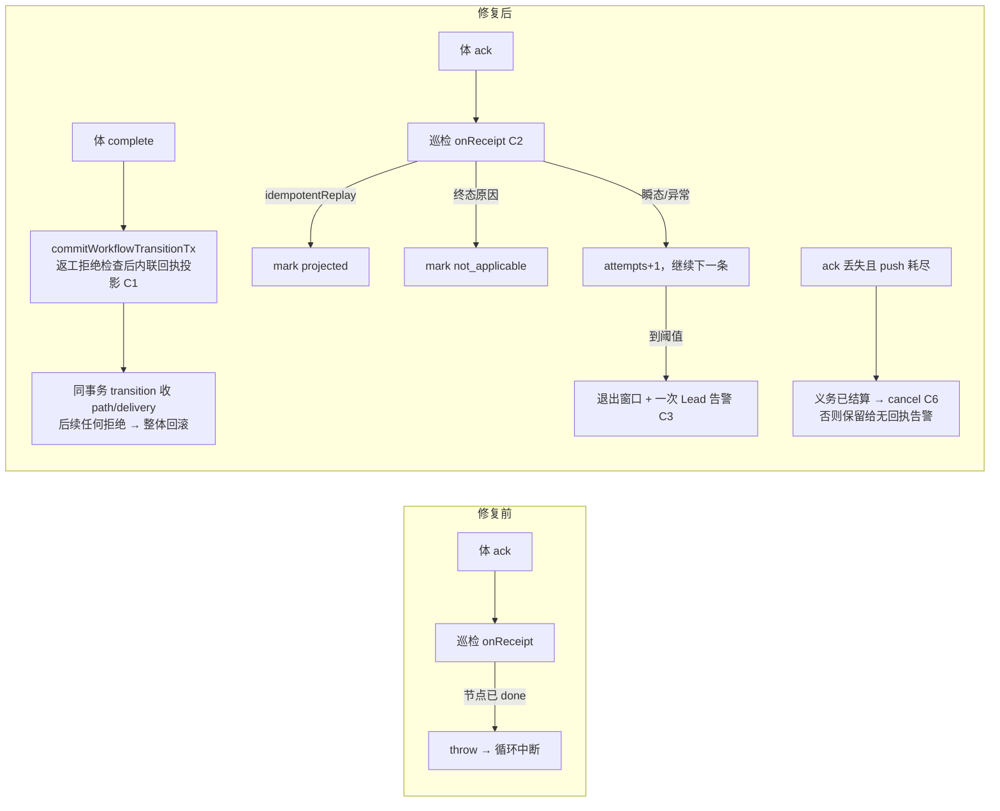

# FLY-2828 返工回执投影停摆 — 实施计划

Issue: FLY-2828 (https://linear.app/geoforge3d/issue/FLY-2828/病根-返工回执投影停摆体已-ack-但-receipt-projected-at-永不写入-delivery-卡-awaiting)
日期: 2026-09-24
基于: research.md

**Version**: v1.58.0
**Status**: draft (v4, Codex round 1–3 反馈已并入)

## 0. 目标与非目标

**目标**（对应 issue「修复要求」1–6）：

1. 根因已到行（exploration §0），本计划把它修掉：返工 activation 的体在巡检投影前完成节点时，回执不再永久投影失败，也不再留下 `delivery ∈ {pending, turn_granted, awaiting_receipt} + node=done` 的搁浅形态。
2. 巡检投影循环对单条收据的失败隔离：任何一条收据都不能中断循环、不能永久占窗。
3. 每一次 `retry` 与每一次 mark 失败都有带 `wake_id` 与原因的日志。
4. 「体已 ACK、收据长期未投影」成为一次性的可见 Lead 告警；「完成已证明送达、CommDB 却永远 `sent`」不再产生假的「无回执」告警，且**每一条故意不结算的行都有一条耐久的 Lead question**。
5. Lead 返工门与 founder 打回门共用同一个「返工已打开」谓词，完全对齐。
6. 回归测试覆盖 issue §6 四条 + 本文 §8 全部用例。

**非目标**：

* 不改通用节点完成写点 `projectGeneralizedCompletionTx`（`StateStore.ts:59048-59052`）的 CAS 语义。
* 不改 `onReconcilePatrolTick` 中 `drainTurnWakeOutbox` 之后五步的顺序或容错（exploration §3 的副作用另开单）。
* 不做线上积压 StateStore 行的自动结算。
* 不改 rework coordinator 的推进逻辑；只让它在完成先到时安全收敛（§2.5）。

## 1. 变更总览



| Chunk | 内容 | 主要文件 |
|-------|------|----------|
| C1 | 完成即回执：`commitWorkflowTransitionTx` 内、返工拒绝检查之后内联投影；后续拒绝整体回滚 | `packages/teamlead/src/StateStore.ts` |
| C2 | 投影循环隔离 + 日志 + 终态判定 + attempts 排序/隔离 | `packages/flywheel-comm/src/db.ts`、`packages/teamlead/src/bridge/turn-wake-patrol.ts`、`packages/teamlead/src/bridge/plugin.ts` |
| C3 | 未投影收据告警车道（按 purpose 出诊断） | `packages/flywheel-comm/src/db.ts`、`turn-wake-patrol.ts` |
| C4 | 两道门共用谓词，完全对齐 | `packages/teamlead/src/StateStore.ts` |
| C6 | push 耗尽且未 ACK 的 wake：义务已结算才 cancel，其余保留给现有无回执告警 | `packages/flywheel-comm/src/db.ts`、`turn-wake-patrol.ts`、`StateStore.ts`（`inspectWorkflowTurnWakeRetry` 判定顺序） |
| C5 | 回归测试 | 见 §8 |

实施顺序：C2 → C3 → C6 → C1 → C4，每个 chunk 先写红测试（TDD）。

## 2. C1 完成即回执

### 2.1 抽事务体（先读后写）

把 `recordWorkflowReworkWakeReceipt`（`StateStore.ts:42424-42566`）的事务内部抽成私有方法：

```ts
private projectWorkflowReworkWakeReceiptTx(input: {
  activationId: string;
  executionId: string;
  epoch: number;
  ackedAt: string;
  alertIdentity?: WorkflowEngineAlertIdentity;   // 巡检入口必传（外层校验不变）；完成入口可缺
  source: "turn_wake_receipt" | "completion_implied";
}):
  | { ok: true; idempotentReplay: boolean }
  | { ok: false; reason: string }
```

与现状的差异（其余逐字保留）：

1. **所有前置读取与判定移到第一条写之前**（回应 Codex R2 #2a）。顺序：binding/turn/request/route/delivery/run 解析 → 身份校验（`identity_conflict`）→ `wake_delivered|completed` 幂等回放 → **源允许的 delivery 起始态**校验 → 节点校验 → path 校验 → 然后才写。任何 `ok:false` 返回都发生在零写入之后，standalone 事务提交也不会留下半状态。
2. 源允许的 delivery 起始态：
   * `source: "turn_wake_receipt"`（巡检）：仅 `awaiting_receipt`；其余 → `rework_wake_receipt_not_ready`（现状）。
   * `source: "completion_implied"`：`pending | turn_granted | awaiting_receipt`。理由（Codex R2 #1）：coordinator 在 delivery 仍为 `pending` 时就已 `grantTurn`（`workflow-rework-coordinator.ts:754-770`），随后才 `pending→turn_granted`（790-801）、`wakeActor`（804-815）、`turn_granted→awaiting_receipt`（830-839）；体按 TURN 法则轮询到 `yours` 即可开工，三个状态下都可能先完成。
3. 节点三分支：`admitted`（本 execution）→ CAS 到 `running`，改 0 行 `throw WorkflowEngineInvariantError("workflow_rework_activation_not_admitted_on_receipt")`；`running`（本 execution）→ 跳过 UPDATE；其他 → `return { ok:false, reason: "rework_wake_receipt_node_not_reserved:<state>" }`（零写入）。
4. path 若存在必须 `state='pending'` 且 `route_revision === route.revision`，否则 `return { ok:false, reason: "rework_wake_receipt_path_conflict" }`（零写入）；存在时的 `pending→active` CAS 失败仍 throw（并发）。
5. delivery 写：`SET state='wake_delivered' … WHERE request_id=? AND route_revision=? AND state IN (<源允许的起始态>)`，改 0 行 → `rework_wake_receipt_race`（此时仍是第一条写，事务内无其他写）。
6. `enqueueReworkRecoveredIfAlertedTx` 只在 `alertIdentity` 存在时调用（与 64842 的 `if (input.alertIdentity)` 模式一致）。
7. 事件 uid 不变（`rework_wake_receipt:<activation_id>:<epoch>`），payload 增加 `source` 与 `impliedFromState`（完成入口记录投影前的 delivery 状态）。

`recordWorkflowReworkWakeReceipt` 变薄封装：入参校验（含 `workflowAlertIdentityValid`）→ `transaction(projectTx)` → `save()`；返回类型不变。`not_admitted` 在巡检入口仍 throw（并发保护），由 C2 的 per-receipt try/catch 接住。

### 2.2 在 transition 内联（锚定 writer activation）

插入点：`commitWorkflowTransitionTx` 的 `commitTransition` 闭包，`workflowReworkCompletionRefusal` 检查（`StateStore.ts:64328-64331`）之后、`priorEdges` 之前，受 `!authorityDrivenGate` 守卫（64285-64291）。

锚点是 **writer activation**（64293 `getWorkflowActivationForAttempt({executionId, runId, nodeId, attempt})` 已解析出的 binding），不是 `workflowReworkTargetRows` 的目标查询（后者是 target-based、排除 completed、且 `workflow_execution_binding.rework_request_id` 无外键——Codex R2 #1）。

```ts
if (!authorityDrivenGate) {
  const refusal = this.workflowReworkCompletionRefusal(input);
  if (refusal) { result = refusal; return; }
  implied = this.implyWorkflowReworkWakeReceiptOnCompletionTx({ binding: writerActivation, input });
}
```

`implyWorkflowReworkWakeReceiptOnCompletionTx` 两段式：

**第一段（允许无事发生，返回 `{applied:false, reason}`）**：

* `writerActivation` 不存在、或 `binding.rework_request_id` 为空、或 `binding.mode !== 'wake'`（`replacement` 由 `markWorkflowReplacementStartedTx` 43657-43670 负责，`spawn` 无返工义务）；
* `delivery = getWorkflowReworkDelivery(binding.rework_request_id)` 的 `state ∈ {wake_delivered, completed}`（已投影）或 `∈ {replacement_pending, held, needs_lead}`（已改道，且这些态恢复必换 revision，见 §3.3）；
* `state === 'pending'` 且 `grant_started_at IS NULL`（reason `pending_grant_not_started`）。理由（Codex R3 #1）：binding 与 activation turn 是不可变行、不带 route revision，coordinator 跨重试复用同一 `activation:<requestId>`（`workflow-rework-coordinator.ts:608-609`）；`resume_rework` 换 revision 时保留 preferred actor 与旧 binding/turn，只把 delivery 重置为 `pending` 并清空 `grant_started_at`（55252-55304，52419/53060 同）。`grant_started_at` 只在当前 revision 的 grant 尝试开始时由 `markWorkflowReworkGrantStarted` 写入（44489-44515，先于 `grantTurn`）。所以「`pending` 且已开始 grant」才是当前 revision 的 TURN 证据；旧 TURN 下的迟到完成不得投影新 revision。

**第二段（`state ∈ {turn_granted, awaiting_receipt}`，或 `pending` 且 `grant_started_at IS NOT NULL`，一旦命中就必须成功，否则拒绝完成）**：

* `request`/`route`（latest）/`delivery`/`turn`（`getWorkflowActivationTurn(binding.activation_id)`）/`run` 全部可解析，否则 `throw WorkflowEngineInvariantError("rework_receipt_implied_context_missing")`；
* `delivery.route_revision === route.revision` 且 `route.preferred_actor_execution_id === input.executionId` 且 `turn.execution_id === input.executionId`，否则 invariant `rework_receipt_implied_identity_conflict`；
* 调用 `projectWorkflowReworkWakeReceiptTx({ activationId: binding.activation_id, executionId: input.executionId, epoch: turn.epoch, ackedAt: input.now, alertIdentity: input.alertIdentity, source: "completion_implied" })`；返回 `ok:false` → `throw WorkflowEngineInvariantError("rework_receipt_implied_on_completion_failed:<reason>")`（第二段已排除全部合法失败，走到这里只能是并发改写或 path/node 不一致）。

### 2.3 失败通道与回滚边界（Codex R1 #2、R2 #2b）

* invariant → `commitWorkflowTransitionTx` 现有 catch（65709-65719）映射为 `{ ok:false, reason:"engine_invariant:<invariant>" }`，事务回滚。
* **投影之后的普通拒绝也必须回滚**：`commitTransition` 闭包内许多 `result = {ok:false,…}; return` 会让 `this.db.transaction(commitTransition)` 正常提交（65709-65721 只对 throw 回滚）。改为：

```ts
class WorkflowTransitionRollback extends Error {}
try {
  this.db.transaction(() => {                      // CompatDb.transaction(fn): void，内部已执行 this.raw.transaction(fn)()（StateStore.ts:741-746），不再加 ()
    commitTransition();
    if (implied?.applied && !result.ok) throw new WorkflowTransitionRollback();
  });
} catch (error) {
  if (error instanceof WorkflowTransitionRollback) { /* result 已由闭包设置；savepoint 已回滚 */ }
  else if (error instanceof WorkflowEngineInvariantError) { result = { ok:false, reason: `${ENGINE_INVARIANT_REASON_PREFIX}${error.invariant}` }; }
  else throw error;
}
```

better-sqlite3 的 `transaction()` 嵌套即 savepoint，throw 即回滚，所以在 `commitEnrolledCompletion` 的外层事务内也成立。Codex R3 已核对 `commitTransition` 闭包到 65708 之间没有内部 COMMIT/`save()`/事务边界，所有普通 `return` 都回到这个包装。

* 外层：`commitEnrolledCompletion` 把 `!transition.ok` 记入 `transitionRefusal` 并抛 `engine_completion_transition_refused` 哨兵（62346-62363），返回 `{ ok:false, reason:"transition_refused", detail:{ transitionReason:"engine_invariant:…" } }`（62477-62483）。体收到确定性拒绝；重试时若并发者已修正状态，第一段会变成无事发生。

### 2.4 顺序与幂等

* 完成先到（delivery 在 `pending|turn_granted|awaiting_receipt` 任一）：同一 transition 事务内 delivery → `wake_delivered`、path `pending→active`（若存在）、节点 → `running`；紧接着 64400 的 activePath 查询命中，transition 把 path 收成 `completed`/chained、delivery → `completed`（65458-65502、65550-65593）。CommDB 收据稍后到场 → `idempotentReplay:true`。
* 巡检先到：第一段看到 `wake_delivered` → 无事发生。
* delivery clock：`projectWorkflowDeliveryClockTx(received_at)` 只要求 attempt 行的 `received_at` 仍为 NULL；`sent_at` 缺失（完成早于 wake 推送）不影响。

### 2.5 coordinator 收敛（Codex R2 #1）

完成先到后 coordinator 手里的 CAS 会失败并安全退出：

| coordinator 当前位置 | 它的下一步 | 结果 |
|----------------------|-----------|------|
| `pending→turn_granted`（790-801） | `advanceWorkflowReworkDelivery` `WHERE state='pending'` 改 0 行 → `stale_delivery_owner`（44676） | `{kind:"retryable"}`；投影已把 `owner_id/lease_expires_at` 清空（42492-42504）并在同事务推到 `completed`，所以**下一轮** `claimWorkflowReworkDelivery` 立即返回 `delivery_settled`（43777-43794 → coordinator 378-389），不必等 lease |
| `wakeActor`（804-815） | outbox 多一条 wake（durable） | 巡检推送 → 体 ack → 收据到场 → idempotentReplay；或体已退出 → push 耗尽 → C6 以 `rework_obligation_settled` cancel |
| `turn_granted→awaiting_receipt`（830-839） | 同第一行 | 同第一行 |

不改 coordinator 代码；T15 用 `wakeActor` 回调内调用 `commitEnrolledCompletion` 来确定性复现，并断言 delivery/path 无 open 残留、coordinator 本轮 `retryable:stale_delivery_owner`、**下一轮**立即 `settled:completed`。

### 2.6 其他完成入口

| 入口 | 处理 |
|------|------|
| `commitEnrolledCompletion` → `commitWorkflowTransitionTx`（62346） | 内联（本节） |
| 55514 hold-resume 完成（`allowCompletedWriter:true`） | 同一 transition；`resume_rework` 把 delivery 改到新 revision `pending` 且 `grant_started_at=NULL`（55252-55304），**不新建 binding**（旧 binding/turn 保留）→ 第一段以 `pending_grant_not_started` 无事发生；T7 断言无 `completion_implied` 事件且 delivery 行逐字不变 |
| 62007 重放事务、62525 teardown 投影 | 不经 transition，不涉及 |

`alertIdentity`：`commitEnrolledCompletion`（61687）与 `commitWorkflowTransitionTx`（64123）都可选；生产唯一调用方 `event-route.ts:1858` 总是传入；缺省只跳过恢复告警 enqueue。

## 3. C2 投影循环隔离

### 3.1 CommDB（`packages/flywheel-comm/src/db.ts`）

**新列**（建表 DDL 280-306 与迁移 1670-1678 同步；`TurnWakeOutboxRow` 522-545 同步）：

| 列 | 类型 | 用途 |
|----|------|------|
| `projection_attempts` | `INTEGER NOT NULL DEFAULT 0` | 投影失败次数 |
| `projection_last_error` | `TEXT` | 最近一次失败/终态原因 |
| `projection_alerted_at` | `INTEGER` | C3 告警时间 |
| `projection_alert_question_id` | `TEXT` | C3 question id |

迁移照抄 1671-1678。四列可空或有默认值，旧行无需回填；旧代码忽略未知列，`ADD COLUMN` 不需要 down migration。

**方法**：

```ts
listUnprojectedTurnWakeReceipts(limit = 100, quarantineAfterAttempts = 20): TurnWakeOutboxRow[]
// WHERE state='acked' AND acked_at IS NOT NULL AND receipt_projected_at IS NULL
//   AND projection_attempts < ?
// ORDER BY projection_attempts, acked_at, wake_id LIMIT ?

markTurnWakeReceiptProjected(wakeId, projectedAtMs, disposition: "projected" | "not_applicable", reason?: string): boolean
// SET receipt_projected_at = ?, projection_last_error = (not_applicable ? reason : NULL)
// WHERE 同现状；changes === 1

recordTurnWakeReceiptProjectionAttempt(wakeId, reason, nowMs): { attempts: number } | null
// SET projection_attempts = projection_attempts + 1, projection_last_error = ?
// WHERE wake_id = ? AND state='acked' AND receipt_projected_at IS NULL；changes !== 1 → null
```

### 3.2 patrol（`turn-wake-patrol.ts:133-141`）

`onReceipt` 返回类型：

```ts
type TurnWakeReceiptOutcome =
  | { kind: "projected" }
  | { kind: "not_applicable"; reason: string }
  | { kind: "retry"; reason: string };
```

循环：

```ts
const quarantinedWakeIds = new Set<string>();
for (const receipt of db.listUnprojectedTurnWakeReceipts(maxPerProject, quarantineAfterAttempts)) {
  let outcome: TurnWakeReceiptOutcome;
  try { outcome = await input.onReceipt(receipt); }
  catch (error) { outcome = { kind: "retry", reason: `exception:${message(error)}` }; }
  if (outcome.kind === "retry") {
    const attempt = db.recordTurnWakeReceiptProjectionAttempt(receipt.wake_id, outcome.reason, nowMs);
    console.warn(`[turn-wake] receipt projection retry for ${receipt.wake_id} (${receipt.purpose}): ${outcome.reason} (attempt ${attempt?.attempts ?? "?"})`);
    if (attempt && attempt.attempts >= quarantineAfterAttempts) quarantinedWakeIds.add(receipt.wake_id);
    continue;
  }
  const marked = db.markTurnWakeReceiptProjected(receipt.wake_id, nowMs, outcome.kind, outcome.kind === "not_applicable" ? outcome.reason : undefined);
  if (!marked) console.warn(`[turn-wake] receipt projection mark failed for ${receipt.wake_id} (${outcome.kind})`);
  if (outcome.kind === "not_applicable") console.warn(`[turn-wake] receipt not applicable for ${receipt.wake_id}: ${outcome.reason}`);
}
```

* `quarantineAfterAttempts` 新入参，默认 20（巡检 60s 一轮 → 约 20 分钟）。
* 返回值增加 `receipts: { projected, notApplicable, retried, quarantined }`；现有 `pushed/alerts/cancelled` 不动。

### 3.3 handler（`plugin.ts:12858-12908`）

| 情形 | 返回 |
|------|------|
| `!receipt.activation_id \|\| acked_at === null` | `not_applicable: "legacy_or_unacked"`（现状语义） |
| `purpose` 非 rework/carrier | `not_applicable: "purpose:<purpose>"`（现状语义） |
| `!activation \|\| !run` | `retry: "activation_or_run_unresolved"`（补日志，patrol 层统一打） |
| `projected.ok` | `projected` |
| reason === `rework_wake_receipt_identity_conflict` | `not_applicable: reason`（route revision 已推进或 actor 换人，旧 ack 永远无效） |
| reason === `rework_wake_receipt_not_ready` 且 delivery ∈ `{held, needs_lead, replacement_pending}` | `not_applicable: "${reason}:${state}"`。证据：`held` 只能 → `replacement_pending`（43100）或 → `needs_lead`（44098）；`replacement_pending` 完成时换 revision（43193）；`held|needs_lead` 的 Lead 恢复换 revision 再回 `pending`（55252-55279）。没有同 revision 回到 `awaiting_receipt` 的路径 |
| reason === `rework_wake_receipt_not_ready` 且 delivery ∈ `{pending, turn_granted}` | `retry: reason` |
| reason 以 `rework_wake_receipt_node_not_reserved:` 或 `rework_wake_receipt_path_conflict` 开头 | `retry: reason`（不看 run.status；StateStore 侧仍有未结算义务，走隔离 + 一次告警交 Lead 人工结算） |
| 其他 reason / 异常 | `retry` |

carrier 分支同形改造（`recordWorkflowCarrierWakeReceipt` 失败带 reason 返回 `retry`），不改其 StateStore 逻辑。

## 4. C3 未投影收据告警

`db.ts` 新增（形状照抄 `materializeTurnWakeNoReceiptAlerts` 8310-8378，同一 CommDB 事务内 `insertQuestion` + `UPDATE`）：

```ts
materializeTurnWakeUnprojectedReceiptAlerts(input: { nowMs: number; alertAfterMs: number; wakeIds?: string[] }): string[]
// WHERE w.state='acked' AND w.acked_at IS NOT NULL AND w.receipt_projected_at IS NULL
//   AND w.projection_alerted_at IS NULL AND w.acked_at <= nowMs - alertAfterMs [AND w.wake_id IN (...)]
// leadId = COALESCE(s.lead_id, l.lead_id)；无则跳过
// questionId = `turn-wake-projection-alert:${wake_id}`
// ledger = purpose === 'workflow_rework' ? 'workflow_rework_delivery (activation rework request)'
//        : purpose === 'workflow_ship_carrier' ? 'workflow_carrier_delivery (activation carrier question)'
//        : `purpose ${purpose}`
// content = `TURN wake acked but receipt never projected for ${issue_id}: ${execution_id}, epoch ${epoch}, activation ${activation_id}, wake ${wake_id}, purpose ${purpose}, attempts ${projection_attempts}, last ${projection_last_error ?? "n/a"}. Inspect ${ledger}.`
// UPDATE … SET projection_alerted_at=?, projection_alert_question_id=? WHERE wake_id=? AND projection_alerted_at IS NULL AND receipt_projected_at IS NULL
```

patrol 在投影循环之后：

```ts
alerts += db.materializeTurnWakeUnprojectedReceiptAlerts({ nowMs, alertAfterMs: projectionAlertAfterMs }).length;
if (quarantinedWakeIds.size) alerts += db.materializeTurnWakeUnprojectedReceiptAlerts({ nowMs, alertAfterMs: 0, wakeIds: [...quarantinedWakeIds] }).length;
```

* `projectionAlertAfterMs` 新入参，默认 15 分钟。
* 一条收据一生只告警一次；成功后不补消息。
* 与现有 `turn-wake-alert:<wake>`（`state='sent'`）互斥。

## 5. C4 两道门共用谓词（完全对齐）

新增：

```ts
findOpenWorkflowReworkForRun(runId: string): Array<
  | { requestId: string; source: "delivery"; state: WorkflowReworkDeliveryRow["state"] }
  | { requestId: string; source: "verification_path"; state: "pending" | "active" }
>
```

SQL 即现有 Lead 门的 UNION（50563-50573），path 部分 `state IN ('pending','active')`，两侧都带出 `state`，不 `LIMIT 1`。

两道门都改成 `if (this.findOpenWorkflowReworkForRun(runId).length > 0) → rework_already_open`：

* `openOperatorRework`（50563-50577）：与现状逐字等价。
* `openPendingCarryoverFounderFeedbackTx`（66543-66554）：新增 path `pending|active` 的拒绝；错误通道不变（`throw new Error("founder feedback kickback failed: rework_already_open")`）。

**为什么没有「active 例外」**：path `active` 只由回执投影（42535）、`markWorkflowReplacementStartedTx`（43698）写入，两者同事务把 delivery 置为 `wake_delivered`；path 只在 transition 里与 delivery 一起收成 `completed`（65458-65502、65558-65578）。因此 path `active` 时 delivery 必为 `wake_delivered`（或其后的 `held`），而 founder 门**现状就拒 `wake_delivered`**。founder 打回对 active path 的 superseding 语义（`supersedingRework`，65306）属于 gate 节点 `founder_feedback_kickback` 的 transition 结果，与这道 carryover feedback 门无关。对齐后唯一的行为增量：delivery 已 `completed|held|needs_lead` 而 path 仍 `pending|active` 时 founder 门也拒——正是本 issue 的搁浅形态。

## 6. C6 push 耗尽且未 ACK 的补偿

场景：体完成（C1 已投影）但 CommDB 的 ACK 丢失；`claimDueTurnWake` 要求 `push_count < 2`（db.ts 8017-8027），行永远 `sent`，`materializeTurnWakeNoReceiptAlerts` 会发假的「无回执」question。

### 6.1 StateStore 判定顺序（Codex R2 #3）

`inspectWorkflowTurnWakeRetry` 的 rework 分支（74024-74047）目前先查 run/node 终态（`activation_target_terminal`）再查义务（`rework_obligation_settled`），无法区分「义务已结算」和「目标终态但义务仍在」。改为：解析 binding 后**先**判 `binding.rework_request_id && delivery.state ∉ {turn_granted, awaiting_receipt}` → `cancel: rework_obligation_settled`，再判终态。既有测试（`StateStore.workflow-rework.test.ts:3648`）期望的仍是 `rework_obligation_settled`；仓库中没有断言 `activation_target_terminal` 的测试。`deliver` 路径的 disposition 不变（两种原因都是 cancel）。

> 注意 `pending` 也落在 `∉ {turn_granted, awaiting_receipt}`，与现状一致（wake 不该在 `pending` 时存在）。

carrier 分支（73986-74017）同样调序（Codex R3 #3）：`carrier_identity_changed` 之后**先**判 `carrier.state ∉ {turn_granted, awaiting_receipt}` → `cancel: carrier_obligation_settled`，再判 run/node 终态 → `carrier_target_terminal`。runner-ship 完成把 carrier delivery 置 `completed`（51973-52003）并在同事务把 run/node 置终态（76763-76785），旧顺序会把这种「完成已证明」的行判成 `carrier_target_terminal` 而留给假告警。`deliver`/`wait` 的可达条件不变（两者都要求 `turn_granted|awaiting_receipt`，调序前后一致）。既有用例 `StateStore.workflow-engine-transition.test.ts:2328-2337`（非终态 `receipt_started` → `carrier_obligation_settled`）不受影响。

### 6.2 patrol

`db.ts` 新增 `listExhaustedUnackedTurnWakes(nowMs, limit)`：`state='sent' AND acked_at IS NULL AND push_count >= 2 AND alerted_at IS NULL AND (claim_token IS NULL OR claim_expires_at <= ?) ORDER BY first_push_at, wake_id LIMIT ?`。

patrol 在 `materializeTurnWakeNoReceiptAlerts` **之前**：

```ts
const SETTLED_CANCEL_REASONS = new Set(["rework_obligation_settled", "carrier_obligation_settled"]);
if (input.canDeliver) {
  for (const stale of db.listExhaustedUnackedTurnWakes(nowMs, maxPerProject)) {
    let guard;
    try { guard = await input.canDeliver(stale); }
    catch (error) { console.warn(`[turn-wake] exhausted-wake guard failed for ${stale.wake_id}: ${message(error)}`); continue; }
    if (guard.disposition === "cancel" && SETTLED_CANCEL_REASONS.has(guard.reason ?? "")) {
      if (db.cancelTurnWake(stale.wake_id, `terminal_guard:${guard.reason}`)) cancelled += 1;
    }
  }
}
```

* 只有「义务已结算」才取消；`activation_target_terminal`（节点终态但 delivery 仍 `turn_granted|awaiting_receipt`）、`deliver`、`wait` 都**保留**给现有 `materializeTurnWakeNoReceiptAlerts`——那条 question 就是这类行的耐久记录（其文案「no runner receipt」对 ACK 丢失的行是准确的）。
* `wait` 策略：与现状一致，到期照常告警一次（不新增抑制集）。
* per-row try/catch，单行失败不影响后续。

## 7. 上线、验收与线上积压

* 发布：`pnpm --filter flywheel-comm build` → `pnpm --filter flywheel-teamlead build` → 独立 updater 在窗口部署。CommDB 迁移在 Bridge 首次打开 `comm.db` 时自动执行。
* **冻结队列与验收语句**（Codex R2 #5 / R3 #4）。StateStore 与各 project 的 CommDB 是不同文件，用 `ATTACH` 跨库 join；键链：`workflow_rework_delivery.request_id → workflow_rework_route_revision(revision = delivery.route_revision).preferred_actor_execution_id/target_node_id/target_attempt → workflow_execution_binding(rework_request_id, execution_id, node_id, attempt).activation_id → turn_wake_outbox.activation_id`。范围限定 `workflow_run.status IN ('active','held')`：terminated/completed 的 run 上有 53 条历史残骸（issue「B」段已说明未动），不在本单验收范围。语句文件随 PR 入库为 `scripts/fly-2828-acceptance.sql`，调用方式：

```bash
sqlite3 ~/.flywheel/comm/flywheel/comm.db < scripts/fly-2828-acceptance.sql   # 每个有 turn_wake_outbox 的 project comm.db 各跑一次；当前只有 flywheel
```

```sql
ATTACH 'file:/Users/xiaorongli/.flywheel/teamlead.db?mode=ro' AS s;
.mode column
.headers on
-- (a) 部署前跑：冻结 cohort（active|held run 上、≥15 分钟未结算的返工义务）。输出粘进 PR body，并逐字填入 (b) 的 VALUES。
SELECT d.request_id, d.state, ru.status AS run_status
  FROM s.workflow_rework_delivery d
  JOIN s.workflow_rework_request r ON r.request_id = d.request_id
  JOIN s.workflow_run ru ON ru.run_id = r.run_id
 WHERE ru.project_name = 'flywheel' AND ru.status IN ('active','held')
   AND d.state IN ('pending','turn_granted','awaiting_receipt')
   AND d.updated_at <= strftime('%Y-%m-%dT%H:%M:%fZ','now','-15 minutes');
-- (b) 部署 30 分钟后跑：cohort 中仍未结算的每一行，必须存在「当前 revision 的 actor binding → CommDB wake 带 question」；缺 binding / 缺 wake / 缺 question 都以行返回。必须 0 行。
WITH cohort(request_id) AS (VALUES ('<request_id_1>'), ('<request_id_2>'))
SELECT c.request_id, d.state
  FROM cohort c
  JOIN s.workflow_rework_delivery d ON d.request_id = c.request_id
 WHERE d.state IN ('pending','turn_granted','awaiting_receipt')
   AND NOT EXISTS (
     SELECT 1
       FROM s.workflow_rework_route_revision rr
       JOIN s.workflow_execution_binding b
         ON b.rework_request_id = d.request_id
        AND b.execution_id = rr.preferred_actor_execution_id
        AND b.node_id = rr.target_node_id AND b.attempt = rr.target_attempt
       JOIN main.turn_wake_outbox w ON w.activation_id = b.activation_id
      WHERE rr.request_id = d.request_id AND rr.revision = d.route_revision
        AND COALESCE(w.projection_alert_question_id, w.alert_question_id) IS NOT NULL);
-- (c) CommDB 自身：阈值以下无积压；阈值以上必有 question。两个计数都必须 0。
SELECT count(*) AS below_threshold_backlog FROM main.turn_wake_outbox
 WHERE state='acked' AND receipt_projected_at IS NULL AND projection_attempts < 20;
SELECT count(*) AS quarantined_without_question FROM main.turn_wake_outbox
 WHERE state='acked' AND receipt_projected_at IS NULL AND projection_attempts >= 20 AND projection_alert_question_id IS NULL;
-- (d) active|held run 上「path pending 而 delivery completed」只允许 B 手工结算的白名单。必须 0 行。
SELECT p.request_id
  FROM s.workflow_rework_verification_path p
  JOIN s.workflow_rework_delivery d ON d.request_id = p.request_id
  JOIN s.workflow_run ru ON ru.run_id = p.run_id
 WHERE ru.project_name = 'flywheel' AND ru.status IN ('active','held')
   AND p.state = 'pending' AND d.state = 'completed'
   AND p.request_id NOT IN ('rework:977c3d6ee8dbaeeab2787312407580b1c81d40627c4ffa3659d84356238c37b1');
```

  白名单只有 FLY-2803 的 `rework:977c3d6ee8dbaeeab2787312407580b1c81d40627c4ffa3659d84356238c37b1`（Lead 记录：`~/.flywheel/patrol-repairs/FLY-2640__rework_delivery__20260924T010447Z__founder-authorized-01005Z-before.tsv`；FLY-2799 的 path 已在 B 中一并结算）。设计阶段已在「迁移后形状的 CommDB 副本 + 线上 StateStore 只读」上逐字执行过这四条（2026-09-24），全部可运行；T17 把它们固化为测试。
* bridge 日志：出现 `receipt projection retry for <wake>` 行；不再出现 `reconcile patrol error (non-fatal): workflow_rework_activation_not_admitted_on_receipt`。
* 线上 30 条积压的预期：delivery 已 `completed` 的 12 条 → idempotentReplay 投影；节点仍 `admitted` 的 9 条 → 正常投影；其余（节点 `done` + delivery `awaiting_receipt`）→ 20 轮后隔离 + 各一条 question，由 Lead 按 FLY-2799/2803 的 B 手法逐条决定结算。

## 8. 测试（C5）

| ID | 文件 | 断言 |
|----|------|------|
| T1 积压 > 窗口 | `turn-wake-patrol.test.ts` | 25 条 acked、`maxPerProject: 5`；`onReceipt` 对 wake-1/2 永远 `retry`。第 1 轮访问 1-5（1、2 attempts=1，3-5 投影）；第 2-5 轮按 attempts 排序先访问 attempts=0 的 6-25；第 6 轮只剩 1、2（attempts=2）。断言 6 轮后 23 条 `receipt_projected_at` 非空、wake-1/2 `projection_attempts === 2`、每轮返回 `receipts` 计数 |
| T2 队首永久失败 | 同上 | `onReceipt` 对 wake-1 `throw`；同轮 wake-2 投影、返回 `retried:1`、`console.warn` 含 `wake-1` 与 `exception:`；`quarantineAfterAttempts: 3` 跑 3 轮后 wake-1 不再被列出、`projection_alerted_at` 非空、question `turn-wake-projection-alert:wake-1` 恰 1 条、内容含 `purpose workflow_rework` 与 `workflow_rework_delivery`；第 4 轮不重复告警 |
| T3 无日志分支 | 同上 | `retry:"activation_or_run_unresolved"` → warn 含 wake_id 与 reason；`markTurnWakeReceiptProjected` stub 成 false → warn `mark failed` |
| T4 not_applicable 终态 | 同上 | `not_applicable:"rework_wake_receipt_identity_conflict"` → `receipt_projected_at` 非空、`projection_last_error` 等于原因、不告警 |
| T5 两道门 | `StateStore.workflow-rework.test.ts` + `StateStore.founder-kickback-newcard-loop.test.ts` 夹具 | (a) delivery `completed` + path `pending`：Lead 拒、founder throw `rework_already_open`；(b) 活组合 delivery `wake_delivered` + path `active`：两者都拒；(c) 无 open：两者放行 |
| T6 完成先于回执 | `workflow-rework.e2e.test.ts:1040-1140` 反转 | 夹具补 `alertIdentity`；`commitEnrolledCompletion` 先 → `ok:true`；事件 `rework_wake_receipt:<activation>:<epoch>` payload `source:"completion_implied"`、`impliedFromState:"awaiting_receipt"`；path 与 delivery 末态与既有用例一致（chained/`completed`）；随后 `recordWorkflowReworkWakeReceipt` → `{ok:true, idempotentReplay:true}` |
| T7 hold-resume 不受影响 | 现有 hold 用例 | `resume_rework` 后 delivery `pending` + `grant_started_at NULL` + 旧 binding/turn：完成不产生 `completion_implied` 事件，delivery 行逐字不变 |
| T8 节点已 running 时巡检回执 | `StateStore.workflow-rework.test.ts` | 受控夹具：delivery 到 `awaiting_receipt` 后直接把 `workflow_run_node` 置 `running`（不经 `markWorkflowReplacementStartedTx`）→ `recordWorkflowReworkWakeReceipt` `{ok:true, idempotentReplay:false}`，不 throw |
| T9 节点已 done 时巡检回执 | 同上 | 节点 `done` + delivery `awaiting_receipt` → `{ok:false, reason:"rework_wake_receipt_node_not_reserved:done"}`，不 throw，**delivery/path/事件表逐字不变**（先读后写） |
| T10 CommDB 迁移 | `worktree-turn.test.ts` | 旧 DDL 建库再打开 → 四列存在；排序与 quarantine 过滤；`recordTurnWakeReceiptProjectionAttempt` 对已投影行返回 null |
| T11 完成即回执正负样本 | `StateStore.workflow-rework.test.ts` | 正：delivery `pending` / `turn_granted` / `awaiting_receipt` × 节点 `admitted` / `running`，完成后 delivery `completed`、path 按既有 transition 末态、事件 `impliedFromState` 等于起始态。正样本中的 `pending` 夹具必须先经 `markWorkflowReworkGrantStarted`（`grant_started_at` 非空）再授 TURN、再完成。负（第一段无事发生，**只断言 helper 本身**：无 `completion_implied` 事件、delivery 行逐字不变）：`wake_delivered`（其 path `active` 会被既有 transition 收掉，这是既有行为，另断言）、binding `mode='replacement'`、`rework_request_id` 为空、**revision 已 bump + 旧 binding/turn + `pending` 且 `grant_started_at NULL`**。负（第二段拒绝）：path `route_revision` 落后、节点 `execution_id` 非本 execution、turn 缺失 → `commitEnrolledCompletion` 返回 `{ ok:false, reason:"transition_refused", detail:{ transitionReason: /^engine_invariant:rework_receipt_implied/ } }`，所有 StateStore 行逐字不变、`workflow_node_completion` 无新行 |
| T12 拒绝通道（外层） | 同上 | 第二段 invariant 不得抛出到调用方（结构化返回） |
| T13 C6 矩阵 | `turn-wake-patrol.test.ts` + `StateStore.workflow-rework.test.ts` | patrol 层（stub）：行 `sent`、`push_count=2`、`acked_at NULL`：`cancel:rework_obligation_settled` → 行 `cancelled`、`cancelled+1`、无 `turn-wake-alert:*`；`cancel:activation_target_terminal` → 行不变、照常告警一次；`deliver`/`wait`（同龄对照行）→ 行不变、照常告警一次；`canDeliver` throw → 跳过该行、其他行照常。StateStore 层（生产守卫）：rework：delivery `completed` + 节点 `done` → `rework_obligation_settled`；delivery `awaiting_receipt` + 节点 `done` → `activation_target_terminal`；carrier：delivery `completed` + run/node 终态 → `carrier_obligation_settled`；delivery `awaiting_receipt` + 终态 → `carrier_target_terminal`；既有 3648 与 2328-2337 用例不变 |
| T14 carrier 隔离 | `turn-wake-patrol.test.ts` | `purpose: workflow_ship_carrier` 收据到阈值 → question 内容含 `workflow_carrier_delivery` |
| T15 coordinator 收敛 | `workflow-rework.e2e.test.ts` | `wakeActor` 回调内调用 `commitEnrolledCompletion`（delivery 此刻为 `turn_granted`）→ 完成 `ok:true`、`impliedFromState:"turn_granted"`；coordinator 本轮返回 `retryable:stale_delivery_owner`；**下一轮立即** `settled:completed`（不推进时钟）；`findOpenWorkflowReworkForRun` 为空 |
| T16 直接 transition 回滚 | `StateStore.workflow-engine-transition.test.ts` | 直接调用 `commitWorkflowTransitionTx`，构造投影成功但随后 `transition_conflict`（priorEdges）的场景 → 返回 `{ok:false, reason:"transition_conflict"}` 且 delivery/path/节点/事件表逐字不变 |
| T17 验收语句固化 | `workflow-rework.e2e.test.ts` | 用该用例的临时 StateStore 与迁移后的临时 CommDB，通过 better-sqlite3 `ATTACH` 逐字执行 `scripts/fly-2828-acceptance.sql` 的 (b)(c)(d)（cohort VALUES 填入用例里的 request_id）：全部可执行；健康末态下 (b)(d) 0 行、(c) 两个计数为 0；再构造一条 `awaiting_receipt` 且无 question 的行 → (b) 恰返回该行（证明 NOT EXISTS 不会把缺 binding/缺 wake 当成通过） |

测试证据要求：PR body 贴 `pnpm --filter flywheel-comm test` 与 `pnpm --filter flywheel-teamlead test` 的汇总行（test files / tests 计数非零）；`--filter teamlead` 因包名不匹配会打印 "No projects matched" 且 exit 0，不接受。

## 9. 风险与取舍

| 取舍 | 选择 | 拒绝的替代 |
|------|------|------------|
| 修根因的位置 | transition 内、返工拒绝检查之后内联投影，锚定 writer activation；后续拒绝以回滚哨兵整体回滚 | 在 `projectGeneralizedCompletionTx:59049` 加 CAS——改通用完成语义；在 `commitEnrolledCompletion` 主事务开头插——在 transition 的 invariant 捕获之外 |
| 完成入口接受的起始态 | `pending|turn_granted|awaiting_receipt`（TURN 在 `pending` 时已授出） | 仅 `awaiting_receipt`——留下 `turn_granted + done` 的同类搁浅 |
| 完成时节点 `running` | 正样本 | 当负样本无事发生——再造 `awaiting_receipt + done` |
| 毒行处置 | 终态只认「旧 ack 永远无效」两类；`node_not_reserved`/`path_conflict` 一律 retry→隔离→一次告警 | 按 run.status 判终态——静默丢掉 StateStore 义务 |
| C6 取消范围 | 只取消义务已结算的 wake；终态但义务仍在的行留给无回执告警 | 一律 cancel——抹掉未结算义务的唯一 CommDB 证据 |
| 两道门 | 完全对齐 | 保留 founder「active 例外」——本就不可达 |

## 10. 完成定义

* C1–C6 合入同一 PR；`pnpm --filter flywheel-comm test`、`pnpm --filter flywheel-teamlead test`（含 T1–T17）绿且计数非零；biome/typecheck 绿。
* PR body 附 §7 冻结 cohort 与四条验收语句的实际输出。
* 本文档随 PR 合入 main。
