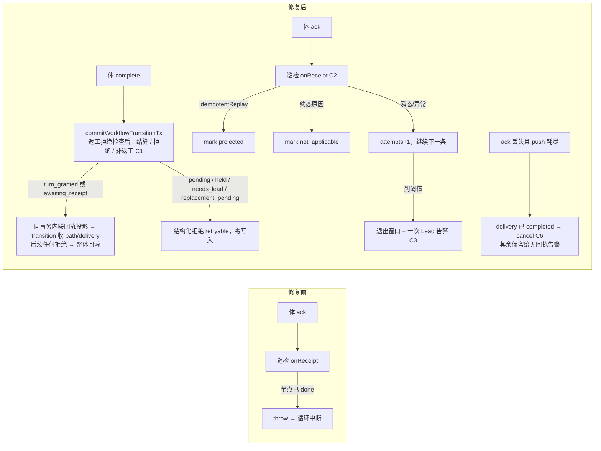

# FLY-2828 返工回执投影停摆 — 实施计划

Issue: FLY-2828 (https://linear.app/geoforge3d/issue/FLY-2828/病根-返工回执投影停摆体已-ack-但-receipt-projected-at-永不写入-delivery-卡-awaiting)
日期: 2026-09-24
基于: research.md

**Version**: v1.58.0
**Status**: draft (v5, Codex round 1–4 反馈已并入)

## 0. 目标与非目标

**目标**（对应 issue「修复要求」1–6）：

1. 根因已到行（exploration §0），本计划把它修掉：返工 activation 的体在巡检投影前完成节点时，回执不再永久投影失败；**任何**「当前返工绑定的完成」都要么把返工义务结算掉，要么被结构化拒绝——不再留下 `delivery 未结算 + node=done` 的分账（split ledger）。
2. 巡检投影循环对单条收据的失败隔离：任何一条收据都不能中断循环、不能永久占窗。
3. 每一次 `retry` 与每一次 mark 失败都有带 `wake_id` 与原因的日志。
4. 「体已 ACK、收据长期未投影」成为一次性的可见 Lead 告警；「义务已完结、CommDB 却永远 `sent`」不再产生假的「无回执」告警；**每一条故意不结算的行都有一条耐久的 Lead question**。
5. Lead 返工门与 founder 打回门共用同一个「返工已打开」谓词，完全对齐。
6. 回归测试覆盖 issue §6 四条 + 本文 §8 全部用例。

**非目标**：

* 不改通用节点完成写点 `projectGeneralizedCompletionTx`（`StateStore.ts:59048-59052`）的 CAS 语义。
* 不改 `onReconcilePatrolTick` 中 `drainTurnWakeOutbox` 之后五步的顺序或容错（exploration §3 的副作用另开单）。
* 不做线上积压 StateStore 行的自动结算。
* 不改 rework coordinator 的推进逻辑；只让它在完成先到时安全收敛（§2.5）。
* 不引入 revision-scoped 的 wake/activation 身份（Codex R4 #2/#4 的替代方案）；本单用「不接受 `pending`」与「只取消 `completed`」两条更窄的规则关掉同一批窗口。

## 1. 变更总览



| Chunk | 内容 | 主要文件 |
|-------|------|----------|
| C1 | 完成即回执：`commitWorkflowTransitionTx` 内、返工拒绝检查之后，对当前 wake 绑定做「结算 / 拒绝 / 非返工」三分；后续拒绝整体回滚 | `packages/teamlead/src/StateStore.ts` |
| C2 | 投影循环隔离 + 日志 + 终态判定 + attempts 排序/隔离 | `packages/flywheel-comm/src/db.ts`、`packages/teamlead/src/bridge/turn-wake-patrol.ts`、`packages/teamlead/src/bridge/plugin.ts` |
| C3 | 未投影收据告警车道（按 purpose 出诊断） | `packages/flywheel-comm/src/db.ts`、`turn-wake-patrol.ts` |
| C4 | 两道门共用谓词，完全对齐 | `packages/teamlead/src/StateStore.ts` |
| C6 | push 耗尽且未 ACK 的 wake：delivery 已 `completed` 才 cancel，其余保留给现有无回执告警 | `packages/flywheel-comm/src/db.ts`、`turn-wake-patrol.ts`、`StateStore.ts`（`inspectWorkflowTurnWakeRetry` 新增 completed 判定） |
| C7 | 验收脚本：部署前冻结 + 部署后校验，两个脚本 | `scripts/fly-2828-freeze-cohort.sql`、`scripts/fly-2828-verify.sql` |
| C5 | 回归测试 | 见 §8 |

实施顺序：C2 → C3 → C6 → C1 → C4 → C7，每个 chunk 先写红测试（TDD）。

## 2. C1 完成即回执

### 2.1 抽事务体（先读后写）

把 `recordWorkflowReworkWakeReceipt`（`StateStore.ts:42424-42566`）的事务内部抽成私有方法：

```ts
private projectWorkflowReworkWakeReceiptTx(input: {
  activationId: string;
  executionId: string;
  epoch: number;
  ackedAt: string;
  alertIdentity?: WorkflowEngineAlertIdentity;   // 巡检入口必传（外层校验不变）；完成入口可缺
  source: "turn_wake_receipt" | "completion_implied";
  expectedTuple?: { runId: string; nodeId: string; attempt: number };   // 完成入口传入，用于 binding/path 一致性
}):
  | { ok: true; idempotentReplay: boolean }
  | { ok: false; reason: string }
```

与现状的差异（其余逐字保留）：

1. **所有前置读取与判定移到第一条写之前**（Codex R2 #2a）。顺序：binding/turn/request/route/delivery/run/path 解析 → 身份校验 → `wake_delivered|completed` 幂等回放 → 源允许的 delivery 起始态 → 节点校验 → path 校验 → 然后才写。任何 `ok:false` 返回都发生在零写入之后。
2. **身份校验加严**（Codex R4 #3，`workflow_execution_binding.rework_request_id` 无外键 8924-8935）：除现有的 `binding.execution_id / turn.execution_id / turn.epoch / delivery.route_revision === route.revision / route.preferred_actor_execution_id` 外，新增 `request.run_id === binding.run_id`、`route.target_node_id === binding.node_id && route.target_attempt === binding.attempt`、`turn.issue_id === run.issue_id`；`expectedTuple` 存在时还要 `=== binding` 的 run/node/attempt。任一不符 → `rework_wake_receipt_identity_conflict`。
3. **path 必须恰好存在一条**（Codex R4 #3：全部生产写入点 49294/49341、49636/49692、50697/50762、65178/65250、66595/66653 都在同事务插入 path；线上 867 个 request 零缺失）：缺失 → `rework_wake_receipt_path_missing`；`state !== 'pending'` 或 `route_revision !== route.revision` 或 `current_node_id/current_attempt !== route.target_node_id/target_attempt` 或 `run_id !== request.run_id` → `rework_wake_receipt_path_conflict`。均零写入。
4. 源允许的 delivery 起始态：两个源都只接受 `awaiting_receipt`，另加 `completion_implied` 接受 `turn_granted`（理由见 §2.2）。其余 → `rework_wake_receipt_not_ready`。
5. 节点三分支：`admitted`（本 execution）→ CAS 到 `running`，改 0 行 `throw WorkflowEngineInvariantError("workflow_rework_activation_not_admitted_on_receipt")`；`running`（本 execution）→ 跳过 UPDATE；其他 → `return { ok:false, reason: "rework_wake_receipt_node_not_reserved:<state>" }`（零写入）。
6. delivery 写：`SET state='wake_delivered', owner_id=NULL, lease_expires_at=NULL … WHERE request_id=? AND route_revision=? AND state IN (<源允许的起始态>)`，改 0 行 → `rework_wake_receipt_race`。path `pending→active` CAS 改 0 行 → throw（并发）。
7. `enqueueReworkRecoveredIfAlertedTx` 只在 `alertIdentity` 存在时调用（与 64842 的 `if (input.alertIdentity)` 模式一致）。
8. 事件 uid 不变（`rework_wake_receipt:<activation_id>:<epoch>`），payload 增加 `source` 与 `impliedFromState`。

`recordWorkflowReworkWakeReceipt` 变薄封装：入参校验（含 `workflowAlertIdentityValid`）→ `transaction(projectTx)` → `save()`；返回类型不变。`not_admitted` 在巡检入口仍 throw（并发保护），由 C2 的 per-receipt try/catch 接住。

### 2.2 在 transition 内：结算 / 拒绝 / 非返工 三分（Codex R4 #1、#2）

插入点：`commitWorkflowTransitionTx` 的 `commitTransition` 闭包，`workflowReworkCompletionRefusal` 检查（`StateStore.ts:64328-64331`）之后、`priorEdges` 之前，受 `!authorityDrivenGate` 守卫（64285-64291）。锚点是 writer activation（64293 `getWorkflowActivationForAttempt({executionId, runId, nodeId, attempt})`）。

```ts
if (!authorityDrivenGate) {
  const refusal = this.workflowReworkCompletionRefusal(input);
  if (refusal) { result = refusal; return; }
  const implied = this.settleWorkflowReworkOnCompletionTx({ binding: writerActivation, input });
  if (!implied.ok) { result = implied.refusal; return; }       // 零写入；外层回滚
  impliedApplied = implied.applied;
}
```

`settleWorkflowReworkOnCompletionTx` 三分：

**(A) 非返工完成 → 无事发生**（唯一允许 `applied:false` 且继续 transition 的情形）：`writerActivation` 不存在、或 `binding.rework_request_id` 为空、或 `binding.mode !== 'wake'`（`replacement` 由 `markWorkflowReplacementStartedTx` 43657-43670 负责，`spawn` 无返工义务）。

**(B) 当前返工绑定、义务可结算 → 内联投影**：`delivery.state ∈ {turn_granted, awaiting_receipt}` 且 `delivery.route_revision === latestRoute.revision`。调用 `projectWorkflowReworkWakeReceiptTx({ …, epoch: turn.epoch, ackedAt: input.now, source: "completion_implied", expectedTuple: {runId, nodeId, attempt} })`；`ok:false` → `throw WorkflowEngineInvariantError("rework_receipt_implied_on_completion_failed:<reason>")`（§2.1 的校验已排除全部合法失败，走到这里只能是并发或数据不一致）。`turn_granted` 纳入的理由：coordinator 在 `pending→turn_granted`（`workflow-rework-coordinator.ts:790-801`）之后才 `wakeActor`（804-815）再 `turn_granted→awaiting_receipt`（830-839），体按 TURN 法则可先完成。

**(B′) 已投影 → 校验后无事发生**：`delivery.state === 'wake_delivered'`：要求 path 恰一条、`state='active'`、`route_revision === delivery.route_revision`、`current_node_id/current_attempt === input.nodeId/attempt`、`run_id === input.runId`，否则 `throw WorkflowEngineInvariantError("rework_receipt_implied_active_path_conflict")`；通过则 `applied:false` 继续（随后 64400 的 activePath 查询必命中）。`delivery.state === 'completed'` 但仍是当前 revision 的 wake 绑定：正常情况 `workflowReworkTargetRows` 已排除 completed，`workflowReworkCompletionRefusal` 不会看到它；这里同样 `applied:false`。

**(C) 当前返工绑定、义务不可结算 → 结构化拒绝，零写入**：`delivery.state ∈ {pending, replacement_pending, held, needs_lead}` 或 `delivery.route_revision !== latestRoute.revision`：返回 `{ ok:false, refusal: { ok:false, reason: "rework_delivery_not_projectable", detail: { requestId, deliveryState, routeRevision } } }`。

* `pending`：**不接受**（Codex R4 #2）。TURN 授出（`grantTurn` 754-770）与 `pending→turn_granted`（790-801）之间只隔一个同步的 `recordWorkflowActivationTurn`，但 `grantTurn` 内部有 await，完成请求可以在这个窗口进入；对 resumed revision，旧 binding/turn 仍在且 epoch 被冻结重放（db.ts 7010-7059），`grant_started_at`（44504-44515 在 `grantTurn` 之前写）不能证明当前 revision 已成功授权。拒绝后体的 `complete` 收到 409 + `retryable:true`，CLI 会重试（`complete.ts:577-583`：4xx 且 `retryable!==true` 才放弃）；coordinator 的下一行就是 `pending→turn_granted`，重试即进入 (B)。
* `held|needs_lead|replacement_pending`：义务已改道，等 Lead/replacement 处理；不允许一个迟到的完成把节点写成 `done` 而 delivery 还开着（Codex R4 #1）。既有代码对 `held + active path` 也已在 transition 后段以 `workflow_rework_delivery_complete_cas_failed` 拒绝（65482-65486），本条把拒绝提前到零写入。
* revision 落后：旧 TURN 下的完成不得结算新 revision。

拒绝走 `commitEnrolledCompletion` 现有的 `transitionRefusal` 通道（62346-62363 → 62412-62486）：外层返回 `{ ok:false, reason:"transition_refused", detail:{ transitionReason:"rework_delivery_not_projectable", … } }`，事件 `completion_transition_refused` 照现有逻辑落账；event-route 返回 409 并带 `retryable:true`（event-route 1914-1923 已透传 `retryable`；本单在该 reason 上置 `retryable:true`）。**没有 `workflow_node_completion` 行、节点不写 `done`**。

### 2.3 回滚边界（Codex R1 #2、R2 #2b、R3 #2）

* invariant → `commitWorkflowTransitionTx` 现有 catch（65709-65719）映射为 `{ ok:false, reason:"engine_invariant:<invariant>" }`，事务回滚。
* 投影之后的普通拒绝也必须回滚：

```ts
class WorkflowTransitionRollback extends Error {}
try {
  this.db.transaction(() => {                      // CompatDb.transaction(fn): void，内部已执行 this.raw.transaction(fn)()（StateStore.ts:741-746）
    commitTransition();
    if (impliedApplied && !result.ok) throw new WorkflowTransitionRollback();
  });
} catch (error) {
  if (error instanceof WorkflowTransitionRollback) { /* result 已由闭包设置；savepoint 已回滚 */ }
  else if (error instanceof WorkflowEngineInvariantError) { result = { ok:false, reason: `${ENGINE_INVARIANT_REASON_PREFIX}${error.invariant}` }; }
  else throw error;
}
```

better-sqlite3 嵌套事务即 savepoint，throw 即回滚，所以在 `commitEnrolledCompletion` 的外层事务内也成立。Codex R3/R4 已核对 `commitTransition` 闭包到 65708 之间没有内部 COMMIT/`save()`/事务边界。

### 2.4 顺序与幂等

* 完成先到（delivery `turn_granted|awaiting_receipt`）：同一 transition 事务内 delivery → `wake_delivered`、path `pending→active`、节点 → `running`；紧接着 64400 的 activePath 查询命中，transition 把 path 收成 `completed`/chained、delivery → `completed`（65458-65502、65550-65593）。CommDB 收据稍后到场 → `idempotentReplay:true`。
* 巡检先到：(B′) 校验 active path 后无事发生。
* delivery clock：`projectWorkflowDeliveryClockTx(received_at)` 只要求 attempt 行的 `received_at` 仍为 NULL；`sent_at` 缺失不影响。

### 2.5 coordinator 收敛

| coordinator 当前位置 | 它的下一步 | 结果 |
|----------------------|-----------|------|
| `grantTurn` 之后、`pending→turn_granted` 之前 | 完成被 (C) 拒绝（retryable） | coordinator 推到 `turn_granted`；体重试完成 → (B) |
| `turn_granted→awaiting_receipt`（830-839），完成已在 `turn_granted` 结算 | CAS `WHERE state='turn_granted'` 改 0 行 → `stale_delivery_owner`（44676） | `{kind:"retryable"}`；投影已清空 owner/lease（42492-42504）并同事务推到 `completed`，**下一轮** `claimWorkflowReworkDelivery` 立即 `delivery_settled`（43777-43794 → coordinator 378-389） |
| `wakeActor`（804-815）已入队但体已完成 | outbox 多一条 wake（durable） | 巡检推送 → 体 ack → idempotentReplay；或体已退出 → push 耗尽 → C6 以 `completed` cancel |

不改 coordinator 代码；T15 用 `wakeActor` 回调内调用 `commitEnrolledCompletion` 复现。

### 2.6 其他完成入口

| 入口 | 处理 |
|------|------|
| `commitEnrolledCompletion` → `commitWorkflowTransitionTx`（62346） | 三分（本节） |
| `resume_rework` hold 决议（55217-55305）：换 revision、delivery/path 回 `pending`、清 `grant_started_at`、**不新建 binding** | 随后到来的普通迟到完成 → (C) 拒绝 `pending`（T7） |
| `reconstruct_completion` hold 决议（55451-55542，`allowCompletedWriter:true`） | 走同一 transition；其 delivery 已由 hold 路径结算（55273），writer 不是当前 wake 绑定或 delivery 为 completed → (A)/(B′)；T7b 断言无 `completion_implied` 事件 |
| 62007 重放事务、62525 teardown 投影 | 不经 transition，不涉及 |

`alertIdentity`：`commitEnrolledCompletion`（61687）与 `commitWorkflowTransitionTx`（64123）都可选；生产唯一调用方 `event-route.ts:1858` 总是传入；缺省只跳过恢复告警 enqueue。

## 3. C2 投影循环隔离

### 3.1 CommDB（`packages/flywheel-comm/src/db.ts`）

**新列**（建表 DDL 280-306 与迁移 1670-1678 同步；`TurnWakeOutboxRow` 522-545 同步）：

| 列 | 类型 | 用途 |
|----|------|------|
| `projection_attempts` | `INTEGER NOT NULL DEFAULT 0` | 投影失败次数 |
| `projection_last_error` | `TEXT` | 最近一次失败/终态原因 |
| `projection_alerted_at` | `INTEGER` | C3 告警时间 |
| `projection_alert_question_id` | `TEXT` | C3 question id |

迁移照抄 1671-1678。四列可空或有默认值，旧行无需回填；旧代码忽略未知列，`ADD COLUMN` 不需要 down migration。

**方法**：

```ts
listUnprojectedTurnWakeReceipts(limit = 100, quarantineAfterAttempts = 20): TurnWakeOutboxRow[]
// WHERE state='acked' AND acked_at IS NOT NULL AND receipt_projected_at IS NULL
//   AND projection_attempts < ?
// ORDER BY projection_attempts, acked_at, wake_id LIMIT ?

markTurnWakeReceiptProjected(wakeId, projectedAtMs, disposition: "projected" | "not_applicable", reason?: string): boolean
// SET receipt_projected_at = ?, projection_last_error = (not_applicable ? reason : NULL)
// WHERE 同现状；changes === 1

recordTurnWakeReceiptProjectionAttempt(wakeId, reason, nowMs): { attempts: number } | null
// SET projection_attempts = projection_attempts + 1, projection_last_error = ?
// WHERE wake_id = ? AND state='acked' AND receipt_projected_at IS NULL；changes !== 1 → null
```

### 3.2 patrol（`turn-wake-patrol.ts:133-141`）

`onReceipt` 返回类型：

```ts
type TurnWakeReceiptOutcome =
  | { kind: "projected" }
  | { kind: "not_applicable"; reason: string }
  | { kind: "retry"; reason: string };
```

循环：

```ts
const quarantinedWakeIds = new Set<string>();
for (const receipt of db.listUnprojectedTurnWakeReceipts(maxPerProject, quarantineAfterAttempts)) {
  let outcome: TurnWakeReceiptOutcome;
  try { outcome = await input.onReceipt(receipt); }
  catch (error) { outcome = { kind: "retry", reason: `exception:${message(error)}` }; }
  if (outcome.kind === "retry") {
    const attempt = db.recordTurnWakeReceiptProjectionAttempt(receipt.wake_id, outcome.reason, nowMs);
    console.warn(`[turn-wake] receipt projection retry for ${receipt.wake_id} (${receipt.purpose}): ${outcome.reason} (attempt ${attempt?.attempts ?? "?"})`);
    if (attempt && attempt.attempts >= quarantineAfterAttempts) quarantinedWakeIds.add(receipt.wake_id);
    continue;
  }
  const marked = db.markTurnWakeReceiptProjected(receipt.wake_id, nowMs, outcome.kind, outcome.kind === "not_applicable" ? outcome.reason : undefined);
  if (!marked) console.warn(`[turn-wake] receipt projection mark failed for ${receipt.wake_id} (${outcome.kind})`);
  if (outcome.kind === "not_applicable") console.warn(`[turn-wake] receipt not applicable for ${receipt.wake_id}: ${outcome.reason}`);
}
```

* `quarantineAfterAttempts` 新入参，默认 20（巡检 60s 一轮 → 约 20 分钟）。
* 返回值增加 `receipts: { projected, notApplicable, retried, quarantined }`；现有 `pushed/alerts/cancelled` 不动。

### 3.3 handler（`plugin.ts:12858-12908`）

| 情形 | 返回 |
|------|------|
| `!receipt.activation_id \|\| acked_at === null` | `not_applicable: "legacy_or_unacked"`（现状语义） |
| `purpose` 非 rework/carrier | `not_applicable: "purpose:<purpose>"`（现状语义） |
| `!activation \|\| !run` | `retry: "activation_or_run_unresolved"`（补日志，patrol 层统一打） |
| `projected.ok` | `projected` |
| reason === `rework_wake_receipt_identity_conflict` | `not_applicable: reason`（route revision 已推进或 actor/target 换了，旧 ack 永远无效） |
| reason === `rework_wake_receipt_not_ready` 且 delivery ∈ `{held, needs_lead, replacement_pending}` | `not_applicable: "${reason}:${state}"`。证据：`held` 只能 → `replacement_pending`（43100）或 → `needs_lead`（44098）；`replacement_pending` 完成时换 revision（43193）；`held|needs_lead` 的 Lead 恢复换 revision 再回 `pending`（55252-55279）。没有同 revision 回到 `awaiting_receipt` 的路径 |
| reason === `rework_wake_receipt_not_ready` 且 delivery ∈ `{pending, turn_granted}` | `retry: reason` |
| reason ∈ {`rework_wake_receipt_node_not_reserved:*`, `rework_wake_receipt_path_conflict`, `rework_wake_receipt_path_missing`} | `retry: reason`（不看 run.status；StateStore 侧仍有未结算义务或数据不一致，走隔离 + 一次告警交 Lead 人工结算） |
| 其他 reason / 异常 | `retry` |

carrier 分支同形改造（`recordWorkflowCarrierWakeReceipt` 失败带 reason 返回 `retry`），不改其 StateStore 逻辑。

## 4. C3 未投影收据告警

`db.ts` 新增（形状照抄 `materializeTurnWakeNoReceiptAlerts` 8310-8378，同一 CommDB 事务内 `insertQuestion` + `UPDATE`）：

```ts
materializeTurnWakeUnprojectedReceiptAlerts(input: { nowMs: number; alertAfterMs: number; wakeIds?: string[] }): string[]
// WHERE w.state='acked' AND w.acked_at IS NOT NULL AND w.receipt_projected_at IS NULL
//   AND w.projection_alerted_at IS NULL AND w.acked_at <= nowMs - alertAfterMs [AND w.wake_id IN (...)]
// leadId = COALESCE(s.lead_id, l.lead_id)；无则跳过
// questionId = `turn-wake-projection-alert:${wake_id}`
// ledger = purpose === 'workflow_rework' ? 'workflow_rework_delivery (activation rework request)'
//        : purpose === 'workflow_ship_carrier' ? 'workflow_carrier_delivery (activation carrier question)'
//        : `purpose ${purpose}`
// content = `TURN wake acked but receipt never projected for ${issue_id}: ${execution_id}, epoch ${epoch}, activation ${activation_id}, wake ${wake_id}, purpose ${purpose}, attempts ${projection_attempts}, last ${projection_last_error ?? "n/a"}${alert_question_id ? `, earlier no-receipt question ${alert_question_id}` : ""}. Inspect ${ledger}.`
// UPDATE … SET projection_alerted_at=?, projection_alert_question_id=? WHERE wake_id=? AND projection_alerted_at IS NULL AND receipt_projected_at IS NULL
```

patrol 在投影循环之后：

```ts
alerts += db.materializeTurnWakeUnprojectedReceiptAlerts({ nowMs, alertAfterMs: projectionAlertAfterMs }).length;
if (quarantinedWakeIds.size) alerts += db.materializeTurnWakeUnprojectedReceiptAlerts({ nowMs, alertAfterMs: 0, wakeIds: [...quarantinedWakeIds] }).length;
```

* `projectionAlertAfterMs` 新入参，默认 15 分钟。
* 一条收据一生只发一次投影告警。
* **与现有 `turn-wake-alert:<wake>` 是两条顺序告警、不是互斥**（Codex R4 #6）：无回执告警在 `sent` 时写 `alerted_at/alert_question_id`（8334-8365），随后 ack 不清它们（8189-8193）。一条 wake 可能先有「体没 ACK」再有「ACK 了但投影不动」，两个事实都值得 Lead 看；投影告警文案引用前一条 question id。T18 覆盖 sent-alert → ACK → quarantine 的顺序。

## 5. C4 两道门共用谓词（完全对齐）

新增：

```ts
findOpenWorkflowReworkForRun(runId: string): Array<
  | { requestId: string; source: "delivery"; state: WorkflowReworkDeliveryRow["state"] }
  | { requestId: string; source: "verification_path"; state: "pending" | "active" }
>
```

SQL 即现有 Lead 门的 UNION（50563-50573），path 部分 `state IN ('pending','active')`，两侧都带出 `state`，不 `LIMIT 1`。

两道门都改成 `if (this.findOpenWorkflowReworkForRun(runId).length > 0) → rework_already_open`：

* `openOperatorRework`（50563-50577）：与现状逐字等价。
* `openPendingCarryoverFounderFeedbackTx`（66543-66554）：新增 path `pending|active` 的拒绝；错误通道不变（`throw new Error("founder feedback kickback failed: rework_already_open")`）。

**为什么没有「active 例外」**：path `active` 只由回执投影（42535）、`markWorkflowReplacementStartedTx`（43698）写入，两者同事务把 delivery 置为 `wake_delivered`；path 只在 transition 里与 delivery 一起收成 `completed`（65458-65502、65558-65578）。因此 path `active` 时 delivery 必为 `wake_delivered`（或其后的 `held`），而 founder 门**现状就拒 `wake_delivered`**。founder 打回对 active path 的 superseding 语义（`supersedingRework`，65306）属于 gate 节点 `founder_feedback_kickback` 的 transition 结果，与这道 carryover feedback 门无关。对齐后唯一的行为增量：delivery 已 `completed|held|needs_lead` 而 path 仍 `pending|active` 时 founder 门也拒——正是本 issue 的搁浅形态。

## 6. C6 push 耗尽且未 ACK 的补偿

场景：义务已完结（C1 结算或正常完成）但 CommDB 的 ACK 丢失；`claimDueTurnWake` 要求 `push_count < 2`（db.ts 8017-8027），行永远 `sent`，`materializeTurnWakeNoReceiptAlerts` 会发假的「无回执」question。

### 6.1 只取消不可逆终态（Codex R4 #4）

wake id 不含 route revision（`rework-wake-identity.ts:21-27`：`rework-wake:<requestId>:<activationId>:epoch:<epoch>`），`resume_rework`（55252-55304）与 carrier hold 复活（47489-47516）都把同一 delivery 送回 `pending` 并复用 activation/epoch → 会再 `enqueueTurnWake` 同一个 wake id；对已 `cancelled` 的行，`enqueueTurnWake` 视为幂等回放（db.ts 7939-7953），投递返回 `wake_cancelled`（wake.ts 211-232）——即取消一个可复用身份会把下一次恢复卡死。因此：

* `inspectWorkflowTurnWakeRetry` rework 分支（74024-74047）在解析 binding 后**先**判 `delivery.state === 'completed'` → `cancel: rework_obligation_completed`（新 reason）；carrier 分支（73986-74017）在 `carrier_identity_changed` 后先判 `carrier.state === 'completed'` → `cancel: carrier_obligation_completed`。其余顺序与 reason 逐字不变（`held|needs_lead|replacement_pending|pending` 仍按现状落到 `rework_obligation_settled`/`carrier_target_terminal` 等，只是 C6 不再据此取消）。`deliver`/`wait` 的可达条件不变（两者都要求 `turn_granted|awaiting_receipt`）。既有用例 `StateStore.workflow-rework.test.ts:3648`（wake_delivered → `rework_obligation_settled`）与 `StateStore.workflow-engine-transition.test.ts:2328-2337` 不受影响。
* `completed` 是唯一没有出边的 delivery 状态（rework：44536-44550 允许表无 `from: completed`；carrier 同理），所以「inspect 读到 completed → CommDB cancel」之间不存在 StateStore 侧的复活竞态。

### 6.2 patrol

`db.ts` 新增 `listExhaustedUnackedTurnWakes(nowMs, limit)`：`state='sent' AND acked_at IS NULL AND push_count >= 2 AND alerted_at IS NULL AND (claim_token IS NULL OR claim_expires_at <= ?) ORDER BY first_push_at, wake_id LIMIT ?`。

patrol 在 `materializeTurnWakeNoReceiptAlerts` **之前**：

```ts
const COMPLETED_CANCEL_REASONS = new Set(["rework_obligation_completed", "carrier_obligation_completed"]);
if (input.canDeliver) {
  for (const stale of db.listExhaustedUnackedTurnWakes(nowMs, maxPerProject)) {
    let guard;
    try { guard = await input.canDeliver(stale); }
    catch (error) { console.warn(`[turn-wake] exhausted-wake guard failed for ${stale.wake_id}: ${message(error)}`); continue; }
    if (guard.disposition === "cancel" && COMPLETED_CANCEL_REASONS.has(guard.reason ?? "")) {
      if (db.cancelTurnWake(stale.wake_id, `terminal_guard:${guard.reason}`)) cancelled += 1;
    }
  }
}
```

* 其余 disposition/reason（含 `rework_obligation_settled`、`activation_target_terminal`、`deliver`、`wait`）都**保留**给现有 `materializeTurnWakeNoReceiptAlerts`——那条 question 就是这类行的耐久记录。
* per-row try/catch，单行失败不影响后续。

## 7. C7 上线与验收（Codex R2 #5、R3 #4、R4 #5）

* 发布：`pnpm --filter flywheel-comm build` → `pnpm --filter flywheel-teamlead build` → 独立 updater 在窗口部署。CommDB 迁移在 Bridge 首次打开 `comm.db` 时自动执行。
* 两个脚本随 PR 入库；QA 在 PR body 贴两次运行的原始输出。范围限定 `workflow_run.status IN ('active','held')`：历史残骸不在本单验收范围（2026-09-24T04:29Z 快照：`completed|terminated` run 上 `pending|turn_granted|awaiting_receipt` 的 delivery 共 20 条；`pending|active` 的 path 共 103 条；查询即脚本 1 去掉 status 过滤后按 status 分组）。

**脚本 1：`scripts/fly-2828-freeze-cohort.sql`（部署前，只读 StateStore，不依赖新列）**

```bash
sqlite3 -readonly ~/.flywheel/teamlead.db < scripts/fly-2828-freeze-cohort.sql > ~/.flywheel/patrol-repairs/FLY-2828-cohort-$(date -u +%Y%m%dT%H%M%SZ).tsv
```

```sql
.mode tabs
-- 一行一个 cohort 成员：request_id, delivery_state, route_revision, run_id, run_status；第一行是 header
SELECT 'request_id','delivery_state','route_revision','run_id','run_status'
UNION ALL
SELECT d.request_id, d.state, d.route_revision, ru.run_id, ru.status
  FROM workflow_rework_delivery d
  JOIN workflow_rework_request r ON r.request_id = d.request_id
  JOIN workflow_run ru ON ru.run_id = r.run_id
 WHERE ru.project_name = 'flywheel' AND ru.status IN ('active','held')
   AND d.state IN ('pending','turn_granted','awaiting_receipt')
   AND d.updated_at <= strftime('%Y-%m-%dT%H:%M:%fZ','now','-15 minutes');
```

**脚本 2：`scripts/fly-2828-verify.sql`（部署 30 分钟后，对每个有 `turn_wake_outbox` 的 project comm.db 各跑一次；当前只有 flywheel）**

```bash
sqlite3 ~/.flywheel/comm/flywheel/comm.db \
  -cmd "ATTACH 'file:$HOME/.flywheel/teamlead.db?mode=ro' AS s" \
  -cmd "CREATE TEMP TABLE cohort(request_id TEXT, delivery_state TEXT, route_revision INTEGER, run_id TEXT, run_status TEXT)" \
  -cmd ".mode tabs" -cmd ".import --skip 1 $HOME/.flywheel/patrol-repairs/FLY-2828-cohort-<ts>.tsv cohort" \
  < scripts/fly-2828-verify.sql
```

```sql
.mode column
.headers on
-- (0) cohort 必须被导入（空 cohort 时脚本 1 也会输出 header，导入 0 行；此时 (1) 天然 0 行，但要人工确认脚本 1 的输出确实只有 header）
SELECT count(*) AS cohort_rows FROM cohort;
-- (1) cohort 中仍未结算的每一行，必须存在与当前 revision 完整身份匹配的 CommDB wake 且带 question。缺 binding / 缺 wake / 缺 question / 身份不符都以行返回。必须 0 行。
SELECT c.request_id, d.state
  FROM cohort c
  JOIN s.workflow_rework_delivery d ON d.request_id = c.request_id
 WHERE d.state IN ('pending','turn_granted','awaiting_receipt')
   AND NOT EXISTS (
     SELECT 1
       FROM s.workflow_rework_request r
       JOIN s.workflow_rework_route_revision rr ON rr.request_id = d.request_id AND rr.revision = d.route_revision
       JOIN s.workflow_execution_binding b
         ON b.rework_request_id = d.request_id AND b.run_id = r.run_id AND b.mode = 'wake'
        AND b.execution_id = rr.preferred_actor_execution_id
        AND b.node_id = rr.target_node_id AND b.attempt = rr.target_attempt
       JOIN s.workflow_activation_turn t ON t.activation_id = b.activation_id AND t.execution_id = b.execution_id
       JOIN s.workflow_run ru ON ru.run_id = r.run_id
       JOIN main.turn_wake_outbox w
         ON w.activation_id = b.activation_id AND w.execution_id = b.execution_id
        AND w.epoch = t.epoch AND w.issue_id = ru.issue_id AND w.purpose = 'workflow_rework'
      WHERE r.request_id = d.request_id
        AND COALESCE(w.projection_alert_question_id, w.alert_question_id) IS NOT NULL);
-- (2) CommDB 自身：阈值以下无积压；阈值以上必有 question。两个计数都必须 0。
SELECT count(*) AS below_threshold_backlog FROM main.turn_wake_outbox
 WHERE state='acked' AND receipt_projected_at IS NULL AND projection_attempts < 20;
SELECT count(*) AS quarantined_without_question FROM main.turn_wake_outbox
 WHERE state='acked' AND receipt_projected_at IS NULL AND projection_attempts >= 20 AND projection_alert_question_id IS NULL;
-- (3) active|held run 上「path pending 而 delivery completed」只允许 B 手工结算的白名单。必须 0 行。
SELECT p.request_id
  FROM s.workflow_rework_verification_path p
  JOIN s.workflow_rework_delivery d ON d.request_id = p.request_id
  JOIN s.workflow_run ru ON ru.run_id = p.run_id
 WHERE ru.project_name = 'flywheel' AND ru.status IN ('active','held')
   AND p.state = 'pending' AND d.state = 'completed'
   AND p.request_id NOT IN ('rework:977c3d6ee8dbaeeab2787312407580b1c81d40627c4ffa3659d84356238c37b1');
```

  白名单只有 FLY-2803 的 `rework:977c3d6ee8dbaeeab2787312407580b1c81d40627c4ffa3659d84356238c37b1`（Lead 记录：`~/.flywheel/patrol-repairs/FLY-2640__rework_delivery__20260924T010447Z__founder-authorized-01005Z-before.tsv`；FLY-2799 的 path 已在 B 中一并结算）。T17 逐字执行两个入库脚本。
* bridge 日志：出现 `receipt projection retry for <wake>` 行；不再出现 `reconcile patrol error (non-fatal): workflow_rework_activation_not_admitted_on_receipt`。
* 线上 30 条积压的预期：delivery 已 `completed` 的 12 条 → idempotentReplay 投影；节点仍 `admitted` 的 9 条 → 正常投影；其余（节点 `done` + delivery `awaiting_receipt`）→ 20 轮后隔离 + 各一条 question，由 Lead 按 FLY-2799/2803 的 B 手法逐条决定结算。

## 8. 测试（C5）

| ID | 文件 | 断言 |
|----|------|------|
| T1 积压 > 窗口 | `turn-wake-patrol.test.ts` | 25 条 acked、`maxPerProject: 5`；`onReceipt` 对 wake-1/2 永远 `retry`。第 1 轮访问 1-5（1、2 attempts=1，3-5 投影）；第 2-5 轮按 attempts 排序先访问 attempts=0 的 6-25；第 6 轮只剩 1、2（attempts=2）。断言 6 轮后 23 条 `receipt_projected_at` 非空、wake-1/2 `projection_attempts === 2`、每轮返回 `receipts` 计数 |
| T2 队首永久失败 | 同上 | `onReceipt` 对 wake-1 `throw`；同轮 wake-2 投影、返回 `retried:1`、`console.warn` 含 `wake-1` 与 `exception:`；`quarantineAfterAttempts: 3` 跑 3 轮后 wake-1 不再被列出、`projection_alerted_at` 非空、question `turn-wake-projection-alert:wake-1` 恰 1 条、内容含 `purpose workflow_rework` 与 `workflow_rework_delivery`；第 4 轮不重复告警 |
| T3 无日志分支 | 同上 | `retry:"activation_or_run_unresolved"` → warn 含 wake_id 与 reason；`markTurnWakeReceiptProjected` stub 成 false → warn `mark failed` |
| T4 not_applicable 终态 | 同上 | `not_applicable:"rework_wake_receipt_identity_conflict"` → `receipt_projected_at` 非空、`projection_last_error` 等于原因、不告警 |
| T5 两道门 | `StateStore.workflow-rework.test.ts` + `StateStore.founder-kickback-newcard-loop.test.ts` 夹具 | (a) delivery `completed` + path `pending`：Lead 拒、founder throw `rework_already_open`；(b) 活组合 delivery `wake_delivered` + path `active`：两者都拒；(c) 无 open：两者放行 |
| T6 完成先于回执 | `workflow-rework.e2e.test.ts:1040-1140` 反转 | 夹具补 `alertIdentity`；`commitEnrolledCompletion` 先 → `ok:true`；事件 `rework_wake_receipt:<activation>:<epoch>` payload `source:"completion_implied"`、`impliedFromState:"awaiting_receipt"`；path 与 delivery 末态与既有用例一致（chained/`completed`）；随后 `recordWorkflowReworkWakeReceipt` → `{ok:true, idempotentReplay:true}` |
| T7 resume_rework 后的迟到完成 | `StateStore.workflow-rework.test.ts`（hold 用例） | `resume_rework` 决议后（delivery `pending`、新 revision、旧 binding/turn）驱动**普通** `commitEnrolledCompletion` → `{ok:false, reason:"transition_refused", detail.transitionReason:"rework_delivery_not_projectable"}`；无 `workflow_node_completion` 行；node/path/delivery/events 表逐字不变 |
| T7b reconstruct_completion 不受影响 | 现有 `reconstruct_completion` 用例 | 完成不产生 `completion_implied` 事件 |
| T8 节点已 running 时巡检回执 | `StateStore.workflow-rework.test.ts` | 受控夹具：delivery 到 `awaiting_receipt` 后直接把 `workflow_run_node` 置 `running`（不经 `markWorkflowReplacementStartedTx`）→ `recordWorkflowReworkWakeReceipt` `{ok:true, idempotentReplay:false}`，不 throw |
| T9 节点已 done 时巡检回执 | 同上 | 节点 `done` + delivery `awaiting_receipt` → `{ok:false, reason:"rework_wake_receipt_node_not_reserved:done"}`，不 throw，delivery/path/事件表逐字不变 |
| T10 CommDB 迁移 | `worktree-turn.test.ts` | 旧 DDL 建库再打开 → 四列存在；排序与 quarantine 过滤；`recordTurnWakeReceiptProjectionAttempt` 对已投影行返回 null |
| T11 完成三分正负样本（全部经 `commitEnrolledCompletion`） | `StateStore.workflow-rework.test.ts` | (B) 正：delivery `turn_granted` / `awaiting_receipt` × 节点 `admitted` / `running` → `ok:true`，delivery `completed`、path 按既有 transition 末态、事件 `impliedFromState` 等于起始态。(A) 非返工：`rework_request_id` 为空 / binding `mode='replacement'` → 完成照常、无 `completion_implied` 事件、delivery 行逐字不变。(B′) `wake_delivered` + 一致的 active path → 完成照常（path/delivery 被既有 transition 收掉）；`wake_delivered` + path `current_node` 不符 → `transition_refused`/`engine_invariant:rework_receipt_implied_active_path_conflict`，零写入。(C) 拒绝：delivery `pending`（含 `grant_started_at` 非空）/ `held` / `needs_lead` / `replacement_pending` / revision 落后 → `{reason:"transition_refused", detail.transitionReason:"rework_delivery_not_projectable"}`，无 `workflow_node_completion`，所有表逐字不变。腐坏负样本：binding 指向另一 request（`run_id` 不符）/ path 缺失 / path `run_id` 或 target 不符 / turn `issue_id` 不符 → `engine_invariant:rework_receipt_implied_on_completion_failed:*`，零写入 |
| T12 拒绝通道（外层） | 同上 | (C) 与 invariant 都不得抛出到调用方；event-route 对 `rework_delivery_not_projectable` 返回 409 且 `retryable:true` |
| T13 C6 矩阵 | `turn-wake-patrol.test.ts` + `StateStore.workflow-rework.test.ts` | patrol 层（stub）：行 `sent`、`push_count=2`、`acked_at NULL`：`cancel:rework_obligation_completed` → 行 `cancelled`、`cancelled+1`、无 `turn-wake-alert:*`；`cancel:rework_obligation_settled` / `cancel:activation_target_terminal` / `deliver` / `wait`（同龄对照行）→ 行不变、照常告警一次；`canDeliver` throw → 跳过该行。StateStore 层（生产守卫）：rework `completed` → `rework_obligation_completed`；`held` → `rework_obligation_settled`；`awaiting_receipt` + 节点 `done` → `activation_target_terminal`；carrier `completed` + 终态 → `carrier_obligation_completed`；carrier `awaiting_receipt` + 终态 → `carrier_target_terminal`；既有 3648 与 2328-2337 用例不变。复活回归：`held` → `resume_rework` → `pending` 期间该 wake 从未被 cancel，随后 `enqueueTurnWake` 同 id 不是 cancelled 回放 |
| T14 carrier 隔离 | `turn-wake-patrol.test.ts` | `purpose: workflow_ship_carrier` 收据到阈值 → question 内容含 `workflow_carrier_delivery` |
| T15 coordinator 收敛 | `workflow-rework.e2e.test.ts` | `wakeActor` 回调内调用 `commitEnrolledCompletion`（delivery 此刻为 `turn_granted`）→ 完成 `ok:true`、`impliedFromState:"turn_granted"`；coordinator 本轮返回 `retryable:stale_delivery_owner`；**下一轮立即** `settled:completed`；`findOpenWorkflowReworkForRun` 为空 |
| T16 直接 transition 回滚 | `StateStore.workflow-engine-transition.test.ts` | 直接调用 `commitWorkflowTransitionTx`，构造投影成功但随后 `transition_conflict`（priorEdges）→ 返回 `{ok:false, reason:"transition_conflict"}` 且 delivery/path/节点/事件表逐字不变 |
| T17 验收脚本固化 | `workflow-rework.e2e.test.ts` | 对用例的临时 StateStore 执行**入库的** `scripts/fly-2828-freeze-cohort.sql` 生成 tsv；对迁移后的临时 CommDB 以 `ATTACH` + `.import` 执行**入库的** `scripts/fly-2828-verify.sql`（通过 better-sqlite3 逐条执行同文件的 SQL 语句；`.mode/.headers/.import` 由测试 harness 等价实现）。健康末态：(0) cohort 行数等于 tsv 行数，(1)(3) 0 行，(2) 两计数 0。三个分开的负样本：cohort 成员缺 binding / 缺 wake / 有 wake 无 question → (1) 各恰返回该行 |
| T18 顺序双告警 | `turn-wake-patrol.test.ts` | 行先在 `sent` 超时产生 `turn-wake-alert:*`，再 ack，再投影失败到阈值 → 产生 `turn-wake-projection-alert:*`，内容含前一条 question id；两条各恰 1 |

测试证据要求：PR body 贴 `pnpm --filter flywheel-comm test` 与 `pnpm --filter flywheel-teamlead test` 的汇总行（test files / tests 计数非零）；`--filter teamlead` 因包名不匹配会打印 "No projects matched" 且 exit 0，不接受。

## 9. 风险与取舍

| 取舍 | 选择 | 拒绝的替代 |
|------|------|------------|
| 修根因的位置 | transition 内、返工拒绝检查之后，锚定 writer activation；后续拒绝以回滚哨兵整体回滚 | 在 `projectGeneralizedCompletionTx:59049` 加 CAS——改通用完成语义；在 `commitEnrolledCompletion` 主事务开头插——在 transition 的 invariant 捕获之外 |
| 当前返工绑定但义务不可结算 | 结构化拒绝（retryable），零写入 | 无事发生让 transition 继续——再造分账；原子结算 held/needs_lead——绕过 Lead 决议 |
| `pending` 起始态 | 不接受；窗口只有 coordinator 一个 await，拒绝后 CLI 自动重试 | 接受 + `grant_started_at` 栅栏——不能证明当前 revision 已授 TURN；revision-scoped 身份——改三张不可变表 |
| 完成时节点 `running` | 正样本 | 当负样本无事发生——再造 `awaiting_receipt + done` |
| path 缺失 | 视为腐坏，invariant 拒绝 | 视为可选——生产写入点全部同事务插 path，缺失只能是腐坏 |
| 毒行处置 | 终态只认「旧 ack 永远无效」两类；其余 retry→隔离→一次告警 | 按 run.status 判终态——静默丢掉 StateStore 义务 |
| C6 取消范围 | 只取消 delivery `completed`（唯一无出边状态） | 取消所有非活跃态——resume 复用同一 wake id 会撞 cancelled 回放 |
| 两个告警车道 | 顺序双告警，文案互引 | 互斥/复用旧 question——隐藏第二个事实 |
| 两道门 | 完全对齐 | 保留 founder「active 例外」——本就不可达 |

## 10. 完成定义

* C1–C7 合入同一 PR；`pnpm --filter flywheel-comm test`、`pnpm --filter flywheel-teamlead test`（含 T1–T18）绿且计数非零；biome/typecheck 绿。
* PR body 附脚本 1 冻结输出与脚本 2 校验输出。
* 本文档随 PR 合入 main。
