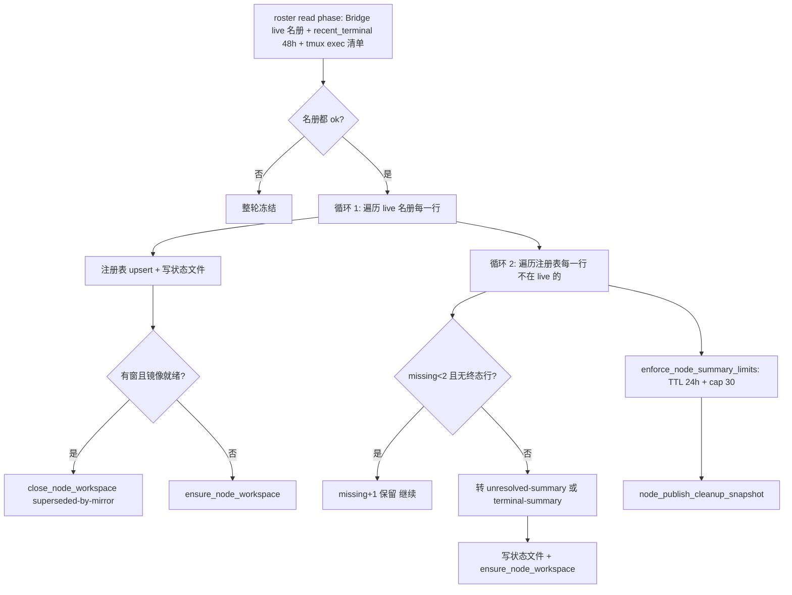

# FLY-2829 陈旧注册表批量补镜像 — 探索
Issue: FLY-2829 (https://linear.app/geoforge3d/issue/FLY-2829/病根cmux-撤维护标记后同步器照-1800-行陈旧-cmux-node-registry-给已结束会话批量补镜像-33-分钟刷出-154)
日期: 2026-09-23
基于: 无

## 0. 一句话

撤掉维护标记后，`flywheel-cmux-sync --watch` 的节点存在面（node presence）把注册表里 **1787 条 title 字段是哨兵 `-` 的历史行**逐条当成「失联摘要」去补 cmux 工作区；这些行永远铸不出 `node:` 回执，于是每轮每行都新开一个无回执的 `Terminal N` 空壳，且整轮 O(N) 慢到几小时、轮内不看维护标记、没有任何限速——四个缺口叠在一起，就是 33 分钟 154 个空壳。

## 1. 现象复盘（9-23 夜，PDT = UTC-7）

| 时刻（PDT） | 事件 | 证据 |
|---|---|---|
| 16:33:36 | 标记撤除，supervised watcher 恢复：`maintenance marker cleared; supervised watcher resuming` | `/tmp/flywheel-cmux-watcher.log` |
| 16:35:54 → 16:51:34 | 18 分钟内 **9 次** `Watch mode: event-signaled polling` 启动行，`Watcher startup evidence: reason=inefficient;exit=1` | 同上；launchd `runs = 21` |
| 16:52:29 | `maintenance cleared; watcher reacquired mutator lease` → 新 additive round `1790207553-1`（= 23:52:33Z） | 注册表 `last_ok_round` 字段 |
| 16:52 → 17:10 | 该 round 处理了 **192 行**：43 admitted/title=-、3 admitted/title=node、**146 unresolved-summary/title=-**；平均 5.6 s/行 | `awk '$6=="1790207553-1"'` 注册表 |
| 17:05:57 | Lead 放回标记，工作区数继续涨到 196 | issue 正文 |
| 17:10:46 | `--wait-for-watcher-exit` 杀掉后，新进程 `maintenance marker present; supervised watcher waiting without lease` | 日志 |
| 17:10 | 注册表定格 1800 行：1000 admitted / 701 unresolved-summary / 71 terminal-summary / 25 active-windowed / 3 active-windowless | `~/.flywheel/state/cmux-node-registry` |

日志里 **没有任何一行 cmux-sync 自己写的记录**对应这 154 次创建（`cmux_call` 只记失败，node 创建路径没有 `[audit]` 行）；能看到的只有 cmux `new-workspace` 透传到 stdout 的 `OK <UUID>`：16:53:37–16:56:30 有 18 行，16:56:30–17:10:46 有 136 行，18 + 136 = 154，两段之间没有任何其他日志行。node 账本文件 16:54 之后再没变过（18 行），而后面还有 136 次创建——与 §2.3「无回执」完全吻合。

**这不是第一次。** `cmux-maintenance.saved`（9-20）：`lead-hold: runaway node-status page creation (77->138 in 10m) 2026-09-20T23:2xZ`。时间线：FLY-1884（8-21）上线后 tmux inventory 用 TAB 分隔、生产 tmux 3.7c 把 TAB 打成 `_`，`reconcile_node_presence` 在入口静默 return，注册表只进不出（9-16 已 1645 行、全部 `admitted`）；FLY-2656（9-18 合入）修了分隔符，节点分类第一次真正跑起来，其 research 已警告「补账会创建/刷新 node summary、执行 summary TTL/cap」；9-20 第一次刷屏 → 挂标记；FLY-2770（9-23）修另一条路径；9-23 撤标记 → 第二次刷屏。`cmux-cleanup-snapshot` 自 8-25 起再没更新过——因为发布快照是 round 的最后一步，而 round 从来没走完过；这也是日志里 7275 行 `Node-presence fence waiting for a newer complete classification` 的来源。

## 2. 机制解剖

### 2.1 节点存在面的三本账

FLY-1884 引入的「执行级存在面」：一个 runner execution 即使暂时/永久没有本地 tmux 窗，也在 cmux 里占一个 `node:<alias>·<hash>` 工作区，里面跑 `flywheel-node-status.sh` 循环 `cat` 一个状态文件。

| 文件 | 键 | 行格式 | 谁写 |
|---|---|---|---|
| `~/.flywheel/state/cmux-node-registry` | `execution_id` | `exec_id\|title\|alias\|state\|last_seen\|last_ok_round\|windowed\|windowless\|missing\|summary\|last_mirror_title\|classification_round\|terminal_epoch`（13 列） | `admit_node_identity_for_window`（窗口路径，title=`-`）、`reconcile_node_presence` |
| `~/.flywheel/state/cmux-node-ledger` | `(generation, ref)` | `prepared\|committed \| generation \| workspace:N \| exec_id \| node:title` | `_node_ledger_transaction`（要求 `title == node:*`） |
| `~/.flywheel/state/cmux-node-status/<sha256(exec)>.status` | exec | 人读状态文本 | `node_write_status_file` |

state 枚举：`admitted`（首见活源铸的最小行，title/alias 为哨兵 `-`）→ `active-windowed` / `active-windowless`（连续 2 轮同向观测）→ `unresolved-summary`（连续 2 轮不在 live 名册且无终态证据）/ `terminal-summary`（recent_terminal 48h 内有精确终态行）。

### 2.2 `reconcile_node_presence` 每轮做什么（`scripts/flywheel-cmux-sync.sh:2199`）

关键顺序：**先为每一行建工作区，最后才执行 TTL/cap 回收**。注册表 1800 行时，循环 2 要走完 1800 行才轮到回收——而这一轮从没走完过。

### 2.3 病根 A：title=`-` 的行永远铸不出回执 → 无回执空壳

`ensure_node_workspace exec "-" status_file`（`:2071`）的执行路径：

1. `_node_workspace_guard`（REQUIRE_ABSENT=1）：数 cmux 里 title ∈ {`-`, `<status command>`} 的工作区 → 0（空壳的 title 是 `Terminal N`，不匹配）→ 放行；
2. `cmux new-workspace --command …` → cmux 新建，默认标题 `Terminal N`；
3. `_node_ledger_upsert prepared … "-"` → `_node_ledger_transaction` 校验 `[[ "$title" == node:* ]]` **失败，return 1**；
4. 工作区留在 cmux，**账本零行、注册表 title 仍是 `-`**；
5. 下一轮同一行：步骤 1 又数到 0 → 再建一个。

证据：

- 注册表 state × title 矩阵：`admitted` 987 行 title=`-`、`unresolved-summary` 700 行 title=`-`、`terminal-summary` 71 行 title=`-`；只有 **18 行**有 `node:` title；
- node 账本恰好 18 行，逐一对应那 18 个 `node:` 行（10 committed / 8 prepared）；
- 事故 round 处理的 192 行里 146 行是 `unresolved-summary/title=-`，与「154 个空壳」数量级一致（差额来自同轮内被重启的 watcher 重复处理）。

**为什么会有 title=`-` 的行**：`admit_node_identity_for_window`（`:1345`）在窗口路径首见一个带 `@flywheel_exec_id` 的 tmux 窗时写最小行，title/alias 写哨兵 `-`。FLY-1884 plan §5.4 写的是「authority title/物理键留到首次建 node tab 时铸」，但 `reconcile_node_presence` 只在**注册表里没有该行**（`else` 分支 `:2237`）时调用 `node_allocate_authority_title`；已存在的 admitted 行走 `if [[ -n "$old" ]]` 分支，title 原样带下去。也就是说**任何先有窗后失窗的 execution 都会掉进这个坑**，与注册表新旧无关；只是陈旧注册表把它放大了 1000 倍。

### 2.4 病根 B：注册表只增不减，回收放在轮末

- `admitted` 行进入循环 2 时 `missing` 从 0 走到 2 需要两轮；1000 行 admitted 里 785 行 `missing=1` 停在 9-19 那一轮——它们是**定时炸弹**：下一次完整 round 就全部转 `unresolved-summary` 并各建一个空壳；
- `enforce_node_summary_limits`（TTL 24h、cap 30）在循环 2 **之后**才跑；`gc_node_summary` 对无回执行只删注册行+状态文件（`close_node_workspace` 找不到 committed ref 直接 return 0），空壳本身留在 cmux；
- 每行 `node_registry_upsert_row` 都 python 校验 + awk 重写全文件（1800 行约 20 ms），加上 `ensure_node_workspace` 内部先 `reconcile_node_ledger`（对账本每个 prepared 行重试一次 rename，每次都是 cmux 调用，超时 20 s），单行 5.6 s，整轮 ≈ 2.8 小时；
- recent_terminal 只看 48 h，超过 48 h 结束的会话永远拿不到终态证据，只能以 `unresolved-summary`（失联）身份存在；`unresolved-summary` 的 TTL 从 `terminal_epoch`（**转态那一刻**，不是会话结束时刻）起算，所以 20 天前结束的会话在今天转态后还要再活 24 h。

### 2.5 病根 C：轮内不读维护标记

标记读取点（都在）：`--watch` 入口 `maintenance_entry_allowed`、每 tick 顶部 `watcher_maintenance_checkpoint`、`sync_additive` 首行 `maintenance_requested && return 0`、`sync_additive` 各相位之间的 `watcher_mutation_latch_clear`。**缺的**是 `reconcile_node_presence` 两个 for 循环内部：一进循环，1800 行走完之前不会再看标记。17:05:57 放回标记后一直刷到 17:10 被 kill，正是这个窗口。脚本头注释「the lease, not the marker, is the exclusion」描述的是 `--refresh` 与 watcher 之间的互斥，不是「watcher 不读标记」；issue 里「只在启动时读」是从表现反推的，实际是**粒度太粗**。

### 2.6 放大器：watcher 重启风暴 + 多进程交错

- 16:35–16:52 有 9 次 `Watch mode` 启动、launchd `runs = 21`、`exit=1`；每次重启都跑 `sync_additive_bootstrap → reconcile_node_presence`，**从注册表顶部重走**——顶部的 admitted 行每重启一次 `missing` +1，unresolved 行每重启一次再建一个空壳；
- 日志时间戳非单调（16:48:06 后出现 16:43:29），说明多个 `--watch` 进程同时在写日志（Lead 标记里记的「3 concurrent --watch procs」）；FLY-129 租约保证同一时刻只有一个在 mutate，但 supervised 等待者拿到租约后又是一次从头 bootstrap；
- 重启原因不在本单范围（`exit=1` 紧跟 `attachment_unverified … reason=no-post-create-client` 之后，属 FLY-2207 watcher 生命周期/FLY-2770 attach 范畴），但本单的限速护栏必须**跨重启持久**，否则重启风暴会把每进程预算乘起来。

### 2.7 为什么 FLY-2770 挡不住

FLY-2770 修的是「已经有 prepared 回执的工作区因为默认标题 `Terminal N` 而卡在 title migration」——它让 `_node_workspace_guard` 的 prepared 分支接受 `Terminal N`。本单的空壳**根本没有回执**（账本 upsert 在 title 校验处就拒了），FLY-2770 的 migration 机器看不见它们；`reap_ghost_workspaces` / `reap_unledgered_stock_workspaces` / orphan-pin 清扫按 FLY-1884 §5.1 的设计「天然不认识 node 命名空间」，对 `Terminal N` 无回执壳也没有清扫权（它们不是 managed runner title，也不是 stock raw 语法）。所以空壳只能人手 `cmux close-workspace`。

### 2.8 为什么 4 分 40 秒和 QA 都看不出来

- 撤标记后前 4 分钟工作区只从 58 涨到 60：那是 16:33:36 那个进程的 bootstrap round 在走注册表**前 43 行 admitted**（`missing` 0→1，不建工作区），加上重启风暴不断打断；真正连续走到 unresolved 段落是 16:52 之后；
- FLY-2770 的 QA 用的是小注册表，`reconcile_node_presence` 一轮几秒就走完，TTL/cap 回收也跟着跑完，看不到「回收永远轮不到」；
- 「必须重启才能发现」不成立：只要注册表里有 title=`-` 的 unresolved 行，任何一次完整 round 都会建空壳；只是完整 round 要在撤标记且进程活过 20 分钟才发生。

## 3. 修复方向（对应 issue 的 5 条要求）

| # | 要求 | 候选 | 推荐 |
|---|---|---|---|
| 1 | 注册表能收缩 | (a) 轮末回收提前到轮首；(b) 轮首按年龄剪枝：不在 live 名册且 `last_seen` 超过 TTL 的行直接删（无回执行零 cmux 调用；有 committed 回执的走 guarded close）；(c) 只加 cap | **(a)+(b)**：回收/剪枝在任何 create 之前跑，且不依赖走完全表 |
| 2 | 不给已结束会话建镜像 | (a) 每行再查一次 Bridge `/sessions/:id`；(b) 循环 2 一律不再 `ensure_node_workspace`，只更新状态文件/注册表，已存在的 node tab 就地转摘要；(c) 只对 recent_terminal 精确命中的行建摘要 tab | **(b)**：live 名册就是「真实存活」的唯一真相，不在 live 里的行本轮零创建；已存在 tab 转『已结束/失联』由 TTL/cap 回收。此举撤掉 FLY-1884「事后补建摘要 tab」这一功能点（待 Lead 确认，见 §4） |
| 2' | title=`-` 行的负向护栏 | `ensure_node_workspace` 入口拒绝 `title != node:*`（在任何 cmux 调用之前）；循环 1 里对 admitted 行补铸 authority title | **两者都做**：前者保证「无回执空壳」结构性不可能，后者让先有窗后失窗的活 execution 仍能得到 node tab |
| 3 | 运行中响应标记 | 在 `reconcile_node_presence` 两个循环每次迭代前 `watcher_mutation_latch_clear \|\| return 0`（复用现有 latch，标记/QA claim/ops claim 三者一致） | 采用；同时轮首也过一次 |
| 4 | 失控护栏 | (a) 每轮 node 创建预算（默认 10）；(b) 跨进程持久的滚动窗口计数（`~/.flywheel/state/cmux-node-create-budget`，10 分钟窗口 ≥ 40 → 自停）；(c) cmux 工作区总数上限 | **(a)+(b)**：预算耗尽 → 本轮不再建 + 一次告警；滚动窗口超限 → 写自停闩 `cmux-node-runaway`（reconcile 见闩即零创建）+ 告警，操作员清闩恢复。(c) 作为附加的绝对上限（默认 150）便宜且直观，一并做 |
| 5 | 验收 | hermetic soak harness（cmux PATH shim + 私有 tmux socket + fixture Bridge）用生产注册表副本跑真 `--watch` ≥30 min；阴性对照跑修复前 commit；上线后生产 cmux 再观察 30 min 作为永久撤标记的门 | 采用（待 Lead 确认） |

另加两条观测性：每次 node 工作区创建/关闭写一行 `[audit] node …` 日志（现在是静默的）；每轮结束记一行 `node presence round: created=N closed=N pruned=N skipped_budget=N`。

## 4. 待 Lead 确认（非阻塞，已通过 flywheel-comm ask 发出，question 0b2630d8）

1. 是否接受「不在 live 名册的会话零新建」——即去掉 FLY-1884 的事后补建『已结束』摘要 tab；只有已存在的 node tab 才转摘要并按 TTL/cap 回收。
2. 验收第 5 条用 hermetic soak harness + 生产注册表副本，阴性对照跑修复前 commit；生产 cmux 的 30 分钟观察作为上线后、永久撤标记前的最后一道门。

## 5. 非目标 / 边界

- 不修 watcher 重启风暴本身（`exit=1` 的原因，FLY-2207/FLY-2770 范畴），只保证本单护栏跨重启持久；
- 不改 FLY-2770 的 title migration / prepared stall 机器；有 prepared 回执的 `Terminal N` 仍由它处理；
- 不动 view ledger / mirror 清扫（FLY-1884 §5.1 的命名空间隔离保持）；
- 不改 Bridge API（现有 `mode=live` / `mode=recent_terminal` 足够）；
- 不做历史空壳的自动清扫（已人手清完；无回执壳的清扫权归属另议）；
- 维护标记的永久撤除是上线后 Lead 的动作，不在本单代码内。

## 6. 风险

- 「零新建」会让从未有过本地窗的 remote/headless execution 在结束后**没有**『已结束』tab（它活着时有）；founder 可见性靠 Bridge/Discord，不靠 cmux；
- 轮首剪枝依赖 live 名册 `ok`；名册 indeterminate 时整轮冻结（现有语义），不会误删；
- 自停闩是新的人工介入点，需要在告警文案里写清怎么清；
- 现网注册表 1800 行在修复上线后的第一轮会被剪掉约 1700 行——这是预期行为，plan 里要写成可回滚（剪枝前备份一份 `cmux-node-registry.pre-FLY-2829`）。
